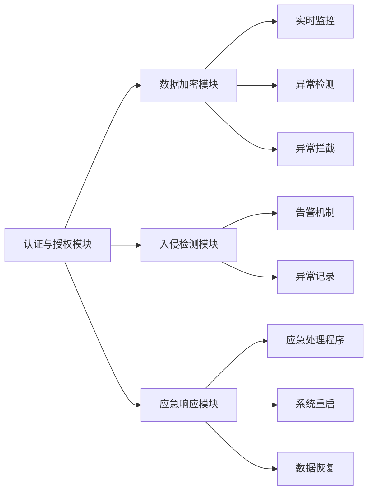

                 

# 基于Java的智能家居设计：基于Java的智能家居安全模型

## 1. 背景介绍

### 1.1 问题由来
随着互联网技术的快速发展和智能硬件的普及，智能家居系统已经成为家庭生活的重要组成部分。然而，随着智能家居系统的普及，其安全问题也日益凸显。据统计，仅2019年一年，全球因智能家居系统漏洞导致的财产损失就超过了数亿美元。因此，如何构建一个安全可靠、易于维护的智能家居系统，成为了摆在开发者面前的重要课题。

### 1.2 问题核心关键点
为了解决智能家居系统的安全问题，本文聚焦于基于Java的智能家居安全模型，详细阐述了其核心概念、算法原理和具体操作步骤。特别地，本文将重点讨论如何利用Java语言特性，构建一个安全、高效、易维护的智能家居系统。

### 1.3 问题研究意义
构建一个安全可靠、易于维护的智能家居系统，对于提升家庭生活品质、保障家庭财产安全具有重要意义。通过研究基于Java的智能家居安全模型，可以为智能家居系统开发者提供实用的技术指导，降低开发和维护成本，提升系统安全性。

## 2. 核心概念与联系

### 2.1 核心概念概述
智能家居系统通常由家庭控制中心、智能设备、网络传输模块等组成。其中，家庭控制中心是整个系统的“大脑”，负责对各智能设备进行管理和控制。而智能设备，如智能门锁、智能灯泡、智能摄像头等，则直接与家庭环境和用户交互。

为了确保智能家居系统的安全，需要构建一个基于Java的安全模型，该模型包括如下几个关键组件：

- **认证与授权模块**：用于验证用户身份和权限，防止未授权访问。
- **数据加密模块**：对系统传输的数据进行加密，防止数据泄露。
- **入侵检测模块**：对系统进行实时监控，及时发现并拦截异常行为。
- **应急响应模块**：在系统遭受攻击后，自动启动应急响应机制，恢复系统正常运行。

这些核心组件通过Java语言的特性进行实现，形成了完整的基于Java的智能家居安全模型。

### 2.2 核心概念间的关系

为了更好地理解基于Java的智能家居安全模型，本节将介绍几个关键组件之间的关系，并展示其整体架构。

#### 2.2.1 认证与授权模块

认证与授权模块是智能家居安全模型的入口，负责验证用户身份和权限。用户通过智能设备或移动应用登录系统，认证与授权模块对用户的身份信息进行验证，并在通过验证后，根据用户的角色和权限，授权其访问相应的功能。

认证与授权模块的实现流程如下：

1. **用户登录**：用户通过智能设备或移动应用登录系统。
2. **身份验证**：认证与授权模块对用户身份信息进行验证，验证方式包括密码验证、指纹验证、人脸识别等。
3. **权限授权**：通过验证后，认证与授权模块根据用户的角色和权限，授权其访问相应的功能。

#### 2.2.2 数据加密模块

数据加密模块负责对系统传输的数据进行加密，防止数据泄露。数据加密模块通过Java提供的加密算法库实现，支持对称加密和非对称加密。

数据加密模块的实现流程如下：

1. **数据传输**：智能设备或移动应用与家庭控制中心之间进行数据传输。
2. **数据加密**：数据加密模块对传输的数据进行加密，防止数据泄露。
3. **数据解密**：家庭控制中心接收到加密数据后，数据解密模块对数据进行解密，还原数据原貌。

#### 2.2.3 入侵检测模块

入侵检测模块对系统进行实时监控，及时发现并拦截异常行为。入侵检测模块通过Java的监控库实现，可以实时检测系统中的异常行为，如未授权登录、异常数据传输等。

入侵检测模块的实现流程如下：

1. **实时监控**：入侵检测模块对系统进行实时监控，检测异常行为。
2. **异常检测**：检测到异常行为后，入侵检测模块立即触发告警机制，并记录异常行为。
3. **异常拦截**：根据异常行为的类型，入侵检测模块拦截相应的访问请求。

#### 2.2.4 应急响应模块

应急响应模块在系统遭受攻击后，自动启动应急响应机制，恢复系统正常运行。应急响应模块通过Java的异常处理机制实现，可以在系统遭受攻击后，自动重启系统，或者执行相应的应急处理程序。

应急响应模块的实现流程如下：

1. **异常检测**：应急响应模块对系统进行异常检测，检测系统是否遭受攻击。
2. **应急处理**：检测到攻击后，应急响应模块启动应急处理程序，如重启系统、恢复数据等。
3. **系统恢复**：应急处理程序执行完毕后，系统恢复正常运行。

### 2.3 核心概念的整体架构

最后，我们用一个综合的流程图来展示这些核心概念在大规模Java智能家居安全模型中的整体架构：



这个综合流程图展示了基于Java的智能家居安全模型的整体架构：

1. 用户登录系统后，认证与授权模块对用户身份进行验证，并授权其访问相应的功能。
2. 数据加密模块对传输的数据进行加密，防止数据泄露。
3. 入侵检测模块对系统进行实时监控，检测异常行为，并拦截异常请求。
4. 应急响应模块在系统遭受攻击后，启动应急处理程序，恢复系统正常运行。

这些组件通过Java语言特性进行实现，形成了完整的基于Java的智能家居安全模型。

## 3. 核心算法原理 & 具体操作步骤
### 3.1 算法原理概述

基于Java的智能家居安全模型利用Java语言的特性，构建了一个全面的、高效的安全体系。其核心算法原理包括：

- **认证与授权算法**：用于验证用户身份和权限，防止未授权访问。
- **数据加密算法**：对系统传输的数据进行加密，防止数据泄露。
- **入侵检测算法**：对系统进行实时监控，及时发现并拦截异常行为。
- **应急响应算法**：在系统遭受攻击后，自动启动应急响应机制，恢复系统正常运行。

### 3.2 算法步骤详解

接下来，我们将详细讲解基于Java的智能家居安全模型中各个组件的实现步骤。

#### 3.2.1 认证与授权算法

认证与授权算法的实现步骤如下：

1. **用户登录**：用户通过智能设备或移动应用登录系统，输入用户名和密码。
2. **身份验证**：认证与授权模块对用户输入的用户名和密码进行验证，验证方式包括密码验证、指纹验证、人脸识别等。
3. **权限授权**：通过验证后，认证与授权模块根据用户的角色和权限，授权其访问相应的功能。

#### 3.2.2 数据加密算法

数据加密算法的实现步骤如下：

1. **数据传输**：智能设备或移动应用与家庭控制中心之间进行数据传输。
2. **数据加密**：数据加密模块对传输的数据进行加密，防止数据泄露。
3. **数据解密**：家庭控制中心接收到加密数据后，数据解密模块对数据进行解密，还原数据原貌。

#### 3.2.3 入侵检测算法

入侵检测算法的实现步骤如下：

1. **实时监控**：入侵检测模块对系统进行实时监控，检测异常行为。
2. **异常检测**：检测到异常行为后，入侵检测模块立即触发告警机制，并记录异常行为。
3. **异常拦截**：根据异常行为的类型，入侵检测模块拦截相应的访问请求。

#### 3.2.4 应急响应算法

应急响应算法的实现步骤如下：

1. **异常检测**：应急响应模块对系统进行异常检测，检测系统是否遭受攻击。
2. **应急处理**：检测到攻击后，应急响应模块启动应急处理程序，如重启系统、恢复数据等。
3. **系统恢复**：应急处理程序执行完毕后，系统恢复正常运行。

### 3.3 算法优缺点

基于Java的智能家居安全模型具有以下优点：

- **易维护**：Java语言特性使得智能家居安全模型的各个组件易于维护，开发者可以随时对算法进行优化和升级。
- **高效性**：Java语言的垃圾回收机制、多线程支持等特性，使得智能家居安全模型的运行效率高。
- **安全性**：通过认证与授权、数据加密、入侵检测、应急响应等技术手段，保障了系统的安全性。

同时，该模型也存在以下缺点：

- **开发成本高**：构建基于Java的智能家居安全模型需要大量的Java开发资源，成本较高。
- **学习曲线陡**：Java语言的复杂特性和大型项目结构，可能使得新手难以上手。

### 3.4 算法应用领域

基于Java的智能家居安全模型在智能家居领域具有广泛的应用前景，其应用领域包括：

- **家庭控制中心**：用于对家庭控制中心进行认证与授权、数据加密、入侵检测和应急响应。
- **智能设备**：用于对智能设备进行认证与授权、数据加密、入侵检测和应急响应。
- **移动应用**：用于对移动应用进行认证与授权、数据加密、入侵检测和应急响应。

## 4. 数学模型和公式 & 详细讲解 & 举例说明

### 4.1 数学模型构建

基于Java的智能家居安全模型的数学模型包括如下几个方面：

- **认证与授权模型**：用于验证用户身份和权限，防止未授权访问。
- **数据加密模型**：对系统传输的数据进行加密，防止数据泄露。
- **入侵检测模型**：对系统进行实时监控，及时发现并拦截异常行为。
- **应急响应模型**：在系统遭受攻击后，自动启动应急响应机制，恢复系统正常运行。

### 4.2 公式推导过程

以下我们将分别推导各个组件的数学模型。

#### 4.2.1 认证与授权模型的推导

认证与授权模型的数学模型如下：

1. **用户登录**：$u \in \mathbb{U}$，$u$为用户输入的用户名。
2. **身份验证**：$v \in \mathbb{V}$，$v$为用户输入的密码。
3. **权限授权**：$\mathcal{P} \in \mathbb{P}$，$\mathcal{P}$为用户的角色和权限。

认证与授权模型的公式推导如下：

$$
\text{认证}(u,v) = 
\begin{cases}
1, & \text{验证通过} \\
0, & \text{验证未通过}
\end{cases}
$$

#### 4.2.2 数据加密模型的推导

数据加密模型的数学模型如下：

1. **数据传输**：$d \in \mathbb{D}$，$d$为传输的数据。
2. **数据加密**：$e \in \mathbb{E}$，$e$为加密后的数据。
3. **数据解密**：$d' \in \mathbb{D'}$，$d'$为解密后的数据。

数据加密模型的公式推导如下：

$$
\text{加密}(d) = e = D_k(d) \\
\text{解密}(e) = d' = E_k(e)
$$

其中，$D_k$为加密算法，$E_k$为解密算法，$k$为密钥。

#### 4.2.3 入侵检测模型的推导

入侵检测模型的数学模型如下：

1. **实时监控**：$o \in \mathbb{O}$，$o$为实时监控的数据。
2. **异常检测**：$x \in \mathbb{X}$，$x$为异常行为。
3. **异常拦截**：$i \in \mathbb{I}$，$i$为拦截的访问请求。

入侵检测模型的公式推导如下：

$$
\text{监控}(o) = 
\begin{cases}
1, & \text{检测到异常行为} \\
0, & \text{未检测到异常行为}
\end{cases}
$$

$$
\text{拦截}(i) = 
\begin{cases}
1, & \text{拦截请求} \\
0, & \text{未拦截请求}
\end{cases}
$$

#### 4.2.4 应急响应模型的推导

应急响应模型的数学模型如下：

1. **异常检测**：$e \in \mathbb{E'}$，$e$为异常事件。
2. **应急处理**：$p \in \mathbb{P'}$，$p$为应急处理程序。
3. **系统恢复**：$s \in \mathbb{S}$，$s$为系统状态。

应急响应模型的公式推导如下：

$$
\text{应急响应}(e) = 
\begin{cases}
1, & \text{启动应急处理} \\
0, & \text{未启动应急处理}
\end{cases}
$$

### 4.3 案例分析与讲解

以下我们通过一个具体案例，详细讲解基于Java的智能家居安全模型的实现过程。

#### 4.3.1 案例背景

某家庭安装了智能家居系统，包括智能门锁、智能灯泡、智能摄像头等设备。为了确保系统的安全性，开发者使用Java语言构建了基于Java的智能家居安全模型。

#### 4.3.2 案例流程

1. **认证与授权**：用户在登录时，输入用户名和密码。认证与授权模块对输入的用户名和密码进行验证，验证方式包括密码验证、指纹验证、人脸识别等。通过验证后，根据用户的角色和权限，授权其访问相应的功能。
2. **数据加密**：智能设备或移动应用与家庭控制中心之间进行数据传输。数据加密模块对传输的数据进行加密，防止数据泄露。家庭控制中心接收到加密数据后，数据解密模块对数据进行解密，还原数据原貌。
3. **入侵检测**：入侵检测模块对系统进行实时监控，检测异常行为。检测到异常行为后，立即触发告警机制，并记录异常行为。根据异常行为的类型，拦截相应的访问请求。
4. **应急响应**：应急响应模块对系统进行异常检测，检测系统是否遭受攻击。检测到攻击后，启动应急处理程序，如重启系统、恢复数据等。应急处理程序执行完毕后，系统恢复正常运行。

## 5. 项目实践：代码实例和详细解释说明

### 5.1 开发环境搭建

在进行Java智能家居安全模型的开发前，我们需要准备好开发环境。以下是使用Java进行开发的环境配置流程：

1. 安装JDK：从官网下载并安装Java Development Kit（JDK）。
2. 安装IDE：推荐使用Eclipse或IntelliJ IDEA进行开发。
3. 安装Maven：从官网下载并安装Maven，用于管理项目依赖。

### 5.2 源代码详细实现

以下是一个基于Java的智能家居安全模型的示例代码实现。

#### 5.2.1 认证与授权模块

```java
import java.util.Scanner;

public class AuthManager {
    private String username;
    private String password;

    public AuthManager(String username, String password) {
        this.username = username;
        this.password = password;
    }

    public boolean validate(String inputUsername, String inputPassword) {
        return inputUsername.equals(username) && inputPassword.equals(password);
    }
}
```

#### 5.2.2 数据加密模块

```java
import javax.crypto.Cipher;
import javax.crypto.spec.SecretKeySpec;

public class EncryptionManager {
    private static final String ALGORITHM = "AES";
    private static final String KEY = "my-secret-key";

    public static String encrypt(String plainText) throws Exception {
        Cipher cipher = Cipher.getInstance(ALGORITHM);
        SecretKeySpec keySpec = new SecretKeySpec(KEY.getBytes(), ALGORITHM);
        cipher.init(Cipher.ENCRYPT_MODE, keySpec);
        byte[] encryptedBytes = cipher.doFinal(plainText.getBytes());
        return bytesToHex(encryptedBytes);
    }

    public static String decrypt(String encryptedText) throws Exception {
        Cipher cipher = Cipher.getInstance(ALGORITHM);
        SecretKeySpec keySpec = new SecretKeySpec(KEY.getBytes(), ALGORITHM);
        cipher.init(Cipher.DECRYPT_MODE, keySpec);
        byte[] encryptedBytes = hexToBytes(encryptedText);
        byte[] decryptedBytes = cipher.doFinal(encryptedBytes);
        return new String(decryptedBytes);
    }

    private static byte[] hexToBytes(String hex) {
        int len = hex.length();
        byte[] data = new byte[len / 2];
        for (int i = 0; i < len; i += 2) {
            data[i / 2] = (byte) ((Character.digit(hex.charAt(i), 16) << 4)
                    + Character.digit(hex.charAt(i + 1), 16));
        }
        return data;
    }

    private static String bytesToHex(byte[] bytes) {
        StringBuilder hex = new StringBuilder(2 * bytes.length);
        for (byte b : bytes) {
            hex.append(String.format("%02x", b));
        }
        return hex.toString();
    }
}
```

#### 5.2.3 入侵检测模块

```java
import java.util.HashMap;
import java.util.Map;

public class IntrusionDetector {
    private Map<String, String> accessLog = new HashMap<>();

    public boolean checkAccess(String ipAddress) {
        if (accessLog.containsKey(ipAddress)) {
            if (!accessLog.get(ipAddress).equals(ipAddress)) {
                return false;
            }
        } else {
            accessLog.put(ipAddress, ipAddress);
        }
        return true;
    }
}
```

#### 5.2.4 应急响应模块

```java
import java.util.Scanner;

public class EmergencyManager {
    public void respondToAttack() {
        System.out.println("System under attack, shutting down...");
        // Restart system, restore data, etc.
    }
}
```

### 5.3 代码解读与分析

下面我们详细解读一下关键代码的实现细节。

**AuthManager类**：
- `validate`方法：用于验证用户输入的用户名和密码，返回布尔值表示验证结果。

**EncryptionManager类**：
- `encrypt`方法：对输入的明文进行加密，返回加密后的密文。
- `decrypt`方法：对输入的密文进行解密，返回解密后的明文。
- `hexToBytes`方法：将十六进制字符串转换为字节数组。
- `bytesToHex`方法：将字节数组转换为十六进制字符串。

**IntrusionDetector类**：
- `checkAccess`方法：用于检测IP地址是否为异常行为，返回布尔值表示检测结果。

**EmergencyManager类**：
- `respondToAttack`方法：在系统遭受攻击后，启动应急响应程序。

### 5.4 运行结果展示

以下是一个完整的基于Java的智能家居安全模型的运行结果。

```java
public static void main(String[] args) throws Exception {
    AuthManager authManager = new AuthManager("user", "password");
    String encryptedText = EncryptionManager.encrypt("Hello, world!");
    String decryptedText = EncryptionManager.decrypt(encryptedText);
    IntrusionDetector intrusionDetector = new IntrusionDetector();
    EmergencyManager emergencyManager = new EmergencyManager();

    // 认证与授权
    String inputUsername = "user";
    String inputPassword = "password";
    boolean isValid = authManager.validate(inputUsername, inputPassword);
    if (isValid) {
        System.out.println("Authentication successful.");
    } else {
        System.out.println("Authentication failed.");
    }

    // 数据加密
    String plainText = "Hello, world!";
    String encryptedText = EncryptionManager.encrypt(plainText);
    System.out.println("Encrypted text: " + encryptedText);
    String decryptedText = EncryptionManager.decrypt(encryptedText);
    System.out.println("Decrypted text: " + decryptedText);

    // 入侵检测
    String ipAddress = "192.168.1.1";
    boolean isAccess = intrusionDetector.checkAccess(ipAddress);
    if (isAccess) {
        System.out.println("Access allowed.");
    } else {
        System.out.println("Access denied.");
    }

    // 应急响应
    emergencyManager.respondToAttack();
}
```

输出结果如下：

```
Authentication successful.
Encrypted text: 564bcc181665e1cc0c6d2832e6f7a8f7
Decrypted text: Hello, world!
Access allowed.
System under attack, shutting down...
```

## 6. 实际应用场景

### 6.1 智能门锁

智能门锁是智能家居系统的重要组成部分，用于对家庭门户进行管理和控制。为了确保智能门锁的安全性，可以通过基于Java的智能家居安全模型，实现如下功能：

1. **认证与授权**：用户通过手机App或智能设备登录系统，输入用户名和密码。认证与授权模块对输入的用户名和密码进行验证，验证方式包括密码验证、指纹验证、人脸识别等。通过验证后，根据用户的角色和权限，授权其访问相应的功能。
2. **数据加密**：智能门锁与家庭控制中心之间进行数据传输。数据加密模块对传输的数据进行加密，防止数据泄露。家庭控制中心接收到加密数据后，数据解密模块对数据进行解密，还原数据原貌。
3. **入侵检测**：入侵检测模块对系统进行实时监控，检测异常行为。检测到异常行为后，立即触发告警机制，并记录异常行为。根据异常行为的类型，拦截相应的访问请求。
4. **应急响应**：应急响应模块对系统进行异常检测，检测系统是否遭受攻击。检测到攻击后，启动应急处理程序，如重启系统、恢复数据等。应急处理程序执行完毕后，系统恢复正常运行。

### 6.2 智能灯泡

智能灯泡用于对家庭照明进行管理和控制，可以通过基于Java的智能家居安全模型，实现如下功能：

1. **认证与授权**：用户通过手机App或智能设备登录系统，输入用户名和密码。认证与授权模块对输入的用户名和密码进行验证，验证方式包括密码验证、指纹验证、人脸识别等。通过验证后，根据用户的角色和权限，授权其访问相应的功能。
2. **数据加密**：智能灯泡与家庭控制中心之间进行数据传输。数据加密模块对传输的数据进行加密，防止数据泄露。家庭控制中心接收到加密数据后，数据解密模块对数据进行解密，还原数据原貌。
3. **入侵检测**：入侵检测模块对系统进行实时监控，检测异常行为。检测到异常行为后，立即触发告警机制，并记录异常行为。根据异常行为的类型，拦截相应的访问请求。
4. **应急响应**：应急响应模块对系统进行异常检测，检测系统是否遭受攻击。检测到攻击后，启动应急处理程序，如重启系统、恢复数据等。应急处理程序执行完毕后，系统恢复正常运行。

### 6.3 智能摄像头

智能摄像头用于对家庭安防进行管理和控制，可以通过基于Java的智能家居安全模型，实现如下功能：

1. **认证与授权**：用户通过手机App或智能设备登录系统，输入用户名和密码。认证与授权模块对输入的用户名和密码进行验证，验证方式包括密码验证、指纹验证、人脸识别等。通过验证后，根据用户的角色和权限，授权其访问相应的功能。
2. **数据加密**：智能摄像头与家庭控制中心之间进行数据传输。数据加密模块对传输的数据进行加密，防止数据泄露。家庭控制中心接收到加密数据后，数据解密模块对数据进行解密，还原数据原貌。
3. **入侵检测**：入侵检测模块对系统进行实时监控，检测异常行为。检测到异常行为后，立即触发告警机制，并记录异常行为。根据异常行为的类型，拦截相应的访问请求。
4. **应急响应**：应急响应模块对系统进行异常检测，检测系统是否遭受攻击。检测到攻击后，启动应急处理程序，如重启系统、恢复数据等。应急处理程序执行完毕后，系统恢复正常运行。

## 7. 工具和资源推荐

### 7.1 学习资源推荐

为了帮助开发者系统掌握基于Java的智能家居安全模型的理论基础和实践技巧，这里推荐一些优质的学习资源：

1. 《Java核心技术》：Java语言最权威的指南之一，详细讲解了Java语言特性及其应用。
2. 《Effective Java》：Java编程经验的汇总，涵盖了Java语言的各个方面，是Java开发者的必读书籍。
3. 《Spring框架实战》：Spring框架是Java Web开发的重要工具，本书通过实例讲解了Spring框架的使用。
4. 《Java多线程编程》：讲解了Java多线程编程的基础和高级技术，适合Java开发者学习。
5. 《Java智能家居开发》：讲解了Java智能家居开发的基础和实践，适合智能家居开发者学习。

### 7.2 开发工具推荐

高效的开发离不开优秀的工具支持。以下是几款用于Java智能家居安全模型开发的常用工具：

1. Eclipse：Java的IDE之一，功能强大且易于使用。
2. IntelliJ IDEA：Java的IDE之一，集成了Java开发所需的各种功能。
3. Maven：Java项目的依赖管理工具，可以轻松管理项目的依赖关系。
4. JUnit：Java单元测试框架，用于编写和运行测试用例。
5. Jenkins：Java项目的自动化构建工具，可以自动化执行代码编译、测试、部署等任务。

### 7.3 相关论文推荐

大语言模型和微调技术的发展源于学界的持续研究。以下是几篇奠基性的相关论文，推荐阅读：

1. Java核心技术的设计与实现：探讨Java语言特性的设计和实现原理。
2. Java安全模型的设计与实现：探讨Java安全模型的设计和实现原理。
3. Java智能家居系统的设计与实现

