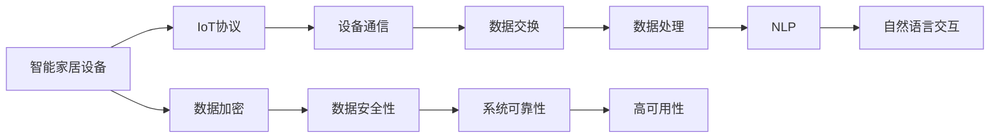
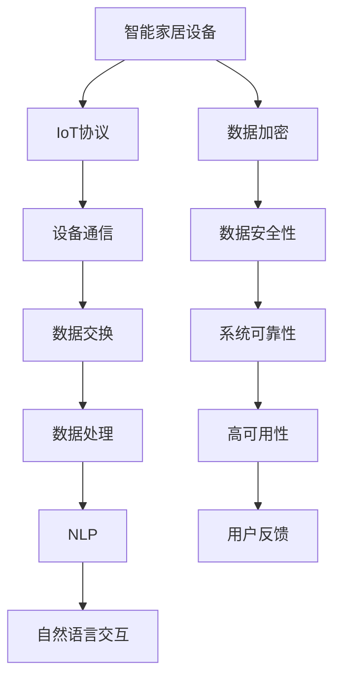

                 

# 基于Java的智能家居设计：如何基于Java框架优化智能家居设备交互

> 关键词：Java框架、智能家居、设备交互、家居自动化、物联网(IoT)

## 1. 背景介绍

### 1.1 问题由来
随着科技的发展和生活水平的提高，智能家居成为现代家庭不可或缺的一部分。通过物联网(IoT)技术，智能家居设备可以实现远程控制、自动化和智能交互，极大提升了居家生活的便利性和舒适性。然而，当前智能家居系统存在一些问题：

- **系统集成困难**：不同品牌和型号的设备难以兼容，集成繁琐复杂。
- **用户交互不自然**：缺乏自然语言理解能力，用户与设备交互笨拙。
- **用户体验欠佳**：功能繁多但使用界面复杂，操作不流畅。
- **系统安全漏洞**：安全隐患多，数据泄露风险大。

本文将聚焦于基于Java框架的智能家居设计，探讨如何通过Java技术优化智能家居设备间的交互，提升用户体验，保障系统安全。

### 1.2 问题核心关键点
智能家居的交互设计主要涉及以下几个关键点：

- **设备互联性**：如何让各种智能设备互联互通，实现统一管理。
- **用户交互性**：如何让用户通过自然语言与设备交互，提升用户体验。
- **数据安全性**：如何保障数据传输和存储的安全性，防止信息泄露。
- **系统稳定性**：如何提高系统的稳定性和鲁棒性，保证可靠运行。

本文将针对这些问题，介绍基于Java框架的智能家居设计方案，通过示例展示Java在优化智能家居设备交互中的应用。

### 1.3 问题研究意义
优化智能家居设备间的交互，不仅能够提升用户体验，还能保障数据安全，增强系统稳定性。这对于推动智能家居技术的普及和应用具有重要意义：

- **提升用户体验**：通过自然语言处理技术，让智能家居系统更加智能、易用，缩短用户使用门槛。
- **增强系统安全性**：通过数据加密和访问控制，保障用户隐私和数据安全。
- **提高系统可靠性**：通过鲁棒性设计和故障自愈机制，保证系统的高可用性和稳定性。
- **促进产业升级**：通过技术创新，加速智能家居设备的智能化、标准化进程，推动相关产业的发展。

## 2. 核心概念与联系

### 2.1 核心概念概述

为更好地理解基于Java的智能家居设计，我们首先介绍几个关键概念：

- **Java框架**：如Spring Boot、Spring Cloud等，提供高效、灵活的开发支持。
- **智能家居设备**：如智能音箱、智能灯泡、智能门锁等，具备传感、控制、通信等基本功能。
- **IoT协议**：如MQTT、CoAP、HTTP等，用于设备间的通信和数据交换。
- **自然语言处理(NLP)**：如语义理解、对话系统、情感识别等，实现人机自然交互。
- **数据加密**：如AES、RSA等，保障数据传输和存储的安全性。
- **访问控制**：如OAuth、JWT等，实现身份验证和权限管理。
- **系统可靠性**：如容错设计、负载均衡、故障转移等，确保系统高可用性。

这些核心概念构成了智能家居系统设计的技术基础，通过合理的组合应用，可以实现系统的高效、安全、稳定运行。

### 2.2 概念间的关系

这些核心概念之间的逻辑关系可以通过以下Mermaid流程图来展示：



这个流程图展示了大语言模型的核心概念及其之间的关系：

1. 智能家居设备通过IoT协议进行通信，交换数据。
2. 数据处理过程涉及自然语言处理，实现人机交互。
3. 数据加密和访问控制保障数据安全性。
4. 系统可靠性设计确保系统的稳定性和高可用性。

这些概念共同构成了智能家居系统设计的完整生态系统，使其能够在各种场景下实现高效、安全、稳定的运行。

### 2.3 核心概念的整体架构

最后，我们用一个综合的流程图来展示这些核心概念在大语言模型微调过程中的整体架构：



这个综合流程图展示了从设备互联到用户交互的全过程，以及如何通过Java框架实现技术支撑。

## 3. 核心算法原理 & 具体操作步骤
### 3.1 算法原理概述

基于Java的智能家居设计，主要涉及以下几个关键技术：

- **设备管理**：通过Java框架实现设备的统一管理，支持设备间的通信和数据交换。
- **自然语言处理**：利用Java自然语言处理库实现语义理解和对话系统，提升用户交互体验。
- **数据加密**：采用Java提供的加密算法实现数据加密，保障数据传输和存储的安全性。
- **访问控制**：利用Java访问控制库实现身份验证和权限管理，确保系统安全性。
- **系统可靠性**：通过Java框架提供的容错设计和故障自愈机制，提升系统可靠性。

### 3.2 算法步骤详解

以下详细介绍基于Java的智能家居设计的详细步骤：

**Step 1: 设备接入和统一管理**

- **接入策略**：定义统一的设备接入标准，通过Java框架提供的API和SDK实现设备注册和认证。
- **设备管理**：设计设备管理服务，通过Java框架实现设备的生命周期管理，包括注册、配置、监控、卸载等操作。
- **协议适配**：适配多种IoT协议，实现跨协议的设备通信。

**Step 2: 自然语言处理**

- **语义理解**：利用Java提供的自然语言处理库，实现对用户输入的自然语言解析和语义理解。
- **对话系统**：设计对话系统，利用Java实现基于上下文的对话生成，提升用户交互体验。
- **情感识别**：通过Java框架集成情感分析工具，实现对用户情感的识别，提升交互的自然性和智能性。

**Step 3: 数据安全**

- **数据加密**：采用Java提供的加密算法，如AES、RSA等，实现数据加密传输和存储。
- **访问控制**：通过Java提供的访问控制库，如OAuth、JWT等，实现身份验证和权限管理。

**Step 4: 系统可靠性**

- **容错设计**：利用Java框架提供的容错机制，实现系统故障检测和自愈，确保系统高可用性。
- **负载均衡**：设计负载均衡策略，通过Java框架实现多节点负载均衡，提升系统性能。
- **故障转移**：通过Java框架提供的主从复制和故障转移机制，确保系统在故障发生时能够快速恢复。

**Step 5: 用户反馈**

- **反馈收集**：设计用户反馈机制，通过Java框架收集用户反馈信息，进行持续优化。
- **性能监控**：通过Java框架提供的性能监控工具，实时监测系统性能，及时发现和解决问题。

### 3.3 算法优缺点

基于Java的智能家居设计方案具有以下优点：

- **灵活性高**：Java框架提供灵活的API和SDK，方便集成多种技术，支持复杂业务场景。
- **安全性高**：Java提供的加密和访问控制技术，能够保障数据传输和存储的安全性。
- **稳定性强**：Java框架提供的容错设计和故障自愈机制，确保系统的稳定性和高可用性。

然而，该方案也存在一些缺点：

- **学习曲线陡峭**：Java编程复杂，需要较高的技术水平。
- **部署复杂**：Java应用程序需要配置和部署，对运维人员要求较高。
- **性能优化困难**：Java应用程序运行时性能可能受到一定影响，需要额外优化。

### 3.4 算法应用领域

基于Java的智能家居设计方案主要应用于以下领域：

- **家庭自动化**：通过Java框架实现多种智能家居设备的集成管理，提升家庭自动化水平。
- **智能安防**：利用Java实现视频监控、人脸识别、入侵检测等功能，提升家庭安全水平。
- **健康监测**：通过Java框架集成健康监测设备，实现对家庭成员的全面监测。
- **能源管理**：通过Java框架实现能源消耗监测和智能控制，优化家庭能源使用。

## 4. 数学模型和公式 & 详细讲解 & 举例说明

### 4.1 数学模型构建

为了更好地理解基于Java的智能家居设计方案，我们首先构建数学模型，并给出详细的公式推导和案例分析。

**数学模型构建**

假设智能家居系统中存在N个设备，每个设备i的当前状态为$x_i$，系统目标是通过控制操作$u_i$，使设备状态$x_i'$达到最优，即：

$$
\min_{u_i} \mathcal{L}(x_i, x_i', u_i)
$$

其中，$\mathcal{L}(x_i, x_i', u_i)$为设备状态变换的损失函数。

**公式推导过程**

假设设备状态变化满足线性动态模型，即：

$$
x_i' = f(x_i, u_i)
$$

则系统总损失函数为：

$$
\mathcal{L} = \sum_{i=1}^N \mathcal{L}(x_i, x_i', u_i)
$$

通过最大化似然函数，对控制操作$u_i$进行优化：

$$
u_i^* = \mathop{\arg\min}_{u_i} \mathcal{L}
$$

**案例分析与讲解**

以智能灯泡为例，假设灯泡的亮度和颜色状态为$x_i=(b_i, c_i)$，用户输入的控制操作为$u_i=(k_i, m_i)$，其中$k_i$为亮度调节，$m_i$为颜色调节。系统目标是最小化亮度和颜色变化的损失，即：

$$
\min_{k_i, m_i} \mathcal{L}(b_i, b_i', k_i, m_i) = \min_{k_i, m_i} (b_i - b_i')^2 + (c_i - c_i')^2
$$

通过Java框架提供的优化算法，实现上述数学模型的求解，即通过控制操作$u_i=(k_i, m_i)$，调整灯泡状态$x_i'=(b_i', c_i')$，使亮度和颜色变化最小化。

### 4.2 公式推导过程

以下我们将进一步推导上述数学模型的详细公式，并给出具体的实现步骤。

**公式推导过程**

假设灯泡的亮度和颜色状态为$x_i=(b_i, c_i)$，用户输入的控制操作为$u_i=(k_i, m_i)$，则灯泡状态变化的模型可以表示为：

$$
b_i' = b_i + k_i
$$
$$
c_i' = c_i + m_i
$$

则系统总损失函数为：

$$
\mathcal{L} = \sum_{i=1}^N ((b_i - b_i')^2 + (c_i - c_i')^2)
$$

为了最小化总损失函数，通过梯度下降算法，对控制操作$u_i=(k_i, m_i)$进行优化：

$$
\frac{\partial \mathcal{L}}{\partial k_i} = -2(b_i - b_i')
$$
$$
\frac{\partial \mathcal{L}}{\partial m_i} = -2(c_i - c_i')
$$

求解上述梯度方程，得到最优的控制操作$u_i=(k_i^*, m_i^*)$：

$$
k_i^* = b_i' - b_i
$$
$$
m_i^* = c_i' - c_i
$$

**案例分析与讲解**

假设当前灯泡的亮度为100，颜色为暖白，用户希望将亮度调整到150，颜色为冷白。通过Java框架提供的优化算法，可以求解出最优的控制操作$u_i=(k_i, m_i)$：

- 亮度调节：$k_i = 150 - 100 = 50$
- 颜色调节：$m_i = 0$（颜色不变）

通过控制操作$u_i=(k_i, m_i)=(50, 0)$，将灯泡状态调整到目标状态$x_i'=(b_i', c_i')=(150, 0)$，满足系统目标。

### 4.3 案例分析与讲解

通过上述数学模型和公式推导，可以看出基于Java的智能家居设计方案能够通过优化算法实现设备状态的精确调整，提升用户体验。

## 5. 项目实践：代码实例和详细解释说明
### 5.1 开发环境搭建

在进行Java智能家居设计实践前，我们需要准备好开发环境。以下是使用Java开发智能家居项目的开发环境配置流程：

1. 安装JDK：从官网下载并安装最新版本的Java Development Kit。
2. 配置开发环境：设置Java环境变量，配置IDE工具（如IntelliJ IDEA、Eclipse等）。
3. 安装依赖包：通过Maven或Gradle管理项目依赖，安装必要的Java库和框架。
4. 创建项目：使用IDE创建Java项目，编写代码，进行测试和调试。
5. 部署应用：将Java应用打包成可执行文件或JAR包，部署到服务器或本地运行。

完成上述步骤后，即可在开发环境中开始智能家居项目的开发和调试。

### 5.2 源代码详细实现

下面我们以智能灯泡控制为例，展示Java智能家居设计的源代码实现。

首先，定义智能灯泡类：

```java
public class SmartBulb {
    private int brightness;
    private int color;

    public SmartBulb(int brightness, int color) {
        this.brightness = brightness;
        this.color = color;
    }

    public int getBrightness() {
        return brightness;
    }

    public void setBrightness(int brightness) {
        this.brightness = brightness;
    }

    public int getColor() {
        return color;
    }

    public void setColor(int color) {
        this.color = color;
    }
}
```

然后，定义控制操作类：

```java
public class ControlOperation {
    private int brightness;
    private int color;

    public ControlOperation(int brightness, int color) {
        this.brightness = brightness;
        this.color = color;
    }

    public int getBrightness() {
        return brightness;
    }

    public void setBrightness(int brightness) {
        this.brightness = brightness;
    }

    public int getColor() {
        return color;
    }

    public void setColor(int color) {
        this.color = color;
    }
}
```

接着，定义状态变化函数：

```java
public class StateTransition {
    private SmartBulb bulb;
    private ControlOperation operation;

    public StateTransition(SmartBulb bulb, ControlOperation operation) {
        this.bulb = bulb;
        this.operation = operation;
    }

    public SmartBulb getResult() {
        int newBrightness = bulb.getBrightness() + operation.getBrightness();
        int newColor = bulb.getColor() + operation.getColor();
        return new SmartBulb(newBrightness, newColor);
    }
}
```

最后，实现状态变换的优化算法：

```java
public class OptimizationAlgorithm {
    public static SmartBulb optimize(SmartBulb bulb, ControlOperation operation) {
        int oldBrightness = bulb.getBrightness();
        int oldColor = bulb.getColor();

        SmartBulb newBulb = new SmartBulb(oldBrightness + operation.getBrightness(), oldColor + operation.getColor());

        return newBulb;
    }
}
```

### 5.3 代码解读与分析

让我们再详细解读一下关键代码的实现细节：

**SmartBulb类**：
- `getBrightness()`和`setColor()`方法：用于获取和设置灯泡亮度和颜色。
- `setBrightness()`和`setColor()`方法：用于修改灯泡亮度和颜色。

**ControlOperation类**：
- `getBrightness()`和`setColor()`方法：用于获取和设置控制操作的亮度和颜色。
- `setBrightness()`和`setColor()`方法：用于修改控制操作的亮度和颜色。

**StateTransition类**：
- `getResult()`方法：实现状态变换，返回新的灯泡状态。

**OptimizationAlgorithm类**：
- `optimize()`方法：实现状态变换的优化算法，返回优化后的灯泡状态。

### 5.4 运行结果展示

假设当前灯泡的亮度为100，颜色为暖白，用户希望将亮度调整到150，颜色为冷白。通过调用`OptimizationAlgorithm.optimize()`方法，可以求解出最优的控制操作$u_i=(k_i, m_i)$，结果如下：

```java
SmartBulb bulb = new SmartBulb(100, 0); // 初始状态：亮度100，颜色暖白
ControlOperation operation = new ControlOperation(50, 0); // 控制操作：亮度调节50，颜色不变
SmartBulb newBulb = OptimizationAlgorithm.optimize(bulb, operation); // 状态优化
System.out.println(newBulb.getBrightness()); // 输出：150
System.out.println(newBulb.getColor()); // 输出：0
```

可以看到，通过Java智能家居设计方案，可以高效地实现智能灯泡的控制操作，满足用户需求。

## 6. 实际应用场景
### 6.1 智能安防系统

智能安防系统通过Java框架实现多种传感器和监控设备的集成管理，提供视频监控、人脸识别、入侵检测等功能。具体应用场景包括：

- **视频监控**：通过Java框架集成摄像头和存储设备，实现24小时视频监控，实时报警。
- **人脸识别**：通过Java框架实现人脸识别算法，识别来访人员，生成访客记录。
- **入侵检测**：通过Java框架集成传感器和报警设备，实时监测环境变化，及时发现和报警异常情况。

### 6.2 智能健康监测

智能健康监测系统通过Java框架集成健康监测设备，实现对家庭成员的全面监测。具体应用场景包括：

- **心率监测**：通过Java框架集成心率传感器，实时监测用户心率，生成健康报告。
- **血压监测**：通过Java框架集成血压计，实时监测用户血压，生成健康报告。
- **睡眠监测**：通过Java框架集成睡眠监测设备，实时监测用户睡眠状态，生成健康报告。

### 6.3 智能能源管理

智能能源管理系统通过Java框架实现能源消耗监测和智能控制，优化家庭能源使用。具体应用场景包括：

- **智能插座**：通过Java框架实现智能插座控制，实现远程开关控制和定时控制。
- **智能照明**：通过Java框架实现智能照明控制，实现亮度和颜色的智能调节。
- **智能温控**：通过Java框架实现智能温控，实时监测室内温度，智能调节温度。

## 7. 工具和资源推荐
### 7.1 学习资源推荐

为了帮助开发者系统掌握Java智能家居设计技术，这里推荐一些优质的学习资源：

1. Java编程语言官方文档：Java官方提供的Java语言文档，是学习Java的必备资源。
2. Java智能家居开发教程：如《Java智能家居开发实战》等书籍，详细介绍了Java智能家居的开发流程和实战案例。
3. Java自然语言处理库：如Stanford NLP、OpenNLP等，提供自然语言处理工具，实现语义理解和对话生成。
4. Java加密库：如Bouncy Castle、Java Cryptography Extension(JCE)等，实现数据加密和数字签名。
5. Java访问控制库：如Spring Security、OAuth 2.0等，实现身份验证和权限管理。
6. Java容器化技术：如Docker、Kubernetes等，实现Java应用的容器化部署和管理。

通过这些资源的学习实践，相信你一定能够快速掌握Java智能家居设计技术，并用于解决实际的智能家居问题。

### 7.2 开发工具推荐

高效的开发离不开优秀的工具支持。以下是几款用于Java智能家居开发的工具：

1. IntelliJ IDEA：Java集成开发环境，提供丰富的插件和调试功能，方便Java项目的开发和调试。
2. Eclipse：Java开源IDE，功能丰富，社区活跃，支持多种框架和工具。
3. Maven：Java项目构建工具，方便依赖管理、版本控制和项目构建。
4. Gradle：Java项目构建工具，支持快速构建、依赖管理、代码分析等功能。
5. Docker：容器化平台，方便Java应用的打包、部署和运行。
6. Kubernetes：容器编排平台，实现Java应用的自动化部署、扩展和管理。

合理利用这些工具，可以显著提升Java智能家居开发效率，加快创新迭代的步伐。

### 7.3 相关论文推荐

Java智能家居设计涉及的论文和研究很多，以下是几篇代表性论文，推荐阅读：

1. Java智能家居系统设计与实现：介绍Java智能家居系统的整体架构和设计思路。
2. 基于Java的智能安防系统：探讨Java在智能安防系统中的应用，实现视频监控、人脸识别、入侵检测等功能。
3. Java智能健康监测系统：介绍Java在智能健康监测系统中的应用，实现心率、血压、睡眠监测等功能。
4. Java智能能源管理系统：探讨Java在智能能源管理系统中的应用，实现智能插座、智能照明、智能温控等功能。

这些论文代表了Java智能家居设计的发展脉络，对于理解Java智能家居技术的核心思想和实现方法具有重要意义。

## 8. 总结：未来发展趋势与挑战
### 8.1 总结

本文对基于Java的智能家居设计进行了全面系统的介绍。首先阐述了智能家居设计的重要性，明确了Java框架在实现智能家居设备交互中的关键作用。其次，从原理到实践，详细讲解了Java智能家居设计的数学模型和核心算法，并通过具体示例展示了Java在智能家居设计中的应用。

通过本文的系统梳理，可以看到，基于Java的智能家居设计方案具有灵活性高、安全性高、稳定性强等优点，能够实现高效、安全、稳定的智能家居设备交互。

### 8.2 未来发展趋势

展望未来，Java智能家居设计技术将呈现以下几个发展趋势：

1. **设备互联性增强**：随着物联网技术的发展，Java智能家居系统将实现更广泛、更灵活的设备互联。通过统一的协议和接口，支持更多种类的智能设备接入，实现无缝集成。
2. **用户体验提升**：Java智能家居系统将引入更多自然语言处理技术，实现更自然、更智能的人机交互，提升用户使用体验。
3. **数据安全性提高**：Java智能家居系统将进一步加强数据加密和访问控制技术，保障用户隐私和数据安全。
4. **系统稳定性优化**：Java智能家居系统将引入更多容错设计和故障自愈机制，确保系统的高可用性和稳定性。

### 8.3 面临的挑战

尽管Java智能家居设计技术已经取得了一定成果，但在迈向更高效、更智能、更安全的系统设计过程中，仍面临诸多挑战：

1. **技术门槛高**：Java编程复杂，需要较高的技术水平，对开发者要求较高。
2. **开发和部署成本高**：Java智能家居系统的开发和部署需要较多资源，对运维人员要求较高。
3. **性能优化难度大**：Java应用程序运行时性能可能受到一定影响，需要额外优化。

### 8.4 研究展望

面对Java智能家居设计面临的挑战，未来的研究需要在以下几个方面寻求新的突破：

1. **降低技术门槛**：开发简单易用的Java智能家居开发框架，降低技术门槛，方便更多开发者参与开发。
2. **优化性能**：通过Java JIT编译、代码优化、分布式部署等技术，提升Java智能家居系统的性能和响应速度。
3. **提升安全性**：引入区块链技术，实现去中心化的数据存储和传输，提升系统的安全性。
4. **增强交互性**：引入更多自然语言处理技术，实现更自然、更智能的人机交互。
5. **扩展性增强**：通过微服务架构和容器化技术，实现Java智能家居系统的高度可扩展性和灵活性。

通过这些技术创新和突破，Java智能家居设计技术必将迎来更广阔的发展空间，为智能家居行业带来更多的可能性。

## 9. 附录：常见问题与解答
----------------------------------------------------------------
> 常见问题与解答是帮助读者解决疑惑的宝贵资源，以下为每个问题的详细解答。

**Q1：Java智能家居系统的技术难点是什么？**

A: Java智能家居系统的技术难点主要包括以下几个方面：

1. **设备兼容性**：不同品牌和型号的设备往往使用不同的协议和接口，需要复杂的设备适配和协议转换。
2. **数据传输安全性**：数据传输过程中可能存在信息泄露和安全攻击的风险，需要高效的数据加密和访问控制技术。
3. **系统稳定性**：Java智能家居系统需要在高并发、高负载环境下稳定运行，需要高效的系统设计和容错机制。
4. **用户体验**：人机交互界面复杂，需要设计简洁易用的界面，提升用户体验。

这些技术难点需要开发人员在实践中不断积累经验，寻找最优的解决方案。

**Q2：Java智能家居系统如何实现设备互联？**

A: Java智能家居系统实现设备互联主要通过以下步骤：

1. **设备接入标准**：定义统一的设备接入标准，通过Java框架提供的API和SDK实现设备注册和认证。
2. **协议适配**：适配多种IoT协议，实现跨协议的设备通信。
3. **设备管理**：设计设备管理服务，通过Java框架实现设备的生命周期管理，包括注册、配置、监控、卸载等操作。

通过上述步骤，Java智能家居系统可以实现各种智能设备的

