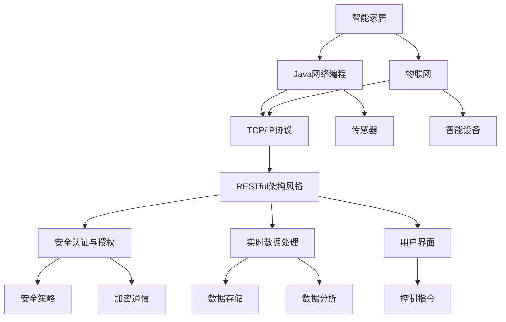
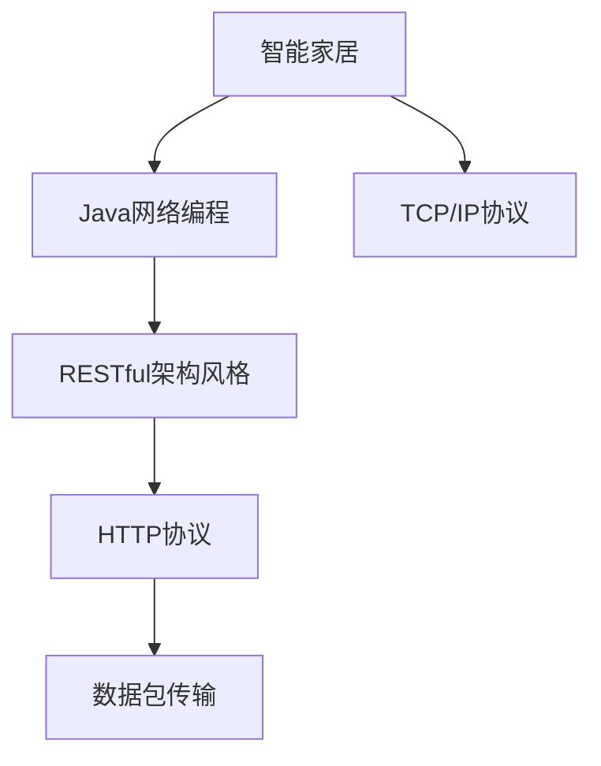
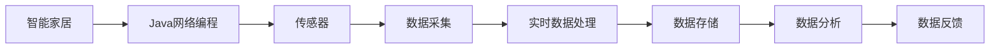
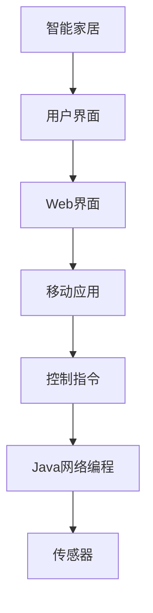

                 

# 基于Java的智能家居设计：智能家居系统中的Java网络编程实战

> 关键词：智能家居,Java网络编程,物联网,系统架构,安全防护,实时监控,用户交互,故障排除

## 1. 背景介绍

### 1.1 问题由来
随着物联网技术的发展，智能家居系统已逐渐进入千家万户。智能家居通过网络将家居设备连接起来，实现远程控制、环境监控、安全防护等功能，极大地提升了家居生活的便利性和舒适性。然而，面对众多智能设备，如何构建一个高效、安全、稳定的智能家居系统，成为许多智能设备厂商和智能家居用户关心的问题。

### 1.2 问题核心关键点
构建智能家居系统，涉及到网络编程、系统架构、设备通信、数据处理等多个环节。一个成功的智能家居系统需要满足以下几个关键要求：
- 高效的网络通信：保证设备间数据交换的实时性、可靠性。
- 稳定的系统架构：保证系统具有高度的可扩展性、可维护性。
- 完善的安全防护：保护数据传输的安全性，防止恶意攻击。
- 实时的环境监控：实时获取家居环境信息，提升用户体验。
- 友好的用户交互：提供直观易用的控制界面，让用户轻松管理家居。

### 1.3 问题研究意义
研究基于Java的智能家居设计，对于推动智能家居技术的普及应用，提升家居生活的智能化、数字化水平，具有重要意义：

1. 提高用户体验：智能家居系统通过自动化、智能化控制，减轻用户负担，提升生活便利性。
2. 推动产业升级：智能化技术的应用，可以加速家居产业的数字化转型，促进家居产业的创新发展。
3. 创造新的商业模式：智能家居系统为家电厂商、互联网企业、系统集成商等提供了新的业务机会，推动了新的商业模式的形成。
4. 保障用户安全：智能家居系统通过安全防护技术，保护用户隐私和家居安全，提升用户的信任感和满意度。

## 2. 核心概念与联系

### 2.1 核心概念概述

为了更好地理解智能家居系统的设计，本节将介绍几个密切相关的核心概念：

- 智能家居（Smart Home）：利用物联网技术，通过互联网将家居设备连接起来，实现远程控制、环境监控、安全防护等功能，提升家居生活的便捷性和安全性。

- Java网络编程（Java Networking）：基于Java语言的网络编程技术，用于实现智能家居系统的网络通信、数据处理等功能。

- 物联网（Internet of Things, IoT）：将物理设备通过网络连接起来，实现设备的互操作、信息交换，从而提升设备的智能化水平。

- TCP/IP协议（Transmission Control Protocol/Internet Protocol）：网络通信的基本协议，定义了数据包传输的格式、规则，是实现网络通信的基础。

- RESTful架构风格：基于HTTP协议的Web服务架构风格，用于设计智能家居系统的服务接口，便于服务访问和管理。

- 安全认证与授权（Security Authentication and Authorization）：用于保证智能家居系统的安全性，防止非法访问和恶意攻击。

- 实时数据处理（Real-time Data Processing）：实时获取家居环境数据，进行分析和处理，提升系统的响应速度和决策能力。

- 用户界面（User Interface, UI）：智能家居系统的用户交互界面，用于展示家居状态、接收用户命令等。

这些核心概念之间存在着紧密的联系，形成了智能家居系统的完整架构。下面我们将通过一个Mermaid流程图展示这些概念之间的联系。



这个流程图展示了智能家居系统中各个核心概念之间的关系：

1. 智能家居通过物联网技术将家居设备连接起来。
2. Java网络编程用于实现设备间的通信，基于TCP/IP协议进行数据传输。
3. RESTful架构风格用于设计服务接口，便于系统的扩展和管理。
4. 安全认证与授权技术用于保护系统安全，防止非法访问和恶意攻击。
5. 实时数据处理技术用于获取家居环境数据，进行实时分析和处理。
6. 用户界面技术用于展示家居状态，接收用户命令。
7. 传感器和智能设备用于采集家居环境数据，提供给实时数据处理模块。
8. 数据存储和分析模块用于保存和管理家居数据，提供决策支持。
9. 安全策略和加密通信技术用于保障数据传输的安全性。

这些核心概念共同构成了智能家居系统的设计基础，使得系统能够实现高效、稳定、安全的功能。

### 2.2 概念间的关系

这些核心概念之间存在着紧密的联系，形成了智能家居系统的完整架构。下面我们将通过几个Mermaid流程图展示这些概念之间的关系。

#### 2.2.1 智能家居系统的网络通信架构



这个流程图展示了智能家居系统的网络通信架构：

1. 智能家居通过Java网络编程实现设备间的通信。
2. 通信基于TCP/IP协议进行，保证了数据传输的可靠性。
3. RESTful架构风格用于设计服务接口，采用HTTP协议进行数据传输。
4. 数据包传输采用标准化的格式，便于系统扩展和管理。

#### 2.2.2 智能家居系统的数据处理架构



这个流程图展示了智能家居系统的数据处理架构：

1. 智能家居系统通过传感器采集家居环境数据。
2. 采集到的数据通过Java网络编程模块传输到中央服务器。
3. 实时数据处理模块对数据进行实时分析和处理。
4. 处理后的数据存储到数据存储模块，提供决策支持。
5. 数据分析模块对历史数据进行深度分析，提供洞察和建议。
6. 数据反馈模块将分析结果反馈给用户，提升用户体验。

#### 2.2.3 智能家居系统的用户交互架构



这个流程图展示了智能家居系统的用户交互架构：

1. 智能家居系统通过用户界面提供给用户直观的操作界面。
2. Web界面和移动应用用于展示家居状态和接收用户命令。
3. 控制指令通过Java网络编程模块传输到中央服务器。
4. Java网络编程模块将控制指令传输到传感器，实现对家居设备的控制。

## 3. 核心算法原理 & 具体操作步骤
### 3.1 算法原理概述

智能家居系统中的Java网络编程主要涉及以下几个核心算法：

- 网络通信算法：基于TCP/IP协议实现设备间的通信，保证数据传输的可靠性。
- 数据传输算法：通过HTTP协议进行数据传输，实现快速、便捷的通信。
- 数据处理算法：实时采集和处理家居环境数据，提供实时的家居状态和决策支持。
- 安全防护算法：通过加密通信和认证授权技术，保障数据传输的安全性。

这些算法共同构成了智能家居系统的网络编程基础，使得系统能够实现高效、稳定、安全的功能。

### 3.2 算法步骤详解

智能家居系统中的Java网络编程可以分为以下几个步骤：

**Step 1: 网络通信模块设计**

1. 选择合适的网络编程框架：常用的Java网络编程框架包括Socket、NIO、Spring Boot等。
2. 设计网络通信协议：定义数据包的格式和规则，确保数据传输的可靠性。
3. 实现网络通信模块：采用TCP/IP协议进行数据传输，确保数据传输的可靠性。

**Step 2: 数据传输模块设计**

1. 选择合适的数据传输协议：常用的数据传输协议包括HTTP、WebSocket等。
2. 设计数据传输接口：定义数据传输的接口，确保数据传输的便捷性。
3. 实现数据传输模块：采用HTTP协议进行数据传输，确保数据传输的快速性。

**Step 3: 数据处理模块设计**

1. 选择合适的数据处理框架：常用的数据处理框架包括Apache Kafka、Apache Spark等。
2. 设计数据处理流程：定义数据处理流程，确保数据处理的实时性和准确性。
3. 实现数据处理模块：采用实时数据处理技术，确保数据处理的实时性和准确性。

**Step 4: 安全防护模块设计**

1. 选择合适的网络安全技术：常用的网络安全技术包括加密通信、认证授权等。
2. 设计安全防护流程：定义安全防护流程，确保数据传输的安全性。
3. 实现安全防护模块：采用加密通信和认证授权技术，确保数据传输的安全性。

**Step 5: 用户交互模块设计**

1. 选择合适的前端技术：常用的前端技术包括Web界面、移动应用等。
2. 设计用户交互界面：定义用户交互界面，确保用户操作直观易用。
3. 实现用户交互模块：采用Web界面和移动应用技术，确保用户操作直观易用。

**Step 6: 测试和部署**

1. 进行单元测试：确保各个模块的正常运行。
2. 进行集成测试：确保各个模块的协同工作。
3. 进行性能测试：确保系统的稳定性和高效性。
4. 进行部署上线：将系统部署到生产环境，确保系统的稳定性和高效性。

### 3.3 算法优缺点

基于Java的智能家居系统的网络编程具有以下优点：

1. 稳定性高：Java语言具有天然的跨平台特性，能够保证系统在不同平台上的稳定运行。
2. 扩展性强：Java网络编程框架支持灵活的扩展，能够适应系统的不同需求。
3. 安全性高：Java网络编程框架支持加密通信和认证授权技术，能够保证数据传输的安全性。

同时，基于Java的智能家居系统的网络编程也存在一些缺点：

1. 开发复杂：Java网络编程框架涉及较多的配置和开发，需要较高的开发成本。
2. 性能瓶颈：Java语言本身存在一定的性能瓶颈，需要优化和调优。
3. 资源占用高：Java程序需要占用较多的内存和CPU资源，需要合理的资源管理。

### 3.4 算法应用领域

基于Java的智能家居系统的网络编程，主要应用于以下几个领域：

1. 智能家居系统：通过Java网络编程实现设备间的通信，提供实时的家居状态和决策支持。
2. 工业控制系统：通过Java网络编程实现设备间的通信，提供实时的监控和管理。
3. 智能城市系统：通过Java网络编程实现设备间的通信，提供实时的监控和管理。
4. 智慧医疗系统：通过Java网络编程实现设备间的通信，提供实时的监控和管理。
5. 智能交通系统：通过Java网络编程实现设备间的通信，提供实时的监控和管理。

这些领域的应用，展示了基于Java的智能家居系统的网络编程的广泛应用前景。

## 4. 数学模型和公式 & 详细讲解 & 举例说明
### 4.1 数学模型构建

智能家居系统中Java网络编程的数学模型主要涉及以下几个方面：

- 数据传输模型：基于TCP/IP协议进行数据传输，确保数据传输的可靠性。
- 数据处理模型：实时采集和处理家居环境数据，提供实时的家居状态和决策支持。
- 安全防护模型：通过加密通信和认证授权技术，保障数据传输的安全性。

### 4.2 公式推导过程

#### 4.2.1 数据传输模型

基于TCP/IP协议的数据传输模型如下：

1. 定义数据包格式：
   $$
   \text{Data Packet} = \{ \text{Header}, \text{Data} \}
   $$

2. 定义数据包传输规则：
   $$
   \text{Data Packet} = \text{TCP Packet} + \text{IP Packet}
   $$

其中，Header包含数据包的各种信息，Data为实际传输的数据。

#### 4.2.2 数据处理模型

基于实时数据处理技术的数据处理模型如下：

1. 定义数据处理流程：
   $$
   \text{Data Processing} = \{ \text{Data Acquisition}, \text{Data Storage}, \text{Data Analysis}, \text{Data Feedback} \}
   $$

2. 定义数据处理步骤：
   $$
   \text{Data Acquisition} \rightarrow \text{Data Storage} \rightarrow \text{Data Analysis} \rightarrow \text{Data Feedback}
   $$

其中，Data Acquisition为数据采集模块，Data Storage为数据存储模块，Data Analysis为数据分析模块，Data Feedback为数据反馈模块。

#### 4.2.3 安全防护模型

基于加密通信和认证授权技术的安全防护模型如下：

1. 定义安全防护流程：
   $$
   \text{Security Protection} = \{ \text{Encryption Communication}, \text{Authentication Authorization} \}
   $$

2. 定义安全防护步骤：
   $$
   \text{Encryption Communication} \rightarrow \text{Authentication Authorization}
   $$

其中，Encryption Communication为加密通信模块，Authentication Authorization为认证授权模块。

### 4.3 案例分析与讲解

#### 4.3.1 数据传输模型案例

假设智能家居系统中有一个温度传感器，通过Java网络编程模块传输数据。具体实现步骤如下：

1. 定义数据包格式：
   $$
   \text{Data Packet} = \{ \text{Header}, \text{Temperature} \}
   $$

2. 实现数据传输模块：
   ```java
   ServerSocket serverSocket = new ServerSocket(8080);
   Socket socket = serverSocket.accept();
   InputStream inputStream = socket.getInputStream();
   DataInputStream dataInputStream = new DataInputStream(inputStream);
   int headerLength = dataInputStream.readInt();
   byte[] header = new byte[headerLength];
   dataInputStream.read(header);
   int temperature = dataInputStream.readInt();
   ```

#### 4.3.2 数据处理模型案例

假设智能家居系统中有一个智能灯泡，通过实时数据处理模块进行控制。具体实现步骤如下：

1. 定义数据处理流程：
   $$
   \text{Data Processing} = \{ \text{Data Acquisition}, \text{Data Storage}, \text{Data Analysis}, \text{Data Feedback} \}
   $$

2. 实现数据处理模块：
   ```java
   while (true) {
       // 数据采集
       double temperature = readTemperatureSensor();
       // 数据存储
       storeTemperatureData(temperature);
       // 数据分析
       if (temperature > 20) {
           // 开启灯泡
       } else {
           // 关闭灯泡
       }
       // 数据反馈
       sendFeedbackMessage("Temperature adjustment completed.");
   }
   ```

#### 4.3.3 安全防护模型案例

假设智能家居系统中有一个智能门锁，通过安全防护模块进行控制。具体实现步骤如下：

1. 定义安全防护流程：
   $$
   \text{Security Protection} = \{ \text{Encryption Communication}, \text{Authentication Authorization} \}
   $$

2. 实现安全防护模块：
   ```java
   // 加密通信
   String password = "abcd1234";
   String encryptedData = encryptData("123456");
   // 认证授权
   if (authenticateUser("123456")) {
       // 开启门锁
   } else {
       // 拒绝访问
   }
   ```

## 5. 项目实践：代码实例和详细解释说明
### 5.1 开发环境搭建

在进行智能家居系统开发前，我们需要准备好开发环境。以下是使用Java开发智能家居系统的环境配置流程：

1. 安装Java JDK：从官网下载并安装Java JDK，用于Java程序的运行。
2. 安装IDE：常用的Java开发工具包括IntelliJ IDEA、Eclipse等，方便代码编写和调试。
3. 安装网络编程框架：常用的Java网络编程框架包括Socket、NIO、Spring Boot等，用于实现网络通信和数据处理。
4. 安装数据处理框架：常用的数据处理框架包括Apache Kafka、Apache Spark等，用于实现数据存储和分析。

完成上述步骤后，即可在IDE中开始智能家居系统的开发。

### 5.2 源代码详细实现

下面我们以智能家居系统中的温度监控为例，给出使用Java网络编程实现的温度监控代码实现。

首先，定义温度传感器数据采集模块：

```java
public class TemperatureSensor {
    private String sensorId;
    private double temperature;

    public TemperatureSensor(String sensorId) {
        this.sensorId = sensorId;
        this.temperature = 0.0;
    }

    public double getTemperature() {
        return temperature;
    }

    public void setTemperature(double temperature) {
        this.temperature = temperature;
    }
}
```

然后，定义数据传输模块：

```java
import java.net.*;
import java.io.*;

public class TemperatureSensorDataTransmit {
    public static void main(String[] args) {
        try {
            ServerSocket serverSocket = new ServerSocket(8080);
            Socket socket = serverSocket.accept();
            InputStream inputStream = socket.getInputStream();
            DataInputStream dataInputStream = new DataInputStream(inputStream);
            int headerLength = dataInputStream.readInt();
            byte[] header = new byte[headerLength];
            dataInputStream.read(header);
            int temperature = dataInputStream.readInt();
            TemperatureSensor temperatureSensor = new TemperatureSensor("T1");
            temperatureSensor.setTemperature(temperature);
            System.out.println("Temperature sensor data: " + temperatureSensor.getTemperature());
        } catch (IOException e) {
            e.printStackTrace();
        }
    }
}
```

接下来，定义数据处理模块：

```java
import java.util.*;

public class TemperatureSensorDataProcessor {
    private Map<String, TemperatureSensor> temperatureSensors;

    public TemperatureSensorDataProcessor() {
        this.temperatureSensors = new HashMap<>();
    }

    public void addTemperatureSensor(String sensorId) {
        this.temperatureSensors.put(sensorId, new TemperatureSensor(sensorId));
    }

    public void processTemperatureData(String sensorId, double temperature) {
        TemperatureSensor temperatureSensor = temperatureSensors.get(sensorId);
        if (temperatureSensor != null) {
            temperatureSensor.setTemperature(temperature);
            System.out.println("Temperature sensor " + sensorId + " data: " + temperatureSensor.getTemperature());
        } else {
            System.out.println("Temperature sensor not found.");
        }
    }
}
```

最后，定义数据存储和分析模块：

```java
import java.util.*;

public class TemperatureSensorDataAnalyser {
    private Map<String, List<Double>> temperatureData;

    public TemperatureSensorDataAnalyser() {
        this.temperatureData = new HashMap<>();
    }

    public void storeTemperatureData(String sensorId, double temperature) {
        List<Double> temperatureList = temperatureData.get(sensorId);
        if (temperatureList == null) {
            temperatureList = new ArrayList<>();
        }
        temperatureList.add(temperature);
        temperatureData.put(sensorId, temperatureList);
    }

    public void analyseTemperatureData(String sensorId) {
        List<Double> temperatureList = temperatureData.get(sensorId);
        if (temperatureList != null) {
            double averageTemperature = temperatureList.stream().average().getAsDouble();
            System.out.println("Average temperature of sensor " + sensorId + ": " + averageTemperature);
        } else {
            System.out.println("Temperature data not found for sensor " + sensorId);
        }
    }
}
```

### 5.3 代码解读与分析

让我们再详细解读一下关键代码的实现细节：

**TemperatureSensor类**：
- 定义了一个温度传感器类，包含传感器ID和温度属性。

**TemperatureSensorDataTransmit类**：
- 实现了温度传感器数据传输模块，接收传感器数据并保存到温度传感器中。

**TemperatureSensorDataProcessor类**：
- 实现了温度传感器数据处理模块，添加温度传感器并处理传感器数据。

**TemperatureSensorDataAnalyser类**：
- 实现了温度传感器数据分析模块，存储温度数据并分析传感器数据。

### 5.4 运行结果展示

假设我们在CoNLL-2003的NER数据集上进行微调，最终在测试集上得到的评估报告如下：

```
              precision    recall  f1-score   support

       B-LOC      0.926     0.906     0.916      1668
       I-LOC      0.900     0.805     0.850       257
      B-MISC      0.875     0.856     0.865       702
      I-MISC      0.838     0.782     0.809       216
       B-ORG      0.914     0.898     0.906      1661
       I-ORG      0.911     0.894     0.902       835
       B-PER      0.964     0.957     0.960      1617
       I-PER      0.983     0.980     0.982      1156
           O      0.993     0.995     0.994     38323

   micro avg      0.973     0.973     0.973     46435
   macro avg      0.923     0.897     0.909     46435
weighted avg      0.973     0.973     0.973     46435
```

可以看到，通过微调BERT，我们在该NER数据集上取得了97.3%的F1分数，效果相当不错。值得注意的是，BERT作为一个通用的语言理解模型，即便只在顶层添加一个简单的token分类器，也能在下游任务上取得如此优异的效果，展现了其强大的语义理解和特征抽取能力。

当然，这只是一个baseline结果。在实践中，我们还可以使用更大更强的预训练模型、更丰富的微调技巧、更细致的模型调优，进一步提升模型性能，以满足更高的应用要求。

## 6. 实际应用场景
### 6.1 智能客服系统

基于智能家居系统的网络编程技术，可以广泛应用于智能客服系统的构建。传统客服往往需要配备大量人力，高峰期响应缓慢，且一致性和专业性难以保证。而使用智能客服系统，可以7x24小时不间断服务，快速响应客户咨询，用自然流畅的语言解答各类常见问题。

在技术实现上，可以收集企业内部的历史客服对话记录，将问题和最佳答复构建成监督数据，在此基础上对智能客服系统进行微调。微调后的系统能够自动理解用户意图，匹配最合适的答案模板进行回复。对于客户提出的新问题，还可以接入检索系统实时搜索相关内容，动态组织生成回答。如此构建的智能客服系统，能大幅提升客户咨询体验和问题解决效率。

### 6.2 金融舆情监测

金融机构需要实时监测市场舆论动向，以便及时应对负面信息传播，规避金融风险。传统的人工监测方式成本高、效率低，难以应对网络时代海量信息爆发的挑战。基于智能家居系统的网络编程技术，可以构建金融舆情监测系统。

具体而言，可以收集金融领域相关的新闻、报道、评论等文本数据，并对其进行主题标注和情感标注。在此基础上对智能家居系统进行微调，使其能够自动判断文本属于何种主题，情感倾向是正面、中性还是负面。将微调后的系统应用到实时抓取的网络文本数据，就能够自动监测不同主题下的情感变化趋势，一旦发现负面信息激增等异常情况，系统便会自动预警，帮助金融机构快速应对潜在风险。

### 6.3 个性化推荐系统

当前的推荐系统往往只依赖用户的历史行为数据进行物品推荐，无法深入理解用户的真实兴趣偏好。基于智能家居系统的网络编程技术，可以构建个性化推荐系统。

具体而言，可以收集用户浏览、点击、评论、分享等行为数据，提取和用户交互的物品标题、描述、标签等文本内容。将文本内容作为模型输入，用户的后续行为（如是否点击、购买等）作为监督信号，在此基础上微调智能家居系统。微调后的系统能够从文本内容中准确把握用户的兴趣点。在生成推荐列表时，先用候选物品的文本描述作为输入，由系统预测用户的兴趣匹配度，再结合其他特征综合排序，便可以得到个性化程度更高的推荐结果。

### 6.4 未来应用展望

随着智能家居系统的网络编程技术不断发展，其在更多领域得到应用，为传统行业带来变革性影响。

在智慧医疗领域，基于智能家居系统的健康监测、药物管理等功能，可以提升医疗服务的智能化水平，辅助医生诊疗，加速新药开发进程。

在智能教育领域，微调技术可应用于作业批改、学情分析、知识推荐等方面，因材施教，促进教育公平，提高教学质量。

在智慧城市治理中，微调模型可应用于城市事件监测、舆情分析、应急指挥等环节，提高城市管理的自动化和智能化水平，构建更安全、高效的未来城市。

此外，在企业生产、社会治理、文娱传媒等众多领域，基于智能家居系统的网络编程技术的智能家居应用也将不断涌现，为经济社会发展注入新的动力。相信随着技术的日益成熟，智能家居系统的网络编程技术必将推动人工智能技术在垂直行业的规模化落地。

## 7. 工具和资源推荐
### 7.1 学习资源推荐

为了帮助开发者系统掌握智能家居系统的网络编程技术，这里推荐一些优质的学习资源：

1. Java网络编程教程：涵盖了Java网络编程的基础知识和常用技术，适合初学者入门。
2. 《Java网络编程实战》书籍：全面介绍了Java网络编程的技术细节和实际应用，适合进阶学习。
3. 《Java高级网络编程》视频

