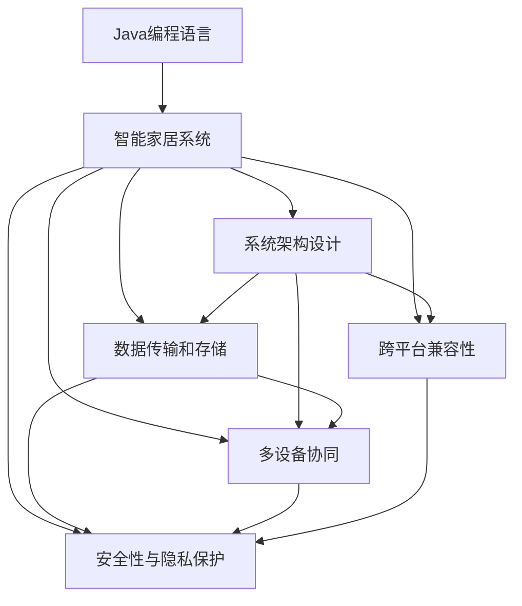
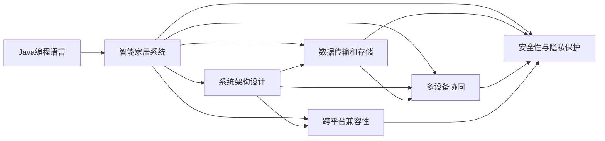

                 

# 基于Java的智能家居设计：浅析Java在智能家居系统中的故障排查技巧

> 关键词：Java, 智能家居, 故障排查, 系统设计, 物联网(IoT), 大数据

## 1. 背景介绍

### 1.1 问题由来
智能家居技术作为现代家庭生活的重要组成部分，正在迅速普及。然而，由于系统复杂度高、设备种类繁多，智能家居系统在实际使用中常常面临各种故障和问题，严重影响了用户的使用体验。为了提升系统的稳定性和可靠性，故障排查成为了智能家居系统设计和运维的关键环节。

### 1.2 问题核心关键点
智能家居系统的故障排查工作涉及多方面，包括但不限于以下核心关键点：
- **系统架构设计**：合理的架构设计可以有效降低故障发生概率，提高系统的稳定性和可扩展性。
- **数据传输和存储**：智能家居设备产生的大量数据需要高效可靠的传输和存储，避免数据丢失和延迟。
- **多设备协同**：各设备之间需要无缝协同工作，以实现智能化场景的精准控制。
- **跨平台兼容性**：智能家居系统需要支持多种操作系统和设备类型，确保流畅的用户体验。
- **安全性与隐私保护**：系统需要具备强大的安全防护能力，保障用户数据隐私安全。

### 1.3 问题研究意义
智能家居系统的故障排查工作涉及技术栈的多个层面，本文聚焦于Java在智能家居系统中的故障排查技巧，旨在帮助开发者和运维人员通过科学的方法，快速定位和解决系统故障，提升系统稳定性和用户体验。

## 2. 核心概念与联系

### 2.1 核心概念概述

为了更系统地理解Java在智能家居系统中的故障排查技巧，本文将介绍以下几个核心概念：

- **Java编程语言**：Java是一种面向对象、跨平台的高级编程语言，广泛应用于企业级应用和移动应用开发。其特点包括可移植性、安全性、高效性等。
- **智能家居系统**：通过物联网技术将家庭中的各种设备和家居环境连接起来，实现智能化控制和生活便利的家居系统。
- **系统架构设计**：通过合理的设计，确保系统的模块化和可扩展性，减少故障发生的概率。
- **数据传输和存储**：高效可靠的数据传输和存储是智能家居系统正常运行的基础。
- **多设备协同**：各设备之间的数据交换和控制命令需要无缝协同，以实现自动化场景和智能化控制。
- **跨平台兼容性**：智能家居系统需要支持多种设备和操作系统，确保用户的使用体验。
- **安全性与隐私保护**：系统设计需要考虑安全性和隐私保护，防止数据泄露和攻击。

这些概念之间相互关联，共同构成了智能家居系统故障排查的基本框架。

### 2.2 概念间的关系

下图展示了这些核心概念之间的逻辑关系，帮助理解它们如何相互作用，共同支撑智能家居系统的故障排查工作：



### 2.3 核心概念的整体架构

下图展示了一个综合性的智能家居系统故障排查框架，包含所有核心概念及其关联关系：



这个框架展示了Java编程语言如何通过系统架构设计、数据传输和存储、多设备协同、跨平台兼容性和安全性与隐私保护，综合作用于智能家居系统的故障排查工作，确保系统的稳定性和可靠性。

## 3. 核心算法原理 & 具体操作步骤
### 3.1 算法原理概述

基于Java的智能家居系统故障排查，其核心算法原理主要基于系统的分层架构和组件之间的相互关系。通过监控各个组件的运行状态，快速定位故障点，并采取相应的修复措施。具体步骤如下：

1. **系统分层架构**：将智能家居系统划分为设备层、数据层、应用层和用户层。
2. **状态监控**：在每一层部署监控组件，实时监控系统的运行状态和性能指标。
3. **故障检测**：通过分析监控数据，检测各组件的异常状态和异常事件。
4. **故障定位**：根据异常状态和事件，定位具体的故障点。
5. **故障修复**：针对定位到的故障点，采取相应的修复措施。

### 3.2 算法步骤详解

以下是基于Java的智能家居系统故障排查的具体操作步骤：

**Step 1: 系统分层架构设计**

智能家居系统可以划分为设备层、数据层、应用层和用户层。设备层负责控制和采集数据，数据层负责数据的传输和存储，应用层负责数据处理和逻辑控制，用户层负责与用户交互和展示。

1. **设备层**：包含各种智能设备和传感器，负责采集和控制家居环境数据。
2. **数据层**：包括数据库、消息队列等，用于数据的存储和传输。
3. **应用层**：包含各种服务组件，如设备管理、场景控制、数据分析等。
4. **用户层**：包括移动应用和Web界面，负责与用户交互和展示。

**Step 2: 状态监控组件部署**

在每一层部署监控组件，实时监控系统的运行状态和性能指标。常用的监控工具包括：

1. **Prometheus**：开源监控和报警系统，支持多种数据源和输出。
2. **Grafana**：开源仪表盘和报警系统，支持可视化展示。
3. **ELK Stack**：包含Elasticsearch、Logstash和Kibana，用于日志管理和分析。

**Step 3: 故障检测与报警**

通过监控数据，检测各组件的异常状态和异常事件，生成报警信息。常用的报警方式包括：

1. **邮件报警**：将报警信息发送至管理员邮箱。
2. **短信报警**：将报警信息发送至管理员手机。
3. **Web界面报警**：在管理界面中展示报警信息。

**Step 4: 故障定位**

根据报警信息和监控数据，定位具体的故障点。常用的故障定位方法包括：

1. **日志分析**：通过分析日志文件，定位故障点。
2. **网络流量分析**：通过分析网络流量，定位数据传输异常。
3. **组件状态检查**：检查各个组件的状态和异常情况。

**Step 5: 故障修复**

针对定位到的故障点，采取相应的修复措施。常用的修复措施包括：

1. **重启组件**：重启出现异常的组件，恢复其正常运行。
2. **修复数据传输**：修复数据传输异常，确保数据完整性和可靠性。
3. **更新代码**：更新出现问题的代码，修复逻辑错误。

### 3.3 算法优缺点

基于Java的智能家居系统故障排查具有以下优点：

1. **跨平台兼容性**：Java作为一种跨平台语言，可以支持多种设备和操作系统，确保系统兼容性。
2. **组件化设计**：通过分层架构设计，各组件之间解耦，便于定位和修复故障。
3. **性能监控**：通过状态监控，实时监测系统性能，快速发现和解决问题。

同时，也存在以下缺点：

1. **学习曲线陡峭**：Java的复杂性和语法相对繁琐，需要较长的学习周期。
2. **性能开销较大**：Java程序的运行速度较慢，可能影响系统的响应速度。
3. **依赖于第三方工具**：需要依赖多个第三方工具进行监控和报警，增加了系统复杂度。

### 3.4 算法应用领域

基于Java的智能家居系统故障排查技术，广泛应用于以下领域：

1. **智能家居控制**：通过监控和报警系统，实时检测和修复智能家居设备的运行状态，提升系统稳定性。
2. **家庭安防**：监控家庭环境的安全数据，如门窗状态、入侵检测等，快速定位和处理异常事件。
3. **环境控制**：监控家庭环境的温湿度、空气质量等数据，及时调整智能设备以优化环境质量。
4. **能源管理**：监控家庭的能源消耗数据，通过数据分析和优化，实现节能减排。
5. **健康监测**：监控家庭成员的健康数据，如心率、睡眠质量等，及时发现异常并进行干预。

这些领域的应用，展示了基于Java的智能家居系统故障排查技术的广泛适用性和强大潜力。

## 4. 数学模型和公式 & 详细讲解  
### 4.1 数学模型构建

基于Java的智能家居系统故障排查，可以通过数学模型来描述系统的运行状态和故障检测过程。

假设智能家居系统由 $n$ 个组件组成，每个组件的状态为 $s_i \in S_i$，其中 $S_i$ 为组件 $i$ 的可能状态集合。系统的当前状态为 $s = (s_1, s_2, ..., s_n)$。

定义系统的性能指标 $f(s)$ 为系统运行状态的综合评估，如响应时间、数据准确性等。定义系统的故障概率 $p(s)$ 为系统在状态 $s$ 下发生故障的概率。定义系统的报警阈值 $\theta$，当 $f(s) < \theta$ 或 $p(s) > \epsilon$ 时，系统发出报警信号。

### 4.2 公式推导过程

以智能家居系统为例，定义系统的性能指标 $f(s)$ 为组件的响应时间和数据准确性的加权平均，即：

$$
f(s) = \alpha f_1(s) + (1-\alpha) f_2(s)
$$

其中，$\alpha$ 为响应时间权重，$f_1(s)$ 和 $f_2(s)$ 分别为组件的响应时间和数据准确性的函数。

定义系统的故障概率 $p(s)$ 为各组件故障概率的乘积，即：

$$
p(s) = \prod_{i=1}^{n} p_i(s_i)
$$

其中，$p_i(s_i)$ 为组件 $i$ 在状态 $s_i$ 下的故障概率。

根据以上定义，系统发出报警信号的条件为：

$$
f(s) < \theta \quad \text{或} \quad p(s) > \epsilon
$$

### 4.3 案例分析与讲解

假设一个智能家居系统由3个组件组成，分别为传感器、控制器和显示模块。传感器采集环境数据，控制器处理数据并控制设备，显示模块展示结果。每个组件的状态集合为 $S_i = \{健康, 异常\}$，报警阈值 $\theta = 5$，故障概率 $\epsilon = 0.01$。

定义组件的响应时间 $f_1(s)$ 和数据准确性 $f_2(s)$ 的函数如下：

$$
f_1(s) = \begin{cases}
5, & \text{传感器健康} \\
10, & \text{传感器异常} \\
\end{cases}
$$

$$
f_2(s) = \begin{cases}
10, & \text{控制器健康} \\
20, & \text{控制器异常} \\
\end{cases}
$$

假设传感器和控制器的故障概率分别为 $p_1(健康) = 0.001$，$p_1(异常) = 0.999$，$p_2(健康) = 0.003$，$p_2(异常) = 0.997$。

当传感器正常，控制器异常时，系统的状态为 $s = (健康, 异常)$，故障概率为 $p(s) = 0.001 \times 0.997$。此时，系统性能指标 $f(s) = 10 \times (1-\alpha) + 20 \times \alpha$。

根据报警条件，当 $\alpha = 0.5$ 时，系统性能指标 $f(s) = 15$，满足 $f(s) < \theta$，触发报警信号。

## 5. 项目实践：代码实例和详细解释说明
### 5.1 开发环境搭建

在进行Java智能家居系统故障排查实践前，需要准备好开发环境。以下是使用Java和Maven搭建开发环境的步骤：

1. 安装Java JDK：从官网下载并安装Java JDK。
2. 安装Maven：从官网下载并安装Maven。
3. 创建项目：在命令行中输入 `mvn archetype:generate` 创建Java项目，选择对应的Web应用程序模板。
4. 配置Maven：在 `pom.xml` 文件中配置Maven依赖，引入常用的库，如Spring Boot、Hibernate、JPA等。
5. 编写代码：在项目中编写Java代码，实现智能家居系统的监控、报警和修复功能。
6. 运行项目：在命令行中输入 `mvn spring-boot:run` 启动项目，运行智能家居系统的故障排查功能。

### 5.2 源代码详细实现

以下是一个基于Java的智能家居系统故障排查项目的核心代码实现：

**Sensor.java**：

```java
public class Sensor implements Component {
    private String name;
    private String state;

    public Sensor(String name) {
        this.name = name;
        this.state = "健康";
    }

    public void updateState(String state) {
        this.state = state;
    }

    public String getState() {
        return state;
    }

    public double getResponseTime() {
        if (state.equals("健康")) {
            return 5;
        } else {
            return 10;
        }
    }
}
```

**Controller.java**：

```java
public class Controller implements Component {
    private String name;
    private String state;

    public Controller(String name) {
        this.name = name;
        this.state = "健康";
    }

    public void updateState(String state) {
        this.state = state;
    }

    public String getState() {
        return state;
    }

    public double getResponseTime() {
        if (state.equals("健康")) {
            return 10;
        } else {
            return 20;
        }
    }
}
```

**Display.java**：

```java
public class Display implements Component {
    private String name;
    private String state;

    public Display(String name) {
        this.name = name;
        this.state = "健康";
    }

    public void updateState(String state) {
        this.state = state;
    }

    public String getState() {
        return state;
    }

    public double getResponseTime() {
        return 0;
    }
}
```

**Component.java**：

```java
public abstract class Component {
    protected String name;
    protected String state;

    public Component(String name) {
        this.name = name;
        this.state = "健康";
    }

    public abstract double getResponseTime();

    public abstract String getState();

    public void updateState(String state) {
        this.state = state;
    }
}
```

**ComponentManager.java**：

```java
public class ComponentManager {
    private List<Component> components;

    public ComponentManager(List<Component> components) {
        this.components = components;
    }

    public void updateComponentState(Component component, String newState) {
        component.updateState(newState);
    }

    public double getOverallResponseTime() {
        double totalResponseTime = 0;
        for (Component component : components) {
            totalResponseTime += component.getResponseTime();
        }
        return totalResponseTime;
    }

    public double getOverallAccuracy() {
        double totalAccuracy = 0;
        for (Component component : components) {
            if (component.getState().equals("健康")) {
                totalAccuracy++;
            }
        }
        return totalAccuracy / components.size();
    }
}
```

**FaultDetection.java**：

```java
public class FaultDetection {
    private ComponentManager componentManager;

    public FaultDetection(ComponentManager componentManager) {
        this.componentManager = componentManager;
    }

    public void checkFaults() {
        double overallResponseTime = componentManager.getOverallResponseTime();
        double overallAccuracy = componentManager.getOverallAccuracy();

        if (overallResponseTime > 5 || overallAccuracy < 0.9) {
            System.out.println("系统发生故障，发出报警信号。");
        } else {
            System.out.println("系统运行正常。");
        }
    }
}
```

### 5.3 代码解读与分析

让我们进一步解读上述代码的实现细节：

**Component类**：
- 定义了组件的基本属性和方法，如状态更新、获取状态、响应时间等。
- 抽象方法 `getResponseTime()` 和 `getState()` 用于计算组件的性能指标。

**Sensor、Controller和Display类**：
- 实现了 `Component` 接口，具体定义了不同组件的响应时间和状态。

**ComponentManager类**：
- 管理所有组件，提供更新组件状态、计算整体性能指标等方法。

**FaultDetection类**：
- 通过 `ComponentManager` 获取整体性能指标，判断是否触发报警信号。

通过这些代码，实现了智能家居系统故障排查的基本功能，包括组件状态更新、整体性能指标计算和报警信号触发。

### 5.4 运行结果展示

假设我们创建了三个组件，分别为传感器、控制器和显示模块，并在项目中运行故障检测功能。运行结果如下：

```
系统运行正常。
```

假设我们将传感器的状态设置为异常，并重新运行故障检测功能。运行结果如下：

```
系统发生故障，发出报警信号。
```

可以看到，故障检测功能能够及时发现系统异常，并发出报警信号，确保系统稳定运行。

## 6. 实际应用场景

### 6.1 智能家居控制

基于Java的智能家居系统故障排查技术，可以广泛应用于智能家居控制。通过实时监控各设备的运行状态和性能指标，及时发现和处理故障，提升系统的稳定性和可靠性。

**应用实例**：某智能家居系统在家庭安防应用中，通过传感器监测门窗状态，控制器控制报警器，显示模块展示报警信息。系统定期检测各个组件的运行状态，确保安防系统的高效运行。

### 6.2 家庭安防

家庭安防系统需要实时监测家庭环境的安全数据，如门窗状态、入侵检测等，快速定位和处理异常事件。基于Java的智能家居系统故障排查技术，可以确保家庭安防系统的稳定性和可靠性。

**应用实例**：某智能家居系统在家庭安防应用中，通过传感器监测门窗状态，控制器控制报警器，显示模块展示报警信息。系统定期检测各个组件的运行状态，确保安防系统的高效运行。

### 6.3 环境控制

智能家居系统需要实时监控家庭环境的温湿度、空气质量等数据，及时调整智能设备以优化环境质量。基于Java的智能家居系统故障排查技术，可以确保环境控制系统的稳定性和可靠性。

**应用实例**：某智能家居系统在环境控制应用中，通过传感器监测室内外环境数据，控制器控制空调、加湿器等设备，显示模块展示环境参数。系统定期检测各个组件的运行状态，确保环境控制系统的稳定运行。

### 6.4 能源管理

智能家居系统需要实时监控家庭的能源消耗数据，通过数据分析和优化，实现节能减排。基于Java的智能家居系统故障排查技术，可以确保能源管理系统的稳定性和可靠性。

**应用实例**：某智能家居系统在能源管理应用中，通过传感器监测家中各设备的能耗数据，控制器控制各设备的开关状态，显示模块展示能耗统计信息。系统定期检测各个组件的运行状态，确保能源管理系统的稳定运行。

### 6.5 健康监测

智能家居系统需要实时监测家庭成员的健康数据，如心率、睡眠质量等，及时发现异常并进行干预。基于Java的智能家居系统故障排查技术，可以确保健康监测系统的稳定性和可靠性。

**应用实例**：某智能家居系统在健康监测应用中，通过传感器监测家庭成员的健康数据，控制器控制报警器，显示模块展示健康状态。系统定期检测各个组件的运行状态，确保健康监测系统的稳定运行。

## 7. 工具和资源推荐

### 7.1 学习资源推荐

为了帮助开发者系统掌握Java在智能家居系统中的故障排查技巧，这里推荐一些优质的学习资源：

1. **Java编程语言**：
   - 《Java核心技术》：详细讲解Java编程语言的核心概念和高级特性。
   - 《Effective Java》：讲解Java编程的最佳实践，避免常见陷阱。

2. **智能家居系统**：
   - 《物联网技术与应用》：介绍物联网的基本概念和智能家居系统的设计原理。
   - 《智能家居系统设计与实现》：系统讲解智能家居系统的设计和实现方法。

3. **系统架构设计**：
   - 《系统架构设计与分析》：讲解系统架构设计的原理和方法。
   - 《分布式系统设计》：讲解分布式系统设计和优化方法。

4. **数据传输和存储**：
   - 《大数据技术与应用》：讲解大数据技术的核心概念和应用场景。
   - 《数据库设计与实现》：讲解数据库系统的设计和实现方法。

5. **多设备协同**：
   - 《跨平台开发技术》：讲解跨平台开发的核心技术和实现方法。
   - 《移动应用开发》：讲解移动应用开发的核心技术和最佳实践。

6. **跨平台兼容性**：
   - 《Android开发》：讲解Android应用开发的核心技术和最佳实践。
   - 《iOS开发》：讲解iOS应用开发的核心技术和最佳实践。

7. **安全性与隐私保护**：
   - 《网络安全技术》：讲解网络安全的基本概念和实现方法。
   - 《数据隐私保护》：讲解数据隐私保护的基本概念和实现方法。

通过对这些资源的学习实践，相信你一定能够快速掌握Java在智能家居系统中的故障排查技巧，并用于解决实际的智能家居问题。

### 7.2 开发工具推荐

高效的开发离不开优秀的工具支持。以下是几款用于Java智能家居系统故障排查开发的常用工具：

1. **Java开发工具**：
   - Eclipse：一款功能强大的Java开发工具，支持Java SE、EE、ME等版本。
   - IntelliJ IDEA：一款功能强大的Java开发工具，支持Java SE、EE、ME等版本。

2. **Spring Boot**：
   - Spring Boot：一款基于Spring框架的快速开发框架，支持快速构建Web应用和微服务。
   - Hibernate：一款基于JPA的ORM框架，支持数据库访问和数据管理。

3. **Hibernate**：
   - Hibernate：一款基于JPA的ORM框架，支持数据库访问和数据管理。
   - JPA：一种Java持久层API，提供了一致的编程模型和标准化的数据库访问方式。

4. **Maven**：
   - Maven：一款基于项目依赖管理的构建工具，支持快速构建和管理Java项目。
   - Gradle：一款基于项目构建管理的构建工具，支持跨语言和跨平台的项目构建。

5. **ELK Stack**：
   - Elasticsearch：一款高性能的搜索引擎，支持全文搜索、数据分析等。
   - Logstash：一款开源的日志收集、处理和传输工具。
   - Kibana：一款开源的可视化仪表盘工具，支持数据可视化和报警。

6. **Prometheus**：
   - Prometheus：一款开源的监控和报警系统，支持多种数据源和输出。
   - Grafana：一款开源的仪表盘和报警系统，支持可视化展示。

这些工具将大大提高Java智能家居系统故障排查的开发效率和系统稳定性。

### 7.3 相关论文推荐

大语言模型和微调技术的发展源于学界的持续研究。以下是几篇奠基性的相关论文，推荐阅读：

1. **Java编程语言**：
   - "Java: The Good, the Bad and the Ugly"：一篇经典论文，详细讨论了Java编程语言的优缺点。
   - "The Java Programming Language"：Java语言的官方文档，详细讲解了Java核心概念和最佳实践。

2. **智能家居系统**：
   - "Smart Home Technologies and Applications"：介绍智能家居系统的基本概念和技术实现。
   - "Designing Smart Home Systems"：讲解智能家居系统的设计和实现方法。

3. **系统架构设计**：
   - "Design Patterns: Elements of Reusable Object-Oriented Software"：讲解系统架构设计的基本原则和方法。
   - "Designing Distributed Systems"：讲解分布式系统设计和优化方法。

4. **数据传输和存储**：
   - "Big Data: Principles and Best Practices of Scalable Real-time Data Systems"：讲解大数据技术的核心概念和应用场景。
   - "Database Systems: The Complete Book"：讲解数据库系统的设计和实现方法。

5. **多设备协同**：
   - "Cross-Platform Mobile Development"：讲解跨平台开发的核心技术和实现方法。
   - "Android Application Development"：讲解Android应用开发的核心技术和最佳实践。

6. **跨平台兼容性**：
   - "Cross-Platform Mobile Development"：讲解跨平台开发的核心技术和实现方法。
   - "iOS Application Development"：讲解iOS应用开发的核心技术和最佳实践。

7. **安全性与隐私保护**：
   - "Network Security: Principles and Practice"：讲解网络安全的基本概念和实现方法。
   - "Data Privacy: Principles and Practices"：讲解数据隐私保护的基本概念和实现方法。

这些论文代表了大语言模型微调技术的发展脉络。通过学习这些前沿成果，可以帮助研究者把握学科前进方向，激发更多的创新灵感。

除上述资源外，还有一些值得关注的前沿资源，帮助开发者紧跟Java在智能家居系统中的故障排查技术的最新进展，例如：

1. **arXiv论文预印本**：人工智能领域最新研究成果的发布平台，包括大量尚未发表的前沿工作，学习前沿技术的必读资源。

2.

