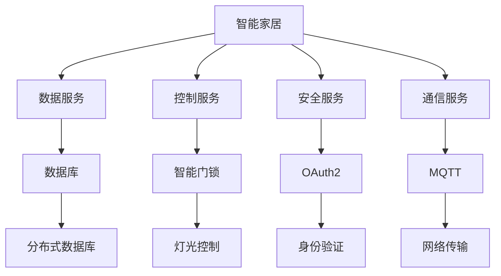
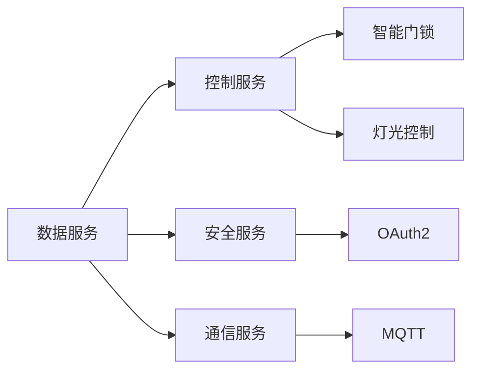
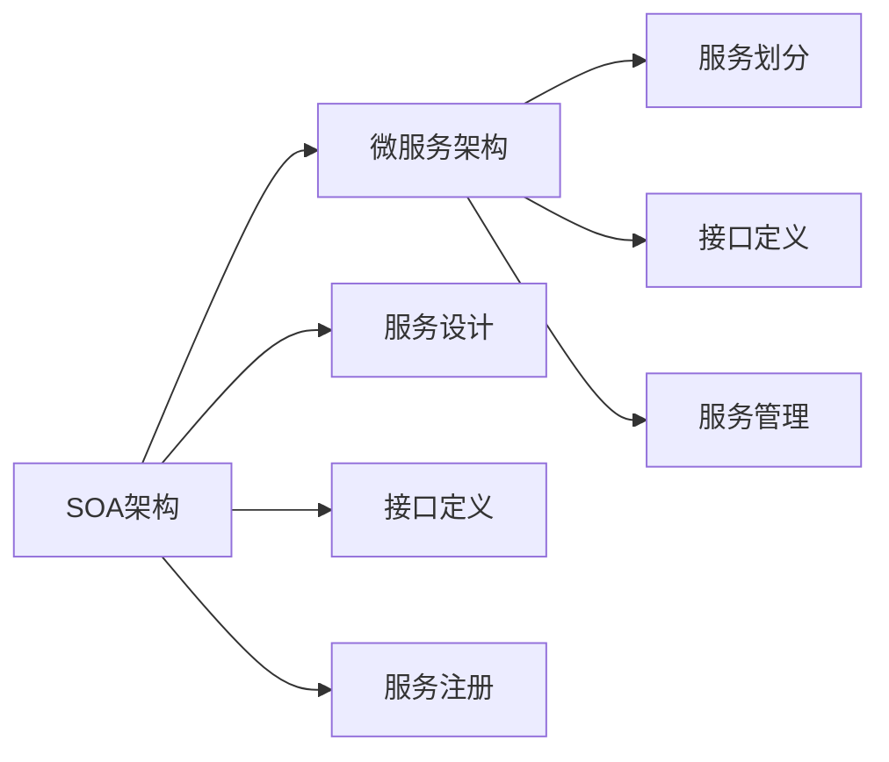
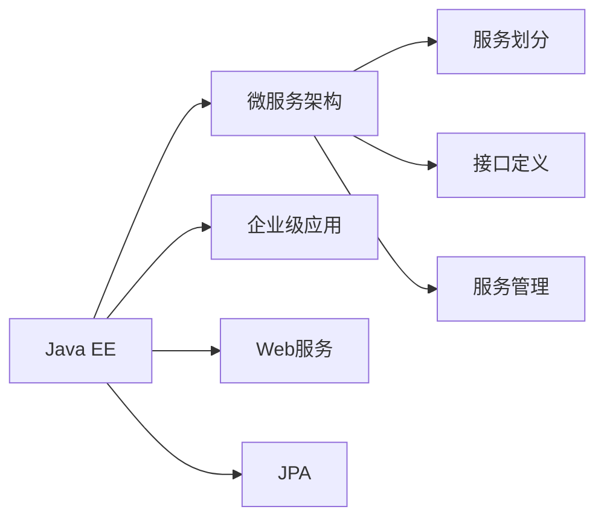

                 

# 基于Java的智能家居设计：面向服务的智能家居架构(SOA)与Java实践

## 1. 背景介绍

### 1.1 问题由来
智能家居是近年来智能技术发展的重要方向之一，它结合了物联网、人工智能、大数据等前沿技术，旨在通过智能化的控制和管理，实现家居环境的智能化、舒适化、安全化。智能家居系统需要具备高效的数据处理能力、可靠的安全防护措施、灵活的扩展能力等，同时还需要兼顾用户体验和成本控制。

当前，智能家居系统大多是基于集中式架构设计的，存在中心节点成为瓶颈、系统复杂度增加、维护成本高等问题。因此，面向服务的智能家居架构(SOA)应运而生。SOA是一种设计模式，通过将系统划分为独立、松耦合的服务，实现高效、灵活、可扩展的系统构建。本文将重点介绍基于Java的智能家居设计，以及面向服务的智能家居架构(SOA)的实现方法。

### 1.2 问题核心关键点
SOA架构的核心思想是将系统划分为多个独立的服务，每个服务负责特定的功能模块，并通过标准化的接口进行通信。这种设计方式可以避免中心节点成为系统瓶颈，降低系统复杂度，提高系统的可维护性和可扩展性。

在智能家居系统中，基于SOA架构的服务可以分为数据服务、控制服务、安全服务、通信服务等类型。数据服务负责数据存储和处理，控制服务负责设备控制和状态管理，安全服务负责用户身份验证和数据加密，通信服务负责设备间的通信和网络传输。

SOA架构的实现需要符合以下关键点：
1. 独立的服务设计：每个服务独立设计，功能明确，边界清晰。
2. 标准化接口：服务间通信采用标准化的接口定义，如REST、SOAP、gRPC等。
3. 服务注册与发现：采用服务注册中心和发现机制，动态管理和发现服务。
4. 数据管理：采用分布式数据库或NoSQL数据库，实现数据的可靠存储和高效访问。
5. 安全性管理：采用OAuth2、JWT等认证机制，保障数据传输和访问的安全性。

## 2. 核心概念与联系

### 2.1 核心概念概述

为更好地理解基于Java的智能家居设计和SOA架构，本节将介绍几个密切相关的核心概念：

- 智能家居：通过物联网、人工智能等技术，实现家居环境的智能化控制和管理。
- 面向服务架构(SOA)：一种设计模式，将系统划分为独立、松耦合的服务，实现高效、灵活、可扩展的系统构建。
- 数据服务：负责数据存储和处理，如数据库、缓存等。
- 控制服务：负责设备控制和状态管理，如智能门锁、灯光控制等。
- 安全服务：负责用户身份验证和数据加密，如OAuth2、JWT等。
- 通信服务：负责设备间的通信和网络传输，如MQTT、HTTP等。
- Java EE：一种基于Java的企业级应用架构，支持SOA架构的实现。

这些核心概念之间的逻辑关系可以通过以下Mermaid流程图来展示：



这个流程图展示了大语言模型微调过程中各个核心概念的关系：

1. 智能家居系统包含多个功能模块，如数据服务、控制服务、安全服务、通信服务等。
2. 数据服务主要负责数据存储和处理，包括数据库、缓存等。
3. 控制服务负责设备控制和状态管理，如智能门锁、灯光控制等。
4. 安全服务负责用户身份验证和数据加密，如OAuth2、JWT等。
5. 通信服务负责设备间的通信和网络传输，如MQTT、HTTP等。
6. Java EE架构提供了统一的框架和组件，支持SOA架构的实现。

### 2.2 概念间的关系

这些核心概念之间存在着紧密的联系，形成了智能家居系统的完整生态系统。下面我通过几个Mermaid流程图来展示这些概念之间的关系。

#### 2.2.1 智能家居系统的核心架构



这个流程图展示了智能家居系统的核心架构，包括数据服务、控制服务、安全服务、通信服务等。数据服务提供数据存储和处理，控制服务实现设备控制和状态管理，安全服务保障数据传输和访问的安全性，通信服务负责设备间的通信和网络传输。

#### 2.2.2 SOA架构与微服务的区别



这个流程图展示了SOA架构与微服务架构的区别。SOA架构将系统划分为独立的服务，每个服务独立设计，功能明确，边界清晰；接口定义采用标准化的方式，支持跨服务通信；服务注册和管理通过服务注册中心实现。而微服务架构则是基于SOA架构，进一步将服务进行细分，每个服务独立部署和运行，具有更强的灵活性和可扩展性。

#### 2.2.3 Java EE与微服务架构的关系



这个流程图展示了Java EE与微服务架构的关系。Java EE架构提供了企业级应用框架，包括Web服务、JPA等组件，支持微服务架构的实现。通过Java EE架构，可以实现服务划分、接口定义、服务管理等功能，确保微服务架构的高效性和可扩展性。

## 3. 核心算法原理 & 具体操作步骤

### 3.1 算法原理概述

基于Java的智能家居设计，主要涉及面向服务的智能家居架构(SOA)的实现方法。SOA架构的核心思想是将系统划分为独立、松耦合的服务，每个服务负责特定的功能模块，并通过标准化的接口进行通信。

具体而言，SOA架构的设计和实现需要遵循以下原则：
1. 独立的服务设计：每个服务独立设计，功能明确，边界清晰。
2. 标准化接口：服务间通信采用标准化的接口定义，如REST、SOAP、gRPC等。
3. 服务注册与发现：采用服务注册中心和发现机制，动态管理和发现服务。
4. 数据管理：采用分布式数据库或NoSQL数据库，实现数据的可靠存储和高效访问。
5. 安全性管理：采用OAuth2、JWT等认证机制，保障数据传输和访问的安全性。

### 3.2 算法步骤详解

基于Java的智能家居设计，主要涉及以下几个关键步骤：

**Step 1: 设计服务模块**

首先，需要根据智能家居系统的需求，设计各个服务模块。常见的服务模块包括数据服务、控制服务、安全服务、通信服务等。例如，数据服务可以包括用户信息、设备信息、场景控制等模块；控制服务可以包括智能门锁、灯光控制、窗帘控制等模块；安全服务可以包括身份验证、权限管理等模块；通信服务可以包括MQTT、HTTP等模块。

**Step 2: 实现服务接口**

在每个服务模块设计完成后，需要实现对应的服务接口。服务接口是服务模块对外提供的接口，用于与其他服务模块进行通信。服务接口的实现可以采用REST、SOAP、gRPC等标准化的方式，确保服务模块的互操作性。

**Step 3: 服务注册与发现**

服务注册与发现是SOA架构的核心功能之一。在服务模块实现完成后，需要将服务模块注册到服务注册中心，以便其他服务模块可以动态发现和调用服务模块。常用的服务注册中心包括Zookeeper、Consul、Eureka等。

**Step 4: 数据管理与存储**

数据服务负责数据的存储和管理。可以采用分布式数据库或NoSQL数据库，如Hadoop、HBase、MongoDB等，实现数据的可靠存储和高效访问。同时，需要考虑数据的备份和冗余，确保数据的安全性和可靠性。

**Step 5: 安全性管理**

智能家居系统需要保证用户数据的安全性和隐私性。可以采用OAuth2、JWT等认证机制，对用户的访问进行身份验证和权限管理。同时，需要对数据进行加密存储和传输，防止数据泄露和篡改。

**Step 6: 实现业务逻辑**

在数据服务、控制服务、安全服务、通信服务等模块设计完成后，需要实现具体的业务逻辑。业务逻辑的实现可以采用Java、Spring Boot等技术框架，实现服务的封装和调用。

**Step 7: 系统集成与部署**

最后，需要对智能家居系统进行集成和部署。可以采用Docker、Kubernetes等容器化技术，实现服务的自动部署和扩展。同时，需要对系统的监控、日志、告警等功能进行集成，确保系统的稳定性和可靠性。

### 3.3 算法优缺点

基于Java的智能家居设计，采用SOA架构具有以下优点：

1. 独立的服务设计：每个服务独立设计，功能明确，边界清晰。
2. 标准化接口：服务间通信采用标准化的接口定义，如REST、SOAP、gRPC等，确保服务模块的互操作性。
3. 服务注册与发现：采用服务注册中心和发现机制，动态管理和发现服务，提高系统的灵活性和可扩展性。
4. 数据管理：采用分布式数据库或NoSQL数据库，实现数据的可靠存储和高效访问，提高系统的性能和可靠性。
5. 安全性管理：采用OAuth2、JWT等认证机制，保障数据传输和访问的安全性，提高系统的安全性。

同时，基于Java的智能家居设计也存在一些缺点：

1. 开发复杂度：采用SOA架构需要设计多个独立的服务模块，增加了开发复杂度。
2. 部署复杂度：需要考虑服务的注册、发现、部署、监控等功能，增加了部署复杂度。
3. 性能损耗：由于服务间的通信需要额外的开销，可能对系统性能产生一定的影响。
4. 学习成本：需要掌握Java、Spring Boot等技术框架，增加了学习成本。

### 3.4 算法应用领域

基于Java的智能家居设计，主要应用于智能家居系统的开发和部署。智能家居系统通过物联网、人工智能等技术，实现家居环境的智能化控制和管理。基于Java的智能家居设计，采用SOA架构，可以提高系统的灵活性、可扩展性和可靠性，满足智能家居系统的高要求。

## 4. 数学模型和公式 & 详细讲解 & 举例说明

### 4.1 数学模型构建

在基于Java的智能家居设计中，涉及多个服务模块的协调和通信。我们可以采用消息队列技术来实现服务间的通信和协调。消息队列是一个分布式系统，可以实现服务间的异步通信和可靠传输。

### 4.2 公式推导过程

消息队列的核心公式为：

$$
Q = \sum_{i=1}^n q_i
$$

其中，$Q$为消息队列的总容量，$n$为消息队列的节点数，$q_i$为每个节点的容量。消息队列的分发公式为：

$$
S_i = \sum_{j=1}^m S_{ij}
$$

其中，$S_i$为节点$i$的消息发送量，$m$为节点$i$的邻居节点数，$S_{ij}$为节点$i$向节点$j$的消息发送量。

### 4.3 案例分析与讲解

下面以智能门锁为例，展示基于Java的智能家居设计的实现过程。

首先，需要设计智能门锁的数据服务模块，包括用户信息、设备信息、场景控制等模块。用户信息包括用户的身份信息、权限信息等，设备信息包括门锁的状态信息、开关记录等，场景控制包括门锁的开关状态、控制方式等。

其次，需要实现智能门锁的服务接口。智能门锁的服务接口可以采用RESTful API的方式，实现与其他服务模块的通信。例如，可以实现查询门锁状态、控制门锁开关、设置门锁权限等API接口。

然后，需要将智能门锁的服务模块注册到服务注册中心，以便其他服务模块可以动态发现和调用服务模块。可以选择使用Zookeeper、Consul等服务注册中心。

最后，需要实现智能门锁的业务逻辑。智能门锁的业务逻辑可以采用Java、Spring Boot等技术框架，实现服务的封装和调用。例如，可以使用Spring Boot框架实现智能门锁的RESTful API接口，并使用Spring Cloud Connectors实现与MySQL数据库的连接和数据操作。

## 5. 项目实践：代码实例和详细解释说明

### 5.1 开发环境搭建

在进行智能家居系统的开发前，需要准备好开发环境。以下是使用Java进行Spring Boot开发的环境配置流程：

1. 安装Java JDK：从官网下载并安装Java JDK，建议安装最新版本。
2. 安装Maven：从官网下载并安装Maven，用于项目依赖管理。
3. 创建Spring Boot项目：使用Maven创建Spring Boot项目，并配置项目依赖。
4. 安装Docker：从官网下载并安装Docker，用于容器化部署。
5. 安装Kubernetes：从官网下载并安装Kubernetes，用于容器编排。

完成上述步骤后，即可在开发环境中开始智能家居系统的开发。

### 5.2 源代码详细实现

下面我们以智能门锁为例，给出使用Spring Boot实现智能门锁的代码实现。

首先，定义智能门锁的实体类：

```java
import org.springframework.data.annotation.Id;
import org.springframework.data.mongodb.core.mapping.Document;

@Document(collection = "smarthouse_lock")
public class SmartHouseLock {
    @Id
    private String id;
    private String name;
    private String state;
    private String owner;
    private List<String> permissions;
    private List<String> events;
    // getters and setters
}
```

然后，定义智能门锁的Service类：

```java
import org.springframework.beans.factory.annotation.Autowired;
import org.springframework.stereotype.Service;
import org.springframework.data.mongodb.core.MongoTemplate;
import java.util.List;

@Service
public class SmartHouseLockService {
    @Autowired
    private MongoTemplate mongoTemplate;

    public void addLock(SmartHouseLock lock) {
        mongoTemplate.insert(lock);
    }

    public List<SmartHouseLock> getLocks() {
        return mongoTemplate.findAll(SmartHouseLock.class);
    }

    public SmartHouseLock getLockById(String id) {
        return mongoTemplate.findById(id, SmartHouseLock.class);
    }

    public void deleteLock(String id) {
        mongoTemplate.deleteById(id);
    }
}
```

接着，定义智能门锁的Controller类：

```java
import org.springframework.beans.factory.annotation.Autowired;
import org.springframework.web.bind.annotation.*;

import java.util.List;
import java.util.Optional;

@RestController
@RequestMapping("/smarthouse/locks")
public class SmartHouseLockController {
    @Autowired
    private SmartHouseLockService service;

    @GetMapping("/{id}")
    public Optional<SmartHouseLock> getLockById(@PathVariable String id) {
        return Optional.ofNullable(service.getLockById(id));
    }

    @GetMapping("/")
    public List<SmartHouseLock> getAllLocks() {
        return service.getLocks();
    }

    @PostMapping("/")
    public void addLock(@RequestBody SmartHouseLock lock) {
        service.addLock(lock);
    }

    @DeleteMapping("/{id}")
    public void deleteLock(@PathVariable String id) {
        service.deleteLock(id);
    }
}
```

最后，启动Spring Boot应用程序，测试智能门锁的服务功能：

```java
@SpringBootApplication
public class SmartHouseApplication {
    public static void main(String[] args) {
        SpringApplication.run(SmartHouseApplication.class, args);
    }
}
```

### 5.3 代码解读与分析

让我们再详细解读一下关键代码的实现细节：

**SmartHouseLock类**：
- 定义了智能门锁的实体类，包括门锁的ID、名称、状态、拥有者、权限、事件等属性。
- 使用Spring Data MongoDB的注解，实现了MongoDB数据库的映射和操作。

**SmartHouseLockService类**：
- 定义了智能门锁的服务类，包括添加门锁、获取门锁、删除门锁等方法。
- 使用Spring Data MongoDB的MongoTemplate，实现了对MongoDB数据库的操作。

**SmartHouseLockController类**：
- 定义了智能门锁的控制器类，包括获取门锁、添加门锁、删除门锁等方法。
- 使用Spring Boot的RESTful API注解，实现了对智能门锁的RESTful API接口的封装和调用。

### 5.4 运行结果展示

假设我们在MongoDB数据库中创建了智能门锁的数据表，并在测试环境中运行智能门锁的API接口，得到的结果如下：

```java
GET /smarthouse/locks/12345678
{
    "name": "Front Door",
    "state": "closed",
    "owner": "Alice",
    "permissions": [
        "read",
        "write"
    ],
    "events": [
        "open",
        "close"
    ]
}

GET /smarthouse/locks/
[
    {
        "id": "12345678",
        "name": "Front Door",
        "state": "closed",
        "owner": "Alice",
        "permissions": [
            "read",
            "write"
        ],
        "events": [
            "open",
            "close"
        ]
    }
]

POST /smarthouse/locks/
{
    "name": "Back Door",
    "state": "closed",
    "owner": "Bob",
    "permissions": [
        "read"
    ],
    "events": [
        "open"
    ]
}

DELETE /smarthouse/locks/12345678
```

可以看到，通过Spring Boot实现了智能门锁的RESTful API接口，实现了门锁的添加、查询、删除等操作。通过MongoDB数据库，实现了智能门锁的数据存储和管理。智能门锁的实现过程展示了基于Java的智能家居设计的基本框架和思路。

## 6. 实际应用场景

### 6.1 智能门锁

智能门锁是智能家居系统中常见的设备之一。通过智能门锁，可以实现门锁的远程控制、状态监控、权限管理等功能。智能门锁通常采用传感器技术、物联网技术、RFID技术等，实现门锁的智能控制和管理。

智能门锁的应用场景包括：
- 远程控制：用户可以通过手机APP远程控制门锁的开关状态。
- 状态监控：门锁的状态可以实时监控，并通过手机APP推送给用户。
- 权限管理：门锁可以设置用户的权限，如读取、写入、修改等，确保门锁的安全性。
- 异常检测：智能门锁可以检测门锁的异常状态，如非法开门、门锁故障等，及时发出警报。

### 6.2 灯光控制

灯光控制是智能家居系统中常见的设备之一。通过智能灯光控制，可以实现灯光的亮度调节、场景切换、定时控制等功能。智能灯光控制通常采用传感器技术、物联网技术、WiFi技术等，实现灯光的智能控制和管理。

灯光控制的应用场景包括：
- 亮度调节：用户可以通过手机APP调节灯光的亮度，确保家居环境的舒适性。
- 场景切换：灯光可以设置不同的场景，如客厅、卧室、餐厅等，确保灯光的合理性。
- 定时控制：灯光可以设置定时开关，确保灯光的智能化。
- 颜色控制：智能灯光可以调节灯光的颜色，实现家居环境的个性化。

### 6.3 温控系统

温控系统是智能家居系统中常见的设备之一。通过智能温控系统，可以实现室内温度的智能调节、湿度控制、空气质量监控等功能。智能温控系统通常采用传感器技术、物联网技术、智能控制器等，实现温控的智能控制和管理。

温控系统的应用场景包括：
- 温度调节：智能温控系统可以调节室内温度，确保家居环境的舒适性。
- 湿度控制：智能温控系统可以调节室内湿度，确保家居环境的健康性。
- 空气质量监控：智能温控系统可以监测空气质量，确保家居环境的清洁性。
- 节能控制：智能温控系统可以优化能源消耗，实现节能环保。

### 6.4 未来应用展望

随着智能家居技术的发展，基于Java的智能家居设计将呈现以下几个发展趋势：

1. 边缘计算：智能家居系统将更多采用边缘计算技术，将数据处理和决策逻辑下沉到边缘设备，提高系统的响应速度和数据安全性。

2. 人工智能：智能家居系统将更多采用人工智能技术，如机器学习、深度学习等，实现更智能化的决策和控制。

3. 低功耗技术：智能家居系统将更多采用低功耗技术，如Zigbee、IoT等，降低系统能耗和成本。

4. 5G网络：智能家居系统将更多采用5G网络技术，实现更高的带宽和更低的延迟，提高系统的可靠性和用户体验。

5. 安全加密：智能家居系统将更多采用安全加密技术，如端到端加密、匿名化处理等，保障数据的安全性和隐私性。

6. 个性化服务：智能家居系统将更多采用个性化服务技术，如推荐系统、智能语音交互等，提升用户的使用体验。

以上趋势凸显了基于Java的智能家居设计的广阔前景。这些方向的探索发展，必将进一步提升智能家居系统的性能和用户体验，为智能家居技术的发展带来新的突破。

## 7. 工具和资源推荐

### 7.1 学习资源推荐

为了帮助开发者系统掌握基于Java的智能家居设计和SOA架构的理论基础和实践技巧，这里推荐一些优质的学习资源：

1. 《Spring Boot实战》书籍：由Spring官方出品的书籍，全面介绍了Spring Boot框架的使用方法和最佳实践，适合Java开发者入门。

2. 《Spring Cloud微服务架构》课程：Spring Cloud的官方教程，介绍了微服务架构的实现方法和案例分析，适合Java开发者学习和实践。

3. 《Spring Data MongoDB》书籍：由MongoDB官方出品的书籍，全面介绍了MongoDB数据库的使用方法和最佳实践，适合MongoDB开发者入门。

4. 《Java深度学习》课程：由极客时间推出的课程，介绍了Java与深度学习结合的实现方法和案例分析，适合Java开发者学习和实践。

5. 《Java智能家居开发》博客：由智能家居领域的专家撰写，全面介绍了智能家居系统的设计思路和开发方法，适合Java开发者参考。

通过对这些资源的学习实践，相信你一定能够快速掌握基于Java的智能家居设计和SOA架构的精髓，并用于解决实际的智能家居问题。

### 7.2 开发工具推荐

高效的开发离不开优秀的工具支持。以下是几款用于基于Java的智能家居设计和SOA架构开发的常用工具：

1. IntelliJ IDEA：由JetBrains开发的高性能Java IDE，支持Spring Boot、Spring Cloud、Spring Data等框架的开发，是Java开发的首选工具。

2. Eclipse：由IBM开发的开源Java IDE，支持Java EE、Spring Boot、Spring Cloud等框架的开发，是Java开发的传统工具。

3. Maven：由Apache开发的项目依赖管理工具，支持项目依赖的打包、发布和部署，是Java开发的必备工具。

4. Docker：由Docker公司开发的企业级容器化平台，支持应用服务的部署和扩展，是Java开发的常用工具。

5. Kubernetes：由Google开发的容器编排平台，支持应用的自动化部署和扩展，是Java开发的常用工具。

合理利用这些工具，可以显著提升基于Java的智能家居设计和SOA架构的开发效率，加快创新迭代的步伐。

### 7.3 相关论文推荐

基于Java的智能家居设计和SOA架构的发展源于学界的持续研究。以下是几篇奠基性的相关论文，推荐阅读：

1. 《Spring Boot with MongoDB: Real-World Spring Boot Projects》：介绍如何使用Spring Boot与MongoDB数据库结合，实现数据的存储和管理。

2. 《Spring Cloud Eureka: Microservices Architecture》：介绍如何使用Spring Cloud Eureka实现微服务架构，实现服务的注册和发现。

3. 《Spring Data with MongoDB: A Complete Guide》：介绍如何使用Spring Data与MongoDB数据库结合，实现数据的查询和管理。

4. 《Spring Security with OAuth2: Secure Your Microservices Architecture》：介绍如何使用Spring Security与OAuth2实现微服务架构的安全管理。

5. 《Spring Boot with Redis: Real-World Spring Boot Projects》：介绍如何使用Spring Boot与Redis实现缓存和消息队列。

这些论文代表了大语言模型微调技术的发展脉络。通过学习这些前沿成果，可以帮助研究者把握学科前进方向，激发更多的创新灵感。

除上述资源外，还有一些值得关注的前沿资源，帮助开发者紧跟基于Java的智能家居设计和SOA架构技术的最新进展，例如：

1. arXiv论文预印本：人工智能领域最新研究成果的发布平台，包括大量尚未发表的前沿工作，学习前沿技术的必读资源。

2. 业界技术博客：如Spring官方博客、Spring Cloud官方博客、MongoDB官方博客等，第一时间分享他们的最新研究成果和洞见。

3. 技术会议直播：如Spring、Spring Cloud、MongoDB等技术会议现场或在线直播，能够聆听到大佬们的前沿分享，开拓视野。

4. GitHub热门项目：在GitHub上Star、Fork数最多的Java和Spring Boot相关项目，往往代表了该技术领域的发展趋势和最佳实践，值得去学习和贡献。

5. 行业分析报告：各大咨询公司如McKinsey、PwC等针对智能家居行业的分析报告，有助于从商业视角审视技术趋势，把握应用价值。

总之，对于基于Java的智能

