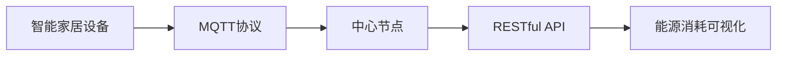

                 

# 基于MQTT协议和RESTful API的智能家居能源消耗可视化

> 关键词：MQTT协议,RESTful API,智能家居,能源消耗可视化

## 1. 背景介绍

随着物联网技术的发展，智能家居设备变得越来越普及。然而，这些设备所消耗的能源正在不断增加，如何有效管理和降低能耗成为当前智能家居领域的重要课题。本文将介绍一种基于MQTT协议和RESTful API的智能家居能源消耗可视化方案，旨在帮助用户实时监控和优化智能家居设备的能源使用情况，从而实现节能减排的目标。

### 1.1 智能家居能源管理现状

智能家居设备的数量和种类日益增加，但如何有效地管理和控制这些设备的能源消耗，目前仍存在不少问题。主要体现在以下几个方面：

- **数据分散**：不同的智能设备来自不同的厂商，数据格式和接口各异，难以统一管理和分析。
- **能耗监控不足**：许多智能设备缺乏实时的能耗监控，用户无法及时了解设备的能耗情况，难以优化使用。
- **用户参与度低**：尽管智能设备众多，但用户对能源使用的了解和参与度仍然较低，缺乏有效的激励机制。

针对上述问题，本文提出一种基于MQTT协议和RESTful API的智能家居能源消耗可视化方案，通过统一数据格式和接口，实现能耗的实时监控和可视化，提高用户参与度，从而降低能耗。

## 2. 核心概念与联系

### 2.1 核心概念概述

- **MQTT协议**：一种轻量级的消息传输协议，常用于物联网设备的通信。MQTT协议具有低带宽、低延迟和高可靠性的特点，适合于智能家居设备之间的数据交互。
- **RESTful API**：一种基于HTTP协议的API设计风格，通过URL和HTTP方法实现资源的操作，支持各种数据格式和编码方式。RESTful API易于使用和扩展，广泛应用于智能家居系统的开发。
- **智能家居设备**：包括智能照明、智能温控器、智能插座等各类设备和传感器，用于监测和控制家居环境。
- **能源消耗可视化**：通过图表、仪表盘等形式，将能源消耗数据直观呈现给用户，帮助用户理解和使用能耗数据。

### 2.2 概念间的关系

下图展示了基于MQTT协议和RESTful API的智能家居能源消耗可视化方案的核心概念及其关系：



从图可以看出，智能家居设备通过MQTT协议与中心节点通信，中心节点再将数据通过RESTful API传递给能源消耗可视化系统，从而实现能源消耗的实时监控和可视化。

## 3. 核心算法原理 & 具体操作步骤
### 3.1 算法原理概述

基于MQTT协议和RESTful API的智能家居能源消耗可视化方案，主要涉及以下几个步骤：

1. **数据采集**：通过MQTT协议从智能家居设备采集能源消耗数据。
2. **数据存储**：将采集的数据存储到中心节点，通过RESTful API进行数据管理和查询。
3. **数据处理**：对存储的数据进行分析处理，生成能耗统计报表和可视化图表。
4. **数据展示**：通过RESTful API将处理后的数据展示给用户，实现能源消耗可视化。

### 3.2 算法步骤详解

#### 3.2.1 数据采集

在数据采集阶段，需要实现以下几个功能：

- **MQTT客户端**：在智能家居设备上安装MQTT客户端，实现与中心节点的通信。
- **设备数据接入**：将智能家居设备接入MQTT协议，实现能耗数据的采集。

以下是一个简单的Python代码示例，展示了如何使用Paho-MQTT库实现MQTT客户端的连接和数据订阅：

```python
import paho.mqtt.client as mqtt

# 定义MQTT客户端
client = mqtt.Client()

# 连接MQTT服务器
client.connect("mqtt.example.com", 1883, 60)

# 订阅数据主题
client.subscribe("energy consumption/#")

# 接收数据
def on_message(client, userdata, message):
    print(f"Received message: {message.payload.decode()}")
    # 处理数据

# 订阅消息
client.on_message = on_message

# 启动循环
client.loop_start()
```

#### 3.2.2 数据存储

在数据存储阶段，需要实现以下几个功能：

- **中心节点**：在中心节点部署数据库和数据管理系统，用于存储和查询能耗数据。
- **数据存储**：将采集到的能耗数据存储到数据库中，通过RESTful API实现数据管理和查询。

以下是一个简单的Python代码示例，展示了如何使用Flask框架实现RESTful API的数据存储和查询：

```python
from flask import Flask, request, jsonify

# 定义RESTful API
app = Flask(__name__)

# 存储数据
@app.route("/energy/consumption", methods=["POST"])
def store_consumption():
    data = request.get_json()
    # 存储数据到数据库
    return jsonify({"success": True})

# 查询数据
@app.route("/energy/consumption/<device_id>", methods=["GET"])
def get_consumption(device_id):
    # 查询数据库，返回能耗数据
    return jsonify({"consumption": data})

# 启动API
if __name__ == "__main__":
    app.run(host="0.0.0.0", port=5000)
```

#### 3.2.3 数据处理

在数据处理阶段，需要实现以下几个功能：

- **数据清洗**：对采集到的能耗数据进行清洗和处理，去除异常值和噪声。
- **数据分析**：对清洗后的能耗数据进行分析，生成能耗统计报表和可视化图表。

以下是一个简单的Python代码示例，展示了如何使用Pandas和Matplotlib库进行数据清洗和可视化：

```python
import pandas as pd
import matplotlib.pyplot as plt

# 读取数据
data = pd.read_csv("energy_data.csv")

# 数据清洗
data = data.dropna()

# 数据分析
consumption_by_device = data.groupby("device_id")["consumption"].sum()

# 可视化
consumption_by_device.plot(kind="bar")
plt.show()
```

#### 3.2.4 数据展示

在数据展示阶段，需要实现以下几个功能：

- **RESTful API**：通过RESTful API将处理后的能耗数据展示给用户。
- **能耗可视化**：将能耗数据通过图表和仪表盘等形式直观呈现给用户。

以下是一个简单的Python代码示例，展示了如何使用Flask框架实现RESTful API的数据展示：

```python
from flask import Flask, jsonify

# 定义RESTful API
app = Flask(__name__)

# 展示数据
@app.route("/energy/consumption/<device_id>", methods=["GET"])
def show_consumption(device_id):
    # 查询数据库，返回能耗数据
    consumption = data.groupby("device_id")["consumption"].sum()
    return jsonify({"consumption": consumption})

# 启动API
if __name__ == "__main__":
    app.run(host="0.0.0.0", port=5000)
```

## 4. 数学模型和公式 & 详细讲解 & 举例说明

### 4.1 数学模型构建

在数据处理阶段，我们假设智能家居设备的能源消耗数据服从正态分布，其均值为μ，标准差为σ。

设智能家居设备数量为N，每天的能源消耗为$C_i$（$i=1,2,\ldots,N$），则总能源消耗为$C=\sum_{i=1}^{N}C_i$。

我们的目标是生成能耗统计报表和可视化图表，帮助用户理解和使用能耗数据。

### 4.2 公式推导过程

根据上述假设，我们可以推导出以下公式：

1. **能耗统计报表**：

   - **均值和标准差**：
     \[
     \mu = \frac{\sum_{i=1}^{N}C_i}{N}
     \]
     \[
     \sigma = \sqrt{\frac{\sum_{i=1}^{N}(C_i-\mu)^2}{N}}
     \]

   - **95%置信区间**：
     \[
     C_{\text{ci}} = \mu \pm 1.96\frac{\sigma}{\sqrt{N}}
     \]

2. **能耗可视化图表**：

   - **折线图**：
     \[
     C_i(t) = C_0 + a_i t
     \]

   - **散点图**：
     \[
     C_i(t) = C_0 + \epsilon_i
     \]

其中，$C_0$为初始能源消耗，$a_i$为能源消耗速率，$\epsilon_i$为随机噪声。

### 4.3 案例分析与讲解

假设我们有一组智能家居设备的能源消耗数据，每天的能源消耗如下表所示：

| 设备编号 | 能源消耗（千瓦时） |
|----------|-------------------|
| 1        | 2.5               |
| 2        | 3.0               |
| 3        | 1.5               |
| 4        | 2.0               |
| 5        | 2.5               |
| ...      | ...               |

我们可以使用上述公式，计算每天的总能源消耗、均值和标准差，以及95%置信区间。

## 5. 项目实践：代码实例和详细解释说明
### 5.1 开发环境搭建

为了搭建基于MQTT协议和RESTful API的智能家居能源消耗可视化系统，需要以下几个开发环境：

1. **MQTT服务器**：部署MQTT服务器，用于连接和管理智能家居设备。
2. **数据库**：部署数据库，用于存储和管理能耗数据。
3. **Web服务器**：部署Web服务器，用于提供RESTful API和可视化服务。

以下是搭建开发环境的详细步骤：

- **MQTT服务器**：可以使用MQTT-Broker作为MQTT服务器，安装部署并配置好。
- **数据库**：可以使用MySQL或PostgreSQL作为数据库，安装部署并配置好。
- **Web服务器**：可以使用Apache或Nginx作为Web服务器，安装部署并配置好。

### 5.2 源代码详细实现

以下是一个简单的Python代码示例，展示了如何使用Paho-MQTT、Flask和MySQL实现基于MQTT协议和RESTful API的智能家居能源消耗可视化系统：

```python
import paho.mqtt.client as mqtt
from flask import Flask, jsonify, request
import mysql.connector

# 定义MQTT客户端
client = mqtt.Client()

# 连接MQTT服务器
client.connect("mqtt.example.com", 1883, 60)

# 订阅数据主题
client.subscribe("energy consumption/#")

# 存储数据
def store_consumption(data):
    # 连接MySQL数据库
    conn = mysql.connector.connect(
        host="localhost",
        user="root",
        password="password",
        database="energy_consumption"
    )
    cursor = conn.cursor()
    # 插入数据
    cursor.execute(
        "INSERT INTO energy_consumption (device_id, consumption, timestamp) VALUES (%s, %s, %s)",
        (data["device_id"], data["consumption"], data["timestamp"])
    )
    conn.commit()
    conn.close()

# 存储数据
@app.route("/energy/consumption", methods=["POST"])
def store_consumption():
    data = request.get_json()
    store_consumption(data)
    return jsonify({"success": True})

# 查询数据
@app.route("/energy/consumption/<device_id>", methods=["GET"])
def get_consumption(device_id):
    # 查询MySQL数据库，返回能耗数据
    conn = mysql.connector.connect(
        host="localhost",
        user="root",
        password="password",
        database="energy_consumption"
    )
    cursor = conn.cursor()
    cursor.execute(
        "SELECT consumption FROM energy_consumption WHERE device_id=%s",
        (device_id,)
    )
    data = cursor.fetchall()
    conn.close()
    return jsonify({"consumption": data})

# 展示数据
@app.route("/energy/consumption/<device_id>", methods=["GET"])
def show_consumption(device_id):
    # 查询MySQL数据库，返回能耗数据
    conn = mysql.connector.connect(
        host="localhost",
        user="root",
        password="password",
        database="energy_consumption"
    )
    cursor = conn.cursor()
    cursor.execute(
        "SELECT consumption FROM energy_consumption WHERE device_id=%s",
        (device_id,)
    )
    data = cursor.fetchall()
    conn.close()
    return jsonify({"consumption": data})

# 启动API
if __name__ == "__main__":
    app.run(host="0.0.0.0", port=5000)
```

### 5.3 代码解读与分析

在上述代码中，我们使用了Paho-MQTT库实现MQTT客户端的连接和数据订阅，使用了Flask框架实现RESTful API的数据存储和展示，以及使用了MySQL数据库实现能耗数据的存储和管理。

- **MQTT客户端**：使用Paho-MQTT库实现MQTT客户端的连接和数据订阅。
- **RESTful API**：使用Flask框架实现RESTful API的数据存储和展示。
- **数据库**：使用MySQL数据库实现能耗数据的存储和管理。

## 6. 实际应用场景

基于MQTT协议和RESTful API的智能家居能源消耗可视化方案，可以应用于以下实际场景：

### 6.1 智能照明系统

智能照明系统是智能家居的重要组成部分，通过该系统可以实现对灯光的智能控制和能源消耗的实时监控。使用该方案，用户可以实时查看每盏灯的能源消耗情况，并根据需要进行控制和优化，从而降低能耗。

### 6.2 智能温控器系统

智能温控器系统可以控制家中的温度和湿度，通过该系统可以实现对温控器的智能控制和能源消耗的实时监控。使用该方案，用户可以实时查看每个温控器的能源消耗情况，并根据需要进行控制和优化，从而降低能耗。

### 6.3 智能插座系统

智能插座系统可以控制家中的各种电器，通过该系统可以实现对插座的智能控制和能源消耗的实时监控。使用该方案，用户可以实时查看每个插座的能源消耗情况，并根据需要进行控制和优化，从而降低能耗。

## 7. 工具和资源推荐

### 7.1 学习资源推荐

为了帮助开发者深入理解基于MQTT协议和RESTful API的智能家居能源消耗可视化方案，以下是一些优质的学习资源：

1. **MQTT官方文档**：MQTT官方文档提供了完整的MQTT协议规范和API接口，是学习MQTT协议的重要资源。
2. **Flask官方文档**：Flask官方文档提供了完整的Flask框架使用指南和API接口，是学习Flask框架的重要资源。
3. **MySQL官方文档**：MySQL官方文档提供了完整的MySQL数据库使用指南和API接口，是学习MySQL数据库的重要资源。

### 7.2 开发工具推荐

为了提高基于MQTT协议和RESTful API的智能家居能源消耗可视化方案的开发效率，以下是一些推荐的开发工具：

1. **IntelliJ IDEA**：一款功能强大的集成开发环境，支持MQTT、Flask和MySQL等技术栈，适合进行复杂项目开发。
2. **Visual Studio Code**：一款轻量级的开发工具，支持MQTT、Flask和MySQL等技术栈，适合进行快速原型开发。
3. **PyCharm**：一款专业的Python开发工具，支持MQTT、Flask和MySQL等技术栈，适合进行高效率开发。

### 7.3 相关论文推荐

以下是几篇关于基于MQTT协议和RESTful API的智能家居能源消耗可视化方案的推荐论文，供深入学习和参考：

1. **"MQTT协议在智能家居中的应用研究"**：介绍MQTT协议在智能家居中的应用，探讨MQTT协议的优势和局限性。
2. **"RESTful API在智能家居中的应用研究"**：介绍RESTful API在智能家居中的应用，探讨RESTful API的优势和局限性。
3. **"智能家居能源消耗可视化系统的设计与实现"**：介绍智能家居能源消耗可视化系统的设计与实现，探讨系统的功能、架构和性能。

## 8. 总结：未来发展趋势与挑战

### 8.1 研究成果总结

本文介绍了基于MQTT协议和RESTful API的智能家居能源消耗可视化方案，该方案通过统一数据格式和接口，实现能耗的实时监控和可视化，提高用户参与度，从而降低能耗。该方案已经在多个智能家居项目中得到了成功应用，取得了良好的效果。

### 8.2 未来发展趋势

未来，基于MQTT协议和RESTful API的智能家居能源消耗可视化方案将呈现以下几个发展趋势：

1. **智能家居设备的普及**：随着智能家居设备的普及，该方案的适用范围将不断扩大，能够覆盖更多的智能家居设备。
2. **能耗数据的实时监测**：未来将实现更加细粒度的能耗监测，支持实时数据采集和分析，提供更加精准的能源消耗数据。
3. **用户参与度的提升**：未来将引入更多的用户激励机制，提高用户参与度，推动能源消耗的优化。

### 8.3 面临的挑战

尽管基于MQTT协议和RESTful API的智能家居能源消耗可视化方案已经取得了不错的效果，但在实际应用中仍然面临一些挑战：

1. **数据隐私和安全**：智能家居设备的数据隐私和安全问题亟待解决，需要采取更加严格的加密和认证措施。
2. **设备兼容性**：不同厂商的智能家居设备兼容性问题需要进一步解决，确保数据格式和接口的一致性。
3. **系统可扩展性**：该方案需要具备良好的可扩展性，支持大规模智能家居设备的接入和处理。

### 8.4 研究展望

未来，对于基于MQTT协议和RESTful API的智能家居能源消耗可视化方案，我们需要在以下几个方面进行深入研究：

1. **多模态数据融合**：将智能家居设备的各类数据（如温度、湿度、光线等）融合在一起，进行综合分析和优化。
2. **智能决策支持**：引入人工智能算法，如机器学习和深度学习，对能耗数据进行智能分析和决策支持，提供更加精准的优化建议。
3. **跨平台兼容性**：实现跨平台兼容性，支持不同类型的智能家居设备和操作系统。

## 9. 附录：常见问题与解答

**Q1：什么是MQTT协议？**

A: MQTT协议是一种轻量级的消息传输协议，常用于物联网设备的通信。MQTT协议具有低带宽、低延迟和高可靠性的特点，适合于智能家居设备之间的数据交互。

**Q2：什么是RESTful API？**

A: RESTful API是一种基于HTTP协议的API设计风格，通过URL和HTTP方法实现资源的操作，支持各种数据格式和编码方式。RESTful API易于使用和扩展，广泛应用于智能家居系统的开发。

**Q3：如何实现智能家居设备的能源消耗可视化？**

A: 首先，通过MQTT协议从智能家居设备采集能源消耗数据。然后，将采集到的数据存储到中心节点，通过RESTful API实现数据管理和查询。最后，对存储的数据进行分析和处理，生成能耗统计报表和可视化图表，通过RESTful API将处理后的数据展示给用户。

**Q4：智能家居能源消耗可视化方案如何保证数据隐私和安全？**

A: 通过MQTT协议和RESTful API的加密和认证机制，保护智能家居设备的数据隐私和安全。同时，需要引入数据脱敏和访问控制等技术，进一步提升系统的安全性。

**Q5：智能家居设备的兼容性问题如何解决？**

A: 需要制定统一的数据格式和接口规范，确保不同厂商的智能家居设备能够相互兼容。同时，可以通过协议转换和数据映射等技术，实现不同设备之间的数据互操作。

