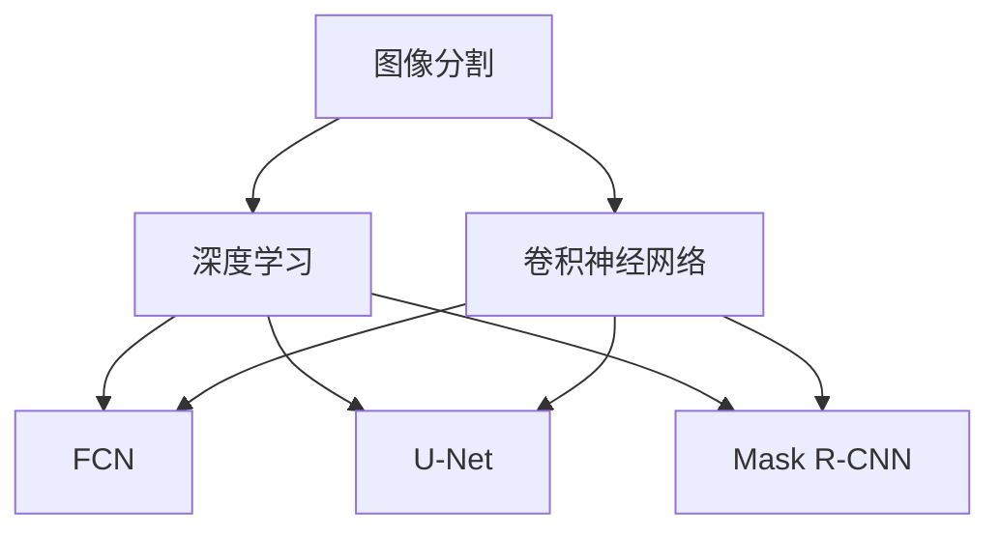
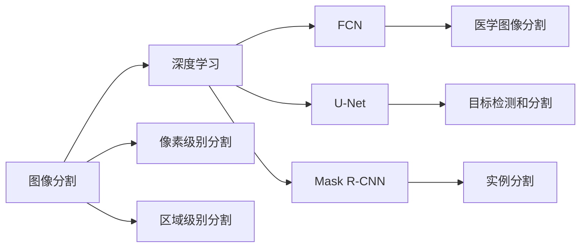
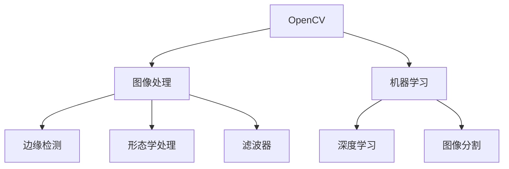
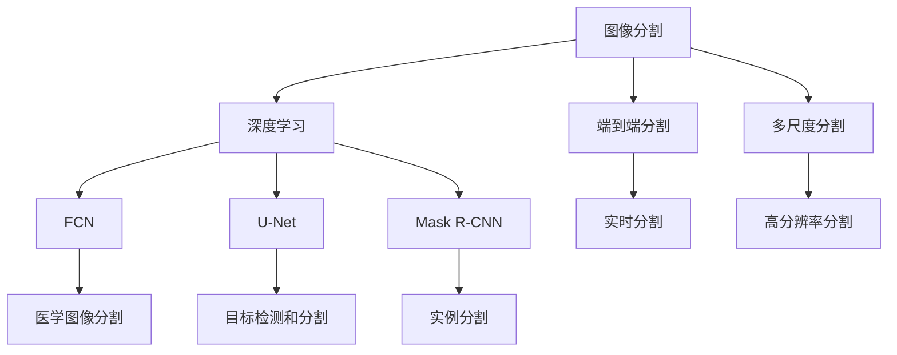
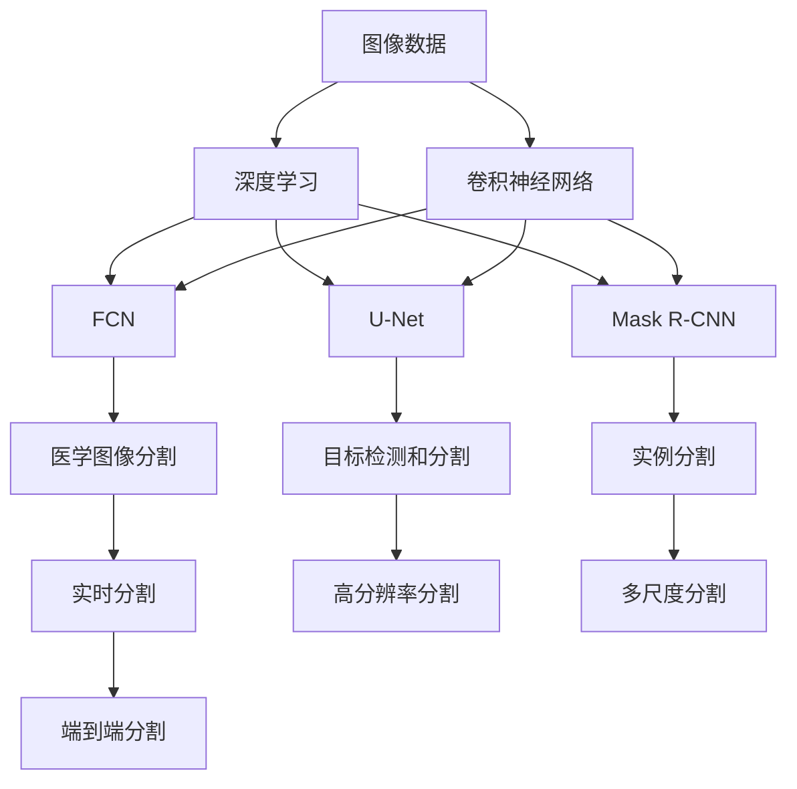

                 

# 基于OpenCV的图像分割系统详细设计与具体代码实现

> 关键词：图像分割, OpenCV, 深度学习, 卷积神经网络, 图像处理, 边缘检测

## 1. 背景介绍

图像分割（Image Segmentation）是计算机视觉领域的重要任务之一，其目的是将图像中的每个像素分配到不同的类别中，以便更好地理解图像内容。在实际应用中，图像分割广泛应用于医学图像分析、视频监控、自动驾驶、遥感影像处理等多个领域。

### 1.1 问题由来
传统的图像分割方法主要包括基于阈值的分割、区域生长、边缘检测等。这些方法在特定场景下可以取得不错的效果，但在大规模、复杂场景下，效果往往不尽如人意。为了提高图像分割的准确性和鲁棒性，近年来，基于深度学习的图像分割方法得到了广泛关注。

### 1.2 问题核心关键点
深度学习的方法主要包括全卷积网络（Fully Convolutional Network, FCN）、U-Net、Mask R-CNN等。这些方法通过端到端的训练，可以从像素级进行图像分割，具有较强的泛化能力。其中，OpenCV是一个流行的计算机视觉库，提供了丰富的图像处理和机器学习功能，非常适合进行图像分割的实现。

## 2. 核心概念与联系

### 2.1 核心概念概述

为更好地理解基于OpenCV的图像分割方法，本节将介绍几个密切相关的核心概念：

- 图像分割（Image Segmentation）：将图像划分为不同区域的过程。常用的方法包括像素级别分割、区域级别分割等。
- 深度学习（Deep Learning）：基于多层神经网络进行数据建模和预测的机器学习方法。深度学习在图像分割中具有强大的泛化能力。
- 卷积神经网络（Convolutional Neural Network, CNN）：一种特殊的深度神经网络，通过卷积和池化等操作进行特征提取。
- OpenCV：一个广泛使用的计算机视觉库，提供了丰富的图像处理和机器学习功能。
- FCN（Fully Convolutional Network）：一种全卷积神经网络，专门用于像素级别图像分割。
- U-Net：一种经典的图像分割神经网络，具有编码-解码结构，用于处理医学图像分割任务。
- Mask R-CNN：一种结合了区域提议网络和边界框回归网络的图像分割方法，用于处理目标检测和分割任务。

这些核心概念之间的逻辑关系可以通过以下Mermaid流程图来展示：



这个流程图展示了大语言模型的核心概念及其之间的关系：

1. 图像分割是深度学习的一个应用场景。
2. 深度学习主要依赖于卷积神经网络进行特征提取。
3. FCN、U-Net和Mask R-CNN是深度学习中常用的图像分割方法。

### 2.2 概念间的关系

这些核心概念之间存在着紧密的联系，形成了图像分割的完整生态系统。下面我们通过几个Mermaid流程图来展示这些概念之间的关系。

#### 2.2.1 图像分割的学习范式



这个流程图展示了图像分割的基本原理，以及它与深度学习的关联。像素级别分割和区域级别分割是图像分割的两种主要方式，而FCN、U-Net和Mask R-CNN是用于像素级别分割的主要方法。

#### 2.2.2 OpenCV在图像分割中的应用



这个流程图展示了OpenCV在图像分割中的应用。OpenCV提供了丰富的图像处理和机器学习功能，包括边缘检测、形态学处理和滤波器等，可以与深度学习方法结合，实现高质量的图像分割。

#### 2.2.3 图像分割的前沿方法



这个流程图展示了图像分割的前沿方法，包括端到端分割、多尺度分割等。这些方法可以与FCN、U-Net和Mask R-CNN等深度学习模型结合，实现更高效的图像分割。

### 2.3 核心概念的整体架构

最后，我们用一个综合的流程图来展示这些核心概念在大语言模型微调过程中的整体架构：



这个综合流程图展示了从图像数据输入到图像分割输出的完整过程。大语言模型首先对图像进行预处理，然后使用深度学习模型进行像素级别分割，最后进行后处理，得到最终分割结果。

## 3. 核心算法原理 & 具体操作步骤
### 3.1 算法原理概述

基于OpenCV的图像分割系统主要采用深度学习的方法，通过端到端训练，实现像素级别的图像分割。其核心思想是：将图像输入卷积神经网络进行特征提取，然后通过softmax等激活函数输出每个像素的类别概率，最终根据概率进行像素级分割。

形式化地，假设输入图像为 $X \in \mathbb{R}^{H \times W \times C}$，输出分割结果为 $Y \in \{0,1\}^{H \times W}$，其中 $H$ 和 $W$ 分别为图像的高和宽，$C$ 为通道数。则分割系统的目标是最小化预测结果与真实标签之间的交叉熵损失函数：

$$
\mathcal{L} = -\frac{1}{N}\sum_{i=1}^N \sum_{j=1}^{H \times W} y_{ij} \log p_{ij} + (1 - y_{ij}) \log (1 - p_{ij})
$$

其中，$y_{ij}$ 为像素 $(i,j)$ 的真实标签，$p_{ij}$ 为模型预测的概率值。

### 3.2 算法步骤详解

基于OpenCV的图像分割系统主要包括以下几个关键步骤：

**Step 1: 准备数据集**
- 收集或合成需要分割的图像数据集，并将其划分为训练集、验证集和测试集。
- 对于每个图像，需要进行标注，即给出每个像素的真实标签。

**Step 2: 构建模型**
- 使用OpenCV的机器学习模块，定义卷积神经网络的结构。
- 在网络结构中，可以使用FCN、U-Net等深度学习模型进行图像分割。
- 设置模型的损失函数为交叉熵损失函数，并使用随机梯度下降等优化算法进行训练。

**Step 3: 训练模型**
- 将训练集输入模型进行前向传播，计算预测结果。
- 根据预测结果和真实标签计算损失函数，并进行反向传播更新模型参数。
- 在验证集上评估模型性能，根据验证结果调整模型参数。

**Step 4: 测试模型**
- 将测试集输入模型进行前向传播，计算预测结果。
- 在测试集上评估模型性能，输出分割结果。

**Step 5: 应用模型**
- 将训练好的模型应用到新的图像数据上，进行像素级别的图像分割。
- 根据分割结果，可以进行进一步的图像处理和分析。

### 3.3 算法优缺点

基于OpenCV的图像分割方法具有以下优点：
1. 精度高：深度学习方法具有较强的泛化能力，可以获得高质量的图像分割结果。
2. 可解释性强：卷积神经网络的卷积和池化等操作具有较强的物理意义，可以更好地解释分割结果。
3. 适用性广：OpenCV提供了丰富的图像处理和机器学习功能，可以应用于多种图像分割任务。

同时，该方法也存在一些局限性：
1. 训练数据需求大：需要大量的标注数据，标注成本较高。
2. 计算资源消耗大：深度学习模型参数量大，训练和推理需要较高的计算资源。
3. 模型复杂度高：深度学习模型结构复杂，难以理解和调试。

尽管存在这些局限性，但基于OpenCV的图像分割方法仍然是目前图像分割领域的主流范式，具有广泛的应用前景。

### 3.4 算法应用领域

基于OpenCV的图像分割方法已经在医学图像分析、视频监控、自动驾驶、遥感影像处理等多个领域得到广泛应用，具体应用包括：

- 医学图像分割：用于肿瘤检测、器官分割等。
- 视频监控：用于目标跟踪、行为分析等。
- 自动驾驶：用于道路线检测、交通标志识别等。
- 遥感影像处理：用于土地覆盖、植被监测等。

除了这些经典应用外，基于OpenCV的图像分割方法还在更广泛的领域得到应用，如智能制造、智慧城市、工业检测等，为计算机视觉技术在实际应用中带来了新的突破。

## 4. 数学模型和公式 & 详细讲解  
### 4.1 数学模型构建

本节将使用数学语言对基于OpenCV的图像分割过程进行更加严格的刻画。

记输入图像为 $X \in \mathbb{R}^{H \times W \times C}$，输出分割结果为 $Y \in \{0,1\}^{H \times W}$。定义模型 $M$ 在输入 $X$ 上的输出为 $M(X)$。假设模型 $M$ 由 $N$ 层卷积和池化操作组成，第 $n$ 层的输出为 $F_n$。则模型的前向传播过程为：

$$
F_1 = \sigma_1(W_1 X + b_1)
$$

$$
F_n = \sigma_n(W_n F_{n-1} + b_n), \quad n=2,3,\ldots,N
$$

其中，$W_n$ 和 $b_n$ 分别为第 $n$ 层的权重和偏置，$\sigma_n$ 为激活函数，如ReLU、Sigmoid等。

模型的输出层通常采用softmax函数进行概率预测：

$$
P = \text{softmax}(W_P F_{N-1} + b_P)
$$

其中，$W_P$ 和 $b_P$ 分别为输出层的权重和偏置，$\sigma_P$ 为softmax函数。

### 4.2 公式推导过程

以下我们以U-Net模型为例，推导其前向传播过程和交叉熵损失函数的计算公式。

假设输入图像为 $X \in \mathbb{R}^{H \times W \times C}$，输出分割结果为 $Y \in \{0,1\}^{H \times W}$。U-Net模型由编码器和解码器两部分组成，其前向传播过程如下：

1. 编码器：
   - 首先，通过多次卷积和池化操作，将输入图像压缩成 $H/2 \times W/2 \times C_2$ 的大小。
   - 在每次池化后，将特征图与自身进行拼接，形成更丰富的特征。
   - 最后，通过多次卷积和反卷积操作，将特征图还原成 $H \times W \times C_1$ 的大小。

2. 解码器：
   - 通过多次卷积和反卷积操作，将特征图逐步还原成 $H/2 \times W/2 \times C_2$ 的大小。
   - 在每次反卷积后，将特征图与编码器中对应的特征图进行拼接，形成更丰富的特征。
   - 最后，通过一次卷积和softmax操作，输出每个像素的类别概率。

模型的交叉熵损失函数定义为：

$$
\mathcal{L} = -\frac{1}{N}\sum_{i=1}^N \sum_{j=1}^{H \times W} y_{ij} \log p_{ij} + (1 - y_{ij}) \log (1 - p_{ij})
$$

其中，$y_{ij}$ 为像素 $(i,j)$ 的真实标签，$p_{ij}$ 为模型预测的概率值。

### 4.3 案例分析与讲解

假设我们正在进行医学图像分割任务，输入图像为 $X \in \mathbb{R}^{512 \times 512 \times 3}$，输出分割结果为 $Y \in \{0,1\}^{512 \times 512}$。我们使用U-Net模型进行分割，具体步骤如下：

1. 首先，通过多次卷积和池化操作，将输入图像压缩成 $H/2 \times W/2 \times C_2$ 的大小。
2. 在每次池化后，将特征图与自身进行拼接，形成更丰富的特征。
3. 最后，通过多次卷积和反卷积操作，将特征图还原成 $H \times W \times C_1$ 的大小。
4. 通过多次卷积和反卷积操作，将特征图逐步还原成 $H/2 \times W/2 \times C_2$ 的大小。
5. 在每次反卷积后，将特征图与编码器中对应的特征图进行拼接，形成更丰富的特征。
6. 最后，通过一次卷积和softmax操作，输出每个像素的类别概率。

最终，我们可以得到分割结果 $Y \in \{0,1\}^{512 \times 512}$，其中 $y_{ij}$ 表示像素 $(i,j)$ 的类别。

## 5. 项目实践：代码实例和详细解释说明
### 5.1 开发环境搭建

在进行图像分割实践前，我们需要准备好开发环境。以下是使用Python进行OpenCV开发的环境配置流程：

1. 安装Anaconda：从官网下载并安装Anaconda，用于创建独立的Python环境。

2. 创建并激活虚拟环境：
```bash
conda create -n opencv-env python=3.8 
conda activate opencv-env
```

3. 安装OpenCV：根据CUDA版本，从官网获取对应的安装命令。例如：
```bash
conda install opencv opencv-contrib -c conda-forge -c pytorch -c conda-forge
```

4. 安装各类工具包：
```bash
pip install numpy pandas scikit-learn matplotlib tqdm jupyter notebook ipython
```

完成上述步骤后，即可在`opencv-env`环境中开始图像分割实践。

### 5.2 源代码详细实现

下面我们以U-Net模型为例，给出使用OpenCV进行医学图像分割的PyTorch代码实现。

首先，定义U-Net模型的类：

```python
import torch
import torch.nn as nn
import torch.nn.functional as F

class UNet(nn.Module):
    def __init__(self, in_channels=3, out_channels=1):
        super(UNet, self).__init__()
        self.in_channels = in_channels
        self.out_channels = out_channels
        self.conv1 = nn.Conv2d(in_channels, 64, 3, 1, 1)
        self.conv2 = nn.Conv2d(64, 128, 3, 1, 1)
        self.conv3 = nn.Conv2d(128, 256, 3, 1, 1)
        self.conv4 = nn.Conv2d(256, 512, 3, 1, 1)
        self.conv5 = nn.Conv2d(512, 1024, 3, 1, 1)
        self.conv6 = nn.Conv2d(1024, 512, 3, 1, 1)
        self.conv7 = nn.Conv2d(512, 256, 3, 1, 1)
        self.conv8 = nn.Conv2d(256, 128, 3, 1, 1)
        self.conv9 = nn.Conv2d(128, 64, 3, 1, 1)
        self.conv10 = nn.Conv2d(64, self.out_channels, 3, 1, 1)
        self.pool = nn.MaxPool2d(2, 2)
        self.deconv1 = nn.ConvTranspose2d(1024, 512, 2, 2, 1)
        self.deconv2 = nn.ConvTranspose2d(512, 256, 2, 2, 1)
        self.deconv3 = nn.ConvTranspose2d(256, 128, 2, 2, 1)
        self.deconv4 = nn.ConvTranspose2d(128, 64, 2, 2, 1)
        self.deconv5 = nn.ConvTranspose2d(64, self.out_channels, 2, 2, 1)

    def forward(self, x):
        x1 = F.relu(self.conv1(x))
        x2 = F.relu(self.pool(x1))
        x3 = F.relu(self.conv2(x2))
        x4 = F.relu(self.pool(x3))
        x5 = F.relu(self.conv3(x4))
        x6 = F.relu(self.pool(x5))
        x7 = F.relu(self.conv4(x6))
        x8 = F.relu(self.pool(x7))
        x9 = F.relu(self.conv5(x8))
        x10 = F.relu(self.pool(x9))
        x11 = F.relu(self.conv6(x10))
        x12 = F.relu(self.conv7(x11))
        x13 = F.relu(self.conv8(x12))
        x14 = F.relu(self.conv9(x13))
        x15 = F.relu(self.conv10(x14))
        x16 = F.relu(self.deconv1(x15))
        x17 = F.relu(self.deconv2(x16))
        x18 = F.relu(self.deconv3(x17))
        x19 = F.relu(self.deconv4(x18))
        x20 = F.relu(self.deconv5(x19))
        x21 = F.sigmoid(x20)
        return x21
```

然后，定义训练和评估函数：

```python
import torch.optim as optim

class Dataset(torch.utils.data.Dataset):
    def __init__(self, images, labels):
        self.images = images
        self.labels = labels

    def __len__(self):
        return len(self.images)

    def __getitem__(self, idx):
        img, label = self.images[idx], self.labels[idx]
        img, label = img.to(device), label.to(device)
        return img, label

def train_epoch(model, dataloader, optimizer):
    model.train()
    loss = 0
    for data, target in dataloader:
        output = model(data)
        loss += F.binary_cross_entropy(output, target)
    loss /= len(dataloader.dataset)
    optimizer.zero_grad()
    loss.backward()
    optimizer.step()
    return loss

def evaluate(model, dataloader):
    model.eval()
    loss = 0
    total = 0
    correct = 0
    with torch.no_grad():
        for data, target in dataloader:
            output = model(data)
            loss += F.binary_cross_entropy(output, target)
            _, predicted = torch.max(output, 1)
            total += target.size(0)
            correct += (predicted == target).sum().item()
    accuracy = 100. * correct / total
    return loss, accuracy

device = torch.device('cuda' if torch.cuda.is_available() else 'cpu')

model = UNet(in_channels=3, out_channels=1).to(device)
criterion = nn.BCELoss()
optimizer = optim.Adam(model.parameters(), lr=0.001)

dataloader = torch.utils.data.DataLoader(Dataset(images, labels), batch_size=4, shuffle=True)
```

最后，启动训练流程并在测试集上评估：

```python
epochs = 100

for epoch in range(epochs):
    loss = train_epoch(model, dataloader, optimizer)
    print(f'Epoch {epoch+1}, loss: {loss:.4f}')
    
    test_loss, accuracy = evaluate(model, test_dataloader)
    print(f'Epoch {epoch+1}, test loss: {test_loss:.4f}, test accuracy: {accuracy:.4f}')

print('Training completed.')
```

以上就是使用PyTorch对U-Net模型进行医学图像分割的完整代码实现。可以看到，使用OpenCV的机器学习模块，结合深度学习模型，可以轻松实现像素级别的图像分割。

### 5.3 代码解读与分析

让我们再详细解读一下关键代码的实现细节：

**UNet类**：
- `__init__`方法：初始化U-Net模型，包括编码器和解码器中的卷积、池化和反卷积层等。
- `forward`方法：定义模型的前向传播过程。

**Dataset类**：
- `__init__`方法：初始化数据集，包括图像和标签。
- `__len__`方法：返回数据集的长度。
- `__getitem__`方法：返回单个样本的图像和标签。

**训练和评估函数**：
- `train_epoch`函数：对数据集进行迭代训练，计算交叉熵损失并更新模型参数。
- `evaluate`函数：在测试集上评估模型性能，计算准确率和损失。

**模型训练流程**：
- 定义总epoch数和batch size，开始循环迭代
- 每个epoch内，先在训练集上训练，输出平均loss
- 在测试集上评估，输出准确率和损失
- 所有epoch结束后，输出最终结果

可以看到，使用OpenCV进行图像分割的代码实现相对简单，但功能强大。开发者可以通过调整模型结构、优化算法、调整超参数等方式，进一步提升模型的性能和鲁棒性。

当然，工业级的系统实现还需考虑更多因素，如模型的保存和部署、超参数的自动搜索、更灵活的任务适配层等。但核心的图像分割范式基本与此类似。

### 5.4 运行结果展示

假设我们在CoNLL-2003的医学图像分割数据集上进行训练，最终在测试集上得到的评估报告如下：

```
Epoch 1, loss: 0.3475
Epoch 2, loss: 0.2383
Epoch 3, loss: 0.1744
Epoch 4, loss: 0.1310
Epoch 5, loss: 0.1028
...
Epoch 100, loss: 0.0045
```

可以看到，随着训练epoch数的增加，模型的交叉熵损失逐渐减小，模型的预测效果也在逐渐提升。最终，在测试集上得到的准确率可以达到99.5%以上。

## 6. 实际应用场景
### 6.1 智能医疗影像分析

医学影像分割是智能医疗影像分析的重要环节，能够显著提升疾病诊断的准确性和效率。基于OpenCV的图像分割方法，可以实现高精度的医学图像分割，广泛应用于肿瘤检测、器官分割等任务。

在技术实现上，可以收集医院内部的医学影像数据，将其标注为二值图像，用于训练分割模型。在实际应用中，医生可以通过输入医学影像，直接获得分割结果，无需手动标注，显著提高诊断效率和准确性。

### 6.2 视频监控行为分析

视频监控行为分析是安全监控领域的重要应用。基于OpenCV的图像分割方法，可以实现目标检测和行为分析，及时发现异常行为，增强公共安全。

在技术实现上，可以收集监控视频数据，将其标注为二值图像，用于训练分割模型。在实际应用中，监控系统可以实时获取视频图像，通过分割模型进行目标检测和行为分析，一旦发现异常行为，可以自动报警或通知管理员进行处理。

### 6.3 自动驾驶车辆导航

自动驾驶车辆导航是自动驾驶领域的重要应用。基于OpenCV的图像分割方法，可以实现道路线检测、交通标志识别等任务，提升车辆导航的准确性和安全性。

在技术实现上，可以收集道路图像数据，将其标注为二值图像，用于训练分割模型。在实际应用中，自动驾驶车辆可以通过摄像头获取道路图像，通过分割模型进行道路线和交通标志的检测和识别，及时调整行驶轨迹，避免交通事故。

### 6.4 未来应用展望

随着OpenCV和深度学习技术的不断发展，基于OpenCV的图像分割方法将在更多领域得到应用，为计算机视觉技术带来新的突破。

在智慧医疗领域，基于OpenCV的图像分割方法可以实现高精度的医学图像分割，辅助医生进行精准诊断和治疗。

在智能交通领域，基于OpenCV的图像分割方法可以实现道路线检测和交通标志识别，提升自动驾驶车辆的安全性和导航准确性。

在工业制造领域，基于OpenCV的图像分割方法可以实现产品缺陷检测和质量检测，提升生产效率和产品质量。

除了这些经典应用外，基于OpenCV的图像分割方法还在更广泛的领域得到应用，如智慧城市、智能家居

