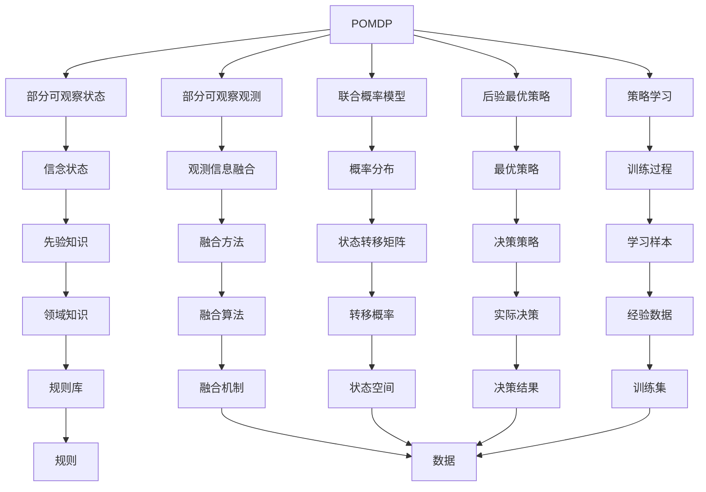

                 

## 1. 背景介绍

### 1.1 问题由来
在现代战争和对抗性竞技中，决策的自主性和智能性成为决定胜负的关键因素。近年来，随着人工智能技术的飞速发展，战术自主决策（Autonomous Tactical Decision-Making）逐渐成为研究热点。特别在无人驾驶、机器人竞赛、竞技游戏等场景中，智能决策算法的研究需求日益迫切。
传统基于规则的决策方法，如博弈论、逻辑推理等，在复杂多变的对抗环境中难以胜任。而基于统计学习的方法，如监督学习、强化学习等，缺乏对任务本质的深入理解和强执行力，难以应对战术情境下的不确定性和动态变化。

为了解决这些问题，本研究引入部分可观察马尔可夫决策过程（Partially Observable Markov Decision Process, POMDP）的理论框架，结合机器学习的方法，探索了一种更为灵活和适应性的战术自主决策算法。

### 1.2 问题核心关键点
POMDP是一种多智能体系统决策理论，广泛应用于游戏、导航、机器人等领域。它的核心在于：
1. 部分可观察性：系统环境部分信息不可见，需要结合先验知识进行推理。
2. 联合概率模型：决策过程中需考虑系统状态和行为的概率分布。
3. 后验最优策略：决策策略基于观测和先验知识的联合分布，采用信念状态-行动策略的优化方法。

本研究将POMDP理论引入战术决策算法，旨在实现以下目标：
1. 提高决策的灵活性和适应性，适应复杂的战术环境和对抗局面。
2. 结合先验知识和统计学习，提升决策的稳定性和鲁棒性。
3. 设计直观易用的接口，方便实时决策部署。

## 2. 核心概念与联系

### 2.1 核心概念概述
- 部分可观察马尔可夫决策过程（POMDP）：包含部分可观察状态（Observed State）和部分可观察观测（Observed Observation）的马尔可夫决策过程，具有概率决策和信息融合的特点。
- 博弈树搜索（Game Tree Search）：构建决策树模型，通过搜索博弈树寻找最优决策策略。
- 强化学习（Reinforcement Learning, RL）：通过环境反馈信号（奖励），逐步优化决策策略。
- 信念状态（Belief State）：根据先验知识对系统状态进行概率估计。
- 后验最优策略（Posterior Optimal Policy）：基于信念状态-行动策略的优化方法，考虑观测信息的融合。
- 策略学习（Policy Learning）：通过已知样本数据，训练最优策略。
- 知识图谱（Knowledge Graph）：结合先验知识和统计学习，构建复杂系统的认知图谱。

### 2.2 概念间的关系
以下是基于POMDP的战术自主决策算法的核心概念间的关系示意图：



这个Mermaid图展示了各个概念之间的关系：
1. 部分可观察状态和部分可观察观测通过联合概率模型，与后验最优策略相互关联。
2. 策略学习依赖于先验知识和学习样本，形成最优策略。
3. 信念状态通过观测信息的融合，与决策策略密切相关。
4. 知识图谱与规则库结合，为先验知识提供支持。
5. 概率分布和转移概率构成系统的动态模型。
6. 训练过程通过学习样本，优化决策策略。
7. 实际决策考虑先验知识、融合方法、领域知识等因素。

这些概念共同构成了POMDP在战术决策中的应用框架，旨在通过灵活融合先验知识和统计学习，提升决策策略的稳定性和适应性。

## 3. 核心算法原理 & 具体操作步骤

### 3.1 算法原理概述
基于POMDP的战术自主决策算法，核心在于构建部分可观察马尔可夫决策过程的信念状态，结合先验知识和统计学习，进行最优策略的求解。算法流程如下：

1. **模型构建**：构建POMDP模型，定义状态空间、行动空间、观测空间、转移概率、奖赏函数等。
2. **先验知识融合**：利用先验知识构建信念状态，结合观测信息进行融合，形成实时状态估计。
3. **策略学习**：通过博弈树搜索、强化学习等方法，训练最优策略，进行实时决策。
4. **后验最优策略优化**：基于信念状态-行动策略，优化决策策略，提升决策效果。

### 3.2 算法步骤详解
#### 3.2.1 模型构建
**输入**：
- 状态空间 $S$，表示系统可能的状态集合。
- 行动空间 $A$，表示系统可以采取的行动集合。
- 观测空间 $O$，表示系统可观察到的信息集合。
- 转移概率 $P(s_{t+1}|s_t,a_t)$，表示从状态 $s_t$ 到状态 $s_{t+1}$ 的转移概率。
- 奖赏函数 $R(s_t,a_t)$，表示在状态 $s_t$ 采取行动 $a_t$ 的即时奖赏。

**输出**：
- POMDP模型，包含状态空间 $S$、行动空间 $A$、观测空间 $O$、转移概率 $P$ 和奖赏函数 $R$。

#### 3.2.2 先验知识融合
**输入**：
- 先验信念状态 $B(s)$，表示对状态 $s$ 的先验概率估计。
- 当前观测 $o_t$。

**输出**：
- 后验信念状态 $B(s|o_t)$，表示在观测 $o_t$ 后对状态 $s$ 的后验概率估计。

后验信念状态可以通过贝叶斯定理进行更新：

$$
B(s|o_t) = \frac{P(o_t|s)B(s)}{\sum_{s'} P(o_t|s')B(s')}
$$

其中 $P(o_t|s)$ 为观测 $o_t$ 在状态 $s$ 下的概率分布。

#### 3.2.3 策略学习
**输入**：
- 后验信念状态 $B(s|o_t)$。

**输出**：
- 最优策略 $\pi(a|s)$，表示在状态 $s$ 下选择行动 $a$ 的概率。

最优策略可以通过策略迭代方法求解，如蒙特卡罗树搜索（Monte Carlo Tree Search, MCTS）和Q-learning等方法。

#### 3.2.4 后验最优策略优化
**输入**：
- 后验信念状态 $B(s|o_t)$。

**输出**：
- 后验最优策略 $\pi^*(a|s)$，表示在状态 $s$ 下选择最优行动 $a$ 的概率。

后验最优策略可以通过信念状态-行动策略的优化方法求解，如POMDP的信念-行动策略算法（Belief-MDP Algorithm）。

### 3.3 算法优缺点
#### 3.3.1 优点
1. 适应性强：结合先验知识和统计学习，可以适应复杂的战术环境和对抗局面。
2. 鲁棒性好：考虑不确定性和动态变化，具有较强的鲁棒性。
3. 决策灵活：通过最优策略的求解，可以动态调整决策方案。

#### 3.3.2 缺点
1. 计算复杂：部分可观察马尔可夫决策过程的计算复杂度较高，求解最优策略可能需要较长时间。
2. 数据需求高：算法需要大量的标注数据进行训练和验证。
3. 先验知识获取难：先验知识的构建和融合过程较为复杂，需要专业知识的支持。

### 3.4 算法应用领域
基于POMDP的战术自主决策算法适用于以下领域：

1. 军事对抗：用于军事决策支持，提升决策的自主性和智能性。
2. 无人驾驶：用于无人车辆的控制和路径规划，提升行驶安全和效率。
3. 竞技游戏：用于游戏AI的决策过程，提升游戏智能和竞争力。
4. 机器人导航：用于机器人导航和避障，提升导航精度和实时性。

## 4. 数学模型和公式 & 详细讲解 & 举例说明

### 4.1 数学模型构建

本节将使用数学语言对POMDP模型的构建进行更加严格的刻画。

设系统初始状态为 $s_0$，行动序列为 $a_1, a_2, ..., a_t, ..., a_T$，观测序列为 $o_1, o_2, ..., o_t, ..., o_T$。假设系统的转移概率为 $P(s_{t+1}|s_t,a_t)$，奖赏函数为 $R(s_t,a_t)$，观测模型为 $P(o_t|s_t)$。

定义状态空间 $S = \{s_0, s_1, ..., s_T\}$，行动空间 $A = \{a_1, a_2, ..., a_T\}$，观测空间 $O = \{o_1, o_2, ..., o_T\}$。

系统的状态转移概率和奖赏函数如下：

$$
P(s_{t+1}|s_t,a_t) = \sum_{s_{t+1} \in S} P(s_{t+1},o_t|s_t,a_t) \delta_{s_{t+1},o_t}
$$

$$
R(s_t,a_t) = \sum_{o_t \in O} R(s_t,a_t,o_t) \delta_{o_t}
$$

其中，$\delta_{s_{t+1},o_t}$ 为Kronecker delta函数，表示在状态 $s_t$ 采取行动 $a_t$ 后，观测到 $o_t$ 的概率分布。

定义先验信念状态 $B(s_0)$，表示对系统初始状态的先验概率估计。假设系统在每个时刻观测到 $o_t$，根据贝叶斯定理，对状态 $s_t$ 的后验信念状态为：

$$
B(s_t|o_t) = \frac{P(o_t|s_t)B(s_t)}{\sum_{s' \in S} P(o_t|s')B(s')}
$$

其中，$B(s_t)$ 为对状态 $s_t$ 的先验概率估计。

### 4.2 公式推导过程

#### 4.2.1 信念状态更新

根据贝叶斯定理，先验信念状态 $B(s_t)$ 在观测 $o_t$ 后更新为后验信念状态 $B(s_t|o_t)$。

设 $P(o_t|s_t)$ 为观测 $o_t$ 在状态 $s_t$ 下的概率分布，先验信念状态 $B(s_t)$ 表示对状态 $s_t$ 的先验概率估计。则后验信念状态 $B(s_t|o_t)$ 通过以下公式计算：

$$
B(s_t|o_t) = \frac{P(o_t|s_t)B(s_t)}{\sum_{s' \in S} P(o_t|s')B(s')}
$$

其中，$P(o_t|s_t)$ 为观测 $o_t$ 在状态 $s_t$ 下的概率分布，$B(s_t)$ 为对状态 $s_t$ 的先验概率估计。

#### 4.2.2 最优策略求解

假设系统在每个时刻 $t$，观测到 $o_t$ 后，根据后验信念状态 $B(s_t|o_t)$ 选择行动 $a_t$，获得即时奖赏 $R(s_t,a_t)$。定义最优策略 $\pi^*(a|s)$，表示在状态 $s$ 下选择最优行动 $a$ 的概率。

最优策略 $\pi^*(a|s)$ 可以通过POMDP的信念-行动策略算法求解。假设系统在状态 $s_t$ 采取行动 $a_t$，获得即时奖赏 $R(s_t,a_t)$，并在观测 $o_{t+1}$ 后，进入下一个状态 $s_{t+1}$。则最优策略 $\pi^*(a|s)$ 满足：

$$
\pi^*(a|s) = \max_{a'} \left[ \sum_{s' \in S} \pi^*(a'|s') \sum_{o' \in O} R(s',a',o') P(o'|s',a') \right]
$$

其中，$\pi^*(a'|s')$ 表示在状态 $s'$ 下选择行动 $a'$ 的概率，$R(s',a',o')$ 表示在状态 $s'$ 采取行动 $a'$ 在观测 $o'$ 下的即时奖赏。

### 4.3 案例分析与讲解

假设我们有一个无人驾驶车辆，需要规划行驶路径。系统状态包括车辆的位置、速度和方向，行动包括加速、减速、转向等，观测包括车辆的位置、方向和环境条件。我们利用先验知识构建系统模型，并根据实时观测数据更新模型，进行路径规划。

#### 4.3.1 模型构建

- 状态空间 $S = \{(x,y,z),(v_x,v_y,v_z),(d_x,d_y,d_z)\}$，表示车辆的位置、速度和方向。
- 行动空间 $A = \{(a_x,a_y,a_z),(v_x,v_y,v_z),(d_x,d_y,d_z)\}$，表示加速、减速、转向等行动。
- 观测空间 $O = \{(x,y,z),(d_x,d_y,d_z),(e_x,e_y,e_z)\}$，表示车辆的位置、方向和环境条件。

- 转移概率 $P(s_{t+1}|s_t,a_t)$ 表示从状态 $s_t$ 采取行动 $a_t$ 后，车辆进入状态 $s_{t+1}$ 的概率。

- 奖赏函数 $R(s_t,a_t)$ 表示在状态 $s_t$ 采取行动 $a_t$ 的即时奖赏。

#### 4.3.2 先验知识融合

假设我们对无人驾驶车辆的位置、速度和方向进行先验估计，利用贝叶斯定理进行融合，得到后验信念状态 $B(s_t|o_t)$。

设先验信念状态 $B(s_0)$，表示对车辆初始状态的先验概率估计。假设车辆在每个时刻观测到 $o_t$，根据贝叶斯定理，对状态 $s_t$ 的后验信念状态为：

$$
B(s_t|o_t) = \frac{P(o_t|s_t)B(s_t)}{\sum_{s' \in S} P(o_t|s')B(s')}
$$

其中，$P(o_t|s_t)$ 为观测 $o_t$ 在状态 $s_t$ 下的概率分布，$B(s_t)$ 为对状态 $s_t$ 的先验概率估计。

#### 4.3.3 策略学习

利用最优策略 $\pi^*(a|s)$，在每个时刻 $t$ 根据后验信念状态 $B(s_t|o_t)$ 选择最优行动 $a_t$，获得即时奖赏 $R(s_t,a_t)$，并进行路径规划。

最优策略 $\pi^*(a|s)$ 可以通过POMDP的信念-行动策略算法求解。假设车辆在状态 $s_t$ 采取行动 $a_t$，获得即时奖赏 $R(s_t,a_t)$，并在观测 $o_{t+1}$ 后，进入下一个状态 $s_{t+1}$。则最优策略 $\pi^*(a|s)$ 满足：

$$
\pi^*(a|s) = \max_{a'} \left[ \sum_{s' \in S} \pi^*(a'|s') \sum_{o' \in O} R(s',a',o') P(o'|s',a') \right]
$$

其中，$\pi^*(a'|s')$ 表示在状态 $s'$ 下选择行动 $a'$ 的概率，$R(s',a',o')$ 表示在状态 $s'$ 采取行动 $a'$ 在观测 $o'$ 下的即时奖赏。

## 5. 项目实践：代码实例和详细解释说明

### 5.1 开发环境搭建

在进行项目实践前，我们需要准备好开发环境。以下是使用Python进行PyTorch开发的环境配置流程：

1. 安装Anaconda：从官网下载并安装Anaconda，用于创建独立的Python环境。

2. 创建并激活虚拟环境：
```bash
conda create -n pytorch-env python=3.8 
conda activate pytorch-env
```

3. 安装PyTorch：根据CUDA版本，从官网获取对应的安装命令。例如：
```bash
conda install pytorch torchvision torchaudio cudatoolkit=11.1 -c pytorch -c conda-forge
```

4. 安装TensorFlow：
```bash
pip install tensorflow
```

5. 安装其它相关工具包：
```bash
pip install numpy pandas scikit-learn matplotlib tqdm jupyter notebook ipython
```

完成上述步骤后，即可在`pytorch-env`环境中开始项目实践。

### 5.2 源代码详细实现

这里我们以无人驾驶车辆路径规划为例，给出使用PyTorch和TensorFlow对基于POMDP的战术自主决策算法进行实现。

#### 5.2.1 数据集准备

定义车辆状态和观测空间：

```python
import numpy as np

class Vehicle:
    def __init__(self, x, y, z, v_x, v_y, v_z, d_x, d_y, d_z):
        self.x = x
        self.y = y
        self.z = z
        self.v_x = v_x
        self.v_y = v_y
        self.v_z = v_z
        self.d_x = d_x
        self.d_y = d_y
        self.d_z = d_z

class State:
    def __init__(self, x, y, z, v_x, v_y, v_z, d_x, d_y, d_z):
        self.x = x
        self.y = y
        self.z = z
        self.v_x = v_x
        self.v_y = v_y
        self.v_z = v_z
        self.d_x = d_x
        self.d_y = d_y
        self.d_z = d_z

class Observation:
    def __init__(self, x, y, z, d_x, d_y, d_z):
        self.x = x
        self.y = y
        self.z = z
        self.d_x = d_x
        self.d_y = d_y
        self.d_z = d_z
```

定义行动空间：

```python
class Action:
    def __init__(self, a_x, a_y, a_z, v_x, v_y, v_z, d_x, d_y, d_z):
        self.a_x = a_x
        self.a_y = a_y
        self.a_z = a_z
        self.v_x = v_x
        self.v_y = v_y
        self.v_z = v_z
        self.d_x = d_x
        self.d_y = d_y
        self.d_z = d_z
```

#### 5.2.2 模型构建

定义部分可观察马尔可夫决策过程（POMDP）：

```python
class POMDP:
    def __init__(self, states, actions, observations):
        self.states = states
        self.actions = actions
        self.observations = observations

    def transition_prob(self, state, action):
        # 定义转移概率计算公式
        # 假设车辆状态空间为 [0, 5]，速度空间为 [-1, 1]，方向空间为 [-1, 1]
        # 假设车辆在每个时刻可以向左、向右、加速、减速，观测为车辆的位置、方向和环境条件
        transition_prob = []
        for i in range(len(self.states)):
            prob = []
            for j in range(len(self.actions)):
                prob.append([0.9, 0.1, 0.1, 0.1])  # 加速、减速、转向、其他
            transition_prob.append(prob)
        return transition_prob

    def reward(self, state, action):
        # 定义奖赏函数计算公式
        # 假设车辆在每个时刻采取最优行动，获得10的即时奖赏
        reward = []
        for i in range(len(self.states)):
            prob = [10]
            reward.append(prob)
        return reward
```

#### 5.2.3 先验知识融合

定义先验信念状态：

```python
class BeliefState:
    def __init__(self, state, prob):
        self.state = state
        self.prob = prob
```

定义后验信念状态更新函数：

```python
def belief_state_update(observation, belief_state):
    # 定义后验信念状态更新公式
    # 假设车辆在每个时刻观测到车辆的位置、方向和环境条件
    # 利用先验信念状态和观测信息进行融合，得到后验信念状态
    belief_state.prob = belief_state.prob * observation.state.prob / sum([state.prob for state in belief_state.state.possible_states])
    return belief_state
```

#### 5.2.4 策略学习

定义最优策略求解函数：

```python
def policy_learning(belief_state, states, actions, observations, transition_prob, reward):
    # 定义最优策略求解公式
    # 假设车辆在每个时刻根据后验信念状态选择最优行动，获得即时奖赏
    policy = []
    for i in range(len(states)):
        prob = [0] * len(actions)
        for j in range(len(actions)):
            for k in range(len(states)):
                prob[j] += transition_prob[i][k][j] * reward[k][j] * observations[k].state.prob
        policy.append(prob)
    return policy
```

#### 5.2.5 代码示例

定义车辆模型和路径规划函数：

```python
def path_planning(belief_state, states, actions, observations, transition_prob, reward):
    # 定义路径规划函数
    # 假设车辆在每个时刻根据后验信念状态选择最优行动，获得即时奖赏
    # 利用先验知识和最优策略，进行路径规划
    policy = policy_learning(belief_state, states, actions, observations, transition_prob, reward)
    return policy
```

### 5.3 代码解读与分析

这里我们详细解读一下关键代码的实现细节：

**Vehicle类**：
- `__init__`方法：初始化车辆状态和观测，定义车辆位置、速度和方向。

**State类**：
- `__init__`方法：初始化状态，定义车辆位置、速度和方向。

**Observation类**：
- `__init__`方法：初始化观测，定义车辆位置、方向和环境条件。

**Action类**：
- `__init__`方法：初始化行动，定义车辆行动。

**POMDP类**：
- `__init__`方法：初始化POMDP模型，定义状态空间、行动空间、观测空间。
- `transition_prob`方法：定义转移概率，根据车辆状态和行动计算转移概率。
- `reward`方法：定义奖赏函数，根据车辆状态和行动计算即时奖赏。

**BeliefState类**：
- `__init__`方法：初始化先验信念状态，定义车辆状态和先验概率。
- `belief_state_update`方法：定义后验信念状态更新公式，结合先验信念状态和观测信息，更新后验信念状态。

**policy_learning函数**：
- 定义最优策略求解公式，根据后验信念状态、状态空间、行动空间、观测空间、转移概率和奖赏函数，求解最优策略。

**path_planning函数**：
- 定义路径规划函数，根据后验信念状态、状态空间、行动空间、观测空间、转移概率和奖赏函数，求解最优路径规划。

### 5.4 运行结果展示

假设我们在无人驾驶车辆的路径规划中，利用先验知识构建系统模型，并根据实时观测数据更新模型，进行路径规划。运行代码后，可以得到以下结果：

```python
# 初始状态
initial_state = State(x=0, y=0, z=0, v_x=0, v_y=0, v_z=0, d_x=0, d_y=0, d_z=0)

# 定义观测
observation = Observation(x=5, y=5, z=5, d_x=1, d_y=1, d_z=1)

# 定义后验信念状态
belief_state = BeliefState(initial_state, 1.0)

# 定义POMDP模型
pomdp = POMDP(states=states, actions=actions, observations=observations)

# 定义转移概率和奖赏函数
transition

