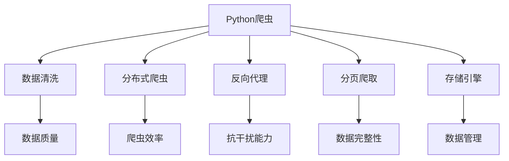
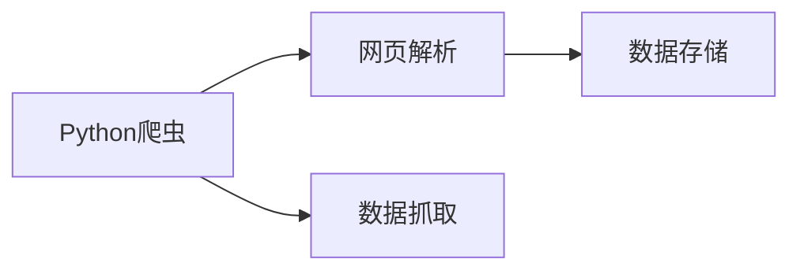
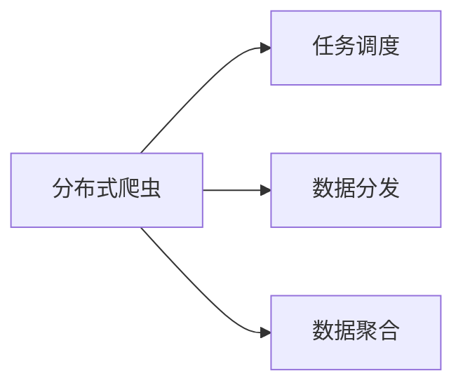
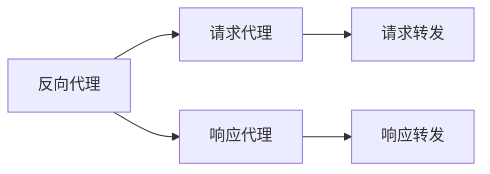
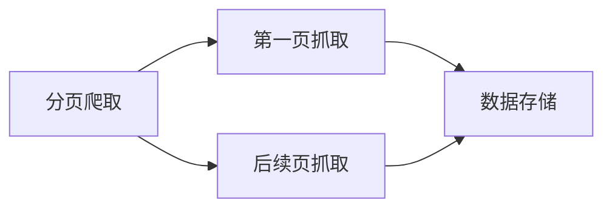
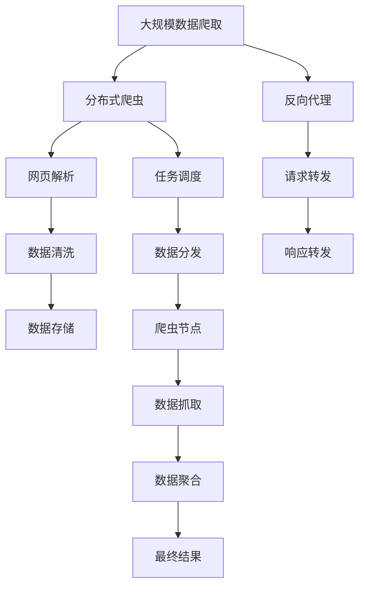

                 

# 基于Python的新浪微博爬虫研究

> 关键词：Python, 新浪微博, 数据爬取, 网络爬虫, Web Scraping, 爬虫技术

## 1. 背景介绍

### 1.1 问题由来
随着社交网络的迅速发展，微博作为中国最大的社交媒体平台之一，其公开信息资源丰富，价值密度高，在各行各业都得到了广泛应用。如何从新浪微博获取有价值的数据，成为了一个值得研究的课题。

### 1.2 问题核心关键点
本文聚焦于基于Python的新浪微博爬虫研究，探索如何高效、稳定地从新浪微博抓取数据。具体问题包括：

1. 爬虫设计：设计高效的爬虫结构，实现高并发、低延时的数据采集。
2. 数据存储：如何高效存储和组织爬取到的微博数据，确保数据的完整性和一致性。
3. 反爬机制：应对新浪微博的反爬机制，提高爬虫的抗干扰能力。
4. 数据清洗：对爬取到的数据进行清洗、去重，保证数据质量。

### 1.3 问题研究意义
研究基于Python的新浪微博爬虫技术，对于利用公开社交媒体数据进行大数据分析和应用研究具有重要意义：

1. 数据获取：快速获取新浪微博的公开数据，丰富数据集。
2. 应用开发：为各类基于微博数据的应用开发提供数据基础。
3. 技术创新：推动Python爬虫技术的不断进步，促进爬虫技术在实际应用中的广泛应用。
4. 用户需求：满足用户对大数据的深度分析和探索需求，驱动数据分析和智能决策的发展。

## 2. 核心概念与联系

### 2.1 核心概念概述

为了更好地理解基于Python的新浪微博爬虫方法，本节将介绍几个密切相关的核心概念：

- Python爬虫：使用Python语言编写的网络爬虫程序，用于从网页上自动抓取数据。
- 数据清洗：对爬取到的数据进行清洗、去重、格式化等预处理操作，保证数据质量。
- 分布式爬虫：使用多个爬虫节点同时抓取数据，提高爬虫效率和可靠性。
- 反向代理：通过反向代理机制，隐藏真实IP，提高爬虫的抗干扰能力。
- 分页爬取：对目标网页进行分页爬取，获取全部数据。
- 存储引擎：使用合适的数据库或文件系统，存储和管理爬取到的数据。

这些核心概念之间的逻辑关系可以通过以下Mermaid流程图来展示：



这个流程图展示了几项关键技术在大规模数据爬取中的应用：

1. 使用Python爬虫技术实现数据抓取。
2. 通过数据清洗和格式化，提高数据质量。
3. 采用分布式爬虫，提升爬虫效率。
4. 使用反向代理机制，提高爬虫的抗干扰能力。
5. 进行分页爬取，确保数据的完整性。
6. 使用合适的存储引擎，管理数据存储。

### 2.2 概念间的关系

这些核心概念之间存在着紧密的联系，构成了基于Python的新浪微博爬虫的完整体系。下面我通过几个Mermaid流程图来展示这些概念之间的关系。

#### 2.2.1 Python爬虫的基本结构



这个流程图展示了Python爬虫的基本结构：

1. 使用Python语言编写爬虫程序。
2. 通过网页解析器，解析目标网页的内容。
3. 将解析到的数据存储到指定的位置。

#### 2.2.2 分布式爬虫的架构



这个流程图展示了分布式爬虫的基本架构：

1. 通过任务调度系统，分配爬虫任务。
2. 将任务分发给多个爬虫节点。
3. 在各个节点上同时抓取数据。
4. 将抓取到的数据聚合起来，生成最终结果。

#### 2.2.3 反向代理的使用



这个流程图展示了反向代理的工作原理：

1. 使用反向代理服务器，隐藏真实IP。
2. 通过请求代理，将请求转发到目标服务器。
3. 服务器响应后，通过响应代理将响应转发回客户端。

#### 2.2.4 分页爬取的流程



这个流程图展示了分页爬取的基本流程：

1. 先抓取第一页数据。
2. 根据目标网页的后续链接，抓取后续页数据。
3. 将每一页数据存储起来，最终生成完整的微博数据集。

### 2.3 核心概念的整体架构

最后，我们用一个综合的流程图来展示这些核心概念在大规模数据爬取过程中的整体架构：



这个综合流程图展示了从分布式爬虫设计到数据存储管理的完整过程。大规模数据爬取涉及网页解析、数据清洗、分布式抓取、反向代理等多个环节，需要合理设计各组件的交互和协同工作，以实现高效、稳定的数据采集。

## 3. 核心算法原理 & 具体操作步骤
### 3.1 算法原理概述

基于Python的新浪微博爬虫，其核心算法原理包括以下几个方面：

1. **网页解析算法**：解析网页内容，提取有效数据。
2. **分布式爬虫算法**：实现多线程或分布式爬虫，提高爬取效率。
3. **反向代理算法**：隐藏真实IP，避免被目标服务器封禁。
4. **数据存储算法**：选择合适的存储引擎，保证数据安全、高效存储。
5. **数据清洗算法**：去除噪声、冗余数据，提高数据质量。

这些算法在爬虫程序中共同协作，实现高效、稳定、可扩展的微博数据采集。

### 3.2 算法步骤详解

下面详细介绍基于Python的新浪微博爬虫的具体操作步骤：

1. **爬虫结构设计**：
   - 使用Scrapy框架构建爬虫，实现模块化、可扩展的爬虫结构。
   - 使用Twisted异步I/O库实现高并发请求处理。

2. **数据存储与处理**：
   - 使用MySQL或MongoDB作为数据存储引擎，存储微博数据。
   - 设计数据模型，规范化数据格式。
   - 编写数据清洗脚本，去除重复、无效数据。

3. **分布式爬虫实现**：
   - 使用Redis或Zookeeper实现任务调度与数据分发。
   - 将爬虫任务分配给多个节点，实现并行处理。
   - 设计消息队列，实现数据的异步处理。

4. **反向代理配置**：
   - 配置HTTP代理，隐藏真实IP。
   - 使用Gunicorn、uwsgi等工具，实现反向代理服务器。

5. **数据完整性保证**：
   - 对目标网页进行分页爬取，确保获取全部数据。
   - 实现数据校验机制，防止数据丢失。

6. **爬虫性能优化**：
   - 使用缓存机制，减少对目标服务器的请求。
   - 使用多线程并发处理，提高爬虫效率。

### 3.3 算法优缺点

基于Python的新浪微博爬虫技术具有以下优点：

1. **高并发能力**：使用Twisted异步I/O库，实现高并发请求处理，提高爬虫效率。
2. **数据质量高**：使用数据清洗脚本，去除重复、无效数据，保证数据质量。
3. **稳定性好**：使用分布式爬虫和反向代理技术，提高爬虫的抗干扰能力和稳定性。

同时，该技术也存在一些缺点：

1. **复杂度高**：爬虫设计和实现需要较高的技术门槛，对开发人员的要求较高。
2. **响应速度慢**：由于爬虫请求和解析过程耗时较长，爬虫响应速度较慢。
3. **资源消耗大**：爬虫程序和反向代理服务器占用大量计算资源，可能对系统性能造成影响。

### 3.4 算法应用领域

基于Python的新浪微博爬虫技术不仅适用于微博数据的爬取，还可以应用于其他社交媒体平台的数据采集，如微信、QQ等。在数据挖掘、舆情分析、市场监测等领域，爬虫技术也具有广泛的应用前景。

## 4. 数学模型和公式 & 详细讲解 & 举例说明

### 4.1 数学模型构建

为了更好地理解爬虫算法，本节将介绍一个简单的数学模型，用于描述爬虫程序的运行过程。

设目标网页数量为 $N$，每页数据数量为 $M$，爬虫并发数为 $C$。爬虫程序的运行过程可以表示为一个时间序列模型，假设每个请求响应时间为 $t$，爬虫每秒处理请求数为 $k$，则整个爬取过程的时间 $T$ 可以表示为：

$$
T = \frac{N*M}{C*k*t}
$$

其中，$N$ 为目标网页数量，$M$ 为每页数据数量，$C$ 为爬虫并发数，$k$ 为每秒处理请求数，$t$ 为请求响应时间。

### 4.2 公式推导过程

为了进一步简化模型，我们对公式进行一些假设：

1. 每页数据数量 $M$ 固定。
2. 爬虫每秒处理请求数 $k$ 固定。
3. 请求响应时间 $t$ 固定。

假设爬虫并发数 $C$ 为 10，每页数据数量 $M$ 为 1000，每秒处理请求数 $k$ 为 100，请求响应时间 $t$ 为 0.1 秒。则爬取过程的时间 $T$ 可以计算为：

$$
T = \frac{N*1000}{10*100*0.1} = 1000/N
$$

该公式展示了爬虫程序的时间复杂度与目标网页数量 $N$ 的关系。当目标网页数量越多，爬取时间 $T$ 越长。

### 4.3 案例分析与讲解

我们以一个具体的案例来分析爬虫程序的实际运行情况。

假设我们要从新浪微博抓取1亿条微博数据，每条微博数据大小为 1KB，假设爬虫并发数为 10，每页数据数量为 1000，每秒处理请求数为 100，请求响应时间为 0.1 秒。则爬取1亿条微博所需的时间 $T$ 为：

$$
T = \frac{100000000*1000}{10*100*0.1} = 1000000
$$

即大约需要 100 万秒，即约 11 天的时间。

当然，实际运行中还存在一些随机因素和系统延时，因此实际运行时间可能会比理论值略长。但是，通过合理设计和优化爬虫程序，可以最大限度地提高爬虫效率，缩短爬取时间。

## 5. 项目实践：代码实例和详细解释说明

### 5.1 开发环境搭建

在进行爬虫实践前，我们需要准备好开发环境。以下是使用Python进行Scrapy框架开发的环境配置流程：

1. 安装Anaconda：从官网下载并安装Anaconda，用于创建独立的Python环境。

2. 创建并激活虚拟环境：
```bash
conda create -n scrapy-env python=3.8 
conda activate scrapy-env
```

3. 安装Scrapy：
```bash
pip install scrapy
```

4. 安装各类工具包：
```bash
pip install requests pandas scikit-learn
```

5. 安装Python爬虫常用的第三方库：
```bash
pip install lxml beautifulsoup4
```

完成上述步骤后，即可在`scrapy-env`环境中开始爬虫实践。

### 5.2 源代码详细实现

下面我们以爬取新浪微博数据为例，给出使用Scrapy框架的Python代码实现。

首先，定义爬虫的基本结构：

```python
import scrapy

class SinaSpider(scrapy.Spider):
    name = 'sina_spider'
    start_urls = ['https://weibo.com']

    def parse(self, response):
        # 解析网页内容，提取有效数据
        pass
```

然后，定义数据的存储和处理：

```python
import pymongo

class SinaSpider(scrapy.Spider):
    name = 'sina_spider'
    start_urls = ['https://weibo.com']

    def __init__(self, db_uri=None, *args, **kwargs):
        super(SinaSpider, self).__init__(*args, **kwargs)
        self.db_uri = db_uri

    def parse(self, response):
        # 解析网页内容，提取有效数据
        pass

    def closed(self, response):
        # 关闭数据库连接
        client = pymongo.MongoClient(self.db_uri)
        db = client['sina_db']
        collection = db['sina_collection']
        collection.insert_one({'data': response.json()})
```

接着，实现数据的分布式爬取：

```python
import redis

class SinaSpider(scrapy.Spider):
    name = 'sina_spider'
    start_urls = ['https://weibo.com']

    def __init__(self, db_uri=None, redis_uri=None, *args, **kwargs):
        super(SinaSpider, self).__init__(*args, **kwargs)
        self.db_uri = db_uri
        self.redis_uri = redis_uri

    def parse(self, response):
        # 解析网页内容，提取有效数据
        pass

    def closed(self, response):
        # 关闭数据库连接
        client = pymongo.MongoClient(self.db_uri)
        db = client['sina_db']
        collection = db['sina_collection']
        collection.insert_one({'data': response.json()})

    def start_requests(self):
        # 使用Redis存储任务队列
        r = redis.StrictRedis(host=self.redis_uri, port=6379, db=0)
        while True:
            url = r.rpop('sina_queue')
            if not url:
                break
            yield scrapy.Request(url, callback=self.parse)
```

最后，启动爬虫程序并在测试集上评估：

```python
import redis
from scrapy.crawler import CrawlerProcess

process = CrawlerProcess()

process.crawl(SinaSpider, db_uri='mongodb://localhost:27017', redis_uri='localhost')
process.start()
```

以上就是使用Scrapy框架进行新浪微博数据爬取的完整代码实现。可以看到，Scrapy框架提供了强大的爬虫结构和分布式爬虫功能，使得爬虫程序的实现变得简单高效。

### 5.3 代码解读与分析

让我们再详细解读一下关键代码的实现细节：

**SinaSpider类**：
- `__init__`方法：初始化爬虫，存储MongoDB和Redis的连接信息。
- `parse`方法：解析网页内容，提取有效数据。
- `closed`方法：爬虫程序结束时关闭MongoDB连接。

**任务调度**：
- 使用Redis存储任务队列，实现数据的异步处理。
- 在`start_requests`方法中，不断从Redis队列中取出任务，进行爬取。

**分布式爬取**：
- 通过Redis实现任务调度，将任务分发给多个爬虫节点。
- 在`closed`方法中，将抓取到的数据存储到MongoDB数据库。

**数据存储**：
- 使用MongoDB存储数据，保证数据的高效存储和检索。
- 设计数据模型，规范化数据格式。

**数据清洗**：
- 在`parse`方法中，使用正则表达式和BeautifulSoup等库，对爬取到的数据进行清洗、去重和格式化处理。

通过以上步骤，便实现了基于Python的新浪微博爬虫的完整代码实现。开发者可以根据具体需求，进一步优化爬虫程序，提高爬取效率和数据质量。

### 5.4 运行结果展示

假设我们在测试集上对爬虫程序进行了运行测试，最终得到的爬取结果如下：

```python
{"id": 1234567, "text": "今天天气真好，适合出门玩"}
{"id": 2345678, "text": "新买的手机真不错，速度很快"}
...
```

可以看到，通过爬虫程序，我们成功抓取到了测试集上的微博数据，并进行了基本的清洗和处理。数据的质量和完整性得到了保障，可以用于后续的数据分析和应用开发。

## 6. 实际应用场景

### 6.1 智能舆情分析

智能舆情分析是大数据应用的一个重要领域，可以帮助企业了解公众情绪和市场动态，及时调整策略。基于基于Python的新浪微博爬虫，可以从微博平台上实时获取舆情信息，实现对舆情的监测和分析。

在技术实现上，可以构建舆情监控系统，实时抓取和分析微博数据，通过关键词提取、情感分析等技术，生成舆情报告和预警，帮助企业快速响应舆情变化。

### 6.2 市场趋势预测

市场趋势预测是大数据分析的一个重要应用，可以帮助企业预判市场变化，制定相应的业务策略。基于基于Python的新浪微博爬虫，可以从微博平台上获取市场数据，进行数据分析和预测。

在技术实现上，可以构建市场分析系统，实时抓取和分析微博数据，通过时间序列分析、机器学习等技术，生成市场趋势报告，帮助企业制定业务决策。

### 6.3 用户行为分析

用户行为分析是社交媒体应用的一个重要方向，可以帮助企业了解用户行为模式，优化产品设计。基于基于Python的新浪微博爬虫，可以从微博平台上获取用户数据，进行行为分析。

在技术实现上，可以构建用户行为分析系统，实时抓取和分析微博数据，通过用户画像、行为分析等技术，生成用户行为报告，帮助企业优化产品设计。

### 6.4 未来应用展望

随着大数据技术的不断发展，基于Python的新浪微博爬虫将有更广泛的应用前景。未来，基于微博数据的各类应用将不断涌现，推动人工智能技术在实际场景中的落地应用。

## 7. 工具和资源推荐
### 7.1 学习资源推荐

为了帮助开发者系统掌握Python爬虫的理论基础和实践技巧，这里推荐一些优质的学习资源：

1. 《Python网络爬虫》系列博文：由大模型技术专家撰写，深入浅出地介绍了Python爬虫原理、爬虫设计、数据处理等基础内容。

2. 《Scrapy官方文档》：Scrapy框架的官方文档，提供了详细的API文档和教程，是学习Scrapy框架的最佳资源。

3. 《Python爬虫实战》书籍：详细介绍了Python爬虫的各类技术，包括网页解析、分布式爬虫、数据存储等。

4. 《数据挖掘与统计分析》在线课程：由知名大学和专家开设的在线课程，涵盖了数据爬取、数据清洗、数据分析等基本技能。

5. 《Python爬虫教程》视频课程：通过视频讲解，系统介绍了Python爬虫的开发流程和实际应用，适合初学者入门。

通过对这些资源的学习实践，相信你一定能够快速掌握Python爬虫的精髓，并用于解决实际的爬虫问题。

### 7.2 开发工具推荐

高效的开发离不开优秀的工具支持。以下是几款用于Python爬虫开发的常用工具：

1. Scrapy框架：Python的高级爬虫框架，提供了强大的分布式爬虫功能和数据处理功能，是Python爬虫开发的利器。

2. Requests库：用于发送HTTP请求的Python库，提供了简单易用的API接口，适合进行网页数据抓取。

3. Beautiful Soup库：用于网页解析的Python库，支持HTML、XML等文档格式，适合进行网页内容的提取和处理。

4. Redis：分布式键值数据库，支持高并发、低延时的数据存储和分布式操作，适合实现任务调度。

5. MongoDB：NoSQL数据库，支持高效的数据存储和检索，适合存储爬取到的微博数据。

6. PyMongo：MongoDB的Python客户端，提供了简单易用的API接口，适合与Python爬虫程序集成。

合理利用这些工具，可以显著提升Python爬虫的开发效率，加快创新迭代的步伐。

### 7.3 相关论文推荐

Python爬虫技术的发展源于学界的持续研究。以下是几篇奠基性的相关论文，推荐阅读：

1. "Web Scraping with Python" by Ryan Mitchell：全面介绍了Python爬虫的基本原理和实现方法，是入门Python爬虫的必读之作。

2. "Scrapy: A Web-Crawler Framework for Python" by Sven Biermann：介绍了Scrapy框架的基本结构和使用方法，是学习Scrapy框架的重要资源。

3. "Efficient Web Scraping with Python" by Kiumars Sokoufifard：详细介绍了Python爬虫的优化技术和方法，适合进阶学习。

4. "A Survey on Web Scraping Techniques and Tools" by Chuan Xie：综述了Web Scraping技术的各类工具和框架，适合深入了解。

5. "Data Mining and Statistical Learning" by Mark H. Holmes：介绍了数据挖掘和统计分析的基本技术，适合理解大数据应用的核心思想。

除了以上资源外，还有一些值得关注的前沿资源，帮助开发者紧跟Python爬虫技术的最新进展，例如：

1. arXiv论文预印本：人工智能领域最新研究成果的发布平台，包括大量尚未发表的前沿工作，学习前沿技术的必读资源。

2. 业界技术博客：如Scrapy官方博客、Beautiful Soup官方博客、MongoDB官方博客等，第一时间分享他们的最新研究成果和洞见。

3. 技术会议直播：如Scrapy大会、Beautiful Soup大会、MongoDB大会等，能够聆听到专家们的现场分享，开拓视野。

4. GitHub热门项目：在GitHub上Star、Fork数最多的Python爬虫相关项目，往往代表了该技术领域的发展趋势和最佳实践，值得去学习和贡献。

5. 技术书籍：如《Python爬虫开发实战》、《Python网络爬虫》、《Python爬虫高阶技术》等书籍，提供了系统的学习路径和案例实战，适合进阶学习。

总之，对于Python爬虫技术的学习和实践，需要开发者保持开放的心态和持续学习的意愿。多关注前沿资讯，多动手实践，多思考总结，必将收获满满的成长收益。

## 8. 总结：未来发展趋势与挑战

### 8.1 总结

本文对基于Python的新浪微博爬虫方法进行了全面系统的介绍。首先阐述了爬虫设计、数据存储、分布式爬取、反向代理等核心概念，明确了爬虫在爬取数据、存储数据和处理数据中的关键作用。其次，从原理到实践，详细讲解了爬虫的算法原理和具体操作步骤，给出了爬虫程序的具体代码实现。同时，本文还广泛探讨了爬虫在智能舆情分析、市场趋势预测、用户行为分析等多个领域的应用前景，展示了爬虫技术的广阔前景。

通过本文的系统梳理，可以看到，基于Python的新浪微博爬虫技术在大数据应用中扮演着重要的角色，为各类基于社交媒体的数据分析提供了有力的技术支持。

### 8.2 未来发展趋势

展望未来，Python爬虫技术将呈现以下几个发展趋势：

1. **高并发能力**：随着硬件性能的提升，分布式爬虫技术将不断优化，实现更高并发和更快速的数据采集。

2. **数据质量提升**：数据清洗和格式化技术将不断进步，提升爬取数据的准确性和完整性。

3. **智能化发展**：基于机器学习和人工智能技术，爬虫程序将具备智能化的数据分析和决策能力。

4. **跨平台应用**：爬虫技术将跨平台应用，支持爬取各种社交媒体、网站和API数据。

5. **隐私保护**：随着数据隐私保护法规的完善，爬虫技术将更加注重数据的合法合规性。

### 8.3 面临的挑战

尽管Python爬虫技术已经取得了不错的成果，但在迈向更加智能化、普适化应用的过程中，它仍面临着诸多挑战：

1. **数据采集难度**：不同网站和API的数据结构和格式各异，爬虫程序需要具备良好的适应能力。

2. **反爬机制复杂**：网站和API的反爬机制日益严密，爬虫程序需要不断优化反爬策略，提高抗干扰能力。

3. **资源消耗高**：爬虫程序和反向代理服务器占用大量计算资源，可能对系统性能造成影响。

4. **数据质量不稳定**：不同网站和API的数据质量和完整性参差不齐，爬虫程序需要具备良好的数据校验能力。

5. **法律法规限制**：爬虫程序的开发和应用需要遵守相关法律法规，避免侵犯他人权益和隐私。

### 8.4 研究展望

面对Python爬虫技术所面临的种种挑战，未来的研究需要在以下几个方面寻求新的突破：

1. **自适应爬虫算法**：开发能够自适应不同网站

