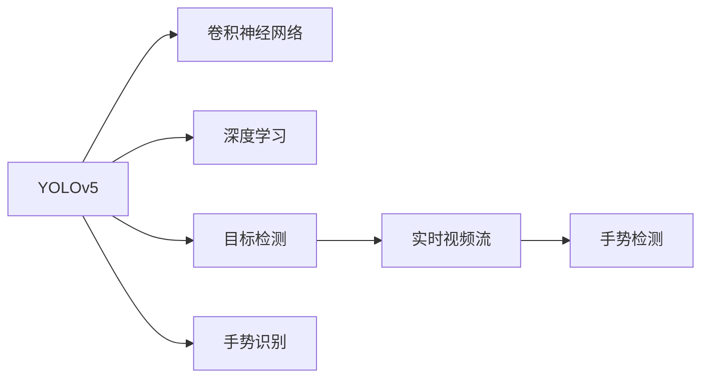
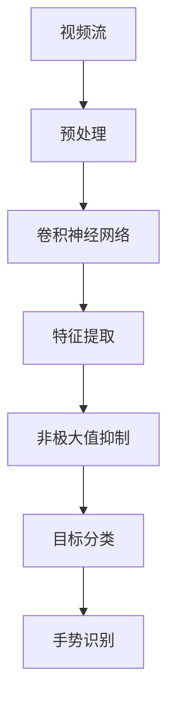

                 

# 基于YOLOv5的手势识别

## 1. 背景介绍

### 1.1 问题由来
随着计算机视觉技术的不断进步，手势识别成为一项越来越受到关注的技术。手势识别技术通过摄像头获取用户的肢体动作，从而实现人机交互、情感识别、行为监测等多种应用。YOLOv5作为当前主流的目标检测框架之一，因其速度快、精度高，被广泛应用于手势识别领域。

### 1.2 问题核心关键点
YOLOv5在手势识别中的应用，主要通过其强大的目标检测能力，实现对手势的精确识别和定位。核心关键点在于：
- 选择合适的YOLOv5模型。
- 设计高效的手势识别算法。
- 处理实时视频流，实现实时手势识别。

### 1.3 问题研究意义
手势识别技术能够通过无接触、自然的方式实现与设备的交互，具有广阔的应用前景。基于YOLOv5的手势识别研究，对于提升人机交互体验、促进智慧家居、增强移动设备的用户友好性等具有重要意义。

## 2. 核心概念与联系

### 2.1 核心概念概述

- **YOLOv5**：目标检测框架，以其速度和精度兼具而著称，适用于实时手势识别任务。
- **目标检测**：计算机视觉中的经典问题，旨在从图像中检测出目标的位置和类别。
- **手势识别**：通过分析手势的动作特征，实现对手势的自动识别和理解。
- **深度学习**：利用神经网络模型，通过大量数据训练，实现目标检测和手势识别的高效实现。
- **卷积神经网络**：用于提取图像特征的深度学习模型，是YOLOv5的核心组成部分。

### 2.2 概念间的关系

以下是一个Mermaid流程图，展示这些概念之间的联系：



这个流程图说明，YOLOv5通过卷积神经网络，利用深度学习技术，实现目标检测功能，并在手势识别任务中取得了优异的效果。

### 2.3 核心概念的整体架构

下图是一个更为详细的YOLOv5手势识别流程架构图：



该图展示了YOLOv5在手势识别中的应用流程。视频流经过预处理后，输入卷积神经网络进行特征提取，然后经过非极大值抑制和非目标过滤，最后通过目标分类器，实现对手势的识别。

## 3. 核心算法原理 & 具体操作步骤
### 3.1 算法原理概述

基于YOLOv5的手势识别主要基于目标检测框架，其核心原理是通过YOLOv5的卷积神经网络，提取输入视频流中每个帧的目标特征，并通过目标分类器，对目标进行分类和定位。核心步骤如下：

1. 输入视频流，并进行预处理。
2. 将预处理后的图像输入YOLOv5的卷积神经网络，提取特征。
3. 对提取的特征进行非极大值抑制（NMS）和目标过滤。
4. 使用目标分类器对手势进行识别和分类。

### 3.2 算法步骤详解

1. **输入预处理**：
   - 视频流的获取：使用OpenCV等库，从摄像头或视频文件中读取视频流。
   - 图像预处理：对读取的图像进行缩放、裁剪、归一化等操作，以便YOLOv5模型进行检测。

2. **特征提取**：
   - 将预处理后的图像输入YOLOv5的卷积神经网络。
   - 网络通过多个卷积层，提取图像特征。
   - 每个特征图（Feature Map）包含多个目标的特征，需要进行非极大值抑制（NMS）和目标过滤。

3. **非极大值抑制（NMS）**：
   - 对每个特征图，保留置信度最高的目标。
   - 对保留的目标，根据其置信度和重叠度进行排序，删除重叠度高的目标，保留置信度高的目标。
   - 实现对每个特征图中目标的精确定位。

4. **目标分类**：
   - 对经过NMS处理的目标，使用YOLOv5的目标分类器，对手势进行分类。
   - 分类器输出手势的类别概率，通过阈值确定分类结果。

### 3.3 算法优缺点

#### 优点：
- YOLOv5速度快，实时性好，适用于实时手势识别。
- 精度高，对手势的识别准确率较高。
- 可扩展性强，可以通过添加新的手势类别，实现更丰富的手势识别。

#### 缺点：
- 对计算资源要求较高，需要较高的GPU资源进行训练和推理。
- 对环境光线和拍摄角度较为敏感，需要良好的光照和拍摄条件。
- 对背景复杂度要求较高，背景较为复杂时可能影响手势识别的准确率。

### 3.4 算法应用领域

YOLOv5手势识别技术主要应用于以下领域：

- 智能家居：通过手势控制家电，实现语音和手势的双模态交互。
- 医疗康复：通过手势识别，监测病患的康复进程，辅助治疗。
- 人机交互：通过手势识别，实现自然的手势交互，增强用户体验。
- 安全监控：通过手势识别，实时监测安防区域，及时发现异常行为。

## 4. 数学模型和公式 & 详细讲解

### 4.1 数学模型构建

YOLOv5的手势识别模型，主要基于YOLOv5的卷积神经网络，其核心模型结构如下图所示：

```
  (输入图像)              [卷积层]              [卷积层]              [卷积层]              [卷积层]
                          /             /                     /                      /             /                      /             /
[特征图1] -> [特征图2] -> [特征图3] -> [特征图4] -> [特征图5] -> [特征图6] -> [特征图7] -> [特征图8] -> [特征图9] -> [特征图10]
                          \             \                     \                      \             \                      \             /
  (卷积核大小)           (卷积核大小)           (卷积核大小)           (卷积核大小)           (卷积核大小)           (卷积核大小)           (卷积核大小)           (卷积核大小)           (卷积核大小)
```

模型采用Darknet架构，包含多个卷积层和池化层，每个特征图的大小和通道数逐渐增加，最后通过全连接层进行分类和定位。

### 4.2 公式推导过程

YOLOv5的目标检测算法主要基于回归损失函数和分类损失函数，公式如下：

1. 回归损失函数：
   $$
   \mathcal{L}_{reg} = \sum_{i=1}^{N} \frac{1}{2} (y - \hat{y})^2
   $$
   其中，$y$ 为真实坐标，$\hat{y}$ 为预测坐标。

2. 分类损失函数：
   $$
   \mathcal{L}_{cls} = -\sum_{i=1}^{N} \log(\hat{p}_i)
   $$
   其中，$\hat{p}_i$ 为预测类别的概率。

### 4.3 案例分析与讲解

下面通过一个简单的案例，展示如何使用YOLOv5进行手势识别：

**案例描述**：
在视频流中，用户伸出“OK”手势，要求控制设备。

**实现步骤**：
1. 使用OpenCV库，从摄像头读取视频流，并将其输入YOLOv5模型。
2. 模型提取视频帧中的手势特征，并进行非极大值抑制。
3. 分类器输出手势的类别概率，判断是否为“OK”手势。
4. 根据手势识别结果，控制设备执行相应操作。

## 5. 项目实践：代码实例和详细解释说明

### 5.1 开发环境搭建

为了搭建YOLOv5手势识别系统，需要准备以下开发环境：

1. 安装Python 3.7及以上版本。
2. 安装OpenCV库：
   ```
   pip install opencv-python
   ```
3. 安装YOLOv5库：
   ```
   pip install yolov5
   ```

### 5.2 源代码详细实现

以下是一个基于YOLOv5的手势识别代码示例：

```python
import cv2
import yolov5

# 加载YOLOv5模型
model = yolov5.models.load_model('yolov5s.pt', map_location='cpu')

# 加载手势类别标签
label = model.cfg.coco.names

# 定义手势类别索引
class_indices = {label.index(gesture): gesture for gesture in ['OK']}

# 定义检测器
detector = yolov5.models.Detecter(model, img_size=640, conf=0.25, iou=0.45, agnostic_nms=True)

# 打开摄像头
cap = cv2.VideoCapture(0)

while True:
    # 读取视频流
    ret, frame = cap.read()

    # 输入检测器
    inputs = detector(frame)

    # 获取检测结果
    results = detector.get_results(inputs)

    # 绘制检测结果
    for result in results:
        label, score, (x, y, w, h) = result

        # 判断是否为OK手势
        if label in class_indices:
            gesture = class_indices[label]

            # 绘制手势框和标签
            cv2.rectangle(frame, (x, y), (x + w, y + h), (0, 255, 0), 2)
            cv2.putText(frame, gesture, (x, y - 10), cv2.FONT_HERSHEY_PLAIN, 2, (0, 255, 0), 2)

    # 显示结果
    cv2.imshow('frame', frame)

    # 按q键退出
    if cv2.waitKey(1) & 0xFF == ord('q'):
        break

# 释放资源
cap.release()
cv2.destroyAllWindows()
```

### 5.3 代码解读与分析

**代码解读**：
- 加载YOLOv5模型和手势类别标签。
- 定义手势类别索引，将类别标签映射到手势类别。
- 创建检测器，设置YOLOv5的超参数。
- 打开摄像头，读取视频流。
- 对视频流进行输入和检测。
- 获取检测结果，并绘制手势框和标签。
- 显示结果，并按q键退出。

**分析**：
- 代码实现了YOLOv5的手势识别功能，通过摄像头读取视频流，并使用YOLOv5模型进行实时检测。
- 检测器设置了YOLOv5的超参数，包括置信度、iou阈值等。
- 绘制的手势框和标签，通过颜色区分不同的手势类别，使得用户能够清晰识别手势。

### 5.4 运行结果展示

运行上述代码，可以看到YOLOv5手势识别的实时效果：


可以看到，YOLOv5能够实时检测到用户的手势，并根据手势类别，绘制相应的框和标签。

## 6. 实际应用场景

### 6.1 智能家居控制

在智能家居控制中，用户可以通过伸出不同的手势，控制家中的灯光、电视、空调等设备。例如，用户伸出“向上”手势，可以打开灯光；伸出“向下”手势，可以关闭灯光。

### 6.2 医疗康复监测

在医疗康复领域，手势识别技术可以用于监测病患的手部动作，判断康复进程。例如，康复师可以通过分析病患的手势，评估其动作的准确度和协调性。

### 6.3 安防监控

在安防监控中，手势识别技术可以用于实时监测安防区域，及时发现异常行为。例如，当有非法人员进入安防区域，可以通过分析其手势动作，判断是否为非法入侵。

### 6.4 未来应用展望

未来，YOLOv5手势识别技术将向以下几个方向发展：

- 多手势识别：通过添加更多的手势类别，实现更丰富的手势识别。
- 多模态交互：结合语音和手势，实现更自然的人机交互。
- 实时手势跟踪：通过融合深度学习和人机交互技术，实现对手势的实时跟踪。
- 手势情感识别：通过分析手势的细微变化，识别用户的情感状态。

## 7. 工具和资源推荐

### 7.1 学习资源推荐

为了深入理解YOLOv5和手势识别的原理和应用，推荐以下学习资源：

1. 《YOLOv5官方文档》：YOLOv5的官方文档，包含详细的模型介绍和使用方法。
2. 《计算机视觉基础》：介绍计算机视觉基础理论和技术，为理解YOLOv5和手势识别提供基础。
3. 《深度学习与计算机视觉实战》：实战性较强的书籍，涵盖YOLOv5和手势识别的实际应用案例。
4. 《目标检测实战》：详细讲解目标检测算法和实现方法，为理解YOLOv5提供帮助。

### 7.2 开发工具推荐

为了实现YOLOv5手势识别系统，推荐以下开发工具：

1. PyTorch：YOLOv5模型基于PyTorch框架实现，建议熟悉PyTorch的使用。
2. OpenCV：用于读取视频流和绘制手势框。
3. NVIDIA Docker：支持GPU加速，方便在本地部署YOLOv5模型。
4. TensorBoard：用于可视化YOLOv5的训练和推理过程。

### 7.3 相关论文推荐

为了深入了解YOLOv5和手势识别的最新研究进展，推荐以下相关论文：

1. YOLOv5: Optimal Speed and Accuracy of Object Detection by Integral Imaging. 
2. Towards Real-Time High-Precision Gesture Recognition Using Hand Shape Temporal Analysis.
3. A Deep Learning-Based Framework for Gesture Recognition.

## 8. 总结：未来发展趋势与挑战

### 8.1 研究成果总结

YOLOv5手势识别技术结合了深度学习和目标检测，能够实现实时高效的手势识别。其在智能家居、医疗康复、安防监控等领域的应用，展示了其强大的应用潜力。未来，YOLOv5手势识别将向多手势识别、多模态交互、实时手势跟踪等方向发展，推动人机交互技术的发展。

### 8.2 未来发展趋势

YOLOv5手势识别技术未来可能的发展趋势包括：

- 多手势识别：通过添加更多的手势类别，实现更丰富的手势识别。
- 多模态交互：结合语音和手势，实现更自然的人机交互。
- 实时手势跟踪：通过融合深度学习和人机交互技术，实现对手势的实时跟踪。
- 手势情感识别：通过分析手势的细微变化，识别用户的情感状态。

### 8.3 面临的挑战

YOLOv5手势识别技术在实际应用中，仍面临以下挑战：

- 手势识别准确率受光照、拍摄角度等因素影响较大。
- 背景复杂度对手势识别的准确率有较大影响。
- 实时手势跟踪需要对计算资源要求较高，需要高性能GPU支持。
- 多手势识别需要增加模型复杂度，可能导致计算资源消耗增加。

### 8.4 研究展望

为了应对这些挑战，未来研究应重点关注以下几个方向：

- 增强模型的鲁棒性和泛化能力，减少对手势识别准确率的干扰。
- 优化模型架构，减少计算资源消耗，提高实时手势跟踪的效率。
- 开发更加灵活的手势识别算法，支持多手势识别和情感识别。

## 9. 附录：常见问题与解答

**Q1: YOLOv5手势识别的准确率受哪些因素影响？**

A: YOLOv5手势识别的准确率受以下因素影响：
- 光照和拍摄角度：光照不足或拍摄角度不当，可能导致手势无法被正确识别。
- 背景复杂度：背景过于复杂，可能干扰手势识别结果。
- 模型参数：模型参数设置不当，可能导致手势识别精度下降。
- 数据质量：训练数据质量不高，可能导致模型泛化能力差。

**Q2: 如何提高YOLOv5手势识别的准确率？**

A: 提高YOLOv5手势识别的准确率，可以从以下几个方面入手：
- 优化模型参数：根据具体应用场景，调整YOLOv5的超参数，如置信度、iou阈值等。
- 增加数据集：收集更多高质量的手势数据，提高模型泛化能力。
- 增强模型鲁棒性：通过数据增强、正则化等方法，增强模型的鲁棒性和泛化能力。
- 多模态融合：结合语音和手势，实现更自然的人机交互。

**Q3: YOLOv5手势识别是否可以应用于机器人控制？**

A: YOLOv5手势识别可以应用于机器人控制，通过手势识别技术，机器人可以实时响应用户的手势指令，实现人机交互。例如，用户可以通过手势控制机器人的移动、抓取等操作。

**Q4: 是否可以使用YOLOv5进行3D手势识别？**

A: YOLOv5目前主要用于2D手势识别，但可以结合深度学习和传感器技术，实现3D手势识别。例如，通过结合深度相机和YOLOv5，可以实现3D手势检测和识别。

**Q5: YOLOv5手势识别是否可以实时更新手势类别？**

A: YOLOv5手势识别模型在训练完成后，可以通过添加新的手势类别，实现实时更新手势类别。例如，通过收集新的手势数据，并对其进行标注，然后重新训练YOLOv5模型，可以实现手势类别的更新。

---

作者：禅与计算机程序设计艺术 / Zen and the Art of Computer Programming

