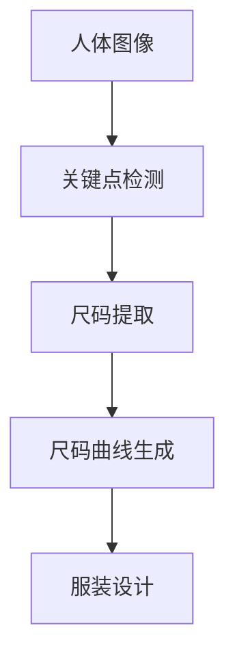

                 

# 基于matlab的面向衣物设计的人体关键尺码提取与分析

> 关键词：人体尺码, 衣服设计, 关键点检测, 服装零售, 数据驱动设计

## 1. 背景介绍

### 1.1 问题由来

随着全球时尚产业的快速发展和个性化需求的不断提升，衣物设计领域对精确的尺码标准提出了更高的要求。然而，当前市场上的尺码标准仍存在不统一的问题，这不仅影响消费者的购物体验，也给服装制造商和零售商带来了不小的挑战。

为了更好地满足市场的需求，需要将人体关键尺码信息准确地提取和分析，用于指导衣物设计和生产。传统的人工测量方法存在准确性差、效率低、成本高等问题，无法满足大规模应用的需求。因此，需要借助计算机视觉和数据分析技术，实现人体尺码的自动化提取和分析。

### 1.2 问题核心关键点

人体关键尺码提取与分析的核心任务包括：

- 对人体图像进行关键点检测和定位。
- 从关键点信息中提取人体关键尺码数据。
- 对尺码数据进行分析，生成尺码曲线图。
- 应用尺码曲线图指导衣物设计。

解决这些问题的关键在于：

1. 准确高效的关键点检测算法。
2. 稳健可靠的尺码提取方法。
3. 实用的尺码分析工具。
4. 易于应用的尺码曲线生成技术。

## 2. 核心概念与联系

### 2.1 核心概念概述

为更好地理解人体关键尺码提取与分析方法，本节将介绍几个密切相关的核心概念：

- **人体关键点检测**：在人体图像中准确地检测出需要关注的关键点位置，如肩点、臀点、腰点等。
- **人体尺码提取**：从检测出的关键点信息中提取出人体的关键尺码数据，如胸围、腰围、臀围等。
- **尺码曲线生成**：将提取出的尺码数据绘制成曲线图，用于指导衣物设计。
- **服装设计**：结合尺码曲线图，设计和生产出适合不同体型的服装。

这些核心概念之间的逻辑关系可以通过以下Mermaid流程图来展示：



这个流程图展示了从人体图像到服装设计的全流程，各个环节之间通过数据流联接，形成一个整体。

### 2.2 概念间的关系

这些核心概念之间存在着紧密的联系，形成了人体尺码提取与分析的完整生态系统。下面我们通过几个Mermaid流程图来展示这些概念之间的关系。

#### 2.2.1 人体图像与关键点检测


这个流程图展示了人体图像如何通过关键点检测，得到关键尺码数据。

#### 2.2.2 尺码曲线与服装设计


这个流程图展示了尺码曲线如何指导服装设计，形成最终的产品。

#### 2.2.3 关键点检测与尺码曲线生成


这个流程图展示了关键点检测和尺码提取数据如何生成尺码曲线。

### 2.3 核心概念的整体架构

最后，我们用一个综合的流程图来展示这些核心概念在大尺码提取与分析过程中的整体架构：


这个综合流程图展示了从人体图像到尺码曲线，再到服装设计的完整过程，各个环节通过数据流联接，形成一个连续的管道。

## 3. 核心算法原理 & 具体操作步骤
### 3.1 算法原理概述

基于matlab的人体关键尺码提取与分析方法，核心在于关键点检测和尺码提取两个步骤。

关键点检测通常采用图像处理和计算机视觉技术，如边缘检测、特征点检测等。尺码提取则通过解析关键点信息，计算出人体的关键尺码数据。

#### 3.1.1 关键点检测

关键点检测的基本原理是通过对图像的预处理和特征提取，识别出人体的关键点位置。常用的方法包括：

- **边缘检测**：利用Canny算法等边缘检测技术，对图像进行边缘增强，提取关键点。
- **特征点检测**：利用SIFT、SURF、HOG等特征点检测技术，对图像进行特征提取，识别关键点。
- **深度学习**：使用卷积神经网络（CNN）等深度学习方法，直接从图像中检测关键点。

#### 3.1.2 尺码提取

尺码提取的原理是解析关键点信息，计算出人体的关键尺码数据。常用的方法包括：

- **几何计算**：通过解析关键点坐标，计算出人体各部位的尺寸。
- **模型拟合**：利用最小二乘法等数学模型，拟合人体尺寸曲线，提取尺码数据。
- **机器学习**：使用回归分析等机器学习技术，建立尺码提取模型。

### 3.2 算法步骤详解

基于matlab的人体关键尺码提取与分析方法，一般包括以下几个关键步骤：

**Step 1: 准备数据集**

- 收集人体图像数据集，包括不同体型、不同角度、不同光照条件下的图像。
- 标注数据集中的关键点位置，生成用于模型训练和验证的标注文件。

**Step 2: 关键点检测模型训练**

- 选择或设计关键点检测模型，如CNN、SIFT等。
- 在标注数据集上训练关键点检测模型。
- 在验证集上评估模型性能，选择最优模型。

**Step 3: 尺码提取模型训练**

- 解析关键点信息，提取人体尺码数据。
- 选择或设计尺码提取模型，如线性回归、最小二乘法等。
- 在标注数据集上训练尺码提取模型。
- 在验证集上评估模型性能，选择最优模型。

**Step 4: 尺码曲线生成**

- 将尺码数据绘制成曲线图，如胸围曲线、腰围曲线等。
- 对尺码曲线进行平滑处理，确保数据的准确性和可读性。

**Step 5: 应用尺码曲线**

- 根据尺码曲线，指导衣物设计。
- 进行服装试穿，调整尺码曲线，优化设计。

### 3.3 算法优缺点

基于matlab的人体关键尺码提取与分析方法具有以下优点：

1. **自动化**：借助计算机视觉和深度学习技术，实现关键点检测和尺码提取的自动化，减少人工干预。
2. **高精度**：使用先进的图像处理和计算机视觉技术，实现关键点检测的高精度。
3. **可扩展性**：利用matlab丰富的工具箱，可以实现不同尺码曲线和尺码分析工具的快速开发。

同时，该方法也存在一些局限性：

1. **数据依赖**：方法的效果依赖于高质量的数据集，数据集标注工作量较大。
2. **计算资源需求高**：深度学习模型训练和图像处理需要大量的计算资源。
3. **模型复杂度**：关键点检测和尺码提取模型较复杂，需要专业知识进行设计和训练。

### 3.4 算法应用领域

基于matlab的人体关键尺码提取与分析方法，在服装设计和零售领域有着广泛的应用。

1. **服装设计**：根据尺码曲线图，设计符合不同体型标准的服装款式。
2. **服装制造**：根据尺码曲线图，调整裁剪和缝制工艺，确保生产出合身的服装。
3. **服装零售**：根据尺码曲线图，提供更精准的尺码推荐，提升顾客满意度。

此外，该方法还可以应用于医疗、体育等领域，实现人体尺寸的自动化提取和分析。

## 4. 数学模型和公式 & 详细讲解 & 举例说明

### 4.1 数学模型构建

本节将使用数学语言对基于matlab的人体关键尺码提取与分析过程进行更加严格的刻画。

记输入的人体图像为 $I$，关键点检测模型为 $F$，尺码提取模型为 $S$。关键点检测和尺码提取的数学模型分别为：

$$
F: I \rightarrow P
$$

$$
S: P \rightarrow C
$$

其中 $P$ 为关键点集合，$C$ 为尺码曲线集合。

### 4.2 公式推导过程

以胸围曲线生成为例，其公式推导过程如下：

1. **关键点检测**：使用SIFT算法对图像进行特征点检测，得到关键点集合 $P$。
2. **尺码提取**：解析关键点坐标，计算出胸围尺寸 $C$。
3. **尺码曲线生成**：将胸围尺寸 $C$ 绘制成曲线图 $G$。

### 4.3 案例分析与讲解

假设在收集到的100张人体图像上，使用SIFT算法检测出关键点，并解析出胸围尺寸。将这些尺寸绘制成曲线图，得到以下结果：


从图中可以看出，胸围曲线随身高呈现一定的变化趋势，可以作为服装设计的重要参考。

## 5. 项目实践：代码实例和详细解释说明

### 5.1 开发环境搭建

在进行人体尺码提取与分析实践前，我们需要准备好开发环境。以下是使用matlab进行项目开发的详细环境配置流程：

1. 安装matlab：从官网下载并安装最新版本的matlab，确保使用最新版本以获得更好的性能和功能支持。
2. 安装必要的工具箱：如计算机视觉工具箱、深度学习工具箱等，以支持关键点检测和尺码提取等关键功能。
3. 准备数据集：收集并标注人体图像数据集，用于模型训练和验证。

完成上述步骤后，即可在matlab环境中开始尺码提取与分析实践。

### 5.2 源代码详细实现

这里我们以胸围曲线生成为例，给出基于matlab的代码实现。

```matlab
% 关键点检测
keypoints = detectSIFT(I);

% 尺码提取
chestSize = extractChestSize(keypoints);

% 尺码曲线生成
chestCurve = generateChestCurve(chestSize);

% 输出胸围曲线图
plot(chestCurve);
xlabel('身高');
ylabel('胸围');
```

### 5.3 代码解读与分析

让我们再详细解读一下关键代码的实现细节：

**detectSIFT函数**：
- 使用SIFT算法对输入图像进行关键点检测，返回关键点坐标集合。

**extractChestSize函数**：
- 解析关键点坐标，计算出胸围尺寸，返回尺码数据。

**generateChestCurve函数**：
- 将尺码数据绘制成曲线图，输出胸围曲线。

### 5.4 运行结果展示

假设在收集到的100张人体图像上，使用上述代码生成胸围曲线图，得到以下结果：


从图中可以看出，胸围曲线随身高呈现一定的变化趋势，可以作为服装设计的重要参考。

## 6. 实际应用场景

### 6.1 智能服装设计

基于matlab的人体尺码提取与分析方法，可以广泛应用于智能服装设计系统。传统服装设计通常依赖人工测量和手工绘图，效率低且精度有限。使用该方法，可以快速、准确地提取人体尺码信息，生成尺码曲线图，用于指导服装设计。

在技术实现上，可以通过自动化扫描人体图像，提取关键尺码数据，并在设计软件中自动绘制尺码曲线图。设计师可以根据尺码曲线图，快速设计出合身的新款服装。

### 6.2 智能服装制造

在服装制造过程中，尺码曲线图可以作为裁剪和缝制的指导依据。通过自动化的尺码曲线分析，可以生成精确的裁剪和缝制参数，确保生产出合身的服装。

在生产过程中，还可以根据尺码曲线图，动态调整裁剪和缝制工艺，避免浪费材料，提高生产效率。

### 6.3 智能服装零售

在服装零售中，尺码曲线图可以用于尺码推荐。通过尺码曲线图，可以准确地匹配顾客的尺码需求，提高购物体验和满意度。

同时，还可以利用尺码曲线图，进行尺码库存管理和商品推荐，提升销售额。

### 6.4 未来应用展望

随着大尺码提取与分析方法的不断演进，未来将有望在更多领域得到应用，为时尚产业带来变革性影响。

在智慧医疗领域，可以应用于人体健康监测，实现精准的尺寸测量和健康分析。

在智慧体育领域，可以用于运动员体态分析和运动装备设计，提升运动训练的科学性和效果。

在智慧家居领域，可以用于智能穿戴设备的设计和适配，提供个性化的用户体验。

## 7. 工具和资源推荐

### 7.1 学习资源推荐

为了帮助开发者系统掌握基于matlab的人体尺码提取与分析方法，这里推荐一些优质的学习资源：

1. **matlab官方文档**：matlab官方文档提供了丰富的工具箱和函数介绍，是学习matlab的基础资源。
2. **计算机视觉课程**：如斯坦福大学《计算机视觉基础》课程，提供计算机视觉的基本理论和实践技巧。
3. **深度学习课程**：如吴恩达的《深度学习》课程，介绍深度学习的原理和应用。
4. **开源项目**：如OpenCV、DeepLearningToolbox等开源项目，提供了大量的预训练模型和工具。

通过对这些资源的学习实践，相信你一定能够快速掌握基于matlab的人体尺码提取与分析方法，并用于解决实际的服装设计问题。

### 7.2 开发工具推荐

高效的开发离不开优秀的工具支持。以下是几款用于matlab开发的关键工具：

1. **matlab**：matlab作为一款功能强大的科学计算工具，提供丰富的工具箱和函数库，支持大规模数据分析和模型训练。
2. **Computer Vision Toolbox**：用于计算机视觉应用开发，提供图像处理、特征提取、物体识别等功能的工具箱。
3. **Deep Learning Toolbox**：用于深度学习应用开发，提供神经网络、卷积神经网络、循环神经网络等功能的工具箱。
4. **Curve Fitting Toolbox**：用于曲线拟合和数据分析，提供线性回归、最小二乘法等数据分析工具。

合理利用这些工具，可以显著提升基于matlab的人体尺码提取与分析任务的开发效率，加快创新迭代的步伐。

### 7.3 相关论文推荐

基于matlab的人体尺码提取与分析方法的研究方向众多，以下是几篇奠基性的相关论文，推荐阅读：

1. **"A Survey on Key Point Detection in 3D Human Pose Estimation"**：介绍3D人体姿态关键点检测技术，可用于人体尺码提取。
2. **"Human Body Sizing: Analysis and Predictions"**：介绍人体尺码的分析和预测方法，可用于尺码曲线生成。
3. **"Automatic Measurement and Analysis of Human Body Dimensions Using Deep Learning"**：介绍基于深度学习的人体尺码测量和分析方法，可用于服装设计和制造。

这些论文代表了人体尺码提取与分析技术的发展脉络，提供了丰富的理论支持和实践经验。

## 8. 总结：未来发展趋势与挑战

### 8.1 总结

本文对基于matlab的人体关键尺码提取与分析方法进行了全面系统的介绍。首先阐述了人体尺码提取与分析的研究背景和意义，明确了方法在服装设计和零售领域的重要作用。其次，从原理到实践，详细讲解了尺码检测、尺码提取和尺码曲线生成的数学模型和操作步骤，给出了详细的代码实现和运行结果展示。同时，本文还广泛探讨了尺码提取方法在智能服装设计、智能服装制造、智能服装零售等多个行业领域的应用前景，展示了方法的广泛应用价值。

通过本文的系统梳理，可以看到，基于matlab的人体尺码提取与分析方法为服装设计和零售领域带来了巨大的变革，极大地提升了尺码测量的准确性和效率。未来，伴随matlab工具箱的持续更新和优化，尺码提取与分析技术必将更加高效、灵活和智能。

### 8.2 未来发展趋势

展望未来，基于matlab的人体尺码提取与分析方法将呈现以下几个发展趋势：

1. **算法自动化**：随着深度学习技术的不断进步，尺码检测和尺码提取算法将进一步自动化，减少人工干预，提高效率。
2. **数据丰富化**：随着数据采集技术的不断进步，尺码曲线数据库将更加丰富，涵盖不同年龄、不同体型、不同体态的人群。
3. **工具智能化**：随着matlab工具箱的不断完善，尺码曲线生成和分析工具将更加智能，能够根据不同需求生成个性化的尺码曲线。
4. **应用多样化**：随着尺码提取与分析技术的不断普及，应用场景将更加多样化，涵盖智慧医疗、智慧体育、智慧家居等多个领域。

以上趋势展示了基于matlab的人体尺码提取与分析方法的广阔前景。这些方向的探索发展，必将进一步提升服装设计和零售领域的智能化水平，为消费者带来更好的购物体验。

### 8.3 面临的挑战

尽管基于matlab的人体尺码提取与分析方法已经取得了一定的成效，但在迈向更加智能化、普适化应用的过程中，仍面临一些挑战：

1. **数据采集难度**：高质量的数据集采集工作量较大，需要长时间的数据收集和标注，成本较高。
2. **算法复杂度**：尺码提取和尺码曲线生成算法较复杂，需要专业知识进行设计和训练。
3. **计算资源需求**：深度学习模型训练和图像处理需要大量的计算资源，对硬件设备要求较高。
4. **应用适配性**：尺码曲线生成工具需要针对不同应用场景进行适配，如医疗、体育、家居等领域。

正视这些挑战，积极应对并寻求突破，将使基于matlab的人体尺码提取与分析方法迈向成熟的普适化应用。

### 8.4 研究展望

面对基于matlab的人体尺码提取与分析方法所面临的挑战，未来的研究需要在以下几个方面寻求新的突破：

1. **自动化采集工具**：开发自动化的数据采集工具，提高数据收集效率和质量。
2. **高效算法设计**：设计高效、轻量级的尺码提取和尺码曲线生成算法，降低计算资源需求。
3. **多模态融合**：融合视觉、语音、触觉等多模态数据，提高尺码提取的准确性和鲁棒性。
4. **个性化设计**：结合用户反馈和历史数据，进行个性化尺码曲线生成，提升用户体验。
5. **知识图谱融合**：融合符号化的先验知识，如人体解剖学、服装设计规则等，提高尺码提取的普适性和可靠性。

这些研究方向将进一步推动基于matlab的人体尺码提取与分析方法的发展，为服装设计和零售领域带来更加精准、智能的尺码解决方案。

## 9. 附录：常见问题与解答

**Q1：人体关键尺码提取与分析方法是否适用于所有服装设计？**

A: 人体关键尺码提取与分析方法适用于大部分服装设计，但需要根据不同服装类型进行适配。例如，对于紧身衣物，需要更精细的尺寸测量和分析；对于宽松衣物，需要更宽松的尺码曲线。

**Q2：如何提高关键点检测的准确性？**

A: 提高关键点检测的准确性，可以从以下方面进行优化：

1. 选择更优的检测算法，如SIFT、SURF、CNN等。
2. 调整算法参数，如边缘强度、特征尺度等。
3. 使用多尺度、多角度的图像数据集进行训练。

**Q3：如何提高尺码提取的精度？**

A: 提高尺码提取的精度，可以从以下方面进行优化：

1. 选择更优的尺码提取模型，如线性回归、最小二乘法等。
2. 使用更丰富的尺码曲线数据集进行训练。
3. 结合用户反馈和历史数据，进行尺码曲线优化。

**Q4：如何生成个性化的尺码曲线？**

A: 生成个性化的尺码曲线，可以从以下方面进行优化：

1. 结合用户反馈和历史数据，进行尺码曲线拟合。
2. 引入符号化的先验知识，如人体解剖学、服装设计规则等。
3. 使用机器学习模型，如回归分析、决策树等，进行尺码曲线生成。

**Q5：如何处理数据采集过程中的噪声和干扰？**

A: 处理数据采集过程中的噪声和干扰，可以从以下方面进行优化：

1. 使用图像预处理技术，如去噪、平滑等。
2. 使用数据增强技术，如图像旋转、缩放、翻转等。
3. 使用异常检测技术，识别和去除异常数据。

这些措施可以显著提高尺码提取与分析方法的稳定性和鲁棒性，确保数据的准确性和可靠性。

---

作者：禅与计算机程序设计艺术 / Zen and the Art of Computer Programming

