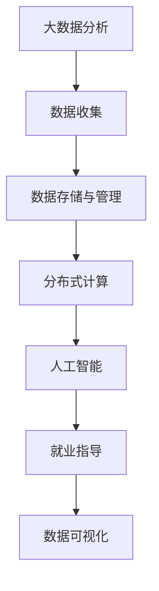
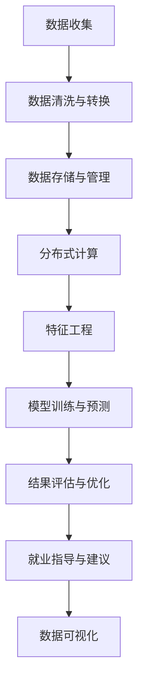

                 

# 基于分布式计算的大学生择业大数据分析

> 关键词：大学生择业, 分布式计算, 大数据分析, 人工智能, 就业指导, 未来趋势, 技术挑战

## 1. 背景介绍

### 1.1 问题由来
随着社会的快速发展和科技的不断进步，高校毕业生面临着日益激烈的就业竞争。选择适合自己的职业方向，不仅是毕业生个人发展的重要起点，也关系着社会的整体人力资源配置和经济发展。然而，大学生在择业过程中往往面临信息不对称、市场需求变化快、自我认知模糊等问题，亟需有效的就业指导和决策支持。

近年来，大数据技术和人工智能（AI）的迅猛发展为大学生择业提供了新的思路。通过大数据分析，可以从大量的就业数据中挖掘出有价值的信息，为学生提供个性化的就业指导和职业规划。而分布式计算技术的引入，则进一步提升了大数据处理的效率和可靠性，使得大规模就业数据的实时分析和预测成为可能。

### 1.2 问题核心关键点
1. **数据收集与处理**：从不同渠道收集大量与大学生择业相关的数据，包括就业需求、薪资水平、职业发展路径、行业趋势等。这些数据通常包含海量的文本、图片、视频等多种类型，需要进行清洗、转换和整合。
2. **数据存储与管理**：为保证数据的安全和高效存储，需要在分布式文件系统（如Hadoop HDFS）上构建高效的数据存储和管理系统。
3. **分布式计算与并行处理**：利用分布式计算平台（如Apache Spark）对大规模数据集进行高效计算和分析，提取有价值的就业信息和趋势。
4. **数据可视化和报告生成**：将分析结果通过数据可视化工具（如Tableau、Power BI）展示给用户，帮助他们进行决策。
5. **AI模型训练与优化**：利用机器学习算法（如随机森林、梯度提升树、神经网络等）对数据进行建模，预测就业趋势和职业发展前景，并通过模型调优提升准确性和效率。

### 1.3 问题研究意义
大学生择业大数据分析的研究具有重要意义：
1. **提升就业质量**：通过精准的就业数据分析，帮助学生了解市场需求和趋势，提高就业匹配度和满意度。
2. **优化教育资源**：为教育部门提供科学的数据支撑，优化课程设置和职业培训，提升高校就业指导的针对性和实效性。
3. **促进就业公平**：帮助不同背景的学生平等获取就业信息和指导，缩小就业差距，促进社会公平。
4. **推动产业发展**：结合就业数据分析结果，为企业提供人才需求预测和人才规划建议，促进产业发展。

## 2. 核心概念与联系

### 2.1 核心概念概述

在进行基于分布式计算的大学生择业大数据分析时，涉及到多个核心概念，包括但不限于：

- **大数据分析**：通过对大规模数据集进行收集、存储、处理和分析，从其中挖掘出有价值的信息和知识。
- **分布式计算**：利用多台计算机并行处理任务，提升计算效率和可靠性，适用于处理海量数据。
- **人工智能**：利用机器学习、深度学习等技术，通过数据训练模型，实现对数据的高效分析和预测。
- **就业指导**：提供个性化的就业建议和职业规划，帮助学生做出合适的职业选择。
- **数据可视化**：将分析结果以图表、报表等形式直观展示，便于理解和决策。

这些概念通过一个Mermaid流程图展示如下：



### 2.2 概念间的关系

在基于分布式计算的大学生择业大数据分析过程中，这些核心概念相互依赖，形成一个完整的分析系统。

- **数据收集与处理**是基础，保证了分析的数据源质量。
- **数据存储与管理**保证了数据的安全和高效访问。
- **分布式计算**提供了高效的数据处理能力，适用于处理大规模数据集。
- **人工智能**通过机器学习算法对数据进行建模，提取有价值的信息和趋势。
- **就业指导**利用分析结果，提供个性化的就业建议和职业规划。
- **数据可视化**通过直观展示分析结果，帮助用户理解和决策。

这个流程可以被进一步细化为一个多级流程图：



## 3. 核心算法原理 & 具体操作步骤
### 3.1 算法原理概述

基于分布式计算的大学生择业大数据分析主要依赖以下算法和原理：

- **分布式存储与处理**：利用Hadoop HDFS和Apache Spark等分布式框架，实现数据的存储和管理，同时进行高效的数据处理和计算。
- **特征工程**：从原始数据中提取有意义的特征，供后续机器学习模型使用。
- **机器学习与深度学习**：利用随机森林、梯度提升树、神经网络等算法，对数据进行建模和预测。
- **自然语言处理（NLP）**：用于处理文本数据，提取情感、主题等重要信息。
- **推荐系统**：通过协同过滤、内容推荐等算法，推荐合适的职业和岗位。

### 3.2 算法步骤详解

1. **数据收集与预处理**：
   - 收集与大学生择业相关的数据，包括就业市场需求、行业薪资水平、职业发展路径等。
   - 清洗和转换数据，去除噪声和异常值，保证数据质量。
   - 使用分布式存储系统（如HDFS）存储数据，确保数据的可靠性和可扩展性。

2. **分布式计算与并行处理**：
   - 使用Apache Spark等分布式计算平台，对大规模数据集进行并行处理和计算。
   - 利用Spark的RDD（弹性分布式数据集）和DataFrame API，实现高效的数据处理和计算。

3. **特征工程**：
   - 从原始数据中提取有意义的特征，如职业相关性、行业发展趋势、技能需求等。
   - 使用特征选择算法（如卡方检验、互信息等）优化特征集，减少噪声特征。
   - 利用NLP技术提取文本数据中的情感、主题等信息，供模型使用。

4. **机器学习与深度学习模型训练**：
   - 选择合适的机器学习算法（如随机森林、梯度提升树等），对特征数据进行建模。
   - 利用深度学习算法（如卷积神经网络、循环神经网络等），对文本数据进行建模和预测。
   - 使用交叉验证等方法评估模型性能，并进行模型调优。

5. **结果评估与优化**：
   - 对模型预测结果进行评估，使用准确率、召回率、F1分数等指标衡量模型性能。
   - 使用数据可视化工具（如Tableau、Power BI等），将分析结果以图表、报表等形式展示。
   - 根据评估结果进行模型调优，提升模型的准确性和泛化能力。

### 3.3 算法优缺点

**优点**：
- **高效性**：利用分布式计算平台，处理大规模数据集高效可靠。
- **可扩展性**：分布式系统可轻松扩展，适应不断增长的数据量。
- **灵活性**：支持多种数据源和处理方式，适应不同业务需求。
- **准确性**：机器学习模型能够从数据中挖掘出有价值的趋势和模式，提供精准的就业建议。

**缺点**：
- **复杂性**：分布式系统和机器学习模型设计复杂，需要较高的技术水平。
- **成本高**：大规模数据处理和模型训练需要高性能计算资源和存储空间。
- **数据隐私**：处理个人数据时，需要遵守相关法律法规，保护用户隐私。
- **解释性差**：机器学习模型往往是"黑箱"，难以解释其内部决策过程。

### 3.4 算法应用领域

基于分布式计算的大学生择业大数据分析可应用于多个领域，包括但不限于：

- **就业指导与咨询**：为高校提供科学的就业数据分析支持，优化就业指导和职业规划。
- **企业人才管理**：为企业提供人才需求预测和人才规划建议，促进产业发展。
- **公共政策制定**：为政府部门提供就业市场动态分析，优化人才政策和人力资源配置。
- **教育资源优化**：为教育部门提供科学的数据支撑，优化课程设置和职业培训。
- **个性化推荐系统**：通过协同过滤、内容推荐等算法，推荐合适的职业和岗位。

## 4. 数学模型和公式 & 详细讲解 & 举例说明

### 4.1 数学模型构建

基于分布式计算的大学生择业大数据分析主要依赖以下数学模型：

- **线性回归模型**：用于预测薪资水平和职业发展趋势。
- **决策树与随机森林**：用于分析职业选择和行业趋势。
- **深度学习模型（如CNN、RNN等）**：用于处理文本数据，提取情感和主题信息。
- **协同过滤与推荐算法**：用于推荐合适的职业和岗位。

### 4.2 公式推导过程

以线性回归模型为例，假设有一个线性回归模型 $y = \beta_0 + \beta_1 x_1 + \beta_2 x_2 + \cdots + \beta_n x_n$，其中 $y$ 为预测的薪资水平，$x_1, x_2, \cdots, x_n$ 为特征，$\beta_0, \beta_1, \beta_2, \cdots, \beta_n$ 为模型参数。

线性回归模型的最小二乘法优化目标为：

$$
\min_{\beta_0, \beta_1, \beta_2, \cdots, \beta_n} \sum_{i=1}^{m} (y_i - (\beta_0 + \beta_1 x_{1,i} + \beta_2 x_{2,i} + \cdots + \beta_n x_{n,i}))^2
$$

其中 $m$ 为样本数量，$(y_i, x_{1,i}, x_{2,i}, \cdots, x_{n,i})$ 为第 $i$ 个样本的输入和输出。

对上述目标函数求导，得到：

$$
\frac{\partial \mathcal{L}(\beta)}{\partial \beta_j} = -2 \sum_{i=1}^{m} (y_i - (\beta_0 + \beta_1 x_{1,i} + \beta_2 x_{2,i} + \cdots + \beta_n x_{n,i})) x_{j,i}
$$

利用梯度下降等优化算法，不断更新模型参数，最小化损失函数，最终得到最优参数 $\hat{\beta}$。

### 4.3 案例分析与讲解

以一个简单的案例来说明基于分布式计算的大学生择业大数据分析过程：

1. **数据收集与预处理**：
   - 从互联网招聘网站收集大量招聘信息，包括岗位名称、公司、薪资、职位描述等。
   - 清洗数据，去除噪声和异常值，如拼写错误、缺失值等。
   - 使用HDFS存储清洗后的数据，确保数据的可靠性和可扩展性。

2. **分布式计算与并行处理**：
   - 使用Apache Spark对大规模数据集进行并行处理和计算。
   - 将数据集划分为多个RDD，并行执行特征提取和模型训练。

3. **特征工程**：
   - 提取有意义的特征，如职位名称、公司规模、薪资水平等。
   - 使用卡方检验和互信息等方法选择重要特征，减少噪声特征。
   - 利用NLP技术提取文本数据中的情感、主题等信息，供模型使用。

4. **机器学习与深度学习模型训练**：
   - 选择随机森林算法，对特征数据进行建模。
   - 利用深度学习算法（如CNN）对文本数据进行建模和预测。
   - 使用交叉验证等方法评估模型性能，并进行模型调优。

5. **结果评估与优化**：
   - 对模型预测结果进行评估，使用准确率、召回率、F1分数等指标衡量模型性能。
   - 使用Tableau等数据可视化工具，将分析结果以图表、报表等形式展示。
   - 根据评估结果进行模型调优，提升模型的准确性和泛化能力。

## 5. 项目实践：代码实例和详细解释说明

### 5.1 开发环境搭建

在进行基于分布式计算的大学生择业大数据分析时，需要搭建一个完整的开发环境。以下是基本的开发环境搭建步骤：

1. **安装Hadoop**：从Hadoop官网下载适合当前操作系统的安装包，并进行安装。
2. **安装Spark**：在Hadoop的基础上安装Apache Spark，并启动Spark集群。
3. **安装Python环境**：安装Python 3.x和必要的依赖库，如NumPy、SciPy、Pandas等。
4. **安装Spark MLlib**：安装Spark MLlib库，用于机器学习算法实现。
5. **安装可视化工具**：安装Tableau或Power BI等数据可视化工具。

### 5.2 源代码详细实现

以下是一个简单的基于Spark的大学生择业大数据分析的Python代码实现：

```python
from pyspark.sql import SparkSession
from pyspark.ml.feature import VectorAssembler
from pyspark.ml.classification import RandomForestClassifier
from pyspark.ml.evaluation import BinaryClassificationEvaluator

# 创建SparkSession
spark = SparkSession.builder.appName("CollegeGraduateCareerAnalysis").getOrCreate()

# 读取数据集
df = spark.read.csv("data.csv", header=True, inferSchema=True)

# 数据清洗与预处理
df = df.dropna()
df = df.drop("UnemploymentRate", axis=1)

# 特征工程
assembler = VectorAssembler(inputCols=["CompanySize", "JobRole", "Industry"], outputCol="Features")
df = assembler.transform(df)

# 训练模型
rf = RandomForestClassifier(featuresCol="Features", labelCol="JobOffered")
model = rf.fit(df)

# 预测并评估模型
predictions = model.transform(df)
evaluator = BinaryClassificationEvaluator(rawPredictionCol="prediction", labelCol="JobOffered", metricName="areaUnderROC")
auc = evaluator.evaluate(predictions)
print("AUC: ", auc)
```

### 5.3 代码解读与分析

上述代码实现了一个基于Spark的大学生择业大数据分析过程。以下是代码的详细解读：

1. **创建SparkSession**：创建SparkSession对象，并指定应用程序名称。
2. **读取数据集**：使用Spark的`read.csv`方法读取数据集，并进行基本的数据清洗和预处理，如去除缺失值。
3. **特征工程**：使用`VectorAssembler`将多个特征组合成一个向量，用于后续机器学习建模。
4. **训练模型**：使用`RandomForestClassifier`对特征数据进行建模。
5. **预测并评估模型**：对数据集进行预测，并使用`BinaryClassificationEvaluator`评估模型性能，输出AUC值。

## 6. 实际应用场景

### 6.1 智能就业指导平台

基于分布式计算的大学生择业大数据分析可以应用于智能就业指导平台，为学生提供个性化的就业建议和职业规划。具体应用如下：

1. **数据收集与预处理**：收集学生的简历、兴趣爱好、学术成绩等数据，并进行清洗和预处理。
2. **分布式计算与并行处理**：利用Spark对大规模数据集进行并行处理和计算，提取有价值的就业信息和趋势。
3. **特征工程**：从原始数据中提取有意义的特征，如学生的技能水平、兴趣爱好等。
4. **机器学习与深度学习模型训练**：利用机器学习算法对特征数据进行建模，预测学生的职业发展前景和推荐适合的职业。
5. **结果展示与建议**：将分析结果以图表、报表等形式展示，并结合职业发展建议，提供个性化的就业指导。

### 6.2 企业人才管理系统

基于分布式计算的大学生择业大数据分析还可以应用于企业人才管理系统，为企业提供人才需求预测和人才规划建议。具体应用如下：

1. **数据收集与预处理**：收集企业的招聘信息、员工绩效、培训记录等数据，并进行清洗和预处理。
2. **分布式计算与并行处理**：利用Spark对大规模数据集进行并行处理和计算，提取有价值的人才信息和发展趋势。
3. **特征工程**：从原始数据中提取有意义的特征，如岗位需求、员工技能、培训效果等。
4. **机器学习与深度学习模型训练**：利用机器学习算法对特征数据进行建模，预测人才需求和职业发展前景，并推荐合适的培训和发展计划。
5. **结果展示与优化**：将分析结果以图表、报表等形式展示，并结合优化建议，帮助企业制定人才战略。

### 6.3 政府就业市场分析

基于分布式计算的大学生择业大数据分析还可以应用于政府就业市场分析，为政策制定提供科学的数据支持。具体应用如下：

1. **数据收集与预处理**：收集就业市场的宏观经济数据、行业发展趋势、岗位需求等数据，并进行清洗和预处理。
2. **分布式计算与并行处理**：利用Spark对大规模数据集进行并行处理和计算，提取有价值的就业市场信息和发展趋势。
3. **特征工程**：从原始数据中提取有意义的特征，如行业需求、岗位薪资、职业发展前景等。
4. **机器学习与深度学习模型训练**：利用机器学习算法对特征数据进行建模，预测就业市场的发展趋势，并提出政策建议。
5. **结果展示与优化**：将分析结果以图表、报表等形式展示，并结合政策建议，优化就业市场和人才政策。

## 7. 工具和资源推荐

### 7.1 学习资源推荐

为了帮助开发者系统掌握基于分布式计算的大学生择业大数据分析的理论基础和实践技巧，这里推荐一些优质的学习资源：

1. **Hadoop官方文档**：从Hadoop官网下载最新版本的官方文档，学习Hadoop的架构、配置和使用方法。
2. **Apache Spark官方文档**：从Apache官网下载最新版本的官方文档，学习Spark的API和应用场景。
3. **Python机器学习**：Python中的Scikit-learn、TensorFlow等机器学习库的官方文档和在线教程。
4. **数据可视化工具**：Tableau、Power BI等数据可视化工具的官方文档和在线教程。
5. **机器学习课程**：Coursera、Udacity等在线学习平台的机器学习课程，涵盖各种机器学习算法和实现。

### 7.2 开发工具推荐

在进行基于分布式计算的大学生择业大数据分析时，需要借助多种开发工具和平台。以下是推荐的工具列表：

1. **Hadoop**：用于大规模数据存储和处理。
2. **Apache Spark**：用于分布式计算和并行处理。
3. **Python**：用于数据分析和机器学习模型的实现。
4. **Tableau**：用于数据可视化和报表生成。
5. **Power BI**：用于数据可视化和商业智能。

### 7.3 相关论文推荐

基于分布式计算的大学生择业大数据分析领域的研究进展日新月异，以下是几篇具有代表性的论文推荐：

1. **大规模分布式数据分析**：《Large-Scale Data Analysis with Hadoop》，讲述Hadoop在大规模数据分析中的应用。
2. **Spark大数据处理**：《Spark: Cluster Computing with Machine Memory》，介绍Spark的基本概念和实现原理。
3. **机器学习与深度学习**：《Deep Learning》，讲述深度学习算法的基本原理和应用。
4. **就业市场分析**：《Understanding the Labor Market: Trends and Analysis》，探讨就业市场的发展趋势和政策建议。

## 8. 总结：未来发展趋势与挑战

### 8.1 研究成果总结

基于分布式计算的大学生择业大数据分析在多个应用领域展示了其强大的数据处理和分析能力，为大学生就业指导、企业人才管理、政府政策制定等提供了科学的决策支持。通过大规模数据处理和机器学习模型训练，能够提取有价值的就业信息和趋势，提升就业匹配度和满意度，优化教育资源和产业发展。

### 8.2 未来发展趋势

展望未来，基于分布式计算的大学生择业大数据分析将呈现以下几个发展趋势：

1. **数据质量提升**：随着数据采集和清洗技术的进步，数据质量将进一步提升，分析结果更加精准可靠。
2. **模型优化与创新**：新的机器学习算法和深度学习模型不断涌现，进一步提升模型性能和泛化能力。
3. **多模态数据融合**：结合文本、图像、视频等多种数据源，提升数据的多维度和丰富性。
4. **实时分析和预测**：利用流式处理技术，实现实时数据分析和预测，提升应用的时效性。
5. **个性化推荐系统**：通过协同过滤、内容推荐等算法，提供更精准的职业和岗位推荐。

### 8.3 面临的挑战

尽管基于分布式计算的大学生择业大数据分析在多个应用领域取得了显著进展，但仍面临诸多挑战：

1. **数据隐私和安全**：处理个人数据时，需要遵守相关法律法规，保护用户隐私。
2. **模型解释性和透明度**：机器学习模型往往是"黑箱"，难以解释其内部决策过程。
3. **计算资源限制**：大规模数据处理和模型训练需要高性能计算资源和存储空间。
4. **模型优化难度大**：优化大规模分布式系统的性能和稳定性，需要大量的实验和调优工作。
5. **数据质量不稳定**：数据采集和清洗过程中可能存在噪声和异常值，影响分析结果。

### 8.4 研究展望

未来，基于分布式计算的大学生择业大数据分析需要从以下几个方面进行深入研究：

1. **数据采集与预处理技术**：提升数据采集和清洗效率，保证数据的质量和完整性。
2. **分布式系统优化**：优化分布式计算系统的性能和稳定性，提高数据处理和分析的效率。
3. **机器学习模型创新**：开发新的机器学习算法和深度学习模型，提升模型的性能和泛化能力。
4. **模型解释性和透明度**：探索模型解释性和透明度的提升方法，增强模型的可解释性。
5. **多模态数据融合**：结合文本、图像、视频等多种数据源，提升数据的多维度和丰富性。
6. **实时分析和预测**：利用流式处理技术，实现实时数据分析和预测，提升应用的时效性。
7. **个性化推荐系统**：通过协同过滤、内容推荐等算法，提供更精准的职业和岗位推荐。

总之，基于分布式计算的大学生择业大数据分析将在未来的技术创新和应用实践中，不断突破瓶颈，提升就业指导和职业规划的科学性和精准度，为大学生、企业、政府等各方提供更有价值的决策支持。

## 9. 附录：常见问题与解答

### Q1: 如何使用分布式计算处理大规模数据？

A: 使用Apache Hadoop和Apache Spark等分布式计算平台，将大规模数据集划分为多个小的数据块，并行处理和计算。具体步骤如下：

1. 安装Hadoop和Spark环境。
2. 将数据集上传至HDFS。
3. 使用Spark API进行数据处理和计算。
4. 利用Spark的RDD和DataFrame API，实现高效的分布式计算。

### Q2: 如何提高模型的解释性和透明度？

A: 提高模型的解释性和透明度是当前AI研究的一个重要方向。以下是几种常用的方法：

1. 可解释性算法：选择可解释性较强的模型，如决策树、线性回归等。
2. 特征重要性分析：使用特征重要性评估方法，如卡方检验、互信息等，找出对模型预测有较大影响的特征。
3. 模型可视化：使用可视化工具（如SHAP、LIME等）展示模型的决策过程，帮助理解模型的内部机制。
4. 模型融合：将多个模型的预测结果进行融合，提升模型的可解释性和稳定性。

### Q3: 如何保护用户数据隐私？

A: 保护用户数据隐私是分布式计算和大数据分析中的一个重要问题。以下是几种常用的方法：

1. 数据匿名化：在数据处理和分析过程中，对用户数据进行匿名化处理，防止个人信息泄露。
2. 数据加密：对敏感数据进行加密处理，确保数据传输和存储的安全性。
3. 访问控制：设置严格的数据访问权限，确保只有授权人员才能访问敏感数据。
4. 合规审查：定期进行数据合规审查，确保符合相关法律法规的要求。

通过这些方法，可以有效地保护用户数据隐私，确保数据分析的合法性和安全性。

总之，基于分布式计算的大学生择业大数据分析是一个复杂且重要的领域，涉及数据处理、分布式计算、机器学习等多个技术方向。未来，随着技术的不断进步和应用场景的不断拓展，这一领域将展现出更加广阔的前景和无限的可能性。

