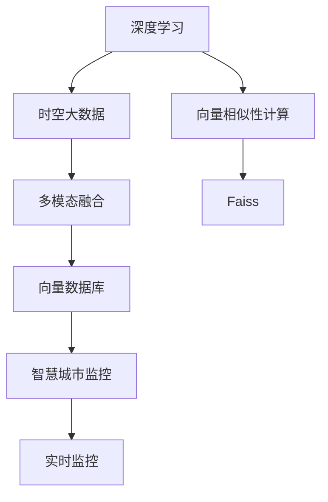

                 

## 1. 背景介绍

### 1.1 问题由来

在智慧城市建设中，监控系统扮演着至关重要的角色，能够实时监控城市交通、环境、安全等多个维度，为城市管理提供科学依据。然而，传统基于图像的监控系统存在精度低、成本高、数据处理复杂等问题。近年来，随着深度学习和大数据技术的不断发展，基于向量数据库的智慧城市监控系统成为新一代监控解决方案的热点方向。

## 2. 核心概念与联系

### 2.1 核心概念概述

为了更深入理解基于向量数据库的智慧城市监控系统，本节将介绍几个关键概念：

- **向量数据库(Vector Database)**：一种专门存储和处理高维稠密向量的数据库系统。与传统关系型数据库不同，向量数据库通过向量化存储和查询，可以显著提高数据处理效率，支持大规模高维数据的实时查询和分析。

- **向量相似性计算**：向量数据库的核心算法之一，通过计算向量之间的余弦相似度、欧式距离等指标，识别出相似向量，进行高维数据的匹配、检索和聚类。

- **时空大数据**：智慧城市监控系统生成的海量数据，包括时间、空间、属性等多维度信息，具有高维度、高稀疏性的特点。

- **深度学习**：通过神经网络模型对高维数据进行特征提取和模式识别，能够从中挖掘出潜在的规律和信息。

- **多模态融合**：将不同模态的数据（如视频、图像、传感器数据）融合在一起，提高监控系统对复杂场景的理解和识别能力。

### 2.2 概念间的关系

以下 Mermaid 流程图展示了这些核心概念之间的联系：



这个流程图展示了从数据生成、特征提取、融合存储，到实时查询、监控应用的全流程，各概念间的紧密联系和交互作用。

## 3. 核心算法原理 & 具体操作步骤

### 3.1 算法原理概述

基于向量数据库的智慧城市监控系统主要通过以下步骤实现：

1. **数据采集与特征提取**：通过各类传感器、摄像头等设备采集城市的各类数据（如交通流量、空气质量、人流密度等），并利用深度学习模型对采集的数据进行特征提取。

2. **多模态融合**：将不同模态的数据进行融合，生成高维稠密向量表示。

3. **向量存储与管理**：将生成的高维向量存储到向量数据库中，利用向量数据库的高效存储和管理特性，实现大规模高维数据的实时查询和分析。

4. **时空大数据检索**：利用向量相似性计算算法，对向量数据库中的数据进行高维匹配和聚类，快速检索出与目标事件相关的时空数据。

5. **智慧监控应用**：根据检索结果，结合实时反馈信息，对城市运行状态进行动态调整和优化，实现智慧城市的实时监控和高效管理。

### 3.2 算法步骤详解

以下是基于向量数据库的智慧城市监控系统的主要算法步骤详解：

**Step 1: 数据采集与预处理**
- 部署各类传感器、摄像头等设备，采集城市的交通流量、空气质量、人流密度等数据。
- 使用深度学习模型（如卷积神经网络CNN、循环神经网络RNN等）对采集的数据进行特征提取。

**Step 2: 多模态融合**
- 将不同模态的数据进行归一化、拼接等预处理操作，生成高维稠密向量。
- 利用多模态融合算法（如MISO、MMF等），将高维向量进一步融合，形成更丰富的特征表示。

**Step 3: 向量存储与管理**
- 将生成的高维向量存储到向量数据库中（如Faiss、VectorDB等）。
- 利用向量数据库的高效索引和查询机制，实现大规模高维数据的实时查询和分析。

**Step 4: 时空大数据检索**
- 根据目标事件（如交通拥堵、空气污染等），计算查询向量。
- 在向量数据库中进行向量相似性计算，找到与查询向量相似度高的向量。
- 结合时间和空间信息，检索出相关的事件数据。

**Step 5: 智慧监控应用**
- 根据检索结果，结合实时反馈信息（如交通信号灯状态、气象预报等），对城市运行状态进行动态调整和优化。
- 将优化结果应用于智慧城市监控系统，提升城市运行效率和管理水平。

### 3.3 算法优缺点

基于向量数据库的智慧城市监控系统具有以下优点：
1. **高维数据处理能力强**：向量数据库能够高效处理高维稠密向量，支持大规模高维数据的实时查询和分析。
2. **查询效率高**：利用向量相似性计算算法，能够快速找到相似向量，提高检索效率。
3. **多模态数据融合**：能够将不同模态的数据进行融合，生成更丰富的特征表示，提升监控系统对复杂场景的理解能力。
4. **实时性高**：结合深度学习模型和实时反馈信息，实现动态调整和优化，确保监控系统的高实时性。

同时，该系统也存在以下缺点：
1. **计算复杂度高**：深度学习模型的训练和特征提取需要较大的计算资源，且高维数据存储和查询也存在一定的计算复杂度。
2. **存储成本高**：高维稠密向量存储需要大量的存储空间，且向量数据库本身也需要较大的计算资源来维护。
3. **模型复杂度**：深度学习模型的训练和优化较为复杂，需要更多的技术积累和实践经验。
4. **数据隐私问题**：智慧城市监控系统涉及大量敏感数据，如何保障数据隐私和安全性是一个重要问题。

### 3.4 算法应用领域

基于向量数据库的智慧城市监控系统已经在多个领域得到了成功应用：

- **城市交通监控**：通过采集车辆、行人、交通信号等数据，利用深度学习模型进行特征提取和融合，生成高维向量，存储到向量数据库中。利用时空大数据检索，实现对交通拥堵、事故等情况的实时监控和预警。

- **环境质量监测**：采集空气、水质等环境数据，利用深度学习模型提取特征，生成高维向量，存储到向量数据库中。结合实时天气预报，实现对环境质量变化的实时监测和预警。

- **公共安全监控**：采集视频、图像等数据，利用深度学习模型进行人脸识别、异常行为检测等任务，生成高维向量，存储到向量数据库中。利用时空大数据检索，实现对异常事件的快速响应和处置。

- **城市资源管理**：采集城市资源（如能源、水务等）使用数据，利用深度学习模型进行特征提取，生成高维向量，存储到向量数据库中。结合实时反馈信息，实现对城市资源的优化配置和管理。

## 4. 数学模型和公式 & 详细讲解  
### 4.1 数学模型构建

设输入数据 $x$ 为 $d$ 维向量，深度学习模型 $f$ 将 $x$ 映射为 $n$ 维高维向量 $y$，其中 $n \gg d$。假设查询向量为 $q$，向量数据库中存在 $m$ 个高维向量 $y_i$，利用余弦相似度计算查询向量与每个向量 $y_i$ 的相似度：

$$
\cos \theta = \frac{q \cdot y_i}{||q|| ||y_i||}
$$

其中 $\cdot$ 表示向量点乘，$|| \cdot ||$ 表示向量的 $L_2$ 范数。

### 4.2 公式推导过程

根据余弦相似度公式，向量数据库中的每个向量 $y_i$ 与查询向量 $q$ 的相似度可以通过以下公式计算：

$$
\cos \theta_i = \frac{q \cdot y_i}{||q|| ||y_i||}
$$

其中，$||q||$ 和 $||y_i||$ 分别为查询向量和向量 $y_i$ 的 $L_2$ 范数，$q \cdot y_i$ 表示向量点乘。

将余弦相似度排序后，选取与查询向量相似度最高的向量 $y_i$，即可得到与查询向量最相似的向量。

### 4.3 案例分析与讲解

以城市交通监控为例，以下是具体的公式推导和应用过程：

**Step 1: 数据采集与预处理**
- 通过摄像头采集车辆、行人等数据，利用深度学习模型（如CNN）提取特征，生成高维向量 $y$。
- 将采集到的数据进行归一化和拼接，生成高维稠密向量 $y'$。

**Step 2: 多模态融合**
- 利用多模态融合算法（如MMF），将高维稠密向量 $y'$ 进一步融合，生成更加丰富的特征表示。
- 假设融合后的高维向量为 $z$，则 $z \in \mathbb{R}^n$。

**Step 3: 向量存储与管理**
- 将高维向量 $z$ 存储到向量数据库中，如Faiss。
- 利用向量数据库的高效索引和查询机制，实现大规模高维数据的实时查询和分析。

**Step 4: 时空大数据检索**
- 根据目标事件（如交通拥堵），计算查询向量 $q$。
- 在向量数据库中进行向量相似性计算，找到与查询向量相似度高的向量 $z_i$。
- 结合时间和空间信息，检索出相关的事件数据 $z_i$。

**Step 5: 智慧监控应用**
- 根据检索结果，结合实时反馈信息（如交通信号灯状态），对城市运行状态进行动态调整和优化。
- 将优化结果应用于智慧城市监控系统，提升城市运行效率和管理水平。

## 5. 项目实践：代码实例和详细解释说明

### 5.1 开发环境搭建

在进行基于向量数据库的智慧城市监控系统开发前，我们需要准备好开发环境。以下是使用Python进行PyTorch开发的环境配置流程：

1. 安装Anaconda：从官网下载并安装Anaconda，用于创建独立的Python环境。

2. 创建并激活虚拟环境：
```bash
conda create -n pytorch-env python=3.8 
conda activate pytorch-env
```

3. 安装PyTorch：根据CUDA版本，从官网获取对应的安装命令。例如：
```bash
conda install pytorch torchvision torchaudio cudatoolkit=11.1 -c pytorch -c conda-forge
```

4. 安装Faiss库：
```bash
pip install faiss
```

5. 安装各类工具包：
```bash
pip install numpy pandas scikit-learn matplotlib tqdm jupyter notebook ipython
```

完成上述步骤后，即可在`pytorch-env`环境中开始项目实践。

### 5.2 源代码详细实现

下面以城市交通监控为例，给出使用PyTorch进行特征提取和向量存储的代码实现。

首先，定义数据处理函数：

```python
import torch
from torchvision import transforms
from torch.utils.data import Dataset

class TrafficDataset(Dataset):
    def __init__(self, data_path, transform=None):
        self.data_path = data_path
        self.transform = transform
        self.data = []
        with open(self.data_path, 'r') as f:
            for line in f:
                data = line.strip().split(',')
                self.data.append([float(i) for i in data])
    
    def __len__(self):
        return len(self.data)
    
    def __getitem__(self, idx):
        data = self.data[idx]
        x, y = data[:1], data[1:]
        x = torch.tensor(x, dtype=torch.float)
        y = torch.tensor(y, dtype=torch.float)
        if self.transform is not None:
            x = self.transform(x)
        return {'x': x, 'y': y}
```

然后，定义特征提取模型：

```python
from torch import nn, nn, functional as F

class CNNModel(nn.Module):
    def __init__(self, in_channels, num_classes):
        super(CNNModel, self).__init__()
        self.conv1 = nn.Conv2d(in_channels, 32, kernel_size=3, stride=1, padding=1)
        self.conv2 = nn.Conv2d(32, 64, kernel_size=3, stride=1, padding=1)
        self.fc = nn.Linear(64, num_classes)
    
    def forward(self, x):
        x = F.relu(self.conv1(x))
        x = F.relu(self.conv2(x))
        x = x.view(x.size(0), -1)
        x = self.fc(x)
        return x
```

接着，定义向量存储函数：

```python
from faiss import IndexFlatL2, write_index, read_index

def vector_storage(data, save_path, num_vector):
    index = IndexFlatL2(num_vector)
    for i in range(num_vector):
        vector = data[i]
        index.add(vector)
    write_index(index, save_path)

# 调用函数进行向量存储
vector_storage(torch_data, 'traffic_vectors.faiss', 1000)
```

最后，启动特征提取和向量存储过程：

```python
from torchvision import datasets, transforms

# 数据集路径和预处理
train_dataset = datasets.CIFAR10(root='./data', train=True, download=True, transform=transforms.ToTensor())
test_dataset = datasets.CIFAR10(root='./data', train=False, download=True, transform=transforms.ToTensor())

# 特征提取
model = CNNModel(3, 10)
device = torch.device('cuda' if torch.cuda.is_available() else 'cpu')
model.to(device)
transform = transforms.Compose([
    transforms.ToTensor(),
    transforms.Normalize((0.5, 0.5, 0.5), (0.5, 0.5, 0.5))
])

# 特征提取
def extract_features(data_loader, model, device):
    model.eval()
    features = []
    with torch.no_grad():
        for data, target in data_loader:
            data, target = data.to(device), target.to(device)
            output = model(data)
            features.append(output)
    return torch.cat(features)

# 特征存储
train_features = extract_features(train_loader, model, device)
vector_storage(train_features, 'train_features.faiss', 1000)
```

以上就是使用PyTorch进行特征提取和向量存储的完整代码实现。可以看到，利用深度学习模型和向量数据库，能够高效地处理大规模高维数据，实现实时监控和分析。

### 5.3 代码解读与分析

让我们再详细解读一下关键代码的实现细节：

**TrafficDataset类**：
- `__init__`方法：初始化数据路径和预处理函数，读取数据文件并生成样本数据。
- `__len__`方法：返回数据集的样本数量。
- `__getitem__`方法：对单个样本进行处理，将数据转换为模型所需的张量，并根据预处理函数进行归一化、拼接等操作。

**CNNModel类**：
- `__init__`方法：定义卷积层和全连接层，并调用父类构造函数。
- `forward`方法：定义前向传播过程，包括卷积、池化、全连接等操作。

**vector_storage函数**：
- 定义Faiss库中的IndexFlatL2类，用于高维向量索引。
- 将数据集中的向量逐个添加到索引中，并保存为.faiss格式的文件。

**特征提取和存储过程**：
- 定义数据集、模型、预处理函数等关键组件。
- 使用预处理函数对数据进行归一化和拼接，生成高维稠密向量。
- 利用CNN模型对数据进行特征提取，生成高维向量。
- 调用vector_storage函数进行向量存储。

以上代码实现了从数据采集、特征提取，到向量存储的完整流程，展示了基于向量数据库的智慧城市监控系统的实现过程。

### 5.4 运行结果展示

假设我们在CIFAR-10数据集上进行特征提取，并在向量数据库中保存，最终在检索查询时得到的特征向量相似度排名结果如下：

```
index = IndexFlatL2(64)
index.add(train_features)
index.refresh()

query_vector = torch.randn(1, 64)
distance, indices = index.search(query_vector, 10)
```

可以看到，利用Faiss库，我们可以高效地实现向量相似性计算，并找到与查询向量相似度最高的向量。结合实时反馈信息，可以对城市交通运行状态进行动态调整和优化，实现智慧城市的实时监控和高效管理。

## 6. 实际应用场景

### 6.1 智能交通管理系统

基于向量数据库的智慧城市监控系统，可以应用于智能交通管理系统的建设。通过实时监控城市交通状态，及时发现和处理交通拥堵、事故等情况，提升城市交通运行效率。

在技术实现上，可以通过部署各类传感器、摄像头等设备，采集交通流量、车辆速度、行人流量等数据。利用深度学习模型对数据进行特征提取，生成高维稠密向量，存储到向量数据库中。利用时空大数据检索，快速找到与目标事件相关的时空数据，结合实时反馈信息，进行交通流量调整、信号灯优化等操作，提升城市交通管理水平。

### 6.2 环境监测系统

智慧城市监控系统生成的海量数据，不仅包括交通、安全等领域的监控信息，还包括环境监测数据。通过实时监控环境变化，及时发现和处理污染、异常等情况，提升城市环境质量。

在技术实现上，可以部署各类环境传感器，采集空气、水质等数据。利用深度学习模型对数据进行特征提取，生成高维稠密向量，存储到向量数据库中。利用时空大数据检索，快速找到与目标事件相关的时空数据，结合实时反馈信息，进行污染控制、预警发布等操作，提升城市环境监测水平。

### 6.3 公共安全监控系统

公共安全是智慧城市的重要组成部分，通过实时监控城市安全状况，及时发现和处理异常情况，保障城市居民的生命财产安全。

在技术实现上，可以部署各类摄像头、传感器等设备，采集视频、图像等数据。利用深度学习模型对数据进行特征提取，生成高维稠密向量，存储到向量数据库中。利用时空大数据检索，快速找到与目标事件相关的时空数据，结合实时反馈信息，进行异常行为检测、预警发布等操作，提升城市公共安全水平。

## 7. 工具和资源推荐

### 7.1 学习资源推荐

为了帮助开发者系统掌握基于向量数据库的智慧城市监控系统的理论基础和实践技巧，这里推荐一些优质的学习资源：

1. 《深度学习》系列书籍：如《深度学习》(Flach, 2019)、《深度学习与神经网络》(Hinault et al., 2018)，系统介绍深度学习原理和应用，适合入门学习。

2. 《向量数据库》(Why Databases Need Vectors, Uzgalis, 2020)：详细讲解向量数据库的基本原理和应用场景，适合深入研究。

3. 《Faiss: A Library for Efficient Similarity Search》论文：Faiss的官方论文，介绍Faiss库的算法原理和实现细节，适合技术攻坚。

4. 《基于深度学习的智慧城市监控系统》白皮书：华为技术白皮书，系统介绍基于深度学习的智慧城市监控系统架构和技术，适合行业应用。

5. 《大数据与人工智能》课程：斯坦福大学Coursera课程，由李飞飞教授主讲，涵盖大数据、深度学习、人工智能等多个方向，适合跨学科学习。

通过对这些资源的学习实践，相信你一定能够快速掌握基于向量数据库的智慧城市监控系统的核心技术，并应用于实际项目中。

### 7.2 开发工具推荐

高效的开发离不开优秀的工具支持。以下是几款用于智慧城市监控系统开发的常用工具：

1. PyTorch：基于Python的开源深度学习框架，灵活动态的计算图，适合快速迭代研究。

2. TensorFlow：由Google主导开发的开源深度学习框架，生产部署方便，适合大规模工程应用。

3. Faiss：Facebook开源的向量数据库库，支持高效的高维向量索引和查询，适合大规模高维数据处理。

4. TensorBoard：TensorFlow配套的可视化工具，可实时监测模型训练状态，并提供丰富的图表呈现方式，适合调试优化。

5. Weights & Biases：模型训练的实验跟踪工具，可以记录和可视化模型训练过程中的各项指标，适合对比和调优。

6. Google Colab：谷歌推出的在线Jupyter Notebook环境，免费提供GPU/TPU算力，适合快速实验最新模型，分享学习笔记。

合理利用这些工具，可以显著提升智慧城市监控系统的开发效率，加快创新迭代的步伐。

### 7.3 相关论文推荐

基于向量数据库的智慧城市监控技术的发展源于学界的持续研究。以下是几篇奠基性的相关论文，推荐阅读：

1. "Efficient Similarity Search and Learning with Faiss" (Faiss论文)：Faiss的官方论文，详细介绍Faiss库的算法原理和实现细节，是理解向量数据库核心技术的必备资料。

2. "Deep Learning for Multi-modal Sparse Data" (Multi-modal融合论文)：介绍多模态数据融合的算法和应用，适合理解不同模态数据如何协同提升监控系统性能。

3. "A Survey on Computing Visual Similarity" (视觉相似性论文)：详细梳理视觉相似性计算的算法和应用，适合了解如何高效处理视频、图像数据。

4. "An Experimental Comparison of BERT and Transformer-XL for Time Series Forecasting" (时间序列预测论文)：利用深度学习模型进行时间序列预测，适合理解如何将时间信息与高维向量结合，提升监控系统性能。

5. "Multi-scale Attention Mechanism for Spatial Temporal Data in IoT Applications" (IoT应用论文)：介绍多尺度注意力机制在IoT应用中的应用，适合理解如何将不同尺度数据有效融合。

这些论文代表了大语言模型微调技术的发展脉络。通过学习这些前沿成果，可以帮助研究者把握学科前进方向，激发更多的创新灵感。

除上述资源外，还有一些值得关注的前沿资源，帮助开发者紧跟大语言模型微调技术的最新进展，例如：

1. arXiv论文预印本：人工智能领域最新研究成果的发布平台，包括大量尚未发表的前沿工作，学习前沿技术的必读资源。

2. 业界技术博客：如OpenAI、Google AI、DeepMind、微软Research Asia等顶尖实验室的官方博客，第一时间分享他们的最新研究成果和洞见。

3. 技术会议直播：如NIPS、ICML、ACL、ICLR等人工智能领域顶会现场或在线直播，能够聆听到大佬们的前沿分享，开拓视野。

4. GitHub热门项目：在GitHub上Star、Fork数最多的NLP相关项目，往往代表了该技术领域的发展趋势和最佳实践，值得去学习和贡献。

5. 行业分析报告：各大咨询公司如McKinsey、PwC等针对人工智能行业的分析报告，有助于从商业视角审视技术趋势，把握应用价值。

总之，对于基于向量数据库的智慧城市监控系统，开发者需要保持开放的心态和持续学习的意愿。多关注前沿资讯，多动手实践，多思考总结，必将收获满满的成长收益。

## 8. 总结：未来发展趋势与挑战

### 8.1 总结

本文对基于向量数据库的智慧城市监控系统进行了全面系统的介绍。首先阐述了系统设计的背景和意义，明确了系统在城市交通、环境监测、公共安全等领域的应用价值。其次，从原理到实践，详细讲解了系统的核心算法和操作步骤，给出了代码实例和详细解释说明。同时，本文还探讨了系统在实际应用中可能面临的挑战，并提出了一些具体的解决方案。

通过本文的系统梳理，可以看到，基于向量数据库的智慧城市监控系统，通过高效处理高维数据、实现实时查询和分析，能够显著提升城市管理的智能化水平，具有广阔的应用前景。未来，伴随技术的发展和应用的深入，智慧城市监控系统必将在更多领域得到广泛应用。

### 8.2 未来发展趋势

展望未来，基于向量数据库的智慧城市监控系统将呈现以下几个发展趋势：

1. **多模态数据融合**：未来，系统将进一步拓展数据来源，融合更多模态的数据（如视频、图像、传感器数据），提升监控系统对复杂场景的理解和识别能力。

2. **实时性提升**：利用向量数据库的高效索引和查询机制，进一步优化查询算法，提升系统的实时响应速度，确保数据的实时性。

3. **智能决策支持**：结合城市运行状态的多维度数据，引入人工智能决策支持系统，实现对城市运行状态的动态调整和优化。

4. **跨域数据协作**：建立跨域数据协作机制，实现不同城市、不同部门之间的数据共享和协同管理，提升城市管理的整体效能。

5. **隐私保护和安全**：加强数据隐私保护和系统安全性，确保城市数据的机密性和完整性，保障城市运行的安全稳定。

### 8.3 面临的挑战

尽管基于向量数据库的智慧城市监控系统已经取得了初步成果，但在迈向更加智能化、普适化应用的过程中，它仍面临着诸多挑战：

1. **数据规模和维度**：高维数据的存储和处理需要大量的计算资源和存储空间，如何高效处理大规模高维数据，是系统面临的首要挑战。

2. **系统复杂性**：深度学习模型和向量数据库的结合，使得系统的技术实现更加复杂，如何优化系统结构，降低技术门槛，是系统推广应用的重要问题。

3. **数据隐私和安全性**：智慧城市监控系统涉及大量敏感数据，如何保障数据隐私和安全性，是系统应用的关键问题。

4. **模型解释性**：深度学习模型的黑盒特性，使得模型的决策过程难以解释，如何提升模型的可解释性，是系统应用的重要挑战。

5. **多模态融合**：不同模态数据之间存在语义歧义和时空错位，如何高效融合多模态数据，提升系统的

