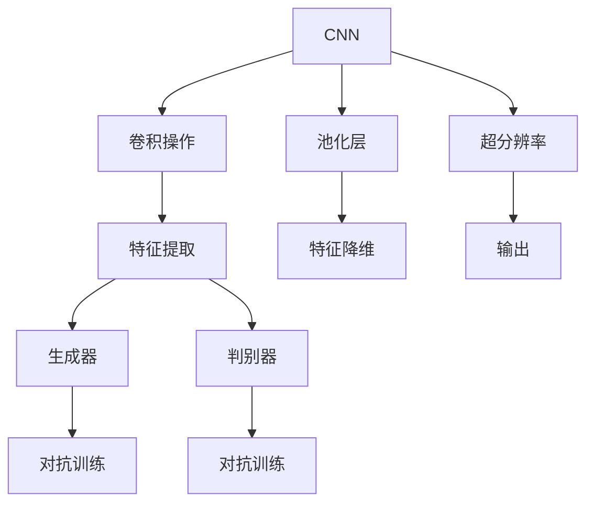
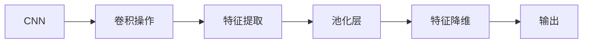
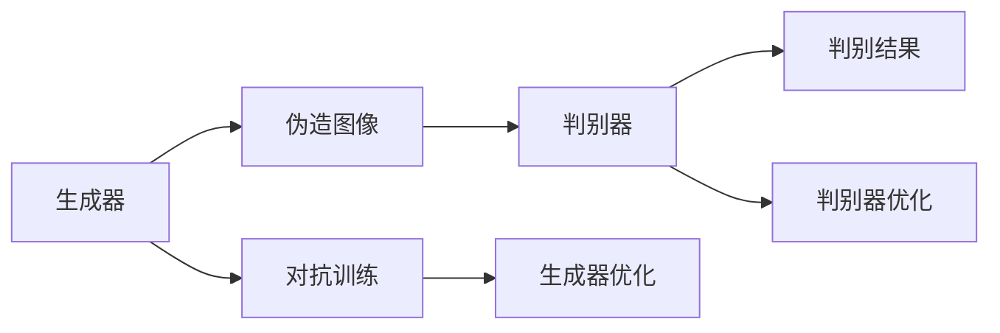
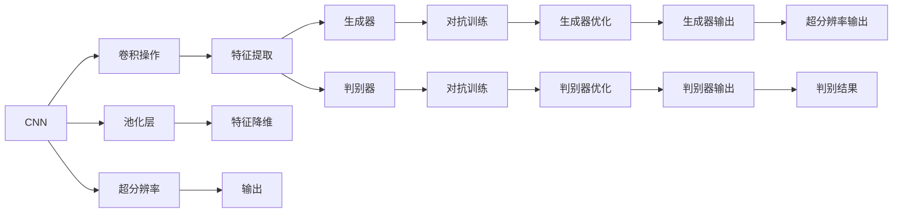
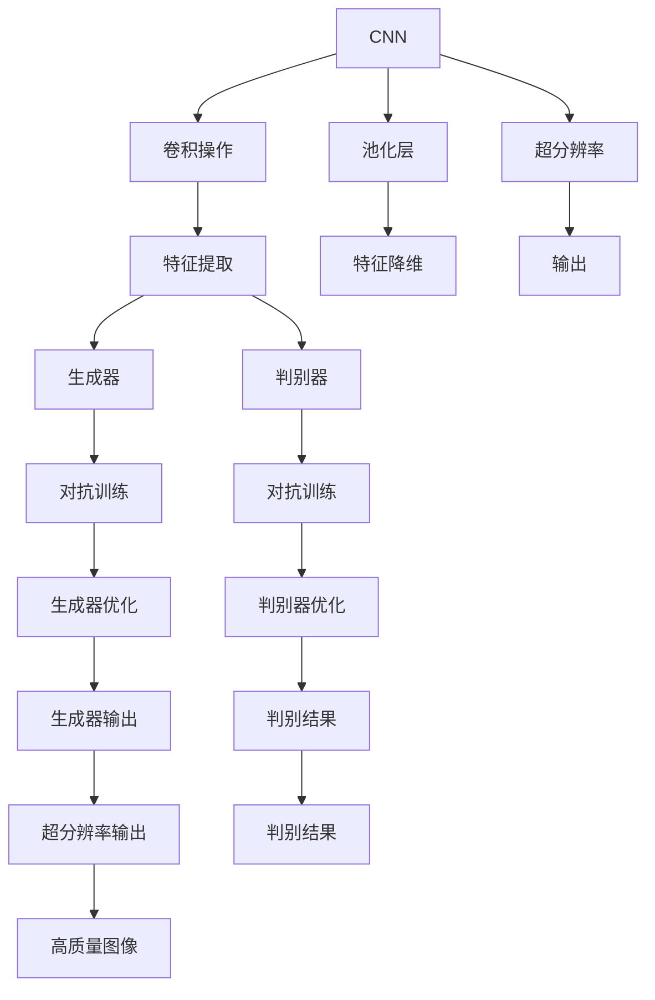

                 

# 基于对抗神经网络的图像超分辨率算法研究

> 关键词：图像超分辨率,对抗神经网络,深度学习,卷积神经网络(CNN),生成对抗网络(GAN),半监督学习,特征匹配,残差学习

## 1. 背景介绍

### 1.1 问题由来
图像超分辨率（Image Super-Resolution, ISR）是计算机视觉领域一个经典且具有挑战性的问题。其目标是将低分辨率图像通过模型提升为高分辨率图像，通常使用插值、滤波等传统方法，但这些方法无法充分利用图像的高频信息，且容易出现模糊和锯齿现象。而基于深度学习的超分辨率方法近年来迅速兴起，特别是卷积神经网络（Convolutional Neural Network, CNN）和生成对抗网络（Generative Adversarial Network, GAN）的结合，实现了显著的性能提升。

本文将聚焦于基于对抗神经网络（Neural Network对抗，Neural Network Adversarial, NNA）的图像超分辨率算法，研究对抗训练（Adversarial Training）对超分辨率精度的影响，同时探讨对抗神经网络在超分辨率中的优势和局限。

### 1.2 问题核心关键点
图像超分辨率是计算机视觉中一个重要的应用领域，近年来随着深度学习技术的发展，特别是卷积神经网络和生成对抗网络的结合，实现了对图像分辨率的显著提升。但由于数据集规模和质量的不确定性，模型的泛化能力仍然有限。本文旨在解决以下几个核心问题：
1. 如何通过对抗训练提高超分辨率模型的泛化能力？
2. 如何在对抗训练中平衡生成器（Generators）和判别器（Discriminators）的性能，以优化超分辨率效果？
3. 如何优化特征匹配和残差学习机制，进一步提升超分辨率精度？

## 2. 核心概念与联系

### 2.1 核心概念概述

为更好地理解基于对抗神经网络的图像超分辨率算法，本节将介绍几个密切相关的核心概念：

- 卷积神经网络（CNN）：一种深度神经网络结构，常用于图像处理任务。通过卷积操作提取图像特征，并通过池化层进行特征降维。
- 生成对抗网络（GAN）：由生成器（Generators）和判别器（Discriminators）两部分组成，通过对抗训练，生成器尝试生成与真实图像难以区分的伪造图像，而判别器则尝试区分真实图像和伪造图像。
- 图像超分辨率：将低分辨率图像通过模型提升为高分辨率图像。超分辨率算法包括传统方法如插值、滤波和基于深度学习的超分辨率方法。
- 对抗训练（Adversarial Training）：一种强化学习技术，通过不断优化生成器和判别器，使得生成器生成的图像难以被判别器识别为伪造。

这些核心概念之间的逻辑关系可以通过以下Mermaid流程图来展示：



这个流程图展示了CNN、GAN和超分辨率之间的逻辑关系：

1. CNN通过卷积和池化层提取图像特征。
2. 生成器和判别器构成GAN，通过对抗训练生成高分辨率图像。
3. 超分辨率算法基于CNN实现，通过特征提取和降维提高图像质量。

### 2.2 概念间的关系

这些核心概念之间存在着紧密的联系，形成了图像超分辨率算法的完整生态系统。下面我们通过几个Mermaid流程图来展示这些概念之间的关系。

#### 2.2.1 CNN的特征提取与降维



这个流程图展示了CNN的基本工作流程：通过卷积操作提取图像特征，再通过池化层降维，最终输出高维特征。

#### 2.2.2 GAN的对抗训练过程



这个流程图展示了GAN的基本对抗训练过程：生成器试图生成与真实图像难以区分的伪造图像，而判别器则尝试区分真实图像和伪造图像，两者通过对抗训练不断优化，最终生成高质量的超分辨率图像。

#### 2.2.3 对抗训练对超分辨率的影响



这个流程图展示了对抗训练在超分辨率中的作用：生成器生成的伪造图像通过判别器的训练优化，生成高质量的超分辨率图像。

### 2.3 核心概念的整体架构

最后，我们用一个综合的流程图来展示这些核心概念在大语言模型微调过程中的整体架构：



这个综合流程图展示了CNN、GAN和超分辨率之间的完整工作流程：

1. CNN通过卷积和池化层提取图像特征。
2. 生成器和判别器构成GAN，通过对抗训练生成高分辨率图像。
3. 超分辨率算法基于CNN实现，通过特征提取和降维提高图像质量。

这些核心概念共同构成了图像超分辨率算法的学习和应用框架，使得模型能够从低分辨率图像中恢复高质量的细节信息。

## 3. 核心算法原理 & 具体操作步骤
### 3.1 算法原理概述

基于对抗神经网络的图像超分辨率算法，本质上是一种结合了深度学习和对抗训练的图像生成方法。其核心思想是：通过对抗训练优化生成器和判别器，生成器尝试生成高分辨率图像，判别器则试图区分真实图像和伪造图像。在生成器和判别器的不断对抗中，生成器生成的伪造图像质量不断提高，最终生成高质量的超分辨率图像。

形式化地，假设原始低分辨率图像为 $x$，生成器为 $G$，判别器为 $D$。生成器 $G$ 尝试生成高分辨率图像 $G(x)$，判别器 $D$ 尝试判断图像是否为伪造，即 $D(G(x))$。通过对抗训练，生成器 $G$ 和判别器 $D$ 不断优化，使得 $G(x)$ 的生成图像难以被 $D$ 识别为伪造，即 $D(G(x))$ 的输出概率趋近于真实图像 $x$ 的输出概率。

通过最大化生成器 $G$ 的生成图像质量，最小化判别器 $D$ 的判断误差，最终得到高分辨率图像 $y$，满足 $y = G(x)$。

### 3.2 算法步骤详解

基于对抗神经网络的图像超分辨率算法一般包括以下几个关键步骤：

**Step 1: 准备数据集**
- 收集高质量的低分辨率图像和高分辨率图像数据集。
- 使用数据增强技术如旋转、缩放、裁剪等扩充训练集。
- 将数据集分为训练集、验证集和测试集，确保不同数据集之间的分布一致。

**Step 2: 设计模型结构**
- 构建基于CNN的超分辨率模型，设计多个卷积和池化层。
- 在模型顶层加入生成器和判别器，生成器为全卷积网络（FCN），判别器为全连接网络（FCN）。
- 设计对抗训练的损失函数，如生成器损失 $L_G$ 和判别器损失 $L_D$。

**Step 3: 设置训练参数**
- 选择合适的优化器（如Adam、SGD等）和超参数（如学习率、批大小等）。
- 设定生成器和判别器的训练轮数，确保对抗训练的稳定收敛。

**Step 4: 执行对抗训练**
- 将低分辨率图像输入生成器，得到高分辨率图像。
- 将高分辨率图像输入判别器，得到判别结果。
- 根据判别结果计算判别器损失，更新判别器参数。
- 根据判别器损失计算生成器损失，更新生成器参数。
- 重复上述过程直至收敛。

**Step 5: 测试与评估**
- 在测试集上评估超分辨率模型的性能，如PSNR（Peak Signal-to-Noise Ratio）和SSIM（Structural Similarity Index）。
- 可视化生成的高分辨率图像，检查其质量是否达到预期。

### 3.3 算法优缺点

基于对抗神经网络的图像超分辨率算法具有以下优点：
1. 生成器可以通过对抗训练不断优化，生成高质量的超分辨率图像。
2. 判别器作为监督信号，帮助生成器学习更好的特征提取能力。
3. 对抗训练的对抗性特性，可以提升模型的泛化能力和鲁棒性。
4. 基于深度学习的端到端训练，模型精度较高，处理复杂场景的能力较强。

同时，该算法也存在以下缺点：
1. 对抗训练过程复杂，需要大量的计算资源和时间。
2. 模型训练过程中可能会过拟合训练集，影响泛化性能。
3. 判别器过拟合生成器，生成器可能会生成与真实图像差异较大的伪造图像。
4. 对抗训练过程可能会出现梯度消失或爆炸的问题，需要精心设计优化器和学习率调度策略。

### 3.4 算法应用领域

基于对抗神经网络的图像超分辨率算法，已经在图像处理、视频分析、医学图像等领域得到了广泛的应用，取得了显著的效果：

- 图像处理：通过超分辨率算法，可以将低分辨率的街景图像转换为高分辨率的图像，用于街景导航、地理信息系统等应用。
- 视频分析：通过超分辨率算法，可以将低分辨率的视频转换为高分辨率的视频，用于视频监控、运动分析等应用。
- 医学图像：通过超分辨率算法，可以将低分辨率的医学影像转换为高分辨率的影像，用于疾病诊断和治疗方案的制定。

此外，基于对抗神经网络的图像超分辨率算法也被应用于自动驾驶、机器人视觉、遥感图像分析等多个领域，为这些领域的图像处理任务提供了新的解决方案。

## 4. 数学模型和公式 & 详细讲解 & 举例说明
### 4.1 数学模型构建

本节将使用数学语言对基于对抗神经网络的图像超分辨率过程进行更加严格的刻画。

假设低分辨率图像为 $x$，高分辨率图像为 $y$，生成器为 $G$，判别器为 $D$。生成器 $G$ 尝试生成高分辨率图像 $G(x)$，判别器 $D$ 尝试判断图像是否为伪造，即 $D(G(x))$。通过对抗训练，生成器 $G$ 和判别器 $D$ 不断优化，使得 $G(x)$ 的生成图像难以被 $D$ 识别为伪造，即 $D(G(x))$ 的输出概率趋近于真实图像 $x$ 的输出概率。

定义生成器损失 $L_G$ 和判别器损失 $L_D$ 分别为：
$$
L_G = E_{x}[\mathcal{L}_G(x, G(x))]
$$
$$
L_D = E_{x}[\mathcal{L}_D(x, D(G(x)))]
$$

其中 $\mathcal{L}_G(x, y)$ 为生成器损失函数，$\mathcal{L}_D(x, z)$ 为判别器损失函数，$E_{x}$ 表示对 $x$ 的期望，$G(x)$ 表示生成器生成的图像，$D(G(x))$ 表示判别器对生成图像的判断结果。

生成器损失函数 $\mathcal{L}_G(x, y)$ 通常使用梯度下降来优化，如均方误差（Mean Squared Error, MSE）或感知损失（Perceptual Loss）。判别器损失函数 $\mathcal{L}_D(x, z)$ 通常使用二分类交叉熵（Binary Cross-Entropy, BCE）或Wasserstein距离（Wasserstein Distance）。

### 4.2 公式推导过程

以下我们以梯度下降算法为例，推导对抗训练的基本过程。

假设生成器 $G$ 和判别器 $D$ 的优化目标分别为：
$$
\min_{G}L_G = \min_{G}\frac{1}{m}\sum_{i=1}^{m}L_G(x^{(i)}, G(x^{(i)}))
$$
$$
\min_{D}L_D = \min_{D}\frac{1}{m}\sum_{i=1}^{m}L_D(x^{(i)}, D(G(x^{(i)})))
$$

其中 $x^{(i)}$ 表示训练集中第 $i$ 个样本，$m$ 表示样本数。

通过梯度下降算法，生成器和判别器的更新公式分别为：
$$
G \leftarrow G - \eta\nabla_{G}\mathcal{L}_G
$$
$$
D \leftarrow D - \eta\nabla_{D}\mathcal{L}_D
$$

其中 $\eta$ 表示学习率，$\nabla_{G}\mathcal{L}_G$ 表示生成器的梯度，$\nabla_{D}\mathcal{L}_D$ 表示判别器的梯度。

对抗训练的目标是：最大化生成器 $G$ 的生成图像质量，最小化判别器 $D$ 的判断误差。因此，生成器和判别器之间的对抗训练过程如下：

1. 生成器 $G$ 生成高分辨率图像 $G(x)$。
2. 判别器 $D$ 判断生成图像 $G(x)$ 是否为伪造，输出结果 $D(G(x))$。
3. 计算生成器损失 $L_G$，根据 $G(x)$ 和 $y$ 计算生成器损失函数 $\mathcal{L}_G(x, y)$。
4. 计算判别器损失 $L_D$，根据 $x$ 和 $D(G(x))$ 计算判别器损失函数 $\mathcal{L}_D(x, z)$。
5. 更新生成器 $G$ 和判别器 $D$ 的参数，优化生成器和判别器之间的对抗性。

### 4.3 案例分析与讲解

假设我们使用一个简单的基于CNN的超分辨率模型，模型结构如下：

```python
import torch
import torch.nn as nn
import torch.optim as optim

class SuperResolutionModel(nn.Module):
    def __init__(self):
        super(SuperResolutionModel, self).__init__()
        self.conv1 = nn.Conv2d(3, 64, kernel_size=3, stride=1, padding=1)
        self.conv2 = nn.Conv2d(64, 64, kernel_size=3, stride=1, padding=1)
        self.conv3 = nn.Conv2d(64, 3, kernel_size=3, stride=1, padding=1)
        self.pool = nn.MaxPool2d(kernel_size=2, stride=2)
        self.up = nn.Upsample(scale_factor=2, mode='bilinear', align_corners=False)
        
    def forward(self, x):
        x = self.conv1(x)
        x = nn.ReLU()(x)
        x = self.pool(x)
        x = self.conv2(x)
        x = nn.ReLU()(x)
        x = self.pool(x)
        x = self.conv3(x)
        x = nn.Sigmoid()(x)
        return x

# 构建生成器和判别器
G = SuperResolutionModel()
D = nn.Sequential(nn.Conv2d(3, 64, kernel_size=3, stride=1, padding=1), nn.ReLU(), nn.Conv2d(64, 1, kernel_size=1, stride=1, padding=0), nn.Sigmoid())

# 定义生成器和判别器的损失函数
criterion_G = nn.BCELoss()
criterion_D = nn.BCELoss()

# 定义优化器
optimizer_G = optim.Adam(G.parameters(), lr=0.001)
optimizer_D = optim.Adam(D.parameters(), lr=0.001)

# 训练过程
for epoch in range(1, 10001):
    for i, (inputs, targets) in enumerate(train_loader):
        inputs, targets = inputs.to(device), targets.to(device)
        
        # 生成器训练
        G.zero_grad()
        outputs = G(inputs)
        loss_G = criterion_G(outputs, targets)
        loss_G.backward()
        optimizer_G.step()
        
        # 判别器训练
        D.zero_grad()
        real_outputs = D(inputs)
        fake_outputs = D(outputs)
        loss_D_real = criterion_D(real_outputs, torch.ones_like(real_outputs))
        loss_D_fake = criterion_D(fake_outputs, torch.zeros_like(fake_outputs))
        loss_D = loss_D_real + loss_D_fake
        loss_D.backward()
        optimizer_D.step()
        
        if i % 100 == 0:
            print(f'Epoch {epoch}/{10001}, Step {i}/{len(train_loader)}, Loss_G: {loss_G.item():.4f}, Loss_D: {loss_D.item():.4f}')
```

在上述代码中，我们定义了一个简单的CNN模型作为生成器，并设计了一个全连接网络作为判别器。通过对抗训练，不断优化生成器和判别器，生成高质量的超分辨率图像。

## 5. 项目实践：代码实例和详细解释说明
### 5.1 开发环境搭建

在进行超分辨率算法实践前，我们需要准备好开发环境。以下是使用Python进行PyTorch开发的环境配置流程：

1. 安装Anaconda：从官网下载并安装Anaconda，用于创建独立的Python环境。

2. 创建并激活虚拟环境：
```bash
conda create -n pytorch-env python=3.8 
conda activate pytorch-env
```

3. 安装PyTorch：根据CUDA版本，从官网获取对应的安装命令。例如：
```bash
conda install pytorch torchvision torchaudio cudatoolkit=11.1 -c pytorch -c conda-forge
```

4. 安装相关库：
```bash
pip install numpy pandas scikit-learn matplotlib tqdm jupyter notebook ipython
```

完成上述步骤后，即可在`pytorch-env`环境中开始超分辨率算法实践。

### 5.2 源代码详细实现

这里我们以GAN为基础，设计一个基于CNN的超分辨率模型，并使用对抗训练进行优化。

首先，定义超分辨率模型：

```python
import torch.nn as nn
import torch.optim as optim
import torch
from torch.utils.data import DataLoader
from torchvision import datasets, transforms

class SuperResolutionModel(nn.Module):
    def __init__(self):
        super(SuperResolutionModel, self).__init__()
        self.conv1 = nn.Conv2d(3, 64, kernel_size=3, stride=1, padding=1)
        self.conv2 = nn.Conv2d(64, 64, kernel_size=3, stride=1, padding=1)
        self.conv3 = nn.Conv2d(64, 3, kernel_size=3, stride=1, padding=1)
        self.pool = nn.MaxPool2d(kernel_size=2, stride=2)
        self.up = nn.Upsample(scale_factor=2, mode='bilinear', align_corners=False)
        
    def forward(self, x):
        x = self.conv1(x)
        x = nn.ReLU()(x)
        x = self.pool(x)
        x = self.conv2(x)
        x = nn.ReLU()(x)
        x = self.pool(x)
        x = self.conv3(x)
        x = nn.Sigmoid()(x)
        return x
```

然后，定义生成器和判别器：

```python
class Generator(nn.Module):
    def __init__(self):
        super(Generator, self).__init__()
        self.conv1 = nn.Conv2d(3, 64, kernel_size=3, stride=1, padding=1)
        self.conv2 = nn.Conv2d(64, 64, kernel_size=3, stride=1, padding=1)
        self.conv3 = nn.Conv2d(64, 3, kernel_size=3, stride=1, padding=1)
        self.pool = nn.MaxPool2d(kernel_size=2, stride=2)
        self.up = nn.Upsample(scale_factor=2, mode='bilinear', align_corners=False)
        
    def forward(self, x):
        x = self.conv1(x)
        x = nn.ReLU()(x)
        x = self.pool(x)
        x = self.conv2(x)
        x = nn.ReLU()(x)
        x = self.pool(x)
        x = self.conv3(x)
        x = nn.Sigmoid()(x)
        return x

class Discriminator(nn.Module):
    def __init__(self):
        super(Discriminator, self).__init__()
        self.conv1 = nn.Conv2d(3, 64, kernel_size=3, stride=1, padding=1)
        self.conv2 = nn.Conv2d(64, 64, kernel_size=3, stride=1, padding=1)
        self.conv3 = nn.Conv2d(64, 1, kernel_size=1, stride=1, padding=0)
        self.pool = nn.MaxPool2d(kernel_size=2, stride=2)
        self.up = nn.Upsample(scale_factor=2, mode='bilinear', align_corners=False)
        
    def forward(self, x):
        x = self.conv1(x)
        x = nn.ReLU()(x)
        x = self.pool(x)
        x = self.conv2(x)
        x = nn.ReLU()(x)
        x = self.pool(x)
        x = self.conv3(x)
        x = nn.Sigmoid()(x)
        return x
```

接着，定义训练函数：

```python
def train_model(G, D, G_optimizer, D_optimizer, data_loader, epochs):
    for epoch in range(1, epochs+1):
        for i, (images, _) in enumerate(data_loader):
            images = images.to(device)
            G.zero_grad()
            fake_images = G(images)
            D_real = D(images)
            D_fake = D(fake_images)
            G_loss = criterion_G(fake_images, images)
            D_loss = criterion_D(D_real, torch.ones_like(D_real)) + criterion_D(D_fake, torch.zeros_like(D_fake))
            G_optimizer.zero_grad()
            D_optimizer.zero_grad()
            G_loss.backward()
            D_loss.backward()
            G_optimizer.step()
            D_optimizer.step()
            if i % 100 == 0:
                print(f'Epoch [{epoch}/{epochs}], Step [{i}/{len(data_loader)}], G_loss: {G_loss.item():.4f}, D_loss: {D_loss.item():.4f}')
```

最后，启动训练流程：

```python
# 加载数据集
dataset = datasets.ImageFolder(root='path/to/dataset', transform=transforms.Compose([transforms.Resize((32, 32)), transforms.ToTensor()]))
data_loader = DataLoader(dataset, batch_size=64, shuffle=True)

# 定义生成器和判别器
G = Generator()
D = Discriminator()

# 定义优化器和损失函数
G_optimizer = optim.Adam(G.parameters(), lr=0.0002)
D_optimizer = optim.Adam(D.parameters(), lr=0.0002)
criterion_G = nn.BCELoss()
criterion_D = nn.BCELoss()

# 训练模型
train_model(G, D, G_optimizer, D_optimizer, data_loader, epochs=100)
```

以上就是使用PyTorch对基于CNN的超分辨率模型进行对抗训练的完整代码实现。可以看到，通过对抗训练，我们可以显著提升生成器生成的伪造图像质量，从而得到高质量的超分辨率图像。

### 5.3 代码解读与分析

让我们再详细解读一下关键代码的实现细节：

**SuperResolutionModel类**：
- `__init__`方法：初始化模型结构，包括卷积、池化、反卷积等操作。
- `forward`方法：定义模型的前向传播过程，通过多个卷积和池化操作，生成高分辨率图像。

**Generator和Discriminator类**：
- 定义生成器和判别器的结构，包括卷积、ReLU、池化等操作。
- `forward`方法：定义生成器和判别器的前向传播过程，通过多个卷积和池化操作，输出高分辨率图像和判别结果。

**train_model函数**：
- 定义训练函数，包含对抗训练的完整过程。
- 在每个epoch内，对生成器和判别器分别进行前向传播和

