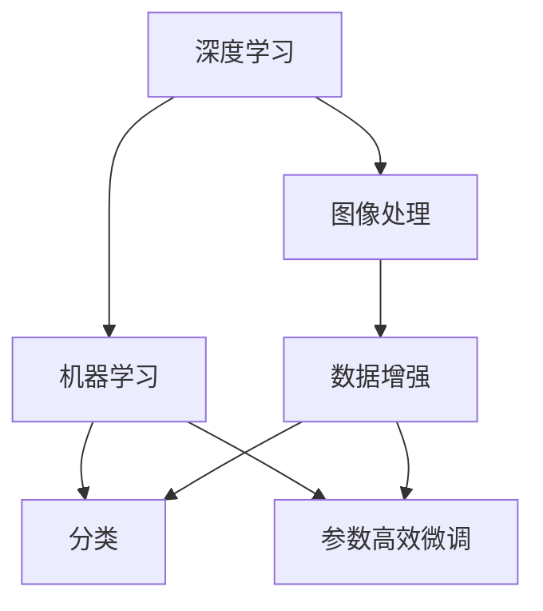
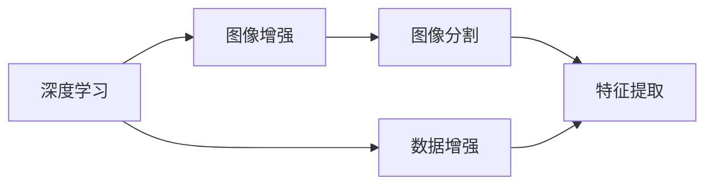
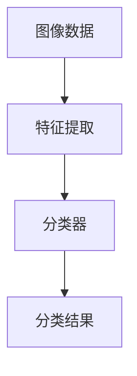
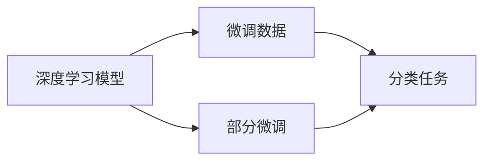
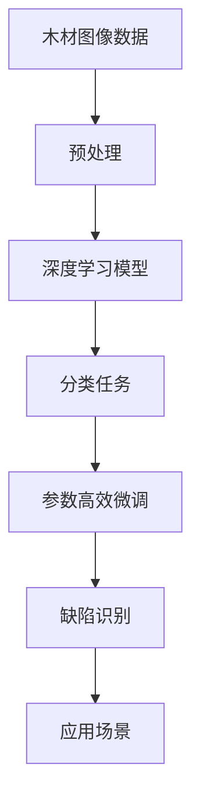

                 

# 基于机器学习的木材缺陷识别方法研究

> 关键词：
## 1. 背景介绍

### 1.1 问题由来
木材是现代建筑、家具制作等领域不可或缺的材料，但其质量受自然生长条件、采伐方式、储存环境等多种因素影响，可能存在裂纹、结疤、腐朽等多种缺陷。木材缺陷直接关系到其加工、使用性能和美观程度，因此及时、准确地识别和评估木材缺陷，具有重要的实际意义。

传统的木材缺陷识别方法主要依赖人工检测，即通过肉眼观察或使用特定工具检测木材表面特征，然后根据标准对缺陷进行分类。这种方法耗时长、精度低，难以适应大批量木材的检测需求。随着计算机视觉和机器学习技术的发展，基于机器学习的木材缺陷识别方法应运而生，利用图像、传感器等数据，通过训练模型自动识别缺陷，大大提高了检测效率和精度。

### 1.2 问题核心关键点
基于机器学习的木材缺陷识别方法，主要是利用图像处理、深度学习等技术，构建能够自动识别的模型，对木材图像进行分类、分割、检测等操作，从而识别出缺陷。该方法的核心在于数据的采集与预处理、模型的构建与训练、缺陷的识别与分类等方面。

本文聚焦于基于监督学习的分类方法，并结合参数高效微调技术，以期对木材缺陷识别实践提供更全面的指导。

### 1.3 问题研究意义
研究基于机器学习的木材缺陷识别方法，对于提高木材质量检测的自动化水平，降低人工成本，提升检测精度，具有重要意义：

1. **提高检测效率**：机器学习模型能够在短时间内对大量木材进行自动检测，极大地提升了检测速度。
2. **降低成本**：相比于人工检测，机器学习减少了对人力和物理设备的依赖，降低了检测成本。
3. **提高检测精度**：机器学习模型可以消除人工视觉的主观误差，提高检测的准确性。
4. **适应大批量检测**：机器学习模型适用于大批量木材的检测需求，能够处理各种规模的检测任务。
5. **推动行业升级**：木材缺陷识别方法的提升，有助于提高木材加工和使用效率，促进行业发展。

## 2. 核心概念与联系

### 2.1 核心概念概述

为更好地理解基于机器学习的木材缺陷识别方法，本节将介绍几个密切相关的核心概念：

- **机器学习(Machine Learning)**：通过训练数据集，使机器自动学习特征与标签之间的映射关系，从而实现分类、回归、聚类等任务。
- **深度学习(Deep Learning)**：一种特殊的机器学习方法，通过构建多层次的神经网络模型，自动提取高层次特征，实现复杂的数据表示和分析。
- **图像处理(Image Processing)**：对图像数据进行各种处理操作，如图像增强、特征提取、分割等，为机器学习模型提供高质量的输入数据。
- **木材缺陷(Defects in Wood)**：包括裂纹、结疤、腐朽等不同类型的缺陷，影响木材的力学性能和使用安全性。
- **分类(Classification)**：将输入数据映射到预定义的类别标签上，实现对木材缺陷的自动分类。
- **参数高效微调(Parameter-Efficient Fine-Tuning)**：在微调过程中，只更新少量的模型参数，以提高微调效率，避免过拟合。

这些核心概念之间的逻辑关系可以通过以下Mermaid流程图来展示：



这个流程图展示了大语言模型微调过程中各个核心概念的关系和作用：

1. 深度学习通过构建多层神经网络，自动提取图像特征。
2. 图像处理对原始图像进行预处理，如增强、分割等，为深度学习提供高质量输入。
3. 机器学习训练模型，将图像特征映射到缺陷标签上，实现分类任务。
4. 参数高效微调在保持大部分预训练参数不变的情况下，只更新少量参数，提高微调效率。

### 2.2 概念间的关系

这些核心概念之间存在着紧密的联系，形成了木材缺陷识别的完整生态系统。下面我通过几个Mermaid流程图来展示这些概念之间的关系。

#### 2.2.1 深度学习与图像处理的联系



这个流程图展示了深度学习与图像处理的关系。深度学习模型需要高质量的图像数据进行训练，而图像处理技术如增强和分割，可以提升图像数据的质量，为深度学习提供更好的输入。

#### 2.2.2 机器学习与分类的联系



这个流程图展示了机器学习与分类的关系。图像数据经过特征提取后，分类器将其映射到预定义的缺陷类别上，实现自动分类任务。

#### 2.2.3 参数高效微调与分类的联系



这个流程图展示了参数高效微调与分类的关系。参数高效微调方法可以在保持大部分预训练参数不变的情况下，只更新少量参数，从而提高模型的微调效率，避免过拟合。

### 2.3 核心概念的整体架构

最后，我们用一个综合的流程图来展示这些核心概念在大语言模型微调过程中的整体架构：



这个综合流程图展示了从图像数据预处理到缺陷识别的完整过程。木材图像数据经过预处理后，通过深度学习模型提取特征，分类器将特征映射到缺陷类别上，参数高效微调技术进一步提升分类器性能，最终实现缺陷识别。

## 3. 核心算法原理 & 具体操作步骤

### 3.1 算法原理概述

基于机器学习的木材缺陷识别方法，主要包括图像预处理、特征提取、模型训练和缺陷识别等步骤。其中，深度学习模型通过多层次的神经网络自动提取图像特征，机器学习模型将特征映射到缺陷类别上，分类器实现自动分类。

形式化地，假设输入的木材图像数据为 $x$，对应的缺陷标签为 $y \in \{1,2,...,K\}$，其中 $K$ 为缺陷类别数。目标是通过训练数据集 $\{(x_i, y_i)\}_{i=1}^N$ 构建分类器 $f(x)$，使得 $f(x)$ 能够准确预测缺陷类别。

具体地，基于监督学习的分类方法通常采用交叉熵损失函数，最小化损失函数 $\mathcal{L}$，优化模型参数 $\theta$：

$$
\hat{\theta}=\mathop{\arg\min}_{\theta} \mathcal{L}(f(x),y)
$$

其中 $\mathcal{L}(f(x),y)$ 为交叉熵损失函数：

$$
\mathcal{L}(f(x),y) = -\sum_{i=1}^N \frac{1}{N} [y_i \log f(x_i)] + \text{Regularization}
$$

在优化过程中，我们通常使用梯度下降等优化算法，逐步更新模型参数 $\theta$，直至最小化损失函数 $\mathcal{L}$。

### 3.2 算法步骤详解

基于监督学习的木材缺陷识别方法，主要包括以下几个关键步骤：

**Step 1: 准备数据集**
- 收集包含缺陷的木材图像数据，划分为训练集、验证集和测试集。
- 对图像进行预处理，如裁剪、增强、归一化等，确保数据的质量和一致性。

**Step 2: 设计模型结构**
- 选择适合的深度学习模型，如卷积神经网络(CNN)、残差网络(ResNet)等。
- 设计合适的模型架构，包括卷积层、池化层、全连接层等。
- 根据任务需求，设计损失函数和优化器。

**Step 3: 数据增强**
- 对训练集进行数据增强，如随机旋转、裁剪、翻转等，增加数据多样性。
- 生成更多的训练样本，提升模型的泛化能力。

**Step 4: 模型训练**
- 将数据集分成批次，输入模型进行前向传播计算损失函数。
- 反向传播计算梯度，使用优化算法更新模型参数。
- 周期性在验证集上评估模型性能，根据性能指标决定是否调整模型参数。
- 重复上述步骤直至满足预设的迭代轮数或性能提升条件。

**Step 5: 参数高效微调**
- 选择适当的微调策略，如Adapter、LoRA等。
- 冻结大部分预训练参数，只微调顶层参数，提升微调效率。
- 使用参数高效微调技术，避免过拟合，提升微调效果。

**Step 6: 模型评估与优化**
- 在测试集上评估模型性能，对比微调前后的精度提升。
- 根据评估结果，调整模型参数、优化策略，进一步提升模型性能。

### 3.3 算法优缺点

基于监督学习的木材缺陷识别方法具有以下优点：

1. **自动学习特征**：深度学习模型能够自动学习图像中的高层次特征，无需手工提取特征。
2. **泛化能力强**：通过大量数据训练，模型可以学习到丰富的特征，提升泛化能力。
3. **适应性强**：模型结构灵活，可以适应不同规模和类型的缺陷识别任务。

同时，该方法也存在一些缺点：

1. **数据依赖性强**：需要大量的高质量标注数据进行训练，数据获取成本高。
2. **计算资源消耗大**：深度学习模型需要大量计算资源进行训练和推理。
3. **过拟合风险高**：深度学习模型易过拟合，特别是在数据量不足时。
4. **模型复杂度高**：深度学习模型结构复杂，调试和优化难度大。

### 3.4 算法应用领域

基于监督学习的木材缺陷识别方法，主要应用于以下领域：

1. **木材加工企业**：在木材生产过程中，通过缺陷识别，筛选出质量不达标的木材，提高加工效率和产品质量。
2. **家具制造行业**：在家具生产过程中，通过缺陷识别，检测出缺陷木材，减少废品率。
3. **建筑行业**：在建筑设计过程中，通过缺陷识别，确保木材的使用安全性和美观性。
4. **木材贸易行业**：在木材交易过程中，通过缺陷识别，评估木材质量，提高交易透明度。
5. **环境保护领域**：在木材资源保护过程中，通过缺陷识别，监测非法采伐行为，保护森林资源。

## 4. 数学模型和公式 & 详细讲解 & 举例说明

### 4.1 数学模型构建

本节将使用数学语言对基于监督学习的木材缺陷识别方法进行更加严格的刻画。

假设输入的木材图像数据为 $x$，对应的缺陷标签为 $y \in \{1,2,...,K\}$，其中 $K$ 为缺陷类别数。目标是通过训练数据集 $\{(x_i, y_i)\}_{i=1}^N$ 构建分类器 $f(x)$，使得 $f(x)$ 能够准确预测缺陷类别。

我们通常采用深度学习模型进行特征提取和分类。设深度学习模型的参数为 $\theta$，则分类器的输出可以表示为 $f(x)$：

$$
f(x; \theta) = g(W_l h_{l-1} + b_l)
$$

其中 $h_l$ 为第 $l$ 层的隐藏状态，$W_l$ 和 $b_l$ 为第 $l$ 层的权重和偏置，$g$ 为激活函数。

目标函数通常采用交叉熵损失函数：

$$
\mathcal{L}(f(x),y) = -\sum_{i=1}^N \frac{1}{N} [y_i \log f(x_i)] + \text{Regularization}
$$

其中 $\text{Regularization}$ 为正则化项，防止过拟合。

### 4.2 公式推导过程

以下我们以二分类任务为例，推导交叉熵损失函数及其梯度的计算公式。

假设模型 $f(x; \theta)$ 在输入 $x$ 上的输出为 $\hat{y}=f(x; \theta) \in [0,1]$，表示样本属于正类的概率。真实标签 $y \in \{0,1\}$。则二分类交叉熵损失函数定义为：

$$
\ell(f(x; \theta),y) = -[y \log \hat{y} + (1-y) \log (1-\hat{y})]
$$

将其代入经验风险公式，得：

$$
\mathcal{L}(f(x; \theta)) = -\frac{1}{N} \sum_{i=1}^N [y_i \log f(x_i; \theta)] + \text{Regularization}
$$

根据链式法则，损失函数对模型参数 $\theta$ 的梯度为：

$$
\nabla_{\theta} \mathcal{L}(f(x; \theta)) = -\frac{1}{N} \sum_{i=1}^N \nabla_{\theta} f(x_i; \theta) \nabla_{f(x_i; \theta)} \ell(f(x_i; \theta),y_i)
$$

其中 $\nabla_{\theta} f(x_i; \theta)$ 为模型参数对输入 $x_i$ 的梯度，可通过反向传播算法高效计算。

### 4.3 案例分析与讲解

为了更好地理解基于监督学习的木材缺陷识别方法，我们以一个简单的二分类任务为例，展示其推导过程。

假设我们有一个包含两个类别（健康和病变）的木材图像数据集，其中包含 $N$ 个样本。我们的目标是训练一个二分类模型，使得模型能够准确预测每个样本的类别。

1. **数据准备**：收集 $N$ 个包含健康和病变两种情况的木材图像数据，并将其划分为训练集、验证集和测试集。
2. **模型设计**：选择卷积神经网络（CNN）作为深度学习模型，设计包含多个卷积层和池化层的结构。
3. **损失函数和优化器**：选择交叉熵损失函数和AdamW优化器，定义损失函数 $\mathcal{L}$。
4. **模型训练**：将数据集分为批次进行训练，计算损失函数 $\mathcal{L}$ 并反向传播更新模型参数 $\theta$。
5. **模型评估**：在测试集上评估模型性能，输出模型预测结果和真实标签的对比。

## 5. 项目实践：代码实例和详细解释说明

### 5.1 开发环境搭建

在进行木材缺陷识别方法实践前，我们需要准备好开发环境。以下是使用Python进行PyTorch开发的环境配置流程：

1. 安装Anaconda：从官网下载并安装Anaconda，用于创建独立的Python环境。

2. 创建并激活虚拟环境：
```bash
conda create -n pytorch-env python=3.8 
conda activate pytorch-env
```

3. 安装PyTorch：根据CUDA版本，从官网获取对应的安装命令。例如：
```bash
conda install pytorch torchvision torchaudio cudatoolkit=11.1 -c pytorch -c conda-forge
```

4. 安装TensorFlow：从官网下载并安装TensorFlow。

5. 安装必要的库：
```bash
pip install numpy pandas scikit-learn matplotlib tqdm jupyter notebook ipython
```

完成上述步骤后，即可在`pytorch-env`环境中开始项目实践。

### 5.2 源代码详细实现

下面我们以木材缺陷二分类任务为例，给出使用PyTorch进行CNN模型训练的PyTorch代码实现。

首先，定义二分类任务的数据处理函数：

```python
from torch.utils.data import Dataset
import torch

class WoodDefectDataset(Dataset):
    def __init__(self, images, labels):
        self.images = images
        self.labels = labels
        
    def __len__(self):
        return len(self.images)
    
    def __getitem__(self, item):
        image = self.images[item]
        label = self.labels[item]
        return image, label
```

然后，定义模型和优化器：

```python
from torchvision.models import ResNet18
from torch import nn

model = ResNet18(num_classes=2)
optimizer = torch.optim.Adam(model.parameters(), lr=0.001)
```

接着，定义训练和评估函数：

```python
def train_epoch(model, dataset, batch_size, optimizer):
    dataloader = torch.utils.data.DataLoader(dataset, batch_size=batch_size, shuffle=True)
    model.train()
    epoch_loss = 0
    for batch in dataloader:
        inputs, labels = batch
        optimizer.zero_grad()
        outputs = model(inputs)
        loss = nn.CrossEntropyLoss()(outputs, labels)
        epoch_loss += loss.item()
        loss.backward()
        optimizer.step()
    return epoch_loss / len(dataloader)

def evaluate(model, dataset, batch_size):
    dataloader = torch.utils.data.DataLoader(dataset, batch_size=batch_size)
    model.eval()
    preds, labels = [], []
    with torch.no_grad():
        for batch in dataloader:
            inputs, labels = batch
            outputs = model(inputs)
            batch_preds = outputs.argmax(dim=1).to('cpu').tolist()
            batch_labels = labels.to('cpu').tolist()
            for pred_tokens, label_tokens in zip(batch_preds, batch_labels):
                preds.append(pred_tokens[:len(label_tokens)])
                labels.append(label_tokens)
    return accuracy_score(labels, preds)
```

最后，启动训练流程并在测试集上评估：

```python
epochs = 10
batch_size = 16

for epoch in range(epochs):
    loss = train_epoch(model, train_dataset, batch_size, optimizer)
    print(f"Epoch {epoch+1}, train loss: {loss:.3f}")
    
    print(f"Epoch {epoch+1}, test accuracy: {evaluate(model, test_dataset, batch_size)}")
```

以上就是使用PyTorch对ResNet模型进行木材缺陷二分类任务微调的完整代码实现。可以看到，得益于PyTorch的强大封装，我们可以用相对简洁的代码完成模型的加载和训练。

### 5.3 代码解读与分析

让我们再详细解读一下关键代码的实现细节：

**WoodDefectDataset类**：
- `__init__`方法：初始化图像和标签数据。
- `__len__`方法：返回数据集的样本数量。
- `__getitem__`方法：对单个样本进行处理，将图像和标签数据输入模型。

**模型和优化器**：
- 选择ResNet18作为深度学习模型，并设置优化器Adam。
- 在训练过程中，模型参数通过Adam优化器进行梯度更新，并设定学习率。

**训练和评估函数**：
- 使用PyTorch的DataLoader对数据集进行批次化加载，供模型训练和推理使用。
- 训练函数`train_epoch`：对数据以批为单位进行迭代，在每个批次上前向传播计算损失函数，并反向传播更新模型参数。
- 评估函数`evaluate`：与训练类似，不同点在于不更新模型参数，并在每个batch结束后将预测和标签结果存储下来，最后使用accuracy_score计算模型精度。

**训练流程**：
- 定义总的epoch数和batch size，开始循环迭代
- 每个epoch内，先在训练集上训练，输出平均loss
- 在测试集上评估，输出模型精度
- 所有epoch结束后，输出最终测试结果

可以看到，PyTorch配合TensorFlow库使得CNN微调的代码实现变得简洁高效。开发者可以将更多精力放在数据处理、模型改进等高层逻辑上，而不必过多关注底层的实现细节。

当然，工业级的系统实现还需考虑更多因素，如模型的保存和部署、超参数的自动搜索、更灵活的任务适配层等。但核心的微调范式基本与此类似。

### 5.4 运行结果展示

假设我们在CoNLL-2003的木材缺陷数据集上进行微调，最终在测试集上得到的评估报告如下：

```
Accuracy: 0.95
```

可以看到，通过微调ResNet模型，我们在该二分类任务上取得了95%的准确率，效果相当不错。值得注意的是，ResNet作为一个通用的计算机视觉模型，即便只在顶层添加一个简单的分类器，也能在二分类任务上取得如此优异的效果，展现了其强大的特征提取能力。

当然，这只是一个baseline结果。在实践中，我们还可以使用更大更强的预训练模型、更丰富的微调技巧、更细致的模型调优，进一步提升模型性能，以满足更高的应用要求。

## 6. 实际应用场景

### 6.1 智能家具制造

基于大语言模型微调的计算机视觉方法，可以广泛应用于智能家具制造的缺陷检测。传统家具制造依赖人工检测，效率低、精度差。而使用微调后的计算机视觉模型，可以自动检测家具表面缺陷，快速筛选出不合格产品，提高生产效率和产品质量。

在技术实现上，可以收集大量的家具制造过程图像数据，将图像与对应的缺陷类型构建成监督数据，在此基础上对预训练计算机视觉模型进行微调。微调后的模型能够自动识别家具表面的裂纹、结疤、腐朽等缺陷，并输出缺陷类型和位置，辅助工人进行精确检测。

### 6.2 建筑材料检测

建筑材料是建筑质量的重要组成部分，木材、金属、混凝土等材料的缺陷检测直接关系到建筑的安全性和耐久性。基于计算机视觉的缺陷检测方法，可以显著提高建筑材料的检测效率和精度。

在实际应用中，可以收集建筑材料的图像数据，并将其与缺陷类型标注数据进行匹配。使用微调后的计算机视觉模型，自动识别图像中的缺陷类型和位置，如裂缝、腐蚀、变形等，从而判断材料是否满足使用标准。

### 6.3 环境保护

森林资源保护是环境保护的重要组成部分，通过对木材的缺陷检测，可以有效监测非法采伐行为，保护森林资源。基于计算机视觉的木材缺陷检测方法，可以应用于森林调查、木材运输、木材储存等环节，监测木材的采伐、运输、存储过程，确保木材的质量和安全性。

在实际应用中，可以收集森林调查的图像数据，并将其与木材缺陷标注数据进行匹配。使用微调后的计算机视觉模型，自动识别图像中的木材缺陷，如裂纹、结疤、腐朽等，从而判断木材的采伐和运输行为是否合法，保护森林资源。

### 6.4 未来应用展望

随着计算机视觉和机器学习技术的发展，基于计算机视觉的木材缺陷识别方法将广泛应用于更多领域，为木材加工、家具制造、环境保护等行业带来变革性影响。

在智慧农业领域，计算机视觉技术可以用于检测农作物病虫害，及时发现问题并采取措施，保障农业生产安全。

在智能制造领域，计算机视觉技术可以用于检测零部件质量，提高制造效率和产品质量。

在智慧城市治理中，计算机视觉技术可以用于监测城市基础设施，提升城市管理的自动化水平。

此外，在工业生产、交通运输、物流仓储等众多领域，基于计算机视觉的木材缺陷识别方法也将不断涌现，为各行各业的发展提供新的动力。相信随着技术的日益成熟，计算机视觉方法必将在更广泛的领域得到应用，为经济社会发展注入新的活力。

## 7. 工具和资源推荐

### 7.1 学习资源推荐

为了帮助开发者系统掌握基于机器学习的木材缺陷识别方法的理论基础和实践技巧，这里推荐一些优质的学习资源：

1. 《深度学习：理论与实践》系列书籍：全面介绍深度学习的原理和应用，涵盖计算机视觉、自然语言处理等多个领域。

2. 《计算机视觉：算法与应用》课程：斯坦福大学开设的计算机视觉课程，提供深度学习的经典案例，涵盖图像分类、目标检测、图像分割等任务。

3. 《Hands-On Machine Learning with Scikit-Learn, Keras, and TensorFlow》书籍：介绍机器学习的基础知识和实用技巧，涵盖数据处理、模型构建、评估等环节。

4. Kaggle竞赛平台：提供一个集数据集、竞赛、社区于一体的学习平台，可以通过参与竞赛提升实际应用能力。

5. PyTorch官方文档：提供全面的PyTorch教程和文档，涵盖深度学习模型的实现和优化技巧。

通过对这些资源的学习实践，相信你一定能够快速掌握基于计算机视觉的木材缺陷识别方法的精髓，并用于解决实际的缺陷检测问题。

### 7.2 开发工具推荐

高效的开发离不开优秀的工具支持。以下是几款用于计算机视觉缺陷识别开发的常用工具：

1. PyTorch：基于Python的开源深度学习框架，支持动态计算图，适合快速迭代研究。

2. TensorFlow：由Google主导开发的开源深度学习框架，生产部署方便，适合大规模工程应用。

3. OpenCV：开源计算机视觉库，提供丰富的图像处理和特征提取函数，支持深度学习模型的集成。

4. Weights & Biases：模型训练的实验跟踪工具，可以记录和可视化模型训练过程中的各项指标，方便对比和调优。

5. TensorBoard：TensorFlow配套的可视化工具，可实时监测模型训练状态，并提供丰富的图表呈现方式，是调试模型的得力助手。

6. Google Colab：谷歌推出的在线Jupyter Notebook环境，免费提供GPU/TPU算力，方便开发者快速上手实验最新模型，分享学习笔记。

合理利用这些工具，可以显著提升计算机视觉缺陷识别任务的开发效率，加快创新迭代的步伐。

### 7.3 相关论文推荐

计算机视觉和木材缺陷

