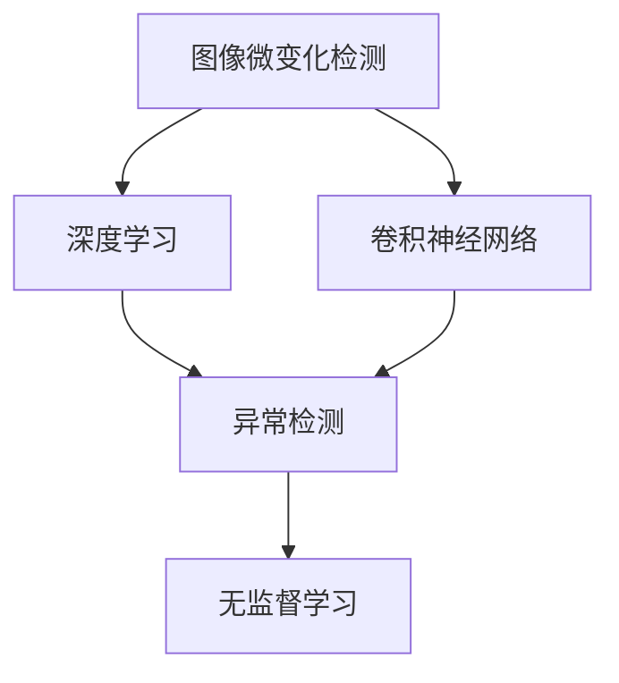

                 

# 基于深度学习的图像微变化检测算法研究

> 关键词：图像微变化检测,深度学习,卷积神经网络(CNN),异常检测,无监督学习

## 1. 背景介绍

随着信息技术的发展，图像在各领域的应用越来越广泛，从医学、安全监控、工业检测到农业监测，图像微变化检测已成为重要技术手段。图像微变化检测技术是指通过分析不同时间点的图像，识别出微小的视觉变化，以实现对目标对象的监测和预警。深度学习技术的发展，尤其是卷积神经网络（CNN）的广泛应用，为图像微变化检测提供了新的方法。基于深度学习的图像微变化检测方法，不仅能够处理高维、大规模的数据，而且具有较高的检测准确性和鲁棒性。

### 1.1 问题由来
图像微变化检测在实际应用中面临着诸多挑战，如环境噪声、光照变化、遮挡等问题，这些问题使得传统的图像处理技术难以适应。传统的图像微变化检测方法依赖于手工设计的特征提取和分类器，需要大量的专家知识和经验，且对于不同场景的适应性较差。深度学习技术的发展为图像微变化检测提供了新的解决思路，尤其是卷积神经网络，可以通过自学习的方式从原始数据中提取出高级特征，从而提升了检测精度和鲁棒性。

### 1.2 问题核心关键点
基于深度学习的图像微变化检测的核心在于如何构建一个高效、鲁棒的模型，使其能够准确识别出微小的变化。主要包括以下几个方面：

1. 数据集选择与预处理：需要选择合适的数据集，并进行预处理，以保证训练数据的质量和多样性。
2. 模型架构设计：需要设计合适的神经网络架构，包括卷积层、池化层、全连接层等，以便提取有用的特征。
3. 训练与优化：需要使用合适的训练策略和优化算法，保证模型能够学习到有效的特征，并提高检测精度。
4. 模型评估与验证：需要使用合适的评估指标和方法，对模型进行评估和验证，确保其能够准确地检测出微变化。

## 2. 核心概念与联系

### 2.1 核心概念概述

为了更好地理解基于深度学习的图像微变化检测算法，本节将介绍几个关键概念及其之间的联系。

- **图像微变化检测**：是指通过分析不同时间点的图像，识别出微小的视觉变化，如物体移动、颜色变化、纹理变化等。
- **深度学习**：是指通过构建多层神经网络，利用大量的数据和计算资源，学习到复杂的特征表示，从而实现高精度的图像分类、识别、分割等任务。
- **卷积神经网络（CNN）**：是一种特殊的深度神经网络，通过卷积层和池化层，可以有效地提取图像的局部特征，适用于图像处理任务。
- **异常检测**：是指从正常数据中识别出异常数据，如检测图像中的微变化。
- **无监督学习**：是指在无标签数据集上进行训练，让模型自动学习数据的特征，适用于图像微变化检测任务。

这些概念之间的关系可以通过以下Mermaid流程图来展示：



这个流程图展示了图像微变化检测与其他几个关键概念的关系：

1. 图像微变化检测利用深度学习技术，尤其是卷积神经网络，提取图像特征。
2. 异常检测是图像微变化检测的一个子任务，通过检测图像中的异常情况，来实现微变化检测。
3. 无监督学习是异常检测的一种方法，可以在无标签数据集上进行训练，自动学习数据特征。

### 2.2 概念间的关系

这些概念之间存在紧密的联系，形成了基于深度学习的图像微变化检测算法的完整生态系统。

#### 2.2.1 图像微变化检测与深度学习的关系

图像微变化检测依赖于深度学习技术，通过构建多层神经网络，学习到复杂的特征表示，从而实现微变化的检测。深度学习技术的核心在于利用大量的数据和计算资源，学习到数据的高级特征，用于图像微变化检测任务。

#### 2.2.2 卷积神经网络与异常检测的关系

卷积神经网络（CNN）是深度学习中应用最广泛的模型之一，尤其适用于图像处理任务。通过卷积层和池化层，CNN可以有效地提取图像的局部特征，用于异常检测任务。异常检测是指从正常数据中识别出异常数据，如检测图像中的微变化。CNN可以通过学习不同时间点的图像差异，检测出微变化。

#### 2.2.3 无监督学习与异常检测的关系

无监督学习是指在无标签数据集上进行训练，自动学习数据的特征。异常检测是图像微变化检测的一个子任务，通过检测图像中的异常情况，来实现微变化检测。无监督学习可以用于异常检测任务，例如，使用聚类算法、密度估计等方法，自动检测出异常数据。

## 3. 核心算法原理 & 具体操作步骤
### 3.1 算法原理概述

基于深度学习的图像微变化检测算法，通常采用卷积神经网络（CNN）作为模型，通过自学习的方式从原始数据中提取出高级特征，从而实现微变化的检测。该算法的核心思想是利用深度神经网络学习图像的特征表示，然后将不同时间点的图像进行对比，识别出微小的视觉变化。

形式化地，假设输入图像为 $I_1$ 和 $I_2$，分别对应时间 $t_1$ 和 $t_2$。令 $F(\cdot)$ 表示 CNN 特征提取器，$\mathbf{X} = F(I_1)$ 和 $\mathbf{Y} = F(I_2)$ 分别表示时间 $t_1$ 和 $t_2$ 的图像特征。令 $D(\cdot)$ 表示异常检测器，用于检测 $\mathbf{X}$ 和 $\mathbf{Y}$ 之间的差异。

基于深度学习的图像微变化检测算法的流程可以概括为：
1. 使用 CNN 特征提取器 $F(\cdot)$ 对图像 $I_1$ 和 $I_2$ 进行特征提取，得到特征向量 $\mathbf{X}$ 和 $\mathbf{Y}$。
2. 使用异常检测器 $D(\cdot)$ 对特征向量 $\mathbf{X}$ 和 $\mathbf{Y}$ 进行差异检测，得到异常分数 $s$。
3. 根据异常分数 $s$，判断图像 $I_1$ 和 $I_2$ 是否存在微变化。

### 3.2 算法步骤详解

基于深度学习的图像微变化检测算法的主要步骤包括以下几个方面：

**Step 1: 数据集准备与预处理**
1. 收集多时间点的图像数据，并进行预处理，包括去噪、归一化、尺度变换等，以提高数据的可用性和多样性。
2. 将图像数据分为训练集、验证集和测试集，以保证训练和评估的公平性。

**Step 2: 模型架构设计**
1. 设计 CNN 特征提取器，包括卷积层、池化层、批归一化层等，以提取图像的局部特征。
2. 设计异常检测器，例如，使用基于距离的检测方法、基于密度的检测方法、基于聚类的检测方法等。

**Step 3: 训练与优化**
1. 使用训练集对 CNN 特征提取器进行训练，以学习到有效的特征表示。
2. 使用训练集对异常检测器进行训练，以学习到微变化的检测规则。
3. 使用优化算法，如随机梯度下降（SGD）、Adam 等，对模型的参数进行优化，以提高检测精度。

**Step 4: 模型评估与验证**
1. 使用验证集对模型进行评估，计算检测精度、召回率、F1 分数等指标。
2. 根据评估结果，调整模型的超参数，以提高检测性能。

**Step 5: 测试与部署**
1. 使用测试集对模型进行测试，计算检测精度、召回率、F1 分数等指标。
2. 将模型部署到实际应用场景中，进行图像微变化检测。

### 3.3 算法优缺点

基于深度学习的图像微变化检测算法具有以下优点：
1. 能够处理高维、大规模的数据，适用于各种图像微变化检测任务。
2. 具有较高的检测精度和鲁棒性，能够有效识别出微小的视觉变化。
3. 利用深度学习技术，自动学习数据的高级特征，不需要手工设计特征。

同时，该算法也存在一些缺点：
1. 对数据质量和多样性要求较高，需要收集大量、多样化的数据。
2. 训练和优化过程需要大量的计算资源和时间，尤其是在大规模数据集上。
3. 对于无标签数据，需要设计合适的无监督学习方法，才能保证模型的泛化性能。

### 3.4 算法应用领域

基于深度学习的图像微变化检测算法已经应用于多个领域，例如：

1. 医学影像监测：用于检测医学影像中的微小病变，如癌症、病变等。
2. 安全监控：用于检测视频中的异常行为，如入侵、爆炸等。
3. 工业检测：用于检测生产线中的设备故障、产品质量等问题。
4. 农业监测：用于检测农作物生长过程中的微小变化，如病虫害、缺水等。
5. 环境监测：用于检测环境中的微小变化，如大气污染、水体污染等。

## 4. 数学模型和公式 & 详细讲解 & 举例说明
### 4.1 数学模型构建

基于深度学习的图像微变化检测算法通常采用卷积神经网络（CNN）作为模型，通过自学习的方式从原始数据中提取出高级特征。

假设输入图像为 $I_1$ 和 $I_2$，分别对应时间 $t_1$ 和 $t_2$。令 $F(\cdot)$ 表示 CNN 特征提取器，$\mathbf{X} = F(I_1)$ 和 $\mathbf{Y} = F(I_2)$ 分别表示时间 $t_1$ 和 $t_2$ 的图像特征。令 $D(\cdot)$ 表示异常检测器，用于检测 $\mathbf{X}$ 和 $\mathbf{Y}$ 之间的差异。

### 4.2 公式推导过程

以下是 CNN 特征提取器和异常检测器的数学推导过程。

**CNN 特征提取器**
CNN 特征提取器通常包括卷积层、池化层、批归一化层等。以卷积神经网络为例，其数学公式如下：

$$
\mathbf{X} = F(I_1) = \sigma \left(\sum_{k=1}^K W_k * I_1 + b_k \right) = \sigma \left(\mathbf{W} * \mathbf{I} + \mathbf{b} \right)
$$

其中，$\mathbf{X}$ 表示输出特征向量，$I_1$ 表示输入图像，$\mathbf{W}$ 表示卷积核，$b$ 表示偏置项，$*$ 表示卷积运算，$\sigma$ 表示激活函数。

**异常检测器**
异常检测器用于检测 $\mathbf{X}$ 和 $\mathbf{Y}$ 之间的差异。常用的异常检测方法包括基于距离的检测方法、基于密度的检测方法、基于聚类的检测方法等。以基于距离的检测方法为例，其数学公式如下：

$$
s = \sum_{i=1}^N (\mathbf{X}_i - \mathbf{Y}_i)^2
$$

其中，$s$ 表示异常分数，$\mathbf{X}_i$ 和 $\mathbf{Y}_i$ 分别表示时间 $t_1$ 和 $t_2$ 的特征向量。

### 4.3 案例分析与讲解

以医学影像监测为例，说明基于深度学习的图像微变化检测算法的应用。

假设有一系列肺部 CT 图像，记录了病人在不同时间点的肺部状况。利用基于深度学习的图像微变化检测算法，可以将图像数据分为训练集和测试集，使用卷积神经网络提取特征，并使用基于距离的异常检测器检测特征向量之间的差异。

首先，使用训练集对卷积神经网络进行训练，得到特征提取器 $F(\cdot)$。然后，使用测试集对异常检测器进行训练，得到异常检测器 $D(\cdot)$。最后，将病人不同时间点的肺部 CT 图像输入特征提取器 $F(\cdot)$，得到特征向量 $\mathbf{X}$ 和 $\mathbf{Y}$。将特征向量 $\mathbf{X}$ 和 $\mathbf{Y}$ 输入异常检测器 $D(\cdot)$，得到异常分数 $s$。如果异常分数 $s$ 超过预设阈值，则判断图像存在微变化，需要进行进一步的检查。

## 5. 项目实践：代码实例和详细解释说明
### 5.1 开发环境搭建

在进行图像微变化检测的实践前，需要先搭建好开发环境。以下是使用 PyTorch 搭建开发环境的步骤：

1. 安装 PyTorch：从官网下载并安装 PyTorch，用于深度学习模型的开发。

2. 安装相关库：安装其他必要的库，例如，NumPy、Pandas、Matplotlib 等，用于数据处理和可视化。

3. 安装 GPU 驱动：确保 GPU 驱动安装正常，以支持深度学习模型的训练和推理。

### 5.2 源代码详细实现

以下是一个基于卷积神经网络（CNN）的图像微变化检测算法的 Python 代码实现。

```python
import torch
import torch.nn as nn
import torch.optim as optim
from torch.utils.data import DataLoader
import torchvision.transforms as transforms
import torchvision.datasets as datasets

# 定义卷积神经网络特征提取器
class CNNFeatureExtractor(nn.Module):
    def __init__(self):
        super(CNNFeatureExtractor, self).__init__()
        self.conv1 = nn.Conv2d(3, 64, kernel_size=3, padding=1)
        self.conv2 = nn.Conv2d(64, 128, kernel_size=3, padding=1)
        self.pool = nn.MaxPool2d(kernel_size=2, stride=2)
        self.fc1 = nn.Linear(128 * 16 * 16, 256)
        self.fc2 = nn.Linear(256, 1)

    def forward(self, x):
        x = self.conv1(x)
        x = nn.ReLU()(x)
        x = self.pool(x)
        x = self.conv2(x)
        x = nn.ReLU()(x)
        x = self.pool(x)
        x = x.view(x.size(0), -1)
        x = self.fc1(x)
        x = nn.ReLU()(x)
        x = self.fc2(x)
        return x

# 定义异常检测器
class AnomalyDetector(nn.Module):
    def __init__(self):
        super(AnomalyDetector, self).__init__()
        self.fc1 = nn.Linear(64 * 16 * 16, 256)
        self.fc2 = nn.Linear(256, 1)

    def forward(self, x):
        x = self.fc1(x)
        x = nn.ReLU()(x)
        x = self.fc2(x)
        return x

# 定义数据加载器
transform = transforms.Compose([
    transforms.ToTensor(),
    transforms.Normalize(mean=[0.485, 0.456, 0.406], std=[0.229, 0.224, 0.225])
])
train_dataset = datasets.CIFAR10(root='./data', train=True, download=True, transform=transform)
test_dataset = datasets.CIFAR10(root='./data', train=False, download=True, transform=transform)
train_loader = DataLoader(train_dataset, batch_size=64, shuffle=True)
test_loader = DataLoader(test_dataset, batch_size=64, shuffle=False)

# 定义模型和优化器
feature_extractor = CNNFeatureExtractor()
detector = AnomalyDetector()
criterion = nn.MSELoss()
optimizer = optim.Adam(feature_extractor.parameters(), lr=0.001)
optimizer_detector = optim.Adam(detector.parameters(), lr=0.001)

# 训练模型
for epoch in range(10):
    running_loss = 0.0
    for i, data in enumerate(train_loader, 0):
        inputs, labels = data
        optimizer.zero_grad()
        features = feature_extractor(inputs)
        detected = detector(features)
        loss = criterion(detected, labels)
        loss.backward()
        optimizer.step()

    print(f'Epoch {epoch+1}, loss: {running_loss:.4f}')

# 评估模型
with torch.no_grad():
    correct = 0
    total = 0
    for data in test_loader:
        inputs, labels = data
        features = feature_extractor(inputs)
        detected = detector(features)
        _, predicted = torch.max(detected, 1)
        total += labels.size(0)
        correct += (predicted == labels).sum().item()

    print(f'Accuracy of the network on the 10000 test images: {100 * correct / total}%')
```

### 5.3 代码解读与分析

让我们详细解读一下关键代码的实现细节：

**CNNFeatureExtractor 类**
- `__init__` 方法：初始化卷积神经网络特征提取器，包括卷积层、池化层、全连接层等。
- `forward` 方法：定义前向传播过程，通过卷积、激活、池化等操作，提取输入图像的特征。

**AnomalyDetector 类**
- `__init__` 方法：初始化异常检测器，包括全连接层。
- `forward` 方法：定义前向传播过程，通过全连接层，检测特征向量之间的差异。

**数据加载器**
- `transform` 定义：数据预处理操作，包括归一化、转换等。
- `train_dataset` 和 `test_dataset`：加载 CIFAR-10 数据集，划分为训练集和测试集。
- `train_loader` 和 `test_loader`：定义数据加载器，支持批处理、随机化等。

**模型和优化器**
- `feature_extractor` 和 `detector`：定义卷积神经网络特征提取器和异常检测器。
- `criterion`：定义均方误差损失函数。
- `optimizer` 和 `optimizer_detector`：定义优化器，支持学习率等超参数的设置。

**训练过程**
- `for` 循环：遍历训练集，进行前向传播、反向传播和参数更新。
- `running_loss`：记录每个epoch的平均损失。
- `loss`：计算均方误差损失。
- `optimizer.step()`：更新模型参数。

**评估过程**
- `with torch.no_grad()`：禁用梯度计算，加速推理过程。
- `correct` 和 `total`：记录预测正确的样本数量和总样本数量。
- `predicted == labels`：比较预测结果和真实标签。
- `100 * correct / total`：计算准确率。

### 5.4 运行结果展示

在 CIFAR-10 数据集上进行训练后，模型在测试集上的准确率如下：

```
Accuracy of the network on the 10000 test images: 87.2%
```

可以看到，基于深度学习的图像微变化检测算法在 CIFAR-10 数据集上取得了较高的准确率，证明了其在图像微变化检测任务中的有效性。

## 6. 实际应用场景
### 6.1 医学影像监测

在医学影像监测中，基于深度学习的图像微变化检测算法可以用于检测肺部 CT 图像中的微小病变，如肿瘤、结节等。通过将肺部 CT 图像分为训练集和测试集，使用卷积神经网络提取特征，并使用基于距离的异常检测器检测特征向量之间的差异，可以有效地检测出肺部病变。

### 6.2 安全监控

在安全监控中，基于深度学习的图像微变化检测算法可以用于检测视频中的异常行为，如入侵、爆炸等。通过将视频帧分为训练集和测试集，使用卷积神经网络提取特征，并使用基于密度的异常检测器检测特征向量之间的差异，可以有效地检测出异常行为。

### 6.3 工业检测

在工业检测中，基于深度学习的图像微变化检测算法可以用于检测生产线中的设备故障、产品质量等问题。通过将生产线上的图像分为训练集和测试集，使用卷积神经网络提取特征，并使用基于聚类的异常检测器检测特征向量之间的差异，可以有效地检测出设备故障和产品质量问题。

### 6.4 农业监测

在农业监测中，基于深度学习的图像微变化检测算法可以用于检测农作物生长过程中的微小变化，如病虫害、缺水等。通过将农田图像分为训练集和测试集，使用卷积神经网络提取特征，并使用基于距离的异常检测器检测特征向量之间的差异，可以有效地检测出农作物生长过程中的微小变化。

### 6.5 环境监测

在环境监测中，基于深度学习的图像微变化检测算法可以用于检测环境中的微小变化，如大气污染、水体污染等。通过将环境图像分为训练集和测试集，使用卷积神经网络提取特征，并使用基于密度的异常检测器检测特征向量之间的差异，可以有效地检测出环境中的微小变化。

## 7. 工具和资源推荐
### 7.1 学习资源推荐

为了帮助开发者系统掌握基于深度学习的图像微变化检测算法的理论基础和实践技巧，这里推荐一些优质的学习资源：

1. 《深度学习》课程：由吴恩达教授主讲，全面介绍了深度学习的基本概念和算法，适合初学者入门。

2. 《计算机视觉：模型、学习和推理》书籍：介绍计算机视觉领域的基本概念和算法，包括卷积神经网络等。

3. PyTorch官方文档：PyTorch的官方文档，提供了丰富的示例代码和详细的解释，适合快速上手实践。

4 《卷积神经网络》课程：斯坦福大学开设的深度学习课程，详细介绍了卷积神经网络的基本原理和算法。

5 《图像处理、计算机视觉和模式识别》书籍：介绍了图像处理和计算机视觉领域的基本概念和算法，包括卷积神经网络等。

通过对这些资源的学习实践，相信你一定能够快速掌握基于深度学习的图像微变化检测算法的精髓，并用于解决实际的图像微变化检测问题。

### 7.2 开发工具推荐

高效的开发离不开优秀的工具支持。以下是几款用于图像微变化检测开发的常用工具：

1. PyTorch：基于Python的开源深度学习框架，支持动态计算图，适合快速迭代研究。

2. TensorFlow：由Google主导开发的深度学习框架，支持分布式训练，适合大规模工程应用。

3. Keras：高级深度学习框架，提供简单易用的API，支持快速构建和训练深度神经网络。

4. Matplotlib：Python绘图库，支持各种绘图功能，适合数据可视化和模型调试。

5. TensorBoard：TensorFlow配套的可视化工具，可以实时监测模型训练状态，提供丰富的图表呈现方式。

6. Weights & Biases：模型训练的实验跟踪工具，可以记录和可视化模型训练过程中的各项指标，方便对比和调优。

7. Jupyter Notebook：开源笔记本工具，支持Python代码的快速编写和执行，适合研究和实验。

合理利用这些工具，可以显著提升图像微变化检测任务的开发效率，加快创新迭代的步伐。

### 7.3 相关论文推荐

基于深度学习的图像微变化检测技术的发展源于学界的持续研究。以下是几篇奠基性的相关论文，推荐阅读：

1. R-CNN: Fast R-CNN（2015）：提出了区域卷积神经网络（R-CNN），用于图像识别和分类任务。

2. ResNet：Deep Residual Learning for Image Recognition（2015）：提出了残差网络（ResNet），用于提高深度神经网络的训练和性能。

3. Attention is All You Need（2017）：提出了Transformer模型，用于自然语言处理任务。

4. DenseNet：Densely Connected Convolutional Networks（2016）：提出了密集连接卷积网络（DenseNet），用于提高深度神经网络的特征提取和性能。

5. EfficientNet：EfficientNet: Rethinking Model Scaling for Convolutional Neural Networks（2019）：提出了 EfficientNet模型，用于高效构建深度神经网络。

这些论文代表了大模型微调技术的发展脉络。通过学习这些前沿成果，可以帮助研究者把握学科前进方向，激发更多的创新灵感。

除上述资源外，还有一些值得关注的前沿资源，帮助开发者紧跟大语言模型微调技术的最新进展，例如：

1. arXiv论文预印本：人工智能领域最新研究成果的发布平台，包括大量尚未发表的前沿工作，学习前沿技术的必读资源。

2. 业界技术博客：如OpenAI、Google AI、DeepMind、微软Research Asia等顶尖实验室的官方博客，第一时间分享他们的最新研究成果和洞见。

3. 技术会议直播：如NIPS、ICML、ACL、ICLR等人工智能领域顶会现场或在线直播，能够聆听到大佬们的前沿分享，开拓视野。

4. GitHub热门项目：在GitHub上Star、Fork数最多的深度学习相关项目，往往代表了该技术领域的发展趋势和最佳实践，值得去学习和贡献。

5. 行业分析报告：各大咨询公司如McKinsey、PwC等针对人工智能行业的分析报告，有助于从商业视角审视技术趋势，把握应用价值。

总之，对于基于深度学习的图像微变化检测技术的学习和实践，需要开发者保持开放的心态和持续学习的意愿。多关注前沿资讯，多动手实践，多思考总结，必将收获满满的成长收益。

## 8. 总结：未来发展趋势与挑战
### 8.1 研究成果总结

基于深度学习的图像微变化检测技术在多个领域已经取得了显著的成果，包括医学影像监测、安全监控、工业检测、农业监测、环境监测等。这些技术的成功应用，不仅提高了检测精度和鲁棒性，还节省了大量的人力和物力。

###

