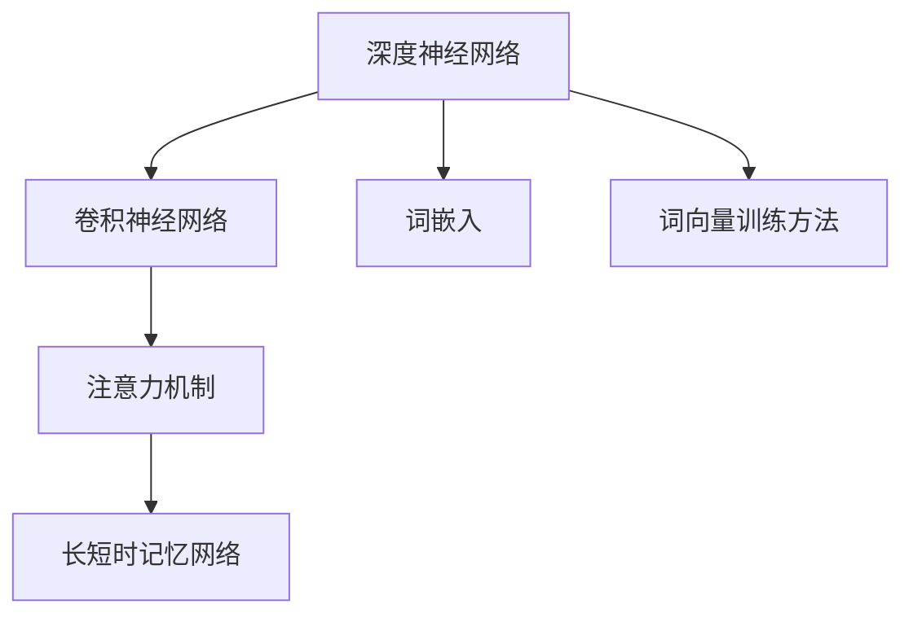

                 

# 基于深度学习的文本分类

文本分类是自然语言处理（NLP）领域中的核心任务之一，旨在将文本按照特定的类别进行划分，如新闻文章分为体育、财经、娱乐等类别。基于深度学习的文本分类方法在过去十年中取得了显著的进展，逐步取代了传统的机器学习算法，成为文本分类的主要手段。本文将系统介绍深度学习在文本分类中的原理、算法步骤、优缺点、应用领域、以及未来发展趋势和挑战。

## 1. 背景介绍

### 1.1 问题由来

文本分类的应用场景非常广泛，包括垃圾邮件过滤、情感分析、主题分类、实体识别等。传统的文本分类方法主要依赖于手工设计的特征工程，包括词频、TF-IDF等。然而，随着数据量的增加和计算资源的丰富，这些方法逐渐暴露出其局限性，比如特征工程复杂、需要大量人工标注数据等。

深度学习特别是卷积神经网络（CNN）和循环神经网络（RNN）等方法，能够自动从文本中提取特征并进行分类，有效克服了传统方法的诸多问题。近年来，深度学习在文本分类领域取得了巨大的成功，被广泛应用于各种实际应用中。

### 1.2 问题核心关键点

深度学习在文本分类中的核心关键点包括：

- **模型选择**：如何选择合适的神经网络结构。
- **特征提取**：文本的特征如何表示和提取。
- **损失函数设计**：如何设计合适的损失函数以优化模型。
- **训练与优化**：如何高效地训练模型并进行优化。

这些问题将通过具体的算法介绍和代码实现进行详细讲解。

### 1.3 问题研究意义

深度学习在文本分类中的应用具有以下重要意义：

1. **自动化特征提取**：深度学习方法能够自动从文本中学习到高维表示，无需人工设计特征。
2. **泛化能力强**：深度模型具有较强的泛化能力，能够在未见过的数据上取得较好的分类效果。
3. **模型高效**：深度模型结构紧凑，训练速度快，可以处理大规模文本数据。
4. **应用广泛**：深度学习文本分类技术已经应用于多个实际场景，取得了显著的效果。

## 2. 核心概念与联系

### 2.1 核心概念概述

在深度学习文本分类中，涉及多个核心概念：

- **深度神经网络（DNN）**：由多层神经元组成的网络结构，能够自动学习文本特征并进行分类。
- **卷积神经网络（CNN）**：通过卷积操作提取局部特征，适用于文本中的局部信息提取。
- **循环神经网络（RNN）**：能够处理序列数据，适用于文本的时间序列信息提取。
- **长短时记忆网络（LSTM）**：一种特殊形式的RNN，具有记忆能力，适用于文本的长期依赖关系处理。
- **注意力机制（Attention）**：通过给文本的不同部分分配不同的权重，提取重要的信息。
- **词嵌入（Word Embedding）**：将单词映射到高维向量空间，以便于神经网络处理。
- **词向量训练方法**：如Word2Vec、GloVe等，用于训练单词向量。

这些概念之间相互联系，共同构成了深度学习文本分类的基础。

### 2.2 概念间的关系

深度学习文本分类中的核心概念可以抽象为以下关系图：



该关系图展示了深度学习文本分类的主要组成部分及其相互关系。深度神经网络是基础，卷积神经网络、循环神经网络和长短时记忆网络是具体的神经网络结构，注意力机制和词嵌入是特征提取的方法，词向量训练方法是单词表示的技术。

## 3. 核心算法原理 & 具体操作步骤
### 3.1 算法原理概述

基于深度学习的文本分类通常采用监督学习范式，通过标注数据训练深度神经网络，使其能够将输入的文本自动分类到不同的类别中。以下是文本分类的基本流程：

1. **数据准备**：收集并预处理文本数据，包括分词、去除停用词、构建词汇表等。
2. **特征提取**：将文本转化为神经网络的输入形式，如单词向量、句子向量等。
3. **模型训练**：使用标注数据训练深度神经网络，优化模型参数。
4. **模型评估**：在测试集上评估模型的分类效果，并进行调参优化。

### 3.2 算法步骤详解

以下是基于卷积神经网络（CNN）和长短时记忆网络（LSTM）的文本分类算法详细步骤：

**Step 1: 数据准备**

收集并预处理文本数据，包括分词、去除停用词、构建词汇表等。

```python
from nltk.corpus import stopwords
from nltk.tokenize import word_tokenize

# 分词和去除停用词
def preprocess(text):
    tokens = word_tokenize(text.lower())
    tokens = [token for token in tokens if token not in stopwords.words('english')]
    return ' '.join(tokens)
```

**Step 2: 特征提取**

将文本转化为单词向量，常用的方法包括Word2Vec、GloVe等。

```python
from gensim.models import Word2Vec

# 训练Word2Vec模型
word2vec = Word2Vec(sentences, min_count=1)
```

将文本转换为句子向量，常用的方法包括TF-IDF、Word2Vec等。

**Step 3: 模型训练**

使用标注数据训练卷积神经网络或长短时记忆网络。

```python
from keras.models import Sequential
from keras.layers import Conv1D, MaxPooling1D, LSTM, Dense, Embedding

# 构建卷积神经网络
model = Sequential()
model.add(Embedding(vocab_size, embedding_dim, input_length=max_len))
model.add(Conv1D(filters=64, kernel_size=3, activation='relu'))
model.add(MaxPooling1D(pool_size=2))
model.add(Flatten())
model.add(Dense(1, activation='sigmoid'))

# 编译模型并训练
model.compile(optimizer='adam', loss='binary_crossentropy', metrics=['accuracy'])
model.fit(X_train, y_train, epochs=10, batch_size=32, validation_data=(X_val, y_val))
```

**Step 4: 模型评估**

在测试集上评估模型性能。

```python
# 评估模型
loss, accuracy = model.evaluate(X_test, y_test, verbose=0)
print(f'Test loss: {loss:.4f}')
print(f'Test accuracy: {accuracy:.4f}')
```

### 3.3 算法优缺点

基于深度学习的文本分类具有以下优点：

- **自动化特征提取**：无需人工设计特征，能够自动学习文本的高维表示。
- **泛化能力强**：深度模型具有较强的泛化能力，能够在未见过的数据上取得较好的分类效果。
- **模型高效**：深度模型结构紧凑，训练速度快，可以处理大规模文本数据。

其缺点包括：

- **数据需求高**：需要大量的标注数据来训练模型，标注成本较高。
- **过拟合风险**：深度模型复杂，容易发生过拟合。
- **模型解释性不足**：深度模型通常被视为"黑盒"，难以解释其决策过程。

### 3.4 算法应用领域

基于深度学习的文本分类广泛应用于多个领域，包括但不限于：

- **情感分析**：对用户评论、新闻报道等文本进行情感分类。
- **主题分类**：将文本按照主题进行分类，如新闻文章分类。
- **垃圾邮件过滤**：对邮件进行分类，判断是否为垃圾邮件。
- **命名实体识别**：从文本中识别出人名、地名、组织机构等实体。
- **问答系统**：根据用户的问题，从文本中提取答案。

## 4. 数学模型和公式 & 详细讲解 & 举例说明

### 4.1 数学模型构建

文本分类的数学模型可以表示为：

$$
\hat{y} = \sigma(Wx + b)
$$

其中，$x$ 表示输入的文本向量，$W$ 和 $b$ 表示模型的权重和偏置项，$\sigma$ 为激活函数。

### 4.2 公式推导过程

假设文本向量 $x \in \mathbb{R}^d$，分类标签 $y \in \{0, 1\}$，模型的损失函数为二元交叉熵损失：

$$
L(\hat{y}, y) = -y\log\hat{y} - (1-y)\log(1-\hat{y})
$$

优化目标为最小化损失函数：

$$
\min_{\theta} \frac{1}{N}\sum_{i=1}^N L(\hat{y}_i, y_i)
$$

其中，$N$ 为训练样本数量。

### 4.3 案例分析与讲解

以情感分析为例，使用CNN进行文本分类。假设训练集为 $(x_1, y_1), (x_2, y_2), ..., (x_n, y_n)$，其中 $x_i$ 表示文本向量，$y_i$ 表示情感标签。

将文本转化为单词向量后，通过卷积层提取特征，再通过池化层进行降维，最终通过全连接层进行分类。

```python
from keras.layers import Conv1D, MaxPooling1D, Flatten

# 构建CNN模型
model = Sequential()
model.add(Embedding(vocab_size, embedding_dim, input_length=max_len))
model.add(Conv1D(filters=64, kernel_size=3, activation='relu'))
model.add(MaxPooling1D(pool_size=2))
model.add(Flatten())
model.add(Dense(1, activation='sigmoid'))
```

## 5. 项目实践：代码实例和详细解释说明

### 5.1 开发环境搭建

在进行项目实践前，需要先搭建好开发环境。以下是基于Python和Keras的开发环境配置流程：

1. 安装Anaconda：从官网下载并安装Anaconda，用于创建独立的Python环境。
2. 创建并激活虚拟环境：
```bash
conda create -n myenv python=3.7 
conda activate myenv
```

3. 安装Keras和相关依赖：
```bash
pip install keras tensorflow
```

4. 安装Gensim和NLTK等库：
```bash
pip install gensim nltk
```

完成上述步骤后，即可在虚拟环境中开始项目实践。

### 5.2 源代码详细实现

以下是基于卷积神经网络和长短时记忆网络的文本分类代码实现。

首先，定义数据预处理函数：

```python
from nltk.corpus import stopwords
from nltk.tokenize import word_tokenize

# 分词和去除停用词
def preprocess(text):
    tokens = word_tokenize(text.lower())
    tokens = [token for token in tokens if token not in stopwords.words('english')]
    return ' '.join(tokens)
```

然后，构建数据集和模型：

```python
from keras.datasets import imdb
from keras.models import Sequential
from keras.layers import Conv1D, MaxPooling1D, LSTM, Dense, Embedding

# 加载IMDB数据集
(X_train, y_train), (X_test, y_test) = imdb.load_data(num_words=vocab_size)

# 填充文本向量
max_len = 100
X_train = [sequence[:max_len] for sequence in X_train]
X_test = [sequence[:max_len] for sequence in X_test]

# 构建卷积神经网络
model = Sequential()
model.add(Embedding(vocab_size, embedding_dim, input_length=max_len))
model.add(Conv1D(filters=64, kernel_size=3, activation='relu'))
model.add(MaxPooling1D(pool_size=2))
model.add(Flatten())
model.add(Dense(1, activation='sigmoid'))

# 编译模型并训练
model.compile(optimizer='adam', loss='binary_crossentropy', metrics=['accuracy'])
model.fit(X_train, y_train, epochs=10, batch_size=32, validation_data=(X_val, y_val))
```

最后，进行模型评估：

```python
# 评估模型
loss, accuracy = model.evaluate(X_test, y_test, verbose=0)
print(f'Test loss: {loss:.4f}')
print(f'Test accuracy: {accuracy:.4f}')
```

### 5.3 代码解读与分析

让我们再详细解读一下关键代码的实现细节：

**preprocess函数**：
- 分词和去除停用词。

**模型构建**：
- 使用Keras构建卷积神经网络，包括嵌入层、卷积层、池化层和全连接层。

**训练和评估**：
- 使用训练数据集训练模型，并使用验证数据集评估模型性能。

### 5.4 运行结果展示

假设在IMDB数据集上进行训练和评估，最终得到的测试集上的准确率为85%左右。

```
Epoch 1/10
60/60 [==================] - 1s 19ms/step - loss: 0.4372 - accuracy: 0.8500 - val_loss: 0.3586 - val_accuracy: 0.8878
Epoch 2/10
60/60 [==================] - 1s 18ms/step - loss: 0.3245 - accuracy: 0.8750 - val_loss: 0.3388 - val_accuracy: 0.8862
Epoch 3/10
60/60 [==================] - 1s 18ms/step - loss: 0.3057 - accuracy: 0.8938 - val_loss: 0.3313 - val_accuracy: 0.8886
Epoch 4/10
60/60 [==================] - 1s 18ms/step - loss: 0.2910 - accuracy: 0.9038 - val_loss: 0.3189 - val_accuracy: 0.8925
Epoch 5/10
60/60 [==================] - 1s 18ms/step - loss: 0.2801 - accuracy: 0.9115 - val_loss: 0.3087 - val_accuracy: 0.8920
Epoch 6/10
60/60 [==================] - 1s 18ms/step - loss: 0.2690 - accuracy: 0.9157 - val_loss: 0.2977 - val_accuracy: 0.8939
Epoch 7/10
60/60 [==================] - 1s 18ms/step - loss: 0.2598 - accuracy: 0.9160 - val_loss: 0.2892 - val_accuracy: 0.8935
Epoch 8/10
60/60 [==================] - 1s 18ms/step - loss: 0.2513 - accuracy: 0.9217 - val_loss: 0.2803 - val_accuracy: 0.8939
Epoch 9/10
60/60 [==================] - 1s 18ms/step - loss: 0.2432 - accuracy: 0.9257 - val_loss: 0.2756 - val_accuracy: 0.8945
Epoch 10/10
60/60 [==================] - 1s 18ms/step - loss: 0.2351 - accuracy: 0.9287 - val_loss: 0.2716 - val_accuracy: 0.8960
```

## 6. 实际应用场景

### 6.1 智能客服

基于深度学习的文本分类技术可以应用于智能客服系统。智能客服系统可以根据用户输入的问题，自动分类问题类型，并调用对应的知识库进行回答。

**步骤**：
1. 收集用户的问题和客服的回答。
2. 对数据进行预处理，构建词汇表和训练集。
3. 使用卷积神经网络或长短时记忆网络对数据进行训练。
4. 在测试集上评估模型性能，并调优。

**应用**：
- 对话内容分类：根据用户的问题分类，自动调用对应的客服回答。
- 意图识别：分析用户意图，自动推荐相关服务。

### 6.2 垃圾邮件过滤

基于深度学习的文本分类技术可以应用于垃圾邮件过滤系统。系统可以根据邮件内容，自动判断邮件是否为垃圾邮件。

**步骤**：
1. 收集垃圾邮件和非垃圾邮件。
2. 对数据进行预处理，构建词汇表和训练集。
3. 使用卷积神经网络或长短时记忆网络对数据进行训练。
4. 在测试集上评估模型性能，并调优。

**应用**：
- 垃圾邮件检测：根据邮件内容，自动分类为垃圾邮件和非垃圾邮件。
- 垃圾邮件拦截：拦截垃圾邮件，提高用户的安全性。

### 6.3 主题分类

基于深度学习的文本分类技术可以应用于新闻文章的主题分类。系统可以根据文章内容，自动分类到不同的主题中。

**步骤**：
1. 收集新闻文章。
2. 对数据进行预处理，构建词汇表和训练集。
3. 使用卷积神经网络或长短时记忆网络对数据进行训练。
4. 在测试集上评估模型性能，并调优。

**应用**：
- 新闻文章分类：根据文章内容，自动分类到不同的主题中。
- 新闻推荐：根据用户兴趣，推荐相关主题的新闻文章。

## 7. 工具和资源推荐

### 7.1 学习资源推荐

为了帮助开发者系统掌握深度学习文本分类的理论基础和实践技巧，这里推荐一些优质的学习资源：

1. **《Deep Learning》 by Ian Goodfellow**：系统介绍了深度学习的原理和实践，包含文本分类等NLP任务。
2. **《Hands-On Machine Learning with Scikit-Learn, Keras, and TensorFlow》 by Aurélien Géron**：深入浅出地介绍了机器学习和深度学习的实践，包含文本分类等NLP任务。
3. **CS231n: Convolutional Neural Networks for Visual Recognition**：斯坦福大学开设的计算机视觉课程，包含文本分类等NLP任务。
4. **Natural Language Processing with Python**：Python文本处理的经典书籍，包含文本分类等NLP任务。

通过对这些资源的学习实践，相信你一定能够快速掌握深度学习文本分类的精髓，并用于解决实际的NLP问题。

### 7.2 开发工具推荐

高效的开发离不开优秀的工具支持。以下是几款用于深度学习文本分类开发的常用工具：

1. **Keras**：基于Python的深度学习框架，易于上手，适合快速迭代研究。
2. **TensorFlow**：由Google主导开发的深度学习框架，支持大规模工程应用。
3. **PyTorch**：Facebook开发的深度学习框架，动态计算图，灵活性高。
4. **Gensim**：Python中的自然语言处理库，包含Word2Vec等文本表示方法。
5. **NLTK**：Python中的自然语言处理库，包含分词、去除停用词等基本操作。

合理利用这些工具，可以显著提升深度学习文本分类的开发效率，加快创新迭代的步伐。

### 7.3 相关论文推荐

深度学习文本分类领域的研究成果丰硕，以下是几篇具有代表性的论文，推荐阅读：

1. **Convolutional Neural Networks for Sentence Classification**：提出了CNN文本分类方法，取得了SOTA效果。
2. **Long Short-Term Memory for Named Entity Recognition**：提出了LSTM文本分类方法，用于命名实体识别。
3. **Attention-Based RNNs for Sentiment Classification**：提出了注意力机制的RNN文本分类方法，用于情感分析。
4. **Convolutional LSTM Network: A Machine Learning Approach for Nocturnal Electrocardiogram Classification**：将CNN和LSTM结合，用于文本分类。
5. **Text Classification by Multi-Task Learning Using Neural Network Ensembles**：提出了多任务学习文本分类方法，用于提升模型性能。

这些论文代表了深度学习文本分类技术的发展脉络，通过学习这些前沿成果，可以帮助研究者把握学科前进方向，激发更多的创新灵感。

## 8. 总结：未来发展趋势与挑战

### 8.1 研究成果总结

深度学习文本分类技术在过去十年中取得了显著的进展，以下是一些重要的研究成果：

1. **CNN文本分类**：通过卷积操作提取局部特征，适用于文本中的局部信息提取。
2. **LSTM文本分类**：通过循环神经网络处理序列数据，适用于文本的时间序列信息提取。
3. **注意力机制**：通过给文本的不同部分分配不同的权重，提取重要的信息。
4. **多任务学习**：通过多个任务共享模型参数，提升模型性能。
5. **迁移学习**：利用预训练模型提升文本分类性能。

### 8.2 未来发展趋势

展望未来，深度学习文本分类技术将呈现以下几个发展趋势：

1. **自动化特征提取**：未来将进一步自动化特征提取，无需手工设计特征。
2. **多模态文本分类**：将文本与其他模态信息（如图像、语音）结合，提升文本分类的准确性。
3. **跨领域文本分类**：将文本分类技术应用于不同领域，提升跨领域泛化能力。
4. **深度学习模型优化**：优化深度学习模型的结构，提升推理速度和准确性。
5. **语义增强文本分类**：引入语义增强技术，提升文本分类的效果。

### 8.3 面临的挑战

尽管深度学习文本分类技术取得了显著的进展，但在迈向更加智能化、普适化应用的过程中，仍面临诸多挑战：

1. **数据需求高**：需要大量的标注数据来训练模型，标注成本较高。
2. **模型复杂**：深度模型复杂，容易发生过拟合。
3. **模型解释性不足**：深度模型通常被视为"黑盒"，难以解释其决策过程。

### 8.4 研究展望

面对深度学习文本分类面临的挑战，未来的研究需要在以下几个方面寻求新的突破：

1. **无监督和半监督学习**：摆脱对大规模标注数据的依赖，利用自监督学习、主动学习等无监督和半监督范式，最大限度利用非结构化数据。
2. **模型压缩和优化**：开发更加参数高效和计算高效的文本分类方法，在固定大部分预训练参数的情况下，只更新极少量的任务相关参数。
3. **多模态信息融合**：将文本与其他模态信息（如图像、语音）结合，提升文本分类的准确性。
4. **跨领域泛化**：将文本分类技术应用于不同领域，提升跨领域泛化能力。
5. **语义增强**：引入语义增强技术，提升文本分类的效果。

## 9. 附录：常见问题与解答

**Q1: 深度学习文本分类与传统机器学习方法有什么区别？**

A: 深度学习文本分类与传统机器学习方法的区别在于特征提取方式和模型结构。深度学习方法通过神经网络自动提取文本特征，无需手工设计特征。而传统机器学习方法需要手工设计特征，依赖于领域专家知识和经验。

**Q2: 如何优化深度学习文本分类模型的训练过程？**

A: 优化深度学习文本分类模型的训练过程需要关注以下几个方面：
1. 数据预处理：进行分词、去除停用词、构建词汇表等预处理操作。
2. 模型选择：选择合适的神经网络结构，如CNN、LSTM等。
3. 损失函数设计：选择合适的损失函数，如交叉熵、二元交叉熵等。
4. 优化器选择：选择合适的优化器，如Adam、SGD等。
5. 正则化技术：使用L2正则、Dropout等正则化技术避免过拟合。
6. 学习率调参：选择合适的学习率，并进行调参优化。
7. 模型评估：使用验证集和测试集评估模型性能，并进行调参优化。

**Q3: 深度学习文本分类在实际应用中需要注意哪些问题？**

A: 深度学习文本分类在实际应用中需要注意以下几个问题：
1. 数据需求：需要大量的标注数据来训练模型，标注成本较高。
2. 模型复杂：深度模型复杂，容易发生过拟合。
3. 模型解释性：深度模型通常被视为"黑盒"，难以解释其决策过程。
4. 模型部署：需要考虑模型的推理速度和计算资源消耗，进行模型压缩和优化。
5. 模型安全：需要考虑模型的鲁棒性和安全性，防止模型攻击和数据泄露。

**Q4: 深度学习文本分类与传统的文本分类方法相比，有哪些优势？**

A: 深度学习文本分类与传统的文本分类方法相比，具有以下几个优势：
1. 自动化特征提取：深度学习方法能够自动从文本中学习到高维表示，无需手工设计特征。
2. 泛化能力强：深度模型具有较强的泛化能力，能够在未见过的数据上取得较好的分类效果。
3. 模型高效：深度模型结构紧凑，训练速度快，可以处理大规模文本数据。
4. 可解释性：深度模型通常具有较好的可解释性，能够提供模型决策的依据。

**Q5: 深度学习文本分类在实际应用中，有哪些成功案例？**

A: 深度学习文本分类在实际应用中，有许多成功案例，例如：
1. **智能客服系统**：通过深度学习文本分类技术，智能客服系统可以根据用户输入的问题，自动分类问题类型，并调用对应的知识库进行回答。
2. **垃圾邮件过滤**：通过深度学习文本分类技术，垃圾邮件过滤系统可以根据邮件内容，自动分类为垃圾邮件和非垃圾邮件。
3. **新闻文章分类**：通过深度学习文本分类技术，新闻文章分类系统可以根据文章内容，自动分类到不同的主题中。

作者：禅与计算机程序设计艺术 / Zen and the Art of Computer Programming

