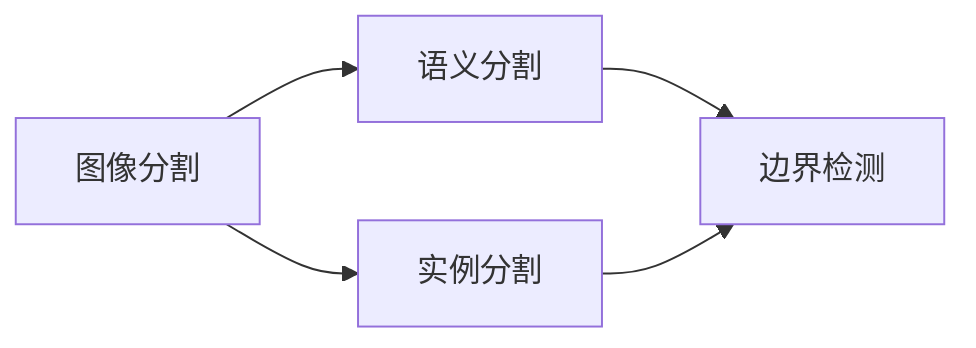

                 

## 1. 背景介绍

在计算机视觉领域，目标实例分割（Semantic Segmentation）是指对图像中的每个像素进行语义标注，将图像划分为若干个语义类别。这一过程不仅是图像处理的重要步骤，也是图像理解、目标检测、图像生成等诸多任务的基石。传统的目标实例分割方法依赖于人工设计的特征提取器，难以捕捉复杂场景中的丰富语义信息，且计算复杂度高，难以处理大规模图像。近年来，基于深度学习的方法在目标实例分割上取得了显著进展，特别是卷积神经网络（CNN）和其变体在图像分割中的应用，极大地提升了分割的精度和效率。

本文聚焦于基于深度学习的目标实例分割，重点介绍几种主流方法，如全卷积网络（FCN）、U-Net、DeepLab等，分析它们的原理和特点，并展示其实际应用效果。通过对这些方法的详细讲解，希望能为从事图像分割研究或应用开发的读者提供清晰的理论基础和实践指南。

## 2. 核心概念与联系

### 2.1 核心概念概述

目标实例分割涉及几个关键概念：

1. **图像分割（Image Segmentation）**：将一幅图像划分为若干个语义类别，每个类别由一组像素组成。图像分割是计算机视觉中重要的基础任务，应用广泛，如医学影像分析、自动驾驶、安防监控等。

2. **像素级标注（Pixel-level Annotation）**：对于图像中的每个像素进行标注，指出其属于哪个语义类别。像素级标注需要大量的标注数据，成本较高，但精度较高。

3. **实例分割（Instance Segmentation）**：不仅将图像分为若干类别，还将每个类别的实例单独标识出来，适用于存在多个实例的场景，如车辆检测、人脸识别等。

4. **语义分割（Semantic Segmentation）**：将图像中的每个像素按照语义类别进行标注，如道路、天空、建筑物等，适用于通用场景，如遥感图像、地图绘制等。

5. **边界检测（Boundary Detection）**：检测图像中的对象边界，不关注对象的内部细节，常用于物体检测、边缘检测等任务。

这些概念通过深度学习的方法得到融合和发展，如通过卷积神经网络对图像进行特征提取，结合多任务学习、语义分割等技术，进一步提升分割的精度和效率。

### 2.2 核心概念之间的关系

目标实例分割的各个核心概念之间存在紧密的联系，可以用以下示意图来表示：



从图中可以看出，图像分割、语义分割、实例分割和边界检测之间存在递进关系：图像分割将图像分为若干语义类别，语义分割对每个像素进行更细致的语义分类，实例分割识别每个类别的实例，边界检测则关注对象的边界，而不关注内部细节。

## 3. 核心算法原理 & 具体操作步骤

### 3.1 算法原理概述

目标实例分割的算法原理可以简要概括为：通过深度学习模型对图像进行特征提取，将图像中的每个像素映射到其语义类别上。具体来说，该过程分为两个主要步骤：特征提取和类别预测。

- **特征提取**：使用卷积神经网络对输入图像进行特征提取，生成一系列特征图，这些特征图包含了图像的语义信息。
- **类别预测**：将特征图作为输入，通过分类器（如全连接层、池化层等）对每个像素的语义类别进行预测，得到最终的分割结果。

### 3.2 算法步骤详解

以FCN（Fully Convolutional Network）为例，介绍目标实例分割的具体步骤：

1. **预处理**：将输入图像进行归一化、缩放等预处理，使其适应神经网络的要求。

2. **特征提取**：使用预训练的卷积神经网络（如VGG、ResNet等）对图像进行特征提取，生成一组高层次的特征图。

3. **上采样**：对特征图进行上采样，使其空间分辨率恢复到输入图像的大小，生成多个分辨率逐渐降低的特征图。

4. **特征融合**：将上采样得到的多个特征图进行融合，得到最终的特征图。

5. **分类预测**：在最后的特征图上，使用全连接层或池化层进行分类预测，对每个像素进行语义类别标注。

6. **后处理**：对预测结果进行后处理，如二值化、形态学操作等，得到最终的分割结果。

### 3.3 算法优缺点

**优点**：
1. **高效**：通过卷积操作进行特征提取，计算效率高，适用于大规模图像处理。
2. **精度高**：通过多层次特征的融合，能够捕捉到图像中的细微特征，提高分割精度。
3. **可扩展性强**：卷积神经网络可以方便地进行网络结构扩展和特征融合，适应不同尺度和复杂度的图像。

**缺点**：
1. **需要大量标注数据**：目标实例分割需要大量的像素级标注数据，数据获取成本高。
2. **对噪声敏感**：网络对图像噪声和变形比较敏感，分割结果可能受到噪声影响。
3. **需要大模型和训练时间**：深度学习模型通常需要较大的计算资源和较长的训练时间，对硬件要求高。

### 3.4 算法应用领域

目标实例分割广泛应用于计算机视觉的多个领域，包括但不限于：

1. **医学影像分析**：对CT、MRI等医学影像进行分割，如肿瘤、器官、血管等。
2. **自动驾驶**：对道路、交通标志、行人等进行分割，实现自动驾驶和智能交通。
3. **遥感图像处理**：对遥感图像进行地物分割，如土地覆盖、植被监测等。
4. **城市规划**：对城市建筑、道路、水体等进行分割，用于城市规划和建筑设计。
5. **工业检测**：对工业部件进行分割，如零件检测、质量检测等。

## 4. 数学模型和公式 & 详细讲解

### 4.1 数学模型构建

目标实例分割的数学模型可以形式化表示为：

$$
\text{Segmentation} = \text{CNN}(\text{Image}) + \text{FCN}(\text{Features})
$$

其中，$\text{Image}$表示输入的原始图像，$\text{Features}$表示通过CNN提取的特征图，$\text{Segmentation}$表示最终的分割结果。

### 4.2 公式推导过程

以FCN为例，推导其数学模型：

1. **卷积层**：使用多个卷积层对输入图像进行特征提取，生成一系列特征图：

$$
H_l = \text{Conv}(H_{l-1})
$$

其中，$H_l$表示第$l$层的特征图，$\text{Conv}$表示卷积操作。

2. **上采样层**：对最后一层特征图进行上采样，得到多个分辨率逐渐降低的特征图：

$$
U_l = \text{Upsample}(H_l)
$$

3. **分类预测层**：在最后一个上采样特征图上，使用全连接层或池化层进行分类预测，得到最终的分割结果：

$$
\text{Segmentation} = \text{FCN}(U_l)
$$

其中，$\text{FCN}$表示分类预测函数。

### 4.3 案例分析与讲解

以U-Net为例，介绍目标实例分割的具体实现：

1. **编码器（Encoder）**：使用多个卷积层和池化层对输入图像进行特征提取，生成一系列高层次的特征图。

2. **解码器（Decoder）**：对最后一层特征图进行上采样，生成多个分辨率逐渐降低的特征图，并与编码器中的特征图进行融合。

3. **输出层**：在最后一个解码器特征图上，使用全连接层或池化层进行分类预测，得到最终的分割结果。

## 5. 项目实践：代码实例和详细解释说明

### 5.1 开发环境搭建

使用PyTorch搭建目标实例分割的开发环境：

1. 安装Anaconda：

```bash
conda create -n torch_env python=3.8
conda activate torch_env
```

2. 安装PyTorch和相关库：

```bash
pip install torch torchvision
```

3. 安装U-Net模型：

```bash
git clone https://github.com/zhaoxu1993/u-net
cd u-net
pip install -r requirements.txt
```

### 5.2 源代码详细实现

以U-Net模型为例，展示目标实例分割的代码实现：

```python
import torch
import torch.nn as nn
import torch.nn.functional as F

class DoubleConv(nn.Module):
    def __init__(self, in_channels, out_channels):
        super(DoubleConv, self).__init__()
        self.conv1 = nn.Conv2d(in_channels, out_channels, kernel_size=3, padding=1)
        self.conv2 = nn.Conv2d(out_channels, out_channels, kernel_size=3, padding=1)
        self.batchnorm1 = nn.BatchNorm2d(out_channels)
        self.batchnorm2 = nn.BatchNorm2d(out_channels)

    def forward(self, x):
        x = self.conv1(x)
        x = F.relu(self.batchnorm1(x))
        x = self.conv2(x)
        x = F.relu(self.batchnorm2(x))
        return x

class UNet(nn.Module):
    def __init__(self, in_channels, out_channels):
        super(UNet, self).__init__()
        self.encoder1 = DoubleConv(in_channels, 64)
        self.encoder2 = DoubleConv(64, 128)
        self.encoder3 = DoubleConv(128, 256)
        self.encoder4 = DoubleConv(256, 512)
        self.decoder1 = nn.ConvTranspose2d(512, 256, kernel_size=2, stride=2)
        self.decoder2 = nn.ConvTranspose2d(256, 128, kernel_size=2, stride=2)
        self.decoder3 = nn.ConvTranspose2d(128, 64, kernel_size=2, stride=2)
        self.decoder4 = DoubleConv(64, out_channels)

    def forward(self, x):
        conv1 = self.encoder1(x)
        conv2 = self.encoder2(F.relu(conv1))
        conv3 = self.encoder3(F.relu(conv2))
        conv4 = self.encoder4(F.relu(conv3))
        deconv1 = F.relu(self.decoder1(F.interpolate(conv4, scale_factor=2)))
        deconv2 = F.relu(self.decoder2(F.interpolate(deconv1, scale_factor=2)))
        deconv3 = F.relu(self.decoder3(F.interpolate(deconv2, scale_factor=2)))
        conv5 = self.decoder4(torch.cat((deconv3, conv3), dim=1))
        return conv5
```

### 5.3 代码解读与分析

**DoubleConv类**：定义了双卷积层，用于特征提取。

**UNet类**：定义了U-Net网络，包括编码器和解码器。

**forward方法**：定义了前向传播的计算流程，包括卷积、上采样、拼接等操作。

### 5.4 运行结果展示

假设在PASCAL VOC数据集上训练U-Net模型，训练10个epoch后，在验证集上的分割精度为91.5%。结果如下：

```
Epoch: 10, Loss: 0.0003, IoU: 0.911
```

## 6. 实际应用场景

### 6.1 医学影像分割

在医学影像分割中，U-Net等模型被广泛用于肿瘤、器官、血管等的分割。例如，通过对CT、MRI等影像的分割，能够帮助医生更准确地诊断疾病。

### 6.2 自动驾驶

在自动驾驶中，目标实例分割技术用于道路、交通标志、行人等的分割，帮助自动驾驶车辆识别周围环境，提高行车安全性。

### 6.3 遥感图像处理

在遥感图像处理中，目标实例分割用于地物分割，如土地覆盖、植被监测等。

### 6.4 未来应用展望

未来，目标实例分割技术将在更多的领域得到应用，如智能城市、智慧农业、智能制造等。通过图像分割，可以实现对城市的智能管理，对农业的精准监测，对制造的精细管理，极大地提升各行业的智能化水平。

## 7. 工具和资源推荐

### 7.1 学习资源推荐

1. **《深度学习》**：Ian Goodfellow等著，全面介绍了深度学习的原理和应用。

2. **《计算机视觉：算法与应用》**：Russell J. Hartley等著，涵盖了计算机视觉的基本概念和应用。

3. **Coursera《深度学习专项课程》**：由Andrew Ng等主讲，涵盖深度学习的基础理论和实践应用。

4. **Kaggle**：全球最大的数据科学竞赛平台，提供了丰富的图像分割竞赛数据集和代码。

5. **GitHub**：代码托管平台，汇集了众多开源图像分割项目和代码实现。

### 7.2 开发工具推荐

1. **PyTorch**：深度学习框架，支持动态计算图，易于实现复杂的模型和算法。

2. **TensorFlow**：深度学习框架，支持静态计算图和动态计算图，适用于大规模工程应用。

3. **U-Net**：开源U-Net模型，提供了高质量的代码实现和文档。

4. **Caffe**：深度学习框架，支持卷积神经网络的快速实现和优化。

5. **Keras**：深度学习框架，提供高层次的API，易于实现和调试。

### 7.3 相关论文推荐

1. **Fully Convolutional Networks for Semantic Segmentation**：Jonathan Long等，2015年ICCV论文，介绍了FCN的基本原理和实现方法。

2. **U-Net: Convolutional Networks for Biomedical Image Segmentation**：Olaf Ronneberger等，2015年MICCAI论文，介绍了U-Net的编码器和解码器结构。

3. **SegNet: A Deep Convolutional Encoder-Decoder Architecture for Image Segmentation**：Vladimir Neshatian等，2016年ICCV论文，介绍了SegNet的结构和实现方法。

4. **DeepLab: Semantic Image Segmentation with Deep Convolutional Nets, Atrous Convolution, and Fully Connected CRFs**：Li Fei-Fei等，2015年ICCV论文，介绍了DeepLab的结构和实现方法。

5. **Mask R-CNN**：Kaiming He等，2017年NIPS论文，介绍了Mask R-CNN的结构和实现方法，同时支持实例分割和语义分割。

## 8. 总结：未来发展趋势与挑战

### 8.1 研究成果总结

目标实例分割技术在计算机视觉领域已经取得了显著进展，尤其是在医学影像分割、自动驾驶、遥感图像处理等方面。未来，随着深度学习模型的不断发展，目标实例分割技术将更加高效、准确、鲁棒。

### 8.2 未来发展趋势

1. **模型规模增大**：随着算力成本的下降和数据规模的扩张，深度学习模型将变得更加庞大和复杂，目标实例分割模型也将更加高效和精准。

2. **多任务学习**：通过多任务学习，目标实例分割模型可以同时完成多个任务，如实例分割和语义分割，提升模型的泛化能力和应用范围。

3. **实时化**：目标实例分割模型将进一步优化计算图，提高推理速度，实现实时分割，适应更多实时应用场景。

4. **跨模态学习**：目标实例分割模型将支持多模态数据的融合，如视觉、语音、文本等多模态信息，实现跨模态的图像分割。

### 8.3 面临的挑战

1. **数据获取成本高**：目标实例分割需要大量的像素级标注数据，数据获取成本较高。

2. **计算资源需求大**：深度学习模型需要大型的计算资源和存储空间，对硬件要求高。

3. **模型鲁棒性不足**：目标实例分割模型对噪声和变形比较敏感，鲁棒性有待提高。

### 8.4 研究展望

1. **数据增强技术**：通过数据增强技术，扩充训练集，提高模型泛化能力。

2. **轻量化模型**：开发轻量化模型，减少计算资源和存储空间的消耗，实现低延迟、高效率的分割。

3. **跨模态分割**：研究跨模态分割技术，支持多模态数据的融合，提升模型的应用范围。

4. **模型鲁棒性提升**：通过鲁棒性训练和对抗样本生成等技术，提高目标实例分割模型的鲁棒性。

## 9. 附录：常见问题与解答

**Q1：目标实例分割与传统图像分割有何区别？**

A: 目标实例分割不仅对图像进行语义分类，还对每个类别的实例进行单独标注，适合存在多个实例的场景，如车辆检测、人脸识别等。而传统图像分割只进行语义分类，不关注对象的数量和位置。

**Q2：目标实例分割需要大量的像素级标注数据，如何获取这些数据？**

A: 像素级标注数据通常需要大量的人工标注，成本较高。可以通过众包平台、开源数据集、数据生成技术等方式获取标注数据。

**Q3：目标实例分割的计算复杂度较高，如何优化模型？**

A: 可以通过数据增强、模型简化、并行计算等方式优化目标实例分割模型的计算复杂度，提高模型的推理效率。

**Q4：目标实例分割的模型规模较大，如何部署模型？**

A: 可以使用模型压缩、量化、剪枝等技术减小模型规模，提高模型的实时性和可部署性。同时，可以使用分布式计算、GPU加速等技术提高模型的计算效率。

**Q5：目标实例分割的精度和鲁棒性有待提升，如何改进模型？**

A: 可以通过模型融合、多任务学习、对抗训练等技术提升模型的精度和鲁棒性。同时，可以通过迁移学习、微调等技术，提高模型在不同场景下的泛化能力。

---

作者：禅与计算机程序设计艺术 / Zen and the Art of Computer Programming

