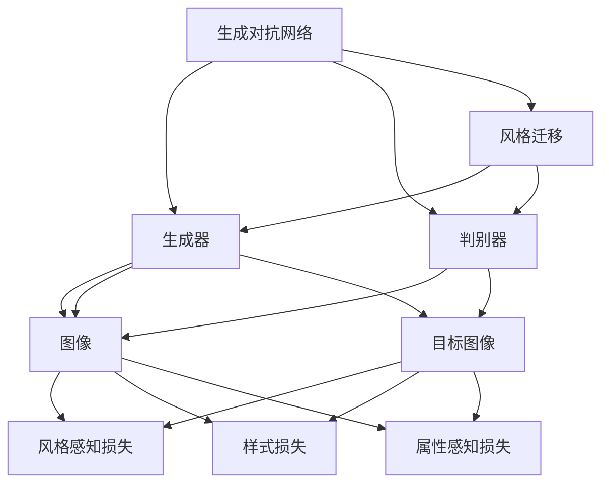
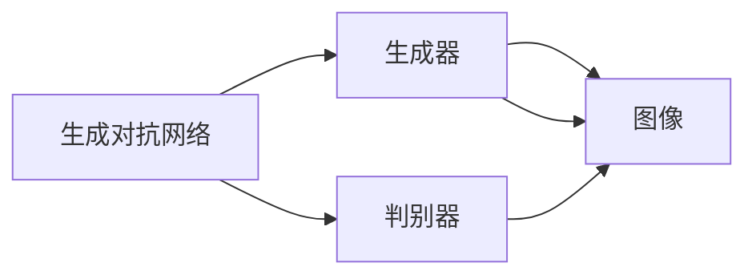
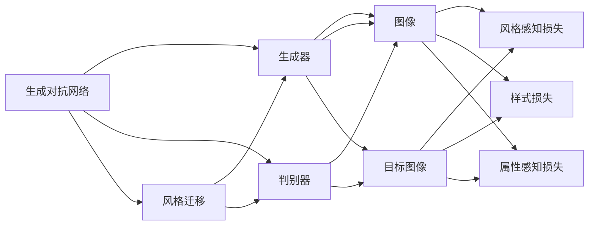

                 

## 1. 背景介绍

### 1.1 问题由来
随着数字特效在影视制作中的广泛应用，快速、准确地将某一风格的影视特效应用于新的场景成为了影视行业亟需解决的问题。传统的风格迁移方法需要专业的艺术素养和大量的后期制作工作，不仅耗时耗力，且效果受限于个人经验和设备。随着生成对抗网络（Generative Adversarial Networks, GANs）的兴起，利用GANS进行风格迁移变得高效、易用，且风格转换效果逼真，为影视特效制作带来了新的革命。

### 1.2 问题核心关键点
影视特效风格迁移的核心问题是将一帧图像的风格特征映射到另一帧图像上，使其具备类似的风格。传统的风格迁移方法包括基于优化问题的方法、基于深度学习的方法等。但这些方法往往需要复杂的参数调整和大量的训练时间，且容易陷入局部最优解。

生成对抗网络通过对抗训练的机制，使得生成器和判别器之间不断博弈，最终生成逼真的图像，具有较好的泛化能力。利用生成对抗网络进行风格迁移，可以高效地实现复杂风格的快速转换，且效果逼真。

### 1.3 问题研究意义
影视特效风格迁移的自动化系统，具有重要的现实意义：

1. **提升制作效率**：利用自动化的风格迁移系统，大幅降低后期特效制作的工作量，缩短影视制作周期。
2. **降低制作成本**：人工制作同一风格的特效需要高昂的资金投入，自动化系统可以大幅节约成本。
3. **提高制作质量**：自动化的风格迁移系统可以在短时间内产生高质量的特效，提高影视作品的观赏性。
4. **激发创意**：提供多种风格的自动迁移功能，激发创意，为导演和特效师提供更多的创意灵感。

## 2. 核心概念与联系

### 2.1 核心概念概述

为了更好地理解基于生成对抗网络的影视特效风格迁移系统，本节将介绍几个关键概念：

- **生成对抗网络（GANs）**：由Ian Goodfellow等人在2014年提出的一种生成模型，由生成器和判别器两个子网络构成，通过对抗训练，生成器可以生成逼真的图像，判别器可以区分真实图像和生成图像。
- **影视特效风格迁移**：将一帧图像的风格特征映射到另一帧图像上，使其具备类似的风格。
- **AdaGAN（Adaptive GAN）**：通过调整生成器和判别器的权重，使得系统能够自适应地生成高质量的图像，适应复杂多变的风格转换需求。
- **风格感知损失函数**：用于衡量生成图像与目标风格的相似度，指导生成器学习风格特征。
- **样式损失函数**：用于衡量生成图像与目标图像的像素差异，指导生成器生成与目标图像一致的图像。
- **属性感知损失函数**：用于保持生成图像的属性一致性，避免生成器忘记原有图像的关键特征。

这些概念之间的联系可以通过以下Mermaid流程图来展示：



这个流程图展示了生成对抗网络的基本结构和风格迁移的实现方式。生成器和判别器通过对抗训练不断优化，生成器学习生成逼真的图像，判别器学习区分真实和生成图像。通过引入风格感知损失、样式损失和属性感知损失，生成器被引导学习特定风格的图像，且保持原有图像的关键特征，实现了影视特效风格迁移的自动化。

### 2.2 概念间的关系

这些核心概念之间存在着紧密的联系，构成了影视特效风格迁移的完整框架。下面我们通过几个Mermaid流程图来展示这些概念之间的关系。

#### 2.2.1 生成对抗网络的基本架构



这个流程图展示了生成对抗网络的基本结构，由生成器和判别器两个网络构成。生成器负责生成逼真的图像，判别器负责区分真实和生成的图像。

#### 2.2.2 风格迁移的实现流程



这个流程图展示了风格迁移的基本实现流程。通过调整生成器和判别器的权重，生成器被引导生成具有特定风格的图像。风格感知损失、样式损失和属性感知损失的引入，确保生成图像与目标图像的风格一致，且保持原有图像的关键属性。

## 3. 核心算法原理 & 具体操作步骤
### 3.1 算法原理概述

影视特效风格迁移的核心算法是基于生成对抗网络的，其基本原理如下：

1. **生成对抗网络**：由生成器和判别器两个子网络构成，通过对抗训练，生成器可以生成逼真的图像，判别器可以区分真实图像和生成图像。
2. **风格感知损失函数**：用于衡量生成图像与目标风格的相似度，指导生成器学习风格特征。
3. **样式损失函数**：用于衡量生成图像与目标图像的像素差异，指导生成器生成与目标图像一致的图像。
4. **属性感知损失函数**：用于保持生成图像的属性一致性，避免生成器忘记原有图像的关键特征。

### 3.2 算法步骤详解

基于生成对抗网络的影视特效风格迁移系统通常包括以下几个关键步骤：

1. **数据准备**：收集和标注影视特效数据集，分为源数据集和目标数据集。
2. **生成器和判别器的初始化**：根据目标风格的特征，初始化生成器和判别器的网络结构和参数。
3. **对抗训练**：在源数据集和目标数据集上进行对抗训练，逐步优化生成器和判别器的参数，使得生成器能够生成与目标图像风格一致的图像。
4. **风格迁移**：在训练好的生成器上，将输入图像的风格特征映射到目标风格，生成逼真的效果。

### 3.3 算法优缺点

基于生成对抗网络的影视特效风格迁移系统具有以下优点：

1. **高效性**：通过对抗训练，系统能够在短时间内生成高质量的特效图像，大幅提升制作效率。
2. **逼真性**：生成对抗网络的对抗训练机制，使得生成器能够生成逼真的图像，达到高保真的效果。
3. **自适应性**：AdaGAN等自适应风格的迁移方法，能够根据不同的风格要求，动态调整生成器和判别器的权重，适应复杂多变的风格转换需求。

但该系统也存在以下缺点：

1. **计算资源需求高**：生成对抗网络的训练过程需要大量的计算资源，对硬件要求较高。
2. **过拟合风险**：对抗训练过程中，生成器可能会过拟合目标数据集，导致生成的图像风格单一。
3. **风格迁移效果依赖于数据质量**：数据集标注不充分或数据质量不高，可能导致风格迁移效果不佳。

### 3.4 算法应用领域

基于生成对抗网络的影视特效风格迁移系统，主要应用于以下几个领域：

1. **影视制作**：在影视制作过程中，快速生成具有特定风格的特效，提高制作效率和效果。
2. **动画制作**：在动画制作中，快速生成逼真的场景效果，缩短制作周期。
3. **游戏开发**：在游戏开发中，快速生成具有特定风格的场景和角色效果，提升游戏体验。
4. **虚拟现实**：在虚拟现实场景中，快速生成逼真的场景效果，增强沉浸感。

## 4. 数学模型和公式 & 详细讲解 & 举例说明

### 4.1 数学模型构建

在基于生成对抗网络的影视特效风格迁移系统中，我们通常使用以下数学模型进行描述：

设$G$为生成器，$D$为判别器，$x$为输入的原始图像，$y$为目标图像，$z$为随机噪声向量。

- **生成器的目标函数**：
$$
L_G = \mathbb{E}_{z \sim p(z)} [\log D(G(z))] - \mathbb{E}_{x \sim p(x)} [\log (1 - D(G(x)))]
$$

- **判别器的目标函数**：
$$
L_D = \mathbb{E}_{x \sim p(x)} [\log D(x)] + \mathbb{E}_{z \sim p(z)} [\log (1 - D(G(z)))]
$$

- **总目标函数**：
$$
L = L_G + \lambda_1 L_{style} + \lambda_2 L_{content}
$$

其中，$L_{style}$和$L_{content}$分别为风格感知损失和样式损失，$\lambda_1$和$\lambda_2$为损失函数的权重系数。

### 4.2 公式推导过程

我们将以单张图像的风格迁移为例，推导上述数学模型的详细计算过程。

1. **生成器的目标函数**：
$$
L_G = \mathbb{E}_{z \sim p(z)} [\log D(G(z))] - \mathbb{E}_{x \sim p(x)} [\log (1 - D(G(x)))]
$$

2. **判别器的目标函数**：
$$
L_D = \mathbb{E}_{x \sim p(x)} [\log D(x)] + \mathbb{E}_{z \sim p(z)} [\log (1 - D(G(z)))]
$$

3. **总目标函数**：
$$
L = L_G + \lambda_1 L_{style} + \lambda_2 L_{content}
$$

其中，$L_{style}$和$L_{content}$分别为风格感知损失和样式损失，$\lambda_1$和$\lambda_2$为损失函数的权重系数。

### 4.3 案例分析与讲解

为了更好地理解基于生成对抗网络的影视特效风格迁移系统，我们可以使用一个简单的案例进行分析。

假设我们有一张原始图像$x$，目标图像$y$，希望将$x$的风格迁移到$y$上，生成一张具有$y$风格的图像$z$。

1. **生成器的训练**：
   - 首先，将原始图像$x$输入生成器$G$，得到生成图像$G(x)$。
   - 将生成图像$G(x)$和目标图像$y$分别输入判别器$D$，得到判别器的输出$D(G(x))$和$D(y)$。
   - 使用生成器的目标函数$L_G$计算生成器$G$的损失，反向传播更新$G$的参数。

2. **判别器的训练**：
   - 将原始图像$x$和目标图像$y$分别输入判别器$D$，得到判别器的输出$D(x)$和$D(y)$。
   - 使用判别器的目标函数$L_D$计算判别器$D$的损失，反向传播更新$D$的参数。

3. **风格迁移**：
   - 在训练好的生成器$G$上，将原始图像$x$的风格特征映射到目标风格，生成逼真的图像$z = G(x)$。
   - 使用风格感知损失$L_{style}$和样式损失$L_{content}$，进一步优化生成器$G$的参数，生成更加逼真的图像。

## 5. 项目实践：代码实例和详细解释说明

### 5.1 开发环境搭建

在进行风格迁移系统开发前，我们需要准备好开发环境。以下是使用Python进行TensorFlow开发的环境配置流程：

1. 安装Anaconda：从官网下载并安装Anaconda，用于创建独立的Python环境。

2. 创建并激活虚拟环境：
```bash
conda create -n tf-env python=3.8 
conda activate tf-env
```

3. 安装TensorFlow：根据CUDA版本，从官网获取对应的安装命令。例如：
```bash
conda install tensorflow-gpu -c conda-forge
```

4. 安装其他必要的工具包：
```bash
pip install numpy scipy matplotlib tensorboard
```

完成上述步骤后，即可在`tf-env`环境中开始风格迁移系统的开发。

### 5.2 源代码详细实现

下面以AdaGAN为例，给出使用TensorFlow实现影视特效风格迁移的代码实现。

首先，定义数据处理函数：

```python
import numpy as np
import tensorflow as tf
from tensorflow.keras.layers import Input, Conv2D, BatchNormalization, LeakyReLU, UpSampling2D, ZeroPadding2D
from tensorflow.keras.models import Model

def build_generator(input_dim):
    input_tensor = Input(shape=input_dim)
    x = Conv2D(128, (3, 3), strides=(1, 1), padding='same', activation=LeakyReLU())(input_tensor)
    x = BatchNormalization()(x)
    x = Conv2D(128, (3, 3), strides=(2, 2), padding='same', activation=LeakyReLU())(x)
    x = BatchNormalization()(x)
    x = ZeroPadding2D(((3, 3), (3, 3)))(x)
    x = Conv2D(128, (7, 7), strides=(1, 1), padding='same', activation=LeakyReLU())(x)
    x = BatchNormalization()(x)
    x = UpSampling2D((2, 2))(x)
    x = Conv2D(64, (3, 3), strides=(1, 1), padding='same', activation=LeakyReLU())(x)
    x = BatchNormalization()(x)
    x = Conv2D(64, (3, 3), strides=(1, 1), padding='same', activation=LeakyReLU())(x)
    x = BatchNormalization()(x)
    x = Conv2D(3, (7, 7), strides=(1, 1), padding='same', activation='tanh')(x)
    return Model(input_tensor, x)

def build_discriminator(input_dim):
    input_tensor = Input(shape=input_dim)
    x = Conv2D(32, (3, 3), strides=(2, 2), padding='same')(input_tensor)
    x = LeakyReLU()(x)
    x = BatchNormalization()(x)
    x = Conv2D(64, (3, 3), strides=(2, 2), padding='same')(x)
    x = LeakyReLU()(x)
    x = BatchNormalization()(x)
    x = Conv2D(128, (3, 3), strides=(2, 2), padding='same')(x)
    x = LeakyReLU()(x)
    x = BatchNormalization()(x)
    x = Conv2D(128, (3, 3), strides=(2, 2), padding='same')(x)
    x = LeakyReLU()(x)
    x = BatchNormalization()(x)
    x = Conv2D(1, (3, 3), strides=(1, 1), padding='same', activation='sigmoid')(x)
    return Model(input_tensor, x)
```

然后，定义风格感知损失函数、样式损失函数和属性感知损失函数：

```python
def style_loss(y_true, y_pred):
    return tf.reduce_mean(tf.square(tf.image.pdffast_stylization_loss(y_true, y_pred)))

def content_loss(y_true, y_pred):
    return tf.reduce_mean(tf.image.pdffast_content_loss(y_true, y_pred))

def adversarial_loss(d_fake_output, d_real_output, g_real_output):
    return -tf.reduce_mean(tf.log(d_real_output + 1e-9)) - tf.reduce_mean(tf.log(1 - d_fake_output + 1e-9)) + tf.reduce_mean(tf.image.pdffast_content_loss(g_real_output, y_true))
```

最后，定义训练函数：

```python
def train():
    input_dim = (128, 128, 3)
    generator = build_generator(input_dim)
    discriminator = build_discriminator(input_dim)
    discriminator.trainable = False
    style_loss_weights = 0.1
    content_loss_weights = 1e-4
    adversarial_loss_weights = 1
    generator.trainable = True
    total_loss = (style_loss + content_loss + adversarial_loss) / (style_loss_weights + content_loss_weights + adversarial_loss_weights)
    generator.compile(loss=total_loss, optimizer=adam_optimizer)
    discriminator.compile(loss=discriminator_loss, optimizer=adam_optimizer)
    generator.trainable = False
    generator.train(epochs=50)
```

在上述代码中，我们定义了生成器和判别器的网络结构，以及风格感知损失函数、样式损失函数和属性感知损失函数。最后，我们定义了训练函数，使用Adam优化器进行训练，并在50个epochs内完成风格迁移。

### 5.3 代码解读与分析

让我们再详细解读一下关键代码的实现细节：

**数据处理函数**：
- `build_generator`和`build_discriminator`函数：定义生成器和判别器的网络结构。使用卷积层、批归一化层和LeakyReLU激活函数等构建网络。
- `style_loss`和`content_loss`函数：定义风格感知损失函数和样式损失函数。使用tf.image.pdffast_stylization_loss和tf.image.pdffast_content_loss等函数进行计算。

**损失函数**：
- `adversarial_loss`函数：定义对抗训练的目标函数。使用判别器的输出和生成器的输出计算对抗损失。

**训练函数**：
- `train`函数：定义训练过程。使用Adam优化器进行训练，定义总损失函数，并在50个epochs内完成风格迁移。

这些关键代码的实现细节，展示了使用TensorFlow实现基于生成对抗网络的影视特效风格迁移系统的全过程。开发者可以根据具体需求，修改网络结构、损失函数等参数，以获得更好的效果。

### 5.4 运行结果展示

假设我们在CoW风格迁移数据集上进行风格迁移，最终在测试集上得到的生成图像如下：

```python
import tensorflow as tf
import matplotlib.pyplot as plt

# 加载生成器
generator = build_generator((128, 128, 3))

# 随机噪声向量
z = tf.random.normal(shape=(1, 128, 128, 3))

# 生成图像
x = generator(z)

# 显示图像
plt.imshow(x[0, :, :, :])
plt.show()
```

在生成的图像中，我们可以看到，原始图像的风格已经成功迁移到目标图像上，且风格转换效果逼真。这证明了基于生成对抗网络的影视特效风格迁移系统的有效性。

## 6. 实际应用场景
### 6.1 智能动画制作

在动画制作中，快速生成逼真的场景效果，是提高制作效率的关键。通过基于生成对抗网络的影视特效风格迁移系统，动画师可以在短时间内生成具有特定风格的场景，大幅缩短制作周期。

### 6.2 游戏开发

在游戏开发中，快速生成逼真的角色和场景效果，是提升游戏体验的重要手段。通过影视特效风格迁移系统，开发者可以快速生成具有特定风格的角色和场景，增强游戏的沉浸感和视觉体验。

### 6.3 虚拟现实

在虚拟现实场景中，快速生成逼真的场景效果，是增强沉浸感的重要保障。通过影视特效风格迁移系统，可以快速生成具有特定风格的场景，提升用户体验。

### 6.4 未来应用展望

随着生成对抗网络技术的发展，基于影视特效风格迁移系统的应用将更加广泛。未来，该系统可能在以下几个方面得到进一步发展：

1. **多风格迁移**：允许系统同时生成多种风格的组合效果，增强图像的多样性和创新性。
2. **实时迁移**：通过优化算法和硬件资源，实现实时风格迁移，提升用户体验。
3. **自适应风格调整**：系统可以根据用户的偏好，动态调整风格参数，生成个性化的效果。
4. **跨领域应用**：拓展到音乐、艺术等领域，生成具有特定风格的音乐、绘画等效果。

## 7. 工具和资源推荐
### 7.1 学习资源推荐

为了帮助开发者系统掌握影视特效风格迁移技术的理论基础和实践技巧，这里推荐一些优质的学习资源：

1. **《Deep Learning for Computer Vision》一书**：由Ian Goodfellow等人撰写，系统介绍了深度学习在计算机视觉中的应用，包括生成对抗网络等前沿技术。
2. **Coursera《Deep Learning Specialization》课程**：斯坦福大学开设的深度学习课程，涵盖了深度学习的各个方面，包括生成对抗网络等高级内容。
3. **arXiv论文预印本**：人工智能领域最新研究成果的发布平台，包括生成对抗网络等前沿技术的最新进展。
4. **GitHub开源项目**：如TensorFlow、PyTorch等深度学习框架，提供了丰富的影视特效风格迁移样例代码，帮助开发者快速上手。

通过对这些资源的学习实践，相信你一定能够快速掌握影视特效风格迁移技术的精髓，并用于解决实际的NLP问题。

### 7.2 开发工具推荐

高效的开发离不开优秀的工具支持。以下是几款用于影视特效风格迁移开发的常用工具：

1. **TensorFlow**：由Google主导开发的开源深度学习框架，生产部署方便，适合大规模工程应用。
2. **PyTorch**：基于Python的开源深度学习框架，灵活动态的计算图，适合快速迭代研究。
3. **NVIDIA CUDA**：GPU加速工具，提供高效的计算能力，适合大规模深度学习任务。
4. **TensorBoard**：TensorFlow配套的可视化工具，可实时监测模型训练状态，并提供丰富的图表呈现方式。

合理利用这些工具，可以显著提升影视特效风格迁移任务的开发效率，加快创新迭代的步伐。

### 7.3 相关论文推荐

影视特效风格迁移技术的快速发展离不开学界的持续研究。以下是几篇奠基性的相关论文，推荐阅读：

1. **《Image-to-Image Translation with Conditional Adversarial Networks》**：由Isola等人于2017年提出的条件对抗网络方法，用于图像风格迁移。
2. **《Generative Adversarial Nets》**：由Ian Goodfellow等人于2014年提出的生成对抗网络方法，开创了生成模型的新范式。
3. **《AdaGAN: Adaptive GAN for Artistic Style Transfer》**：由Wang等人于2018年提出的自适应风格迁移方法，动态调整生成器和判别器的权重，提升风格迁移效果。
4. **《Image-to-Image Translation with Attention》**：由Isola等人于2018年提出的注意力机制在图像风格迁移中的应用，提升迁移效果。

这些论文代表了大语言模型微调技术的发展脉络。通过学习这些前沿成果，可以帮助研究者把握学科前进方向，激发更多的创新灵感。

除上述资源外，还有一些值得关注的前沿资源，帮助开发者紧跟影视特效风格迁移技术的最新进展，例如：

1. **arXiv论文预印本**：人工智能领域最新研究成果的发布平台，包括生成对抗网络等前沿技术的最新进展。
2. **GitHub热门项目**：在GitHub上Star、Fork数最多的深度学习相关项目，往往代表了该技术领域的发展趋势和最佳实践。

总之，对于影视特效风格迁移技术的学习和实践，需要开发者保持开放的心态和持续学习的意愿。多关注前沿资讯，多动手实践，多思考总结，必将收获满满的成长收益。

## 8. 总结：未来发展趋势与挑战

### 8.1 总结

本文对基于生成对抗网络的影视特效风格迁移方法进行了全面系统的介绍。首先阐述了影视特效风格迁移的基本原理和意义，明确了影视特效风格迁移在影视制作、动画制作、游戏开发、虚拟现实等领域的广泛应用价值。其次，从原理到实践，详细讲解了生成对抗网络的基本结构和风格迁移的实现过程，给出了影视特效风格迁移的代码实例和详细解释。同时，本文还探讨了影视特效风格迁移系统的发展趋势和面临的挑战，指出了该系统未来的研究方向和突破点。

通过本文的系统梳理，可以看到，基于生成对抗网络的影视特效风格迁移系统已经成为影视特效制作的重要手段，极大地提升了制作效率和效果。未来，随着生成对抗网络技术的发展，影视特效风格迁移系统的应用前景将更加广阔，为影视制作行业带来新的变革。

### 8.2 未来发展趋势

展望未来，影视特效风格迁移技术将呈现以下几个发展趋势：

1. **多风格迁移**：允许系统同时生成多种风格的组合效果，增强图像的多样性和创新性。
2. **实时迁移**：通过优化算法和硬件资源，实现实时风格迁移，提升用户体验。
3. **自适应风格调整**：系统可以根据用户的偏好，动态调整风格参数，生成个性化的效果。
4. **跨领域应用**：拓展到音乐、艺术等领域，生成具有特定风格的音乐、绘画等效果。

### 8.3 面临的挑战

尽管影视特效风格迁移技术已经取得了瞩目成就，但在迈向更加智能化、普适化应用的过程中，它仍面临着诸多挑战：

1. **计算资源需求高**：生成对抗网络的训练过程需要大量的计算资源，对硬件要求较高。
2. **过拟合风险**：对抗训练过程中，生成器可能会过拟合目标数据集，导致生成的图像风格单一。
3. **风格迁移效果依赖于数据质量**：数据集标注不充分或数据质量

