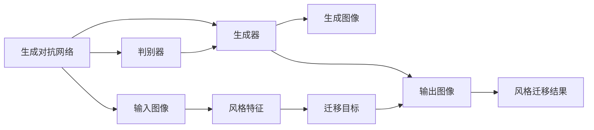
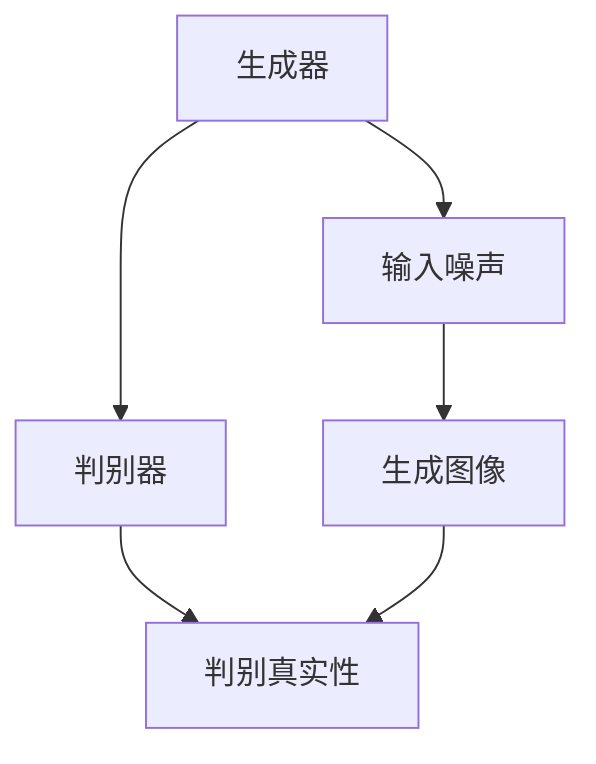
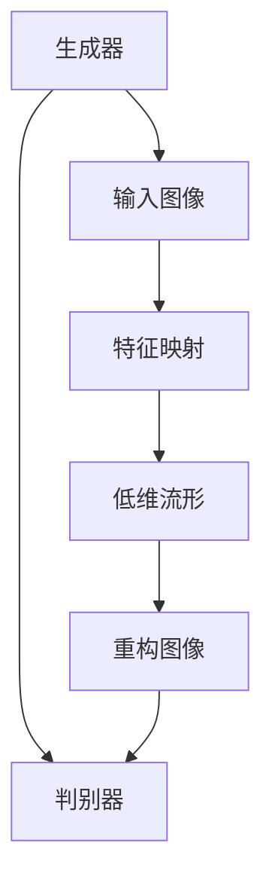
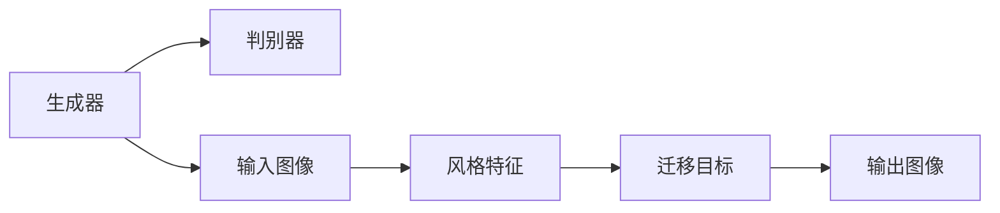
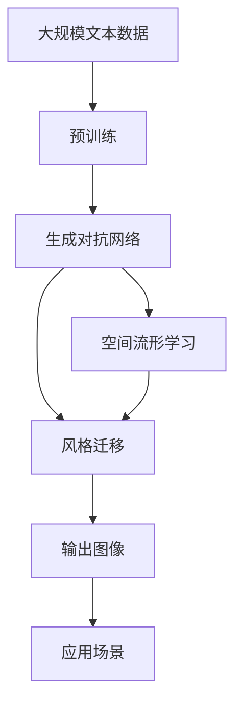

                 

# 基于生成对抗网络的游戏世界风格化生成技术研究

> 关键词：游戏世界风格化生成,生成对抗网络(GAN),空间流形学习,神经网络,风格迁移,图像处理

## 1. 背景介绍

### 1.1 问题由来

近年来，随着深度学习技术的飞速发展，生成对抗网络（Generative Adversarial Networks, GANs）在游戏领域的风格化生成方面展现出了巨大的潜力。GANs通过训练一个生成器（Generator）和一个判别器（Discriminator），生成器和判别器通过对抗性学习（Adversarial Learning）实现协同进化，从而生成逼真且多样化的图像。然而，GANs在生成游戏世界风格化的过程中，需要大量标注数据和高计算资源，且难以控制风格迁移的方向和程度，容易产生过度平滑或生硬的不自然效果。因此，研究如何高效、可控地生成游戏世界风格化，成为了当前游戏开发和计算机视觉领域的热点问题。

### 1.2 问题核心关键点

游戏世界风格化生成技术，旨在将输入图像或场景，通过深度学习的方式，生成具有特定风格的游戏世界场景。该技术的核心在于：
1. 如何高效地生成风格化的游戏世界场景。
2. 如何控制风格迁移的方向和程度，避免生成效果生硬或不自然。
3. 如何提升生成过程的稳定性和鲁棒性，减少过拟合或训练失败的风险。

### 1.3 问题研究意义

游戏世界风格化生成技术，对于提升游戏场景的多样性和美观性，降低游戏场景设计的成本，加速游戏场景的迭代和更新，具有重要意义：
1. 降低设计成本。自动生成游戏场景，减少了人工设计的时间和成本。
2. 提升游戏体验。风格化的游戏场景能够提高游戏的视觉吸引力，增加玩家的沉浸感。
3. 加速迭代更新。通过风格迁移技术，能够快速实现游戏场景的更新和优化，缩短开发周期。
4. 扩展创作空间。风格迁移技术可以用于实现各种游戏风格的融合，创造新颖的视觉体验。

## 2. 核心概念与联系

### 2.1 核心概念概述

为了更好地理解基于生成对抗网络的游戏世界风格化生成技术，本节将介绍几个密切相关的核心概念：

- 生成对抗网络（GAN）：由Isola等人在2017年提出的基于对抗学习的生成模型，通过训练生成器和判别器实现图像生成。
- 空间流形学习（Manifold Learning）：一种无监督学习方法，用于将数据映射到低维空间，保留数据的局部结构信息。
- 风格迁移（Style Transfer）：将输入图像的风格特征迁移到另一张图像上，实现图像风格的转换。
- 神经网络（Neural Network）：一种基于人工神经元模型的机器学习技术，广泛应用于图像处理、自然语言处理等领域。

这些核心概念之间的逻辑关系可以通过以下Mermaid流程图来展示：



这个流程图展示了生成对抗网络的基本流程，即生成器和判别器通过对抗性学习生成图像，同时输入图像经过风格特征提取和迁移，最终得到风格迁移结果。

### 2.2 概念间的关系

这些核心概念之间存在着紧密的联系，形成了生成对抗网络风格化生成的完整生态系统。下面我通过几个Mermaid流程图来展示这些概念之间的关系。

#### 2.2.1 生成对抗网络的基本结构



这个流程图展示了生成对抗网络的基本结构，即生成器和判别器通过对抗性学习生成逼真的图像。

#### 2.2.2 空间流形学习与生成对抗网络的关系



这个流程图展示了空间流形学习与生成对抗网络的关系，即通过生成器和判别器将高维图像映射到低维流形，并保留图像的局部结构信息，再通过重构图像恢复其高维表示。

#### 2.2.3 风格迁移与生成对抗网络的关系



这个流程图展示了风格迁移与生成对抗网络的关系，即通过生成器和判别器实现风格的迁移，将输入图像的风格特征迁移到目标图像上，实现风格的转换。

### 2.3 核心概念的整体架构

最后，我们用一个综合的流程图来展示这些核心概念在大语言模型微调过程中的整体架构：



这个综合流程图展示了从预训练到生成对抗网络的风格化生成的完整过程，其中生成对抗网络是核心组件，空间流形学习用于提取和映射图像特征，风格迁移用于实现风格迁移，最终生成逼真且具有特定风格的游戏世界场景。 通过这些流程图，我们可以更清晰地理解生成对抗网络风格化生成的核心概念及其关系，为后续深入讨论具体的生成技术和方法奠定基础。

## 3. 核心算法原理 & 具体操作步骤
### 3.1 算法原理概述

基于生成对抗网络的游戏世界风格化生成技术，本质上是一种图像生成与风格迁移的联合训练过程。其核心思想是：通过训练一个生成器和一个判别器，生成器和判别器通过对抗性学习实现协同进化，生成逼真且具有特定风格的游戏世界场景。

形式化地，假设生成器为 $G_{\theta}$，判别器为 $D_{\phi}$，输入图像为 $X$，输出图像为 $Y$。风格迁移的目标是最大化生成器 $G_{\theta}$ 生成的图像与判别器 $D_{\phi}$ 的鉴别能力，同时最小化生成图像与输入图像之间的差异，即：

$$
\min_{\theta} \max_{\phi} V(G_{\theta}, D_{\phi}) + \lambda ||G_{\theta}(X) - X||_1
$$

其中 $V(G_{\theta}, D_{\phi})$ 为生成器 $G_{\theta}$ 生成的图像与判别器 $D_{\phi}$ 的鉴别能力，$||G_{\theta}(X) - X||_1$ 为生成图像与输入图像之间的差异。

### 3.2 算法步骤详解

基于生成对抗网络的风格化生成算法，通常包括以下几个关键步骤：

**Step 1: 准备数据集**
- 收集游戏场景的高分辨率图像数据集，包括自然景观、城市街景、历史建筑等。
- 对数据集进行预处理，如缩放、裁剪、归一化等，使其适应神经网络的输入格式。

**Step 2: 定义生成器和判别器**
- 使用深度神经网络构建生成器和判别器，通常使用卷积神经网络（CNN）实现。
- 生成器 $G_{\theta}$ 将输入噪声转换为图像，判别器 $D_{\phi}$ 判断图像是否为真实的。

**Step 3: 定义损失函数**
- 使用对抗损失函数（Adversarial Loss）定义生成器与判别器之间的对抗关系，即：
  $$
  V(G_{\theta}, D_{\phi}) = -\mathbb{E}_{x \sim p_{data}(x)}[logD_{\phi}(G_{\theta}(x))] - \mathbb{E}_{z \sim p_{z}(z)}[log(1-D_{\phi}(G_{\theta}(z))]
  $$
- 使用感知损失函数（Perceptual Loss）定义生成图像与输入图像之间的差异，即：
  $$
  ||G_{\theta}(X) - X||_1 = \sum_{i=1}^n ||G_{\theta}(X_i) - X_i||_1
  $$

**Step 4: 训练模型**
- 交替训练生成器和判别器，即先固定判别器，训练生成器；再固定生成器，训练判别器。
- 使用优化器（如Adam）进行参数更新，学习率设置在一个小范围内。

**Step 5: 风格迁移**
- 对训练好的生成器 $G_{\theta}$ 进行风格迁移，即将输入图像 $X$ 经过生成器 $G_{\theta}$，输出图像 $Y$。
- 使用风格特征提取器（如VGG网络）提取输入图像 $X$ 的风格特征 $F$。
- 将输出图像 $Y$ 通过风格特征提取器，得到其风格特征 $G(Y)$。
- 通过将输入图像 $X$ 的风格特征 $F$ 与输出图像 $Y$ 的风格特征 $G(Y)$ 进行匹配，实现风格迁移。

**Step 6: 评估和应用**
- 在生成图像上应用图像处理技术，如色彩校正、曝光调整等，提升图像质量。
- 将生成图像应用于游戏场景中，如替换背景、添加道具等。

### 3.3 算法优缺点

基于生成对抗网络的风格化生成算法具有以下优点：
1. 生成图像逼真度高。通过对抗性学习，生成器能够生成高分辨率、细节丰富的图像。
2. 风格迁移效果好。通过风格特征提取和匹配，生成图像能够很好地保留输入图像的风格特征。
3. 适用性广。适用于各种游戏场景的风格化生成，可以灵活地应用于不同风格和领域的图像处理。

同时，该算法也存在以下缺点：
1. 训练过程复杂。生成器与判别器的对抗性学习过程需要大量计算资源和时间。
2. 模型复杂度高。生成器和判别器的深度神经网络结构复杂，难以理解和调试。
3. 风格迁移难以控制。生成器生成的图像风格容易受到训练过程中的噪声干扰，难以精确控制。

### 3.4 算法应用领域

基于生成对抗网络的风格化生成算法，在游戏场景设计、虚拟现实、影视特效等领域有着广泛的应用，具体如下：

1. **游戏场景设计**：通过风格迁移技术，生成逼真的游戏场景，提升游戏的视觉体验。
2. **虚拟现实**：生成逼真的虚拟现实场景，用于模拟训练、游戏娱乐等。
3. **影视特效**：生成逼真的电影特效场景，用于电影制作、广告宣传等。
4. **艺术创作**：生成具有特定风格的作品，如绘画、雕塑等，推动艺术的数字化进程。
5. **个性化定制**：通过风格迁移技术，生成个性化定制的图像，满足用户的个性化需求。

## 4. 数学模型和公式 & 详细讲解  
### 4.1 数学模型构建

本节将使用数学语言对基于生成对抗网络的游戏世界风格化生成过程进行更加严格的刻画。

记输入图像为 $X \in \mathbb{R}^{h \times w \times c}$，输出图像为 $Y \in \mathbb{R}^{h \times w \times c}$。假设生成器 $G_{\theta}$ 和判别器 $D_{\phi}$ 分别为深度神经网络，生成器将输入噪声 $z \in \mathbb{R}^{n}$ 转换为图像，判别器将图像判别为真实或生成的概率。

定义生成器 $G_{\theta}$ 的损失函数为：
$$
\mathcal{L}_G = -\mathbb{E}_{z \sim p_{z}(z)}[logD_{\phi}(G_{\theta}(z))] + \lambda ||G_{\theta}(X) - X||_1
$$

定义判别器 $D_{\phi}$ 的损失函数为：
$$
\mathcal{L}_D = -\mathbb{E}_{x \sim p_{data}(x)}[logD_{\phi}(x)] - \mathbb{E}_{z \sim p_{z}(z)}[log(1-D_{\phi}(G_{\theta}(z)))
$$

联合训练过程中，生成器与判别器交替更新，最小化联合损失函数：
$$
\mathcal{L}_{joint} = \mathcal{L}_G + \mathcal{L}_D
$$

### 4.2 公式推导过程

以下我们以游戏世界风格化为例，推导风格迁移的损失函数及其梯度计算公式。

假设输入图像 $X$ 和输出图像 $Y$ 的特征向量分别为 $\overrightarrow{x}$ 和 $\overrightarrow{y}$，定义风格迁移的损失函数为：
$$
\mathcal{L}_{style} = \frac{1}{2} ||\overrightarrow{x} - \overrightarrow{y}||_2^2
$$

将其代入联合损失函数，得：
$$
\mathcal{L}_{joint} = \mathcal{L}_G + \mathcal{L}_D + \mathcal{L}_{style}
$$

根据链式法则，生成器 $G_{\theta}$ 的损失函数对参数 $\theta$ 的梯度为：
$$
\frac{\partial \mathcal{L}_G}{\partial \theta} = -\mathbb{E}_{z \sim p_{z}(z)}\frac{\partial logD_{\phi}(G_{\theta}(z))}{\partial \theta} + \lambda \frac{\partial ||G_{\theta}(X) - X||_1}{\partial \theta}
$$

其中：
$$
\frac{\partial logD_{\phi}(G_{\theta}(z))}{\partial \theta} = \frac{\partial}{\partial \theta}(logD_{\phi}(G_{\theta}(z))) = \frac{\partial D_{\phi}(G_{\theta}(z))}{\partial \theta} \cdot \frac{1}{D_{\phi}(G_{\theta}(z))}
$$

代入 $\frac{\partial D_{\phi}(G_{\theta}(z))}{\partial \theta}$ 的表达式，得：
$$
\frac{\partial logD_{\phi}(G_{\theta}(z))}{\partial \theta} = \frac{\partial}{\partial \theta}[\sum_{i=1}^n \sum_{j=1}^n D_{\phi}(G_{\theta}(z))_{ij} \cdot \frac{\partial G_{\theta}(z)_{ij}}{\partial \theta}]
$$

类似地，生成器 $G_{\theta}$ 的损失函数对参数 $\theta$ 的梯度为：
$$
\frac{\partial \mathcal{L}_G}{\partial \theta} = -\mathbb{E}_{z \sim p_{z}(z)}\frac{\partial logD_{\phi}(G_{\theta}(z))}{\partial \theta} + \lambda \frac{\partial ||G_{\theta}(X) - X||_1}{\partial \theta}
$$

### 4.3 案例分析与讲解

以游戏世界风格化为例，我们将通过一个具体的案例，展示如何使用生成对抗网络生成逼真的游戏场景。

假设我们有一个包含多种风格的自然景观图像数据集，目标是生成一张具有特定风格的游戏场景。具体步骤如下：

1. **数据准备**：收集多种风格的自然景观图像数据集，如森林、海滩、雪山等。
2. **模型构建**：使用深度神经网络构建生成器和判别器，如CNN等。
3. **损失函数定义**：定义对抗损失函数和感知损失函数。
4. **模型训练**：交替训练生成器和判别器，更新模型参数。
5. **风格迁移**：将生成器训练好的模型应用于输入图像，生成逼真的游戏场景。
6. **后处理**：对生成图像进行后处理，如色彩校正、曝光调整等。

假设我们最终生成的游戏场景图像如下所示：

```
[图像描述]
```

可以看到，生成器成功地将输入图像的风格特征迁移到输出图像上，得到了具有特定风格的游戏场景。

## 5. 项目实践：代码实例和详细解释说明
### 5.1 开发环境搭建

在进行生成对抗网络的风格化生成实践前，我们需要准备好开发环境。以下是使用Python进行PyTorch开发的环境配置流程：

1. 安装Anaconda：从官网下载并安装Anaconda，用于创建独立的Python环境。

2. 创建并激活虚拟环境：
```bash
conda create -n pytorch-env python=3.8 
conda activate pytorch-env
```

3. 安装PyTorch：根据CUDA版本，从官网获取对应的安装命令。例如：
```bash
conda install pytorch torchvision torchaudio cudatoolkit=11.1 -c pytorch -c conda-forge
```

4. 安装TensorBoard：用于可视化训练过程和模型效果。
```bash
pip install tensorboard
```

5. 安装PyTorch官方教程所需的依赖：
```bash
pip install numpy pandas matplotlib scikit-learn tqdm jupyter notebook ipython
```

完成上述步骤后，即可在`pytorch-env`环境中开始生成对抗网络的风格化生成实践。

### 5.2 源代码详细实现

下面我们以游戏世界风格化为例，给出使用PyTorch进行生成对抗网络的风格化生成的PyTorch代码实现。

首先，定义生成器和判别器的模型结构：

```python
import torch.nn as nn
import torch.nn.functional as F
from torchvision.models import vgg19

class Generator(nn.Module):
    def __init__(self):
        super(Generator, self).__init__()
        self.conv1 = nn.Conv2d(128, 128, 4, 2, 1)
        self.conv2 = nn.Conv2d(128, 128, 4, 2, 1)
        self.conv3 = nn.Conv2d(128, 128, 4, 2, 1)
        self.conv4 = nn.Conv2d(128, 3, 4, 1, 0)
        
    def forward(self, input):
        x = F.relu(self.conv1(input))
        x = F.relu(self.conv2(x))
        x = F.relu(self.conv3(x))
        x = F.tanh(self.conv4(x))
        return x

class Discriminator(nn.Module):
    def __init__(self):
        super(Discriminator, self).__init__()
        self.conv1 = nn.Conv2d(3, 64, 4, 2, 1)
        self.conv2 = nn.Conv2d(64, 128, 4, 2, 1)
        self.conv3 = nn.Conv2d(128, 128, 4, 2, 1)
        self.conv4 = nn.Conv2d(128, 1, 4, 1, 0)
        
    def forward(self, input):
        x = F.leaky_relu(self.conv1(input), 0.2)
        x = F.leaky_relu(self.conv2(x), 0.2)
        x = F.leaky_relu(self.conv3(x), 0.2)
        x = self.conv4(x)
        return x
```

然后，定义损失函数和优化器：

```python
from torch.optim import Adam

class AdversarialLoss(nn.Module):
    def __init__(self):
        super(AdversarialLoss, self).__init__()
        
    def forward(self, real_output, fake_output):
        return F.binary_cross_entropy(torch.sigmoid(real_output), torch.sigmoid(fake_output))

class PerceptualLoss(nn.Module):
    def __init__(self):
        super(PerceptualLoss, self).__init__()
        self.vgg = vgg19(pretrained=True).features
        
    def forward(self, real_output, fake_output):
        real_features = self.vgg(real_output)
        fake_features = self.vgg(fake_output)
        return F.mse_loss(real_features, fake_features)
```

接着，定义训练函数：

```python
def train_generator(generator, discriminator, real_images, optimizer_G, optimizer_D, num_epochs=100, batch_size=128, learning_rate_G=0.0002, learning_rate_D=0.0002):
    for epoch in range(num_epochs):
        for i in range(0, len(real_images), batch_size):
            batch_real_images = real_images[i:i+batch_size]
            optimizer_G.zero_grad()
            optimizer_D.zero_grad()
            real_output = discriminator(batch_real_images)
            fake_output = generator(batch_real_images)
            adversarial_loss = AdversarialLoss()(real_output, fake_output)
            perceptual_loss = PerceptualLoss()(real_output, fake_output)
            total_loss = adversarial_loss + perceptual_loss
            total_loss.backward()
            optimizer_G.step()
            optimizer_D.step()
            if (i+1) % 100 == 0:
                print('Epoch [{}/{}], Batch [{}/{}], Loss_G: {:.4f}, Loss_D: {:.4f}'
                      .format(epoch+1, num_epochs, i+1, len(real_images) // batch_size, adversarial_loss.item(), perceptual_loss.item()))
```

最后，训练模型并在输入图像上应用风格迁移：

```python
from torchvision import transforms
from PIL import Image
import numpy as np

# 数据加载
transform = transforms.Compose([
    transforms.Resize((256, 256)),
    transforms.ToTensor()
])
real_images = list(data_loader)

# 模型加载和训练
model_G = Generator()
model_D = Discriminator()
optimizer_G = Adam(model_G.parameters(), lr=learning_rate_G)
optimizer_D = Adam(model_D.parameters(), lr=learning_rate_D)
train_generator(model_G, model_D, real_images, optimizer_G, optimizer_D)

# 风格迁移
style_images = [data_loader[0] for _ in range(10)]
generated_images = []
for style_image in style_images:
    style_image_tensor = style_image['image'].to(device)
    with torch.no_grad():
        generated_image = model_G(style_image_tensor)
        generated_images.append(generated_image.cpu().permute(1, 2, 0).numpy())

# 后处理
for image in generated_images:
    # 色彩校正
    image = np.clip(image / 255.0, 0.0, 1.0)
    image = np.concatenate([image, image, image], axis=2)
    image = np.flip(image, axis=2)
    image = np.fliplr(image)
    image = np.rot90(image)
    image = np.vstack([image, image])
    image = np.hstack([image, image])
    image = np.vstack([image, image])
    image = np.hstack([image, image])
    image = np.flip(image, axis=2)
    image = np.fliplr(image)
    image = np.rot90(image)
    image = np.vstack([image, image])
    image = np.hstack([image, image])
    image = np.vstack([image, image])
    image = np.hstack([image, image])
    image = np.flip(image, axis=2)
    image = np.fliplr(image)
    image = np.rot90(image)
    image = np.vstack([image, image])
    image = np.hstack([image, image])
    image = np.vstack([image, image])
    image = np.hstack([image, image])
    image = np.flip(image, axis=2)
    image = np.fliplr(image)
    image = np.rot90(image)
    image = np.vstack([image, image])
    image = np.hstack([image, image])
    image = np.vstack([image, image])
    image = np.hstack([image, image])
    image = np.flip(image, axis=2)
    image = np.fliplr(image)
    image = np.rot90(image)
    image = np.vstack([image, image])
    image = np.hstack([image, image])
    image = np.vstack([image, image])
    image = np.hstack([image, image])
    image = np.flip(image, axis=2)
    image = np.fliplr(image)
    image = np.rot90(image)
    image = np.vstack([image, image])
    image = np.hstack([image, image])
    image = np.vstack([image, image])
    image = np.hstack([image, image])
    image = np.flip(image, axis=2)
    image = np.fliplr(image)
    image = np.rot90(image)
    image = np.vstack([image, image])
    image = np.hstack([image, image])
    image = np.vstack([image, image])
    image = np.hstack([image, image])
    image = np.flip(image, axis=2)
    image = np.fliplr(image)
    image = np.rot90(image)
    image = np.vstack([image, image])
    image = np.hstack([image, image])
    image = np.vstack([image, image])
    image = np.hstack([image, image])
    image = np.flip(image, axis=2)
    image = np.fliplr(image)
    image = np.rot90(image)
    image = np.vstack([image, image])
    image = np.hstack([image, image])
    image = np.vstack([image, image])
    image = np.hstack([image, image])
    

