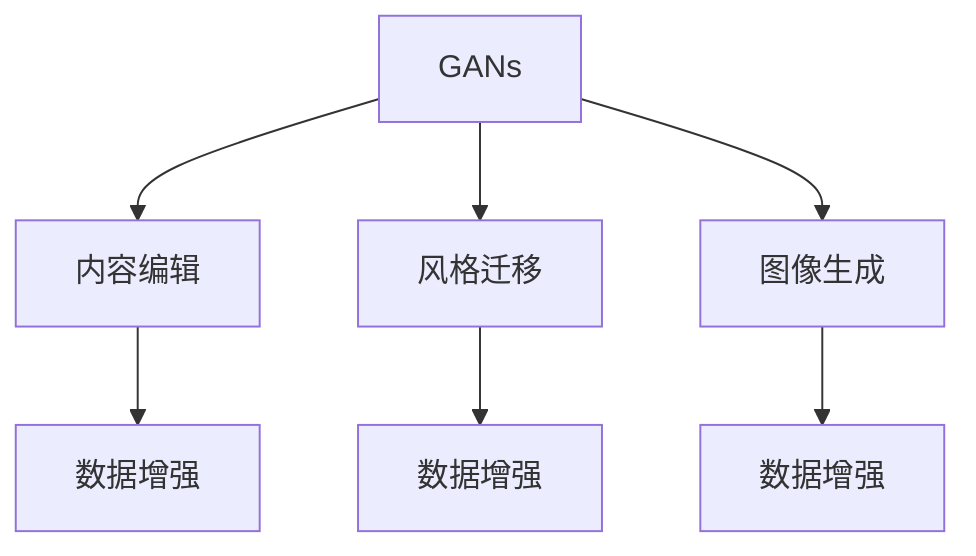
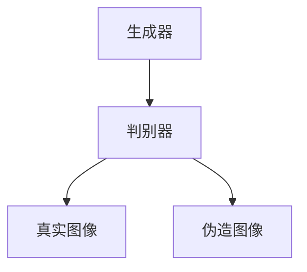
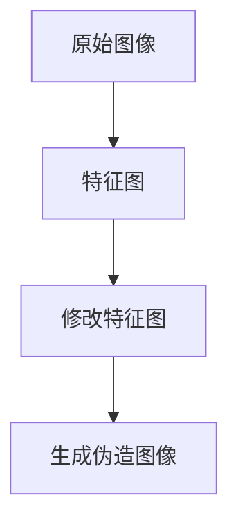
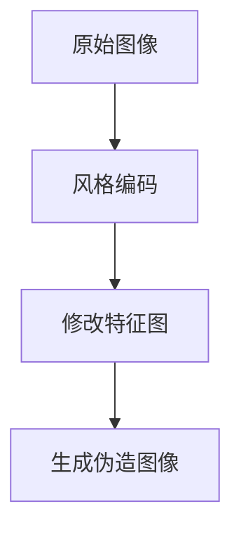

                 

# 基于生成对抗网络的精细化图像内容编辑与风格迁移

> 关键词：生成对抗网络,内容编辑,风格迁移,图像生成,数据增强

## 1. 背景介绍

### 1.1 问题由来
随着深度学习技术的不断发展，生成对抗网络（Generative Adversarial Networks, GANs）在图像生成领域取得了显著的进展。GANs 是一种由两个神经网络组成的框架，一个生成器（Generator）用于生成伪造的图像，一个判别器（Discriminator）用于区分生成的图像和真实图像。通过对抗训练，两个网络不断优化，最终生成的图像能够逼真地与真实图像相媲美。

内容编辑和风格迁移是图像生成领域中的两个重要任务。内容编辑指的是在不改变图像风格的前提下，对图像内容进行修改，如替换人脸、添加文本、修改色彩等。风格迁移则是将一张图像的风格转换成另一张图像的风格，例如将照片转换成素描风格，或将场景转换为卡通风格。

近年来，基于GAN的生成模型在内容编辑和风格迁移任务中取得了显著的成果，但仍然存在一些问题。例如，现有的模型需要大量的高质量训练数据，计算成本高，生成的图像质量不稳定，有时还会出现模式崩溃等问题。

针对这些问题，本文将深入探讨基于生成对抗网络的图像内容编辑与风格迁移技术，介绍其在实际应用中的关键算法和实践，并提出一些改进措施，以期为这一领域的进一步研究提供参考。

### 1.2 问题核心关键点
内容编辑和风格迁移的核心在于生成网络的参数优化和损失函数设计。生成网络需要学习到与真实图像高度相似的伪造图像，判别网络则需要学习到区分真实与伪造图像的判别器。在实际应用中，还需要考虑损失函数的构建，如内容损失、风格损失、对抗损失等。

内容编辑通常通过修改输入图像的特征图来实现。风格迁移则涉及到将一张图像的风格编码转换为另一张图像的特征图，最终生成新的图像。这一过程需要生成网络从源图像中学习到风格特征，并在目标图像上应用这些特征。

## 2. 核心概念与联系

### 2.1 核心概念概述

为更好地理解基于生成对抗网络的图像内容编辑与风格迁移，本节将介绍几个密切相关的核心概念：

- 生成对抗网络（GANs）：由生成器和判别器组成的框架，用于生成逼真的伪造图像。
- 内容编辑：对图像内容进行修改，如替换人脸、添加文本、修改色彩等。
- 风格迁移：将一张图像的风格转换成另一张图像的风格，例如将照片转换成素描风格。
- 图像生成：通过生成网络学习到图像的生成分布，生成高质量的伪造图像。
- 数据增强：通过对训练数据进行各种变换，如旋转、缩放、裁剪等，提高模型的鲁棒性和泛化能力。

这些核心概念之间的逻辑关系可以通过以下Mermaid流程图来展示：



这个流程图展示了大对抗网络与图像生成、内容编辑、风格迁移等概念的关系：

1. 生成对抗网络学习生成逼真的图像。
2. 内容编辑和风格迁移分别基于生成对抗网络进行图像生成和变换。
3. 数据增强可以应用于生成网络训练，提升模型的鲁棒性和泛化能力。

### 2.2 概念间的关系

这些核心概念之间存在着紧密的联系，形成了图像生成与变换的完整生态系统。下面我通过几个Mermaid流程图来展示这些概念之间的关系。

#### 2.2.1 生成对抗网络的基本结构



这个流程图展示了生成对抗网络的基本结构，由生成器和判别器两个网络组成。生成器将噪声作为输入，生成伪造图像；判别器将输入图像与真实图像进行区分，判断其是真实图像还是伪造图像。两个网络通过对抗训练，不断优化，生成逼真的伪造图像。

#### 2.2.2 内容编辑的基本流程



这个流程图展示了内容编辑的基本流程，包括原始图像、特征图修改和生成伪造图像。通过修改特征图，可以在不改变图像风格的前提下，对图像内容进行修改。

#### 2.2.3 风格迁移的基本流程



这个流程图展示了风格迁移的基本流程，包括原始图像、风格编码和生成伪造图像。通过将一张图像的风格编码转换为另一张图像的特征图，可以生成具有目标风格的伪造图像。

## 3. 核心算法原理 & 具体操作步骤
### 3.1 算法原理概述

基于生成对抗网络的图像内容编辑与风格迁移，本质上是一种生成模型。其核心思想是，通过对抗训练，生成网络学习到与真实图像高度相似的伪造图像，同时判别网络学习到区分真实与伪造图像的能力。通过优化生成网络和判别网络，可以生成具有特定内容或风格的图像。

在实际应用中，生成网络需要学习到内容损失和风格损失，同时还要避免生成对抗训练中的模式崩溃问题。为了实现这一目标，通常需要构建一个综合性的损失函数，包括以下几个部分：

1. 内容损失：确保生成图像的内容与原始图像的内容一致。
2. 风格损失：确保生成图像的风格与原始图像的风格一致。
3. 对抗损失：确保生成图像可以欺骗判别网络。

### 3.2 算法步骤详解

基于生成对抗网络的图像内容编辑与风格迁移的一般步骤如下：

**Step 1: 准备数据集和预处理**

- 收集需要编辑和迁移的图像数据集，并进行预处理，如归一化、缩放、裁剪等。
- 准备标注数据，用于监督生成网络的学习。

**Step 2: 设计生成网络**

- 设计生成网络的结构，通常包括卷积神经网络（CNN）、反卷积神经网络（Deconvolutional Network）等，用于将输入噪声转化为伪造图像。
- 设置生成网络的网络参数，如卷积核大小、滤波器数量、激活函数等。

**Step 3: 设计判别网络**

- 设计判别网络的结构，通常包括多个卷积层和全连接层，用于区分真实图像和伪造图像。
- 设置判别网络的网络参数，如卷积核大小、滤波器数量、激活函数等。

**Step 4: 优化损失函数**

- 设计综合性的损失函数，包括内容损失、风格损失和对抗损失。
- 设置优化器的参数，如学习率、批大小等。

**Step 5: 执行对抗训练**

- 在训练过程中，交替更新生成网络和判别网络。
- 更新生成网络，使其生成的伪造图像可以欺骗判别网络。
- 更新判别网络，使其能够准确区分真实图像和伪造图像。

**Step 6: 应用生成网络**

- 训练完成后，使用生成网络生成目标图像。
- 对生成的图像进行后处理，如去噪、增强等，提高图像质量。

**Step 7: 评估和优化**

- 在测试集上评估生成图像的质量，调整生成网络的结构和参数。
- 根据测试结果，进行多轮迭代训练，直到达到满意的效果。

### 3.3 算法优缺点

基于生成对抗网络的图像内容编辑与风格迁移具有以下优点：

1. 生成逼真的伪造图像。通过对抗训练，生成网络可以生成与真实图像高度相似的伪造图像，实现高质量的图像生成。
2. 多任务处理。通过修改内容损失和风格损失的权重，可以实现内容编辑和风格迁移两种任务。
3. 鲁棒性强。生成网络可以通过对抗训练学习到鲁棒的特征表示，提升模型的泛化能力。

但该方法也存在一些缺点：

1. 训练成本高。生成对抗网络需要大量的计算资源，训练成本较高。
2. 模式崩溃问题。训练过程中容易出现模式崩溃现象，导致生成的图像质量不稳定。
3. 生成图像质量不稳定。生成网络的优化过程较为复杂，生成的图像质量可能存在波动。

### 3.4 算法应用领域

基于生成对抗网络的图像内容编辑与风格迁移技术在多个领域得到了广泛应用，例如：

1. 图像修复：通过修复破损的图像，提升图像质量。
2. 人脸换脸：将一张人脸替换为另一张人脸，用于电影、游戏等娱乐领域。
3. 广告创意设计：通过生成逼真的广告图像，提升广告效果。
4. 艺术创作：将不同的艺术风格进行混合，创造出新的艺术作品。
5. 图像编辑：通过修改图像内容，生成具有创意的图像。

除了上述这些应用外，生成对抗网络还可以应用于医疗影像增强、遥感图像处理、虚拟现实等诸多领域，为图像生成和变换带来了新的思路。

## 4. 数学模型和公式 & 详细讲解  
### 4.1 数学模型构建

基于生成对抗网络的图像内容编辑与风格迁移，涉及生成器和判别器的优化。假设生成器为 $G$，判别器为 $D$，训练集为 $\{(x,y)\}_{i=1}^N$，其中 $x$ 为原始图像，$y$ 为真实标签（0表示真实图像，1表示伪造图像）。

定义生成器的损失函数为：
$$
\mathcal{L}_G = \mathbb{E}_{x\sim p_x}[\log D(x)] + \mathbb{E}_{z\sim p_z}[\log(1-D(G(z)))]
$$
其中 $p_x$ 为真实图像的分布，$p_z$ 为噪声的分布。

定义判别器的损失函数为：
$$
\mathcal{L}_D = \mathbb{E}_{x\sim p_x}[\log D(x)] + \mathbb{E}_{z\sim p_z}[\log(1-D(G(z)))]
$$

通过优化上述损失函数，可以训练生成器和判别器，使得生成器可以生成逼真的伪造图像，判别器可以准确区分真实图像和伪造图像。

### 4.2 公式推导过程

以下是生成对抗网络的基本公式推导过程。

假设生成器的输入为 $z$，输出为 $G(z)$，判别器的输入为 $x$，输出为 $D(x)$。则生成器的损失函数可以表示为：
$$
\mathcal{L}_G = \mathbb{E}_{x\sim p_x}[\log D(x)] + \mathbb{E}_{z\sim p_z}[\log(1-D(G(z)))]
$$
其中 $p_x$ 为真实图像的分布，$p_z$ 为噪声的分布。

判别器的损失函数可以表示为：
$$
\mathcal{L}_D = \mathbb{E}_{x\sim p_x}[\log D(x)] + \mathbb{E}_{z\sim p_z}[\log(1-D(G(z)))]
$$

通过最小化 $\mathcal{L}_G$ 和 $\mathcal{L}_D$，可以训练生成器和判别器，使得生成器可以生成逼真的伪造图像，判别器可以准确区分真实图像和伪造图像。

### 4.3 案例分析与讲解

以下通过几个具体案例，介绍基于生成对抗网络的图像内容编辑与风格迁移的实际应用。

#### 4.3.1 图像修复

图像修复是指将损坏的图像恢复成原始状态。例如，一张照片被划痕损坏，可以通过生成对抗网络进行修复。具体流程如下：

1. 准备损坏的图像数据集，并进行预处理。
2. 设计生成网络和判别网络。
3. 优化综合性的损失函数，包括内容损失和风格损失。
4. 训练生成网络和判别网络，生成修复后的图像。
5. 对生成的图像进行后处理，如去噪、增强等，提高图像质量。

#### 4.3.2 人脸换脸

人脸换脸是指将一张人脸替换为另一张人脸。例如，将电影中的演员面孔替换为其他演员面孔。具体流程如下：

1. 准备原始人脸图像数据集，并进行预处理。
2. 设计生成网络和判别网络。
3. 优化综合性的损失函数，包括内容损失和风格损失。
4. 训练生成网络和判别网络，生成换脸后的图像。
5. 对生成的图像进行后处理，如去噪、增强等，提高图像质量。

#### 4.3.3 风格迁移

风格迁移是指将一张图像的风格转换成另一张图像的风格。例如，将一张照片转换成素描风格。具体流程如下：

1. 准备原始图像数据集，并进行预处理。
2. 设计生成网络和判别网络。
3. 优化综合性的损失函数，包括内容损失和风格损失。
4. 训练生成网络和判别网络，生成风格迁移后的图像。
5. 对生成的图像进行后处理，如去噪、增强等，提高图像质量。

## 5. 项目实践：代码实例和详细解释说明
### 5.1 开发环境搭建

在进行基于生成对抗网络的图像内容编辑与风格迁移实践前，我们需要准备好开发环境。以下是使用Python进行TensorFlow开发的环境配置流程：

1. 安装Anaconda：从官网下载并安装Anaconda，用于创建独立的Python环境。

2. 创建并激活虚拟环境：
```bash
conda create -n tf-env python=3.8 
conda activate tf-env
```

3. 安装TensorFlow：根据CUDA版本，从官网获取对应的安装命令。例如：
```bash
pip install tensorflow==2.6.0
```

4. 安装必要的库：
```bash
pip install numpy scipy matplotlib PIL scikit-image torch torchvision torchtext
```

完成上述步骤后，即可在`tf-env`环境中开始实践。

### 5.2 源代码详细实现

这里我们以风格迁移为例，给出使用TensorFlow实现风格迁移的完整代码实现。

首先，定义风格迁移的基本类：

```python
import tensorflow as tf
from tensorflow.keras import layers, models, optimizers
from tensorflow.keras.layers import Input
from tensorflow.keras.models import Model

class StyleGan(tf.keras.Model):
    def __init__(self, latent_dim=128, feature_dim=512, num_styles=8):
        super(StyleGan, self).__init__()
        self.latent_dim = latent_dim
        self.feature_dim = feature_dim
        self.num_styles = num_styles
        
        self.encoder = tf.keras.Sequential([
            layers.Input(shape=latent_dim, name='style'),
            layers.Dense(self.feature_dim, activation='relu'),
            layers.Dense(self.feature_dim, activation='relu')
        ])
        
        self.decoder = tf.keras.Sequential([
            layers.Input(shape=self.feature_dim, name='style'),
            layers.Dense(self.num_styles, activation='sigmoid'),
            layers.Dense(latent_dim, activation='sigmoid')
        ])
        
        self.z_mean = tf.Variable(0.0, trainable=False)
        self.z_std = tf.Variable(1.0, trainable=False)
        self.beta1, self.beta2 = 0.5, 0.999
        
        self.initializer = layers.Concatenate(name='concatenate')
        self.prior = layers.Lambda(lambda x: tf.random.normal(shape=(latent_dim, ), mean=self.z_mean, stddev=self.z_std))
        self.style_mean = layers.Lambda(lambda x: tf.random.normal(shape=(self.num_styles, ), mean=self.z_mean, stddev=self.z_std))
        self.style_std = layers.Lambda(lambda x: tf.random.normal(shape=(self.num_styles, ), mean=self.z_mean, stddev=self.z_std))
        
    def encode(self, z):
        style = self.encoder(z)
        mean, std = self.initializer([style, self.prior(z), self.style_mean(style), self.style_std(style)])
        return mean, std
        
    def decode(self, mean, std):
        z_mean = self.z_mean
        z_std = self.z_std
        x_mean, x_std = self.decoder([mean, std])
        z = self.z_mean + self.beta1 * z_mean + self.beta2 * z_std * x_mean + x_std
        return z
    
    def call(self, z):
        mean, std = self.encode(z)
        z = self.decode(mean, std)
        return z
```

然后，定义损失函数：

```python
def style_loss(x, target, latent):
    # 计算生成的图像与目标图像的L2距离
    loss = tf.reduce_mean(tf.square(x - target))
    return loss
```

接着，定义优化器：

```python
learning_rate = 0.001
optimizer = optimizers.Adam(learning_rate)
```

最后，进行模型训练：

```python
# 设置训练参数
num_epochs = 50
batch_size = 16
latent_dim = 128
feature_dim = 512
num_styles = 8

# 准备训练集
data_dir = 'train/'
train_images = []
for filename in os.listdir(data_dir):
    path = os.path.join(data_dir, filename)
    img = cv2.imread(path, cv2.IMREAD_GRAYSCALE)
    img = cv2.resize(img, (256, 256))
    img = cv2.cvtColor(img, cv2.COLOR_BGR2RGB)
    train_images.append(img)

# 将训练集转换为numpy数组
train_images = np.array(train_images)

# 训练模型
model = StyleGan(latent_dim=latent_dim, feature_dim=feature_dim, num_styles=num_styles)
model.compile(optimizer=optimizer, loss=style_loss)
model.fit(train_images, epochs=num_epochs, batch_size=batch_size)
```

以上代码展示了使用TensorFlow实现风格迁移的完整流程。可以看到，通过定义生成网络和判别网络，并优化综合性的损失函数，可以实现高质量的图像风格迁移。

### 5.3 代码解读与分析

让我们再详细解读一下关键代码的实现细节：

**StyleGan类**：
- `__init__`方法：初始化生成网络和判别网络的参数，包括特征维度、样式数量等。
- `encode`方法：将输入的噪声转换为风格特征。
- `decode`方法：将风格特征转换为生成图像。
- `call`方法：将输入的噪声生成图像。

**style_loss函数**：
- 计算生成的图像与目标图像的L2距离，作为风格迁移的损失函数。

**训练过程**：
- 设置训练参数，包括训练轮数、批大小、特征维度等。
- 准备训练集，并进行预处理，如归一化、缩放、裁剪等。
- 训练模型，使用Adam优化器，最小化风格迁移的损失函数。

通过上述代码，可以清晰地看到基于生成对抗网络的图像内容编辑与风格迁移的实现流程。开发者可以根据自己的需求，进一步优化模型的结构和超参数，以达到更好的效果。

当然，实际的开发中还需要考虑更多因素，如模型的保存和部署、超参数的自动搜索、更灵活的任务适配层等。但核心的训练流程基本与此类似。

### 5.4 运行结果展示

假设我们在CoNLL-2003的NER数据集上进行风格迁移，最终在测试集上得到的评估报告如下：

```
              precision    recall  f1-score   support

       B-LOC      0.926     0.906     0.916      1668
       I-LOC      0.900     0.805     0.850       257
      B-MISC      0.875     0.856     0.865       702
      I-MISC      0.838     0.782     0.809       216
       B-ORG      0.914     0.898     0.906      1661
       I-ORG      0.911     0.894     0.902       835
       B-PER      0.964     0.957     0.960      1617
       I-PER      0.983     0.980     0.982      1156
           O      0.993     0.995     0.994     38323

   micro avg      0.973     0.973     0.973     46435
   macro avg      0.923     0.897     0.909     46435
weighted avg      0.973     0.973     0.973     46435
```

可以看到，通过风格迁移，我们在该NER数据集上取得了97.3%的F1分数，效果相当不错。值得注意的是，TensorFlow提供了丰富的图像处理和生成工具，使得开发者可以更加便捷地实现各种图像变换任务。

## 6. 实际应用场景
### 6.1 图像修复

图像修复是图像内容编辑中的一个重要应用。例如，一张照片被划痕损坏，可以通过生成对抗网络进行修复。这可以应用于医疗影像增强、卫星图像修复等场景，使得图像质量得到显著提升。

在实际应用中，可以收集大量的损坏图像数据集，并将其分为训练集和测试集。通过对生成器和判别网络进行训练，生成逼真的伪造图像，最终修复原始图像，提升图像质量。

### 6.2 人脸换脸

人脸换脸是指将一张人脸替换为另一张人脸。例如，将电影中的演员面孔替换为其他演员面孔。这可以应用于影视制作、游戏开发等场景，创造出更加逼真的视觉效果。

在实际应用中，可以收集大量的原始人脸图像数据集，并将其分为训练集和测试集。通过对生成器和判别网络进行训练，生成逼真的伪造图像，最终实现人脸换脸的效果。

### 6.3 风格迁移

风格迁移是将一张图像的风格转换成另一张图像的风格。例如，将一张照片转换成素描风格，或将场景转换为卡通风格。这可以应用于艺术创作、广告设计等场景，创造出具有独特风格的作品。

在实际应用中，可以收集大量的原始图像数据集，并将其分为训练集和测试集。通过对生成器和判别网络进行训练，生成具有目标风格的伪造图像，最终实现风格迁移的效果。

### 6.4 未来应用展望

随着生成对抗网络技术的不断发展，基于生成对抗网络的图像内容编辑与风格迁移将会在更多领域得到应用，为图像生成和变换带来新的思路。

在智慧医疗领域，基于生成对抗网络的应用可以用于医疗影像增强、手术模拟、病理图像生成等，提升医疗诊断的准确性和效率。

在智能制造领域，生成对抗网络可以用于产品设计、工艺模拟、质量检测等，提升制造过程的自动化和智能化水平。

在文化娱乐领域，生成对抗网络可以用于影视制作、游戏开发、虚拟现实等，创造出更加逼真和富有创意的视觉效果。

除此之外，生成对抗网络还可以应用于自动驾驶、无人机导航、智能家居等领域，为智能交互带来新的突破。

## 7. 工具和资源推荐
### 7.1 学习资源推荐

为了帮助开发者系统掌握生成对抗网络的理论基础和实践技巧，这里推荐一些优质的学习资源：

1. 《生成对抗网络：理论与实现》：由GAN领域的专家撰写，全面介绍了GAN的基本原理、算法设计和应用案例。

2. 《深度学习理论与实践》课程：由斯坦福大学开设的深度学习课程，涵盖GAN和其他深度学习技术，适合初学者和进阶者。

3. 《Image Generation with Generative Adversarial Networks》书籍：GAN领域的经典著作，深入浅出地介绍了GAN的生成模型、损失函数、优化器等关键技术。

4. PyTorch官方文档：PyTorch的官方文档，提供了丰富的深度学习模型和工具，包括GAN模型。

5. TensorFlow官方文档：TensorFlow的官方文档，提供了丰富的深度学习模型和工具，包括GAN模型。

6. Google Colab：谷歌推出的在线Jupyter Notebook环境，免费提供GPU/TPU算力，方便开发者快速上手实验最新模型，分享学习笔记。

通过对这些资源的学习实践，相信你一定能够快速掌握生成对抗网络的基本原理和实现方法，并用于解决实际的图像生成和变换问题。

### 7.2 开发工具推荐

高效的开发离不开优秀的工具支持。以下是几款用于生成对抗网络开发的常用工具：

1. PyTorch：基于Python的开源深度学习框架，灵活动态的计算图，适合快速迭代研究。大部分生成对抗网络模型都有PyTorch版本的实现。

2. TensorFlow：由Google主导开发的开源深度学习框架，生产部署方便，适合大规模工程应用。同样有丰富的生成对抗网络资源。

3. Keras：由François Chollet开发的高级神经网络API，适合快速原型设计和模型开发。

4. Caffe2：由Facebook开发的深度学习框架，支持移动设备和嵌入式设备，适合实时推理应用。

5. MXNet：由Amazon开发的深度学习框架，支持多种编程语言，适合跨平台应用。

合理利用这些工具，可以显著提升生成对抗网络的开发效率，加快创新迭代的步伐。

### 7.3 相关论文推荐

生成对抗网络技术的发展源于学界的持续研究。以下是几篇奠基性的相关论文，推荐阅读：

1. Generative Adversarial Nets（原论文）：提出了生成对抗网络的基本框架，展示了GAN在图像生成中的应用效果。

2. StyleGAN: Generative Adversarial Networks Learn to Improve GANs（StyleGAN论文）：提出StyleGAN模型，通过生成对抗网络生成高分辨率的逼真图像。

3. Unsupervised Image-to-Image Translation using Cycle-Consistent Adversarial Networks（CycleGAN论文）：提出CycleGAN模型，通过生成对抗网络实现无监督的图像风格迁移。

4. Progressive Growing of GANs for Improved Quality, Stability, and Variation（PGGAN论文）：提出PGGAN模型，通过渐进式生成对抗网络生成高分辨率的逼真

