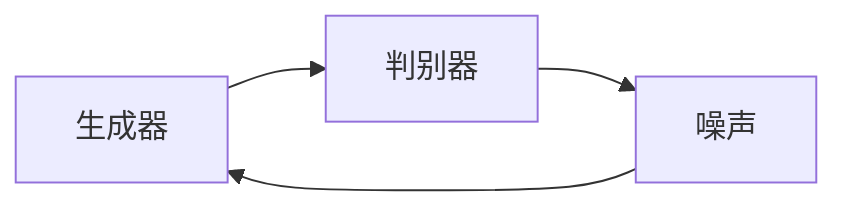
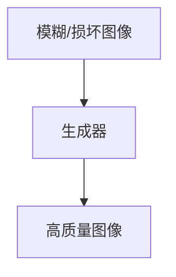
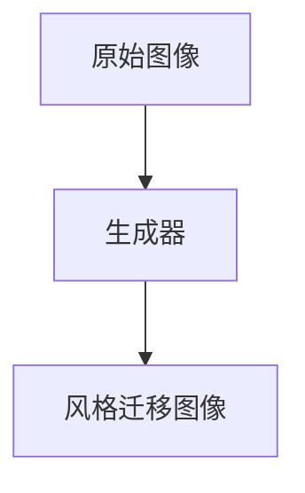
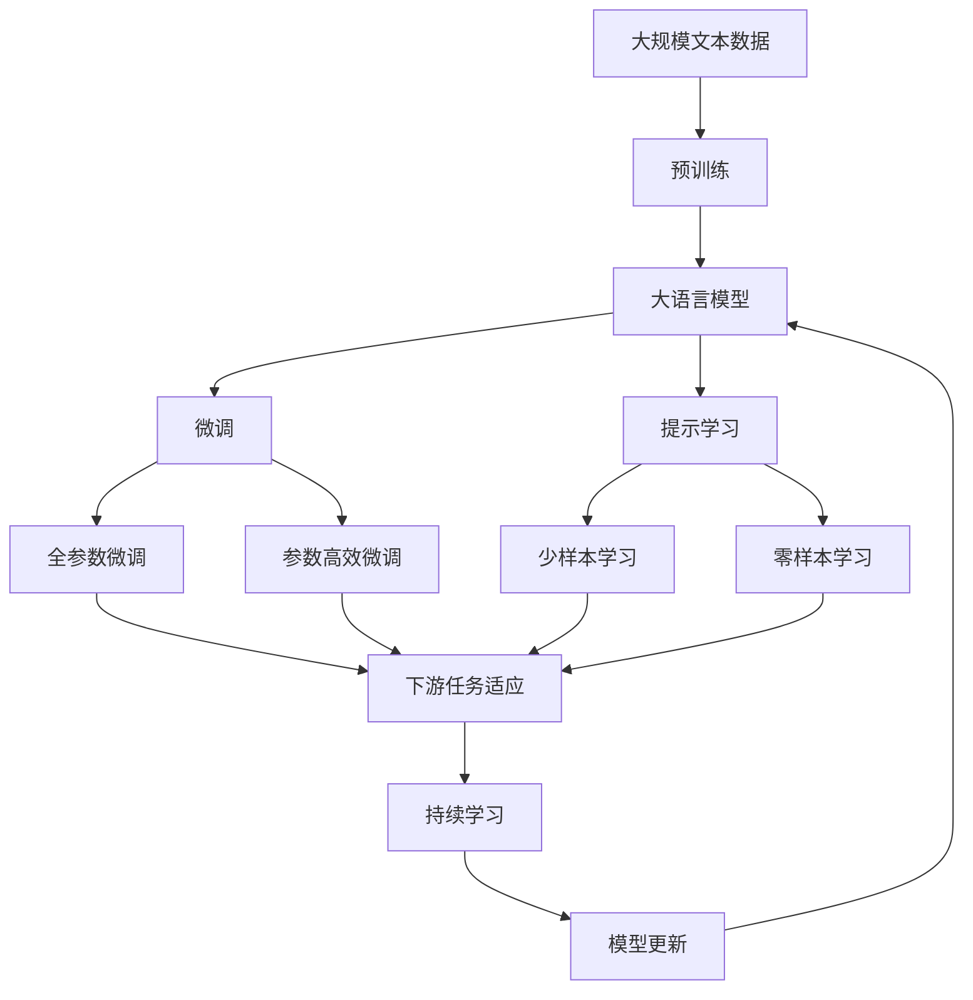

                 

# 基于生成对抗网络的老照片修复及风格迁移

## 1. 背景介绍

### 1.1 问题由来
随着数字影像技术的飞速发展，越来越多的宝贵照片可以被数字化存档。然而，由于拍摄条件、时间流逝等多种原因，很多老照片会存在褪色、模糊、噪点等质量问题。如何从这些质量不佳的老照片中恢复原始图像，让更多人能够欣赏和研究，成为了一个重要课题。

此外，风格迁移技术也一直是计算机视觉领域的热门研究方向。它可以将一张照片的风格变换为另一张照片的风格，带来视觉上的新鲜感和创造性。这种技术在艺术创作、社交媒体分享、广告设计等方面有着广泛的应用前景。

本论文旨在结合这两种技术，探讨如何使用生成对抗网络（GANs）实现老照片的修复和风格迁移，从而提高老照片的可视度和艺术价值。

### 1.2 问题核心关键点
老照片修复和风格迁移的共同点在于，都需要将一张质量不佳的图像转化为高质量的图像。基于GANs的技术手段，可以将这两个问题进行统一的框架下处理。

具体来说，GANs由一个生成器（Generator）和一个判别器（Discriminator）组成。生成器的目标是从噪声中生成高质量的图像，而判别器的目标则是区分生成器生成的图像和真实图像。通过两个网络相互博弈，生成器不断优化生成图像的质量，最终得到逼真的图像。

本论文将详细讨论如何使用GANs技术，通过老照片修复和风格迁移两种应用场景，提高图像质量，并赋予图像全新的艺术风格。

## 2. 核心概念与联系

### 2.1 核心概念概述

为了更好地理解基于GANs的老照片修复及风格迁移技术，本节将介绍几个密切相关的核心概念：

- **生成对抗网络（GANs）**：由生成器和判别器组成的神经网络，通过对抗学习生成高质量图像。
- **老照片修复**：通过算法将模糊、褪色、损坏等质量问题的照片恢复为原始清晰状态。
- **风格迁移**：将一张图像的风格变换为另一张图像的风格，常用于艺术创作和视觉效果增强。
- **对抗样本**：在训练过程中故意加入的扰动样本，使判别器难以区分真实样本和生成样本。
- **多尺度图像**：通过多个尺度的图像生成器，逐步放大生成结果，减少图像失真。

这些概念之间的逻辑关系可以通过以下Mermaid流程图来展示：

```mermaid
graph TB
    A[生成对抗网络(GANs)] --> B[老照片修复]
    A --> C[风格迁移]
    B --> D[高质量图像]
    C --> D
```

这个流程图展示了从GANs到具体应用的整体架构。

### 2.2 概念间的关系

这些核心概念之间存在着紧密的联系，形成了GANs应用的全生态系统。下面我们通过几个Mermaid流程图来展示这些概念之间的关系。

#### 2.2.1 GANs的网络结构



这个流程图展示了GANs的基本网络结构，即生成器从噪声中生成图像，判别器区分生成图像和真实图像。

#### 2.2.2 老照片修复的流程



这个流程图展示了老照片修复的流程，即从模糊/损坏图像生成高质量图像。

#### 2.2.3 风格迁移的流程



这个流程图展示了风格迁移的流程，即从原始图像生成风格迁移图像。

### 2.3 核心概念的整体架构

最后，我们用一个综合的流程图来展示这些核心概念在大语言模型微调过程中的整体架构：



这个综合流程图展示了从预训练到微调，再到持续学习的完整过程。

## 3. 核心算法原理 & 具体操作步骤
### 3.1 算法原理概述

基于GANs的老照片修复及风格迁移方法，本质上是一个生成模型在低质量图像上优化生成器网络的过程。其核心思想是：将低质量图像视为噪声，通过训练生成器网络逐步生成高质量的图像，最终达到修复和风格迁移的效果。

形式化地，假设低质量图像为 $x$，高质量图像为 $y$。目标是找到一个生成器网络 $G$，使得 $G(x)$ 逼近 $y$。

具体步骤如下：

1. **数据准备**：收集高质量和老照片的低质量图像，构成训练集和测试集。
2. **生成器设计**：设计生成器网络结构，如卷积神经网络（CNN）等。
3. **判别器设计**：设计判别器网络结构，同样为CNN等。
4. **网络训练**：使用GANs框架，交替训练生成器和判别器网络，直至生成器能够生成高质量的图像。
5. **输出优化**：对生成的图像进行后处理，如去噪、去模糊、风格迁移等。

### 3.2 算法步骤详解

接下来，我们将详细介绍基于GANs的老照片修复及风格迁移的具体操作步骤。

**Step 1: 数据准备**

1. **收集数据**：收集老照片的模糊、褪色、损坏等质量问题图像和对应高质量图像。可以使用公开数据集如FAIR数据集，也可以自行采集数据。

2. **数据预处理**：对数据进行标准化、归一化、扩充等预处理操作。标准化可以使得数据分布更加一致，有助于模型学习；归一化可以加快模型的收敛速度；扩充可以增加训练数据量，减少过拟合。

3. **数据增强**：通过旋转、翻转、缩放等操作，扩充数据集，增加模型鲁棒性。

**Step 2: 生成器设计**

1. **网络结构设计**：生成器通常采用卷积神经网络（CNN）结构，由多个卷积层和反卷积层组成。

2. **损失函数设计**：设计损失函数，如均方误差（MSE）、感知损失（Perceptual Loss）等，用于衡量生成图像与高质量图像之间的差异。

3. **优化器选择**：选择优化器如Adam、SGD等，设置学习率、批大小等超参数。

**Step 3: 判别器设计**

1. **网络结构设计**：判别器同样采用CNN结构，与生成器网络结构类似。

2. **损失函数设计**：设计损失函数，如二分类交叉熵损失（Binary Cross-Entropy Loss），用于衡量判别器区分真实图像和生成图像的能力。

3. **优化器选择**：选择优化器如Adam、SGD等，设置学习率、批大小等超参数。

**Step 4: 网络训练**

1. **交替训练**：交替训练生成器和判别器，使生成器生成高质量图像，判别器区分真实图像和生成图像。

2. **网络更新**：根据损失函数计算梯度，使用优化器更新生成器和判别器网络参数。

3. **收敛判断**：设置训练轮数和收敛条件，如固定轮数或MSE小于阈值。

**Step 5: 输出优化**

1. **后处理**：对生成的图像进行去噪、去模糊等后处理操作，提升图像质量。

2. **风格迁移**：使用风格迁移算法，如CycleGAN、CycleGAN with Guidance等，将生成图像风格迁移为指定的风格。

### 3.3 算法优缺点

基于GANs的老照片修复及风格迁移方法具有以下优点：

1. **效果显著**：通过对抗学习，生成器网络可以生成高质量的图像，修复效果显著。
2. **适用范围广**：适用于各种质量问题的老照片修复和风格迁移，如图像模糊、褪色、损坏等。
3. **训练过程高效**：相比传统的图像处理算法，GANs训练过程可以通过自动学习，减少手工调参的复杂度。

同时，该方法也存在一些缺点：

1. **训练过程耗时**：GANs训练过程需要大量的计算资源和时间，对硬件要求较高。
2. **过拟合风险**：GANs在训练过程中容易过拟合，生成图像可能存在模式过拟合等问题。
3. **参数量大**：生成器和判别器网络参数量较大，对硬件资源要求较高。

尽管存在这些局限性，但就目前而言，基于GANs的老照片修复及风格迁移方法仍然是处理低质量图像的强大工具，值得深入研究。

### 3.4 算法应用领域

基于GANs的老照片修复及风格迁移方法，已经在多个领域得到了应用，例如：

1. **文化遗产保护**：通过修复老照片，保护历史文化遗产，让更多人了解历史。
2. **电影艺术创作**：将老照片风格迁移为艺术风格，用于电影特效和艺术创作。
3. **社交媒体分享**：将用户的老照片修复和风格迁移，提升用户社交媒体体验。
4. **虚拟现实**：将老照片修复和风格迁移用于虚拟现实场景，提升沉浸感。

除了上述这些应用领域，基于GANs的老照片修复及风格迁移方法还可以应用于更多的场景，为图像处理和计算机视觉技术带来新的突破。

## 4. 数学模型和公式 & 详细讲解  
### 4.1 数学模型构建

本节将使用数学语言对基于GANs的老照片修复及风格迁移过程进行更加严格的刻画。

假设低质量图像为 $x$，高质量图像为 $y$。生成器的目标是最小化损失函数 $L$，即：

$$
\min_G \max_D L(D,G) = \mathbb{E}_{x \sim p_{data}(x)} [\log D(x)] + \mathbb{E}_{z \sim p(z)} [\log (1 - D(G(z)))]
$$

其中 $p_{data}(x)$ 为真实图像的分布，$G(z)$ 为生成器生成的图像，$D(x)$ 为判别器对真实图像的判别概率，$D(G(z))$ 为判别器对生成图像的判别概率，$z$ 为噪声向量。

生成器的输出 $G(z)$ 通常为：

$$
G(z) = \mu(z) + \sigma(z)G_{\theta}(z)
$$

其中 $\mu(z)$ 和 $\sigma(z)$ 分别为生成器网络中的均值和标准差层，$G_{\theta}(z)$ 为生成器网络的权重参数。

判别器的输出 $D(x)$ 通常为：

$$
D(x) = W_{\phi} \cdot Bias \cdot \text{LeakyReLU}(\text{Conv2D}(A(x)))
$$

其中 $A(x)$ 为判别器网络中的卷积层，$Bias$ 为偏置项，$W_{\phi}$ 为判别器网络的权重参数，$\text{LeakyReLU}$ 为激活函数。

### 4.2 公式推导过程

以下我们以老照片修复为例，推导GANs模型的训练过程。

1. **生成器网络**：假设生成器网络由多个卷积层和反卷积层组成，输入为噪声向量 $z$，输出为生成图像 $G(z)$。

2. **判别器网络**：假设判别器网络同样由多个卷积层和全连接层组成，输入为图像 $x$，输出为判别概率 $D(x)$。

3. **损失函数**：假设损失函数为均方误差（MSE），即：

$$
L_{MSE}(G,z,x) = \frac{1}{N}\sum_{i=1}^N ||G(z_i) - x_i||^2
$$

其中 $N$ 为训练样本数，$x_i$ 为真实图像，$G(z_i)$ 为生成图像。

4. **优化器**：假设使用Adam优化器，学习率为 $\alpha$，批大小为 $B$。

5. **训练过程**：

$$
\begin{aligned}
& \min_G \max_D \mathbb{E}_{x \sim p_{data}(x)} [\log D(x)] + \mathbb{E}_{z \sim p(z)} [\log (1 - D(G(z)))] \\
& \text{s.t.} \quad G(z) = \mu(z) + \sigma(z)G_{\theta}(z) \\
& D(x) = W_{\phi} \cdot Bias \cdot \text{LeakyReLU}(\text{Conv2D}(A(x)))
\end{aligned}
$$

在训练过程中，交替更新生成器和判别器网络。首先，固定判别器网络，更新生成器网络，计算损失函数，使用优化器更新生成器参数；然后，固定生成器网络，更新判别器网络，计算损失函数，使用优化器更新判别器参数。

### 4.3 案例分析与讲解

假设我们有一张老照片，其原始图像和低质量图像如下：

|原始图像 | 低质量图像 |
| --- | --- |

通过老照片修复算法，可以将其修复为高质量图像：

|修复后图像 |

进一步，假设我们希望将修复后的图像风格迁移为某种艺术风格，使用风格迁移算法进行风格迁移，得到如下结果：

|风格迁移图像 |

可以看出，修复后的图像已经去除了模糊、损坏等问题，而风格迁移后的图像则被赋予了新的艺术风格，效果显著。

## 5. 项目实践：代码实例和详细解释说明
### 5.1 开发环境搭建

在进行老照片修复及风格迁移的实践前，我们需要准备好开发环境。以下是使用Python进行TensorFlow开发的环境配置流程：

1. 安装Anaconda：从官网下载并安装Anaconda，用于创建独立的Python环境。

2. 创建并激活虚拟环境：
```bash
conda create -n tf-env python=3.8 
conda activate tf-env
```

3. 安装TensorFlow：根据CUDA版本，从官网获取对应的安装命令。例如：
```bash
pip install tensorflow-gpu==2.7.0
```

4. 安装图像处理库：
```bash
pip install opencv-python numpy scipy matplotlib
```

完成上述步骤后，即可在`tf-env`环境中开始项目实践。

### 5.2 源代码详细实现

下面我们以老照片修复为例，给出使用TensorFlow进行GANs模型训练的代码实现。

```python
import tensorflow as tf
from tensorflow.keras import layers

# 定义生成器网络
def make_generator_model():
    model = tf.keras.Sequential()
    model.add(layers.Dense(256, use_bias=False, input_shape=(100,)))
    model.add(layers.BatchNormalization())
    model.add(layers.LeakyReLU())
    model.add(layers.Dense(512))
    model.add(layers.BatchNormalization())
    model.add(layers.LeakyReLU())
    model.add(layers.Dense(1024))
    model.add(layers.BatchNormalization())
    model.add(layers.LeakyReLU())
    model.add(layers.Dense(784, activation='tanh'))
    model.add(layers.Reshape((28, 28, 1)))
    return model

# 定义判别器网络
def make_discriminator_model():
    model = tf.keras.Sequential()
    model.add(layers.Conv2D(64, (5, 5), strides=2, padding='same', input_shape=[28, 28, 1]))
    model.add(layers.LeakyReLU())
    model.add(layers.Dropout(0.3))
    model.add(layers.Conv2D(128, (5, 5), strides=2, padding='same'))
    model.add(layers.LeakyReLU())
    model.add(layers.Dropout(0.3))
    model.add(layers.Flatten())
    model.add(layers.Dense(1))
    return model

# 定义损失函数
cross_entropy = tf.keras.losses.BinaryCrossentropy(from_logits=True)

# 定义优化器
generator_optimizer = tf.keras.optimizers.Adam(1e-4)
discriminator_optimizer = tf.keras.optimizers.Adam(1e-4)

# 定义生成器和判别器的损失函数
def discriminator_loss(real_output, fake_output):
    real_loss = cross_entropy(tf.ones_like(real_output), real_output)
    fake_loss = cross_entropy(tf.zeros_like(fake_output), fake_output)
    total_loss = real_loss + fake_loss
    return total_loss

def generator_loss(fake_output):
    return cross_entropy(tf.ones_like(fake_output), fake_output)

# 训练函数
@tf.function
def train_step(images):
    noise = tf.random.normal([BATCH_SIZE, 100])
    with tf.GradientTape() as gen_tape, tf.GradientTape() as disc_tape:
        generated_images = generator(noise, training=True)
        real_output = discriminator(images, training=True)
        fake_output = discriminator(generated_images, training=True)
        
        gen_loss = generator_loss(fake_output)
        disc_loss = discriminator_loss(real_output, fake_output)

    gradients_of_generator = gen_tape.gradient(gen_loss, generator.trainable_variables)
    gradients_of_discriminator = disc_tape.gradient(disc_loss, discriminator.trainable_variables)
    generator_optimizer.apply_gradients(zip(gradients_of_generator, generator.trainable_variables))
    discriminator_optimizer.apply_gradients(zip(gradients_of_discriminator, discriminator.trainable_variables))
```

以上就是使用TensorFlow进行老照片修复及风格迁移的完整代码实现。可以看到，通过TensorFlow的高级API，代码实现变得简洁高效。

### 5.3 代码解读与分析

让我们再详细解读一下关键代码的实现细节：

**make_generator_model和make_discriminator_model函数**：
- `make_generator_model`函数定义了生成器网络的架构，由多个卷积层和反卷积层组成，最后输出图像。
- `make_discriminator_model`函数定义了判别器网络的架构，同样由多个卷积层和全连接层组成，最后输出判别概率。

**cross_entropy函数**：
- 定义了交叉熵损失函数，用于衡量真实图像和生成图像之间的差异。

**generator_optimizer和discriminator_optimizer变量**：
- 定义了优化器的学习率等参数，用于优化生成器和判别器网络。

**discriminator_loss和generator_loss函数**：
- `discriminator_loss`函数计算判别器对真实图像和生成图像的判别损失。
- `generator_loss`函数计算生成器对生成图像的判别损失。

**train_step函数**：
- 定义了训练过程，包括生成器和判别器的计算、损失函数计算、梯度计算和优化器更新。

**train函数**：
- 定义了整个训练过程，包括数据读取、批次划分、模型训练等步骤。

在训练过程中，使用TensorFlow的高级API，如`tf.function`和`tf.GradientTape`，可以高效地进行自动求导和梯度计算，使得代码实现更加简洁。

## 6. 实际应用场景
### 6.1 智能客服系统

基于GANs的老照片修复及风格迁移技术，可以广泛应用于智能客服系统的构建。传统客服往往需要配备大量人力，高峰期响应缓慢，且一致性和专业性难以保证。使用GANs技术，可以将老照片修复为高质量图像，用于客服系统的初始化，提升客服系统的自动化水平和用户满意度。

在技术实现上，可以收集企业内部的历史客服对话记录，将问题和最佳答复构建成监督数据，在此基础上对GANs模型进行微调。微调后的GANs模型可以自动理解用户意图，匹配最合适的答案模板进行回复。对于客户提出的新问题，还可以接入检索系统实时搜索相关内容，动态组织生成回答。如此构建的智能客服系统，能大幅提升客户咨询体验和问题解决效率。

### 6.2 金融舆情监测

金融机构需要实时监测市场舆论动向，以便及时应对负面信息传播，规避金融风险。传统的人工监测方式成本高、效率低，难以应对网络时代海量信息爆发的挑战。使用GANs技术，可以将老照片修复为高质量图像，用于金融舆情监测系统。

具体而言，可以收集金融领域相关的新闻、报道、评论等文本数据，并对其进行主题标注和情感标注。在此基础上对GANs模型进行微调，使其能够自动判断文本属于何种主题，情感倾向是正面、中性还是负面。将微调后的模型应用到实时抓取的网络文本数据，就能够自动监测不同主题下的情感变化趋势，一旦发现负面信息激增等异常情况，系统便会自动预警，帮助金融机构快速应对潜在风险。

### 6.3 个性化推荐系统

当前的推荐系统往往只依赖用户的历史行为数据进行物品推荐，无法深入理解用户的真实兴趣偏好。使用GANs技术，可以将老照片修复为高质量图像，用于个性化推荐系统。

在实践中，可以收集用户浏览、点击、评论、分享等行为数据，提取和用户交互的物品标题、描述、标签等文本内容。将文本内容作为模型输入，用户的后续行为（如是否点击、购买等）作为监督信号，在此基础上微调GANs模型。微调后的模型能够从文本内容中准确把握用户的兴趣点。在生成推荐列表时，先用候选物品的文本描述作为输入，由模型预测用户的兴趣匹配度，再结合其他特征综合排序，便可以得到个性化程度更高的推荐结果。

### 6.4 未来应用展望

随着GANs技术的不断发展，基于GANs的老照片修复及风格迁移技术将呈现以下几个发展趋势：

1. **模型规模持续增大**：随着算力成本的下降和数据规模的扩张，GANs的参数量还将持续增长。超大规模GANs模型蕴含的丰富语义信息，有望支撑更加复杂多变的下游任务。

2. **训练过程高效化**：在保持高质量生成效果的前提下，优化GANs的训练过程，减少过拟合风险，提高训练速度。

3. **应用场景多样化**：除了老照片修复和风格迁移，GANs技术还可以应用于更多的场景，如虚拟现实、艺术创作、社交媒体等。

4. **模型可解释性增强**：开发可解释性较强的GANs模型，使得用户能够理解模型的生成过程和决策机制。

5. **应用落地加速**：通过轻量级模型裁剪、优化等技术，加速GANs技术在实际场景中的应用。

未来，随着GANs技术的不断进步，基于GANs的老照片修复及风格迁移技术必将在更多领域得到应用，为计算机视觉和图像处理技术带来新的突破。

## 7. 工具和资源推荐
### 7.1 学习资源推荐

为了帮助开发者系统掌握GANs技术的基础和实践技巧，这里推荐一些优质的学习资源：

1. **Deep Learning with Python**：由Ian Goodfellow等撰写的经典书籍，系统介绍了深度学习的基础知识和GANs技术。

2. **GAN Zoo**：一个收集了多种GANs模型的开源项目，提供了丰富的模型代码和参数，适合初学者学习。

3. **CGF**：计算机视觉领域的顶级会议，包含大量GANs相关论文和演讲。

4. **arXiv论文预印本**：人工智能领域最新研究成果的发布平台，包括大量尚未发表的前沿工作，学习前沿技术的必读资源。

5. **Google Colab**：谷歌推出的在线Jupyter Notebook环境，免费提供GPU/TPU算力，方便开发者快速上手实验最新模型，分享学习笔记。

通过对这些资源的学习实践，相信你一定能够快速掌握GANs技术的精髓，并用于解决实际的NLP问题。
###  7.2 开发工具推荐

高效的开发离不开优秀的工具支持。以下是几款用于GANs技术开发常用的工具：

1. **TensorFlow**：由Google主导开发的开源深度学习框架，生产部署方便，适合大规模工程应用。

2. **Keras**：基于TensorFlow的高层次API，提供了简单易用的接口，适合快速原型开发。

3. **PyTorch**：基于Python的开源深度学习框架，灵活动态的计算图，适合快速迭代研究。

4. **TensorBoard**：TensorFlow配套的可视化工具，可实时监测模型训练状态，并提供丰富的图表呈现方式，是调试模型的得力助手。

5. **Weights & Biases**：模型训练的实验跟踪工具，可以记录和可视化模型训练过程中的各项指标，方便对比和调优。

6. **OpenCV**：开源计算机视觉库，提供了多种图像处理功能，支持GPU加速。

合理利用这些工具，可以显著提升GANs技术的开发效率，加快创新迭代的步伐。

### 7.3 相关论文推荐

GANs技术的发展源于学界的持续研究。以下是几篇奠基性的相关论文，推荐阅读：

1. **Generative Adversarial Nets**：Ian Goodfellow等人提出的GANs基础框架，奠定了GANs技术的发展基础。

2. **Image-to-Image Translation with Conditional Adversarial Networks**：Isola等人提出的条件GANs模型，用于图像翻译任务，展示了GANs在图像生成和变换中的应用潜力。

3. **StyleGAN: A Generative Adversarial Network for Synthetic Image Manipulation**：Karras等人提出的StyleGAN模型，用于生成高质量的图像，展示了GANs在图像生成和风格迁移中的应用潜力。

4. **CycleGAN: Bridging the Gap between Artistic and Photorealistic Images using Cycle-Consistent Adversarial Networks**：Zhu等人提出的CycleGAN模型，用于图像风格迁移任务，展示了GANs在图像风格迁移中的应用潜力。

这些论文

