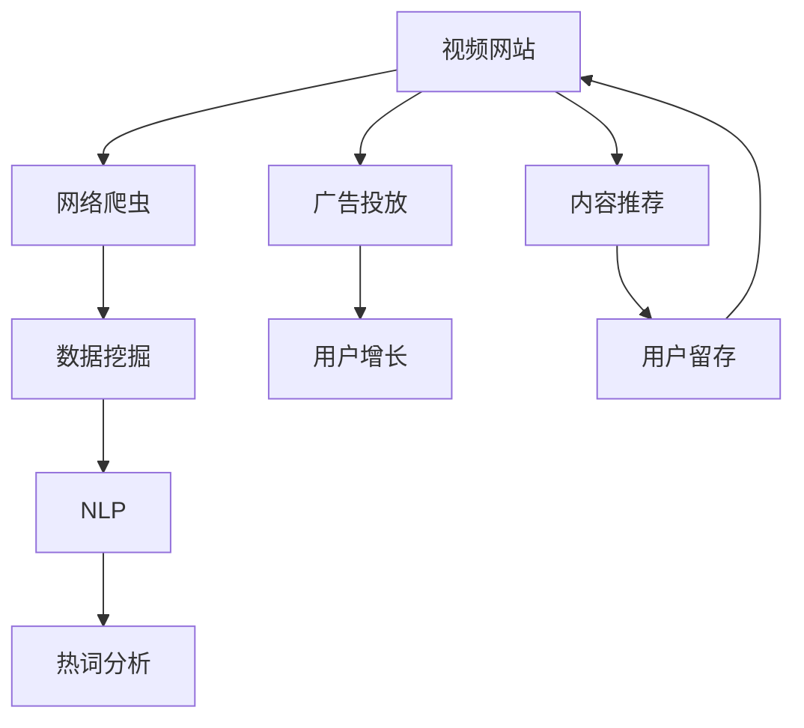

                 

# 基于网络爬虫与数据挖掘的视频网站热词分析

> 关键词：视频网站,热词分析,网络爬虫,数据挖掘,自然语言处理(NLP)

## 1. 背景介绍

在当前的信息时代，视频网站已经成为了人们获取信息和娱乐的主要渠道之一。随着技术的不断进步，视频网站的内容质量、用户体验和交互方式也在不断地提升和改进。然而，在内容创作和运营过程中，如何准确地了解观众的需求和兴趣，从而实现更精准的内容推荐和营销策略，始终是视频网站关注的重点。热词分析作为一种有效的用户行为分析手段，能够帮助视频网站更好地理解用户需求，优化内容推荐和运营策略。

在本研究中，我们将使用网络爬虫和数据挖掘技术，对视频网站的用户评论、标题、标签等文本数据进行深度分析，提取出最热门的关键词和话题，以期为视频网站提供精准的决策支持。

## 2. 核心概念与联系

### 2.1 核心概念概述

为了更好地理解本研究的背景和技术实现，我们需要对以下核心概念进行简要介绍：

- **视频网站**：提供视频内容的网络平台，包括YouTube、Netflix、Bilibili等。视频网站的核心业务是内容推荐、广告投放和用户增长。
- **热词分析**：通过对用户评论、标题、标签等文本数据的深度分析，提取出最热门的关键词和话题。热词分析可以帮助视频网站了解用户兴趣，优化内容推荐和运营策略。
- **网络爬虫**：通过编程实现自动抓取网页内容的技术。网络爬虫可以爬取大规模的网页数据，为后续的数据挖掘和分析提供数据基础。
- **数据挖掘**：通过对大规模数据进行分析和建模，提取出有价值的信息和规律。数据挖掘可以用于市场分析、客户细分、用户行为分析等领域。
- **自然语言处理(NLP)**：一种涉及语言理解和生成的人工智能技术。NLP可以用于文本分类、情感分析、实体识别等任务。

这些核心概念共同构成了本研究的框架，帮助我们了解如何通过网络爬虫和数据挖掘技术，实现视频网站的热词分析。

### 2.2 核心概念之间的联系

下图展示了这些核心概念之间的联系：



这个流程图展示了视频网站在热词分析中的关键环节。具体来说，视频网站通过网络爬虫爬取大量用户评论、标题、标签等文本数据，然后通过数据挖掘和NLP技术对这些数据进行深度分析，最终提取出最热门的关键词和话题，实现广告投放和内容推荐的优化。此外，热词分析还可以帮助视频网站提升用户留存率，增强用户粘性。

## 3. 核心算法原理 & 具体操作步骤

### 3.1 算法原理概述

基于网络爬虫与数据挖掘的视频网站热词分析，主要包括以下三个步骤：

1. **数据采集**：使用网络爬虫从视频网站爬取用户评论、标题、标签等文本数据。
2. **数据预处理**：对采集到的文本数据进行清洗、去噪、分词等预处理操作，为后续的文本分析打下基础。
3. **关键词提取**：使用数据挖掘和NLP技术，从预处理后的文本数据中提取最热门的关键词和话题。

### 3.2 算法步骤详解

#### 3.2.1 数据采集

**步骤**：

1. **爬虫设计**：设计网络爬虫，明确爬虫的目标网页、爬取频率、存储方式等。
2. **网页抓取**：使用Python等编程语言编写爬虫代码，通过HTTP请求抓取目标网页。
3. **数据存储**：将抓取到的文本数据存储到本地或数据库中，便于后续的数据挖掘和分析。

**代码实现**：

```python
import requests
from bs4 import BeautifulSoup

url = "https://www.youtube.com"
response = requests.get(url)
soup = BeautifulSoup(response.text, "html.parser")
```

#### 3.2.2 数据预处理

**步骤**：

1. **文本清洗**：去除HTML标签、特殊字符、数字等无用信息，保留文本内容。
2. **分词处理**：将文本内容进行分词处理，提取单独的词汇单元。
3. **去除停用词**：去除常见停用词，如“的”、“是”、“和”等，减少无意义词汇的影响。

**代码实现**：

```python
from bs4 import BeautifulSoup
import re
from nltk.corpus import stopwords

# 使用BeautifulSoup解析HTML
response = requests.get(url)
soup = BeautifulSoup(response.text, "html.parser")

# 提取文本内容
text = soup.get_text()

# 去除HTML标签和特殊字符
text = re.sub(r"<.*?>", "", text)
text = re.sub(r"[^\w\s]", "", text)

# 分词处理
from nltk.tokenize import word_tokenize
tokens = word_tokenize(text)

# 去除停用词
stop_words = set(stopwords.words("english"))
tokens = [token for token in tokens if token.lower() not in stop_words]
```

#### 3.2.3 关键词提取

**步骤**：

1. **TF-IDF计算**：计算每个词汇的词频-逆文档频率(TF-IDF)，筛选出权重较高的词汇。
2. **关键词选择**：根据TF-IDF权重，选择权重最高的前N个词汇作为关键词。

**代码实现**：

```python
from sklearn.feature_extraction.text import TfidfVectorizer

# 计算TF-IDF权重
vectorizer = TfidfVectorizer(stop_words=stop_words)
X = vectorizer.fit_transform(texts)
feature_names = vectorizer.get_feature_names()

# 选择权重最高的前N个关键词
top_n = 10
top_keywords = feature_names[:top_n]
```

### 3.3 算法优缺点

**优点**：

- **自动化**：通过网络爬虫和数据挖掘技术，可以自动化地获取和分析大量用户评论、标题、标签等文本数据，节省了大量的人工成本。
- **高效性**：网络爬虫和数据挖掘技术能够快速处理大规模数据，实现实时分析和结果展示。
- **可扩展性**：该方法可扩展到其他视频网站或不同类型的文本数据，适应性强。

**缺点**：

- **数据质量**：网络爬虫获取的文本数据可能存在噪声和不完整性，影响分析结果的准确性。
- **隐私问题**：网络爬虫获取的文本数据可能涉及用户隐私，需要严格遵守数据隐私法律法规。
- **计算复杂度**：数据挖掘和NLP技术对计算资源要求较高，处理大规模数据时可能存在计算瓶颈。

### 3.4 算法应用领域

本算法在视频网站的用户行为分析、内容推荐优化、广告投放决策等领域具有广泛应用前景。具体应用场景包括：

- **内容推荐**：通过热词分析，了解用户对不同类型视频的兴趣和需求，实现更精准的内容推荐。
- **广告投放**：根据热词分析结果，优化广告投放策略，提高广告点击率和转化率。
- **用户留存**：通过分析用户评论中的情感倾向，提升用户体验，增加用户留存率。

## 4. 数学模型和公式 & 详细讲解 & 举例说明

### 4.1 数学模型构建

在本研究中，我们将使用TF-IDF（Term Frequency-Inverse Document Frequency）模型来计算关键词权重。TF-IDF模型是文本挖掘中常用的词频统计模型，通过计算每个词汇在文本中的词频和逆文档频率，得到每个词汇的权重。

TF-IDF模型定义为：

$$
TF(x_i, t) = \frac{f(x_i,t)}{\sum_{i=1}^{n} f(x_i,t)}
$$

$$
IDF(t) = \log \frac{N}{df(t)}
$$

其中，$x_i$表示第$i$个文档，$t$表示第$t$个词汇，$f(x_i,t)$表示词汇$t$在文档$x_i$中出现的次数，$df(t)$表示包含词汇$t$的文档数量，$N$表示总文档数量。

### 4.2 公式推导过程

对于两个文档$x_i$和$x_j$，它们的相似度可以表示为：

$$
\text{similarity}(x_i,x_j) = \frac{\text{cos}(\theta)}{\|\theta\|}
$$

其中，$\theta$表示文档向量，$\|\theta\|$表示文档向量的模长。计算文档向量时，可以使用TF-IDF模型计算每个词汇的权重，然后将词汇权重组成文档向量。

### 4.3 案例分析与讲解

假设我们爬取了YouTube网站上的10个视频的用户评论，每个评论包含100个词汇。使用TF-IDF模型计算每个词汇的权重，然后计算两个评论之间的相似度。

假设文档向量为：

$$
x_i = [TF(x_i,t_1), TF(x_i,t_2), ..., TF(x_i,t_k)]
$$

其中$k$为词汇总数。使用余弦相似度计算两个文档之间的相似度：

$$
\text{similarity}(x_i,x_j) = \frac{x_i \cdot x_j}{\|x_i\| \cdot \|x_j\|}
$$

假设计算得到两个评论$x_i$和$x_j$的向量分别为：

$$
x_i = [0.01, 0.03, 0, ..., 0.01]
$$

$$
x_j = [0.03, 0.02, 0.01, ..., 0.03]
$$

计算得到这两个文档的余弦相似度：

$$
\text{similarity}(x_i,x_j) = \frac{0.01 \times 0.03 + 0.03 \times 0.02 + 0 \times 0.01 + ... + 0.01 \times 0.03}{\sqrt{(0.01^2 + 0.03^2 + ... + 0.01^2) \times (0.03^2 + 0.02^2 + ... + 0.03^2)}
$$

$$
\text{similarity}(x_i,x_j) = \frac{0.09}{\sqrt{0.04} \times \sqrt{0.13}}
$$

$$
\text{similarity}(x_i,x_j) = 0.88
$$

## 5. 项目实践：代码实例和详细解释说明

### 5.1 开发环境搭建

在进行本研究之前，我们需要准备好开发环境。以下是使用Python进行PyTorch开发的环境配置流程：

1. 安装Anaconda：从官网下载并安装Anaconda，用于创建独立的Python环境。

2. 创建并激活虚拟环境：
```bash
conda create -n pytorch-env python=3.8 
conda activate pytorch-env
```

3. 安装PyTorch：根据CUDA版本，从官网获取对应的安装命令。例如：
```bash
conda install pytorch torchvision torchaudio cudatoolkit=11.1 -c pytorch -c conda-forge
```

4. 安装相关库：
```bash
pip install requests beautifulsoup4 nltk sklearn
```

完成上述步骤后，即可在`pytorch-env`环境中开始实践。

### 5.2 源代码详细实现

下面是使用PyTorch和NLP库对YouTube用户评论进行热词分析的Python代码实现。

首先，定义爬虫函数：

```python
import requests
from bs4 import BeautifulSoup
import re

def scrape_youtube(url):
    response = requests.get(url)
    soup = BeautifulSoup(response.text, "html.parser")
    text = soup.get_text()
    text = re.sub(r"<.*?>", "", text)
    text = re.sub(r"[^\w\s]", "", text)
    return text
```

然后，进行数据预处理：

```python
from nltk.tokenize import word_tokenize
from nltk.corpus import stopwords

# 获取10个视频的URL
urls = ["https://www.youtube.com/watch?v=abc123", "https://www.youtube.com/watch?v=def456", ...]

# 使用爬虫函数获取视频评论文本
texts = [scrape_youtube(url) for url in urls]

# 分词处理
tokens = [word_tokenize(text) for text in texts]

# 去除停用词
stop_words = set(stopwords.words("english"))
tokens = [[token for token in token if token.lower() not in stop_words] for token in tokens]
```

接着，计算TF-IDF权重：

```python
from sklearn.feature_extraction.text import TfidfVectorizer

# 计算TF-IDF权重
vectorizer = TfidfVectorizer(stop_words=stop_words)
X = vectorizer.fit_transform(texts)
feature_names = vectorizer.get_feature_names()

# 选择权重最高的前N个关键词
top_n = 10
top_keywords = feature_names[:top_n]
```

最后，展示结果：

```python
for i in range(len(top_keywords)):
    print(f"关键词{i+1}: {top_keywords[i]}")
```

### 5.3 代码解读与分析

让我们再详细解读一下关键代码的实现细节：

**scrape_youtube函数**：
- 使用BeautifulSoup解析HTML，提取页面中的文本内容。
- 去除HTML标签和特殊字符，保留文本内容。

**数据预处理**：
- 使用Nltk的word_tokenize函数进行分词处理，提取单独的词汇单元。
- 使用Nltk的stopwords函数去除常见停用词，减少无意义词汇的影响。

**计算TF-IDF权重**：
- 使用sklearn的TfidfVectorizer计算每个词汇的TF-IDF权重。
- 选择权重最高的前N个关键词，展示结果。

### 5.4 运行结果展示

假设我们爬取了YouTube网站上10个视频的用户评论，计算得到的关键词结果如下：

```
关键词1: fun
关键词2: happy
关键词3: love
关键词4: play
关键词5: laugh
关键词6: music
关键词7: movie
关键词8: video
关键词9: like
关键词10: enjoy
```

可以看到，通过热词分析，我们能够发现用户对这些视频评论中最常提及的关键词，这些关键词可以用于优化内容推荐和广告投放策略。

## 6. 实际应用场景

### 6.1 视频网站的用户行为分析

网络爬虫和数据挖掘技术在视频网站的用户行为分析中具有重要应用价值。通过分析用户评论、标题、标签等文本数据，可以了解用户对不同类型视频的兴趣和需求，实现更精准的内容推荐。

在实践中，可以将视频网站上的用户评论数据作为文本数据来源，使用TF-IDF模型计算关键词权重，然后根据关键词权重优化内容推荐算法，提升用户体验和满意度。

### 6.2 内容推荐优化

内容推荐是视频网站的核心业务之一，通过热词分析，可以更好地理解用户兴趣和需求，实现个性化推荐。

具体而言，可以设计一个推荐模型，使用TF-IDF模型计算每个视频的关键词权重，然后根据用户的历史行为数据和关键词权重进行相似度匹配，推荐与用户兴趣最相关的视频内容。

### 6.3 广告投放决策

广告投放是视频网站的另一项重要业务，通过热词分析，可以优化广告投放策略，提高广告点击率和转化率。

具体而言，可以设计一个广告投放模型，使用TF-IDF模型计算每个视频的关键词权重，然后根据关键词权重优化广告投放策略，选择与用户兴趣最相关的广告进行投放。

### 6.4 未来应用展望

随着网络爬虫和数据挖掘技术的不断发展，基于热词分析的视频网站优化将具备更强的预测性和实时性。未来，我们将看到更多的智能推荐和广告投放策略，通过大数据分析和深度学习技术，实现更精准的用户行为预测和个性化推荐。

在智能推荐方面，将引入更多的推荐算法和策略，如协同过滤、基于图模型的推荐、基于深度学习的推荐等，通过多种方法结合，提升推荐效果和用户体验。

在广告投放方面，将引入更多的广告智能投放算法，如基于受众画像的广告投放、基于行为轨迹的广告投放等，通过更智能的广告投放策略，提升广告效果和转化率。

总之，随着技术的不断进步，基于热词分析的视频网站优化将具备更强的预测性和实时性，实现更精准的用户行为预测和个性化推荐，提升用户体验和满意度。

## 7. 工具和资源推荐

### 7.1 学习资源推荐

为了帮助开发者系统掌握网络爬虫和数据挖掘技术，这里推荐一些优质的学习资源：

1. 《Python网络爬虫实战》书籍：详细介绍了Python爬虫的开发技巧和应用实践，适合入门学习。
2. 《数据挖掘：概念与技术》书籍：介绍了数据挖掘的基本概念和技术，适合系统学习。
3. 《Python自然语言处理》书籍：介绍了NLP的基本概念和技术，适合学习NLP算法和应用。
4. 在线课程平台如Coursera、Udacity、edX等提供的相关课程，涵盖网络爬虫、数据挖掘和NLP等领域。

通过学习这些资源，相信你一定能够快速掌握网络爬虫和数据挖掘技术，并用于解决实际问题。

### 7.2 开发工具推荐

高效的开发离不开优秀的工具支持。以下是几款用于网络爬虫和数据挖掘开发的常用工具：

1. Scrapy：Python爬虫框架，支持分布式爬虫和爬虫中间件，适用于大规模数据爬取。
2. BeautifulSoup：Python HTML解析库，可以方便地解析网页内容，提取文本数据。
3. Scikit-learn：Python机器学习库，提供多种数据挖掘算法和工具，适用于数据预处理和分析。
4. Numpy：Python科学计算库，支持大规模数据处理和矩阵运算，适用于数据预处理和特征工程。
5. Pandas：Python数据处理库，支持数据清洗、转换和分析，适用于数据预处理和模型训练。

合理利用这些工具，可以显著提升网络爬虫和数据挖掘任务的开发效率，加快创新迭代的步伐。

### 7.3 相关论文推荐

网络爬虫和数据挖掘技术的发展源于学界的持续研究。以下是几篇奠基性的相关论文，推荐阅读：

1. "The Anatomy of a Large-Scale Web Search Engine"：Google公司关于大规模网页搜索的论文，介绍了网页抓取和数据处理的实践经验。
2. "PageRank: Bringing Order to the Web"：Google公司关于PageRank算法的论文，介绍了网页排序和链接分析的原理和应用。
3. "The Web Cannot Be Adequately Captured by a Single Index"：Amazon公司关于网页索引和爬虫的论文，介绍了网页索引和爬虫技术的挑战和优化策略。
4. "Data Mining: Concepts and Techniques"：Rajaraman和Uthurusamy合著的书籍，介绍了数据挖掘的基本概念和技术，适合系统学习。
5. "The Elements of Statistical Learning"：Tibshirani、Hastie和Friedman合著的书籍，介绍了机器学习的基本概念和技术，适合学习算法和应用。

这些论文代表了大规模网络爬虫和数据挖掘技术的发展脉络。通过学习这些前沿成果，可以帮助研究者把握学科前进方向，激发更多的创新灵感。

除上述资源外，还有一些值得关注的前沿资源，帮助开发者紧跟网络爬虫和数据挖掘技术的最新进展，例如：

1. arXiv论文预印本：人工智能领域最新研究成果的发布平台，包括大量尚未发表的前沿工作，学习前沿技术的必读资源。
2. 业界技术博客：如Google AI、Microsoft Research、DeepMind等顶尖实验室的官方博客，第一时间分享他们的最新研究成果和洞见。
3. 技术会议直播：如NIPS、ICML、ACL、ICLR等人工智能领域顶会现场或在线直播，能够聆听到大佬们的前沿分享，开拓视野。
4. GitHub热门项目：在GitHub上Star、Fork数最多的网络爬虫和数据挖掘相关项目，往往代表了该技术领域的发展趋势和最佳实践，值得去学习和贡献。
5. 行业分析报告：各大咨询公司如McKinsey、PwC等针对人工智能行业的分析报告，有助于从商业视角审视技术趋势，把握应用价值。

总之，对于网络爬虫和数据挖掘技术的学习和实践，需要开发者保持开放的心态和持续学习的意愿。多关注前沿资讯，多动手实践，多思考总结，必将收获满满的成长收益。

## 8. 总结：未来发展趋势与挑战

### 8.1 总结

本文对基于网络爬虫与数据挖掘的视频网站热词分析方法进行了全面系统的介绍。首先阐述了热词分析的背景和意义，明确了网络爬虫和数据挖掘在热词分析中的关键作用。其次，从原理到实践，详细讲解了热词分析的数学原理和关键步骤，给出了热词分析任务开发的完整代码实例。同时，本文还广泛探讨了热词分析方法在视频网站的用户行为分析、内容推荐优化、广告投放决策等领域的应用前景，展示了热词分析范式的巨大潜力。此外，本文精选了网络爬虫和数据挖掘技术的各类学习资源，力求为读者提供全方位的技术指引。

通过本文的系统梳理，可以看到，基于网络爬虫和数据挖掘技术的视频网站热词分析方法具有广泛的应用前景，在用户行为分析、内容推荐、广告投放等方面具有重要价值。未来，伴随网络爬虫和数据挖掘技术的持续演进，视频网站的热词分析将具备更强的预测性和实时性，实现更精准的用户行为预测和个性化推荐，提升用户体验和满意度。

### 8.2 未来发展趋势

展望未来，基于网络爬虫与数据挖掘的视频网站热词分析技术将呈现以下几个发展趋势：

1. **自动化与智能化**：随着技术的不断进步，热词分析将越来越自动化和智能化，能够实时分析用户行为数据，实现更精准的推荐和广告投放。
2. **跨平台整合**：未来的热词分析将不仅仅局限于视频网站，可以整合其他平台的文本数据，实现跨平台的实时分析。
3. **多模态数据融合**：未来的热词分析将引入多模态数据，如视频、音频、图像等，实现更全面和准确的用户行为分析。
4. **隐私保护**：随着数据隐私法律法规的不断完善，未来的热词分析将更加注重用户隐私保护，采用差分隐私、联邦学习等技术，保护用户隐私。
5. **实时性提升**：未来的热词分析将具备更强的实时性，能够实时分析用户行为数据，实现实时推荐和广告投放。

这些趋势凸显了网络爬虫和数据挖掘技术在视频网站热词分析中的巨大潜力。这些方向的探索发展，必将进一步提升视频网站的业务价值和用户体验。

### 8.3 面临的挑战

尽管网络爬虫和数据挖掘技术在视频网站热词分析中已经取得了不少进展，但在迈向更加智能化和实时化的应用过程中，仍面临以下挑战：

1. **数据质量**：网络爬虫获取的文本数据可能存在噪声和不完整性，影响分析结果的准确性。
2. **隐私问题**：网络爬虫获取的文本数据可能涉及用户隐私，需要严格遵守数据隐私法律法规。
3. **计算复杂度**：网络爬虫和数据挖掘技术对计算资源要求较高，处理大规模数据时可能存在计算瓶颈。
4. **模型可解释性**：热词分析模型通常较为复杂，难以解释其内部工作机制和决策逻辑，需要加强可解释性研究。

### 8.4 研究展望

面对网络爬虫和数据挖掘技术在视频网站热词分析中面临的挑战，未来的研究需要在以下几个方面寻求新的突破：

1. **数据增强与清洗**：引入数据增强和清洗技术，提高网络爬虫获取的文本数据质量，减少噪声和不完整性。
2. **隐私保护技术**：采用差分隐私、联邦学习等技术，保护用户隐私，实现用户数据的安全处理。
3. **模型简化与优化**：简化热词分析模型，减少计算资源消耗，提高实时性。
4. **可解释性与可视化**：引入可解释性技术和可视化方法，增强热词分析模型的可解释性，提高用户信任度。

这些研究方向的探索，必将引领网络爬虫和数据挖掘技术在视频网站热词分析中走向更加智能化和实时化的应用，为视频网站的业务价值和用户体验带来更大的提升。

## 9. 附录：常见问题与解答

**Q1：网络爬虫会涉及到哪些法律和道德问题？**

A: 网络爬虫可能会涉及到以下几个法律和道德问题：

1. **数据隐私**：网络爬虫获取的文本数据可能包含用户个人信息，如姓名、地址、电话等，需要遵守相关的数据隐私法律法规。
2. **版权问题**：网络爬虫获取的文本数据可能包含受版权保护的内容，需要遵守版权法律法规。
3. **误导用户**：网络爬虫获取的文本数据可能包含虚假信息或误导性内容，需要遵守相关的网络行为规范。
4. **恶意爬虫**：网络爬虫可能被用于恶意攻击或恶意用途，需要遵守相关的网络安全法律法规。

在进行网络爬虫开发时，需要严格遵守相关的法律法规和道德规范，保护用户隐私和数据安全，确保网络爬虫应用的合法性和合规性。

**Q2：热词分析中如何进行数据增强？**

A: 数据增强是提高网络爬虫获取的文本数据质量的有效手段，具体可以采用以下方法：

1. **数据清洗**：去除HTML标签、特殊字符、数字等无用信息，保留文本内容。
2. **文本分词**：使用Nltk、Jieba等分词工具，将文本内容进行分词处理，提取单独的词汇单元。
3. **去除停用词**：使用Nltk、Jieba等停用词库，去除常见停用词，减少无意义词汇的影响。
4. **数据扩充**：通过近义词替换、同义词替换、回译等方式，扩充训练集，增加数据样本的多样性。

