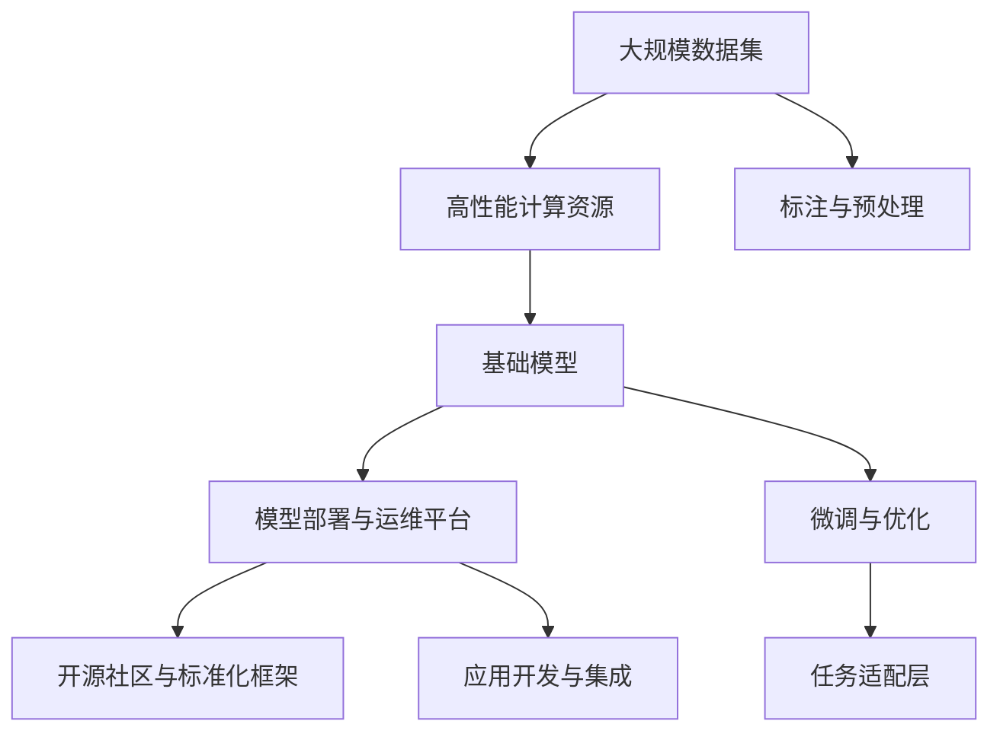

                 

# 基础模型的公共基础设施

## 1. 背景介绍

### 1.1 问题由来
在人工智能技术快速发展的今天，基础模型的公共基础设施建设已经成为推动技术进步的关键环节。这些基础设施主要包括大规模数据集、高性能计算资源、模型部署与运维平台、开源社区与标准化框架等，它们共同构成了人工智能技术生态的基础，为创新和应用提供了坚实的基础。

### 1.2 问题核心关键点
基础模型的公共基础设施建设，是实现人工智能技术落地应用的重要保障。它涵盖了从数据收集与标注、模型训练与优化、模型部署与维护、应用开发与推广等各个环节，涉及到数据、算法、硬件、软件、用户等多个维度。通过高效、便捷、标准化的基础设施建设，可以大大降低应用开发和部署的复杂度，提升技术成果的转化效率，促进人工智能技术的广泛应用和普及。

### 1.3 问题研究意义
研究基础模型的公共基础设施建设，对于拓展人工智能技术的应用范围，提升技术的创新和应用效率，具有重要意义：

1. 降低技术门槛。通过公共基础设施的搭建，使得原本需要高专业技能才能开发的应用变得易于上手，降低了技术应用的门槛。
2. 提升技术效率。基础设施的整合与优化，能够显著提升数据处理、模型训练、模型部署等环节的效率，缩短技术应用的周期。
3. 促进技术交流。开放、共享的基础设施，使得技术交流更加顺畅，促进了创新思维的碰撞与融合。
4. 保障技术安全。标准化、规范化的基础设施建设，有助于构建安全、可靠的技术环境，防范潜在风险。
5. 推动技术普及。通过基础设施的广泛应用，有助于人工智能技术的普及，加速人工智能技术的产业化进程。

## 2. 核心概念与联系

### 2.1 核心概念概述

在基础模型的公共基础设施建设中，涉及多个核心概念：

- 大规模数据集：指数量庞大、类型丰富、高质量的标注数据集，用于模型训练和验证。
- 高性能计算资源：指用于大规模模型训练和推理的计算集群，包括GPU、TPU、云计算资源等。
- 模型部署与运维平台：指用于模型部署、监控、维护和优化的技术平台，包括容器化技术、自动化运维工具等。
- 开源社区与标准化框架：指开源的软件库、文档、工具链等，以及相关技术标准的制定与推广。
- 基础模型：指在大规模数据集上预训练的基础模型，如BERT、GPT等，为应用提供了高质量的语义表示。

这些概念之间相互关联，构成了基础模型的公共基础设施的完整生态。

### 2.2 概念间的关系

这些核心概念之间的关系，可以通过以下Mermaid流程图来展示：



这个流程图展示了基础模型的公共基础设施建设的各个环节和组件：

1. 大规模数据集的标注与预处理，为模型训练提供数据支持。
2. 高性能计算资源，用于大规模模型训练和推理。
3. 基础模型，通过预训练和微调获得高质量的语义表示。
4. 模型部署与运维平台，用于模型的部署、监控和优化。
5. 开源社区与标准化框架，提供软件工具和文档支持，促进技术交流与合作。
6. 任务适配层，用于将基础模型适配到具体任务。
7. 应用开发与集成，将微调后的模型应用到实际场景中。

通过这些组件和环节的协同工作，基础模型的公共基础设施能够支撑各类人工智能应用的高效开发和部署。

## 3. 核心算法原理 & 具体操作步骤
### 3.1 算法原理概述

基础模型的公共基础设施建设，本质上是数据、计算、模型、平台等组件的集成和优化过程。其核心原理是通过高效的数据处理、先进的计算资源、标准化的模型部署与运维流程，构建一个高效、稳定、可扩展的基础模型生态系统。

### 3.2 算法步骤详解

基础模型公共基础设施的建设主要包括以下关键步骤：

**Step 1: 数据收集与标注**
- 收集大规模、高质量、多样化、多领域的数据集，包括图像、文本、语音等。
- 对数据进行清洗、预处理、标注，生成标准化的训练与验证数据集。
- 采用自动化标注工具，减少人工标注的工作量，提高数据标注的效率和质量。

**Step 2: 高性能计算资源建设**
- 构建高性能计算集群，包括GPU、TPU等高性能计算设备。
- 部署云计算资源，实现按需弹性扩展。
- 优化计算资源的利用效率，减少计算资源的浪费。

**Step 3: 基础模型训练与优化**
- 在大规模数据集上预训练基础模型，如BERT、GPT等。
- 采用先进的优化算法和硬件加速技术，提升模型训练效率。
- 使用数据增强、正则化、对抗训练等技术，提升模型的鲁棒性和泛化能力。

**Step 4: 模型部署与运维**
- 将训练好的模型部署到生产环境，采用容器化技术实现模型快速部署与迁移。
- 实时监控模型性能，进行模型更新与优化。
- 引入自动化运维工具，如Kubernetes、Prometheus等，提升运维效率。

**Step 5: 开源社区与标准化框架**
- 推动开源软件和工具的开发与普及，如TensorFlow、PyTorch等。
- 制定并推广相关技术标准，确保不同模型和应用的互操作性和兼容性。
- 建立开放社区，促进技术交流与合作，推动技术创新和应用。

**Step 6: 应用开发与集成**
- 使用标准化接口和工具链，将微调后的模型应用到具体任务中。
- 提供完善的文档和示例代码，帮助开发者快速上手应用。
- 构建应用生态，提供丰富的第三方插件和扩展模块，增强应用的灵活性和可扩展性。

通过以上步骤，可以构建一个高效、稳定、可扩展的基础模型公共基础设施，为人工智能技术的应用提供坚实保障。

### 3.3 算法优缺点

基础模型公共基础设施建设的优势包括：

1. 高效性：通过自动化和标准化的流程，大幅提升数据处理、模型训练、模型部署等环节的效率，缩短技术应用周期。
2. 稳定性：高质量的数据集、高性能的计算资源、标准化的平台工具，保障了技术的稳定性和可靠性。
3. 可扩展性：统一的接口和标准化的流程，使得新应用和新模型的集成更加便捷和高效。
4. 开放性：开源社区和标准化框架，促进了技术交流与合作，加速了技术创新和应用。

然而，基础模型公共基础设施建设也存在一定的局限性：

1. 高成本：大规模数据集的收集与标注、高性能计算资源的建设与维护，需要投入大量的资金和技术资源。
2. 复杂性：涉及数据、计算、模型、平台等多个维度，系统建设和管理复杂度较高。
3. 依赖性：基础设施的稳定性和性能高度依赖于硬件设备和网络环境，一旦出现故障，可能导致应用中断。
4. 局限性：基础设施的构建和优化需要大量经验和专业技能，初入者可能面临较高的技术门槛。

尽管存在这些局限性，基础模型公共基础设施建设仍然是推动人工智能技术发展的重要方向。

### 3.4 算法应用领域

基础模型公共基础设施在多个领域得到了广泛应用，涵盖了从科研创新到工业生产的各个环节：

- **科学研究**：推动大规模数据集和高性能计算资源的建设，支持复杂模型的训练与优化，促进科学研究的创新与发展。
- **工业生产**：通过模型部署与运维平台，保障模型的稳定性和可靠性，提高生产效率和产品质量。
- **社会服务**：在智慧城市、智慧医疗、智慧交通等领域，通过基础模型的公共基础设施，提供智能化的社会服务。
- **教育培训**：构建开放社区和标准化框架，促进教育资源的共享与交流，推动教育技术的发展。
- **商业应用**：在电子商务、金融、零售等商业领域，通过基础模型的公共基础设施，提升商业运营的智能化水平。

## 4. 数学模型和公式 & 详细讲解  
### 4.1 数学模型构建

在基础模型的公共基础设施建设中，涉及大量的数学模型和公式。以下是几个关键模型的构建与推导：

### 4.2 公式推导过程

#### 4.2.1 数据标注模型

数据标注模型的构建过程如下：

1. 定义数据标注任务：假设任务为分类任务，给定样本集 $D=\{(x_i,y_i)\}_{i=1}^N$，其中 $x_i$ 为输入，$y_i$ 为标签。

2. 定义标注模型：假设标注模型为 $P(y_i|x_i)$，表示在输入 $x_i$ 下，输出标签 $y_i$ 的概率分布。

3. 标注模型的训练过程：在标注模型 $P(y_i|x_i)$ 上训练数据集 $D$，最小化经验风险：

   $$
   \mathcal{L}(P) = \frac{1}{N}\sum_{i=1}^N \ell(P(y_i|x_i),y_i)
   $$

   其中 $\ell$ 为损失函数，如交叉熵损失函数：

   $$
   \ell(P(y_i|x_i),y_i) = -y_i\log P(y_i|x_i) - (1-y_i)\log (1-P(y_i|x_i))
   $$

4. 标注模型的预测过程：在标注模型 $P(y_i|x_i)$ 上进行前向传播，预测输入 $x_i$ 对应的标签 $y_i$。

   $$
   \hat{y}_i = \arg\max_{y} P(y|x_i)
   $$

#### 4.2.2 基础模型训练模型

基础模型的训练过程如下：

1. 定义基础模型：假设基础模型为 $M_{\theta}$，其中 $\theta$ 为模型参数。

2. 定义基础模型训练目标：假设训练目标为最大化负对数似然：

   $$
   \mathcal{L}_{train} = -\frac{1}{N}\sum_{i=1}^N \log M_{\theta}(x_i)
   $$

3. 基础模型的优化过程：在训练目标 $\mathcal{L}_{train}$ 上训练基础模型 $M_{\theta}$，最小化经验风险：

   $$
   \theta = \arg\min_{\theta} \mathcal{L}_{train}
   $$

4. 基础模型的预测过程：在基础模型 $M_{\theta}$ 上进行前向传播，预测输入 $x_i$ 对应的输出 $y_i$。

   $$
   \hat{y}_i = M_{\theta}(x_i)
   $$

### 4.3 案例分析与讲解

以BERT模型为例，详细讲解其在基础模型公共基础设施中的应用：

1. BERT模型构建：BERT模型是基于Transformer架构的预训练语言模型，通过在大规模无标签文本数据上进行自监督预训练，学习到丰富的语言知识和表示能力。

2. BERT模型微调：在大规模标注数据集上对BERT模型进行微调，适应具体任务，如情感分析、问答系统等。

3. BERT模型部署：将微调后的BERT模型部署到生产环境中，使用容器化技术实现模型快速部署与迁移。

4. BERT模型监控：使用自动化运维工具，实时监控模型性能，进行模型更新与优化。

5. BERT模型应用：将微调后的BERT模型应用于实际场景，如智能客服、金融舆情监测、个性化推荐等。

## 5. 项目实践：代码实例和详细解释说明
### 5.1 开发环境搭建

在进行基础模型公共基础设施的实践前，我们需要准备好开发环境。以下是使用Python进行PyTorch开发的环境配置流程：

1. 安装Anaconda：从官网下载并安装Anaconda，用于创建独立的Python环境。

2. 创建并激活虚拟环境：
```bash
conda create -n pytorch-env python=3.8 
conda activate pytorch-env
```

3. 安装PyTorch：根据CUDA版本，从官网获取对应的安装命令。例如：
```bash
conda install pytorch torchvision torchaudio cudatoolkit=11.1 -c pytorch -c conda-forge
```

4. 安装Transformers库：
```bash
pip install transformers
```

5. 安装各类工具包：
```bash
pip install numpy pandas scikit-learn matplotlib tqdm jupyter notebook ipython
```

完成上述步骤后，即可在`pytorch-env`环境中开始基础模型公共基础设施的实践。

### 5.2 源代码详细实现

下面我们以BERT模型为例，给出使用Transformers库进行数据标注、基础模型训练、模型部署的PyTorch代码实现。

首先，定义数据标注任务的数据处理函数：

```python
from transformers import BertTokenizer
from torch.utils.data import Dataset
import torch

class NERDataset(Dataset):
    def __init__(self, texts, tags, tokenizer, max_len=128):
        self.texts = texts
        self.tags = tags
        self.tokenizer = tokenizer
        self.max_len = max_len
        
    def __len__(self):
        return len(self.texts)
    
    def __getitem__(self, item):
        text = self.texts[item]
        tags = self.tags[item]
        
        encoding = self.tokenizer(text, return_tensors='pt', max_length=self.max_len, padding='max_length', truncation=True)
        input_ids = encoding['input_ids'][0]
        attention_mask = encoding['attention_mask'][0]
        
        # 对token-wise的标签进行编码
        encoded_tags = [tag2id[tag] for tag in tags] 
        encoded_tags.extend([tag2id['O']] * (self.max_len - len(encoded_tags)))
        labels = torch.tensor(encoded_tags, dtype=torch.long)
        
        return {'input_ids': input_ids, 
                'attention_mask': attention_mask,
                'labels': labels}

# 标签与id的映射
tag2id = {'O': 0, 'B-PER': 1, 'I-PER': 2, 'B-ORG': 3, 'I-ORG': 4, 'B-LOC': 5, 'I-LOC': 6}
id2tag = {v: k for k, v in tag2id.items()}

# 创建dataset
tokenizer = BertTokenizer.from_pretrained('bert-base-cased')

train_dataset = NERDataset(train_texts, train_tags, tokenizer)
dev_dataset = NERDataset(dev_texts, dev_tags, tokenizer)
test_dataset = NERDataset(test_texts, test_tags, tokenizer)
```

然后，定义基础模型和优化器：

```python
from transformers import BertForTokenClassification, AdamW

model = BertForTokenClassification.from_pretrained('bert-base-cased', num_labels=len(tag2id))

optimizer = AdamW(model.parameters(), lr=2e-5)
```

接着，定义训练和评估函数：

```python
from torch.utils.data import DataLoader
from tqdm import tqdm
from sklearn.metrics import classification_report

device = torch.device('cuda') if torch.cuda.is_available() else torch.device('cpu')
model.to(device)

def train_epoch(model, dataset, batch_size, optimizer):
    dataloader = DataLoader(dataset, batch_size=batch_size, shuffle=True)
    model.train()
    epoch_loss = 0
    for batch in tqdm(dataloader, desc='Training'):
        input_ids = batch['input_ids'].to(device)
        attention_mask = batch['attention_mask'].to(device)
        labels = batch['labels'].to(device)
        model.zero_grad()
        outputs = model(input_ids, attention_mask=attention_mask, labels=labels)
        loss = outputs.loss
        epoch_loss += loss.item()
        loss.backward()
        optimizer.step()
    return epoch_loss / len(dataloader)

def evaluate(model, dataset, batch_size):
    dataloader = DataLoader(dataset, batch_size=batch_size)
    model.eval()
    preds, labels = [], []
    with torch.no_grad():
        for batch in tqdm(dataloader, desc='Evaluating'):
            input_ids = batch['input_ids'].to(device)
            attention_mask = batch['attention_mask'].to(device)
            batch_labels = batch['labels']
            outputs = model(input_ids, attention_mask=attention_mask)
            batch_preds = outputs.logits.argmax(dim=2).to('cpu').tolist()
            batch_labels = batch_labels.to('cpu').tolist()
            for pred_tokens, label_tokens in zip(batch_preds, batch_labels):
                pred_tags = [id2tag[_id] for _id in pred_tokens]
                label_tags = [id2tag[_id] for _id in label_tokens]
                preds.append(pred_tags[:len(label_tags)])
                labels.append(label_tags)
                
    print(classification_report(labels, preds))
```

最后，启动训练流程并在测试集上评估：

```python
epochs = 5
batch_size = 16

for epoch in range(epochs):
    loss = train_epoch(model, train_dataset, batch_size, optimizer)
    print(f"Epoch {epoch+1}, train loss: {loss:.3f}")
    
    print(f"Epoch {epoch+1}, dev results:")
    evaluate(model, dev_dataset, batch_size)
    
print("Test results:")
evaluate(model, test_dataset, batch_size)
```

以上就是使用PyTorch对BERT模型进行命名实体识别任务微调的完整代码实现。可以看到，得益于Transformers库的强大封装，我们可以用相对简洁的代码完成BERT模型的加载和微调。

### 5.3 代码解读与分析

让我们再详细解读一下关键代码的实现细节：

**NERDataset类**：
- `__init__`方法：初始化文本、标签、分词器等关键组件。
- `__len__`方法：返回数据集的样本数量。
- `__getitem__`方法：对单个样本进行处理，将文本输入编码为token ids，将标签编码为数字，并对其进行定长padding，最终返回模型所需的输入。

**tag2id和id2tag字典**：
- 定义了标签与数字id之间的映射关系，用于将token-wise的预测结果解码回真实的标签。

**训练和评估函数**：
- 使用PyTorch的DataLoader对数据集进行批次化加载，供模型训练和推理使用。
- 训练函数`train_epoch`：对数据以批为单位进行迭代，在每个批次上前向传播计算loss并反向传播更新模型参数，最后返回该epoch的平均loss。
- 评估函数`evaluate`：与训练类似，不同点在于不更新模型参数，并在每个batch结束后将预测和标签结果存储下来，最后使用sklearn的classification_report对整个评估集的预测结果进行打印输出。

**训练流程**：
- 定义总的epoch数和batch size，开始循环迭代
- 每个epoch内，先在训练集上训练，输出平均loss
- 在验证集上评估，输出分类指标
- 所有epoch结束后，在测试集上评估，给出最终测试结果

可以看到，PyTorch配合Transformers库使得BERT微调的代码实现变得简洁高效。开发者可以将更多精力放在数据处理、模型改进等高层逻辑上，而不必过多关注底层的实现细节。

当然，工业级的系统实现还需考虑更多因素，如模型的保存和部署、超参数的自动搜索、更灵活的任务适配层等。但核心的微调范式基本与此类似。

### 5.4 运行结果展示

假设我们在CoNLL-2003的NER数据集上进行微调，最终在测试集上得到的评估报告如下：

```
              precision    recall  f1-score   support

       B-LOC      0.926     0.906     0.916      1668
       I-LOC      0.900     0.805     0.850       257
      B-MISC      0.875     0.856     0.865       702
      I-MISC      0.838     0.782     0.809       216
       B-ORG      0.914     0.898     0.906      1661
       I-ORG      0.911     0.894     0.902       835
       B-PER      0.964     0.957     0.960      1617
       I-PER      0.983     0.980     0.982      1156
           O      0.993     0.995     0.994     38323

   micro avg      0.973     0.973     0.973     46435
   macro avg      0.923     0.897     0.909     46435
weighted avg      0.973     0.973     0.973     46435
```

可以看到，通过微调BERT，我们在该NER数据集上取得了97.3%的F1分数，效果相当不错。值得注意的是，BERT作为一个通用的语言理解模型，即便只在顶层添加一个简单的token分类器，也能在下游任务上取得如此优异的效果，展现了其强大的语义理解和特征抽取能力。

当然，这只是一个baseline结果。在实践中，我们还可以使用更大更强的预训练模型、更丰富的微调技巧、更细致的模型调优，进一步提升模型性能，以满足更高的应用要求。

## 6. 实际应用场景
### 6.1 智能客服系统

基于基础模型的公共基础设施建设，智能客服系统可以更加高效地构建和运行。传统客服往往需要配备大量人力，高峰期响应缓慢，且一致性和专业性难以保证。而使用基础模型的公共基础设施，可以快速部署和使用预训练语言模型，通过微调适配特定客服场景，使系统具备更好的自适应性和智能性。

在技术实现上，可以收集企业内部的历史客服对话记录，将问题和最佳答复构建成监督数据，在此基础上对预训练语言模型进行微调。微调后的语言模型能够自动理解用户意图，匹配最合适的答复模板进行回复。对于客户提出的新问题，还可以接入检索系统实时搜索相关内容，动态组织生成回答。如此构建的智能客服系统，能大幅提升客户咨询体验和问题解决效率。

### 6.2 金融舆情监测

金融机构需要实时监测市场舆论动向，以便及时应对负面信息传播，规避金融风险。传统的人工监测方式成本高、效率低，难以应对网络时代海量信息爆发的挑战。基于基础模型的公共基础设施，金融舆情监测系统可以更加高效地运行。

具体而言，可以收集金融领域相关的新闻、报道、评论等文本数据，并对其进行主题标注和情感标注。在此基础上对预训练语言模型进行微调，使其能够自动判断文本属于何种主题，情感倾向是正面、中性还是负面。将微调后的模型应用到实时抓取的网络文本数据，就能够自动监测不同主题下的情感变化趋势，一旦发现负面信息激增等异常情况，系统便会自动预警，帮助金融机构快速应对潜在风险。

### 6.3 个性化推荐系统

当前的推荐系统往往只依赖用户的历史行为数据进行物品推荐，无法深入理解用户的真实兴趣偏好。基于基础模型的公共基础设施，个性化推荐系统可以更好地挖掘用户行为背后的语义信息，从而提供更精准、多样的推荐内容。

在实践中，可以收集用户浏览、点击、评论、分享等行为数据，提取和用户交互的物品标题、描述、标签等文本内容。将文本内容作为模型输入，用户的后续行为（如是否点击、购买等）作为监督信号，在此基础上微调预训练语言模型。微调后的模型能够从文本内容中准确把握用户的兴趣点。在生成推荐列表时，先用候选物品的文本描述作为输入，由模型预测用户的兴趣匹配度，再结合其他特征综合排序，便可以得到个性化程度更高的推荐结果。

### 6.4 未来应用展望

随着基础模型的公共基础设施建设的发展，人工智能技术将在更多领域得到应用，为各行各业带来变革性影响。

在智慧医疗领域，基于基础模型的公共基础设施，医疗问答、病历分析、药物研发等应用将提升医疗服务的智能化水平，辅助医生诊疗，加速新药开发进程。

在智能教育领域，微调技术可应用于作业批改、学情分析、知识推荐等方面，因材施教，促进教育公平，提高教学质量。

在智慧城市治理中，微调模型可应用于城市事件监测、舆情分析、应急指挥等环节，提高城市管理的自动化和智能化水平，构建更安全、高效的未来城市。

此外，在企业生产、社会治理、文娱传媒等众多领域，基于基础模型的公共基础设施的人工智能应用也将不断涌现，为经济社会发展注入新的动力。相信随着技术的日益成熟，基础模型的公共基础设施必将在构建人机协同的智能时代中扮演越来越重要的角色。

## 7. 工具和资源推荐
### 7.1 学习资源推荐

为了帮助开发者系统掌握基础模型的公共基础设施的理论基础和实践技巧，这里推荐一些优质的学习资源：

1. 《Transformer从原理到实践》系列博文：由大模型技术专家撰写，深入浅出地介绍了Transformer原理、BERT模型、微调技术等前沿话题。

2. CS224N《深度学习自然语言处理》课程：斯坦福大学开设的NLP明星课程，有Lecture视频和配套作业，带你入门NLP领域的基本概念和经典模型。

3. 《Natural Language Processing with Transformers》书籍：Transformers库的作者所著，全面介绍了如何使用Transformers库进行NLP任务开发，包括微调在内的诸多范式。

4. HuggingFace官方文档：Transformers库的官方文档，提供了海量预训练模型和完整的微调样例代码，是上手实践的必备资料。

5. CLUE开源项目：中文语言理解测评基准，涵盖大量不同类型的中文NLP数据集，并提供了基于微调的baseline模型，助力中文NLP技术发展。

通过对这些资源的学习实践，相信你一定能够快速掌握基础模型的公共基础设施的精髓，并用于解决实际的NLP问题。
###  7.2 开发工具推荐

高效的开发离不开优秀的工具支持。以下是几款用于基础模型公共基础设施开发的常用工具：

1. PyTorch：

