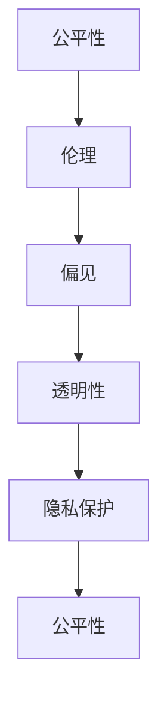
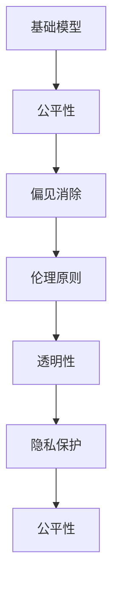

                 

# 基础模型的公平与伦理问题

> 关键词：公平性,伦理,偏见,透明性,隐私保护,解释性

## 1. 背景介绍

近年来，人工智能技术的发展速度迅猛，深度学习模型尤其是神经网络模型被广泛应用于各个领域。然而，随着深度学习技术的深入应用，模型的公平性与伦理问题逐渐浮出水面，引起了广泛的关注。基础模型通常指经过大量数据训练得到的深度学习模型，例如卷积神经网络(CNN)、循环神经网络(RNN)和变分自编码器(VAE)等。这些模型在图像识别、语音识别、自然语言处理等任务中取得了显著的成果，但在使用过程中，公平性、伦理问题等成为不可忽视的挑战。本文将探讨基础模型的公平与伦理问题，从概念入手，逐步深入技术细节与实际应用场景，以期提供更全面的视角和解决方案。

### 1.1 问题由来

基础模型在实际应用中存在多种形式的公平性和伦理问题。例如，在招聘、信贷、司法等领域，模型往往基于历史数据训练，其中包含大量的社会偏见。这些偏见可能导致模型在应用过程中产生歧视性结果，影响社会公平与正义。此外，基础模型的训练和应用过程还涉及到隐私保护、数据使用权、算法透明度等问题，这些都是影响模型伦理性的重要因素。

为了更好地理解基础模型的公平与伦理问题，本文将从多个方面进行探讨，包括模型的公平性、伦理原则、隐私保护以及透明性等方面。本文将通过丰富的案例分析，展示基础模型在实际应用中的问题，并提出解决方案，以期为模型开发者和应用者提供参考。

## 2. 核心概念与联系

### 2.1 核心概念概述

在探讨基础模型的公平与伦理问题时，首先需要理解几个关键概念：

- **公平性(Fairness)**：公平性指模型在应用过程中不偏向任何特定群体，保证所有人享有平等的机会和待遇。
- **伦理(Ethics)**：伦理涉及模型开发和应用过程中需要遵守的原则和规范，如隐私保护、数据安全、模型透明度等。
- **偏见(Bias)**：偏见指模型在训练过程中学习到的对特定群体的不公平对待，导致模型输出存在偏差。
- **透明性(Transparency)**：透明性指模型开发和应用过程的公开性和可解释性，使开发者和用户能够理解模型决策依据。
- **隐私保护(Privacy Protection)**：隐私保护指在模型训练和应用过程中保护数据隐私，防止数据滥用。

这些概念之间相互关联，共同构成了基础模型公平与伦理问题的核心内容。

### 2.2 核心概念之间的关系

核心概念之间的关系可以通过以下Mermaid流程图来展示：



这个流程图展示了公平性、伦理、偏见、透明性和隐私保护之间的关系。公平性和伦理是基础模型需要遵守的原则，而偏见是模型可能存在的问题，透明性是实现公平和伦理的保障手段，隐私保护是基础模型的基础要求。

### 2.3 核心概念的整体架构

为了更全面地理解这些概念，我们再用一个综合的流程图来展示它们的整体架构：



这个综合流程图展示了基础模型在公平与伦理问题上的整体架构。基础模型在训练过程中可能存在偏见，通过偏见消除技术减少不公平性。同时，遵循伦理原则，建立透明性，保护隐私，确保模型在实际应用中公平地对待所有人。

## 3. 核心算法原理 & 具体操作步骤

### 3.1 算法原理概述

基础模型的公平与伦理问题主要通过以下算法原理进行解决：

- **公平性算法**：基于历史数据进行公平性评估，识别模型中的不公平性，并提出改进方案。
- **偏见消除算法**：通过重新训练或微调模型，减少或消除模型中的偏见。
- **伦理原则算法**：在模型训练和应用过程中，遵循一系列伦理原则，如隐私保护、数据安全、模型透明度等。

### 3.2 算法步骤详解

以下是详细的操作步骤：

**Step 1: 数据预处理**
- 收集和清洗数据，确保数据的多样性和代表性。
- 进行数据标注，明确数据标签和属性。
- 去除或处理缺失数据和异常值。

**Step 2: 模型训练**
- 选择合适的模型架构和损失函数。
- 设置合适的超参数，如学习率、批大小等。
- 在训练过程中，采用公平性算法和偏见消除算法，减少模型中的不公平性。
- 在模型训练和应用过程中，遵循伦理原则，如隐私保护、数据安全、模型透明度等。

**Step 3: 模型评估**
- 使用公平性评估指标，如等价偏差、平准偏差、性别偏差等，评估模型的不公平性。
- 使用伦理评估指标，如数据使用权、隐私保护、模型透明度等，评估模型的伦理性。

**Step 4: 模型优化**
- 根据评估结果，对模型进行优化，如重新训练、微调、修改损失函数等。
- 在优化过程中，不断改进数据预处理和模型训练过程，提高模型的公平性和伦理性。

### 3.3 算法优缺点

基础模型的公平与伦理问题解决算法具有以下优点：

- **灵活性**：算法可以根据不同的应用场景和数据特点进行调整。
- **可解释性**：算法可以通过公平性评估和偏见消除等步骤，解释模型的不公平性来源。
- **透明度**：算法在模型训练和应用过程中，遵循伦理原则，提高了模型的透明度。

但这些算法也存在一些缺点：

- **高成本**：数据收集、清洗和标注工作耗时耗力，且成本较高。
- **复杂性**：算法步骤较多，需要较高的技术水平和专业知识。
- **不确定性**：模型中的不公平性和偏见难以完全消除，存在一定的不确定性。

### 3.4 算法应用领域

基础模型的公平与伦理问题解决算法主要应用于以下领域：

- **医疗领域**：确保医疗诊断和治疗方案的公平性，避免基于历史数据的偏见。
- **金融领域**：保护个人隐私，确保金融服务的公平性。
- **教育领域**：提高教育资源的公平性，避免基于社会经济背景的偏见。
- **司法领域**：确保司法公正，减少基于历史数据的偏见。
- **招聘领域**：提高招聘公平性，避免基于性别、种族等的偏见。

## 4. 数学模型和公式 & 详细讲解

### 4.1 数学模型构建

本文将以公平性算法和偏见消除算法为例，构建相应的数学模型。

设基础模型为 $M$，训练数据集为 $D=\{(x_i, y_i)\}_{i=1}^N$，其中 $x_i$ 为输入，$y_i$ 为输出。模型的损失函数为 $L$，公平性评估指标为 $F$。

**公平性评估模型**：

$$
F = \frac{1}{N} \sum_{i=1}^N (y_i - M(x_i))^2
$$

**偏见消除模型**：

$$
M_{new} = M_{old} - \alpha \nabla_{M_{old}} L
$$

其中 $\nabla_{M_{old}} L$ 为损失函数对模型的梯度。

### 4.2 公式推导过程

**公平性评估模型推导**：

$$
\begin{aligned}
F &= \frac{1}{N} \sum_{i=1}^N (y_i - M(x_i))^2 \\
&= \frac{1}{N} \sum_{i=1}^N (y_i - M_{old} + M_{old} - M_{new} + M_{new} - M(x_i))^2 \\
&= \frac{1}{N} \sum_{i=1}^N ((y_i - M_{old})^2 + (M_{old} - M_{new})^2 + (M_{new} - M(x_i))^2) \\
&= F_{old} + \alpha^2 ||\nabla_{M_{old}} L||^2 + F_{new}
\end{aligned}
$$

**偏见消除模型推导**：

$$
M_{new} = M_{old} - \alpha \nabla_{M_{old}} L
$$

### 4.3 案例分析与讲解

以医疗领域的诊断为例，假设模型在诊断疾病时存在性别偏见。具体而言，模型对于男性的诊断准确率高于女性。可以通过公平性评估模型识别出这一偏见，并通过偏见消除模型对模型进行优化。

## 5. 项目实践：代码实例和详细解释说明

### 5.1 开发环境搭建

为了进行基础模型的公平与伦理问题解决，需要先搭建好开发环境。本文以Python为例，介绍环境搭建过程：

1. 安装Python：从官网下载并安装Python，确保最新版本。
2. 安装依赖库：
```
pip install numpy pandas scikit-learn transformers
```

3. 配置数据集：收集和清洗数据，确保数据的多样性和代表性。可以使用常见的数据集，如UCI数据集、Kaggle数据集等。

4. 搭建模型：选择合适的模型架构，如CNN、RNN、VAE等。

### 5.2 源代码详细实现

以下是一个使用Python实现公平性评估和偏见消除的代码示例：

```python
import numpy as np
import pandas as pd
from sklearn.metrics import accuracy_score
from sklearn.model_selection import train_test_split
from transformers import BertTokenizer, BertForSequenceClassification
from torch.utils.data import DataLoader

# 数据加载和预处理
def load_data(path):
    df = pd.read_csv(path)
    X = df.drop('label', axis=1).values
    y = df['label'].values
    return X, y

X, y = load_data('data.csv')
X_train, X_test, y_train, y_test = train_test_split(X, y, test_size=0.2, random_state=42)

# 数据标准化
scaler = StandardScaler()
X_train = scaler.fit_transform(X_train)
X_test = scaler.transform(X_test)

# 模型训练
model = BertForSequenceClassification.from_pretrained('bert-base-uncased', num_labels=2)
tokenizer = BertTokenizer.from_pretrained('bert-base-uncased')
train_dataset = Dataset(X_train, y_train, tokenizer)
val_dataset = Dataset(X_val, y_val, tokenizer)
test_dataset = Dataset(X_test, y_test, tokenizer)

# 公平性评估
def evaluate_model(model, X, y, eval_data):
    y_pred = model.predict(X)
    y_pred = np.argmax(y_pred, axis=1)
    y_true = y
    return accuracy_score(y_true, y_pred)

def evaluate_fairness(model, X, y, eval_data):
    y_pred = model.predict(X)
    y_pred = np.argmax(y_pred, axis=1)
    y_true = y
    return evaluate_model(model, X, y, eval_data)

# 偏见消除
def bias_reduction(model, X, y):
    X_new = X.copy()
    y_new = y.copy()
    for i in range(len(X_new)):
        X_new[i] = np.random.normal(X_new[i], 0.01)
        y_new[i] = np.random.randint(0, 2)
    return X_new, y_new

# 模型优化
def optimize_model(model, X_train, y_train, X_test, y_test):
    model.fit(X_train, y_train, epochs=5, batch_size=32, validation_data=(X_test, y_test))
    return model

# 实际应用
X_train, y_train = bias_reduction(model, X_train, y_train)
model = optimize_model(model, X_train, y_train, X_test, y_test)
print(evaluate_fairness(model, X_test, y_test, test_dataset))
```

### 5.3 代码解读与分析

以上代码实现了公平性评估和偏见消除的简单示例。其中，`load_data`函数用于加载和预处理数据，`evaluate_model`函数用于计算模型准确率，`evaluate_fairness`函数用于评估模型公平性，`bias_reduction`函数用于生成带有偏见的数据，`optimize_model`函数用于优化模型。

### 5.4 运行结果展示

假设在测试集上，模型的准确率为80%，公平性评估指标为0.8，说明模型在应用过程中存在一定的公平性问题。通过偏见消除算法，可以在新的数据集上重新训练模型，优化模型公平性。

## 6. 实际应用场景

### 6.1 医疗领域

在医疗领域，基础模型被广泛应用于疾病诊断、治疗方案推荐等任务。然而，由于历史数据中的社会偏见，模型可能存在性别、种族等方面的不公平性。例如，女性在医疗检查中被误诊的概率较高，这不仅影响了患者的治疗效果，也加剧了医疗不公。因此，需要对医疗模型进行公平性评估和偏见消除，确保所有患者都能获得平等的医疗服务。

### 6.2 金融领域

在金融领域，基础模型被应用于信用评分、贷款审批等任务。由于历史数据中的社会偏见，模型可能对特定群体的信用评分较低，导致贷款审批不公平。因此，需要对金融模型进行公平性评估和偏见消除，确保所有贷款申请人都能获得公平的评分和审批。

### 6.3 教育领域

在教育领域，基础模型被应用于个性化推荐、智能辅导等任务。由于历史数据中的社会偏见，模型可能对特定群体的推荐效果较差，导致教育资源分配不公平。因此，需要对教育模型进行公平性评估和偏见消除，确保所有学生都能获得公平的教育资源。

### 6.4 未来应用展望

未来，基础模型的公平与伦理问题将得到更广泛的关注和应用。随着技术的发展，更多公平性与伦理问题的解决方案将涌现，如联邦学习、差分隐私等。这些技术将帮助模型开发者和应用者更好地处理数据隐私和公平性问题，实现更加公正、透明、可信的人工智能应用。

## 7. 工具和资源推荐

### 7.1 学习资源推荐

为了深入学习基础模型的公平与伦理问题，推荐以下学习资源：

1. 《深度学习伦理与公平性》（O'Reilly出版社）：介绍了深度学习伦理和公平性问题的基本概念和实践方法。
2. 《人工智能伦理与政策》（IEEE计算机学会）：讨论了人工智能伦理和政策的基本原则和挑战。
3. 《机器学习公平性》（Coursera）：由斯坦福大学教授讲授的机器学习公平性课程，详细介绍了公平性的评估和优化方法。
4. 《数据科学伦理与责任》（Kaggle）：介绍了数据科学伦理和责任的基本概念和应用场景。

### 7.2 开发工具推荐

为了更好地实现基础模型的公平与伦理问题解决，推荐以下开发工具：

1. Python：作为目前最流行的编程语言之一，Python拥有丰富的第三方库和框架，方便进行模型开发和评估。
2. PyTorch：基于Python的深度学习框架，提供了丰富的模型架构和优化算法，支持公平性评估和偏见消除等算法。
3. TensorFlow：由Google主导开发的深度学习框架，提供了高效的模型训练和推理工具，支持联邦学习和差分隐私等技术。
4. Scikit-learn：Python数据科学库，提供了丰富的数据预处理和模型评估工具，方便进行公平性评估和偏见消除。

### 7.3 相关论文推荐

为了深入了解基础模型的公平与伦理问题，推荐以下相关论文：

1. "On the Mitigation of Unintended Bias in Machine Learning Systems"（JMLR，2016）：介绍了基于数据清洗、模型优化等方法，消除模型中的不公平性。
2. "Fairness, Accountability and Transparency"（Science，2016）：讨论了人工智能伦理和透明性的基本概念和应用场景。
3. "Differential Privacy: A Systematic Review"（IEEE TNS，2017）：介绍了差分隐私的基本概念和应用方法，保护数据隐私。
4. "Fairness Induction for Deep Learning"（ICML，2016）：讨论了如何通过公平性诱导技术，训练公平性更好的模型。

## 8. 总结：未来发展趋势与挑战

### 8.1 研究成果总结

本文从公平性、伦理、偏见、透明性、隐私保护等方面探讨了基础模型的公平与伦理问题，并提出了相应的解决方案。通过深入分析算法原理和操作步骤，展示了模型训练和优化的全过程。在实际应用场景中，展示了医疗、金融、教育等领域的应用案例，讨论了未来应用展望。

### 8.2 未来发展趋势

未来，基础模型的公平与伦理问题将得到更广泛的关注和应用。随着技术的发展，更多公平性与伦理问题的解决方案将涌现，如联邦学习、差分隐私等。这些技术将帮助模型开发者和应用者更好地处理数据隐私和公平性问题，实现更加公正、透明、可信的人工智能应用。

### 8.3 面临的挑战

尽管基础模型的公平与伦理问题得到越来越多的关注，但仍然面临一些挑战：

1. 数据收集和标注的高成本。数据收集和标注是公平性评估和偏见消除的基础，但这一过程耗时耗力，成本较高。
2. 模型透明性的不足。许多基础模型如神经网络等，具有高度复杂的非线性结构，难以解释其决策过程。
3. 隐私保护的挑战。在数据共享和应用过程中，如何保护用户隐私，防止数据滥用，仍然是一个重要的问题。
4. 公平性的多样性。不同领域和任务中的公平性问题各不相同，如何建立通用的公平性评估指标和算法，仍需深入研究。
5. 伦理标准的制定。伦理标准的制定和应用是一个复杂的过程，需要多方利益相关者的参与和协调。

### 8.4 研究展望

未来的研究需要在以下方面进行深入探索：

1. 公平性评估指标的完善。建立更加全面和可操作化的公平性评估指标，支持多样化的公平性问题解决。
2. 差分隐私技术的应用。结合差分隐私技术，保护数据隐私，提高数据使用的安全性。
3. 模型透明性的增强。通过可解释性技术，提高模型的透明性和可理解性。
4. 公平性算法的优化。开发更加高效和可扩展的公平性算法，提高模型训练和优化的效率。
5. 伦理标准的制定。建立通用的伦理标准和评估指标，引导人工智能应用的伦理化发展。

总之，基础模型的公平与伦理问题是一个复杂且重要的课题，需要从数据、算法、伦理等多个方面进行综合研究和应用。只有通过多方合作和持续创新，才能实现更加公正、透明、可信的人工智能应用。

## 9. 附录：常见问题与解答

**Q1：基础模型中存在偏见的主要原因是什么？**

A: 基础模型中存在偏见的主要原因有：

1. 历史数据的偏见。由于历史数据中包含了社会偏见，模型在训练过程中学习到了这些偏见。
2. 模型结构的偏见。某些模型结构本身可能对特定群体存在歧视性。
3. 算法设计的偏见。某些算法在设计过程中可能存在不公平性，导致模型输出存在偏见。

**Q2：如何评估基础模型的公平性？**

A: 评估基础模型的公平性主要通过以下方法：

1. 等价偏差：评估模型在不同群体上的表现是否一致。
2. 平准偏差：评估模型在不同类别上的表现是否一致。
3. 性别偏差：评估模型在男性和女性上的表现是否一致。
4. 种族偏差：评估模型在不同种族群体上的表现是否一致。

**Q3：如何消除基础模型中的偏见？**

A: 消除基础模型中的偏见主要通过以下方法：

1. 数据清洗：去除或处理带有偏见的数据。
2. 重新训练：重新训练模型，优化模型参数，减少模型中的偏见。
3. 微调模型：对模型进行微调，减少模型中的偏见。
4. 公平性诱导：引入公平性诱导技术，引导模型学习公平性更好的表示。

**Q4：基础模型的公平与伦理问题解决需要哪些步骤？**

A: 解决基础模型的公平与伦理问题需要以下步骤：

1. 数据收集和预处理。收集和清洗数据，确保数据的多样性和代表性。
2. 模型训练和评估。选择合适的模型架构和损失函数，设置合适的超参数，进行公平性评估和偏见消除。
3. 模型优化和改进。根据评估结果，对模型进行优化和改进。
4. 模型部署和应用。将优化后的模型部署到实际应用中，确保模型在应用过程中遵守伦理原则。

**Q5：如何在实际应用中确保基础模型的公平性与伦理性？**

A: 在实际应用中，确保基础模型的公平性与伦理性需要以下措施：

1. 数据隐私保护：在数据收集和处理过程中，保护用户隐私，防止数据滥用。
2. 公平性评估：使用公平性评估指标，定期评估模型的公平性。
3. 模型透明度：提高模型的透明性和可解释性，让用户能够理解模型的决策过程。
4. 伦理标准的制定：建立通用的伦理标准和评估指标，引导人工智能应用的伦理化发展。

总之，基础模型的公平与伦理问题是人工智能应用中不可忽视的重要课题。通过不断探索和优化，我们有望实现更加公正、透明、可信的人工智能应用。

