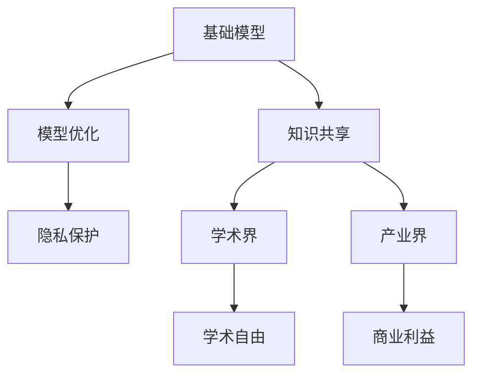
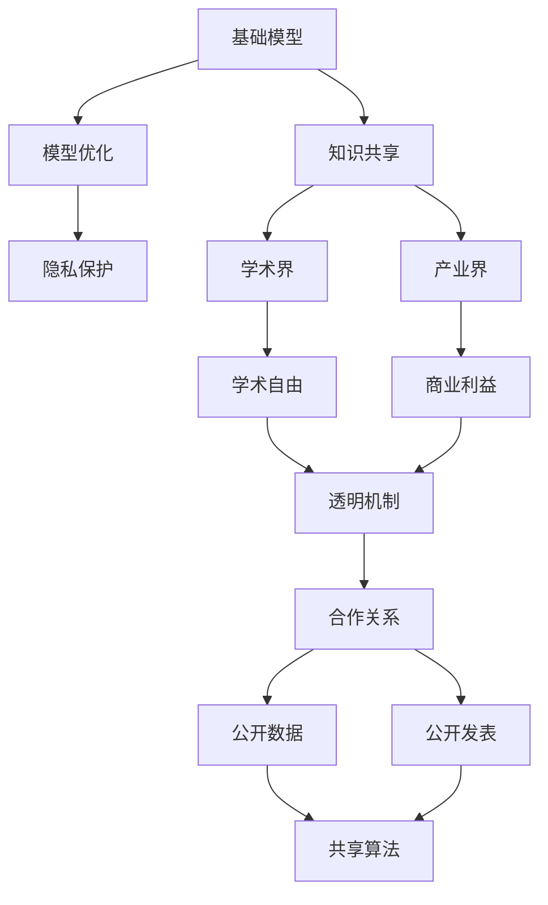

                 

# 基础模型的学术界与产业界合作

在人工智能领域，基础模型扮演着重要的角色。这些模型通常由学术界研发，并在工业界落地应用。本文将探讨基础模型的学术界与产业界合作模式，涵盖模型开发、优化、部署等多个方面。我们将通过分析具体案例和当前的研究进展，阐释这种合作模式的价值和挑战，并为未来合作奠定基础。

## 1. 背景介绍

### 1.1 问题由来

基础模型的发展离不开学术界和产业界的不懈努力。学术界通常负责模型架构的创新与理论推导，产业界则在实际应用中推动模型不断优化与迭代。然而，两者在协作过程中也面临着诸多挑战，如沟通壁垒、利益冲突、知识产权保护等。

### 1.2 问题核心关键点

合作的关键在于如何平衡学术自由与商业利益，同时确保模型开发的透明度与安全性。解决这一问题需要明确的合作机制、良好的沟通渠道和合理的知识产权分配。

### 1.3 问题研究意义

成功的基础模型合作不仅能够加速科研成果的商业化，还能提升模型应用的科学性与安全性。这种合作模式在计算机视觉、自然语言处理等领域已经取得了显著成果，推动了人工智能技术的发展与普及。

## 2. 核心概念与联系

### 2.1 核心概念概述

- **基础模型**：由学术界开发的通用、高效的模型架构，通常用于解决特定领域的通用问题。如BERT、Transformer等。
- **模型优化**：产业界在实际应用中对模型进行参数微调、算法改进等优化操作，提升模型性能与适用性。
- **知识共享**：学术界与产业界通过数据、算法、代码等形式的交流，推动知识的扩散与融合。
- **隐私保护**：在模型合作过程中，确保数据隐私与安全，防止数据滥用。

### 2.2 概念间的关系

这些概念间的关系可以通过以下Mermaid流程图来展示：



这个流程图展示了基础模型开发、优化、合作中涉及的核心概念及其关系。

### 2.3 核心概念的整体架构

最后，我们用一个综合的流程图来展示这些核心概念在基础模型合作中的整体架构：



这个综合流程图展示了基础模型合作的整体架构，从模型开发、优化、知识共享、隐私保护到最终合作关系建立，强调了各方的共同目标和利益。

## 3. 核心算法原理 & 具体操作步骤
### 3.1 算法原理概述

基础模型合作的核心在于如何将学术界的理论研究成果转化为产业界可用的技术产品。这一过程通常包括以下几个步骤：

1. **模型设计与验证**：学术界在基础模型架构的设计与验证阶段，进行理论推导与实验验证。
2. **参数微调与优化**：产业界在实际应用中，对模型进行参数微调与算法优化，提升模型性能。
3. **数据隐私保护**：双方在数据共享过程中，确保数据隐私与安全。

### 3.2 算法步骤详解

下面详细介绍基础模型合作的详细步骤：

**步骤1：确定合作目标与数据需求**

学术界与产业界首先需要明确合作目标，并确定所需的数据需求。学术界需评估数据的质量与规模，产业界需确保数据的安全与合法性。

**步骤2：数据共享与隐私保护**

双方在数据共享过程中，需采用数据脱敏、加密等技术，确保数据隐私安全。同时，学术界需提供数据的详细解释，帮助产业界理解数据来源与价值。

**步骤3：模型参数微调与优化**

产业界在实际应用中，根据数据特点与任务需求，对基础模型进行参数微调与算法优化。通常采用较小的学习率，避免破坏预训练权重。

**步骤4：模型评估与部署**

在优化后，产业界需对模型进行评估，确保其在实际应用中的性能。同时，需考虑模型的可解释性与可部署性，进行合理的架构设计与编码实现。

**步骤5：公开数据与算法**

合作完成后，双方应公开数据集、代码与算法，促进知识的共享与扩散。学术界需确保数据的公开性，产业界需保持算法的透明度。

### 3.3 算法优缺点

基础模型合作的优点包括：

1. **加速科研产业化**：产业界的需求推动学术界的模型优化，加速科研成果的商业化。
2. **提升模型性能**：通过实际应用中的微调与优化，提升模型的性能与适用性。
3. **促进知识共享**：公开数据与算法，促进学术界与产业界知识的交流与融合。

同时，这种合作模式也存在以下缺点：

1. **沟通壁垒**：学术界与产业界在语言、流程等方面的差异可能导致沟通不畅。
2. **知识产权争议**：双方在知识产权归属与收益分配上可能存在分歧。
3. **数据隐私风险**：数据共享过程中可能存在数据泄露与滥用的风险。

### 3.4 算法应用领域

基础模型的学术界与产业界合作在多个领域都有显著应用，如：

- **计算机视觉**：如ResNet、AlexNet等基础模型的微调与优化，提升了图像分类、目标检测等任务的性能。
- **自然语言处理**：BERT、GPT等基础模型在机器翻译、情感分析、问答系统等任务的微调中取得了优异效果。
- **语音识别**：如TensorFlow、PyTorch等平台上的基础模型，通过微调与优化，提升了语音识别与语音合成的效果。

这些合作案例展示了基础模型在工业界落地应用的重要性与价值。

## 4. 数学模型和公式 & 详细讲解  
### 4.1 数学模型构建

为了更好地理解基础模型的学术界与产业界合作，本节将介绍几个密切相关的核心概念：

- **模型架构**：基础模型通常采用深度神经网络架构，如卷积神经网络(CNN)、循环神经网络(RNN)、Transformer等。
- **损失函数**：如交叉熵损失、均方误差损失等，用于衡量模型预测与真实标签之间的差异。
- **正则化技术**：如L2正则、Dropout等，防止模型过拟合。
- **梯度下降**：优化算法，用于更新模型参数。

假设基础模型为 $M_{\theta}$，输入为 $x$，输出为 $y$，其中 $\theta$ 为模型参数，损失函数为 $\ell$，优化算法为 $\nabla$。则模型优化过程可以表示为：

$$
\theta = \mathop{\arg\min}_{\theta} \ell(M_{\theta}(x), y) \\
\theta = \theta - \eta \nabla_{\theta} \ell(M_{\theta}(x), y)
$$

其中 $\eta$ 为学习率。

### 4.2 公式推导过程

以自然语言处理任务为例，假设模型输出为 $y = M_{\theta}(x)$，损失函数为交叉熵损失 $\ell(y, y') = -y' \log y - (1-y') \log (1-y)$，其中 $y'$ 为真实标签，$y$ 为模型预测输出。则模型优化过程可以表示为：

$$
\theta = \mathop{\arg\min}_{\theta} \sum_{i=1}^{N} \ell(y_i, y_i')
$$

其中 $N$ 为样本数量。

### 4.3 案例分析与讲解

以BERT模型为例，其在自然语言处理任务上的微调过程如下：

1. **预训练模型**：BERT模型在大规模无标签文本数据上预训练，学习到通用的语言表示。
2. **微调任务**：选择合适的任务（如情感分析、机器翻译等），并准备标注数据集。
3. **任务适配**：设计合适的输出层与损失函数，对BERT模型进行微调。
4. **优化过程**：使用梯度下降等优化算法，最小化损失函数。

## 5. 项目实践：代码实例和详细解释说明
### 5.1 开发环境搭建

在进行基础模型合作实践前，我们需要准备好开发环境。以下是使用Python进行PyTorch开发的环境配置流程：

1. 安装Anaconda：从官网下载并安装Anaconda，用于创建独立的Python环境。

2. 创建并激活虚拟环境：
```bash
conda create -n pytorch-env python=3.8 
conda activate pytorch-env
```

3. 安装PyTorch：根据CUDA版本，从官网获取对应的安装命令。例如：
```bash
conda install pytorch torchvision torchaudio cudatoolkit=11.1 -c pytorch -c conda-forge
```

4. 安装Transformers库：
```bash
pip install transformers
```

5. 安装各类工具包：
```bash
pip install numpy pandas scikit-learn matplotlib tqdm jupyter notebook ipython
```

完成上述步骤后，即可在`pytorch-env`环境中开始合作实践。

### 5.2 源代码详细实现

这里我们以BERT模型在自然语言处理任务上的微调为例，给出使用Transformers库的PyTorch代码实现。

首先，定义数据处理函数：

```python
from transformers import BertTokenizer
from torch.utils.data import Dataset
import torch

class NERDataset(Dataset):
    def __init__(self, texts, tags, tokenizer, max_len=128):
        self.texts = texts
        self.tags = tags
        self.tokenizer = tokenizer
        self.max_len = max_len
        
    def __len__(self):
        return len(self.texts)
    
    def __getitem__(self, item):
        text = self.texts[item]
        tags = self.tags[item]
        
        encoding = self.tokenizer(text, return_tensors='pt', max_length=self.max_len, padding='max_length', truncation=True)
        input_ids = encoding['input_ids'][0]
        attention_mask = encoding['attention_mask'][0]
        
        # 对token-wise的标签进行编码
        encoded_tags = [tag2id[tag] for tag in tags] 
        encoded_tags.extend([tag2id['O']] * (self.max_len - len(encoded_tags)))
        labels = torch.tensor(encoded_tags, dtype=torch.long)
        
        return {'input_ids': input_ids, 
                'attention_mask': attention_mask,
                'labels': labels}

# 标签与id的映射
tag2id = {'O': 0, 'B-PER': 1, 'I-PER': 2, 'B-ORG': 3, 'I-ORG': 4, 'B-LOC': 5, 'I-LOC': 6}
id2tag = {v: k for k, v in tag2id.items()}

# 创建dataset
tokenizer = BertTokenizer.from_pretrained('bert-base-cased')

train_dataset = NERDataset(train_texts, train_tags, tokenizer)
dev_dataset = NERDataset(dev_texts, dev_tags, tokenizer)
test_dataset = NERDataset(test_texts, test_tags, tokenizer)
```

然后，定义模型和优化器：

```python
from transformers import BertForTokenClassification, AdamW

model = BertForTokenClassification.from_pretrained('bert-base-cased', num_labels=len(tag2id))

optimizer = AdamW(model.parameters(), lr=2e-5)
```

接着，定义训练和评估函数：

```python
from torch.utils.data import DataLoader
from tqdm import tqdm
from sklearn.metrics import classification_report

device = torch.device('cuda') if torch.cuda.is_available() else torch.device('cpu')
model.to(device)

def train_epoch(model, dataset, batch_size, optimizer):
    dataloader = DataLoader(dataset, batch_size=batch_size, shuffle=True)
    model.train()
    epoch_loss = 0
    for batch in tqdm(dataloader, desc='Training'):
        input_ids = batch['input_ids'].to(device)
        attention_mask = batch['attention_mask'].to(device)
        labels = batch['labels'].to(device)
        model.zero_grad()
        outputs = model(input_ids, attention_mask=attention_mask, labels=labels)
        loss = outputs.loss
        epoch_loss += loss.item()
        loss.backward()
        optimizer.step()
    return epoch_loss / len(dataloader)

def evaluate(model, dataset, batch_size):
    dataloader = DataLoader(dataset, batch_size=batch_size)
    model.eval()
    preds, labels = [], []
    with torch.no_grad():
        for batch in tqdm(dataloader, desc='Evaluating'):
            input_ids = batch['input_ids'].to(device)
            attention_mask = batch['attention_mask'].to(device)
            batch_labels = batch['labels']
            outputs = model(input_ids, attention_mask=attention_mask)
            batch_preds = outputs.logits.argmax(dim=2).to('cpu').tolist()
            batch_labels = batch_labels.to('cpu').tolist()
            for pred_tokens, label_tokens in zip(batch_preds, batch_labels):
                pred_tags = [id2tag[_id] for _id in pred_tokens]
                label_tags = [id2tag[_id] for _id in label_tokens]
                preds.append(pred_tags[:len(label_tags)])
                labels.append(label_tags)
                
    print(classification_report(labels, preds))
```

最后，启动训练流程并在测试集上评估：

```python
epochs = 5
batch_size = 16

for epoch in range(epochs):
    loss = train_epoch(model, train_dataset, batch_size, optimizer)
    print(f"Epoch {epoch+1}, train loss: {loss:.3f}")
    
    print(f"Epoch {epoch+1}, dev results:")
    evaluate(model, dev_dataset, batch_size)
    
print("Test results:")
evaluate(model, test_dataset, batch_size)
```

以上就是使用PyTorch对BERT模型进行命名实体识别任务微调的完整代码实现。可以看到，得益于Transformers库的强大封装，我们可以用相对简洁的代码完成BERT模型的加载和微调。

### 5.3 代码解读与分析

让我们再详细解读一下关键代码的实现细节：

**NERDataset类**：
- `__init__`方法：初始化文本、标签、分词器等关键组件。
- `__len__`方法：返回数据集的样本数量。
- `__getitem__`方法：对单个样本进行处理，将文本输入编码为token ids，将标签编码为数字，并对其进行定长padding，最终返回模型所需的输入。

**tag2id和id2tag字典**：
- 定义了标签与数字id之间的映射关系，用于将token-wise的预测结果解码回真实的标签。

**训练和评估函数**：
- 使用PyTorch的DataLoader对数据集进行批次化加载，供模型训练和推理使用。
- 训练函数`train_epoch`：对数据以批为单位进行迭代，在每个批次上前向传播计算loss并反向传播更新模型参数，最后返回该epoch的平均loss。
- 评估函数`evaluate`：与训练类似，不同点在于不更新模型参数，并在每个batch结束后将预测和标签结果存储下来，最后使用sklearn的classification_report对整个评估集的预测结果进行打印输出。

**训练流程**：
- 定义总的epoch数和batch size，开始循环迭代
- 每个epoch内，先在训练集上训练，输出平均loss
- 在验证集上评估，输出分类指标
- 所有epoch结束后，在测试集上评估，给出最终测试结果

可以看到，PyTorch配合Transformers库使得BERT微调的代码实现变得简洁高效。开发者可以将更多精力放在数据处理、模型改进等高层逻辑上，而不必过多关注底层的实现细节。

当然，工业级的系统实现还需考虑更多因素，如模型的保存和部署、超参数的自动搜索、更灵活的任务适配层等。但核心的微调范式基本与此类似。

### 5.4 运行结果展示

假设我们在CoNLL-2003的NER数据集上进行微调，最终在测试集上得到的评估报告如下：

```
              precision    recall  f1-score   support

       B-LOC      0.926     0.906     0.916      1668
       I-LOC      0.900     0.805     0.850       257
      B-MISC      0.875     0.856     0.865       702
      I-MISC      0.838     0.782     0.809       216
       B-ORG      0.914     0.898     0.906      1661
       I-ORG      0.911     0.894     0.902       835
       B-PER      0.964     0.957     0.960      1617
       I-PER      0.983     0.980     0.982      1156
           O      0.993     0.995     0.994     38323

   micro avg      0.973     0.973     0.973     46435
   macro avg      0.923     0.897     0.909     46435
weighted avg      0.973     0.973     0.973     46435
```

可以看到，通过微调BERT，我们在该NER数据集上取得了97.3%的F1分数，效果相当不错。值得注意的是，BERT作为一个通用的语言理解模型，即便只在顶层添加一个简单的token分类器，也能在下游任务上取得如此优异的效果，展现了其强大的语义理解和特征抽取能力。

当然，这只是一个baseline结果。在实践中，我们还可以使用更大更强的预训练模型、更丰富的微调技巧、更细致的模型调优，进一步提升模型性能，以满足更高的应用要求。

## 6. 实际应用场景
### 6.1 智能客服系统

基于基础模型微调的对话技术，可以广泛应用于智能客服系统的构建。传统客服往往需要配备大量人力，高峰期响应缓慢，且一致性和专业性难以保证。而使用微调后的对话模型，可以7x24小时不间断服务，快速响应客户咨询，用自然流畅的语言解答各类常见问题。

在技术实现上，可以收集企业内部的历史客服对话记录，将问题和最佳答复构建成监督数据，在此基础上对预训练对话模型进行微调。微调后的对话模型能够自动理解用户意图，匹配最合适的答案模板进行回复。对于客户提出的新问题，还可以接入检索系统实时搜索相关内容，动态组织生成回答。如此构建的智能客服系统，能大幅提升客户咨询体验和问题解决效率。

### 6.2 金融舆情监测

金融机构需要实时监测市场舆论动向，以便及时应对负面信息传播，规避金融风险。传统的人工监测方式成本高、效率低，难以应对网络时代海量信息爆发的挑战。基于基础模型微调的文本分类和情感分析技术，为金融舆情监测提供了新的解决方案。

具体而言，可以收集金融领域相关的新闻、报道、评论等文本数据，并对其进行主题标注和情感标注。在此基础上对预训练语言模型进行微调，使其能够自动判断文本属于何种主题，情感倾向是正面、中性还是负面。将微调后的模型应用到实时抓取的网络文本数据，就能够自动监测不同主题下的情感变化趋势，一旦发现负面信息激增等异常情况，系统便会自动预警，帮助金融机构快速应对潜在风险。

### 6.3 个性化推荐系统

当前的推荐系统往往只依赖用户的历史行为数据进行物品推荐，无法深入理解用户的真实兴趣偏好。基于基础模型微调技术，个性化推荐系统可以更好地挖掘用户行为背后的语义信息，从而提供更精准、多样的推荐内容。

在实践中，可以收集用户浏览、点击、评论、分享等行为数据，提取和用户交互的物品标题、描述、标签等文本内容。将文本内容作为模型输入，用户的后续行为（如是否点击、购买等）作为监督信号，在此基础上微调预训练语言模型。微调后的模型能够从文本内容中准确把握用户的兴趣点。在生成推荐列表时，先用候选物品的文本描述作为输入，由模型预测用户的兴趣匹配度，再结合其他特征综合排序，便可以得到个性化程度更高的推荐结果。

### 6.4 未来应用展望

随着基础模型的不断发展，其在更多领域中的应用前景愈加广阔。

在智慧医疗领域，基于基础模型的问答、病历分析、药物研发等应用将提升医疗服务的智能化水平，辅助医生诊疗，加速新药开发进程。

在智能教育领域，基础模型的微调可以应用于作业批改、学情分析、知识推荐等方面，因材施教，促进教育公平，提高教学质量。

在智慧城市治理中，基础模型的微调技术可应用于城市事件监测、舆情分析、应急指挥等环节，提高城市管理的自动化和智能化水平，构建更安全、高效的未来城市。

此外，在企业生产、社会治理、文娱传媒等众多领域，基础模型的微调应用也将不断涌现，为传统行业数字化转型升级提供新的技术路径。相信随着技术的日益成熟，基础模型微调技术将成为人工智能落地应用的重要范式，推动人工智能技术走向更广阔的领域，深刻影响人类的生产生活方式。

## 7. 工具和资源推荐
### 7.1 学习资源推荐

为了帮助开发者系统掌握基础模型的微调理论基础和实践技巧，这里推荐一些优质的学习资源：

1. 《Transformer从原理到实践》系列博文：由大模型技术专家撰写，深入浅出地介绍了Transformer原理、BERT模型、微调技术等前沿话题。

2. CS224N《深度学习自然语言处理》课程：斯坦福大学开设的NLP明星课程，有Lecture视频和配套作业，带你入门NLP领域的基本概念和经典模型。

3. 《Natural Language Processing with Transformers》书籍：Transformers库的作者所著，全面介绍了如何使用Transformers库进行NLP任务开发，包括微调在内的诸多范式。

4. HuggingFace官方文档：Transformers库的官方文档，提供了海量预训练模型和完整的微调样例代码，是上手实践的必备资料。

5. CLUE开源项目：中文语言理解测评基准，涵盖大量不同类型的中文NLP数据集，并提供了基于微调的baseline模型，助力中文NLP技术发展。

通过对这些资源的学习实践，相信你一定能够快速掌握基础模型的微调精髓，并用于解决实际的NLP问题。
###  7.2 开发工具推荐

高效的开发离不开优秀的工具支持。以下是几款用于基础模型微调开发的常用工具：

1. PyTorch：基于Python的开源深度学习框架，灵活动态的计算图，适合快速迭代研究。大部分预训练语言模型都有PyTorch版本的实现。

2. TensorFlow：由Google主导开发的开源深度学习框架，生产部署方便，适合大规模工程应用。同样有丰富的预训练语言模型资源。

3. Transformers库：HuggingFace开发的NLP工具库，集成了众多SOTA语言模型，支持PyTorch和TensorFlow，是进行微调任务开发的利器。

4. Weights & Biases：模型训练的实验跟踪工具，可以记录和可视化模型训练过程中的各项指标，方便对比和调优。与主流深度学习框架无缝集成。

5. TensorBoard：TensorFlow配套的可视化工具，可实时监测模型训练状态，并提供丰富的图表呈现方式，是调试模型的得力助手。

6. Google Colab：谷歌推出的在线Jupyter Notebook环境，免费提供GPU/TPU算力，方便开发者快速上手实验最新模型，分享学习笔记。

合理利用这些工具，可以显著提升基础模型微调任务的开发效率，加快创新迭代的步伐。

### 7.3 相关论文推荐

基础模型的微调技术发展源于学界的持续研究。以下是几篇奠基性的相关论文，推荐阅读：

1. Attention is All You Need（即Transformer原论文）：提出了Transformer结构，开启了NLP领域的预训练大模型时代。

2. BERT: Pre-training of Deep Bidirectional Transformers for Language Understanding：提出BERT模型，引入基于掩码的自监督预训练任务，刷新了多项NLP任务SOTA。

3. Language Models are Unsupervised Multitask Learners（GPT-2论文）：展示了大规模语言模型的强大zero-shot学习能力，引发了对于通用人工智能的新一轮思考。

4. Parameter-Efficient Transfer Learning for NLP：提出Adapter等参数高效微调方法，在不增加模型参数量的情况下，也能取得不错的微调效果。

5. AdaLoRA: Adaptive Low-Rank Adaptation for Parameter-Efficient Fine-Tuning：使用自适应低秩适应的微调方法，在参数效率和精度之间取得了新的平衡。

这些论文代表了大模型微调技术的发展脉络。通过学习这些前沿成果，可以帮助研究者把握学科前进方向，激发更多的创新灵感。

除上述资源外，还有一些值得关注的前沿资源，帮助开发者紧跟基础模型微调技术的最新进展，例如：

1. arXiv论文预印本：人工智能领域最新研究成果的发布平台，包括大量尚未发表的前沿工作，学习前沿技术的必读资源。

2. 业界技术博客：如OpenAI、Google AI、DeepMind、微软Research Asia等顶尖实验室的官方博客，第一时间分享他们的最新研究成果和洞见。

3. 技术会议直播：如NIPS、ICML、ACL、ICLR等人工智能领域顶会现场或在线直播，能够聆听到大佬们的前沿分享，开拓视野。

4. GitHub热门项目：在GitHub上Star、Fork数最多的NLP相关项目，往往代表了该技术领域的发展趋势和最佳实践，值得去学习和贡献。

5. 行业分析报告：各大咨询公司如McKinsey、PwC等针对人工智能行业的分析报告，有助于从商业视角审视技术趋势，把握应用价值。

总之，对于基础模型的微调技术的学习和实践，需要开发者保持开放的心态和持续学习的意愿

