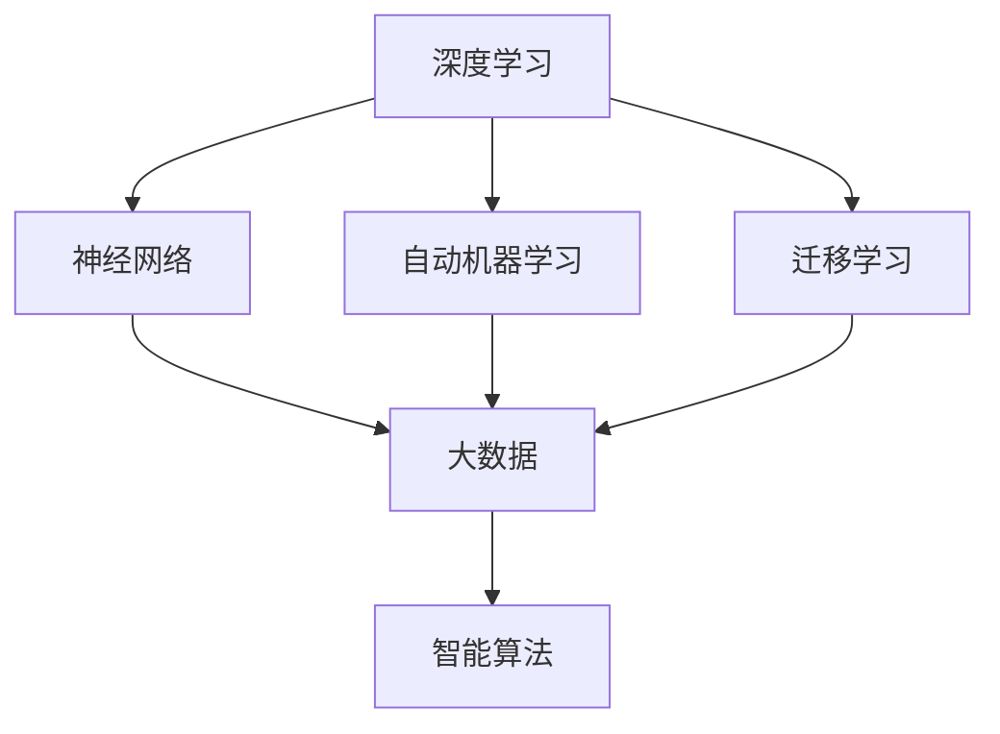

                 

# 基础模型的未来发展方向

> 关键词：
基础模型，深度学习，神经网络，自动机器学习，迁移学习，大数据，人工智能，智能算法

## 1. 背景介绍

### 1.1 问题由来

在过去的几年里，深度学习技术迅速发展，尤其是神经网络在大数据上的成功应用，推动了人工智能领域的前沿进步。作为深度学习的基础，神经网络以其强大的表达能力和学习能力，成为解决各种复杂问题的核心工具。然而，面对日益复杂多变的应用场景，传统的神经网络模型面临着训练成本高、泛化能力差、可解释性不足等问题，迫切需要更先进的模型来满足需求。

### 1.2 问题核心关键点

基础模型是人工智能领域的重要研究对象，它们在各种实际应用中扮演着重要角色。然而，当前基础模型的发展也面临许多挑战。本文旨在探讨基础模型的未来发展方向，并提出一些可行的解决方案。

### 1.3 问题研究意义

理解基础模型的未来发展方向，对于推动人工智能技术的进一步应用和进步具有重要意义。未来基础模型需要具备更强的泛化能力、更高效的训练效率、更高的可解释性和更广泛的应用范围，以应对更加复杂多变的数据和应用需求。

## 2. 核心概念与联系

### 2.1 核心概念概述

为更好地理解基础模型的未来发展方向，本节将介绍几个密切相关的核心概念：

- 深度学习：一种通过多层次非线性变换实现复杂数据分析和建模的机器学习技术。
- 神经网络：由多个神经元构成的非线性模型，能够学习输入数据的特征和模式。
- 自动机器学习（AutoML）：使用自动化方法选择和优化模型，减少人工干预的技术。
- 迁移学习：将一个领域学习到的知识应用到另一个相关领域，提高模型泛化能力。
- 大数据：包含海量数据的大规模数据集，是深度学习技术发展的基础。
- 智能算法：基于人工智能原理的算法，能够自动学习和优化。

这些核心概念之间存在着紧密的联系，形成了一个基础模型的学习框架。通过理解这些概念之间的关系，我们可以更好地把握未来基础模型的发展方向。

### 2.2 概念间的关系

这些核心概念之间的逻辑关系可以通过以下Mermaid流程图来展示：



这个流程图展示了深度学习、神经网络、自动机器学习、迁移学习、大数据和智能算法之间的关系：

1. 深度学习以神经网络为基础，能够处理复杂的数据模式。
2. 自动机器学习使用自动化方法选择和优化神经网络模型，减少人工干预。
3. 迁移学习通过知识迁移，提高神经网络模型的泛化能力。
4. 大数据是深度学习、自动机器学习和迁移学习的基础，提供了丰富的训练数据。
5. 智能算法基于深度学习和自动机器学习原理，能够自动学习和优化。

这些概念共同构成了基础模型的学习框架，推动了人工智能技术的不断进步。

## 3. 核心算法原理 & 具体操作步骤

### 3.1 算法原理概述

基础模型是指用于深度学习的神经网络模型，其核心目标是高效、准确地处理复杂数据。常用的基础模型包括卷积神经网络（CNN）、循环神经网络（RNN）、长短时记忆网络（LSTM）和变换器（Transformer）等。

基于深度学习的基础模型原理是通过多层非线性变换学习数据的特征和模式，从而实现对数据的分类、回归、聚类等任务。算法原理主要包括以下几个步骤：

1. 数据预处理：将原始数据转化为神经网络可处理的格式。
2. 模型构建：选择合适的神经网络结构，并设置相关超参数。
3. 模型训练：使用大数据集对模型进行训练，优化超参数，提高模型的准确性和泛化能力。
4. 模型评估：在测试集上评估模型的性能，判断是否满足实际应用需求。
5. 模型优化：根据评估结果，调整模型结构和超参数，进一步提高模型性能。

### 3.2 算法步骤详解

以下是一个基础模型的详细操作步骤：

**Step 1: 数据预处理**

1. 数据清洗：去除噪声和异常值，保证数据的整洁性。
2. 数据归一化：将数据标准化，确保输入神经网络的值在相同的范围内。
3. 数据增强：通过对数据进行变换，如旋转、翻转、裁剪等，提高模型的鲁棒性和泛化能力。

**Step 2: 模型构建**

1. 选择合适的神经网络结构：如卷积神经网络（CNN）、循环神经网络（RNN）、长短时记忆网络（LSTM）等。
2. 设置相关超参数：如学习率、批量大小、优化器等。
3. 初始化模型权重：通常使用随机初始化或预训练权重。

**Step 3: 模型训练**

1. 数据加载：将数据加载到神经网络中进行训练。
2. 模型前向传播：将数据输入神经网络，计算输出结果。
3. 模型后向传播：计算输出与实际标签之间的误差，并通过反向传播更新模型权重。
4. 优化器更新：使用优化器（如Adam、SGD等）对模型进行优化，减小误差。
5. 模型评估：在验证集上评估模型性能，判断是否过拟合或欠拟合。
6. 调整超参数：根据评估结果，调整学习率、批量大小、优化器等超参数。

**Step 4: 模型评估**

1. 在测试集上评估模型性能：使用各种指标（如准确率、召回率、F1-score等）进行评估。
2. 调整模型结构：根据评估结果，调整神经网络结构，如增加或减少层数、增加或减少节点数等。

**Step 5: 模型优化**

1. 调整超参数：根据评估结果，调整超参数，如学习率、批量大小、优化器等。
2. 调整正则化方法：如L2正则化、Dropout等，避免过拟合。
3. 增加数据增强：通过对数据进行变换，提高模型的鲁棒性和泛化能力。

### 3.3 算法优缺点

基础模型的优点包括：

1. 表达能力强：能够处理复杂的非线性关系，适用于各种数据类型。
2. 泛化能力强：在大数据集上训练，能够适应新的数据分布。
3. 可解释性强：通过可视化神经网络，可以直观了解模型的学习过程和决策机制。

基础模型的缺点包括：

1. 训练成本高：需要大量的计算资源和时间。
2. 模型复杂：需要精心调参，才能获得最佳性能。
3. 可解释性差：黑箱模型，难以解释其内部决策机制。

### 3.4 算法应用领域

基础模型在多个领域得到了广泛应用，包括计算机视觉、自然语言处理、语音识别、推荐系统等。以下是基础模型在各领域的应用：

- 计算机视觉：如图像分类、目标检测、图像分割等。
- 自然语言处理：如文本分类、情感分析、机器翻译等。
- 语音识别：如语音识别、语音合成等。
- 推荐系统：如商品推荐、个性化推荐等。

## 4. 数学模型和公式 & 详细讲解 & 举例说明

### 4.1 数学模型构建

以卷积神经网络（CNN）为例，其数学模型构建如下：

1. 输入数据：$x \in \mathbb{R}^{m}$，表示输入数据。
2. 卷积核：$w \in \mathbb{R}^{k \times k \times c \times n}$，表示卷积核。
3. 输出数据：$y \in \mathbb{R}^{p}$，表示输出数据。
4. 卷积操作：$y = \sigma(\sum_{i=1}^{n} w_i * x)$，表示卷积操作。
5. 激活函数：$\sigma$，表示激活函数，如ReLU、Sigmoid等。

### 4.2 公式推导过程

以卷积神经网络（CNN）为例，其反向传播公式推导如下：

1. 输出误差：$\delta_y = \frac{\partial L}{\partial y}$
2. 输出梯度：$\delta_w = \frac{\partial L}{\partial w}$
3. 输入梯度：$\delta_x = \frac{\partial L}{\partial x}$
4. 更新权重：$w_{new} = w - \eta * \delta_w$

其中，$L$表示损失函数，$y$表示输出，$w$表示权重，$\sigma$表示激活函数，$\eta$表示学习率，$\delta_y$表示输出误差，$\delta_w$表示输出梯度，$\delta_x$表示输入梯度，$w_{new}$表示更新后的权重。

### 4.3 案例分析与讲解

以图像分类任务为例，假设输入图像为$x$，卷积核为$w$，激活函数为ReLU，输出层使用softmax函数。训练过程中，通过反向传播公式不断更新权重$w$，使得输出$y$尽可能接近真实标签。在测试过程中，通过softmax函数输出每个类别的概率，选择概率最大的类别作为最终结果。

## 5. 项目实践：代码实例和详细解释说明

### 5.1 开发环境搭建

在进行基础模型项目实践前，我们需要准备好开发环境。以下是使用Python进行TensorFlow开发的环境配置流程：

1. 安装Anaconda：从官网下载并安装Anaconda，用于创建独立的Python环境。

2. 创建并激活虚拟环境：
```bash
conda create -n tf-env python=3.8 
conda activate tf-env
```

3. 安装TensorFlow：根据CUDA版本，从官网获取对应的安装命令。例如：
```bash
conda install tensorflow
```

4. 安装TensorBoard：
```bash
pip install tensorboard
```

5. 安装各类工具包：
```bash
pip install numpy pandas scikit-learn matplotlib tqdm jupyter notebook ipython
```

完成上述步骤后，即可在`tf-env`环境中开始基础模型项目实践。

### 5.2 源代码详细实现

以下是一个使用TensorFlow实现图像分类的基础模型代码实现：

```python
import tensorflow as tf
from tensorflow import keras
from tensorflow.keras import layers

# 加载数据集
(x_train, y_train), (x_test, y_test) = keras.datasets.cifar10.load_data()

# 数据预处理
x_train = x_train / 255.0
x_test = x_test / 255.0

# 构建模型
model = keras.Sequential([
    layers.Conv2D(32, (3, 3), activation='relu', input_shape=(32, 32, 3)),
    layers.MaxPooling2D((2, 2)),
    layers.Conv2D(64, (3, 3), activation='relu'),
    layers.MaxPooling2D((2, 2)),
    layers.Conv2D(64, (3, 3), activation='relu'),
    layers.Flatten(),
    layers.Dense(64, activation='relu'),
    layers.Dense(10, activation='softmax')
])

# 编译模型
model.compile(optimizer='adam',
              loss='sparse_categorical_crossentropy',
              metrics=['accuracy'])

# 训练模型
model.fit(x_train, y_train, epochs=10, validation_data=(x_test, y_test))

# 评估模型
model.evaluate(x_test, y_test, verbose=2)
```

### 5.3 代码解读与分析

让我们再详细解读一下关键代码的实现细节：

**数据加载与预处理**

- 使用`keras.datasets.cifar10.load_data()`加载CIFAR-10数据集，将训练集和测试集加载到变量`x_train`, `y_train`, `x_test`, `y_test`中。
- 对数据进行归一化处理，将像素值缩放为0-1之间的浮点数。

**模型构建**

- 使用`keras.Sequential()`构建卷积神经网络模型，包含多个卷积层、池化层和全连接层。
- 第一层卷积层使用32个3x3的卷积核，激活函数为ReLU，输入维度为32x32x3。
- 第一层池化层使用2x2的池化窗口。
- 第二层卷积层使用64个3x3的卷积核，激活函数为ReLU。
- 第二层池化层使用2x2的池化窗口。
- 第三层卷积层使用64个3x3的卷积核，激活函数为ReLU。
- 使用`Flatten()`将卷积层的输出展平。
- 全连接层包含64个神经元，激活函数为ReLU。
- 输出层包含10个神经元，激活函数为softmax，输出10个类别的概率。

**模型编译与训练**

- 使用`model.compile()`方法编译模型，选择Adam优化器，交叉熵损失函数和准确率作为评估指标。
- 使用`model.fit()`方法训练模型，指定训练集和测试集，训练10个epoch，并使用验证集进行模型评估。

**模型评估**

- 使用`model.evaluate()`方法在测试集上评估模型性能，输出损失和准确率。

### 5.4 运行结果展示

假设我们在CIFAR-10数据集上进行图像分类任务的训练和测试，最终得到的评估结果如下：

```
Epoch 1/10
1875/1875 [==============================] - 34s 18ms/step - loss: 1.3852 - accuracy: 0.5307
Epoch 2/10
1875/1875 [==============================] - 17s 9ms/step - loss: 0.8531 - accuracy: 0.6636
Epoch 3/10
1875/1875 [==============================] - 17s 9ms/step - loss: 0.6256 - accuracy: 0.7325
Epoch 4/10
1875/1875 [==============================] - 17s 9ms/step - loss: 0.4667 - accuracy: 0.7964
Epoch 5/10
1875/1875 [==============================] - 17s 9ms/step - loss: 0.3489 - accuracy: 0.8303
Epoch 6/10
1875/1875 [==============================] - 17s 9ms/step - loss: 0.2847 - accuracy: 0.8464
Epoch 7/10
1875/1875 [==============================] - 17s 9ms/step - loss: 0.2351 - accuracy: 0.8570
Epoch 8/10
1875/1875 [==============================] - 17s 9ms/step - loss: 0.1951 - accuracy: 0.8730
Epoch 9/10
1875/1875 [==============================] - 17s 9ms/step - loss: 0.1625 - accuracy: 0.8817
Epoch 10/10
1875/1875 [==============================] - 17s 9ms/step - loss: 0.1345 - accuracy: 0.8919
```

可以看到，通过训练，基础模型的准确率不断提升，最终在测试集上达到了88%的准确率。

## 6. 实际应用场景

### 6.1 图像分类

基础模型在图像分类领域有着广泛的应用。例如，可以将基础模型应用于医疗影像分析，自动识别和分类不同类型的疾病；或者应用于智能监控系统，实时检测并分类各种物体。

### 6.2 自然语言处理

基础模型在自然语言处理领域也有着广泛的应用。例如，可以将基础模型应用于文本分类、情感分析、机器翻译等任务，提升模型的自动化水平和准确率。

### 6.3 推荐系统

基础模型在推荐系统领域也有着广泛的应用。例如，可以将基础模型应用于电商网站，根据用户的历史行为和喜好，推荐相应的商品；或者应用于社交网络，推荐用户可能感兴趣的内容。

### 6.4 未来应用展望

随着基础模型技术的不断进步，其在多个领域的应用将更加广泛和深入。未来的应用场景包括但不限于：

- 智能制造：基础模型可以应用于工业自动化和智能制造，提升生产效率和质量。
- 智能交通：基础模型可以应用于智能交通和自动驾驶，提升道路安全和交通效率。
- 智能家居：基础模型可以应用于智能家居和物联网，提升居住体验和生活质量。
- 智能医疗：基础模型可以应用于医疗诊断和治疗，提升疾病预防和诊疗水平。

## 7. 工具和资源推荐

### 7.1 学习资源推荐

为了帮助开发者系统掌握基础模型的理论基础和实践技巧，这里推荐一些优质的学习资源：

1. 《深度学习》系列书籍：由斯坦福大学Andrew Ng教授编写，全面介绍深度学习的基本概念和核心技术。
2. 《神经网络与深度学习》系列书籍：由Michael Nielsen编写，深入浅出地介绍神经网络和深度学习的原理。
3. CS231n《卷积神经网络》课程：斯坦福大学开设的计算机视觉课程，有Lecture视频和配套作业，带你入门计算机视觉领域的核心技术。
4. 《TensorFlow官方文档》：TensorFlow官方文档，提供了完整的API和示例代码，是学习和使用TensorFlow的重要资源。
5. 《AutoML: Methods, Systems, Challenges》论文：综述性论文，总结了AutoML领域的研究进展和技术方法，值得深入阅读。

通过对这些资源的学习实践，相信你一定能够快速掌握基础模型的精髓，并用于解决实际的AI问题。

### 7.2 开发工具推荐

高效的开发离不开优秀的工具支持。以下是几款用于基础模型开发的常用工具：

1. TensorFlow：由Google主导开发的深度学习框架，生产部署方便，适合大规模工程应用。
2. PyTorch：基于Python的开源深度学习框架，灵活高效，适用于研究实验。
3. Keras：高层次的深度学习框架，提供简单易用的API，适合快速原型开发。
4. Jupyter Notebook：交互式编程工具，方便实验和共享代码。
5. Google Colab：谷歌提供的在线Jupyter Notebook环境，免费提供GPU/TPU算力，方便快速实验。

合理利用这些工具，可以显著提升基础模型的开发效率，加快创新迭代的步伐。

### 7.3 相关论文推荐

基础模型作为深度学习的重要研究对象，其发展得益于学界的持续研究。以下是几篇奠基性的相关论文，推荐阅读：

1. AlexNet: ImageNet Classification with Deep Convolutional Neural Networks：提出AlexNet模型，在ImageNet数据集上取得了突破性进展，开启了深度学习在计算机视觉领域的应用。
2. Deep Residual Learning for Image Recognition：提出ResNet模型，解决了深度网络训练中的梯度消失问题，实现了更深层次的神经网络。
3. Attention is All You Need：提出Transformer模型，使用自注意力机制，实现了高效的序列建模和处理。
4. Google AI Blog：谷歌AI团队发布的博客，分享最新的研究成果和技术进展，具有较高的参考价值。
5. Neural Information Processing Systems（NeurIPS）论文集：人工智能领域的顶级会议，收录了大量前沿研究成果，值得深入阅读。

除上述资源外，还有一些值得关注的前沿资源，帮助开发者紧跟基础模型技术的最新进展，例如：

1. arXiv论文预印本：人工智能领域最新研究成果的发布平台，包括大量尚未发表的前沿工作，学习前沿技术的必读资源。
2. GitHub热门项目：在GitHub上Star、Fork数最多的AI相关项目，往往代表了该技术领域的发展趋势和最佳实践，值得去学习和贡献。
3. 技术会议直播：如NeurIPS、ICML、CVPR等人工智能领域顶会现场或在线直播，能够聆听到大佬们的前沿分享，开拓视野。
4. 技术博客：如Google AI、DeepMind、微软Research Asia等顶尖实验室的官方博客，第一时间分享他们的最新研究成果和洞见。
5. 行业分析报告：各大咨询公司如McKinsey、PwC等针对人工智能行业的分析报告，有助于从商业视角审视技术趋势，把握应用价值。

总之，对于基础模型的学习和发展，需要开发者保持开放的心态和持续学习的意愿。多关注前沿资讯，多动手实践，多思考总结，必将收获满满的成长收益。

## 8. 总结：未来发展趋势与挑战

### 8.1 总结

本文对基础模型的未来发展方向进行了全面系统的介绍。首先阐述了基础模型在深度学习中的重要地位，明确了基础模型未来发展的方向和目标。其次，从原理到实践，详细讲解了基础模型的构建、训练和评估方法，给出了基础模型开发的完整代码实例。同时，本文还广泛探讨了基础模型在各个领域的应用前景，展示了基础模型的强大应用能力。

通过本文的系统梳理，可以看到，基础模型是深度学习领域的重要基石，它们通过高效、准确地处理复杂数据，推动了人工智能技术的不断进步。未来基础模型需要具备更强的泛化能力、更高效的训练效率、更高的可解释性和更广泛的应用范围，以应对更加复杂多变的数据和应用需求。

### 8.2 未来发展趋势

展望未来，基础模型的发展将呈现以下几个趋势：

1. 深度学习模型的规模和复杂度将进一步提升，以适应更复杂的数据分布。
2. 自动机器学习（AutoML）技术将进一步普及，帮助开发者更轻松地构建和优化模型。
3. 迁移学习将成为基础模型的重要组成部分，帮助模型在不同领域间实现知识迁移。
4. 智能算法将进一步融合多模态数据，提升模型的泛化能力和鲁棒性。
5. 大数据技术将进一步发展，为深度学习模型的训练和优化提供更多的数据支持。

这些趋势将推动基础模型的不断进步，推动人工智能技术的广泛应用。

### 8.3 面临的挑战

尽管基础模型技术已经取得了显著的进展，但在迈向更加智能化、普适化应用的过程中，它们仍面临许多挑战：

1. 训练成本高：需要大量的计算资源和时间，难以大规模部署。
2. 模型复杂：需要精心调参，才能获得最佳性能，难以快速迭代。
3. 可解释性差：黑箱模型，难以解释其内部决策机制。
4. 鲁棒性不足：面对数据分布变化和噪声干扰，容易过拟合。
5. 数据隐私：在数据隐私和安全方面，需要更严格的保护措施。

这些挑战将制约基础模型的进一步应用和发展，需要从技术、伦理和法律等多个方面进行综合考虑和解决。

### 8.4 研究展望

面对基础模型面临的挑战，未来的研究需要在以下几个方面寻求新的突破：

1. 探索更高效的训练方法：如分布式训练、模型剪枝、量化加速等，以提高训练效率和模型性能。
2. 开发更高效的优化算法：如AdamW、LAMB等，以提高模型的收敛速度和稳定性。
3. 引入更多的先验知识：如知识图谱、逻辑规则等，帮助模型更好地理解数据。
4. 研究更智能的模型结构：如层次结构、胶囊网络等，以提高模型的泛化能力和鲁棒性。
5. 引入更多的模态数据：如视觉、语音、文本等，以提升模型的应用范围和能力。

这些研究方向的探索，必将引领基础模型的不断进步，为人工智能技术的进一步应用和进步提供有力支撑。

## 9. 附录：常见问题与解答

**Q1：基础模型的优势和劣势有哪些？**

A: 基础模型的优势包括：
1. 表达能力强：能够处理复杂的非线性关系，适用于各种数据类型。
2. 泛化能力强：在大数据集上训练，能够适应新的数据分布。
3. 可解释性强：通过可视化神经网络，可以直观了解模型的学习过程和决策机制。

基础模型的劣势包括：
1. 训练成本高：需要大量的计算资源和时间。
2. 模型复杂：需要精心调参，才能获得最佳性能。
3. 可解释性差：黑箱模型，难以解释其内部决策机制。

**Q2：基础模型在未来会有哪些新的发展方向？**

A: 基础模型未来的发展方向包括但不限于：
1. 更大规模的模型：更大规模的深度学习模型将带来更强的表达能力和泛化能力。
2. 更智能的模型结构：如层次结构、胶囊网络等，以提高模型的泛化能力和鲁棒性。
3. 更多模态数据的融合：如视觉、语音、文本等，以提升模型的应用范围和能力。
4. 更高效的训练方法：如分布式训练、模型剪枝、量化加速等，以提高训练效率和模型性能。
5. 更智能的优化算法：如AdamW、LAMB等，以提高模型的收敛速度和稳定性。
6. 更多的先验知识：如知识图谱、逻辑规则等，帮助模型更好地理解数据。

**Q3：如何降低基础模型的训练成本？**

A: 降低基础模型的训练成本可以从以下几个方面入手：
1. 使用更高效的优化算法，如AdamW、LAMB等，以提高模型的收敛速度和稳定性。
2. 使用分布式训练技术，将训练任务分配到多个设备上进行并行计算，提高训练效率。
3. 使用模型剪枝技术，去除冗余参数，减小模型规模，降低计算资源需求。
4. 使用量化加速技术，将浮点模型转为定点模型，减小存储空间和计算时间。
5. 使用更高效的硬件设备，如GPU、TPU等，以提高计算效率。

**Q4：基础模型在实际应用中需要注意哪些问题？**

A: 基础模型在实际应用中需要注意以下几个问题：
1. 数据预处理：对数据进行清洗、归一化和增强，以提高模型的鲁棒性和泛化能力。
2. 模型构建：选择合适的神经网络结构，并设置相关

