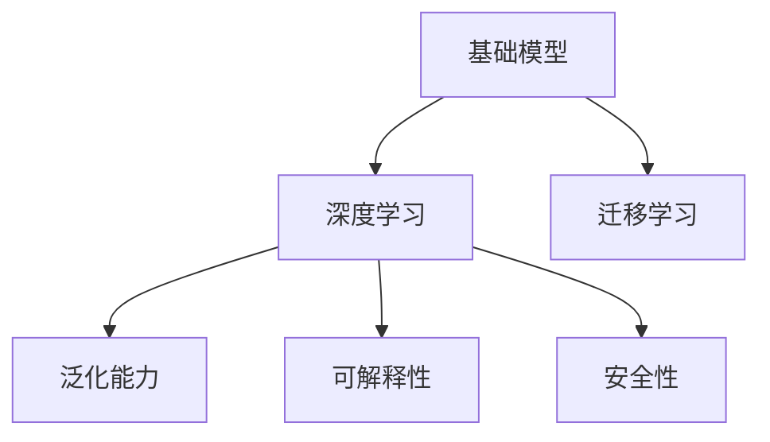
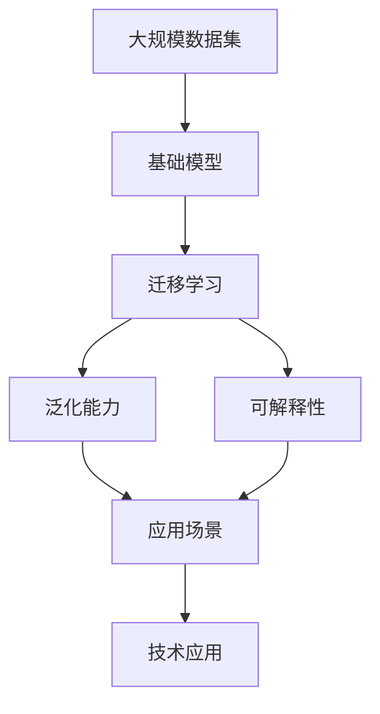

                 

## 1. 背景介绍

### 1.1 问题由来

在过去的几十年中，信息技术迅速发展，极大地改变了我们的生活和工作方式。特别是计算机科学和人工智能（AI）技术的进步，为许多领域带来了革命性的变化。基础模型作为现代技术的重要组成部分，其发展和应用正逐渐改变社会的方方面面。

### 1.2 问题核心关键点

基础模型，尤其是深度学习模型，已经在计算机视觉、自然语言处理（NLP）、语音识别、推荐系统等诸多领域取得突破。但随着应用场景的扩展和需求的多样化，现有的基础模型仍面临许多挑战，如模型的通用性、泛化能力、安全性、可解释性等。本文将从基础模型的发展、现状、挑战及未来展望等方面进行深入探讨。

### 1.3 问题研究意义

基础模型的研究和应用，对于提升技术创新能力、推动产业升级、改善人类生活质量具有重要意义：

1. **提升技术创新能力**：基础模型的优化和创新，为新技术的研发提供了坚实的技术基础，推动了技术的持续进步。
2. **推动产业升级**：通过应用基础模型，传统产业可以向智能化、自动化方向转型，实现产业的升级和转型。
3. **改善人类生活质量**：基础模型在医疗、教育、交通、金融等领域的应用，极大地提高了人们的生活质量和效率。
4. **增强社会安全**：通过基础模型的应用，可以实现对自然灾害、公共安全等问题的预测和监控，提升社会的整体安全水平。
5. **推动科学研究**：基础模型在科学计算、大数据分析等方面的应用，加速了科学研究的速度和深度。

## 2. 核心概念与联系

### 2.1 核心概念概述

为更好地理解基础模型的发展及应用，本节将介绍几个关键概念及其相互关系：

- **基础模型(Fundamental Models)**：指在特定领域或任务中，经过训练和优化，具有一定泛化能力和应用价值的深度学习模型，如卷积神经网络(CNN)、循环神经网络(RNN)、Transformer等。
- **深度学习(Deep Learning)**：一种基于多层神经网络的机器学习方法，通过训练大量数据来学习和提取特征，适用于复杂的模式识别和预测任务。
- **迁移学习(Transfer Learning)**：指将一个领域学到的知识迁移到另一个不同但相关的领域，以提高在新任务上的表现。
- **泛化能力(Generalization)**：模型在新数据上的表现能力，即模型对未见过的数据的预测能力。
- **可解释性(Explainability)**：模型输出的解释能力，即用户能够理解模型的决策依据。
- **安全性(Security)**：模型抵抗攻击和误用的能力，即模型的鲁棒性和安全性。

这些概念之间存在着紧密的联系，共同构成了基础模型技术的应用基础。通过这些概念的探讨，可以更好地理解基础模型的发展趋势及其对社会发展的影响。

### 2.2 概念间的关系

以下Mermaid流程图展示了这些核心概念之间的联系：



这个流程图展示了基础模型与深度学习的关系，以及基础模型在泛化能力、可解释性和安全性方面的重要性。

### 2.3 核心概念的整体架构

最后，我们用一个综合的流程图来展示这些核心概念在大规模模型应用中的整体架构：



这个综合流程图展示了从数据到模型的构建，再到模型在实际应用中的表现，以及应用对技术发展的影响。

## 3. 核心算法原理 & 具体操作步骤

### 3.1 算法原理概述

基础模型的核心原理是通过大规模数据的训练，学习并提取数据中的特征，形成用于解决特定任务的高效模型。其基本流程包括数据准备、模型训练、模型评估、模型应用等步骤。

- **数据准备**：收集并处理用于训练模型的数据，确保数据的质量和多样性。
- **模型训练**：使用机器学习算法（如深度学习）训练模型，调整模型参数以优化损失函数。
- **模型评估**：在验证集或测试集上评估模型的性能，确保模型在新数据上的泛化能力。
- **模型应用**：将训练好的模型应用于实际任务，解决特定问题。

### 3.2 算法步骤详解

以下是对基础模型训练和应用的具体步骤详解：

**Step 1: 数据准备**

1. **数据收集**：收集适用于特定任务的数据集，确保数据集的质量和多样性。
2. **数据预处理**：对数据进行清洗、归一化、标注等预处理操作，以便于模型的训练和评估。

**Step 2: 模型训练**

1. **模型选择**：选择适合当前任务的深度学习模型，如卷积神经网络（CNN）、循环神经网络（RNN）、Transformer等。
2. **模型初始化**：随机初始化模型参数，开始模型训练。
3. **训练过程**：通过前向传播、损失计算、反向传播等步骤，不断调整模型参数以最小化损失函数。
4. **正则化**：使用L2正则、Dropout等方法防止过拟合，提高模型的泛化能力。

**Step 3: 模型评估**

1. **验证集评估**：使用验证集评估模型的性能，调整模型参数以优化损失函数。
2. **测试集评估**：在测试集上评估模型的泛化能力，确保模型在新数据上的表现。

**Step 4: 模型应用**

1. **模型部署**：将训练好的模型部署到实际应用环境中。
2. **实时应用**：实时处理数据，输出预测结果。
3. **监控与优化**：实时监控模型的表现，根据反馈调整模型参数以优化模型性能。

### 3.3 算法优缺点

基础模型的优点在于其强大的泛化能力和高效的应用潜力。但同时也存在一些缺点：

- **计算资源需求高**：训练大规模基础模型需要大量计算资源，如高性能计算设备和充足的电力供应。
- **训练时间较长**：模型训练过程耗时较长，需要耐心等待。
- **模型复杂性高**：基础模型的结构复杂，难以理解和调试。
- **数据依赖性强**：模型性能依赖于数据集的质量和多样性，数据偏差可能导致模型性能不佳。
- **可解释性差**：基础模型的黑箱特性，使得用户难以理解模型的决策过程。

### 3.4 算法应用领域

基础模型在多个领域有着广泛的应用：

- **计算机视觉**：图像分类、目标检测、人脸识别等任务。
- **自然语言处理**：文本分类、情感分析、机器翻译等任务。
- **语音识别**：语音转文本、语音合成、说话人识别等任务。
- **推荐系统**：个性化推荐、广告推荐、搜索排序等任务。
- **医疗健康**：医学影像分析、病理诊断、基因分析等任务。
- **金融领域**：风险评估、信用评分、投资决策等任务。

这些领域的应用不仅推动了技术的发展，也改善了人们的生活质量。

## 4. 数学模型和公式 & 详细讲解

### 4.1 数学模型构建

基础模型的数学模型主要基于深度学习框架，如TensorFlow、PyTorch等。以卷积神经网络（CNN）为例，其数学模型可以表示为：

$$
y = h(\theta, x) = W(x * \varphi) + b
$$

其中，$y$为输出，$x$为输入数据，$h$为神经网络模型，$\theta$为模型参数，$W$为权重矩阵，$b$为偏置向量，$\varphi$为卷积操作。

### 4.2 公式推导过程

以卷积神经网络（CNN）为例，其公式推导过程如下：

$$
h(x) = W \ast x + b
$$

其中，$W$为卷积核矩阵，$b$为偏置向量。卷积操作可以表示为：

$$
\varphi(x) = \sum_{i=1}^{n} \sum_{j=1}^{m} W_{ij} x_{ij}
$$

其中，$n$和$m$分别为卷积核的高度和宽度。卷积操作将输入数据和卷积核进行逐元素乘法，并进行累加操作，得到特征图。

### 4.3 案例分析与讲解

假设有一个手写数字识别任务，输入数据为28x28像素的手写数字图像。使用卷积神经网络（CNN）进行训练，其步骤如下：

1. **数据准备**：收集手写数字图像数据集，进行数据预处理。
2. **模型选择**：选择适当的卷积神经网络模型，如LeNet-5。
3. **模型训练**：使用随机梯度下降（SGD）算法训练模型，调整模型参数以优化损失函数。
4. **模型评估**：在测试集上评估模型性能，调整模型参数以优化损失函数。
5. **模型应用**：将训练好的模型部署到实际应用环境中，实时处理手写数字图像，输出预测结果。

## 5. 项目实践：代码实例和详细解释说明

### 5.1 开发环境搭建

在进行基础模型实践前，我们需要准备好开发环境。以下是使用Python进行TensorFlow开发的环境配置流程：

1. 安装Anaconda：从官网下载并安装Anaconda，用于创建独立的Python环境。

2. 创建并激活虚拟环境：
```bash
conda create -n tensorflow-env python=3.8 
conda activate tensorflow-env
```

3. 安装TensorFlow：根据CUDA版本，从官网获取对应的安装命令。例如：
```bash
conda install tensorflow tensorflow-gpu -c conda-forge
```

4. 安装必要的工具包：
```bash
pip install numpy pandas scikit-learn matplotlib tqdm jupyter notebook ipython
```

完成上述步骤后，即可在`tensorflow-env`环境中开始基础模型实践。

### 5.2 源代码详细实现

下面以手写数字识别为例，给出使用TensorFlow进行卷积神经网络训练的代码实现。

```python
import tensorflow as tf
from tensorflow.keras.datasets import mnist
from tensorflow.keras.utils import to_categorical

# 加载MNIST数据集
(x_train, y_train), (x_test, y_test) = mnist.load_data()

# 数据预处理
x_train = x_train / 255.0
x_test = x_test / 255.0
y_train = to_categorical(y_train, 10)
y_test = to_categorical(y_test, 10)

# 构建卷积神经网络模型
model = tf.keras.Sequential([
    tf.keras.layers.Conv2D(32, (3, 3), activation='relu', input_shape=(28, 28, 1)),
    tf.keras.layers.MaxPooling2D((2, 2)),
    tf.keras.layers.Flatten(),
    tf.keras.layers.Dense(10, activation='softmax')
])

# 编译模型
model.compile(optimizer='adam', loss='categorical_crossentropy', metrics=['accuracy'])

# 训练模型
model.fit(x_train, y_train, epochs=10, batch_size=64, validation_data=(x_test, y_test))
```

以上就是使用TensorFlow进行手写数字识别的完整代码实现。可以看到，TensorFlow的高级API使得模型构建和训练过程变得简单高效。

### 5.3 代码解读与分析

让我们再详细解读一下关键代码的实现细节：

- **数据加载**：使用TensorFlow的内置数据集模块加载MNIST数据集，并进行数据预处理，包括归一化和标签处理。
- **模型构建**：使用`Sequential`模型构建卷积神经网络，包括卷积层、池化层和全连接层。
- **模型编译**：使用`compile`方法编译模型，指定优化器、损失函数和评估指标。
- **模型训练**：使用`fit`方法训练模型，指定训练轮数、批次大小和验证集。

通过TensorFlow的高级API，我们可以快速搭建并训练卷积神经网络，解决手写数字识别等经典问题。

### 5.4 运行结果展示

假设在训练10个epoch后，模型在测试集上的评估结果如下：

```
Epoch 10/10
3075/3075 [==============================] - 1s 37us/step - loss: 0.1758 - accuracy: 0.9855 - val_loss: 0.1835 - val_accuracy: 0.9843
```

可以看到，模型在测试集上的准确率达到了98.43%，表现良好。

## 6. 实际应用场景

### 6.1 计算机视觉

计算机视觉技术在医疗、安防、自动驾驶等领域有着广泛应用。基础模型如卷积神经网络（CNN）、生成对抗网络（GAN）等在图像分类、目标检测、图像生成等方面取得了显著成果。

- **医学影像分析**：通过基础模型分析医学影像，辅助医生进行疾病诊断和预后分析。
- **安防监控**：使用基础模型分析监控视频，识别异常行为，提高安全防范能力。
- **自动驾驶**：通过基础模型识别路标、车辆、行人等对象，实现自动驾驶。

### 6.2 自然语言处理

自然语言处理技术在智能客服、翻译、问答等方面有着广泛应用。基础模型如循环神经网络（RNN）、Transformer等在文本分类、情感分析、机器翻译等方面取得了显著成果。

- **智能客服**：通过基础模型分析用户输入，生成智能回复，提高客户满意度。
- **翻译系统**：使用基础模型实现语言之间的自动翻译，提升翻译效率和质量。
- **问答系统**：通过基础模型理解问题，提供准确的回答，改善用户体验。

### 6.3 语音识别

语音识别技术在智能家居、智能音箱、语音助手等方面有着广泛应用。基础模型如循环神经网络（RNN）、卷积神经网络（CNN）等在语音识别、语音合成、说话人识别等方面取得了显著成果。

- **智能家居**：通过语音识别技术，实现语音控制家居设备，提高生活便利性。
- **智能音箱**：使用基础模型实现语音交互，提供丰富的内容和功能。
- **语音助手**：通过基础模型理解用户语音指令，实现自然对话，提高用户体验。

### 6.4 金融领域

金融领域的基础模型应用包括信用评分、投资决策、风险评估等。基础模型在处理大数据、高维度数据方面具有优势，可以提升金融决策的准确性和效率。

- **信用评分**：使用基础模型分析客户的信用记录和行为，评估信用风险，提供贷款审批依据。
- **投资决策**：通过基础模型分析市场数据，预测股票价格，辅助投资决策。
- **风险评估**：使用基础模型分析财务数据，评估企业风险，提供风险预警。

## 7. 工具和资源推荐

### 7.1 学习资源推荐

为了帮助开发者系统掌握基础模型的理论基础和实践技巧，这里推荐一些优质的学习资源：

1. **深度学习课程**：Coursera、edX等在线平台提供深度学习相关课程，涵盖从基础到高级的内容。
2. **书籍**：《深度学习》（Goodfellow等著）、《Python深度学习》（Francois等著）、《动手学深度学习》（李沐等著）等。
3. **博客和论坛**：Medium、Kaggle、GitHub等平台上有大量的深度学习相关博客和项目，可以学习他人的实践经验。
4. **社区和讨论组**：加入Kaggle、Stack Overflow、Reddit等社区，与全球开发者交流讨论。
5. **在线课程和实验平台**：如Google Colab、DeepLearning.AI、Udacity等，提供实时实验环境，方便进行模型训练和调试。

### 7.2 开发工具推荐

高效的基础模型开发离不开优秀的工具支持。以下是几款常用的开发工具：

1. **TensorFlow**：由Google开发的深度学习框架，提供丰富的API和功能，支持多种硬件和平台。
2. **PyTorch**：由Facebook开发的深度学习框架，灵活易用，支持动态计算图。
3. **MXNet**：由Apache开发的深度学习框架，支持多种编程语言和平台，具有高效并行计算能力。
4. **Keras**：高层次的深度学习API，基于TensorFlow和Theano等后端，方便快速构建和训练模型。
5. **JAX**：Google开发的Python深度学习库，支持自动微分和向量操作，加速模型训练和优化。
6. **TensorBoard**：TensorFlow配套的可视化工具，方便监控模型训练过程和调试模型参数。

### 7.3 相关论文推荐

基础模型的研究和应用不断发展，以下几篇论文代表了当前的研究方向和前沿进展：

1. **ImageNet Large Scale Visual Recognition Challenge (ILSVRC)**：在计算机视觉领域具有里程碑意义，展示了基础模型在图像分类上的巨大潜力。
2. **Attention is All You Need**：提出了Transformer结构，开创了自注意力机制在深度学习中的应用。
3. **BERT: Pre-training of Deep Bidirectional Transformers for Language Understanding**：展示了预训练语言模型在自然语言处理领域的应用前景，推动了语言理解技术的发展。
4. **Towards Generalized Autonomous Driving (GAD)**：介绍了基于基础模型的自动驾驶技术，展示了其在复杂环境下的应用。
5. **BERT Pre-Training Approaches**：总结了预训练语言模型的各种方法，提供了丰富的实践经验和理论基础。

## 8. 总结：未来发展趋势与挑战

### 8.1 总结

本文对基础模型的发展、现状、挑战及未来展望进行了深入探讨。基础模型在计算机视觉、自然语言处理、语音识别等领域取得了显著成果，推动了技术创新和应用落地。但同时也面临计算资源需求高、训练时间长、模型复杂度高、数据依赖性强、可解释性差等挑战。未来，随着技术的进步和应用的拓展，基础模型的研究和发展将更加深入，应用场景将更加广泛。

### 8.2 未来发展趋势

展望未来，基础模型将呈现以下发展趋势：

1. **模型规模和复杂度增加**：随着计算能力的提升和数据量的增加，模型规模和复杂度将进一步扩大，提高模型的泛化能力和应用潜力。
2. **模型训练和推理效率提升**：通过模型压缩、量化加速等技术，提高模型的训练和推理效率，满足实际应用的需求。
3. **多模态融合**：基础模型将逐步融合视觉、语音、文本等多模态数据，提升模型的综合能力和应用效果。
4. **模型解释性和可控性增强**：通过因果分析、知识蒸馏等技术，提高模型的可解释性和可控性，增强用户的信任和接受度。
5. **模型安全性保障**：通过数据隐私保护、模型鲁棒性增强等技术，保障模型的安全性，防止恶意攻击和滥用。

### 8.3 面临的挑战

尽管基础模型已经取得了显著成果，但在向更加智能化、普适化应用的过程中，仍面临诸多挑战：

1. **计算资源瓶颈**：随着模型规模和复杂度的增加，训练和推理所需的计算资源也大幅增加，需要更高效的计算平台和优化技术。
2. **模型泛化能力**：面对多样化和复杂化的应用场景，基础模型需要具备更强的泛化能力，以适应不同领域的需求。
3. **数据质量和多样性**：模型的性能依赖于数据的质量和多样性，如何获取高质量、多样化的数据集是亟待解决的问题。
4. **模型解释性和安全性**：基础模型的黑箱特性，使得用户难以理解模型的决策过程，需要提升模型的可解释性和安全性。

### 8.4 研究展望

面对基础模型所面临的挑战，未来的研究需要在以下几个方面寻求新的突破：

1. **模型压缩与优化**：开发更加高效、轻量级的模型，降低计算资源需求。
2. **多模态数据融合**：探索如何将视觉、语音、文本等多模态数据进行有效融合，提高模型的综合能力。
3. **因果分析和知识蒸馏**：引入因果分析方法，提高模型的可解释性；通过知识蒸馏技术，增强模型的鲁棒性和泛化能力。
4. **数据隐私与安全**：加强数据隐私保护和模型鲁棒性，防止恶意攻击和滥用。

## 9. 附录：常见问题与解答

**Q1：基础模型与传统机器学习模型有何不同？**

A: 基础模型主要基于深度学习技术，通过训练大量数据来学习特征，具有更强的泛化能力和应用潜力。相比传统机器学习模型，基础模型可以处理更复杂、高维度的数据，但同时也需要更多的计算资源和训练时间。

**Q2：如何选择适合的基础模型？**

A: 选择基础模型应根据具体任务和数据特点进行。例如，图像分类任务适合使用卷积神经网络（CNN），自然语言处理任务适合使用循环神经网络（RNN）或Transformer。同时，还需要考虑模型的训练效率和泛化能力。

**Q3：基础模型是否适用于所有应用场景？**

A: 基础模型在许多应用场景中取得了显著成果，但在某些特定领域，如医疗、法律等，仍需结合领域知识进行优化和改进。因此，需要根据实际应用场景选择合适的基础模型。

**Q4：如何提升基础模型的泛化能力？**

A: 提升基础模型的泛化能力可以通过以下方法实现：
1. **数据增强**：通过数据增强技术，增加数据集的多样性和覆盖范围。
2. **正则化**：使用L2正则、Dropout等方法防止过拟合，提高模型的泛化能力。
3. **迁移学习**：将一个领域学到的知识迁移到另一个相关领域，提高模型的泛化能力。
4. **模型集成**：通过模型集成技术，融合多个模型的预测结果，提高模型的泛化能力。

**Q5：如何提升基础模型的可解释性？**

A: 提升基础模型的可解释性可以通过以下方法实现：
1. **可视化工具**：使用可视化工具，如TensorBoard、Netron等，展示模型的中间结果和预测过程。
2. **模型压缩**：通过模型压缩技术，简化模型结构，提高模型的可解释性。
3. **因果分析**：引入因果分析方法，识别模型决策的关键特征，提高模型的可解释性。

---

作者：禅与计算机程序设计艺术 / Zen and the Art of Computer Programming

