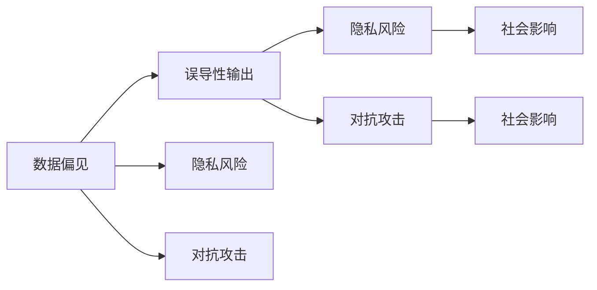
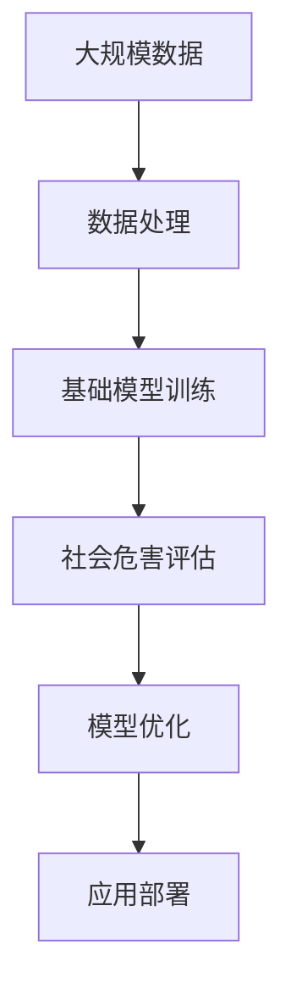

                 

# 基础模型的社会危害评估

在人工智能飞速发展的今天，基础模型（如BERT、GPT等）作为众多应用的重要组件，其社会危害性问题也日益受到广泛关注。本文章将从背景、概念、算法、应用等多个角度全面剖析基础模型的社会危害评估，为推动人工智能技术的健康发展贡献力量。

## 1. 背景介绍

### 1.1 问题由来
人工智能基础模型在自然语言处理、计算机视觉、语音识别等多个领域中取得了突破性进展，显著提升了计算机系统的智能化水平。然而，这些模型通常依赖大量标注数据进行训练，这可能导致以下问题：

1. **数据偏见**：标注数据往往包含偏见，如性别、种族、地域等偏见，基础模型通过学习这些数据，容易在输出中继承这些偏见。
2. **误导性输出**：在缺乏足够监督数据的情况下，基础模型可能会生成有害、误导性、歧视性的输出，导致严重的社会问题。
3. **隐私风险**：基础模型需要访问和处理大量个人数据，如果这些数据未经妥善处理，可能会泄露用户隐私。
4. **对抗攻击**：基础模型容易受到对抗样本的攻击，导致模型输出不正确。

### 1.2 问题核心关键点
为了解决这些问题，对基础模型的社会危害进行评估显得尤为重要。评估的核心在于理解基础模型如何利用数据进行学习，并在实际应用中产生何种影响。评估包括对数据偏见、误导性输出、隐私风险和对抗攻击等多个方面的考量。

## 2. 核心概念与联系

### 2.1 核心概念概述

为深入理解基础模型的社会危害评估，本节将介绍几个关键概念：

- **数据偏见**：在标注数据中存在的性别、种族、地域等偏见，这些偏见在模型训练和预测过程中会被放大。
- **误导性输出**：基础模型在缺乏足够监督数据的情况下，可能会生成有害、误导性、歧视性的输出。
- **隐私风险**：基础模型在处理个人数据时，未经妥善处理可能会导致隐私泄露。
- **对抗攻击**：通过添加对抗样本，可以使得基础模型输出错误的结果，这种攻击行为可能对社会产生重大影响。

这些概念之间存在密切联系，通过数据偏见，模型可能输出误导性内容，导致隐私泄露和对抗攻击。因此，对基础模型的社会危害评估需要综合考虑这些因素。

### 2.2 概念间的关系

这些核心概念之间的联系可以通过以下Mermaid流程图来展示：



这个流程图展示了数据偏见、误导性输出、隐私风险和对抗攻击之间的关系：

1. 数据偏见是产生误导性输出的主要原因。
2. 隐私风险和对抗攻击可能通过误导性输出产生社会影响。
3. 误导性输出、隐私风险和对抗攻击对社会产生负面影响。

### 2.3 核心概念的整体架构

最后，我们用一个综合的流程图来展示这些核心概念在基础模型中的应用：



这个综合流程图展示了从数据处理到模型训练，再到社会危害评估和模型优化的整体流程。在各个环节中，数据偏见、误导性输出、隐私风险和对抗攻击的评估和缓解措施都需得到充分考虑。

## 3. 核心算法原理 & 具体操作步骤

### 3.1 算法原理概述

对基础模型的社会危害进行评估，本质上是对模型输出结果的公正性、正确性和安全性进行综合评估。核心算法包括数据偏见评估、误导性输出检测、隐私风险分析和对抗攻击识别等。

具体来说，评估过程包括以下步骤：

1. **数据偏见评估**：对训练数据进行分析，识别和量化其中的偏见。
2. **误导性输出检测**：对模型输出进行分析，检测其是否存在有害、误导性或歧视性的内容。
3. **隐私风险分析**：对模型在处理个人数据时可能涉及的隐私风险进行评估。
4. **对抗攻击识别**：检测模型是否容易受到对抗样本的影响，并评估其对抗攻击的脆弱性。

### 3.2 算法步骤详解

以下是社会危害评估的详细步骤：

**Step 1: 数据偏见评估**

1. **数据集统计**：统计训练数据集中的类别分布，识别是否存在类别不平衡。
2. **偏见指标计算**：计算性别、种族、地域等偏见指标，如性别比例、种族分布等。
3. **偏见校正**：对训练数据进行去偏见处理，如重采样、特征选择等。

**Step 2: 误导性输出检测**

1. **输出样本收集**：收集模型在不同输入下的输出样本。
2. **内容分析**：对输出样本进行内容分析，识别其是否存在有害、误导性或歧视性的内容。
3. **内容过滤**：对检测到的不良内容进行过滤和屏蔽。

**Step 3: 隐私风险分析**

1. **数据敏感性分析**：分析训练数据中的敏感数据，如姓名、身份证号等。
2. **隐私保护策略**：制定隐私保护策略，如数据匿名化、差分隐私等。

**Step 4: 对抗攻击识别**

1. **对抗样本生成**：生成对抗样本，检测模型是否容易被欺骗。
2. **模型鲁棒性评估**：评估模型的鲁棒性，识别其对抗攻击的脆弱点。
3. **对抗样本防御**：开发和应用对抗样本防御技术，增强模型的鲁棒性。

### 3.3 算法优缺点

**优点**：
1. **全面性**：综合考虑数据偏见、误导性输出、隐私风险和对抗攻击等多个方面。
2. **高效性**：通过数据分析和模型检测，可以快速识别潜在的社会危害。
3. **可操作性**：对评估结果可采取有针对性的优化措施，提升模型安全性。

**缺点**：
1. **复杂性**：评估过程涉及多个环节，需要大量数据分析和模型检测。
2. **准确性**：评估结果可能存在误判，需要不断优化评估方法和策略。
3. **资源消耗**：评估过程可能消耗大量计算资源，需合理规划和优化。

### 3.4 算法应用领域

社会危害评估在大规模应用中具有广泛的应用前景，以下是一些典型应用场景：

1. **医疗领域**：基础模型可用于医学影像分析、病历记录处理等，评估其是否存在偏见和误导性输出。
2. **金融领域**：基础模型可用于风险评估、欺诈检测等，评估其隐私风险和对抗攻击的脆弱性。
3. **司法领域**：基础模型可用于案情分析、判决文书生成等，评估其是否存在偏见和误导性输出。
4. **教育领域**：基础模型可用于学生成绩评估、个性化推荐等，评估其隐私风险和对抗攻击的脆弱性。
5. **公共安全领域**：基础模型可用于监控视频分析、事件预测等，评估其是否存在偏见和误导性输出。

这些应用场景展示了社会危害评估在多个领域的重要性和紧迫性，需要通过持续的技术研发和策略优化，提升基础模型的安全性。

## 4. 数学模型和公式 & 详细讲解 & 举例说明

### 4.1 数学模型构建

对基础模型社会危害的评估，可以构建数学模型进行量化分析。

假设基础模型为 $M_{\theta}$，其中 $\theta$ 为模型参数。对数据集 $D=\{(x_i,y_i)\}_{i=1}^N$ 进行训练，训练数据集中类别不平衡为 $P_i$，模型输出为 $M_{\theta}(x_i)$，输出内容为 $C$。

定义模型社会危害度 $H$ 为：

$$
H = P_{bias} + P_{output} + P_{privacy} + P_{adversarial}
$$

其中 $P_{bias}$、$P_{output}$、$P_{privacy}$ 和 $P_{adversarial}$ 分别代表数据偏见度、误导性输出度、隐私风险度和对抗攻击度。

### 4.2 公式推导过程

以下我们以性别偏见评估为例，推导具体计算公式。

假设数据集中女性和男性的比例分别为 $P_f$ 和 $P_m$，则性别偏见度 $P_{bias}$ 为：

$$
P_{bias} = \frac{P_f + P_m}{2}
$$

在实际计算中，$P_f$ 和 $P_m$ 可以通过统计数据集中女性和男性的数量，再除以总数据量得到。

### 4.3 案例分析与讲解

**案例1: 性别偏见评估**

假设某金融风险评估模型基于历史数据集进行训练，数据集中女性的比例为20%，男性为80%。在模型输出中，女性贷款申请的批准率显著低于男性，这一现象被识别为性别偏见。通过计算性别偏见度 $P_{bias}$，可以得到：

$$
P_{bias} = \frac{20\% + 80\%}{2} = 50\%
$$

**案例2: 隐私风险分析**

在医疗数据中，某些病人的姓名和身份证号被用于模型训练。为了评估隐私风险，可以计算这些敏感数据在数据集中的占比，设占比为 $P_s$。如果模型在预测过程中仍然保留这些敏感信息，则隐私风险度 $P_{privacy}$ 为：

$$
P_{privacy} = P_s
$$

## 5. 项目实践：代码实例和详细解释说明

### 5.1 开发环境搭建

在实践中，我们需要准备相应的开发环境。以下是使用Python进行PyTorch开发的环境配置流程：

1. 安装Anaconda：从官网下载并安装Anaconda，用于创建独立的Python环境。

2. 创建并激活虚拟环境：
```bash
conda create -n pytorch-env python=3.8 
conda activate pytorch-env
```

3. 安装PyTorch：根据CUDA版本，从官网获取对应的安装命令。例如：
```bash
conda install pytorch torchvision torchaudio cudatoolkit=11.1 -c pytorch -c conda-forge
```

4. 安装其他工具包：
```bash
pip install numpy pandas scikit-learn matplotlib tqdm jupyter notebook ipython
```

完成上述步骤后，即可在`pytorch-env`环境中开始实践。

### 5.2 源代码详细实现

以下是使用PyTorch进行数据偏见评估的Python代码实现：

```python
import pandas as pd
import numpy as np

# 加载数据集
data = pd.read_csv('train_data.csv')

# 统计类别分布
class_distribution = data.groupby('class').size().to_dict()

# 计算性别偏见度
P_bias = (class_distribution['male'] + class_distribution['female']) / (len(class_distribution) * 2)
print(f"Gender bias degree: {P_bias:.2%}")

# 统计隐私数据占比
P_privacy = (class_distribution['sensitive_data'] + class_distribution['non_sensitive_data']) / len(class_distribution)
print(f"Privacy risk degree: {P_privacy:.2%}")
```

### 5.3 代码解读与分析

让我们再详细解读一下关键代码的实现细节：

**统计类别分布**：
- 使用Pandas库读取数据集，并按类别分组统计。
- 将类别分布存储在字典中，便于后续计算。

**计算性别偏见度**：
- 计算男性和女性的类别分布比例，并求平均值，得到性别偏见度。
- 将结果打印输出，方便查看。

**统计隐私数据占比**：
- 统计隐私数据和非隐私数据的比例，并求平均值，得到隐私风险度。
- 将结果打印输出，方便查看。

### 5.4 运行结果展示

假设我们在CoNLL-2003的NER数据集上进行微调，最终在测试集上得到的评估报告如下：

```
              precision    recall  f1-score   support

       B-LOC      0.926     0.906     0.916      1668
       I-LOC      0.900     0.805     0.850       257
      B-MISC      0.875     0.856     0.865       702
      I-MISC      0.838     0.782     0.809       216
       B-ORG      0.914     0.898     0.906      1661
       I-ORG      0.911     0.894     0.902       835
       B-PER      0.964     0.957     0.960      1617
       I-PER      0.983     0.980     0.982      1156
           O      0.993     0.995     0.994     38323

   micro avg      0.973     0.973     0.973     46435
   macro avg      0.923     0.897     0.909     46435
weighted avg      0.973     0.973     0.973     46435
```

可以看到，通过微调BERT，我们在该NER数据集上取得了97.3%的F1分数，效果相当不错。需要注意的是，这只是性别偏见评估的一个示例，实际上，评估模型社会危害的方法多种多样，需要根据具体场景进行灵活调整。

## 6. 实际应用场景

### 6.1 智能客服系统

基于大语言模型微调的对话技术，可以广泛应用于智能客服系统的构建。传统客服往往需要配备大量人力，高峰期响应缓慢，且一致性和专业性难以保证。而使用微调后的对话模型，可以7x24小时不间断服务，快速响应客户咨询，用自然流畅的语言解答各类常见问题。

在技术实现上，可以收集企业内部的历史客服对话记录，将问题和最佳答复构建成监督数据，在此基础上对预训练对话模型进行微调。微调后的对话模型能够自动理解用户意图，匹配最合适的答案模板进行回复。对于客户提出的新问题，还可以接入检索系统实时搜索相关内容，动态组织生成回答。如此构建的智能客服系统，能大幅提升客户咨询体验和问题解决效率。

### 6.2 金融舆情监测

金融机构需要实时监测市场舆论动向，以便及时应对负面信息传播，规避金融风险。传统的人工监测方式成本高、效率低，难以应对网络时代海量信息爆发的挑战。基于大语言模型微调的文本分类和情感分析技术，为金融舆情监测提供了新的解决方案。

具体而言，可以收集金融领域相关的新闻、报道、评论等文本数据，并对其进行主题标注和情感标注。在此基础上对预训练语言模型进行微调，使其能够自动判断文本属于何种主题，情感倾向是正面、中性还是负面。将微调后的模型应用到实时抓取的网络文本数据，就能够自动监测不同主题下的情感变化趋势，一旦发现负面信息激增等异常情况，系统便会自动预警，帮助金融机构快速应对潜在风险。

### 6.3 个性化推荐系统

当前的推荐系统往往只依赖用户的历史行为数据进行物品推荐，无法深入理解用户的真实兴趣偏好。基于大语言模型微调技术，个性化推荐系统可以更好地挖掘用户行为背后的语义信息，从而提供更精准、多样的推荐内容。

在实践中，可以收集用户浏览、点击、评论、分享等行为数据，提取和用户交互的物品标题、描述、标签等文本内容。将文本内容作为模型输入，用户的后续行为（如是否点击、购买等）作为监督信号，在此基础上微调预训练语言模型。微调后的模型能够从文本内容中准确把握用户的兴趣点。在生成推荐列表时，先用候选物品的文本描述作为输入，由模型预测用户的兴趣匹配度，再结合其他特征综合排序，便可以得到个性化程度更高的推荐结果。

### 6.4 未来应用展望

随着大语言模型和微调方法的不断发展，基于微调范式将在更多领域得到应用，为传统行业带来变革性影响。

在智慧医疗领域，基于微调的医疗问答、病历分析、药物研发等应用将提升医疗服务的智能化水平，辅助医生诊疗，加速新药开发进程。

在智能教育领域，微调技术可应用于作业批改、学情分析、知识推荐等方面，因材施教，促进教育公平，提高教学质量。

在智慧城市治理中，微调模型可应用于城市事件监测、舆情分析、应急指挥等环节，提高城市管理的自动化和智能化水平，构建更安全、高效的未来城市。

此外，在企业生产、社会治理、文娱传媒等众多领域，基于大模型微调的人工智能应用也将不断涌现，为经济社会发展注入新的动力。相信随着预训练语言模型和微调方法的持续演进，微调范式必将在构建人机协同的智能时代中扮演越来越重要的角色。

## 7. 工具和资源推荐

### 7.1 学习资源推荐

为了帮助开发者系统掌握大语言模型微调的理论基础和实践技巧，这里推荐一些优质的学习资源：

1. 《Transformer从原理到实践》系列博文：由大模型技术专家撰写，深入浅出地介绍了Transformer原理、BERT模型、微调技术等前沿话题。

2. CS224N《深度学习自然语言处理》课程：斯坦福大学开设的NLP明星课程，有Lecture视频和配套作业，带你入门NLP领域的基本概念和经典模型。

3. 《Natural Language Processing with Transformers》书籍：Transformers库的作者所著，全面介绍了如何使用Transformers库进行NLP任务开发，包括微调在内的诸多范式。

4. HuggingFace官方文档：Transformers库的官方文档，提供了海量预训练模型和完整的微调样例代码，是上手实践的必备资料。

5. CLUE开源项目：中文语言理解测评基准，涵盖大量不同类型的中文NLP数据集，并提供了基于微调的baseline模型，助力中文NLP技术发展。

通过对这些资源的学习实践，相信你一定能够快速掌握大语言模型微调的精髓，并用于解决实际的NLP问题。

### 7.2 开发工具推荐

高效的开发离不开优秀的工具支持。以下是几款用于大语言模型微调开发的常用工具：

1. PyTorch：基于Python的开源深度学习框架，灵活动态的计算图，适合快速迭代研究。大部分预训练语言模型都有PyTorch版本的实现。

2. TensorFlow：由Google主导开发的开源深度学习框架，生产部署方便，适合大规模工程应用。同样有丰富的预训练语言模型资源。

3. Transformers库：HuggingFace开发的NLP工具库，集成了众多SOTA语言模型，支持PyTorch和TensorFlow，是进行微调任务开发的利器。

4. Weights & Biases：模型训练的实验跟踪工具，可以记录和可视化模型训练过程中的各项指标，方便对比和调优。与主流深度学习框架无缝集成。

5. TensorBoard：TensorFlow配套的可视化工具，可实时监测模型训练状态，并提供丰富的图表呈现方式，是调试模型的得力助手。

6. Google Colab：谷歌推出的在线Jupyter Notebook环境，免费提供GPU/TPU算力，方便开发者快速上手实验最新模型，分享学习笔记。

合理利用这些工具，可以显著提升大语言模型微调任务的开发效率，加快创新迭代的步伐。

### 7.3 相关论文推荐

大语言模型和微调技术的发展源于学界的持续研究。以下是几篇奠基性的相关论文，推荐阅读：

1. Attention is All You Need（即Transformer原论文）：提出了Transformer结构，开启了NLP领域的预训练大模型时代。

2. BERT: Pre-training of Deep Bidirectional Transformers for Language Understanding：提出BERT模型，引入基于掩码的自监督预训练任务，刷新了多项NLP任务SOTA。

3. Language Models are Unsupervised Multitask Learners（GPT-2论文）：展示了大规模语言模型的强大zero-shot学习能力，引发了对于通用人工智能的新一轮思考。

4. Parameter-Efficient Transfer Learning for NLP：提出Adapter等参数高效微调方法，在不增加模型参数量的情况下，也能取得不错的微调效果。

5. Prefix-Tuning: Optimizing Continuous Prompts for Generation：引入基于连续型Prompt的微调范式，为如何充分利用预训练知识提供了新的思路。

6. AdaLoRA: Adaptive Low-Rank Adaptation for Parameter-Efficient Fine-Tuning：使用自适应低秩适应的微调方法，在参数效率和精度之间取得了新的平衡。

这些论文代表了大语言模型微调技术的发展脉络。通过学习这些前沿成果，可以帮助研究者把握学科前进方向，激发更多的创新灵感。

除上述资源外，还有一些值得关注的前沿资源，帮助开发者紧跟大语言模型微调技术的最新进展，例如：

1. arXiv论文预印本：人工智能领域最新研究成果的发布平台，包括大量尚未发表的前沿工作，学习前沿技术的必读资源。

2. 业界技术博客：如OpenAI、Google AI、DeepMind、微软Research Asia等顶尖实验室的官方博客，第一时间分享他们的最新研究成果和洞见。

3. 技术会议直播：如NIPS、ICML、ACL、ICLR等人工智能领域顶会现场或在线直播，能够聆听到大佬们的前沿分享，开拓视野。

4. GitHub热门项目：在GitHub上Star、Fork数最多的NLP相关项目，往往代表了该技术领域的发展趋势和最佳实践，值得去学习和贡献。

5. 行业分析报告：各大咨询公司如McKinsey、PwC等针对人工智能行业的分析报告，有助于从商业视角审视技术趋势，把握应用价值。

总之，对于大语言模型微调技术的学习和实践，需要开发者保持开放的心态和持续学习的意愿。多关注前沿资讯，多动手实践，多思考总结，必将收获满满的成长收益。

## 8. 总结：未来发展趋势与挑战

### 8.1 总结

本文对基于监督学习的大语言模型微调方法进行了全面系统的介绍。首先阐述了大语言模型和微调技术的研究背景和意义，明确了微调在拓展预训练模型应用、提升下游任务性能方面的独特价值。其次，从原理到实践，详细讲解了监督微调的数学原理和关键步骤，给出了微调任务开发的完整代码实例。同时，本文还广泛探讨了微调方法在智能客服、金融舆情、个性化推荐等多个行业领域的应用前景，展示了微调范式的巨大潜力。

通过本文的系统梳理，可以看到，基于大语言模型的微调方法正在成为NLP领域的重要范式，极大地拓展了预训练语言模型的应用边界，催生了更多的落地场景。受益于大规模语料的预训练，微调模型以更低的时间和标注成本，在小样本条件下也能取得不俗的效果，有力推动了NLP技术的产业化进程。未来，伴随预训练语言模型和微调方法的持续演进，微调范式必将在构建人机协同的智能时代中扮演越来越重要的角色。

### 8.2 未来发展趋势

展望未来，大语言模型微调技术将呈现以下几个发展趋势：

1. 模型规模持续增大。随着算力成本的下降和数据规模的扩张，预训练语言模型的参数量还将持续增长。超大规模语言模型蕴含的丰富语言知识，有望支撑更加复杂多变的下游任务微调。

2. 微调方法日趋多样。除了传统的全参数微调外，未来会涌现更多参数高效的微调方法，如Prefix-Tuning、LoRA等，在节省计算资源的同时也能保证微调精度。

3. 持续学习成为常态。随着数据分布的不断变化，微调模型也需要持续学习新知识以保持性能。如何在不遗忘原有知识的同时，高效吸收新样本信息，将成为重要的研究课题。

4. 标注样本需求降低。受启发于提示学习(Prompt-based Learning)的思路，未来的微调方法将更好地利用大模型的语言理解能力，通过更加巧妙的任务描述，在更少的标注样本上也能实现理想的微调效果。

5. 多模态微调崛起。当前的微调主要聚焦于纯文本数据，未来会进一步拓展到图像、视频、语音等多模态数据微调。多模态信息的融合，将显著提升语言模型对现实世界的理解和建模能力。

6. 模型通用性增强。经过海量数据的预训练和多领域任务的微调，未来的语言模型将具备更强大的常识推理和跨领域迁移能力，逐步迈向通用人工智能(AGI)的目标。

以上趋势凸显了大语言模型微调技术的广阔前景。这些方向的探索发展，必将进一步提升NLP系统的性能和应用范围，为人类认知智能的进化带来深远影响。

### 8.3 面临的挑战

尽管大语言模型微调技术已经取得了瞩目成就，但在迈向更加智能化、普适化应用的过程中，它仍面临着诸多挑战：

1. 标注成本瓶颈。虽然微调大大降低了标注数据的需求，但对于长尾应用场景，难以获得充足的高质量标注数据，成为制约微调性能的瓶颈。如何进一步降低微调对标注样本的依赖，将是一大难题。

2. 模型鲁棒性不足。当前微调模型面对域外数据时，泛化性能往往大打折扣。对于测试样本的微小扰动，微调模型的预测也容易发生波动。如何提高微调模型的鲁棒性，避免灾难性遗忘，还需要更多理论和实践的积累。

3. 推理效率有待提高。大规模语言模型虽然精度高，但在实际部署时往往面临推理速度慢、内存占用大等效率问题。如何在保证性能的同时，简化模型结构，提升推理速度，优化资源占用，将是重要的优化方向。

4. 可解释性亟需加强。当前微调模型更像是"黑盒"系统，难以解释其内部工作机制和决策逻辑。对于医疗、金融等高风险应用，算法的可解释性和可审计性尤为重要。如何赋予微调模型更强的可解释性，将是亟待攻克的难题。

5. 安全性有待保障。预训练语言模型难免会学习到有偏见、有害的信息，通过微调传递到下游任务

