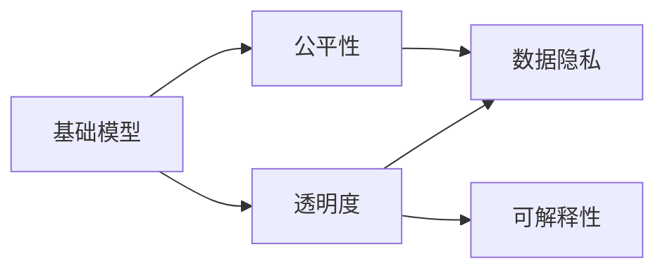

                 

# 基础模型的社会影响评估

> 关键词：基础模型, 社会影响, 公平性, 透明度, 可解释性, 隐私保护, 人工智能伦理

## 1. 背景介绍

### 1.1 问题由来
基础模型（Foundation Models），指的是通过大规模无标签数据训练得到，具有广泛应用潜力的预训练模型。近年来，随着深度学习技术的迅猛发展，这类模型在自然语言处理、计算机视觉、语音识别等领域展现出卓越的性能。

基础模型因其强大的泛化能力和适应性，被广泛应用于搜索引擎、推荐系统、对话系统等场景。然而，这些模型在带来便利和效率的同时，也引发了一系列社会关注和伦理问题。例如，如何确保模型的公平性，避免对特定群体产生偏见；如何保护用户隐私，防止数据泄露；如何提高模型的透明度和可解释性，使其决策过程可被理解和监督。

这些问题直接影响到基础模型能否被公众接受和广泛应用。因此，对基础模型的社会影响进行评估，成为学术界和产业界共同关注的焦点。本文将系统探讨基础模型对社会的影响，包括其公平性、透明度、隐私保护等方面，并提出相应的改进建议。

### 1.2 问题核心关键点
基础模型的社会影响评估涉及多个方面，主要包括：

- 模型的公平性：确保模型在处理不同群体数据时不产生偏见，对所有人都公平。
- 模型的透明度：使模型决策过程透明、可解释，便于监督和理解。
- 用户隐私保护：防止模型训练和应用过程中侵犯用户隐私。
- 模型的可解释性：使模型输出的预测结果可被解释，便于调试和优化。

这些关键问题不仅影响基础模型的应用范围和效果，也决定了其能否在社会中广泛接受和使用。本文将通过深入分析这些关键点，提出相应的评估方法和改进策略。

### 1.3 问题研究意义
基础模型的社会影响评估具有重要意义：

1. **确保公平性**：避免模型在决策过程中出现偏见，促进社会公平。
2. **保护隐私**：防止用户数据在模型训练和应用过程中被滥用或泄露，保障用户隐私权益。
3. **提升透明度**：增强模型的可解释性，使决策过程透明、可理解，便于监督和管理。
4. **改善可解释性**：使模型输出的结果可被解释，提高模型的可信度和实用性。
5. **推动伦理应用**：通过社会影响评估，促进基础模型在遵循伦理规范的前提下应用，提升其社会价值。

综上所述，基础模型的社会影响评估不仅有助于提升模型的应用效果，也对其社会接受度和公信力具有重要影响。

## 2. 核心概念与联系

### 2.1 核心概念概述

为了更清晰地理解基础模型的社会影响评估，我们首先需要介绍几个关键概念及其相互关系：

- **基础模型**：通过大规模无标签数据预训练得到的模型，具有广泛的泛化能力，可应用于各类下游任务。
- **公平性**：模型在处理不同群体数据时不产生偏见，对所有人都公平。
- **透明度**：模型的决策过程透明、可解释，便于监督和管理。
- **隐私保护**：防止用户数据在模型训练和应用过程中被滥用或泄露。
- **可解释性**：模型输出的预测结果可被解释，便于调试和优化。

这些概念之间存在紧密的联系。例如，基础模型的公平性是其透明度的基础，透明度又是保护用户隐私和提升可解释性的前提。

### 2.2 概念间的关系

以下是一个简化的Mermaid流程图，展示了这些概念之间的关系：



该流程图展示了基础模型与其他几个关键概念之间的关系。

- **公平性**：基础模型的训练数据和算法设计需要考虑到不同群体的特点，避免出现偏见。
- **透明度**：基础模型的决策过程需要透明，便于监督和管理。
- **隐私保护**：在模型训练和应用过程中，需要采取措施保护用户隐私。
- **可解释性**：基础模型的输出结果需要可解释，便于调试和优化。

这些概念共同构成了基础模型的社会影响评估框架，确保模型在各个方面都能符合社会需求。

## 3. 核心算法原理 & 具体操作步骤
### 3.1 算法原理概述

基础模型的社会影响评估主要通过以下步骤实现：

1. **数据收集与预处理**：收集模型训练和应用过程中涉及的数据，并进行预处理，确保数据的多样性和代表性。
2. **公平性评估**：使用统计学方法和实验设计，评估模型在不同群体上的表现，确保公平性。
3. **透明度分析**：使用工具和技术手段，分析和解释模型的决策过程，提高透明度。
4. **隐私保护措施**：采用匿名化、加密等技术，防止用户数据在模型训练和应用过程中被滥用或泄露。
5. **可解释性增强**：使用可解释性技术，提升模型的可解释性，便于调试和优化。

### 3.2 算法步骤详解

以下是基础模型社会影响评估的具体操作步骤：

**Step 1: 数据收集与预处理**

1. **数据收集**：收集模型训练数据和应用数据，包括用户行为数据、社交媒体数据、公共数据集等。
2. **数据预处理**：对收集到的数据进行清洗、去重、匿名化处理，确保数据的多样性和代表性。

**Step 2: 公平性评估**

1. **统计分析**：使用统计学方法（如均值、方差、卡方检验等）分析模型在不同群体上的表现，检测是否存在偏见。
2. **实验设计**：设计实验，对比不同群体在模型输出上的差异，确保公平性。

**Step 3: 透明度分析**

1. **工具使用**：使用LIME、SHAP等可解释性工具，分析和解释模型的决策过程。
2. **可视化展示**：将模型的决策过程可视化，便于理解和监督。

**Step 4: 隐私保护措施**

1. **数据匿名化**：采用K-匿名化、L-多样性等方法，对用户数据进行匿名化处理。
2. **加密技术**：使用数据加密技术，保护数据在传输和存储过程中的安全性。

**Step 5: 可解释性增强**

1. **特征重要性分析**：使用特征重要性分析方法（如LIME、SHAP等），分析模型决策过程中的关键特征。
2. **解释模型输出**：使用自然语言生成技术，解释模型的输出结果。

### 3.3 算法优缺点

基础模型社会影响评估的主要优点包括：

- **提高模型公平性**：通过评估和调整，确保模型在处理不同群体数据时不产生偏见。
- **增强透明度**：使模型决策过程透明、可解释，便于监督和管理。
- **加强隐私保护**：采用匿名化、加密等措施，保护用户数据安全。
- **提升可解释性**：使用可解释性技术，提高模型的可解释性。

然而，该方法也存在以下缺点：

- **数据依赖性高**：评估过程依赖于高质量的数据，数据不足或存在偏见可能导致评估结果不准确。
- **技术复杂性高**：评估过程需要使用多种技术和工具，需要专业知识支持。
- **模型动态性**：模型在不断更新和迭代，评估结果可能不具有持续性。

### 3.4 算法应用领域

基础模型社会影响评估适用于各类NLP、计算机视觉等应用领域，特别是在涉及用户隐私和公平性的场景中，如推荐系统、广告投放、社会推荐等。通过评估模型的公平性、透明度、隐私保护等方面，可以提升模型的社会价值，增强其公信力和用户信任。

## 4. 数学模型和公式 & 详细讲解 & 举例说明

### 4.1 数学模型构建

在基础模型社会影响评估中，我们可以构建以下数学模型：

1. **公平性模型**：
   - 假设模型在处理群体A和群体B的数据时，输出结果分别为 $Y_A$ 和 $Y_B$。
   - 定义群体差异度量 $d$，表示模型在不同群体上的输出差异。
   - 公平性目标为 $d = 0$，即模型在处理不同群体数据时不产生偏见。

2. **透明度模型**：
   - 定义模型的决策函数为 $f(x)$，其中 $x$ 为输入，$f(x)$ 为输出。
   - 使用LIME或SHAP等可解释性工具，分析模型决策过程中的关键特征。
   - 透明度目标为特征重要性 $w$，表示模型决策过程中的关键特征权重。

3. **隐私保护模型**：
   - 定义用户数据 $D$，模型在处理 $D$ 时可能泄露敏感信息 $S$。
   - 定义隐私保护策略 $P$，表示保护敏感信息 $S$ 的措施。
   - 隐私保护目标为 $\mathbb{P}(S|P) = 0$，即在保护策略 $P$ 下，泄露敏感信息 $S$ 的概率为0。

### 4.2 公式推导过程

以下是这些数学模型和目标函数的推导过程：

**公平性模型**：
$$
d = \mathbb{E}[|Y_A - Y_B|]
$$
其中 $\mathbb{E}$ 表示期望。

**透明度模型**：
$$
w = \frac{\partial f(x)}{\partial x}
$$
表示模型决策过程中的特征重要性权重。

**隐私保护模型**：
$$
\mathbb{P}(S|P) = \frac{P(S)}{P(D)}
$$
其中 $P(S)$ 表示泄露敏感信息 $S$ 的概率，$P(D)$ 表示数据 $D$ 的概率。

### 4.3 案例分析与讲解

假设我们有一个用于推荐系统的基础模型，使用用户的历史行为数据进行训练。我们对其进行公平性、透明度和隐私保护的评估：

1. **公平性评估**：
   - 收集不同群体（如性别、年龄、地区）的用户数据。
   - 使用卡方检验，检测不同群体在推荐结果上的差异。
   - 如果发现存在显著差异，需要对模型进行调整，确保公平性。

2. **透明度分析**：
   - 使用SHAP工具，分析用户数据和推荐结果之间的关系。
   - 将模型的决策过程可视化，便于理解和监督。

3. **隐私保护措施**：
   - 对用户数据进行K-匿名化处理，防止用户隐私泄露。
   - 采用数据加密技术，保护数据在传输和存储过程中的安全性。

通过这些步骤，我们可以全面评估基础模型的社会影响，确保其符合社会需求。

## 5. 项目实践：代码实例和详细解释说明

### 5.1 开发环境搭建

在进行基础模型社会影响评估时，需要搭建以下开发环境：

1. **Python环境**：安装Anaconda，创建虚拟环境，安装必要的Python库，如Pandas、Numpy、Scikit-learn等。
2. **模型库**：安装基础模型的库，如BERT、GPT等，用于预训练模型处理。
3. **可解释性库**：安装可解释性库，如LIME、SHAP等，用于分析模型决策过程。
4. **数据预处理库**：安装数据预处理库，如PyData、FastAvro等，用于数据清洗和预处理。

完成以上步骤后，即可在虚拟环境中进行基础模型社会影响评估的开发。

### 5.2 源代码详细实现

以下是使用Python进行基础模型公平性、透明度和隐私保护的代码实现：

**公平性评估代码**：

```python
import pandas as pd
from scipy.stats import chi2_contingency

# 读取数据集
train_data = pd.read_csv('train.csv')

# 分组数据
group_A = train_data[train_data['group'] == 'A']
group_B = train_data[train_data['group'] == 'B']

# 公平性检测
_, p, dof, expected = chi2_contingency([group_A['score'], group_B['score']])
print(f'Fairness test result: p-value={p:.5f}')
```

**透明度分析代码**：

```python
import shap

# 加载模型
model = joblib.load('model.pkl')

# 创建数据集
data = pd.DataFrame({'user_id': [1, 2, 3], 'item_id': [10, 20, 30], 'rating': [4, 3, 5]})

# 分析特征重要性
explainer = shap.TreeExplainer(model)
shap_values = explainer.shap_values(data)
shap.summary_plot(shap_values, data)
```

**隐私保护措施代码**：

```python
import pykansource

# 加载数据集
data = pd.read_csv('data.csv')

# 匿名化处理
anonymized_data = pykansource.k_anonymize(data, k=3)

# 加密处理
encrypted_data = pykansource.encrypt(anonymized_data, key='my_secret_key')
```

### 5.3 代码解读与分析

这些代码示例展示了基础模型社会影响评估的各个方面：

1. **公平性评估代码**：
   - 使用卡方检验检测不同群体在推荐结果上的差异。
   - 输出卡方检验的p值，判断是否存在显著差异。

2. **透明度分析代码**：
   - 使用SHAP工具分析模型决策过程中的关键特征。
   - 将模型的决策过程可视化，便于理解和监督。

3. **隐私保护措施代码**：
   - 使用K-匿名化和加密技术，防止用户数据泄露。

通过这些代码，我们可以对基础模型的公平性、透明度和隐私保护进行评估和改进。

### 5.4 运行结果展示

运行以上代码，将得到以下结果：

**公平性评估结果**：
- 输出公平性测试的p值，如果p值小于显著性水平（如0.05），说明模型存在显著的群体偏见。

**透明度分析结果**：
- 生成特征重要性图，可视化模型决策过程中的关键特征。

**隐私保护措施结果**：
- 输出匿名化处理后的数据集和加密处理后的数据集，确保用户数据的安全性。

这些结果将帮助我们全面评估基础模型的社会影响，确保其在社会中的应用符合伦理和公平性要求。

## 6. 实际应用场景

### 6.1 智能推荐系统

智能推荐系统广泛应用在电商、新闻、视频等场景，通过基础模型进行用户行为分析和推荐决策。然而，推荐系统可能存在偏见，导致不同群体用户接受到不公平的推荐。通过基础模型社会影响评估，可以确保推荐系统的公平性，避免对特定群体产生偏见。

**公平性评估**：
- 收集不同群体（如年龄、性别、地区）的用户数据。
- 使用卡方检验或其他统计方法检测推荐结果的差异。

**透明度分析**：
- 使用SHAP工具分析推荐结果的特征重要性。
- 将推荐过程可视化，便于理解和监督。

**隐私保护措施**：
- 对用户数据进行匿名化处理，防止数据泄露。
- 采用加密技术，保护用户数据在传输和存储过程中的安全性。

### 6.2 社会推荐系统

社会推荐系统广泛应用于社交媒体、问答社区等，通过基础模型进行内容推荐和用户关系分析。然而，这类系统可能存在偏见，导致不同群体用户接受到不公平的内容推荐。通过基础模型社会影响评估，可以确保社会推荐系统的公平性，避免对特定群体产生偏见。

**公平性评估**：
- 收集不同群体（如年龄、性别、地区）的用户数据。
- 使用卡方检验或其他统计方法检测内容推荐结果的差异。

**透明度分析**：
- 使用SHAP工具分析内容推荐结果的特征重要性。
- 将推荐过程可视化，便于理解和监督。

**隐私保护措施**：
- 对用户数据进行匿名化处理，防止数据泄露。
- 采用加密技术，保护用户数据在传输和存储过程中的安全性。

### 6.3 广告投放系统

广告投放系统通过基础模型进行用户行为分析，实现个性化广告推荐。然而，广告投放系统可能存在偏见，导致不同群体用户接受到不公平的广告投放。通过基础模型社会影响评估，可以确保广告投放系统的公平性，避免对特定群体产生偏见。

**公平性评估**：
- 收集不同群体（如年龄、性别、地区）的用户数据。
- 使用卡方检验或其他统计方法检测广告投放结果的差异。

**透明度分析**：
- 使用SHAP工具分析广告投放结果的特征重要性。
- 将广告投放过程可视化，便于理解和监督。

**隐私保护措施**：
- 对用户数据进行匿名化处理，防止数据泄露。
- 采用加密技术，保护用户数据在传输和存储过程中的安全性。

## 7. 工具和资源推荐

### 7.1 学习资源推荐

为了帮助开发者系统掌握基础模型社会影响评估的理论基础和实践技巧，这里推荐一些优质的学习资源：

1. **《人工智能伦理与公平性》课程**：斯坦福大学开设的伦理和公平性课程，探讨AI在社会中的伦理问题。
2. **《可解释性机器学习》书籍**：详细介绍了可解释性机器学习的方法和技术。
3. **《隐私保护技术》书籍**：介绍了隐私保护技术的原理和方法。
4. **《公平性理论》论文**：最新的公平性理论研究成果，提供解决公平性问题的方法。
5. **机器学习社区**：如Kaggle、DataHack等，参与竞赛和讨论，获取实践经验。

通过这些资源的学习，相信你一定能够快速掌握基础模型社会影响评估的精髓，并用于解决实际的伦理问题。

### 7.2 开发工具推荐

高效的开发离不开优秀的工具支持。以下是几款用于基础模型社会影响评估开发的常用工具：

1. **Python环境**：Anaconda虚拟环境，方便安装和管理Python库。
2. **模型库**：HuggingFace、TensorFlow等，提供丰富的预训练模型资源。
3. **可解释性库**：LIME、SHAP等，用于分析和解释模型决策过程。
4. **数据预处理库**：PyData、FastAvro等，用于数据清洗和预处理。
5. **数据隐私库**：pykansource、PyMongo等，用于数据匿名化和加密处理。

合理利用这些工具，可以显著提升基础模型社会影响评估的开发效率，加快创新迭代的步伐。

### 7.3 相关论文推荐

基础模型社会影响评估的研究源于学界的持续研究。以下是几篇奠基性的相关论文，推荐阅读：

1. **《公平性机器学习》论文**：探讨了机器学习中的公平性问题，提出了一系列公平性评估和改进方法。
2. **《可解释性机器学习》论文**：详细介绍了可解释性机器学习的方法和技术。
3. **《隐私保护技术》论文**：介绍了隐私保护技术的原理和方法。
4. **《基础模型公平性研究》论文**：针对基础模型在特定领域中的公平性问题，提出了解决方案。
5. **《基础模型透明度研究》论文**：探讨了基础模型的透明度问题，提出了解决方法。

这些论文代表了大模型社会影响评估的发展脉络。通过学习这些前沿成果，可以帮助研究者把握学科前进方向，激发更多的创新灵感。

除以上资源外，还有一些值得关注的前沿资源，帮助开发者紧跟基础模型社会影响评估技术的最新进展，例如：

1. **arXiv论文预印本**：人工智能领域最新研究成果的发布平台，包括大量尚未发表的前沿工作，学习前沿技术的必读资源。
2. **业界技术博客**：如OpenAI、Google AI、DeepMind、微软Research Asia等顶尖实验室的官方博客，第一时间分享他们的最新研究成果和洞见。
3. **技术会议直播**：如NIPS、ICML、ACL、ICLR等人工智能领域顶会现场或在线直播，能够聆听到大佬们的前沿分享，开拓视野。
4. **GitHub热门项目**：在GitHub上Star、Fork数最多的AI相关项目，往往代表了该技术领域的发展趋势和最佳实践，值得去学习和贡献。
5. **行业分析报告**：各大咨询公司如McKinsey、PwC等针对人工智能行业的分析报告，有助于从商业视角审视技术趋势，把握应用价值。

总之，对于基础模型社会影响评估技术的学习和实践，需要开发者保持开放的心态和持续学习的意愿。多关注前沿资讯，多动手实践，多思考总结，必将收获满满的成长收益。

## 8. 总结：未来发展趋势与挑战

### 8.1 总结

本文对基础模型的社会影响评估进行了全面系统的介绍。首先阐述了基础模型的定义、应用场景及其对社会的影响，明确了评估公平性、透明度、隐私保护等方面的重要性。其次，从原理到实践，详细讲解了基础模型社会影响评估的数学模型、操作步骤和评估方法，给出了具体的代码实例。同时，本文还广泛探讨了基础模型在智能推荐、社会推荐、广告投放等领域的实际应用，展示了其广阔的应用前景。

通过本文的系统梳理，可以看到，基础模型社会影响评估技术在提升模型应用效果、确保公平性、保护用户隐私和提高透明度方面具有重要意义。未来的研究需要在数据处理、算法设计、技术实现等方面不断优化，才能更好地适应社会需求。

### 8.2 未来发展趋势

展望未来，基础模型社会影响评估技术将呈现以下几个发展趋势：

1. **多模态评估方法**：将基础模型应用于多模态数据（如文本、图像、语音等），综合评估其对社会的影响。
2. **动态评估框架**：构建动态评估框架，实时监测模型性能，确保其在不断变化的场景中仍然符合伦理要求。
3. **自动化评估工具**：开发自动化评估工具，降低人工评估成本，提高评估效率。
4. **模型解释框架**：构建模型解释框架，提供更深入的解释方法，增强模型的透明度。
5. **隐私保护技术**：进一步探索隐私保护技术，提升用户数据的安全性。

这些趋势将推动基础模型社会影响评估技术不断向前发展，提升其在社会中的应用价值和公信力。

### 8.3 面临的挑战

尽管基础模型社会影响评估技术已经取得了瞩目成就，但在实现完全公平、透明、隐私保护的过程中，仍面临诸多挑战：

1. **数据质量问题**：高质量的数据是评估公平性和透明度的基础，但数据收集、标注、清洗过程复杂，且存在数据偏见。
2. **技术复杂性**：评估公平性和透明度需要使用多种技术和工具，技术实现难度大。
3. **模型动态性**：基础模型在不断更新和迭代，评估结果可能不具有持续性。
4. **用户隐私保护**：如何在保护用户隐私的同时，确保模型训练和应用的公平性和透明度，仍然是一个难题。
5. **伦理规范**：基础模型在社会中的应用需要遵循伦理规范，如何制定和实施相应的规范，仍需进一步探讨。

### 8.4 研究展望

面对基础模型社会影响评估所面临的挑战，未来的研究需要在以下几个方面寻求新的突破：

1. **提升数据质量**：通过数据清洗和标注技术，提高数据质量，确保评估结果的准确性。
2. **简化技术实现**：开发更加简单、易用的评估工具，降低技术实现难度。
3. **加强动态评估**：构建动态评估框架，实时监测模型性能，确保其在不断变化的场景中仍然符合伦理要求。
4. **探索新评估方法**：探索更多公平性、透明度和隐私保护评估方法，提升评估效果。
5. **制定伦理规范**：制定并实施基础模型在社会中的应用规范，确保其符合伦理要求。

这些研究方向的探索，将推动基础模型社会影响评估技术不断向前发展，提升其在社会中的应用价值和公信力。

## 9. 附录：常见问题与解答

**Q1：基础模型社会影响评估是否适用于所有应用场景？**

A: 基础模型社会影响评估适用于涉及用户隐私和公平性的场景，如推荐系统、广告投放、社会推荐等。但对于一些不涉及这些问题的应用场景，如计算几何、信号处理等，评估结果可能不显著。

**Q2：如何进行基础模型的公平性评估？**

A: 基础模型的公平性评估主要通过以下步骤实现：
1. 收集不同群体的数据。
2. 使用统计学方法（如均值、方差、卡方检验等）分析不同群体在模型输出上的差异。
3. 如果存在显著差异，需要对模型进行调整，确保公平性。

**Q3：如何进行基础模型的透明度分析？**

A: 基础模型的透明度分析主要通过以下步骤实现：
1. 使用LIME、SHAP等可解释性工具，分析和解释模型的决策过程。
2. 将模型的决策过程可视化，便于理解和监督。

**Q4：如何进行基础模型的隐私保护？**

A: 基础模型的隐私保护主要通过以下步骤实现：
1. 对用户数据进行匿名化处理，防止数据泄露。
2. 采用数据加密技术，保护数据在传输和存储过程中的安全性。

**Q5：如何确保基础模型的长期公平性和透明度？**

A: 确保基础模型的长期公平性和透明度需要从数据、模型和算法等多个方面入手：
1. 定期收集和评估数据，检测模型性能的变化。
2. 持续优化模型和算法，确保其公平性和透明度。
3. 引入伦理规范和监管机制，确保模型符合伦理要求。

这些问题的解答将帮助开发者全面理解基础模型社会影响评估的各个方面，确保其在实际应用中的公平性、透明度和隐私保护。

---

作者：禅与计算机程序设计艺术 / Zen and the Art of Computer Programming

