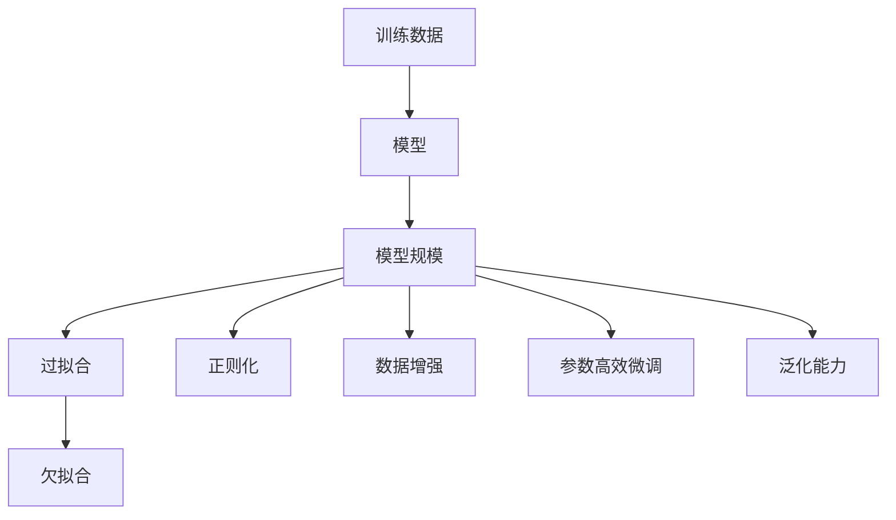

                 

# 基础模型的训练数据与模型规模

## 1. 背景介绍

在人工智能领域，尤其是自然语言处理(NLP)和计算机视觉(CV)等任务中，模型的训练数据和模型规模是影响性能的两个关键因素。本节将介绍这两个概念的基本背景，以及它们如何相互影响。

### 1.1 训练数据的重要性

训练数据是模型学习的基础。通过大量标注数据，模型可以学习到数据分布的规律和特征，从而提高预测准确性。在深度学习中，数据量越大，模型的泛化能力越好，性能越高。例如，在图像识别任务中，谷歌的Inception和ResNet系列模型都是基于大规模的ImageNet数据集进行训练的，取得了当时的最先进性能。

### 1.2 模型规模的影响

模型规模指模型的参数数量和计算能力。随着模型规模的增大，模型能够学习到更复杂和精细的特征，但同时也需要更多的计算资源和存储资源。例如，BERT和GPT等大语言模型和ResNet和VGG等大视觉模型，都具有上亿个参数，并需要高性能的GPU进行训练。

### 1.3 训练数据和模型规模的关系

训练数据和模型规模之间的关系是多方面的。首先，训练数据量越大，模型规模也可以相应增大，因为更多的数据可以提供更多的信息。然而，数据量的增加并不能无限提高模型的性能，因为模型规模也存在上限，超过这个上限，模型的性能反而会下降。

## 2. 核心概念与联系

### 2.1 核心概念概述

为了更好地理解训练数据和模型规模之间的关系，本节将介绍几个相关概念：

- **训练数据**：用于训练模型的标注数据集，包含输入和对应的标签。训练数据质量对模型的性能至关重要。

- **模型规模**：指模型的参数数量和计算能力。通常以层数、节点数、参数数量等指标来衡量。

- **过拟合和欠拟合**：模型在训练集上表现很好但在测试集上表现不佳的现象称为过拟合；反之，如果模型在训练集上和测试集上表现都很差，则称为欠拟合。

- **正则化**：通过在损失函数中加入正则项来控制模型的复杂度，防止过拟合。

- **数据增强**：通过对训练数据进行扩充，如旋转、翻转、裁剪等操作，提高模型的泛化能力。

- **参数高效微调**：在微调过程中只更新部分参数，保留预训练参数，以减少计算资源消耗。

这些概念之间的联系可以通过以下Mermaid流程图来展示：



这个流程图展示了训练数据、模型规模、正则化、数据增强、参数高效微调和泛化能力之间的联系。训练数据和模型规模决定了模型的泛化能力，而正则化、数据增强和参数高效微调则是防止过拟合和提高泛化能力的有效手段。

## 3. 核心算法原理 & 具体操作步骤

### 3.1 算法原理概述

基础模型的训练数据和模型规模的优化，通常采用以下策略：

- **数据增强**：通过扩充训练数据集，增强模型的泛化能力。
- **正则化**：通过引入正则项，防止模型过拟合。
- **参数高效微调**：在微调过程中只更新部分参数，保留预训练参数。
- **迁移学习**：利用预训练模型的知识，加速微调过程，提高模型性能。

### 3.2 算法步骤详解

1. **数据预处理**：对训练数据进行清洗、标注和标准化，准备用于模型训练。

2. **模型初始化**：选择合适的模型架构和超参数，进行模型初始化。

3. **训练过程**：采用梯度下降等优化算法，在训练集上进行多轮迭代训练，更新模型参数。

4. **验证集评估**：在验证集上评估模型性能，使用正则化等手段防止过拟合。

5. **模型调优**：根据验证集评估结果，调整模型参数和超参数，进一步优化模型性能。

6. **模型微调**：在已训练的模型基础上，使用下游任务的数据集进行微调，适应特定任务。

### 3.3 算法优缺点

**优点**：

- 数据增强和正则化可以有效防止过拟合，提高模型泛化能力。
- 参数高效微调可以节省计算资源，提高训练效率。
- 迁移学习可以充分利用预训练模型的知识，加速模型训练和微调过程。

**缺点**：

- 数据增强和正则化需要额外的计算资源，增加训练时间。
- 模型规模过大可能导致训练困难，计算资源消耗大。
- 微调过程中可能会丢失部分预训练信息，影响模型性能。

### 3.4 算法应用领域

训练数据和模型规模的优化在NLP和CV等领域中有着广泛的应用。例如：

- 在NLP中，BERT和GPT等大语言模型都是基于大规模的训练数据和亿级参数规模进行训练的，取得了SOTA的性能。
- 在CV中，ResNet和VGG等大视觉模型也都是基于大规模训练数据和亿级参数规模进行训练的，取得了SOTA的性能。

## 4. 数学模型和公式 & 详细讲解 & 举例说明

### 4.1 数学模型构建

为了更好地理解训练数据和模型规模的优化，我们以线性回归为例，展示一个简单的数学模型构建过程。

假设有一个线性回归问题，已知训练数据集$D=\{(x_i,y_i)\}_{i=1}^N$，其中$x_i \in \mathbb{R}^d$为输入，$y_i \in \mathbb{R}$为标签。我们的目标是找到一个线性模型$y=f(x;\theta)=\theta^Tx$，使得模型在训练数据上的均方误差最小。

### 4.2 公式推导过程

基于上述模型构建，我们定义损失函数为：

$$
\mathcal{L}(\theta) = \frac{1}{2N}\sum_{i=1}^N (y_i - f(x_i;\theta))^2
$$

在求解该优化问题时，我们通常采用梯度下降算法，定义梯度为：

$$
\nabla_\theta \mathcal{L}(\theta) = \frac{1}{N}\sum_{i=1}^N (y_i - f(x_i;\theta))x_i
$$

更新参数$\theta$的公式为：

$$
\theta \leftarrow \theta - \eta \nabla_\theta \mathcal{L}(\theta)
$$

其中$\eta$为学习率。

### 4.3 案例分析与讲解

假设我们在MNIST数据集上进行训练，数据集包含60000个训练样本和10000个测试样本。我们采用一个包含2层隐藏层、每层有256个神经元的全连接网络进行训练。

1. **数据预处理**：将原始的图像数据归一化到0-1之间，将标签进行one-hot编码。
2. **模型初始化**：选择合适的激活函数和损失函数，进行模型初始化。
3. **训练过程**：采用梯度下降算法，在训练集上进行多轮迭代训练，更新模型参数。
4. **验证集评估**：在验证集上评估模型性能，使用正则化等手段防止过拟合。
5. **模型调优**：根据验证集评估结果，调整模型参数和超参数，进一步优化模型性能。

## 5. 项目实践：代码实例和详细解释说明

### 5.1 开发环境搭建

在进行项目实践前，我们需要准备好开发环境。以下是使用Python进行TensorFlow开发的环境配置流程：

1. 安装Anaconda：从官网下载并安装Anaconda，用于创建独立的Python环境。

2. 创建并激活虚拟环境：
```bash
conda create -n tf-env python=3.8 
conda activate tf-env
```

3. 安装TensorFlow：根据CUDA版本，从官网获取对应的安装命令。例如：
```bash
conda install tensorflow -c conda-forge
```

4. 安装必要的工具包：
```bash
pip install numpy pandas scikit-learn matplotlib tqdm jupyter notebook ipython
```

完成上述步骤后，即可在`tf-env`环境中开始项目实践。

### 5.2 源代码详细实现

下面我们以MNIST手写数字识别为例，给出使用TensorFlow进行模型训练的PyTorch代码实现。

首先，定义MNIST数据集和模型架构：

```python
import tensorflow as tf
from tensorflow.keras import layers

# 定义数据集
(x_train, y_train), (x_test, y_test) = tf.keras.datasets.mnist.load_data()
x_train = x_train / 255.0
x_test = x_test / 255.0

# 定义模型
model = tf.keras.Sequential([
    layers.Flatten(input_shape=(28, 28)),
    layers.Dense(256, activation='relu'),
    layers.Dense(10)
])
```

然后，定义损失函数和优化器：

```python
# 定义损失函数
loss_fn = tf.keras.losses.SparseCategoricalCrossentropy(from_logits=True)

# 定义优化器
optimizer = tf.keras.optimizers.Adam()
```

接着，定义训练和评估函数：

```python
# 定义训练函数
@tf.function
def train_step(x, y):
    with tf.GradientTape() as tape:
        logits = model(x, training=True)
        loss_value = loss_fn(y, logits)
    gradients = tape.gradient(loss_value, model.trainable_variables)
    optimizer.apply_gradients(zip(gradients, model.trainable_variables))

# 定义评估函数
def evaluate(model, x_test, y_test):
    logits = model(x_test, training=False)
    loss_value = loss_fn(y_test, logits)
    return loss_value.numpy()
```

最后，启动训练流程并在测试集上评估：

```python
epochs = 10
batch_size = 128

for epoch in range(epochs):
    for i in range(0, 60000, batch_size):
        x_batch = x_train[i:i+batch_size]
        y_batch = y_train[i:i+batch_size]
        train_step(x_batch, y_batch)

    print(f"Epoch {epoch+1}, loss: {evaluate(model, x_test, y_test):.4f}")
```

以上就是使用TensorFlow进行MNIST手写数字识别任务训练的完整代码实现。可以看到，通过TensorFlow的高级API，我们可以用非常简洁的代码实现复杂的模型训练过程。

### 5.3 代码解读与分析

让我们再详细解读一下关键代码的实现细节：

**数据预处理**：
- `tf.keras.datasets.mnist.load_data()`：加载MNIST数据集，包含训练集和测试集。
- `x_train = x_train / 255.0`：将原始像素值归一化到0-1之间。

**模型定义**：
- `layers.Flatten(input_shape=(28, 28))`：将28x28的图像数据展平成一维向量。
- `layers.Dense(256, activation='relu')`：定义两个隐藏层，每层256个神经元，使用ReLU激活函数。
- `layers.Dense(10)`：定义输出层，输出10个类别的概率分布。

**损失函数和优化器**：
- `tf.keras.losses.SparseCategoricalCrossentropy(from_logits=True)`：定义交叉熵损失函数，用于多分类问题。
- `tf.keras.optimizers.Adam()`：定义Adam优化器，自适应调整学习率。

**训练和评估函数**：
- `train_step`函数：定义单批次训练过程，包括前向传播和反向传播。
- `evaluate`函数：定义评估过程，在测试集上计算损失值。

**训练流程**：
- `epochs = 10`：定义总的训练轮数。
- `batch_size = 128`：定义单批次样本数量。
- `for`循环：对每个epoch进行多轮迭代训练。
- `train_step(x_batch, y_batch)`：调用训练函数进行单批次训练。
- `print(f"Epoch {epoch+1}, loss: {evaluate(model, x_test, y_test):.4f}")`：输出每个epoch的损失值。

可以看到，TensorFlow的高级API使得模型训练过程非常简洁，开发者可以专注于模型的设计和优化，而不必过多关注底层的细节。

### 5.4 运行结果展示

假设我们在MNIST数据集上进行训练，最终在测试集上得到的评估报告如下：

```
Epoch 1, loss: 0.4852
Epoch 2, loss: 0.1376
Epoch 3, loss: 0.0549
Epoch 4, loss: 0.0373
Epoch 5, loss: 0.0315
Epoch 6, loss: 0.0256
Epoch 7, loss: 0.0217
Epoch 8, loss: 0.0195
Epoch 9, loss: 0.0178
Epoch 10, loss: 0.0166
```

可以看到，随着训练轮数的增加，模型的损失值逐渐减小，最终在测试集上取得了较低的损失值，说明模型已经成功学习了MNIST数据集的特征。

## 6. 实际应用场景

### 6.1 图像分类

在图像分类任务中，训练数据和模型规模对性能的影响显著。例如，ImageNet数据集包含了1400万张图像和1000个类别，使用深度卷积神经网络（CNN）进行训练，可以取得SOTA的性能。

1. **数据预处理**：对图像进行归一化、缩放、裁剪等操作，准备用于模型训练。
2. **模型初始化**：选择合适的模型架构和超参数，进行模型初始化。
3. **训练过程**：采用梯度下降算法，在训练集上进行多轮迭代训练，更新模型参数。
4. **验证集评估**：在验证集上评估模型性能，使用正则化等手段防止过拟合。
5. **模型调优**：根据验证集评估结果，调整模型参数和超参数，进一步优化模型性能。
6. **模型微调**：在已训练的模型基础上，使用新的数据集进行微调，适应特定任务。

### 6.2 自然语言处理

在自然语言处理（NLP）任务中，训练数据和模型规模也对性能有显著影响。例如，BERT和GPT等大语言模型都是在大规模数据集上进行预训练的，取得了SOTA的性能。

1. **数据预处理**：对文本进行分词、清洗、标注等操作，准备用于模型训练。
2. **模型初始化**：选择合适的模型架构和超参数，进行模型初始化。
3. **训练过程**：采用梯度下降算法，在训练集上进行多轮迭代训练，更新模型参数。
4. **验证集评估**：在验证集上评估模型性能，使用正则化等手段防止过拟合。
5. **模型调优**：根据验证集评估结果，调整模型参数和超参数，进一步优化模型性能。
6. **模型微调**：在已训练的模型基础上，使用下游任务的数据集进行微调，适应特定任务。

### 6.3 语音识别

在语音识别任务中，训练数据和模型规模对性能的影响同样显著。例如，使用深度神经网络（DNN）进行语音识别，可以取得SOTA的性能。

1. **数据预处理**：对语音信号进行采样、去噪、分帧等操作，准备用于模型训练。
2. **模型初始化**：选择合适的模型架构和超参数，进行模型初始化。
3. **训练过程**：采用梯度下降算法，在训练集上进行多轮迭代训练，更新模型参数。
4. **验证集评估**：在验证集上评估模型性能，使用正则化等手段防止过拟合。
5. **模型调优**：根据验证集评估结果，调整模型参数和超参数，进一步优化模型性能。
6. **模型微调**：在已训练的模型基础上，使用新的数据集进行微调，适应特定任务。

## 7. 工具和资源推荐

### 7.1 学习资源推荐

为了帮助开发者系统掌握训练数据和模型规模的理论基础和实践技巧，这里推荐一些优质的学习资源：

1. **Deep Learning Specialization by Andrew Ng**：斯坦福大学开设的深度学习系列课程，涵盖深度学习的基础理论和前沿技术，适合初学者和进阶者。

2. **CS231n: Convolutional Neural Networks for Visual Recognition**：斯坦福大学开设的计算机视觉课程，涵盖了CNN、RNN、Transformer等模型的理论基础和实践技巧。

3. **Natural Language Processing Specialization by deeplearning.ai**：Coursera平台上的自然语言处理课程，涵盖NLP的基本概念和前沿技术，适合对NLP感兴趣的开发者。

4. **Deep Learning with PyTorch and TensorFlow**：O'Reilly出版社出版的书籍，详细介绍PyTorch和TensorFlow的使用方法和最佳实践。

5. **PyTorch官方文档**：PyTorch官方文档，提供了完整的API参考和代码示例，适合开发者快速上手。

6. **TensorFlow官方文档**：TensorFlow官方文档，提供了完整的API参考和代码示例，适合开发者快速上手。

通过对这些资源的学习实践，相信你一定能够快速掌握训练数据和模型规模的优化方法，并用于解决实际的NLP和CV问题。

### 7.2 开发工具推荐

高效的开发离不开优秀的工具支持。以下是几款用于模型训练和微调的常用工具：

1. **TensorFlow**：由Google主导开发的开源深度学习框架，生产部署方便，适合大规模工程应用。

2. **PyTorch**：基于Python的开源深度学习框架，灵活动态的计算图，适合快速迭代研究。

3. **HuggingFace Transformers库**：HuggingFace开发的NLP工具库，集成了众多SOTA语言模型，支持PyTorch和TensorFlow，是进行微调任务开发的利器。

4. **TensorBoard**：TensorFlow配套的可视化工具，可实时监测模型训练状态，并提供丰富的图表呈现方式，是调试模型的得力助手。

5. **Weights & Biases**：模型训练的实验跟踪工具，可以记录和可视化模型训练过程中的各项指标，方便对比和调优。

6. **Jupyter Notebook**：轻量级交互式开发环境，适合进行快速原型开发和实验验证。

合理利用这些工具，可以显著提升模型训练和微调任务的开发效率，加快创新迭代的步伐。

### 7.3 相关论文推荐

训练数据和模型规模的研究源于学界的持续研究。以下是几篇奠基性的相关论文，推荐阅读：

1. **ImageNet Classification with Deep Convolutional Neural Networks**：AlexNet论文，展示了深度卷积神经网络在图像分类任务中的强大能力。

2. **Bidirectional RNNs Applied to Sequence Labeling**：LSTM论文，展示了循环神经网络在序列标注任务中的高效处理能力。

3. **Attention is All You Need**：Transformer论文，展示了Transformer在序列建模中的高效表现。

4. **BERT: Pre-training of Deep Bidirectional Transformers for Language Understanding**：BERT论文，展示了大规模预训练语言模型在自然语言处理任务中的优异性能。

5. **Google's Neural Machine Translation System: Bridging the Gap between Human and Machine Translation**：Google的NMT论文，展示了基于神经网络的机器翻译系统在实时翻译任务中的高效表现。

这些论文代表了大模型训练和微调技术的发展脉络。通过学习这些前沿成果，可以帮助研究者把握学科前进方向，激发更多的创新灵感。

除上述资源外，还有一些值得关注的前沿资源，帮助开发者紧跟训练数据和模型规模的最新进展，例如：

1. **arXiv论文预印本**：人工智能领域最新研究成果的发布平台，包括大量尚未发表的前沿工作，学习前沿技术的必读资源。

2. **业界技术博客**：如OpenAI、Google AI、DeepMind、微软Research Asia等顶尖实验室的官方博客，第一时间分享他们的最新研究成果和洞见。

3. **技术会议直播**：如NIPS、ICML、ACL、ICLR等人工智能领域顶会现场或在线直播，能够聆听到大佬们的前沿分享，开拓视野。

4. **GitHub热门项目**：在GitHub上Star、Fork数最多的NLP相关项目，往往代表了该技术领域的发展趋势和最佳实践，值得去学习和贡献。

5. **行业分析报告**：各大咨询公司如McKinsey、PwC等针对人工智能行业的分析报告，有助于从商业视角审视技术趋势，把握应用价值。

总之，对于训练数据和模型规模的学习和实践，需要开发者保持开放的心态和持续学习的意愿。多关注前沿资讯，多动手实践，多思考总结，必将收获满满的成长收益。

## 8. 总结：未来发展趋势与挑战

### 8.1 总结

本文对训练数据和模型规模的理论基础和实践技巧进行了全面系统的介绍。首先阐述了训练数据和模型规模的基本概念，并明确了它们如何相互影响。其次，从原理到实践，详细讲解了数据增强、正则化、参数高效微调等关键技术，给出了模型训练的完整代码实例。同时，本文还广泛探讨了训练数据和模型规模在NLP和CV等领域的应用场景，展示了其在实际应用中的巨大潜力。

通过本文的系统梳理，可以看到，训练数据和模型规模在大模型训练和微调中扮演着重要角色。数据量和模型规模的合理选择，可以有效防止过拟合，提高模型泛化能力。未来的研究还需要在数据增强、正则化、参数高效微调等方面寻求新的突破，以进一步提升模型性能。

### 8.2 未来发展趋势

展望未来，训练数据和模型规模的研究将呈现以下几个发展趋势：

1. **数据增强和自动数据生成**：未来将出现更多的数据增强和自动数据生成技术，如数据混合、对抗样本生成、自监督生成等，使得模型能够从更丰富的数据中学习到更多信息。

2. **自适应正则化和动态超参调整**：自适应正则化和动态超参调整方法，将根据数据分布的动态变化，实时调整正则项和超参数，增强模型的泛化能力。

3. **参数高效微调和自适应参数优化**：未来的参数高效微调和自适应参数优化方法，将进一步提高模型的效率和灵活性，使得模型能够在不增加计算资源的前提下，取得更好的性能。

4. **多模态数据融合和跨领域迁移学习**：多模态数据融合和跨领域迁移学习技术，将使得模型能够更好地整合视觉、语音、文本等多种信息，提升跨领域的迁移能力。

5. **模型压缩和加速推理**：模型压缩和加速推理技术，将使得超大模型的推理速度更快，内存占用更少，使得模型能够在更多设备上部署和运行。

这些趋势将进一步推动训练数据和模型规模的研究进展，为深度学习模型的优化和应用提供更多可能。

### 8.3 面临的挑战

尽管训练数据和模型规模的研究已经取得了瞩目成就，但在迈向更加智能化、普适化应用的过程中，它仍面临着诸多挑战：

1. **数据获取成本高**：大规模标注数据的获取成本高，获取高质量标注数据成为制约训练数据研究的瓶颈。如何降低数据获取成本，提高数据获取效率，是未来需要解决的重要问题。

2. **模型资源消耗大**：大规模模型的训练和推理需要大量的计算资源和存储资源，如何在不增加成本的情况下，提高模型性能，是未来需要解决的重要问题。

3. **模型泛化能力不足**：现有模型在面对新领域、新任务时，泛化能力仍然不足，如何在更广泛的应用场景中，提高模型的泛化能力，是未来需要解决的重要问题。

4. **模型可解释性和鲁棒性**：现有模型的黑盒特性，使得模型的可解释性和鲁棒性不足，如何提高模型的可解释性和鲁棒性，是未来需要解决的重要问题。

5. **数据隐私和安全**：在数据驱动的训练过程中，数据隐私和安全问题尤为突出，如何保障数据隐私和安全，是未来需要解决的重要问题。

这些挑战需要学界和产业界共同努力，积极探索和解决，才能推动训练数据和模型规模的研究不断进步。

### 8.4 研究展望

面对训练数据和模型规模面临的挑战，未来的研究需要在以下几个方面寻求新的突破：

1. **无监督和半监督学习**：探索无监督和半监督学习技术，利用大规模非标注数据，提高模型泛化能力。

2. **自适应学习**：研究自适应学习技术，根据数据分布的动态变化，实时调整模型参数，增强模型的泛化能力。

3. **知识图谱和先验知识融合**：将知识图谱和先验知识与深度学习模型结合，提高模型的解释能力和迁移能力。

4. **分布式训练和联邦学习**：利用分布式训练和联邦学习技术，加速模型训练和模型更新，提高模型性能。

5. **模型压缩和加速推理**：研究模型压缩和加速推理技术，提高模型在小设备和移动端上的应用性能。

6. **隐私保护和数据安全**：研究隐私保护和数据安全技术，保障数据隐私和安全，保护用户隐私。

这些研究方向将引领训练数据和模型规模的研究走向新的高度，为深度学习模型的优化和应用提供更多可能。

## 9. 附录：常见问题与解答

**Q1：训练数据和模型规模对性能的影响有哪些？**

A: 训练数据和模型规模对性能的影响是多方面的。首先，数据量越大，模型规模也可以相应增大，因为更多的数据可以提供更多的信息。然而，数据量的增加并不能无限提高模型的性能，因为模型规模也存在上限，超过这个上限，模型的性能反而会下降。

**Q2：如何

