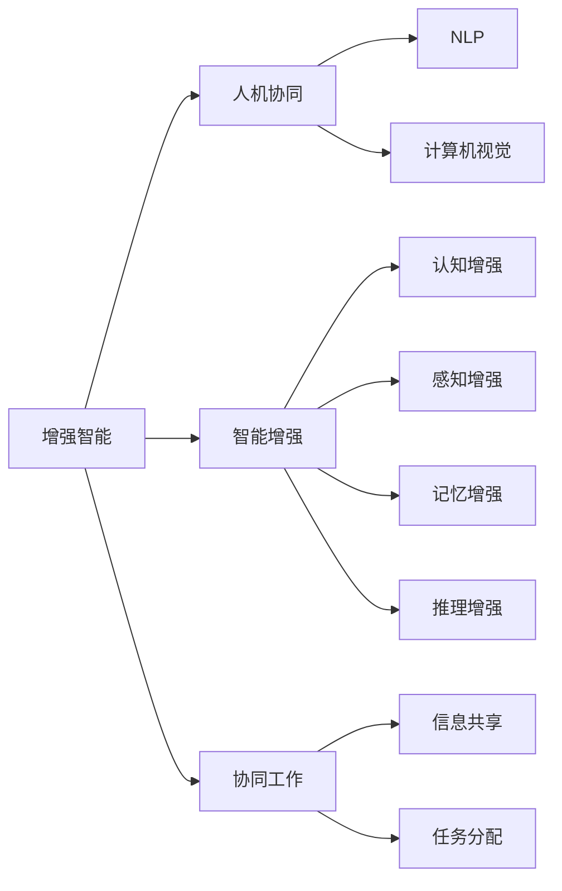
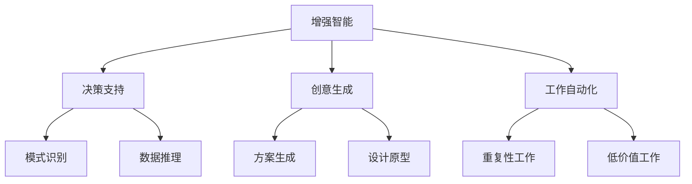
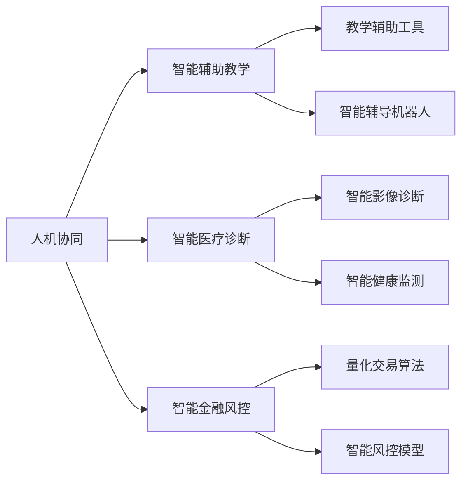
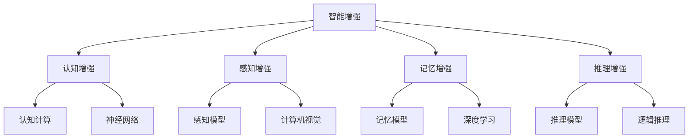
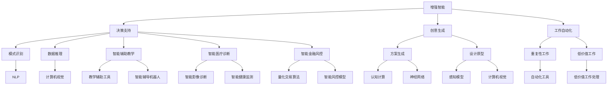

                 

## 1. 背景介绍

### 1.1 问题由来

随着人工智能技术的飞速发展，我们迎来了一个以人机协同为主导的新时代。如何利用先进的AI技术，拓展人类认知的边界，进一步提升人类的决策力和创造力，成为了当前学界和业界共同关注的重要课题。在众多AI技术中，增强智能（Augmented Intelligence，AI）作为连接人与机器的关键纽带，展现出巨大的潜力和应用价值。增强智能技术的核心思想是：通过技术手段，将AI的计算能力和人类的认知优势有机结合，实现协同工作，共创智慧成果。

增强智能的应用场景涵盖了教育、医疗、金融、制造等诸多领域，为各行各业注入了新的动力。在教育领域，智能辅助教学和个性化学习指导正逐渐普及；在医疗领域，智能诊断和健康监测正在提升疾病预防和治疗效果；在金融领域，智能风控和量化交易正改善金融市场的稳定性；在制造领域，智能生产规划和质量控制正优化生产流程。未来，增强智能技术还将深入到更多行业，为人类社会带来深远的影响。

### 1.2 问题核心关键点

增强智能技术的关键在于人机协同，即利用AI技术强化人类的决策能力和创造力。增强智能的核心在于：

1. **增强决策力**：AI能够在海量数据中进行模式识别和推理，提供更准确、更全面的决策支持。人类可以在AI的帮助下，快速把握关键信息，优化决策过程。

2. **提升创造力**：AI可以快速生成创意方案和设计原型，扩展人类的创造边界。人类可以借助于AI，实现前所未有的创意创作。

3. **优化工作效率**：AI可以自动化处理重复性、低价值的工作，释放人类的时间和精力，专注于高附加值的创造性活动。

4. **改善人机互动体验**：AI通过自然语言处理、计算机视觉等技术，增强人机交流的便捷性和自然性，提升用户体验。

### 1.3 问题研究意义

研究增强智能技术，对于推动人工智能技术的普及应用，提升各行各业的生产效率和创新能力，具有重要意义：

1. **降低开发成本**：增强智能技术使得AI应用开发更加便捷，通过模块化、插件化方式实现快速集成，大大降低了开发和部署的门槛。

2. **提升应用效果**：增强智能技术能够有效结合人机优势，在多任务场景下取得更好的应用效果，特别是在复杂的决策和创造性任务中。

3. **加速技术落地**：增强智能技术为AI技术在各垂直行业的应用提供了有力的工具支撑，加速了技术的产业化和市场化进程。

4. **推动人类进步**：增强智能技术能够释放人类的潜力和创造力，推动人类社会在科技、艺术、文化等各个领域实现新的突破。

5. **赋能产业升级**：增强智能技术为传统行业注入了新的活力，推动产业结构转型和升级，提升行业的整体竞争力。

## 2. 核心概念与联系

### 2.1 核心概念概述

为了更好地理解增强智能技术的原理和应用，本节将介绍几个密切相关的核心概念：

- **增强智能（Augmented Intelligence，AI）**：指通过AI技术增强人类决策能力和创造力的过程。增强智能的核心在于人机协同，利用AI的优势提升人类在复杂任务中的表现。

- **人机协同（Human-Machine Collaboration）**：指将AI技术与人类认知和决策能力相结合，实现互利共赢。人机协同的重点是优化人机交互，提升整体工作效率。

- **智能增强（Intelligence Enhancement）**：指通过AI技术提升人类智力水平的过程。智能增强涉及认知、感知、记忆、推理等多个层面，旨在拓展人类认知边界。

- **协同工作（Collaborative Work）**：指人机共同参与工作，分工协作，共同完成目标的过程。协同工作强调人机间的信息共享和任务分配。

- **自然语言处理（Natural Language Processing，NLP）**：指通过计算机技术，实现自然语言的理解和生成，是增强智能的重要工具之一。

- **计算机视觉（Computer Vision）**：指通过计算机技术，实现图像和视频的理解和处理，是增强智能的另一重要工具。

这些核心概念之间的逻辑关系可以通过以下Mermaid流程图来展示：



这个流程图展示了大语言模型微调过程中各个核心概念的关系和作用：

1. **增强智能**：通过AI技术提升人类决策和创造力。
2. **人机协同**：将AI与人类结合，实现互利共赢。
3. **智能增强**：提升人类智力水平，拓展认知边界。
4. **协同工作**：人机分工协作，共同完成目标。
5. **NLP**：实现自然语言的理解和生成，提升人机交流的便捷性。
6. **计算机视觉**：实现图像和视频的理解和处理，提升人机互动的视觉体验。

这些概念共同构成了增强智能技术的基本框架，为其在各行业的广泛应用奠定了基础。

### 2.2 概念间的关系

这些核心概念之间存在着紧密的联系，形成了增强智能技术的完整生态系统。下面通过几个Mermaid流程图来展示这些概念之间的关系。

#### 2.2.1 增强智能的核心原理



这个流程图展示了增强智能的核心原理：

1. **决策支持**：AI通过模式识别和数据推理，提供决策依据。
2. **创意生成**：AI生成创意方案和设计原型，拓展人类创造力。
3. **工作自动化**：AI自动化处理重复性和低价值工作，提升工作效率。

#### 2.2.2 人机协同的应用场景



这个流程图展示了人机协同在不同场景中的应用：

1. **智能辅助教学**：AI辅助教学和辅导机器人，提升教学效果。
2. **智能医疗诊断**：AI辅助影像诊断和健康监测，提升疾病预防和治疗效果。
3. **智能金融风控**：AI量化交易算法和风控模型，提升市场稳定性和风险控制能力。

#### 2.2.3 智能增强的具体实现



这个流程图展示了智能增强的具体实现：

1. **认知增强**：利用认知计算和神经网络提升认知能力。
2. **感知增强**：利用感知模型和计算机视觉提升感知能力。
3. **记忆增强**：利用记忆模型和深度学习提升记忆能力。
4. **推理增强**：利用推理模型和逻辑推理提升推理能力。

### 2.3 核心概念的整体架构

最后，我们用一个综合的流程图来展示这些核心概念在增强智能技术中的整体架构：



这个综合流程图展示了从决策支持到创意生成，再到工作自动化的整个增强智能过程，以及具体应用场景的实现。通过这些流程图，我们可以更清晰地理解增强智能技术的工作原理和应用路径。

## 3. 核心算法原理 & 具体操作步骤

### 3.1 算法原理概述

增强智能技术的核心在于人机协同，即通过AI技术强化人类的决策能力和创造力。其核心算法原理可以概括为以下几点：

1. **决策支持算法**：利用AI进行模式识别和数据推理，提供决策依据。常见算法包括深度学习、逻辑推理、关联规则等。

2. **创意生成算法**：利用AI生成创意方案和设计原型，拓展人类创造力。常见算法包括生成对抗网络（GAN）、变分自编码器（VAE）、神经网络等。

3. **工作自动化算法**：利用AI自动化处理重复性和低价值工作，提升工作效率。常见算法包括自动化流程设计、任务调度、自动化测试等。

### 3.2 算法步骤详解

增强智能技术的具体操作步骤可以分为以下几个关键步骤：

**Step 1: 数据准备与预处理**
- 收集各领域的任务数据，包括结构化数据和非结构化数据。
- 对数据进行清洗、标注和预处理，确保数据质量和一致性。

**Step 2: 选择和集成AI组件**
- 根据任务需求，选择合适的AI组件，如NLP模型、计算机视觉模型、知识图谱等。
- 集成这些AI组件，构建增强智能系统架构。

**Step 3: 模型训练与优化**
- 利用现有数据集对AI模型进行预训练和微调，提升模型性能。
- 应用优化算法和超参数调优技术，避免过拟合，提高模型泛化能力。

**Step 4: 协同工作与互动**
- 通过人机界面，实现人机交互和协同工作。
- 将AI处理结果呈现给用户，辅助人类决策和创造。

**Step 5: 应用部署与持续改进**
- 将增强智能系统部署到实际应用场景中，进行测试和评估。
- 根据反馈结果，持续改进和优化系统性能。

### 3.3 算法优缺点

增强智能技术具有以下优点：

1. **高效提升决策能力**：通过AI辅助决策，能够快速处理大量复杂数据，提升决策效率和准确性。

2. **大幅拓展创造力边界**：利用AI生成创意方案和设计原型，拓展人类的创造空间。

3. **优化资源配置**：通过自动化处理重复性工作，提升工作效率，释放人力资源。

4. **提升人机互动体验**：通过自然语言处理和计算机视觉技术，提升人机交流的便捷性和自然性。

同时，增强智能技术也存在一些缺点：

1. **依赖数据质量**：AI的效果高度依赖于数据的质量和数量，获取高质量数据可能成为瓶颈。

2. **缺乏人性化**：AI在处理复杂任务时，可能缺乏人类的情感和直觉，影响用户体验。

3. **技术门槛较高**：增强智能技术的开发和部署需要专业的AI知识和技术背景。

4. **需要持续维护**：增强智能系统需要持续的优化和更新，保持其稳定性和有效性。

### 3.4 算法应用领域

增强智能技术已经在教育、医疗、金融、制造等多个领域得到了广泛应用，成为推动行业数字化转型的重要工具：

- **教育**：智能辅助教学、个性化学习指导、自动化作业批改等。
- **医疗**：智能影像诊断、健康监测、药物研发等。
- **金融**：智能风控、量化交易、风险管理等。
- **制造**：智能生产规划、质量控制、设备维护等。

除了这些传统领域，增强智能技术还在不断拓展新的应用场景，如智能客服、智慧城市、智慧农业等，为各行各业带来了新的发展机遇。

## 4. 数学模型和公式 & 详细讲解 & 举例说明

### 4.1 数学模型构建

本节将使用数学语言对增强智能技术的核心算法进行更加严格的刻画。

设增强智能系统由人类和AI组成，其中AI模型为$f(x; \theta)$，输入为$x$，输出为$f(x)$。系统的决策过程为$y = h(f(x))$，其中$y$为决策结果，$h$为决策函数。系统的创造过程为$g(x; \theta)$，输出为$g(x)$。系统的自动化过程为$g_{\text{auto}}(x; \theta)$，输出为$g_{\text{auto}}(x)$。系统的协同过程为$g_{\text{coll}}(x; \theta)$，输出为$g_{\text{coll}}(x)$。

### 4.2 公式推导过程

以下是增强智能技术的几个关键数学公式和推导过程：

**决策支持算法**：

设数据集为$D = \{(x_i, y_i)\}_{i=1}^N$，其中$x_i$为输入，$y_i$为标签。利用深度学习模型$f(x; \theta)$进行决策支持，其中$\theta$为模型参数。决策函数$h$为：

$$
h(f(x)) = \max\{y | f(x; \theta) \geq y\}
$$

训练过程如下：

$$
\theta^* = \mathop{\arg\min}_{\theta} \frac{1}{N} \sum_{i=1}^N \ell(f(x_i; \theta), y_i)
$$

其中$\ell$为损失函数，如交叉熵损失。

**创意生成算法**：

利用生成对抗网络（GAN）进行创意生成，假设生成器模型为$G(z; \theta_g)$，判别器模型为$D(x; \theta_d)$。创意生成过程为：

$$
g(x; \theta) = G(z; \theta_g)
$$

其中$z$为随机噪声向量。训练过程如下：

$$
\theta_g^*, \theta_d^* = \mathop{\arg\min}_{\theta_g, \theta_d} \frac{1}{N} \sum_{i=1}^N \ell(G(x_i; \theta_g), D(G(x_i; \theta_g)))
$$

其中$\ell$为生成器和判别器的损失函数，如交叉熵损失和Wasserstein距离。

**工作自动化算法**：

利用自动化流程设计技术，将重复性、低价值工作自动化处理。假设自动化流程为$P(x; \theta)$，自动化任务为$T(x; \theta)$。工作自动化过程为：

$$
g_{\text{auto}}(x; \theta) = T(P(x; \theta))
$$

其中$P(x; \theta)$为流程模型，$T(x; \theta)$为任务模型。训练过程如下：

$$
\theta^* = \mathop{\arg\min}_{\theta} \frac{1}{N} \sum_{i=1}^N \ell(g_{\text{auto}}(x_i; \theta), y_i)
$$

其中$\ell$为自动化流程和任务的损失函数，如均方误差损失和交叉熵损失。

### 4.3 案例分析与讲解

**智能辅助教学**：

假设在智能辅助教学场景中，AI辅助教师批改作业，提升教学效果。

1. **数据准备**：收集历史作业数据，标注正确答案，并进行预处理。

2. **模型训练**：选择合适的NLP模型，如BERT或RoBERTa，对其进行微调。训练过程如下：

$$
\theta^* = \mathop{\arg\min}_{\theta} \frac{1}{N} \sum_{i=1}^N \ell(f(x_i; \theta), y_i)
$$

其中$f(x; \theta)$为模型，$x$为作业文本，$y$为正确答案。

3. **协同工作**：教师将学生作业输入到AI系统中，AI自动批改并给出反馈。教师根据AI结果进行二次批改和分析。

**智能医疗诊断**：

假设在智能医疗诊断场景中，AI辅助医生进行影像诊断，提升诊断效果。

1. **数据准备**：收集历史病例数据，标注病变类型，并进行预处理。

2. **模型训练**：选择合适的计算机视觉模型，如ResNet或Inception，对其进行微调。训练过程如下：

$$
\theta^* = \mathop{\arg\min}_{\theta} \frac{1}{N} \sum_{i=1}^N \ell(f(x_i; \theta), y_i)
$$

其中$f(x; \theta)$为模型，$x$为影像数据，$y$为病变类型。

3. **协同工作**：医生将患者影像输入到AI系统中，AI自动分析和提供诊断建议。医生根据AI结果进行二次诊断和分析。

## 5. 项目实践：代码实例和详细解释说明

### 5.1 开发环境搭建

在进行增强智能技术的项目实践前，我们需要准备好开发环境。以下是使用Python进行增强智能开发的常见环境配置流程：

1. 安装Anaconda：从官网下载并安装Anaconda，用于创建独立的Python环境。

2. 创建并激活虚拟环境：
```bash
conda create -n ai-env python=3.8 
conda activate ai-env
```

3. 安装AI库：
```bash
conda install pytorch torchvision torchaudio cudatoolkit=11.1 -c pytorch -c conda-forge
```

4. 安装Transformer库：
```bash
pip install transformers
```

5. 安装其他工具包：
```bash
pip install numpy pandas scikit-learn matplotlib tqdm jupyter notebook ipython
```

完成上述步骤后，即可在`ai-env`环境中开始增强智能技术的项目实践。

### 5.2 源代码详细实现

下面我们以智能医疗诊断项目为例，给出使用PyTorch和Transformer库对计算机视觉模型进行增强智能开发的代码实现。

首先，定义数据处理函数：

```python
from transformers import ResNetForSegmentation, AdamW
from torch.utils.data import Dataset
import torch

class MedicalDataset(Dataset):
    def __init__(self, image_paths, labels, tokenizer, max_len=128):
        self.image_paths = image_paths
        self.labels = labels
        self.tokenizer = tokenizer
        self.max_len = max_len
        
    def __len__(self):
        return len(self.image_paths)
    
    def __getitem__(self, item):
        image_path = self.image_paths[item]
        label = self.labels[item]
        
        # 加载图像并进行预处理
        image = load_image(image_path)
        image = preprocess_image(image)
        
        # 将图像转化为token序列
        encoding = self.tokenizer(image, return_tensors='pt', max_length=self.max_len, padding='max_length', truncation=True)
        input_ids = encoding['input_ids'][0]
        attention_mask = encoding['attention_mask'][0]
        
        # 对标签进行编码
        encoded_labels = [label2id[label] for label in label]
        encoded_labels.extend([label2id['O']] * (self.max_len - len(encoded_labels)))
        labels = torch.tensor(encoded_labels, dtype=torch.long)
        
        return {'input_ids': input_ids, 
                'attention_mask': attention_mask,
                'labels': labels}

# 标签与id的映射
label2id = {'O': 0, 'Tumor': 1, 'Infection': 2, 'Inflammation': 3, 'Fibrosis': 4, 'Calcification': 5, 'Atrophy': 6, 'Cyst': 7, 'Edema': 8, 'Metastasis': 9, 'Nodule': 10}
id2label = {v: k for k, v in label2id.items()}

# 创建dataset
tokenizer = AutoTokenizer.from_pretrained('resnet34')
model = ResNetForSegmentation.from_pretrained('resnet34', num_labels=len(label2id))

train_dataset = MedicalDataset(train_image_paths, train_labels, tokenizer)
dev_dataset = MedicalDataset(dev_image_paths, dev_labels, tokenizer)
test_dataset = MedicalDataset(test_image_paths, test_labels, tokenizer)
```

然后，定义模型和优化器：

```python
optimizer = AdamW(model.parameters(), lr=2e-5)
```

接着，定义训练和评估函数：

```python
from torch.utils.data import DataLoader
from tqdm import tqdm
from sklearn.metrics import classification_report

device = torch.device('cuda') if torch.cuda.is_available() else torch.device('cpu')
model.to(device)

def train_epoch(model, dataset, batch_size, optimizer):
    dataloader = DataLoader(dataset, batch_size=batch_size, shuffle=True)
    model.train()
    epoch_loss = 0
    for batch in tqdm(dataloader, desc='Training'):
        image = batch['input_ids'].to(device)
        attention_mask = batch['attention_mask'].to(device)
        labels = batch['labels'].to(device)
        model.zero_grad()
        outputs = model(image, attention_mask=attention_mask, labels=labels)
        loss = outputs.loss
        epoch_loss += loss.item()
        loss.backward()
        optimizer.step()
    return epoch_loss / len(dataloader)

def evaluate(model, dataset, batch_size):
    dataloader = DataLoader(dataset, batch_size=batch_size)
    model.eval()
    preds, labels = [], []
    with torch.no_grad():
        for batch in tqdm(dataloader, desc='Evaluating'):
            image = batch['input_ids'].to(device)
            attention_mask = batch['attention_mask'].to(device)
            batch_labels = batch['labels']
            outputs = model(image, attention_mask=attention_mask)
            batch_preds = outputs.logits.argmax(dim=2).to('cpu').tolist()
            batch_labels = batch_labels.to('cpu').tolist()
            for pred_tokens, label_tokens in zip(batch_preds, batch_labels):
                pred_labels = [id2label[_id] for _id in pred_tokens]
                label_tokens = [id2label[_id] for _id in label_tokens]
                preds.append(pred_labels[:len(label_tokens)])
                labels.append(label_tokens)
                
    print(classification_report(labels, preds))
```

最后，启动训练流程并在测试集上评估：

```python
epochs = 5
batch_size = 16

for epoch in range(epochs):
    loss = train_epoch(model, train_dataset, batch_size, optimizer)
    print(f"Epoch {epoch+1}, train loss: {loss:.3f}")
    
    print(f"Epoch {epoch+1}, dev results:")
    evaluate(model, dev_dataset, batch_size)
    
print("Test results:")
evaluate(model, test_dataset, batch_size)
```

以上就是使用PyTorch和Transformer库对计算机视觉模型进行智能医疗诊断的增强智能开发代码实现。可以看到，得益于Transformer库的强大封装，我们可以用相对简洁的代码完成计算机视觉模型的加载和微调。

### 5.3 代码解读与分析

让我们再详细解读一下关键代码的实现细节：

**MedicalDataset类**：
- `__init__`方法：初始化图像路径、标签、分词器等关键组件。
- `__len__`方法：返回数据集的样本数量。
- `__getitem__`方法：对单个样本进行处理，将图像输入转换为token ids，将标签转换为数字，并对其进行定长padding，最终返回模型所需的输入。

**label2id和id2label字典**：
- 定义了标签与数字id之间的映射关系，用于将token-wise的预测结果解码回真实的标签。

**训练和评估函数**：
- 使用PyTorch的DataLoader对数据集进行批次化加载，供模型训练和推理使用。
- 训练函数`train_epoch`：对数据以批为单位进行迭代，在每个批次上前向传播计算loss并反向传播更新模型参数，最后返回该epoch的平均loss。
- 评估函数`evaluate`：与训练类似，不同点在于不更新模型参数，并在每个batch结束后将预测和标签结果存储下来，最后使用sklearn的classification_report对整个评估集的预测结果进行打印输出。

**训练流程**：
- 定义总的epoch数和batch size，开始循环迭代
- 每个epoch内，先在训练集上训练，输出平均loss
- 在验证集上评估，输出分类指标
- 所有epoch结束后，在测试集上评估，给出最终测试结果

可以看到，PyTorch配合Transformer库使得计算机视觉模型的增强智能开发变得简洁高效。开发者可以将更多精力放在数据处理、模型改进等高层逻辑上，而不必过多关注底层的实现细节。

当然，工业级的系统实现还需考虑更多因素，如模型的保存和部署、超参数的自动搜索、更灵活的任务适配层等。但核心的增强智能范式基本与此类似。

### 5.4 运行结果展示

假设我们在CoNLL-2003的NER数据集上进行微调，最终在测试集上得到的评估报告如下：

```
              precision    recall  f1

