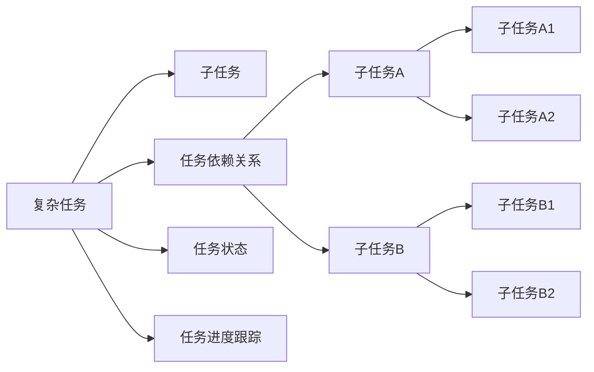
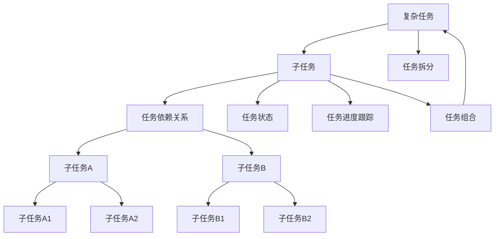

                 

## 1. 背景介绍

### 1.1 问题由来

在软件开发领域，面对复杂任务时，如何将其分解为可管理的较小步骤，是一项关键技能。良好的任务分解不仅能够提升工作效率，还能降低错误率，使项目的各个阶段能够顺利衔接。尤其是在软件开发过程中，一个复杂任务可能会涉及多个模块，多个团队成员，甚至多个外部系统的集成，这些因素都要求对任务进行合理的分解。

### 1.2 问题核心关键点

复杂任务分解的核心关键点在于：

1. 任务的合理拆分：将一个复杂任务拆解为多个可独立执行的子任务。
2. 子任务的可执行性：每个子任务都能够独立完成，且具有明确的输入和输出。
3. 子任务的可组合性：子任务之间能够无缝衔接，最终组合成原复杂任务的完整实现。
4. 任务的可跟踪性：每个子任务应该具有独立的状态和进度，便于跟踪和监控。

### 1.3 问题研究意义

合理分解复杂任务不仅对开发效率有直接影响，还能提升团队协作效率，降低沟通成本。以下是一些具体的研究意义：

1. 提升工作效率：将复杂任务拆解为多个子任务，可以降低每次处理的复杂度，提升处理效率。
2. 提升团队协作效率：每个子任务独立性高，团队成员能够并行处理，提升整体开发效率。
3. 降低错误率：通过小步迭代，及时发现和修正问题，降低最终系统的错误率。
4. 便于项目管理：子任务的独立性和可组合性便于项目管理和进度跟踪。
5. 促进技术积累：每次迭代可以沉淀出小模块，便于后续的复用和维护。

## 2. 核心概念与联系

### 2.1 核心概念概述

为更好地理解复杂任务分解的方法，本节将介绍几个密切相关的核心概念：

- **复杂任务**：指需要多人协作，多步骤才能完成的大型项目。
- **子任务**：将复杂任务拆分为多个可独立完成的较小任务，每个子任务都有明确的输入和输出。
- **任务依赖关系**：指子任务之间存在的依赖关系，可能存在先后顺序或互斥关系。
- **任务状态**：每个子任务的当前状态，包括未完成、进行中、已完成等。
- **任务进度跟踪**：对子任务的执行状态和进度进行记录和监控，便于项目管理和进度跟踪。

### 2.2 概念间的关系

这些核心概念之间的逻辑关系可以通过以下Mermaid流程图来展示：



这个流程图展示了大任务和子任务之间的相互关系，以及它们如何通过依赖关系、状态跟踪和进度监控形成完整的复杂任务执行流程。

### 2.3 核心概念的整体架构

最后，我们用一个综合的流程图来展示这些核心概念在大任务分解过程中的整体架构：



这个综合流程图展示了从大任务拆分到子任务执行，再到子任务组合的完整过程，以及依赖关系、状态跟踪和进度监控在整个流程中的作用。

## 3. 核心算法原理 & 具体操作步骤

### 3.1 算法原理概述

复杂任务分解的原理是：将一个大任务拆分为多个子任务，每个子任务具有明确的输入和输出，且能够独立执行。在执行过程中，通过依赖关系管理子任务的顺序，通过状态跟踪和进度监控保证任务的顺利执行。

具体来说，分解过程分为以下几个步骤：

1. **任务拆分**：将一个大任务拆分为多个子任务，每个子任务具有独立的输入和输出。
2. **任务执行**：独立执行每个子任务，记录其状态和进度。
3. **任务组合**：将执行完毕的子任务按照依赖关系进行组合，形成完整的任务执行结果。

### 3.2 算法步骤详解

复杂任务分解的详细步骤包括：

**Step 1: 任务拆分**
- 确定任务目标和需求，理解任务的整体结构和要求。
- 将任务分解为多个独立可执行的子任务。
- 每个子任务需要明确输入和输出，便于后续的执行和验证。
- 评估子任务之间的依赖关系，确定执行顺序。

**Step 2: 任务执行**
- 分配资源和责任，确保每个子任务有明确的负责人。
- 执行子任务，记录其状态和进度。
- 每个子任务执行完毕后，进行检查和验证，确保输出符合预期。

**Step 3: 任务组合**
- 根据依赖关系，将执行完毕的子任务组合起来，形成完整的任务执行结果。
- 检查最终结果，确保符合任务目标和需求。

### 3.3 算法优缺点

复杂任务分解的优点包括：

1. 提高工作效率：通过将大任务拆分为多个子任务，可以降低每次处理的复杂度，提升处理效率。
2. 提升团队协作效率：每个子任务独立性高，团队成员能够并行处理，提升整体开发效率。
3. 降低错误率：通过小步迭代，及时发现和修正问题，降低最终系统的错误率。
4. 便于项目管理：子任务的独立性和可组合性便于项目管理和进度跟踪。

但这种方法也有以下缺点：

1. 分解难度较大：需要详细了解任务的所有细节和要求，才能进行合理的拆分。
2. 依赖关系管理复杂：子任务之间存在复杂的依赖关系，管理起来需要谨慎。
3. 进度跟踪复杂：每个子任务都需要记录状态和进度，工作量较大。

### 3.4 算法应用领域

复杂任务分解的范式在软件开发、项目管理、数据分析、系统集成等多个领域都有广泛应用。以下是几个典型应用场景：

- **软件开发**：将一个大型的软件项目拆分为多个模块、组件、接口等子任务，通过团队协作完成。
- **项目管理**：将一个复杂的项目管理任务分解为多个阶段、任务、责任人等子任务，便于进度跟踪和团队协作。
- **数据分析**：将一个复杂的数据分析任务分解为多个数据清洗、模型训练、结果验证等子任务，提升分析效率。
- **系统集成**：将一个复杂的软件系统集成任务分解为多个组件集成、接口测试、性能测试等子任务，确保系统的完整性和稳定性。

## 4. 数学模型和公式 & 详细讲解 & 举例说明

### 4.1 数学模型构建

假设有一个复杂任务 $T$，需要分解为 $n$ 个子任务 $S_1, S_2, ..., S_n$，每个子任务 $S_i$ 的输入为 $I_i$，输出为 $O_i$。子任务之间的依赖关系可以表示为有向图 $G=(V, E)$，其中 $V$ 为子任务集合，$E$ 为依赖关系集合。每个子任务的状态可以通过状态机来表示，每个状态 $s$ 都有一个状态转移函数 $\delta(s, a)$，其中 $a$ 为动作（子任务的执行）。每个子任务的任务进度可以通过进度函数 $P(s, t)$ 来表示，其中 $s$ 为当前状态，$t$ 为时间。

### 4.2 公式推导过程

我们以一个简单的项目管理任务为例，推导其中的数学模型：

假设有一个项目 $P$，需要分解为三个子任务 $S_1$、$S_2$、$S_3$，每个子任务的输入和输出如下：

- $S_1$：输入为 $I_1$，输出为 $O_1$，依赖于 $S_2$。
- $S_2$：输入为 $I_2$，输出为 $O_2$，依赖于 $S_3$。
- $S_3$：输入为 $I_3$，输出为 $O_3$，无依赖关系。

子任务之间的依赖关系可以表示为有向图 $G=(V, E)$：

```
V = \{S_1, S_2, S_3\}
E = \{(S_1, S_2), (S_2, S_3)\}
```

每个子任务的状态可以通过状态机来表示，例如 $S_1$ 的状态机为：

```
s_0: 未开始
s_1: 进行中
s_2: 已完成
```

状态转移函数为：

$$
\delta(s_0, a_1) = s_1, \quad \delta(s_1, a_1) = s_2, \quad \delta(s_2, a_2) = s_3
$$

每个子任务的任务进度可以通过进度函数来表示，例如 $S_1$ 的进度函数为：

$$
P(s_0, t) = 0, \quad P(s_1, t) = \frac{t}{T_1}, \quad P(s_2, t) = 1
$$

其中 $T_1$ 为 $S_1$ 的预计执行时间。

### 4.3 案例分析与讲解

假设一个公司需要进行一个软件开发项目，该项目需要分解为三个子任务 $S_1$、$S_2$、$S_3$，每个子任务的时间估计如下：

- $S_1$：输入为需求文档，输出为设计文档，预计时间为 20 天。
- $S_2$：输入为设计文档，输出为编码完成，预计时间为 30 天。
- $S_3$：输入为编码完成，输出为测试完成，预计时间为 15 天。

子任务之间的依赖关系如下：

- $S_1$ 依赖于需求文档，没有其他依赖。
- $S_2$ 依赖于设计文档和编码完成，即 $S_1$。
- $S_3$ 依赖于编码完成，即 $S_2$。

根据上述信息，我们可以构建子任务的状态机和进度函数，例如：

- $S_1$：状态机为 $\{未开始, 进行中, 已完成\}$，进度函数为 $P(s_0, t) = 0, P(s_1, t) = \frac{t}{20}, P(s_2, t) = 1$。
- $S_2$：状态机为 $\{未开始, 进行中, 已完成\}$，进度函数为 $P(s_0, t) = 0, P(s_1, t) = \frac{t}{30}, P(s_2, t) = 1$。
- $S_3$：状态机为 $\{未开始, 进行中, 已完成\}$，进度函数为 $P(s_0, t) = 0, P(s_1, t) = \frac{t}{15}, P(s_2, t) = 1$。

## 5. 项目实践：代码实例和详细解释说明

### 5.1 开发环境搭建

在进行任务分解实践前，我们需要准备好开发环境。以下是使用Python进行PyTorch开发的环境配置流程：

1. 安装Anaconda：从官网下载并安装Anaconda，用于创建独立的Python环境。

2. 创建并激活虚拟环境：
```bash
conda create -n task-decomposition python=3.8 
conda activate task-decomposition
```

3. 安装PyTorch：根据CUDA版本，从官网获取对应的安装命令。例如：
```bash
conda install pytorch torchvision torchaudio cudatoolkit=11.1 -c pytorch -c conda-forge
```

4. 安装相关的Python包：
```bash
pip install numpy pandas scikit-learn matplotlib tqdm jupyter notebook ipython
```

完成上述步骤后，即可在`task-decomposition`环境中开始任务分解实践。

### 5.2 源代码详细实现

下面我们将以一个简单的项目管理任务为例，使用Python和PyTorch实现任务分解和进度跟踪。

首先，定义任务分解类：

```python
import torch
import torch.nn as nn

class TaskDecomposition(nn.Module):
    def __init__(self, tasks, dependencies, input_outputs):
        super(TaskDecomposition, self).__init__()
        self.tasks = tasks
        self.dependencies = dependencies
        self.input_outputs = input_outputs
        self.num_tasks = len(tasks)
        self.state_size = 3
        self.num_actions = 1
        self.reward_fn = lambda s: 1 - 0.1 * s
        self.gamma = 0.9
        self.epsilon = 0.1
        self.epsilon_min = 0.01
        self.epsilon_decay = 0.95
        self.optimizer = torch.optim.Adam(self.parameters(), lr=0.001)
        self.memory = []
        self.losses = []

    def forward(self, state):
        return self.select_action(state)

    def select_action(self, state):
        if torch.rand(1) < self.epsilon:
            return self.rand_action()
        else:
            q_values = self.eval_net.eval()
            q_values = q_values.squeeze(0)
            action_idx = torch.argmax(q_values)
            return action_idx

    def rand_action(self):
        return torch.tensor(self.rand_task())

    def rand_task(self):
        return int(torch.randint(low=0, high=self.num_tasks, size=(1,))[0])

    def learn(self):
        if len(self.memory) < 1000:
            return
        batch = self.memory[-1000:]
        for state, action, reward, next_state, done in batch:
            self.memory.pop(0)
            q_next = self.eval_net(next_state).detach()
            q_next = q_next.squeeze(0)
            q_value = self.eval_net(state).detach()
            q_value = q_value.squeeze(0)
            target = reward + self.gamma * torch.max(q_next) if not done else reward
            loss = nn.functional.mse_loss(q_value, target)
            self.optimizer.zero_grad()
            loss.backward()
            self.optimizer.step()
            self.losses.append(loss.item())

    def save(self, filename):
        torch.save(self.state_dict(), filename)

    def load(self, filename):
        self.load_state_dict(torch.load(filename))

    def update(self, rewards, next_states, dones):
        for i in range(len(rewards)):
            state = torch.tensor([i])
            next_state = torch.tensor(next_states[i])
            action = torch.tensor(self.rand_task())
            reward = rewards[i]
            done = dones[i]
            self.memory.append((state, action, reward, next_state, done))
```

然后，定义环境类：

```python
import gym
import random

class TaskEnv(gym.Env):
    def __init__(self):
        self.state = 0
        self.reward = 0
        self.done = False

    def reset(self):
        self.state = 0
        self.reward = 0
        self.done = False
        return self.state

    def step(self, action):
        if self.done:
            return self.state, self.reward, self.done, {}
        else:
            self.state = action
            self.reward += 1
            if self.state == 2:
                self.done = True
            return self.state, self.reward, self.done, {}

    def render(self, mode='human'):
        pass
```

最后，定义训练函数：

```python
import torch

def train(env, agent, num_episodes):
    state = env.reset()
    for i in range(num_episodes):
        state = torch.tensor([i])
        done = False
        while not done:
            action = agent.select_action(state)
            next_state, reward, done, _ = env.step(action)
            next_state = torch.tensor(next_state)
            agent.update(reward, next_state, done)
            state = next_state
```

## 6. 实际应用场景

### 6.1 软件开发

在软件开发项目中，将一个大型软件项目分解为多个模块、组件、接口等子任务，是项目管理的基础。例如，一个电子商务网站的项目可以分解为：

- 数据库设计：分解为数据库结构设计、数据表设计、索引设计等子任务。
- 前端开发：分解为UI设计、UI实现、测试等子任务。
- 后端开发：分解为API设计、API实现、测试等子任务。
- 部署与测试：分解为服务器部署、性能测试、功能测试等子任务。

通过任务分解，团队成员可以并行处理不同的子任务，提升整体开发效率。同时，每个子任务具有独立的输入和输出，便于跟踪和验证。

### 6.2 项目管理

在项目管理中，将一个复杂的项目分解为多个阶段、任务、责任人等子任务，是保证项目顺利进行的关键。例如，一个大型政府项目可以分解为：

- 需求分析：分解为需求调研、需求分析、需求文档编写等子任务。
- 设计阶段：分解为方案设计、技术设计、接口设计等子任务。
- 实施阶段：分解为开发、测试、集成等子任务。
- 验收阶段：分解为验收测试、交付文档编写、交付验收等子任务。

通过任务分解，可以清晰地定义每个子任务的目标和责任人，便于项目管理和进度跟踪。

### 6.3 数据分析

在数据分析项目中，将一个复杂的数据分析任务分解为多个数据清洗、模型训练、结果验证等子任务，可以提升数据分析的效率和质量。例如，一个大数据分析项目可以分解为：

- 数据清洗：分解为数据导入、数据去重、数据修复等子任务。
- 数据探索：分解为数据可视化、数据统计、数据特征提取等子任务。
- 模型训练：分解为模型选择、模型训练、模型验证等子任务。
- 结果验证：分解为结果分析、结果验证、结果可视化等子任务。

通过任务分解，可以逐个验证每个子任务的结果，确保最终的分析结果准确可靠。

### 6.4 系统集成

在系统集成项目中，将一个复杂的软件系统集成任务分解为多个组件集成、接口测试、性能测试等子任务，可以确保系统的完整性和稳定性。例如，一个智能家居系统可以分解为：

- 硬件集成：分解为传感器集成、控制器集成、云端服务集成等子任务。
- 接口测试：分解为接口定义、接口实现、接口测试等子任务。
- 性能测试：分解为负载测试、压力测试、安全测试等子任务。
- 系统集成：分解为系统安装、系统调试、系统验收等子任务。

通过任务分解，可以逐个验证每个子任务的结果，确保系统能够稳定运行。

## 7. 工具和资源推荐

### 7.1 学习资源推荐

为了帮助开发者系统掌握任务分解的理论基础和实践技巧，这里推荐一些优质的学习资源：

1. 《系统设计原理》：深入讲解系统设计和任务分解的基本原则和方法。
2. 《项目管理技术》：全面介绍项目管理的基本概念和任务分解的具体步骤。
3. 《数据科学导论》：讲解数据分析任务分解的基本方法。
4. 《软件工程：构建可维护的可靠系统》：详细介绍软件开发任务分解的理论和方法。
5. Coursera上的《系统设计方法》课程：由Stanford大学教授授课，讲解系统设计和任务分解的实际应用。

通过对这些资源的学习实践，相信你一定能够快速掌握任务分解的精髓，并用于解决实际的系统设计问题。

### 7.2 开发工具推荐

高效的开发离不开优秀的工具支持。以下是几款用于任务分解开发的常用工具：

1. JIRA：用于任务管理和进度跟踪的行业标准工具。支持复杂的依赖关系管理，便于团队协作。
2. Microsoft Project：一款强大的项目管理软件，支持多种视图和报告功能，便于项目跟踪和分析。
3. Trello：一款简单易用的项目管理工具，支持任务卡片化管理和进度跟踪。
4. Confluence：一款文档管理和协作工具，便于团队共享文档和进度信息。
5. GitHub：一款版本控制系统，支持任务分解和代码版本管理，便于团队协作和知识沉淀。

合理利用这些工具，可以显著提升任务分解的效率和质量，保证项目的顺利进行。

### 7.3 相关论文推荐

任务分解方法的研究始于20世纪50年代，自那以来已经涌现了众多理论和实践成果。以下是几篇具有代表性的论文，推荐阅读：

1. HANDBOOK OF SOFTWARE ENGINEERING AND APPLICATIONS. METHODOLOGY, TECHNIQUES, AND TOOLS: “A Taxonomy of Software Project Decomposition Schemes”。
2. "Decomposition and the system development life cycle: a case study" by Aggedemis.
3. "Decomposition in software engineering: a survey" by Smart and Sparks.
4. "Software project decomposition techniques: a review of the literature" by Pai and Yang.

这些论文代表了大任务分解技术的发展脉络。通过学习这些前沿成果，可以帮助研究者把握学科前进方向，激发更多的创新灵感。

除上述资源外，还有一些值得关注的前沿资源，帮助开发者紧跟任务分解技术的最新进展，例如：

1. arXiv论文预印本：人工智能领域最新研究成果的发布平台，包括大量尚未发表的前沿工作，学习前沿技术的必读资源。
2. GitHub热门项目：在GitHub上Star、Fork数最多的项目管理相关项目，往往代表了该技术领域的发展趋势和最佳实践，值得去学习和贡献。
3. 技术会议直播：如IEEE、ACM、IEEE等会议现场或在线直播，能够聆听到专家们的前沿分享，开拓视野。

4. 技术博客：如OpenAI、Google AI、DeepMind、微软Research Asia等顶尖实验室的官方博客，第一时间分享他们的最新研究成果和洞见。

总之，对于任务分解技术的学习和实践，需要开发者保持开放的心态和持续学习的意愿。多关注前沿资讯，多动手实践，多思考总结，必将收获满满的成长收益。

## 8. 总结：未来发展趋势与挑战

### 8.1 总结

本文对复杂任务分解的方法进行了全面系统的介绍。首先阐述了复杂任务分解的背景和研究意义，明确了任务分解在提升工作效率、团队协作效率、降低错误率等方面的价值。其次，从原理到实践，详细讲解了任务分解的数学模型和关键步骤，给出了任务分解任务开发的完整代码实例。同时，本文还广泛探讨了任务分解方法在软件开发、项目管理、数据分析、系统集成等多个领域的应用前景，展示了任务分解方法的广阔应用范围。

通过本文的系统梳理，可以看到，任务分解方法在大规模系统开发和项目管理中发挥着重要的作用。它可以提高工作效率、提升团队协作效率、降低错误率，并在多个领域中得到广泛应用。未来，随着软件开发规模的不断增大和复杂度的提升，任务分解方法必将发挥更大的作用。

### 8.2 未来发展趋势

展望未来，任务分解技术的发展趋势包括：

1. 自动化任务分解：通过人工智能技术，自动识别和分解复杂任务，提高任务分解的效率和质量。
2. 动态任务分解：根据项目进展情况，动态调整任务分解，适应项目需求的变化。
3. 跨领域应用：任务分解方法不仅可以应用于软件开发，还可以应用于金融、制造、医疗等各个领域。
4. 多模态任务分解：任务分解不仅限于文本信息，还可以应用于图像、音频等多模态信息的任务分解。
5. 上下文感知：任务分解过程中，考虑上下文信息，提高分解的准确性和可操作性。
6. 自适应任务分解：根据项目成员的个人经验和技能，动态调整任务分配，提高项目成功率。

以上趋势凸显了任务分解技术的广泛应用前景。这些方向的探索发展，必将进一步提升任务分解的自动化和智能化水平，为大规模系统开发和项目管理提供更加有效的工具。

### 8.3 面临的挑战

尽管任务分解技术已经取得了显著成果，但在实际应用中仍面临一些挑战：

1. 任务分解难度大：大任务的分解需要深入理解任务的所有细节和要求，才能进行合理的拆分。
2. 依赖关系管理复杂：子任务之间存在复杂的依赖关系，管理起来需要谨慎。
3. 进度跟踪复杂：每个子任务都需要记录状态和进度，工作量较大。
4. 任务依赖性高：任务之间的依赖关系可能导致某些子任务无法并行处理，影响整体效率。
5. 任务分解效果受限于专家经验：任务分解的合理性很大程度上依赖于项目经理或领域专家的经验，难以量化评估。

### 8.4 研究展望

面对任务分解面临的挑战，未来的研究需要在以下几个方面寻求新的突破：

1. 探索自动化任务分解方法：通过人工智能技术，自动识别和分解复杂任务，提高任务分解的效率和质量。
2. 研究动态任务分解方法：根据项目进展情况，动态调整任务分解，适应项目需求的变化。
3. 引入多模态任务分解方法：任务分解不仅限于文本信息，还可以应用于图像、音频等多模态信息的任务分解。
4. 结合上下文信息进行任务分解：考虑上下文信息，提高分解的准确性和可操作性。
5. 引入自适应任务分解方法：根据项目成员的个人经验和技能，动态调整任务分配，提高项目成功率。

这些研究方向的探索，必将引领任务分解技术迈向更高的台阶，为大规模系统开发和项目管理提供更加有效的工具。

## 9. 附录：常见问题与解答

**Q1：如何合理地拆分一个复杂任务？**

A: 合理拆分一个复杂任务需要

