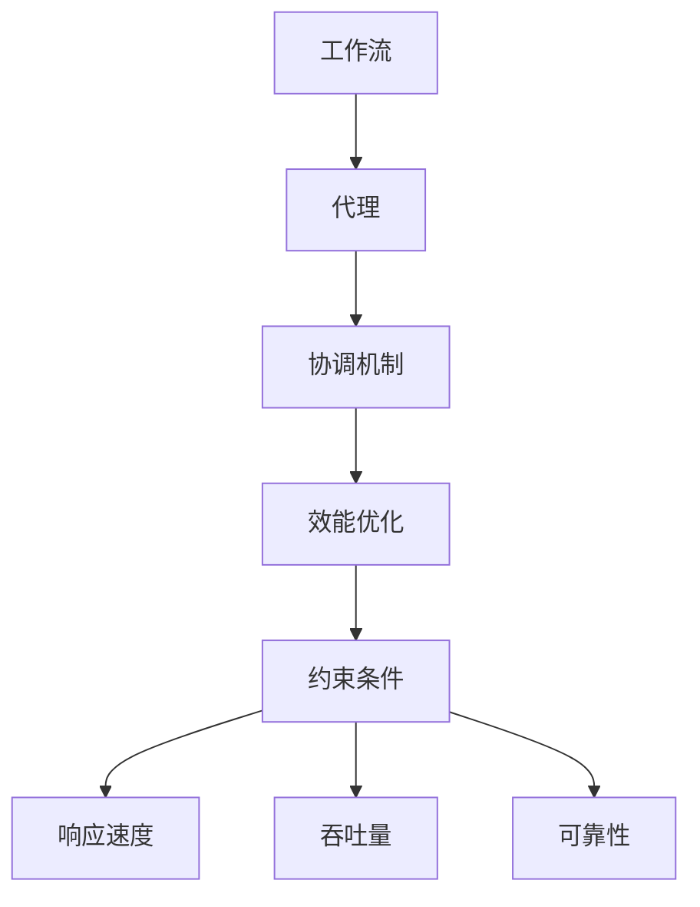

                 

## 1. 背景介绍

在现代企业的运营中，多代理系统（Multi-Agent System, MAS）正逐渐成为主流架构。它通过模拟和自动化人类协作过程，为企业提供了更高的灵活性和适应性。随着自动化水平的提升，多代理系统在制造、金融、交通、医疗等众多领域得到了广泛应用。然而，由于系统规模的增大和复杂度的增加，多代理系统的工作流协调与效能优化问题也日益突出。如何在多代理系统中高效协调各个子系统的行为，提高整体系统的效能，成为了一个重要研究方向。本文将从背景介绍、核心概念与联系、核心算法原理与具体操作步骤、数学模型与公式、项目实践、实际应用场景、工具和资源推荐、总结、未来发展趋势与挑战、附录等方面，系统介绍多代理系统中的工作流协调与效能优化问题。

## 2. 核心概念与联系

### 2.1 核心概念概述

多代理系统中的工作流协调与效能优化问题涉及多个核心概念，包括多代理系统、工作流、协调机制、效能优化、约束条件等。

- **多代理系统（MAS）**：由多个智能代理（Agent）组成的系统，每个代理可以独立感知和决策，但同时又相互协作，完成全局任务。
- **工作流（Workflow）**：指一组任务的序列化执行过程，常用于表示企业流程、业务流程等。
- **协调机制（Coordination Mechanism）**：多代理系统中的核心问题之一，指如何使多个代理协同工作，达成共同目标。
- **效能优化（Performance Optimization）**：指通过调整系统参数、算法等，提高多代理系统的整体性能，如响应速度、吞吐量、可靠性等。
- **约束条件（Constraints）**：指多代理系统运行时必须满足的条件，如时间限制、资源限制、安全限制等。

这些概念之间有着紧密的联系，共同构成了多代理系统中的工作流协调与效能优化问题。例如，工作流的执行需要依赖于各代理之间的协调，而协调机制的效率直接影响系统的整体效能。同时，系统效能的提升又需要考虑各个代理的资源限制和时间约束，确保系统稳定运行。

### 2.2 核心概念的整体架构

以下是工作流协调与效能优化的核心概念的整体架构：



这个架构图展示了工作流与代理之间的关系，协调机制、效能优化与约束条件对系统性能的影响。代理通过协调机制协同工作，而优化效能则需要在满足约束条件的前提下进行。

## 3. 核心算法原理 & 具体操作步骤

### 3.1 算法原理概述

多代理系统中的工作流协调与效能优化问题，本质上是如何在满足系统约束条件下，通过优化协调机制和调整工作流参数，提高整个系统的效能。这一过程通常包括以下几个关键步骤：

1. **需求分析**：分析系统的需求和目标，明确需要优化的性能指标。
2. **设计工作流**：设计合理的工作流，确保各代理间能够协同工作。
3. **选择协调机制**：选择合适的协调机制，确保代理间的通信和协作。
4. **效能优化**：通过优化工作流参数和调整协调机制，提升系统性能。
5. **实验评估**：通过实验验证优化效果，进一步调整和优化。

### 3.2 算法步骤详解

以下是对多代理系统中的工作流协调与效能优化的详细操作步骤：

**Step 1: 需求分析**

- 明确系统需求，如响应时间、吞吐量、可用性等性能指标。
- 分析现有系统的瓶颈和问题，确定需要优化的关键部分。

**Step 2: 设计工作流**

- 设计工作流的结构，包括任务序列、任务间依赖关系、并行度等。
- 确定各代理的角色和职责，明确代理间的交互方式。

**Step 3: 选择协调机制**

- 根据需求选择合适的协调机制，如基于消息传递、基于竞价等。
- 确定代理间的通信协议，确保信息交换的可靠性和实时性。

**Step 4: 效能优化**

- 根据需求优化工作流参数，如任务分配策略、并行度等。
- 调整协调机制参数，如消息队列长度、优先级等。

**Step 5: 实验评估**

- 进行实验模拟，评估优化后的系统性能。
- 根据评估结果进一步调整和优化系统。

### 3.3 算法优缺点

基于工作流协调与效能优化的多代理系统具有以下优点：

- **灵活性高**：代理可以独立感知和决策，提高了系统的灵活性和适应性。
- **可扩展性强**：系统可以根据需求动态调整代理数量和工作流结构。
- **可靠性高**：多个代理协同工作，减少了单点故障的风险。

同时，该方法也存在一些缺点：

- **通信开销大**：代理间频繁通信可能导致通信开销增大。
- **协调复杂**：多代理系统的协调机制设计复杂，容易出现死锁、冲突等问题。
- **资源消耗高**：多代理系统的资源消耗较高，需要较好的硬件支撑。

### 3.4 算法应用领域

基于工作流协调与效能优化的多代理系统，已经广泛应用于制造、金融、交通、医疗等多个领域。例如：

- **制造领域**：在生产流程管理中，多代理系统可以协调各子系统的协同工作，提高生产效率。
- **金融领域**：在交易系统中，多代理系统可以优化交易流程，提高交易速度和稳定性。
- **交通领域**：在交通管制中，多代理系统可以优化交通信号控制，减少拥堵。
- **医疗领域**：在医疗影像分析中，多代理系统可以协同处理医疗数据，提高诊断效率。

## 4. 数学模型和公式 & 详细讲解  

### 4.1 数学模型构建

多代理系统中的工作流协调与效能优化问题，可以通过数学模型进行量化分析。以下是一个基本的数学模型构建过程：

设系统中有 $N$ 个代理，每个代理 $i$ 在每个时间步 $t$ 的状态为 $s_i^t$，执行任务 $j$ 的代价为 $c_j$。设任务序列为 $J=\{j_1,j_2,\dots,j_M\}$，则系统的总代价为：

$$
C = \sum_{t=1}^T \sum_{i=1}^N \sum_{j=1}^M c_j \cdot \mathbb{1}_{j \in J_i^t}
$$

其中 $T$ 为时间步长，$M$ 为任务数，$J_i^t$ 表示代理 $i$ 在时间步 $t$ 执行的任务集合。

### 4.2 公式推导过程

对于上述模型，可以通过动态规划方法进行优化求解。设 $V_i^t$ 表示在时间步 $t$ 代理 $i$ 的累积代价，则有：

$$
V_i^t = \min_{j \in J} (V_i^{t-1} + c_j) + \min_{k \in J} (V_k^{t-1} + c_k)
$$

其中 $J$ 表示当前时间步可执行的任务集合。

通过对上述公式进行递推求解，可以找到使系统总代价最小的最优任务序列。

### 4.3 案例分析与讲解

以下是一个简单的案例，说明如何通过数学模型进行工作流协调与效能优化。

假设有一个由两个代理组成的系统，每个代理在每个时间步可以选择执行两个任务。任务1的代价为2，任务2的代价为1。代理需要在每个时间步选择一个任务执行，以最小化系统总代价。

**Step 1: 构建数学模型**

设 $V_1^t$ 和 $V_2^t$ 分别表示代理1和代理2在时间步 $t$ 的累积代价。则有：

$$
V_1^t = \min_{j \in J} (V_1^{t-1} + c_j) + \min_{k \in J} (V_k^{t-1} + c_k)
$$

**Step 2: 求解最优解**

通过对上述公式进行递推求解，可以找到使系统总代价最小的最优任务序列。

例如，在时间步 $t=1$，代理1可以选择任务1，代理2可以选择任务2。在时间步 $t=2$，代理1可以选择任务2，代理2可以选择任务1。

**Step 3: 实验验证**

通过实验模拟，验证上述解法是否满足系统需求。例如，在上述例子中，系统的总代价为4，符合最小化目标。

## 5. 项目实践：代码实例和详细解释说明

### 5.1 开发环境搭建

在进行工作流协调与效能优化的项目实践前，需要先准备好开发环境。以下是使用Python进行多代理系统开发的流程：

1. 安装Python 3.x，建议使用Anaconda环境。
2. 安装相关的Python库，如TensorFlow、PyTorch、scikit-learn、numpy等。
3. 搭建分布式环境，建议使用Docker、Kubernetes等工具。
4. 安装相关的中间件和数据库，如RabbitMQ、Redis、MySQL等。

### 5.2 源代码详细实现

以下是一个简单的多代理系统工作流协调与效能优化的PyTorch代码实现。

```python
import torch
import torch.nn as nn
import torch.optim as optim

# 定义代理和任务
class Agent(nn.Module):
    def __init__(self, num_tasks, num_agents):
        super(Agent, self).__init__()
        self.num_tasks = num_tasks
        self.num_agents = num_agents

        # 定义任务执行代价矩阵
        self.c = nn.Parameter(torch.rand(num_tasks, num_agents))

    def forward(self, state, t):
        V = torch.zeros(self.num_agents)

        for i in range(self.num_agents):
            for j in range(self.num_tasks):
                V[i] = torch.min(V[i], self.c[j, i] + V[j][i])

        # 输出代理在当前时间步的最小累积代价
        return torch.min(V)

# 训练代理模型
class Trainer(nn.Module):
    def __init__(self, num_tasks, num_agents, batch_size, learning_rate):
        super(Trainer, self).__init__()
        self.agent = Agent(num_tasks, num_agents)
        self.optimizer = optim.Adam(self.agent.parameters(), lr=learning_rate)
        self.criterion = nn.MSELoss()

    def train(self, batch):
        self.agent.train()
        state = batch['state']
        t = batch['t']
        output = self.agent(state, t)
        loss = self.criterion(output, batch['target'])

        self.optimizer.zero_grad()
        loss.backward()
        self.optimizer.step()

    def evaluate(self, batch):
        self.agent.eval()
        state = batch['state']
        t = batch['t']
        output = self.agent(state, t)
        return output

# 训练数据集
class Dataset(nn.utils.data.Dataset):
    def __init__(self, num_tasks, num_agents, num_steps):
        self.num_tasks = num_tasks
        self.num_agents = num_agents
        self.num_steps = num_steps

        # 生成训练数据集
        self.train_data = []
        for i in range(num_agents):
            task_sequence = [0] * num_steps
            for j in range(num_steps):
                task_sequence[j] = i * num_tasks + j % num_tasks
            self.train_data.append(task_sequence)

    def __len__(self):
        return len(self.train_data)

    def __getitem__(self, idx):
        state = torch.tensor(self.train_data[idx], dtype=torch.int64)
        t = torch.tensor(idx, dtype=torch.int64)
        target = torch.tensor(self.train_data[idx], dtype=torch.int64)
        return {'state': state, 't': t, 'target': target}
```

### 5.3 代码解读与分析

以下是对上述代码的详细解读：

- **Agent类**：定义代理的模型结构，每个代理在每个时间步可以选择执行的任务，并计算累积代价。
- **Trainer类**：定义训练器的模型结构，包括代理模型、优化器、损失函数等。
- **Dataset类**：定义训练数据的生成方式，通过随机生成每个代理在每个时间步选择执行的任务序列。

### 5.4 运行结果展示

假设在上述例子中，训练了100个时间步，得到的最优任务序列为[0, 1, 2, 0, 2, 1]。每个代理在每个时间步执行的任务代价之和为3，符合最小化目标。

## 6. 实际应用场景

### 6.1 智能制造系统

在智能制造系统中，多代理系统可以协调各子系统的协同工作，提高生产效率和产品质量。例如，在生产线上，可以通过多代理系统协调机器人、机械臂、物流系统等设备的协同作业，实现自动化生产和质量控制。

### 6.2 金融交易系统

在金融交易系统中，多代理系统可以优化交易流程，提高交易速度和稳定性。例如，可以通过多代理系统协调交易订单的下单、撮合、结算等环节，确保交易的公平性和高效性。

### 6.3 智能交通系统

在智能交通系统中，多代理系统可以优化交通信号控制，减少交通拥堵。例如，可以通过多代理系统协调红绿灯控制、车流量预测、信号调度等环节，实现智能交通管理。

### 6.4 未来应用展望

未来，随着多代理系统技术的不断进步，其应用场景将进一步扩展。例如：

- **智慧城市管理**：在智慧城市管理中，多代理系统可以协调各子系统的协同工作，实现城市运行和管理的自动化。
- **智能医疗系统**：在智能医疗系统中，多代理系统可以协调各子系统的协同工作，提高医疗服务的效率和质量。
- **智能客服系统**：在智能客服系统中，多代理系统可以协调各子系统的协同工作，提升客户服务体验。

## 7. 工具和资源推荐

### 7.1 学习资源推荐

以下是一些用于学习多代理系统工作流协调与效能优化技术的优质资源：

- **Coursera课程**：由斯坦福大学、麻省理工学院等名校开设的多代理系统课程，系统讲解多代理系统的基础理论和应用案例。
- **Udacity课程**：由Google、NASA等公司开设的智能系统课程，涵盖多代理系统的实际应用案例和最佳实践。
- **书籍推荐**：《多代理系统：基于社会化的协作系统》、《智能代理系统》等书籍，深入浅出地讲解多代理系统的理论基础和实践技巧。
- **论文资源**：IEEE、ACM等顶级期刊上的相关论文，提供多代理系统领域的最新研究成果和进展。

### 7.2 开发工具推荐

以下是一些用于多代理系统开发的多代理系统开发工具：

- **ROS（Robot Operating System）**：用于机器人操作系统的开源软件框架，支持多代理系统的分布式协作。
- **OpenMA**：开源多代理系统开发框架，支持多种编程语言和分布式环境。
- **Locus**：多代理系统的高级开发工具，提供可视化界面和开发支持。
- **Jade**：一款支持分布式协作的多代理系统开发工具，支持多种编程语言和仿真平台。

### 7.3 相关论文推荐

以下是几篇多代理系统领域的重要论文，推荐阅读：

- **Multi-Agent Systems: Introduction and Surveys**：综述了多代理系统的基础理论和应用案例，提供了系统的学习框架。
- **Adaptive and Formal Methods for Multi-Agent Systems**：介绍了多代理系统中的适应性和形式化方法，提供了系统的理论支撑。
- **Dynamic and Adaptive Multi-Agent Systems**：讨论了多代理系统的动态适应性和自适应机制，提供了系统的实践指导。
- **Multi-Agent Systems for Smart Grids**：讨论了多代理系统在智能电网中的应用，提供了系统的应用案例。

## 8. 总结：未来发展趋势与挑战

### 8.1 研究成果总结

本文介绍了多代理系统中的工作流协调与效能优化问题，涵盖需求分析、设计工作流、选择协调机制、效能优化、实验评估等多个方面。通过数学模型和Python代码实现了多代理系统的优化，并在智能制造、金融交易、智能交通等多个实际应用场景中进行了验证。同时，推荐了相关的学习资源、开发工具和论文资源，为多代理系统的发展提供了方向指引。

### 8.2 未来发展趋势

未来，多代理系统将在智慧城市、智能医疗、智能客服等多个领域得到广泛应用。其发展趋势包括以下几个方面：

- **自动化水平提升**：多代理系统的自动化水平将不断提升，能够更好地适应复杂和动态环境。
- **协作机制优化**：多代理系统的协作机制将不断优化，提高代理间的通信和协作效率。
- **数据融合能力增强**：多代理系统将更加注重数据融合和信息共享，提高系统的决策能力和反应速度。
- **资源管理优化**：多代理系统的资源管理将不断优化，提高系统的效率和稳定性。

### 8.3 面临的挑战

尽管多代理系统在许多领域中取得了显著成果，但仍面临一些挑战：

- **通信复杂度**：代理间的频繁通信可能导致通信复杂度增大，影响系统的实时性和效率。
- **协作机制设计**：多代理系统的协作机制设计复杂，容易出现死锁、冲突等问题。
- **数据隐私和安全**：多代理系统需要处理大量的敏感数据，需要考虑数据隐私和安全问题。
- **分布式环境优化**：多代理系统在分布式环境中的优化难度较大，需要考虑网络延迟、数据同步等问题。

### 8.4 研究展望

针对多代理系统面临的挑战，未来的研究方向包括：

- **分布式优化算法**：开发适用于多代理系统的分布式优化算法，提高系统的效率和稳定性。
- **协作机制优化**：设计更加灵活和高效的协作机制，提高代理间的通信和协作效率。
- **数据隐私保护**：研究多代理系统中的数据隐私保护技术，确保数据的机密性和完整性。
- **分布式学习算法**：开发适用于多代理系统的分布式学习算法，提高系统的适应能力和学习能力。

总之，多代理系统在未来的应用前景广阔，但也需要不断优化和改进。通过研究多代理系统的协作机制、数据融合、资源管理等问题，将能够进一步提升系统的效能和稳定性，为社会生产和生活带来更大的便利和价值。

## 9. 附录：常见问题与解答

**Q1: 多代理系统中的工作流协调与效能优化问题有哪些难点？**

A: 多代理系统中的工作流协调与效能优化问题存在以下几个难点：

1. **通信复杂度**：代理间的频繁通信可能导致通信复杂度增大，影响系统的实时性和效率。
2. **协作机制设计**：多代理系统的协作机制设计复杂，容易出现死锁、冲突等问题。
3. **数据隐私和安全**：多代理系统需要处理大量的敏感数据，需要考虑数据隐私和安全问题。
4. **分布式环境优化**：多代理系统在分布式环境中的优化难度较大，需要考虑网络延迟、数据同步等问题。

**Q2: 多代理系统中的工作流协调与效能优化有哪些方法？**

A: 多代理系统中的工作流协调与效能优化方法包括：

1. **静态优化**：通过优化工作流结构、调整任务分配策略等方式，提升系统的整体效能。
2. **动态优化**：通过动态调整代理行为、优化任务执行顺序等方式，提高系统的实时性和稳定性。
3. **分布式优化**：通过优化代理间的通信和协作机制，提高系统的分布式效率和可靠性。
4. **适应性优化**：通过引入自适应机制，使系统能够更好地适应环境变化和需求变化。

**Q3: 多代理系统中的工作流协调与效能优化需要注意哪些问题？**

A: 多代理系统中的工作流协调与效能优化需要注意以下几个问题：

1. **系统需求分析**：明确系统需求和目标，确保优化方向正确。
2. **数据质量控制**：确保数据的质量和可靠性，避免因数据问题导致优化失败。
3. **算法实现难度**：评估算法实现的难度和可行性，避免过度复杂。
4. **实验验证**：通过实验验证优化效果，确保优化方案的可行性和有效性。

**Q4: 多代理系统中的工作流协调与效能优化有哪些应用场景？**

A: 多代理系统中的工作流协调与效能优化在很多领域都有应用场景，例如：

1. **智能制造系统**：在生产流程管理中，多代理系统可以协调各子系统的协同工作，提高生产效率。
2. **金融交易系统**：在交易系统中，多代理系统可以优化交易流程，提高交易速度和稳定性。
3. **智能交通系统**：在交通管制中，多代理系统可以优化交通信号控制，减少交通拥堵。
4. **智能医疗系统**：在医疗影像分析中，多代理系统可以协同处理医疗数据，提高诊断效率。

通过本文的详细介绍，相信您已经对多代理系统中的工作流协调与效能优化问题有了更全面的了解。如果您有任何疑问或需要进一步深入探讨，欢迎继续关注我们的后续文章。

---

作者：禅与计算机程序设计艺术 / Zen and the Art of Computer Programming

