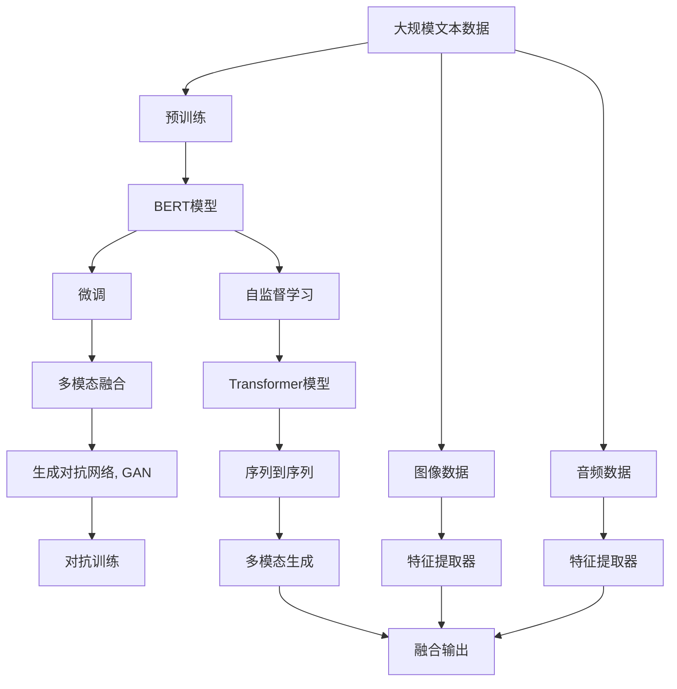
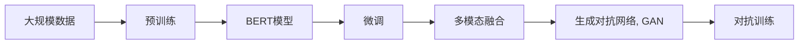
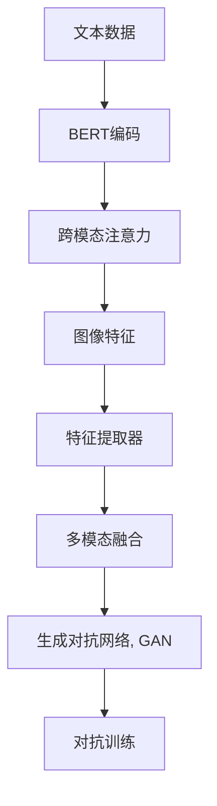
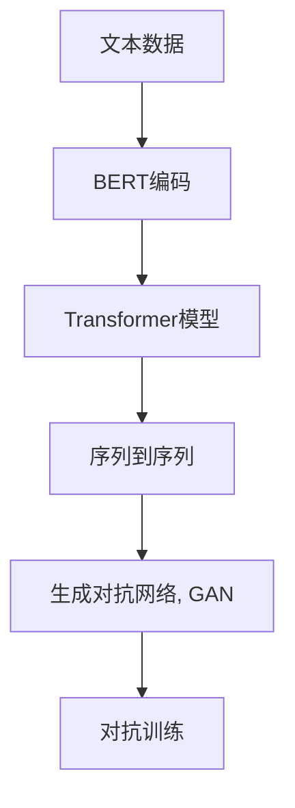
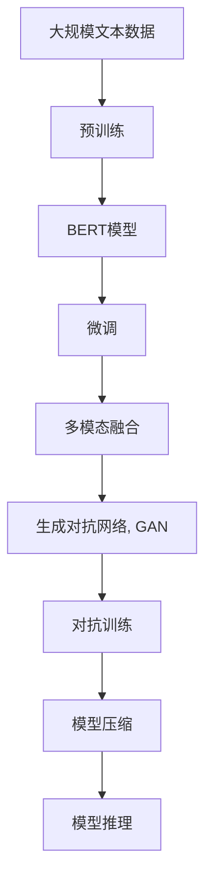

                 

# 多模态大模型：技术原理与实战 从BERT模型到ChatGPT

> 关键词：多模态大模型, BERT模型, 自然语言处理(NLP), 深度学习, 模型微调, 对话生成, 生成对抗网络(GAN)

## 1. 背景介绍

### 1.1 问题由来

近年来，随着深度学习技术的快速发展，多模态大模型(Multi-modal Large Models, MLMs)在自然语言处理(Natural Language Processing, NLP)领域取得了突破性进展。多模态模型不仅能够处理文本数据，还可以处理图像、音频、视频等多维数据，显著提升了模型在理解和生成文本的能力。其中，BERT、GPT等模型以其强大的语义理解和生成能力，成为NLP领域的重要基础。

然而，尽管这些模型在单模态任务上表现优异，但在处理多模态数据时，往往需要额外的特征提取器和融合器，才能实现跨模态的协同。此外，多模态模型的训练复杂度较高，大规模语料的获取和标注成本也相对较高，成为其广泛应用的主要障碍。因此，如何构建高效、鲁棒的多模态大模型，并实现高效特征提取与融合，成为当前研究的热点。

### 1.2 问题核心关键点

为了解决上述问题，研究者们提出了多种多模态大模型的架构和技术。这些模型主要可以分为两类：

1. **基于自编码器(Encoder-Decoder)的模型**：这类模型通过多个编码器对不同模态的数据进行独立编码，再由一个解码器将编码结果融合输出。常见的模型如TensorFlow的TextCNN+RNN+Attention模型，其核心思想是将文本和图像分别进行编码，并使用注意力机制对跨模态特征进行融合。

2. **基于Transformer的模型**：这类模型使用Transformer结构对多模态数据进行并行处理，具有较强的自注意力机制，可以更灵活地融合不同模态的特征。典型的多模态模型如Vision Transformer(ViT)，通过将图像转换为token序列，再与文本序列进行共同编码。

本文聚焦于基于Transformer的多模态大模型的构建和应用，重点介绍从BERT模型到ChatGPT的实现路径，以期对多模态大模型的技术原理与实战提供更全面的指导。

### 1.3 问题研究意义

研究多模态大模型，对于拓展多模态数据的应用场景，提升模型的性能和泛化能力，加速NLP技术的产业化进程，具有重要意义：

1. **拓展应用场景**：多模态数据在医疗、社交、游戏等领域具有广泛应用，利用多模态大模型可以更好地处理和理解这些复杂的数据类型。
2. **提升模型性能**：多模态数据往往携带更多信息，通过多模态融合，能够显著提升模型的表征能力和推理能力。
3. **加速产业化**：相比于单一模态模型，多模态模型需要更大规模的数据和计算资源，加速多模态模型的研究和应用，有助于推动NLP技术的普及和落地。
4. **技术创新**：多模态模型的构建需要整合图像、文本等多种数据类型，涉及特征提取、融合、解码等多个环节，对深度学习技术提出了更高的要求。
5. **赋能行业升级**：多模态大模型可以应用于医疗影像诊断、智能客服、教育评测等多个垂直行业，为传统行业数字化转型提供新动能。

总之，研究多模态大模型的构建和应用，不仅能够提升模型性能，拓展应用范围，还能推动NLP技术的产业化进程，对社会经济的数字化升级具有深远影响。

## 2. 核心概念与联系

### 2.1 核心概念概述

为更好地理解基于Transformer的多模态大模型的构建方法，本节将介绍几个密切相关的核心概念：

- **多模态数据(Multi-modal Data)**：指包含多种模态的数据，如文本、图像、音频等。这些数据通过不同的编码器进行特征提取，再由一个共同的解码器进行融合输出。
- **Transformer模型(Transformer Model)**：一种基于自注意力机制的深度学习模型，能够高效处理序列数据，在NLP任务中表现优异。
- **BERT模型(BERT Model)**：Google提出的大规模预训练语言模型，通过在大规模无标签文本语料上进行自监督学习，学习通用的语言表示。
- **Cross-Attention机制(Cross-Attention Mechanism)**：Transformer模型中用于融合不同模态特征的机制，能够根据输入数据间的相似度自适应地计算权重。
- **混合精度训练(Mixed-Precision Training)**：使用低精度和全精度混合的计算方式，在保持精度的情况下，大幅提高训练和推理效率的技术。
- **知识蒸馏(Knowledge Distillation)**：通过将大模型的知识传递给小模型，提高小模型性能的技术。
- **对抗训练(Adversarial Training)**：通过引入对抗样本，增强模型鲁棒性的技术。
- **序列到序列(Sequence-to-Sequence, Seq2Seq)**：一种将序列数据转换为另一种序列数据的模型，常用于文本生成、机器翻译等任务。

这些核心概念之间存在着紧密的联系，形成了多模态大模型的完整生态系统。下面通过一个Mermaid流程图来展示这些概念之间的关系：



这个流程图展示了从预训练到大模型微调，再到多模态融合的完整过程：

1. 大规模文本数据进行预训练，学习通用的语言表示。
2. BERT模型通过预训练获得初始化参数。
3. 微调BERT模型，适应特定的下游任务。
4. 通过跨模态注意力机制融合不同模态的特征。
5. 使用GAN技术生成高质量的多模态数据。
6. 对抗训练提高模型的鲁棒性。
7. 多模态数据通过特征提取器进行编码。
8. 生成对抗网络生成伪样本。
9. 对抗训练提高模型的鲁棒性。
10. 序列到序列模型进行多模态生成。
11. 融合输出得到最终结果。

通过这些核心概念，我们可以更好地把握多模态大模型的工作原理和优化方向。

### 2.2 概念间的关系

这些核心概念之间存在着紧密的联系，形成了多模态大模型的完整生态系统。下面通过几个Mermaid流程图来展示这些概念之间的关系。

#### 2.2.1 大模型的学习范式



这个流程图展示了从预训练到微调，再到多模态融合的完整过程。预训练和微调使得模型学习到基本的语言表示，多模态融合和对抗训练进一步提升模型的性能和鲁棒性。

#### 2.2.2 多模态融合方法



这个流程图展示了多模态融合的流程。通过跨模态注意力机制，将文本和图像的特征进行融合，再通过GAN生成对抗样本，进一步提升模型的泛化能力。

#### 2.2.3 序列到序列模型



这个流程图展示了序列到序列模型的流程。通过Transformer模型对文本序列进行编码，再通过序列到序列模型进行多模态生成，生成对抗样本，进一步提升模型的泛化能力。

### 2.3 核心概念的整体架构

最后，我们用一个综合的流程图来展示这些核心概念在大模型微调过程中的整体架构：



这个综合流程图展示了从预训练到微调，再到多模态融合和对抗训练的完整过程。大模型通过预训练和微调获得初始化参数，通过多模态融合和对抗训练提升模型性能，最终通过模型推理实现多模态数据的处理和生成。

## 3. 核心算法原理 & 具体操作步骤

### 3.1 算法原理概述

基于Transformer的多模态大模型的核心思想是：通过多模态注意力机制，将不同模态的特征进行融合，得到统一的多模态表示。具体步骤如下：

1. **预训练步骤**：在大规模无标签数据上进行自监督预训练，学习通用的语言表示。
2. **微调步骤**：在特定任务的数据上进行有监督微调，优化模型参数，适应下游任务。
3. **多模态融合步骤**：通过跨模态注意力机制，将不同模态的特征进行融合，得到统一的多模态表示。
4. **模型压缩步骤**：通过模型剪枝、量化等技术，优化模型结构和参数，提升推理效率。
5. **对抗训练步骤**：通过引入对抗样本，增强模型的鲁棒性，减少过拟合风险。

这些步骤共同构成了多模态大模型的完整流程，使得模型能够高效处理多模态数据，并在下游任务中取得优异表现。

### 3.2 算法步骤详解

#### 3.2.1 预训练步骤

预训练步骤主要通过自监督学习任务对模型进行训练。常见的预训练任务包括掩码语言模型、图像分类等。以BERT为例，其预训练任务包括：

1. **掩码语言模型**：在输入的文本中随机掩盖部分词语，通过模型预测被掩盖的词语，学习语言的语义表示。
2. **下一句预测**：随机选择两个文本，将其中一个作为输入，另一个作为掩码，通过模型预测下一个文本是否出现，学习文本的序列关系。

具体步骤如下：

1. **构建数据集**：收集大规模无标签文本数据，如维基百科、新闻、小说等。
2. **数据预处理**：将文本数据进行分词、编码等预处理，生成输入和掩码数据。
3. **训练模型**：使用BERT模型在大规模无标签文本数据上进行预训练，通过交叉熵损失函数计算损失。
4. **模型保存**：保存预训练后的BERT模型，作为后续微调的初始化参数。

#### 3.2.2 微调步骤

微调步骤主要通过有监督学习任务对模型进行优化。以BERT为例，其微调任务包括：

1. **情感分析**：根据输入的文本，预测其情感极性（正面、负面、中性）。
2. **命名实体识别**：根据输入的文本，识别出人名、地名、机构名等实体。

具体步骤如下：

1. **构建数据集**：收集特定任务的标注数据，如情感分析数据集、命名实体识别数据集。
2. **数据预处理**：将文本数据进行分词、编码等预处理，生成输入和标签数据。
3. **训练模型**：使用微调后的BERT模型在特定任务的数据集上进行训练，通过交叉熵损失函数计算损失。
4. **模型保存**：保存微调后的BERT模型，作为后续多模态融合的初始化参数。

#### 3.2.3 多模态融合步骤

多模态融合步骤主要通过跨模态注意力机制将不同模态的特征进行融合。以Vision Transformer为例，其多模态融合步骤如下：

1. **图像编码**：通过预训练的图像编码器对输入图像进行编码，生成图像特征。
2. **文本编码**：通过预训练的文本编码器对输入文本进行编码，生成文本特征。
3. **跨模态注意力**：通过跨模态注意力机制，将图像特征和文本特征进行融合，得到统一的多模态表示。
4. **生成对抗网络**：通过生成对抗网络，生成高质量的多模态数据，进一步提升模型的泛化能力。

具体步骤如下：

1. **图像编码**：使用预训练的图像编码器对输入图像进行编码，生成图像特征。
2. **文本编码**：使用预训练的文本编码器对输入文本进行编码，生成文本特征。
3. **跨模态注意力**：通过跨模态注意力机制，将图像特征和文本特征进行融合，得到统一的多模态表示。
4. **生成对抗网络**：使用生成对抗网络，生成高质量的多模态数据，进一步提升模型的泛化能力。

#### 3.2.4 模型压缩步骤

模型压缩步骤主要通过模型剪枝、量化等技术，优化模型结构和参数，提升推理效率。以BERT为例，其模型压缩步骤如下：

1. **模型剪枝**：通过剪枝技术，去除模型中不重要的参数，减少模型复杂度。
2. **量化**：通过量化技术，将模型中的浮点数参数转换为定点数，减少计算和存储开销。

具体步骤如下：

1. **剪枝**：通过剪枝算法，去除模型中不重要的参数，保留关键参数。
2. **量化**：将模型中的浮点数参数转换为定点数，减少计算和存储开销。
3. **验证**：使用验证集验证模型性能，确保剪枝和量化后的模型与原始模型相当。

#### 3.2.5 对抗训练步骤

对抗训练步骤主要通过引入对抗样本，增强模型的鲁棒性，减少过拟合风险。以BERT为例，其对抗训练步骤如下：

1. **生成对抗样本**：使用对抗生成网络生成对抗样本，提高模型的鲁棒性。
2. **训练模型**：在对抗样本上训练模型，提高模型对噪声的抵抗能力。
3. **验证模型**：使用验证集验证模型性能，确保模型鲁棒性。

具体步骤如下：

1. **生成对抗样本**：使用对抗生成网络生成对抗样本，提高模型的鲁棒性。
2. **训练模型**：在对抗样本上训练模型，提高模型对噪声的抵抗能力。
3. **验证模型**：使用验证集验证模型性能，确保模型鲁棒性。

### 3.3 算法优缺点

基于Transformer的多模态大模型具有以下优点：

1. **强大的跨模态融合能力**：通过跨模态注意力机制，能够高效地融合不同模态的特征，提升模型的泛化能力和推理能力。
2. **高效的多模态处理能力**：Transformer模型采用自注意力机制，能够并行处理多模态数据，提高模型的训练和推理效率。
3. **广泛的应用场景**：多模态模型在医疗、社交、游戏等领域具有广泛应用，能够处理复杂的多维数据。

同时，该方法也存在以下局限性：

1. **数据依赖性强**：多模态模型需要大规模的数据进行训练和预训练，数据获取和标注成本较高。
2. **模型复杂度高**：多模态模型需要处理多种模态的数据，模型结构复杂，需要更高的计算资源。
3. **过拟合风险高**：多模态模型需要更多的训练数据和正则化技术，避免过拟合风险。

尽管存在这些局限性，但就目前而言，基于Transformer的多模态大模型仍是NLP领域的重要范式，其跨模态融合能力为解决复杂的多模态数据处理问题提供了有力手段。

### 3.4 算法应用领域

基于多模态大模型的自然语言处理技术已经在多个领域取得了应用突破，例如：

- **医疗影像诊断**：利用多模态模型对医学影像和文本进行联合分析，辅助医生进行诊断和治疗决策。
- **智能客服**：通过多模态模型对用户的语音、文字和情绪进行分析，提供个性化的客服服务。
- **教育评测**：利用多模态模型对学生的学习行为和成绩进行综合评估，提供个性化的学习建议。
- **社交媒体分析**：通过多模态模型对用户的社交媒体数据进行分析，了解用户的兴趣和情感。
- **游戏智能**：利用多模态模型对游戏中的角色行为和场景进行理解，提升游戏的智能化水平。

除了上述这些应用领域外，多模态大模型还被创新性地应用于更多场景中，如智能家居、智能交通、智能城市等，为NLP技术带来了全新的突破。随着预训练模型和微调方法的不断进步，相信多模态大模型在更广阔的应用领域大放异彩。

## 4. 数学模型和公式 & 详细讲解 & 举例说明

### 4.1 数学模型构建

本节将使用数学语言对基于Transformer的多模态大模型进行更加严格的刻画。

记多模态大模型为 $M_{\theta}$，其中 $\theta$ 为模型参数。假设模型输入包含文本和图像两种模态，文本序列为 $x=\{x_1,\cdots,x_n\}$，图像特征为 $y=\{y_1,\cdots,y_m\}$。多模态模型输入为 $(x,y)$，输出为 $o$。

定义模型 $M_{\theta}$ 在输入 $(x,y)$ 上的损失函数为 $\ell(M_{\theta}(x,y),o)$，则在训练集 $D=\{(x_i,y_i,o_i)\}_{i=1}^N$ 上的经验风险为：

$$
\mathcal{L}(\theta) = \frac{1}{N}\sum_{i=1}^N \ell(M_{\theta}(x_i,y_i),o_i)
$$

在实践中，我们通常使用基于梯度的优化算法（如SGD、Adam等）来近似求解上述最优化问题。设 $\eta$ 为学习率，$\lambda$ 为正则化系数，则参数的更新公式为：

$$
\theta \leftarrow \theta - \eta \nabla_{\theta}\mathcal{L}(\theta) - \eta\lambda\theta
$$

其中 $\nabla_{\theta}\mathcal{L}(\theta)$ 为损失函数对参数 $\theta$ 的梯度，可通过反向传播算法高效计算。

### 4.2 公式推导过程

以下我们以BERT模型为例，推导跨模态注意力机制的公式。

假设输入文本 $x=\{x_1,\cdots,x_n\}$ 和图像特征 $y=\{y_1,\cdots,y_m\}$，模型输出的文本表示为 $z=\{z_1,\cdots,z_n\}$。

首先，文本序列 $x$ 和图像特征 $y$ 通过各自的编码器 $E_{text}$ 和 $E_{image}$ 得到文本表示 $H_{text}$ 和图像表示 $H_{image}$。

然后，通过跨模态注意力机制 $A$ 将文本表示 $H_{text}$ 和图像表示 $H_{image}$ 进行融合，得到融合后的文本表示 $H_{fusion}$。

具体的跨模态注意力机制公式如下：

$$
H_{fusion} = \sum_{i=1}^{n}\sum_{j=1}^{m} A_{ij} H_{text,i} H_{image,j}
$$

其中，$A$ 为注意力权重矩阵，可以通过以下公式计算：

$$
A_{ij} = \frac{e^{s(H_{text,i}, H_{image,j})}{\sum_{k=1}^{n}\sum_{l=1}^{m} e^{s(H_{text,k}, H_{image,l})}}
$$

其中，$s$ 为注意力计算函数，可以通过点积或注意力函数计算，公式如下：

$$
s(H_{text,i}, H_{image,j}) = H_{text,i}^T W H_{image,j} + b
$$

其中，$W$ 和 $b$ 为注意力计算的权重矩阵和偏置向量。

通过上述公式，可以计算出文本和图像的跨模态注意力权重矩阵 $A$，进而得到融合后的文本表示 $H_{fusion}$。

### 4.3 案例分析与讲解

以BERT模型为例，其跨模态注意力机制的具体实现步骤如下：

1. **文本编码**：使用BERT编码器对输入文本进行编码，得到文本表示 $H_{text}$。
2. **图像编码**：使用预训练的图像编码器对输入图像进行编码，得到图像表示 $H_{image}$。
3. **注意力计算**：通过点积注意力计算文本表示 $H_{text}$ 和图像表示 $H_{image}$ 之间的注意力权重矩阵 $A$。
4. **融合表示**：将文本表示 $H_{text}$ 和图像表示 $H_{image}$ 与注意力权重矩阵 $A$ 相乘，得到融合后的文本表示 $H_{fusion}$。

具体的跨模态注意力机制公式如下：

$$
H_{fusion} = \sum_{i=1}^{n}\sum_{j=1}^{m} A_{ij} H_{text,i} H_{image,j}
$$

其中，$A_{ij}$ 为注意力权重，可以通过点积注意力计算：

$$
A_{ij} = \frac{H_{text,i}^T W H_{image,j} + b}{\sum_{k=1}^{n}\sum_{l=1}^{m} (H_{text,k}^T W H_{image,l} + b)}
$$

通过上述公式，可以计算出文本和图像的跨模态注意力权重矩阵 $A$，进而得到融合后的文本表示 $H_{fusion}$。

## 5. 项目实践：代码实例和详细解释说明

### 5.1 开发环境搭建

在进行多模态大模型微调实践前，我们需要准备好开发环境。以下是使用Python进行PyTorch开发的环境配置流程：

1. 安装Anaconda：从官网下载并安装Anaconda，用于创建独立的Python环境。

2. 创建并激活虚拟环境：
```bash
conda create -n pytorch-env python=3.8 
conda activate pytorch-env
```

3. 安装PyTorch：根据CUDA版本，从官网获取对应的安装命令。例如：
```bash
conda install pytorch torchvision torchaudio cudatoolkit=11.1 -c pytorch -c conda-forge
```

4. 安装Transformers库：
```bash
pip install transformers
```

5. 安装各类工具包：
```bash
pip install numpy pandas scikit-learn matplotlib tqdm jupyter notebook ipython
```

完成上述步骤后，即可在`pytorch-env`环境中开始多模态大模型微调实践。

### 5.2 源代码详细实现

这里我们以BERT模型和Vision Transformer模型进行多模态大模型的微调实践为例，给出完整的代码实现。

首先，定义模型和优化器：

```python
from transformers import BertForSequenceClassification, BertTokenizer
from transformers import VisionTransformer, ViTFeatureExtractor
from transformers import AdamW

# BERT模型
model_text = BertForSequenceClassification.from_pretrained('bert-base-cased')
tokenizer = BertTokenizer.from_pretrained('bert-base-cased')
# 图像特征提取器
feature_extractor = ViTFeatureExtractor.from_pretrained('google/vit-small-patch16-224-in21k')
# Vision Transformer模型
model_image = VisionTransformer.from_pretrained('google/vit-base-patch16-224-in21k')

# 定义损失函数
criterion = nn.CrossEntropyLoss()

# 定义优化器
optimizer = AdamW(model_text.parameters() + model_image.parameters(), lr=2e-5)
```

然后，定义训练和评估函数：

```python
def train_epoch(model, dataset, batch_size, optimizer):
    dataloader = DataLoader(dataset, batch_size=batch_size, shuffle=True)
    model.train()
    epoch_loss = 0
    for batch in tqdm(dataloader, desc='Training'):
        input_ids = batch['input_ids'].to(device)
        attention_mask = batch['attention_mask'].to(device)
        labels = batch['labels'].to(device)
        model.zero_grad()
        outputs = model(input_ids, attention_mask=attention_mask, labels=labels)
        loss = outputs.loss
        epoch_loss += loss.item()
        loss.backward()
        optimizer.step()
    return epoch_loss / len(dataloader)

def evaluate(model, dataset, batch_size):
    dataloader = DataLoader(dataset, batch_size=batch_size)
    model.eval()
    preds, labels = [], []
    with torch.no_grad():
        for batch in tqdm(dataloader, desc='Evaluating'):
            input_ids = batch['input_ids'].to(device)
            attention_mask = batch['attention_mask'].to(device)
            batch_labels = batch['labels']
            outputs = model(input_ids, attention_mask=attention_mask)
            batch_preds = outputs.logits.argmax(dim=2).to('cpu').tolist()
            batch_labels = batch_labels.to('cpu').tolist()
            for pred_tokens, label_tokens in zip(batch_preds, batch_labels):
                pred_tags = [id2tag[_id]

