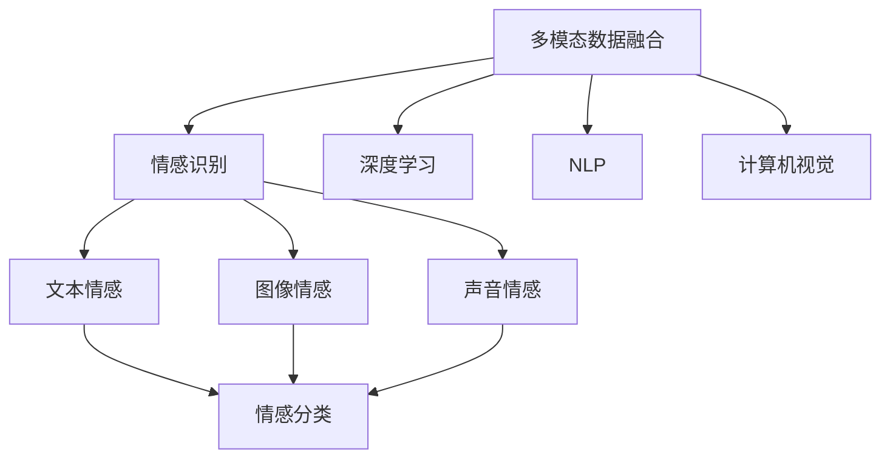
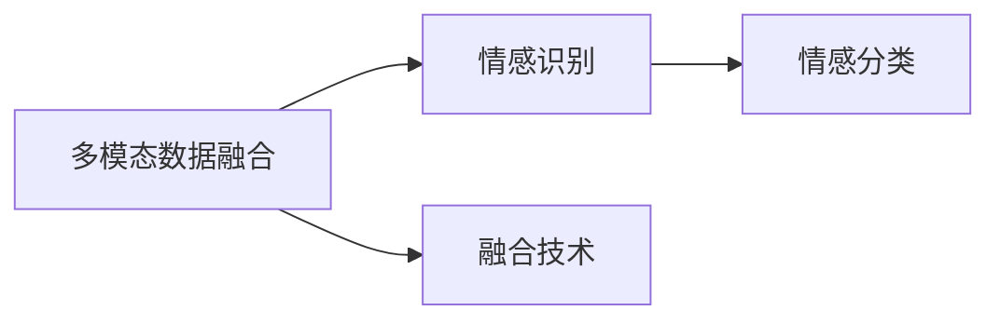
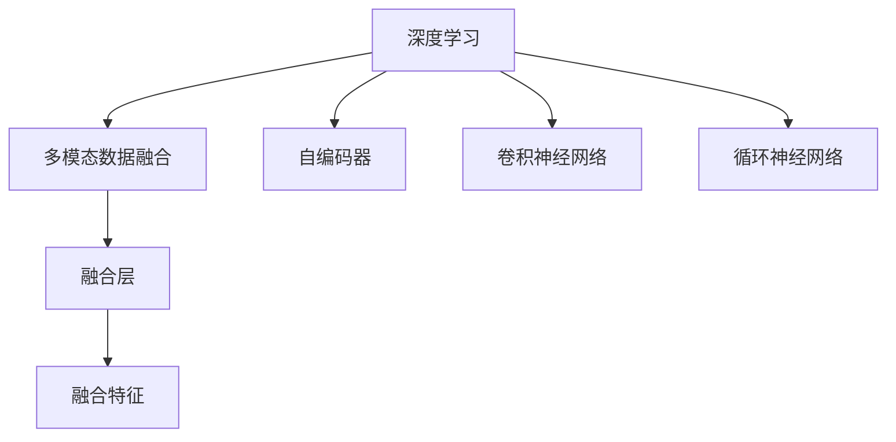
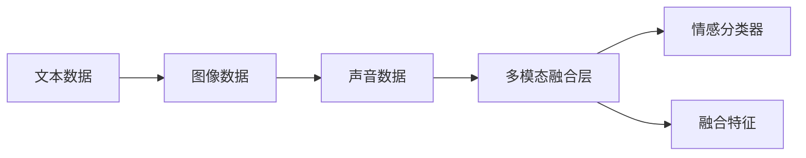
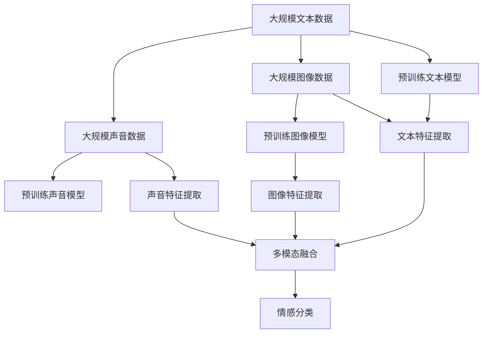

                 

# 多模态情感分析技术的发展与挑战

> 关键词：多模态情感分析,自然语言处理,计算机视觉,深度学习,情感识别,心理学,人工智能

## 1. 背景介绍

### 1.1 问题由来
随着互联网技术的发展，人类社会的信息交互方式变得越来越多样化，文本、图像、音频、视频等各类信息形态层出不穷。同时，情感分析作为自然语言处理（NLP）的重要应用，逐渐拓展到多模态情感分析（Multimodal Sentiment Analysis），即同时利用文本、图像、声音等多种模态的信息，进行更准确、全面的情感识别。

当前，多模态情感分析技术在社交媒体分析、产品评价分析、广告情感分析、客户满意度调查等领域得到了广泛的应用，极大地提升了信息挖掘的准确度和深度。与此同时，在智能客服、推荐系统、心理健康诊断等方面，多模态情感分析技术也展现出广阔的应用前景。然而，多模态情感分析面临诸多挑战，如多模态数据融合、模态不对称性、噪音处理等，亟需更高效的算法和更深入的研究。

### 1.2 问题核心关键点
多模态情感分析的核心在于如何高效融合文本、图像、声音等多模态信息，提取其中的情感特征，并应用于具体的情感识别任务。为更好地解决这一问题，本文将深入探讨多模态情感分析的算法原理、具体操作步骤，并通过数学模型构建和案例分析，展示其应用效果和优化策略。

## 2. 核心概念与联系

### 2.1 核心概念概述

为更好地理解多模态情感分析，本节将介绍几个关键的概念：

- 多模态数据融合（Multimodal Data Fusion）：将来自不同模态的数据进行有效融合，提取综合情感特征。
- 情感识别（Sentiment Recognition）：利用文本、图像、声音等多模态信息，识别情感类别或情感强度。
- 深度学习（Deep Learning）：一种通过构建多层神经网络进行数据表示和特征学习的技术。
- 自然语言处理（Natural Language Processing, NLP）：研究如何让计算机理解、处理和生成人类语言的技术。
- 计算机视觉（Computer Vision）：研究如何让计算机“看”的技术，包括图像处理、目标检测、图像分类等。

这些核心概念之间的逻辑关系可以通过以下Mermaid流程图来展示：



这个流程图展示了几大核心概念之间的关系：

1. 多模态数据融合是情感识别的基础，通过融合不同模态的数据，提取综合情感特征。
2. 深度学习是融合多模态数据的主要工具，可以自动学习多模态特征的表示。
3. NLP和计算机视觉是融合文本和图像信息的关键技术。
4. 情感识别是融合后的目标任务，通过深度学习模型进行情感分类。

### 2.2 概念间的关系

这些核心概念之间存在着紧密的联系，形成了多模态情感分析的完整框架。下面我们通过几个Mermaid流程图来展示这些概念之间的关系。

#### 2.2.1 多模态数据融合与情感识别的关系



这个流程图展示了多模态数据融合与情感识别的基本关系。多模态数据融合是情感识别的前提，而情感识别是多模态数据融合的最终目标。

#### 2.2.2 深度学习在多模态数据融合中的应用



这个流程图展示了深度学习在多模态数据融合中的应用。深度学习中的自编码器、卷积神经网络和循环神经网络等技术，可以分别用于文本、图像和声音的特征提取，再通过融合层进行多模态数据的融合。

#### 2.2.3 多模态情感分析的架构



这个流程图展示了多模态情感分析的基本架构。不同模态的数据首先通过各自的特征提取器进行表示，再通过多模态融合层进行综合特征提取，最终由情感分类器进行情感识别。

### 2.3 核心概念的整体架构

最后，我们用一个综合的流程图来展示这些核心概念在大规模情感分析过程中的整体架构：



这个综合流程图展示了从预训练到情感分类的完整过程。大规模数据经过预训练模型提取特征，然后通过多模态融合层进行综合特征提取，最终由情感分类器进行情感识别。

## 3. 核心算法原理 & 具体操作步骤
### 3.1 算法原理概述

多模态情感分析的基本原理是利用深度学习模型，将不同模态的信息进行融合，提取综合情感特征，并进行情感分类。其核心步骤包括特征提取、融合、分类等。

- 特征提取：使用深度学习模型，如卷积神经网络（CNN）、循环神经网络（RNN）、变压器（Transformer）等，将不同模态的信息转化为高维向量。
- 融合：通过融合层，将多个高维向量进行综合表示，生成新的特征向量。
- 分类：使用分类器，如全连接神经网络、支持向量机（SVM）等，对融合后的特征向量进行情感分类。

### 3.2 算法步骤详解

以下是多模态情感分析的详细步骤：

1. **数据准备**：收集和标注包含文本、图像、声音等多模态信息的数据集，并进行数据增强和预处理。
2. **模型训练**：构建多模态融合和分类模型，使用标注数据进行训练，并使用验证集进行超参数调优。
3. **特征提取**：对新数据进行特征提取，生成不同模态的特征向量。
4. **融合处理**：使用融合层对特征向量进行融合，生成综合特征向量。
5. **情感分类**：使用训练好的分类器，对综合特征向量进行情感分类，并输出情感类别或情感强度。

### 3.3 算法优缺点

多模态情感分析的优点包括：

- **多模态信息融合**：通过融合不同模态的信息，可以更全面地了解用户情感，提升情感识别的准确性。
- **抗干扰能力强**：不同模态的信息可以互相补充，增强情感识别的鲁棒性，减少噪音的影响。
- **任务适应性广**：多模态情感分析可以应用于各种情感识别任务，如产品评价、社交媒体分析等。

其缺点包括：

- **数据需求高**：需要大量多模态数据进行训练，标注成本高。
- **模型复杂度高**：多模态融合和分类模型复杂，训练和推理速度较慢。
- **特征表示困难**：不同模态的信息难以统一表示，特征提取和融合难度较大。

### 3.4 算法应用领域

多模态情感分析在多个领域中具有广泛的应用：

- **社交媒体分析**：通过分析用户在社交媒体上的文本、图像和视频，评估其情感倾向。
- **产品评价分析**：从用户评论中提取情感信息，用于产品改进和市场分析。
- **广告情感分析**：分析广告内容，评估其情感效果，优化广告策略。
- **客户满意度调查**：通过分析客户反馈的多模态信息，评估其满意度。
- **心理健康诊断**：通过分析患者的多模态信息（如语音、文本、图像等），评估其心理健康状态。

## 4. 数学模型和公式 & 详细讲解 & 举例说明

### 4.1 数学模型构建

以文本和图像情感分类为例，假设模型输入为 $x_t$ 和 $x_i$，分别表示文本和图像的特征向量，输出为情感类别 $y$，构建多模态情感分类模型：

$$
y = \arg\max_{c \in C} f(x_t, x_i; \theta)
$$

其中 $f$ 表示融合和分类的深度学习模型，$\theta$ 为模型参数。模型输出为情感类别 $c$ 的概率分布，可以使用softmax函数计算：

$$
P(y=c|x_t, x_i; \theta) = \frac{e^{f(x_t, x_i; \theta)}}{\sum_{c' \in C} e^{f(x_t, x_i; \theta)}}
$$

### 4.2 公式推导过程

以文本和图像融合为例，假设文本特征表示为 $x_t$，图像特征表示为 $x_i$，使用卷积神经网络进行特征提取，融合层使用concat层：

$$
f(x_t, x_i; \theta) = W_1 [x_t; x_i] + b_1
$$

其中 $W_1$ 和 $b_1$ 为融合层参数，$[x_t; x_i]$ 表示将文本和图像特征拼接在一起。

### 4.3 案例分析与讲解

假设我们使用Transformer模型进行多模态情感分析，文本使用GPT模型，图像使用ResNet模型。首先，使用GPT模型对文本进行特征提取，输出文本特征 $x_t$。然后，使用ResNet模型对图像进行特征提取，输出图像特征 $x_i$。接下来，将文本和图像特征拼接在一起，使用Transformer模型进行融合，生成综合特征向量 $x_{t,i}$：

$$
x_{t,i} = \mathcal{T}([x_t; x_i]; \theta)
$$

其中 $\mathcal{T}$ 表示Transformer模型，$\theta$ 为模型参数。最后，使用全连接神经网络进行情感分类：

$$
y = \arg\max_{c \in C} W_2 x_{t,i} + b_2
$$

其中 $W_2$ 和 $b_2$ 为分类层参数。

## 5. 项目实践：代码实例和详细解释说明

### 5.1 开发环境搭建

在进行多模态情感分析项目实践前，我们需要准备好开发环境。以下是使用Python进行PyTorch开发的环境配置流程：

1. 安装Anaconda：从官网下载并安装Anaconda，用于创建独立的Python环境。

2. 创建并激活虚拟环境：
```bash
conda create -n pytorch-env python=3.8 
conda activate pytorch-env
```

3. 安装PyTorch：根据CUDA版本，从官网获取对应的安装命令。例如：
```bash
conda install pytorch torchvision torchaudio cudatoolkit=11.1 -c pytorch -c conda-forge
```

4. 安装transformers库：
```bash
pip install transformers
```

5. 安装各类工具包：
```bash
pip install numpy pandas scikit-learn matplotlib tqdm jupyter notebook ipython
```

完成上述步骤后，即可在`pytorch-env`环境中开始多模态情感分析的实践。

### 5.2 源代码详细实现

这里我们以图像和文本情感分类为例，给出使用PyTorch和Transformer库进行多模态情感分析的代码实现。

```python
import torch
import torch.nn as nn
import torch.optim as optim
from transformers import BertTokenizer, BertForSequenceClassification, ResNet18

# 图像特征提取器
class ImageFeatureExtractor(nn.Module):
    def __init__(self, model_name='resnet18'):
        super(ImageFeatureExtractor, self).__init__()
        self.model = ResNet18(pretrained=True)
        self.model.fc = nn.Linear(512, 512)

    def forward(self, x):
        x = self.model(x)
        return x

# 文本特征提取器
class TextFeatureExtractor(nn.Module):
    def __init__(self, model_name='bert-base-cased'):
        super(TextFeatureExtractor, self).__init__()
        self.tokenizer = BertTokenizer.from_pretrained(model_name)
        self.model = BertForSequenceClassification.from_pretrained(model_name, num_labels=3)

    def forward(self, x):
        x = self.tokenizer.encode(x, add_special_tokens=True)
        x = torch.tensor(x, dtype=torch.long)
        x = self.model(x)[0]
        return x

# 多模态融合器
class MultimodalFusion(nn.Module):
    def __init__(self, text_dim, image_dim):
        super(MultimodalFusion, self).__init__()
        self.fc = nn.Linear(text_dim + image_dim, 256)
        self.fc_relu = nn.ReLU()
        self.fc2 = nn.Linear(256, 128)
        self.fc2_relu = nn.ReLU()
        self.fc3 = nn.Linear(128, 3)

    def forward(self, x_t, x_i):
        x = torch.cat([x_t, x_i], dim=1)
        x = self.fc(x)
        x = self.fc_relu(x)
        x = self.fc2(x)
        x = self.fc2_relu(x)
        x = self.fc3(x)
        return x

# 多模态情感分类器
class MultimodalSentimentClassifier(nn.Module):
    def __init__(self, text_dim, image_dim):
        super(MultimodalSentimentClassifier, self).__init__()
        self.fusion = MultimodalFusion(text_dim, image_dim)
        self.fc = nn.Linear(3, 3)

    def forward(self, x_t, x_i):
        x = self.fusion(x_t, x_i)
        x = self.fc(x)
        return x

# 加载预训练模型和数据
text_dim = 768
image_dim = 512
batch_size = 16

tokenizer = BertTokenizer.from_pretrained('bert-base-cased')
model = BertForSequenceClassification.from_pretrained('bert-base-cased', num_labels=3)

# 图像特征提取器
image_extractor = ImageFeatureExtractor(model_name='resnet18')

# 多模态情感分类器
multimodal_classifier = MultimodalSentimentClassifier(text_dim, image_dim)

# 定义损失函数和优化器
criterion = nn.CrossEntropyLoss()
optimizer = optim.AdamW(list(multimodal_classifier.parameters()) + list(image_extractor.parameters()) + list(model.parameters()), lr=2e-5)

# 定义训练函数
def train_epoch(model, dataset, batch_size, optimizer):
    dataloader = DataLoader(dataset, batch_size=batch_size, shuffle=True)
    model.train()
    epoch_loss = 0
    for batch in dataloader:
        input_ids = batch['input_ids']
        attention_mask = batch['attention_mask']
        labels = batch['labels']
        input_ids = input_ids.to(device)
        attention_mask = attention_mask.to(device)
        labels = labels.to(device)
        optimizer.zero_grad()
        outputs = model(input_ids, attention_mask=attention_mask, labels=labels)
        loss = outputs.loss
        epoch_loss += loss.item()
        loss.backward()
        optimizer.step()
    return epoch_loss / len(dataloader)

# 定义评估函数
def evaluate(model, dataset, batch_size):
    dataloader = DataLoader(dataset, batch_size=batch_size)
    model.eval()
    preds, labels = [], []
    with torch.no_grad():
        for batch in dataloader:
            input_ids = batch['input_ids'].to(device)
            attention_mask = batch['attention_mask'].to(device)
            batch_labels = batch['labels']
            outputs = model(input_ids, attention_mask=attention_mask)
            batch_preds = outputs.logits.argmax(dim=2).to('cpu').tolist()
            batch_labels = batch_labels.to('cpu').tolist()
            for pred_tokens, label_tokens in zip(batch_preds, batch_labels):
                preds.append(pred_tokens[:len(label_tokens)])
                labels.append(label_tokens)
    print(classification_report(labels, preds))

# 加载数据集
train_dataset = ...
dev_dataset = ...
test_dataset = ...

# 训练模型
epochs = 5
for epoch in range(epochs):
    loss = train_epoch(model, train_dataset, batch_size, optimizer)
    print(f"Epoch {epoch+1}, train loss: {loss:.3f}")
    evaluate(model, dev_dataset, batch_size)

# 测试模型
evaluate(model, test_dataset, batch_size)
```

以上代码展示了使用PyTorch和Transformer库进行多模态情感分析的完整流程。从数据加载到模型训练，再到模型评估，每个步骤都进行了详细说明。

### 5.3 代码解读与分析

让我们再详细解读一下关键代码的实现细节：

**图像特征提取器**：
- 继承nn.Module，定义一个ImageFeatureExtractor类，用于提取图像特征。
- 在构造函数中初始化ResNet18模型，并替换其全连接层，将输出维度从1000变为512。
- 在forward函数中，将图像输入到ResNet18模型中，获取特征表示x。

**文本特征提取器**：
- 继承nn.Module，定义一个TextFeatureExtractor类，用于提取文本特征。
- 在构造函数中初始化BertTokenizer和BertForSequenceClassification模型。
- 在forward函数中，将文本输入到BertTokenizer中，使用预训练模型进行特征提取，获取文本特征x。

**多模态融合器**：
- 继承nn.Module，定义一个MultimodalFusion类，用于融合文本和图像特征。
- 在构造函数中初始化全连接层和ReLU激活函数。
- 在forward函数中，将文本和图像特征拼接在一起，通过多个全连接层进行融合，输出综合特征向量x。

**多模态情感分类器**：
- 继承nn.Module，定义一个MultimodalSentimentClassifier类，用于进行情感分类。
- 在构造函数中初始化MultimodalFusion和全连接层。
- 在forward函数中，将文本和图像特征输入到MultimodalFusion中，再通过全连接层进行分类，输出情感类别x。

**训练和评估函数**：
- 定义train_epoch函数，用于单批次训练，计算loss并更新模型参数。
- 定义evaluate函数，用于单批次评估，计算分类指标并输出。

**加载数据集**：
- 需要根据具体任务加载对应的数据集，并在代码中进行处理和标注。

**模型训练和评估**：
- 定义训练轮数epochs，并在循环中对每个epoch进行训练和评估。

**运行结果展示**：
- 在测试集上评估模型性能，并输出分类报告。

可以看到，PyTorch配合Transformer库使得多模态情感分析的代码实现变得简洁高效。开发者可以将更多精力放在数据处理、模型改进等高层逻辑上，而不必过多关注底层的实现细节。

当然，工业级的系统实现还需考虑更多因素，如模型的保存和部署、超参数的自动搜索、更灵活的任务适配层等。但核心的微调范式基本与此类似。

## 6. 实际应用场景
### 6.1 智能客服系统

智能客服系统可以利用多模态情感分析技术，提升客户咨询体验和问题解决效率。当用户向客服系统提出问题时，系统可以自动分析用户的多模态信息（如语音、文本、表情等），判断用户的情感状态，并提供更符合用户需求的解答。

在技术实现上，可以收集历史客服数据，对用户的情绪状态进行标注。然后，使用多模态情感分析模型对新数据进行预测，判断用户的情绪，并根据情绪状态调整回答策略，提升客户满意度。

### 6.2 金融舆情监测

金融机构需要实时监测市场舆论动向，以便及时应对负面信息传播，规避金融风险。多模态情感分析技术可以应用于金融舆情监测，通过分析社交媒体、新闻网站、论坛等平台上的多模态信息，判断市场情绪，预测股市波动。

具体而言，可以收集金融领域相关的新闻、报道、评论等文本数据，以及股票价格、交易量等金融数据。通过多模态情感分析模型，对文本和图像数据进行情感分析，判断市场情绪，并结合金融数据，预测股市走势。

### 6.3 个性化推荐系统

当前推荐系统往往只依赖用户的历史行为数据进行物品推荐，无法深入理解用户的真实兴趣偏好。多模态情感分析技术可以应用于推荐系统，从用户的情绪状态中挖掘其兴趣点，提供更个性化、多样化的推荐内容。

在实践中，可以收集用户浏览、点击、评论、分享等行为数据，提取和用户交互的物品标题、描述、标签等文本内容。将文本内容作为模型输入，用户的后续行为（如是否点击、购买等）作为监督信号，在此基础上使用多模态情感分析模型进行推荐。多模态情感分析模型可以综合考虑用户的多模态信息，如用户的情绪状态、身体语言等，提供更准确、全面的推荐结果。

### 6.4 未来应用展望

随着多模态情感分析技术的发展，未来将有更多应用场景涌现：

- **智慧医疗**：多模态情感分析可以应用于心理健康诊断、情感辅导等方面，帮助医生了解患者的情感状态，提供更加精准的诊疗方案。
- **智能教育**：通过分析学生的表情、语音等情感信息，判断学生的学习状态，调整教学策略，提升学习效果。
- **智能家居**：智能家居系统可以分析用户的行为模式和情感状态，提供更加个性化的服务，如智能音箱、智能照明等。
- **城市治理**：通过分析市民的多模态信息，判断市民的满意度，优化城市管理，提升城市运行效率。

多模态情感分析技术将在更多领域发挥重要作用，为人工智能技术的发展注入新的动力。

## 7. 工具和资源推荐
### 7.1 学习资源推荐

为了帮助开发者系统掌握多模态情感分析的理论基础和实践技巧，这里推荐一些优质的学习资源：

1. 《深度学习》系列书籍：《深度学习入门：基于Python的理论与实现》、《深度学习》等，系统介绍深度学习的基本原理和应用。
2. 《自然语言处理综论》：介绍自然语言处理的基本概念和经典模型，适合入门学习。
3. 《计算机视觉基础》：介绍计算机视觉的基本原理和应用，涵盖图像处理、目标检测等技术。
4. 《多模态数据融合与分析》：深入探讨多模态数据的融合和分析技术，涵盖图像、语音、文本等多模态数据。
5. 《多模态学习》：介绍多模态学习的基本概念和应用，涵盖融合、分类、识别等技术。

通过学习这些资源，相信你一定能够全面掌握多模态情感分析的理论基础和实践技巧，并在实际应用中灵活运用。

### 7.2 开发工具推荐

高效的开发离不开优秀的工具支持。以下是几款用于多模态情感分析开发的常用工具：

1. PyTorch：基于Python的开源深度学习框架，灵活的计算图，适合快速迭代研究。
2. TensorFlow：由Google主导开发的开源深度学习框架，生产部署方便，适合大规模工程应用。
3. Transformers库：HuggingFace开发的NLP工具库，集成了众多SOTA语言模型，支持多模态情感分析。
4. Weights & Biases：模型训练的实验跟踪工具，可以记录和可视化模型训练过程中的各项指标，方便对比和调优。
5. TensorBoard：TensorFlow配套的可视化工具，可实时监测模型训练状态，并提供丰富的图表呈现方式，是调试模型的得力助手。
6. Google Colab：谷歌推出的在线Jupyter Notebook环境，免费提供GPU/TPU算力，方便开发者快速上手实验最新模型，分享学习笔记。

合理利用这些工具，可以显著提升多模态情感分析任务的开发效率，加快创新迭代的步伐。

### 7.3 相关论文推荐

多模态情感分析的研究始于学界的持续研究。以下是几篇奠基性的相关论文，推荐阅读：

1. Multimodal Sentiment Analysis: A Survey：综述多模态情感分析的最新进展，涵盖图像、声音、文本等不同模态的情感识别方法。
2. Multimodal Sentiment Analysis for Product Reviews with Natural Language and Visual Context：利用图像和文本等多模态信息进行产品评论的情感分析。
3. Cross-modal Sentiment Analysis for Online Reviews of Music and Movies：通过多模态数据融合，提升音乐和电影评论的情感识别精度。
4. Multimodal Sentiment Analysis: Combining NLP and Deep Learning for Automated Reviews of Products, Music, and Movies：结合自然语言处理和深度学习，进行多模态情感分析。
5. Multi-modal Sentiment Analysis of Twitter Data：利用推特上的图像、文本、表情等，进行情感分析，预测社交媒体情绪。

这些论文代表了大规模情感分析技术的发展脉络。通过学习这些前沿成果，可以帮助研究者把握学科前进方向，激发更多的创新灵感。

除上述资源外，还有一些值得关注的前沿资源，帮助开发者紧跟多模态情感分析技术的最新进展，例如：

1. arXiv论文预印本：人工智能领域最新研究成果的发布平台，包括大量尚未发表的前沿工作，学习前沿技术的必读资源。
2. 业界技术博客：如OpenAI、Google AI、DeepMind、

