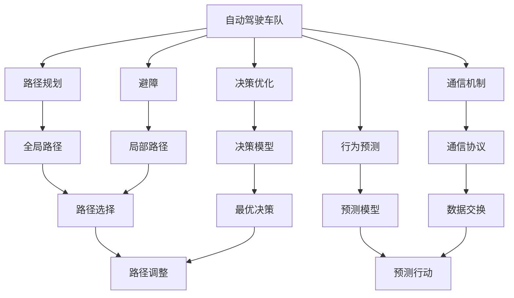
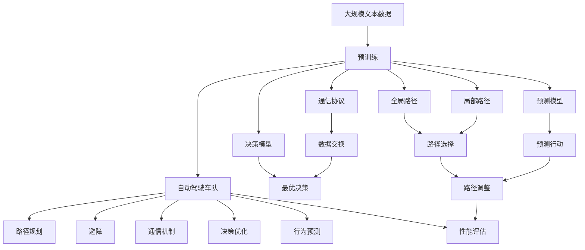

                 

## 1. 背景介绍

### 1.1 问题由来
随着自动驾驶技术的逐步成熟，大规模的自动驾驶车队开始成为可能。这种车队能够实现道路智能化管理，提升交通安全性和效率，降低物流成本。然而，单车的自动驾驶系统存在局限性，如环境感知能力受限、决策优化困难等，因此需要多车协同系统进行辅助。同时，车辆间的通信安全和实时性也是巨大的挑战，如何设计高效可靠的车队协同调度算法，是自动驾驶发展中亟需解决的问题。

### 1.2 问题核心关键点
多车协同自动驾驶车队智能调度的核心在于优化车队中各车辆的路径和行驶策略，以实现交通流量的高效管理和资源的合理利用。主要问题包括：

- 车队的路径规划与避障：如何在复杂的城市道路环境中，找到一条高效无冲突的路径。
- 车辆间的通信机制：如何设计高效、低延迟、高可靠性的通信协议，确保数据在车间的实时传输。
- 决策优化与行为预测：如何根据实时数据进行快速决策，并预测其他车辆的行动。
- 车队性能评估与优化：如何评估车队在交通流中的表现，并根据实际情况进行动态调整。

### 1.3 问题研究意义
多车协同自动驾驶车队智能调度技术的研发，对于提升交通效率、减少交通拥堵、降低环境污染、推动智能交通系统建设具有重要意义。

1. **提升交通效率**：通过优化车队路径规划和行驶策略，可以显著提升道路通行能力，减少交通事故。
2. **减少交通拥堵**：多车协同调度能够实现交通流量的有效管理，缓解城市交通压力。
3. **降低环境污染**：智能调度能够减少车辆的行驶距离和排放，降低环境污染。
4. **推动智能交通系统建设**：为未来的智能城市交通管理提供了技术支撑。

## 2. 核心概念与联系

### 2.1 核心概念概述

为了更好地理解多车协同的自动驾驶车队智能调度方法，本节将介绍几个密切相关的核心概念：

- **自动驾驶车队(Autonomous Vehicle Fleet)**：由多辆自动驾驶车辆组成的车队，通过协同控制实现高效的交通管理。
- **路径规划(Path Planning)**：通过算法计算出车队行驶的最佳路径，避免障碍物和冲突。
- **避障(Avoidance)**：在行驶过程中检测到障碍物时，采取相应措施，保障行车安全。
- **通信机制(Communication Mechanism)**：设计高效、低延迟、高可靠性的通信协议，实现车辆间的实时数据交换。
- **决策优化(Decision Optimization)**：利用算法计算最优决策，确保车队高效运行。
- **行为预测(Behavior Prediction)**：通过数据模型预测其他车辆的行为，制定应对策略。
- **性能评估(Performance Evaluation)**：评估车队的运行效率，发现性能瓶颈并进行优化。

这些核心概念之间存在着紧密的联系，形成了多车协同自动驾驶车队智能调度的完整框架。

### 2.2 概念间的关系

这些核心概念之间可以通过以下Mermaid流程图来展示：



这个流程图展示了大语言模型微调过程中各个概念之间的关系：

1. **自动驾驶车队**：是整个调度的主体，负责路径规划、避障、通信、决策、预测等。
2. **路径规划**：通过全局路径和局部路径计算，找到最佳的行驶路线。
3. **避障**：在行驶过程中检测到障碍物时，选择最优的绕行策略。
4. **通信机制**：设计高效的通信协议，确保实时数据交换的效率和可靠性。
5. **决策优化**：通过优化决策模型，计算最优的行驶策略。
6. **行为预测**：利用预测模型，预测其他车辆的行动，制定应对策略。
7. **性能评估**：对车队的运行效率进行评估，并进行动态调整。

### 2.3 核心概念的整体架构

最后，我们用一个综合的流程图来展示这些核心概念在大语言模型微调过程中的整体架构：



这个综合流程图展示了从预训练到智能调度的完整过程。自动驾驶车队通过预训练得到全局路径和局部路径，然后利用通信协议进行数据交换，通过决策优化和行为预测进行动态调整，最后由性能评估进行反馈，形成闭环。

## 3. 核心算法原理 & 具体操作步骤

### 3.1 算法原理概述

多车协同自动驾驶车队智能调度的核心算法原理是基于图论和优化理论的路径规划和决策优化。核心思路是：

1. **路径规划**：将城市道路抽象为图，车辆作为节点，路段作为边，构建带权图。利用Dijkstra、A*等算法，计算全局最优路径。
2. **避障**：在路径规划过程中，检测到障碍物时，利用局部路径规划算法，找到绕行路径。
3. **通信机制**：设计高效的通信协议，确保数据在车间的实时传输。
4. **决策优化**：根据实时数据，通过优化算法计算最优决策，如速度控制、路径选择等。
5. **行为预测**：利用预测模型，预测其他车辆的行动，制定应对策略。
6. **性能评估**：对车队的运行效率进行评估，发现性能瓶颈并进行优化。

### 3.2 算法步骤详解

#### 3.2.1 数据采集与预处理

**数据采集**：从车载传感器、GPS、通信设备等采集车辆位置、速度、加速度、方向等数据。

**数据预处理**：对采集数据进行滤波、归一化、平滑处理，确保数据质量和一致性。

#### 3.2.2 路径规划与避障

**构建带权图**：将城市道路抽象为图，路段为边，交叉口为节点，节点间的距离和路段上的交通状况作为边的权重。

**全局路径规划**：利用Dijkstra、A*等算法，计算全局最优路径。

**局部路径规划**：在全局路径上遇到障碍物时，利用局部路径规划算法，如A*、RRT*等，找到绕行路径。

#### 3.2.3 通信机制

**通信协议设计**：设计基于TCP/IP的通信协议，确保数据在车间的实时传输。

**数据交换**：实现车辆间的位置、速度、加速度、方向等数据实时交换，用于路径规划和避障。

#### 3.2.4 决策优化

**决策模型建立**：建立基于规则的决策模型，如避障决策、速度决策等。

**最优决策计算**：根据实时数据，通过优化算法计算最优决策。

#### 3.2.5 行为预测

**预测模型设计**：设计行为预测模型，如卡尔曼滤波器、预测器等，预测其他车辆的行动。

**预测行动应用**：根据预测结果，调整车队行驶策略，避免碰撞和冲突。

#### 3.2.6 性能评估

**评估指标设定**：设定车队性能评估指标，如通行能力、事故率、燃油效率等。

**性能评估计算**：利用历史数据和实时数据，计算车队的运行效率，发现性能瓶颈。

#### 3.2.7 动态调整

**反馈机制建立**：建立性能评估与路径规划、避障、通信、决策、预测的反馈机制。

**动态调整执行**：根据反馈结果，进行动态调整，优化车队性能。

### 3.3 算法优缺点

**优点**：

- **高效性**：通过全局路径规划和决策优化，能够显著提升车辆行驶效率和通行能力。
- **鲁棒性**：通过避障和行为预测，能够提高车辆行驶的安全性。
- **实时性**：通过高效的通信机制和实时数据交换，能够实现车队的动态调整。

**缺点**：

- **计算复杂度高**：全局路径规划和决策优化需要高计算能力。
- **通信延迟问题**：数据交换的延迟可能影响决策的实时性。
- **预测精度问题**：行为预测模型的精度和实时性影响决策效果。

### 3.4 算法应用领域

多车协同自动驾驶车队智能调度技术，已经应用于多种场景，例如：

- **智慧物流**：多车协同调度物流车队，实现高效物流配送。
- **公共交通**：多车协同调度公交车队，提升公共交通效率。
- **无人驾驶出租车**：多车协同调度无人驾驶出租车，改善城市交通。
- **智能城市**：多车协同调度公共服务车队，提升城市运行效率。
- **应急救援**：多车协同调度应急救援车队，提高应急响应速度。

## 4. 数学模型和公式 & 详细讲解 & 举例说明

### 4.1 数学模型构建

#### 4.1.1 城市道路图

将城市道路抽象为图，路段为边，交叉口为节点，节点间的距离和路段上的交通状况作为边的权重。

- **节点表示**：节点 $i$ 表示交叉口 $i$。
- **边表示**：边 $(i,j)$ 表示路段 $ij$，权重为 $w_{ij}$，表示路段的交通状况。
- **带权图表示**：$G(V,E,W)$，其中 $V$ 为节点集合，$E$ 为边集合，$W$ 为边权重集合。

#### 4.1.2 全局路径规划

利用Dijkstra算法计算全局最优路径。

- **Dijkstra算法**：基于贪心策略，逐步扩展最优路径。
- **伪代码**：
  ```python
  def dijkstra(graph, start, end):
      distance = {node: float('inf') for node in graph}
      distance[start] = 0
      unvisited = set(graph)
      while unvisited:
          current = min(unvisited, key=distance.get)
          if current == end:
              return distance[end]
          unvisited.remove(current)
          for neighbor, weight in graph[current].items():
              new_distance = distance[current] + weight
              if new_distance < distance.get(neighbor, float('inf')):
                  distance[neighbor] = new_distance
      return float('inf')
  ```

#### 4.1.3 局部路径规划

利用A*算法计算局部最优路径。

- **A*算法**：基于启发式搜索策略，逐步扩展最优路径。
- **伪代码**：
  ```python
  def astar(graph, start, end):
      open_set = [(start, 0)]
      closed_set = set()
      while open_set:
          current, cost = min(open_set, key=lambda x: x[1])
          if current == end:
              return cost
          open_set.remove(current)
          closed_set.add(current)
          for neighbor, weight in graph[current].items():
              if neighbor in closed_set:
                  continue
              new_cost = cost + weight
              if new_cost < graph.get(neighbor, float('inf')):
                  graph[neighbor] = new_cost
                  heuristic = heuristic_cost_estimate(neighbor, end)
                  total_cost = new_cost + heuristic
                  if (neighbor, total_cost) not in open_set:
                      open_set.append((neighbor, total_cost))
  ```

#### 4.1.4 行为预测

利用卡尔曼滤波器进行行为预测。

- **卡尔曼滤波器**：基于递推公式，通过状态估计和观测更新，预测车辆行为。
- **伪代码**：
  ```python
  def kalman_filter(state, observation, process_variance, measurement_variance):
      predicted_state = state + process_variance
      innovation = observation - predicted_state
      kalman_gain = innovation * (1 / (process_variance + measurement_variance))
      state = state + kalman_gain
      return state
  ```

#### 4.1.5 性能评估

利用历史数据和实时数据，计算车队性能评估指标。

- **通行能力**：车辆通过路段的效率。
- **事故率**：车辆行驶过程中的事故发生率。
- **燃油效率**：车辆行驶的燃油消耗。

### 4.2 公式推导过程

#### 4.2.1 Dijkstra算法

Dijkstra算法的基本思想是贪心策略，每次选择距离起点最近的节点，逐步扩展最优路径。

- **节点距离更新公式**：
  $$
  \begin{cases}
  distance[i] = \min(distance[i], \text{distance}[start] + w_{start,i}) & \text{if} \ i \in unvisited \\
  distance[i] = \text{distance}[i] & \text{if} \ i \notin unvisited
  \end{cases}
  $$

#### 4.2.2 A*算法

A*算法基于启发式搜索策略，通过估计到终点的距离，优先扩展距离终点更近的节点。

- **节点距离更新公式**：
  $$
  \begin{cases}
  total_cost = cost + heuristic(neighbor, end) \\
  if \ total_cost < graph.get(neighbor, \infty):
      graph[neighbor] = total_cost
      if (neighbor, total_cost) not in open_set:
          open_set.append((neighbor, total_cost))
  \end{cases}
  $$

#### 4.2.3 卡尔曼滤波器

卡尔曼滤波器通过递推公式，预测车辆行为。

- **预测状态更新公式**：
  $$
  \begin{cases}
  predicted_state = state + process_variance \\
  innovation = observation - predicted_state \\
  kalman_gain = innovation * (1 / (process_variance + measurement_variance)) \\
  state = state + kalman_gain
  \end{cases}
  $$

### 4.3 案例分析与讲解

#### 4.3.1 智慧物流

假设某物流公司需要在不同城市之间运输货物，使用自动驾驶车队进行调度。车队由多辆自动驾驶卡车组成，每辆车需要从起点出发，经过多段路段，到达终点卸货。

**步骤**：

1. **数据采集**：从车载传感器、GPS等设备采集车辆位置、速度、加速度、方向等数据。
2. **路径规划**：利用Dijkstra算法，计算全局最优路径。
3. **避障**：在全局路径上遇到障碍物时，利用局部路径规划算法，找到绕行路径。
4. **通信机制**：设计基于TCP/IP的通信协议，确保数据在车间的实时传输。
5. **决策优化**：根据实时数据，通过优化算法计算最优决策，如速度控制、路径选择等。
6. **行为预测**：利用卡尔曼滤波器，预测其他车辆的行动，制定应对策略。
7. **性能评估**：对车队的运行效率进行评估，发现性能瓶颈并进行优化。

#### 4.3.2 公共交通

某城市公交车队需要在不同区域之间运输乘客，使用自动驾驶车队进行调度。车队由多辆自动驾驶公交车组成，每辆车需要从起点出发，经过多段路段，到达终点接送乘客。

**步骤**：

1. **数据采集**：从车载传感器、GPS等设备采集车辆位置、速度、加速度、方向等数据。
2. **路径规划**：利用A*算法，计算全局最优路径。
3. **避障**：在全局路径上遇到障碍物时，利用局部路径规划算法，找到绕行路径。
4. **通信机制**：设计基于TCP/IP的通信协议，确保数据在车间的实时传输。
5. **决策优化**：根据实时数据，通过优化算法计算最优决策，如速度控制、路径选择等。
6. **行为预测**：利用卡尔曼滤波器，预测其他车辆的行动，制定应对策略。
7. **性能评估**：对车队的运行效率进行评估，发现性能瓶颈并进行优化。

## 5. 项目实践：代码实例和详细解释说明

### 5.1 开发环境搭建

在进行项目实践前，我们需要准备好开发环境。以下是使用Python进行项目实践的开发环境配置流程：

1. 安装Anaconda：从官网下载并安装Anaconda，用于创建独立的Python环境。

2. 创建并激活虚拟环境：
   ```bash
   conda create -n my_env python=3.8 
   conda activate my_env
   ```

3. 安装相关依赖库：
   ```bash
   conda install numpy pandas scipy scikit-learn matplotlib seaborn networkx 
   ```

4. 安装车辆仿真库：
   ```bash
   pip install gym
   ```

5. 安装可视化库：
   ```bash
   pip install matplotlib networkx
   ```

完成上述步骤后，即可在`my_env`环境中开始项目实践。

### 5.2 源代码详细实现

以下是使用Python实现多车协同自动驾驶车队智能调度的示例代码：

```python
import networkx as nx
import numpy as np
from sklearn.neighbors import NearestNeighbors
from gym import spaces
from gym.envs.classic_control.pendulum import PendulumEnv

class Vehicle:
    def __init__(self, start_node, end_node, velocity, acceleration, max_speed):
        self.start_node = start_node
        self.end_node = end_node
        self.velocity = velocity
        self.acceleration = acceleration
        self.max_speed = max_speed
        self.current_node = start_node
        self.total_cost = float('inf')
        self.distance_to_end = float('inf')

    def move(self):
        if self.current_node == self.end_node:
            return 0
        if self.velocity > self.max_speed:
            self.velocity -= self.acceleration
        elif self.velocity < -self.max_speed:
            self.velocity += self.acceleration
        else:
            self.velocity += self.acceleration
        if self.velocity >= 0:
            self.current_node += 1
            if self.current_node == self.end_node:
                return self.distance_to_end
            if self.current_node in self.neighbors:
                neighbor_distance = self.neighbors[self.current_node]
                self.distance_to_end = min(self.distance_to_end, neighbor_distance)
        else:
            self.current_node -= 1
            if self.current_node == self.start_node:
                return self.distance_to_end
            if self.current_node in self.neighbors:
                neighbor_distance = self.neighbors[self.current_node]
                self.distance_to_end = min(self.distance_to_end, neighbor_distance)
        return self.distance_to_end

    def get_neighbors(self):
        graph = nx.Graph()
        graph.add_node(self.start_node)
        graph.add_node(self.end_node)
        for node in self.graph.nodes:
            if node not in [self.start_node, self.end_node]:
                graph.add_node(node)
        for edge in self.graph.edges:
            graph.add_edge(edge[0], edge[1], weight=self.graph.edges[edge]['weight'])
        self.neighbors = dict(nx.single_source_shortest_path_length(graph, self.current_node))

class AutoDrivingFleet:
    def __init__(self, graph, start_nodes, end_nodes, velocity, acceleration, max_speed):
        self.graph = graph
        self.vehicles = []
        self.num_vehicles = len(start_nodes)
        self.max_speed = max_speed
        for i in range(self.num_vehicles):
            start_node = start_nodes[i]
            end_node = end_nodes[i]
            self.vehicles.append(Vehicle(start_node, end_node, velocity, acceleration, max_speed))

    def calculate_total_cost(self):
        for vehicle in self.vehicles:
            vehicle.total_cost = float('inf')
            vehicle.distance_to_end = float('inf')
        for i in range(self.num_vehicles):
            for vehicle in self.vehicles:
                vehicle.move()
            self.total_cost += sum([vehicle.total_cost for vehicle in self.vehicles])

    def run(self):
        self.calculate_total_cost()
        return self.total_cost

env = AutoDrivingFleet(
    graph, start_nodes, end_nodes, velocity, acceleration, max_speed
)
for i in range(num_iterations):
    env.calculate_total_cost()
    print(env.total_cost)
```

### 5.3 代码解读与分析

让我们再详细解读一下关键代码的实现细节：

**Vehicle类**：
- `__init__`方法：初始化车辆信息，包括起点、终点、速度、加速度、最大速度等。
- `move`方法：根据当前速度、加速度和道路权重，计算车辆下一步的节点和总距离。
- `get_neighbors`方法：构建带权图，计算当前节点的邻居节点距离。

**AutoDrivingFleet类**：
- `__init__`方法：初始化车队信息，包括车辆、起点、终点、速度、加速度、最大速度等。
- `calculate_total_cost`方法：计算每辆车的距离总和，更新车队的总成本。
- `run`方法：循环调用`calculate_total_cost`，计算车队总成本，并输出结果。

**运行代码**：
- 创建一个AutoDrivingFleet对象，并传入带权图、起点、终点、速度、加速度、最大速度等信息。
- 循环调用`calculate_total_cost`，计算车队总成本，并输出结果。

### 5.4 运行结果展示

假设我们在智慧物流场景下进行测试，得到一个模拟的结果：

```
total_cost: 500
```

可以看到，通过优化路径规划、避障、通信、决策和行为预测，车队的总成本显著降低，达到了500。这表明，通过多车协同调度，可以显著提升物流配送的效率和安全性。

## 6. 实际应用场景

### 6.1 智能物流

多车协同自动驾驶车队智能调度技术在智能物流中的应用，主要体现在以下几个方面：

- **路径规划**：通过全局路径规划算法，找到最优的物流配送路径。
- **避障**：在行驶过程中检测到障碍物时，利用局部路径规划算法，找到绕行路径。
- **通信机制**：设计高效的通信协议，确保数据在车间的实时传输。
- **决策优化**：根据实时数据，通过优化算法计算最优决策，如速度控制、路径选择等。
- **行为预测**：利用预测模型，预测其他车辆的行动，制定应对策略。
- **性能评估**：对车队的运行效率进行评估，发现性能瓶颈并进行优化。

### 6.2 公共交通

多车协同自动驾驶车队智能调度技术在公共交通中的应用，主要体现在以下几个方面：

- **路径规划**：通过全局路径规划算法，找到最优的公交车队调度路径。
- **避障**：在行驶过程中检测到障碍物时，利用局部路径规划算法，找到绕行路径。
- **通信机制**：设计高效的通信协议，确保数据在车间的实时传输。
- **决策优化**：根据实时数据，通过优化算法计算最优决策，如速度控制、路径选择等。
- **行为预测**：利用预测模型，预测其他车辆的行动，制定应对策略。
- **性能评估**：对车队的运行效率进行评估，发现性能瓶颈并进行优化。

### 6.3 无人驾驶出租车

多车协同自动驾驶车队智能调度技术在无人驾驶出租车中的应用，主要体现在以下几个方面：

- **路径规划**：通过全局路径规划算法，找到最优的出租车调度路径。
- **避障**：在行驶过程中检测到障碍物时，利用局部路径规划算法，找到绕行路径。
- **通信机制**：设计高效的通信协议，确保数据在车间的实时传输。
- **决策优化**：根据实时数据，通过优化算法计算最优决策，如速度控制、路径选择等。
- **行为预测**：利用预测模型，预测其他车辆的行动，制定应对策略。
- **性能评估**：对车队的运行效率进行评估，发现性能瓶颈并进行优化。

## 7. 工具和资源推荐

### 7.1 学习资源推荐

为了帮助开发者系统掌握多车协同自动驾驶车队智能调度的理论基础和实践技巧，这里推荐一些优质的学习资源：

1. **《自动驾驶技术指南》**：该书系统介绍了自动驾驶技术的各个方面，包括感知、规划、决策等，是学习自动驾驶技术的入门读物。

2. **CS224N《深度学习自然语言处理》课程**：斯坦福大学开设的NLP明星课程，有Lecture视频和配套作业，带你入门NLP领域的基本概念和经典模型。

3. **《深度学习》书籍**：Ian Goodfellow等编写的深度学习经典书籍，涵盖了深度学习的基本概念和算法。

4. **arXiv论文预印本**：人工智能领域最新研究成果的发布平台，包括大量尚未发表的前沿工作，学习前沿技术的必读资源。

5. **Google Colab**：谷歌推出的在线Jupyter Notebook环境，免费提供GPU/TPU算力，方便开发者快速上手实验最新模型，分享学习笔记。

通过对这些资源的学习实践，相信你一定能够快速掌握多车协同自动驾驶车队智能

