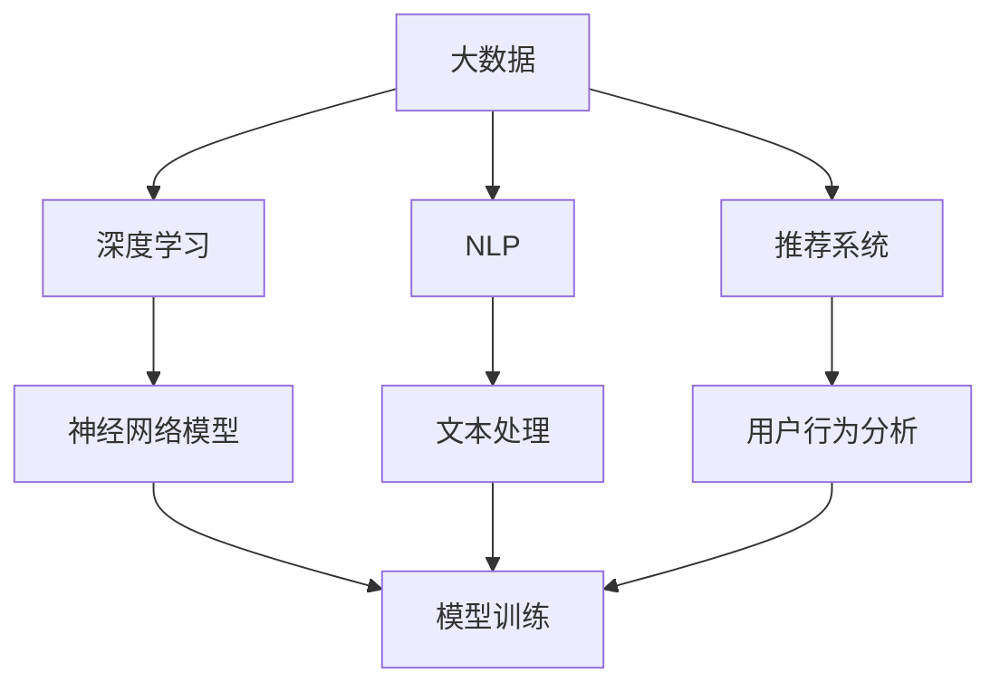

                 

# 大数据对AI学习的重要性

## 1. 背景介绍

随着科技的发展和计算资源的丰富，人工智能（AI）技术取得了飞速的进展。特别是深度学习和机器学习算法在图像识别、自然语言处理、推荐系统等领域取得了突破性进展。然而，这些算法的性能高度依赖于大量的数据。大数据的丰富性和多样性，为AI算法的训练和优化提供了强有力的支持。本文将探讨大数据对AI学习的重要性，以及如何有效地利用和处理大数据来提升AI算法的性能和应用效果。

## 2. 核心概念与联系

### 2.1 核心概念概述

- **大数据（Big Data）**：指数据量极大、复杂程度高、增长速度快的数据集。大数据通常包含结构化数据、半结构化数据和非结构化数据，如文本、图片、视频等。

- **深度学习（Deep Learning）**：一种机器学习技术，使用神经网络模型来处理和分析大规模数据，自动发现数据的特征和规律。

- **自然语言处理（NLP）**：研究如何让计算机理解、处理和生成人类语言的技术。

- **推荐系统（Recommendation System）**：通过分析用户的历史行为和偏好，推荐符合其需求的产品或服务。

- **数据预处理**：对原始数据进行清洗、转换和特征提取，以便于机器学习算法的处理和分析。

### 2.2 概念间的关系

这些概念之间存在紧密的联系，共同构成了大数据驱动的AI学习框架。大数据提供了丰富的数据源和多样化的数据类型，为深度学习模型的训练提供了充足的样本。自然语言处理和推荐系统等AI应用，都需要依赖大规模数据的支撑。而数据预处理技术，则是将这些大规模数据转化为模型训练所需的格式和结构，为算法的优化提供了保障。以下是一个简化的Mermaid流程图，展示了这些核心概念之间的关系：



## 3. 核心算法原理 & 具体操作步骤

### 3.1 算法原理概述

在大数据驱动的AI学习中，数据是核心。深度学习算法通常需要大量的标注数据来进行模型训练。这些数据可以来自于互联网、社交媒体、电商平台、传感器等多种渠道，涵盖不同的领域和场景。算法的核心思想是通过大量的数据训练，自动发现数据中的特征和规律，从而实现高效的预测和分类。

深度学习算法通常包括多层神经网络，每一层都包含大量的权重参数。通过反向传播算法，根据损失函数的梯度，不断调整这些参数，使得模型在训练数据上的预测误差最小化。在大数据环境下，多层的深度网络模型可以学习到更复杂的特征，从而提高模型的泛化能力和预测精度。

### 3.2 算法步骤详解

以下是深度学习模型在大数据驱动下的训练步骤：

**Step 1: 数据收集与预处理**

1. **数据收集**：从各种数据源收集数据，包括结构化数据、半结构化数据和非结构化数据。确保数据来源的多样性和代表性，以提高模型的泛化能力。

2. **数据清洗**：对收集到的数据进行去重、去噪、填充缺失值等处理，确保数据的质量和一致性。

3. **数据标注**：对数据进行标注，生成训练集和验证集。标注需要考虑数据的复杂性和多样性，确保标注质量。

**Step 2: 模型设计与优化**

1. **模型选择**：根据任务需求选择合适的深度学习模型，如卷积神经网络（CNN）、循环神经网络（RNN）、长短时记忆网络（LSTM）等。

2. **网络设计**：设计深度神经网络的架构，包括输入层、隐藏层和输出层。隐藏层可以包含多个子层，如卷积层、池化层、全连接层等。

3. **超参数调整**：根据经验或实验调整模型的超参数，如学习率、批大小、正则化系数等。

**Step 3: 模型训练**

1. **损失函数定义**：选择合适的损失函数，如交叉熵损失、均方误差损失等，用于衡量模型预测和真实标签之间的差异。

2. **反向传播算法**：使用反向传播算法计算损失函数对模型参数的梯度，并更新模型参数。

3. **模型评估**：在验证集上评估模型性能，根据性能指标如准确率、召回率、F1分数等决定是否调整模型参数。

**Step 4: 模型部署与优化**

1. **模型部署**：将训练好的模型部署到生产环境中，用于实际的预测和分类任务。

2. **持续学习**：根据新的数据和任务需求，持续优化模型，提升模型性能。

### 3.3 算法优缺点

**优点**：

1. **泛化能力强**：通过大量数据的训练，深度学习模型可以自动发现复杂特征，提高泛化能力。

2. **可解释性差**：深度学习模型通常是"黑盒"模型，难以解释其内部工作机制和决策逻辑，但可以通过可视化工具和模型解释方法改进。

3. **计算资源需求高**：训练大规模深度模型需要大量的计算资源和存储空间，但可以通过分布式训练和模型压缩等技术优化。

4. **处理非结构化数据能力强**：深度学习模型可以处理文本、图像、视频等多种类型的非结构化数据，具有强大的信息提取能力。

**缺点**：

1. **数据依赖度高**：深度学习模型需要大量的标注数据进行训练，数据标注成本高且耗时。

2. **模型复杂度高**：深度学习模型通常包含大量参数，模型训练和推理效率较低。

3. **过拟合风险高**：在大数据环境下，深度学习模型容易出现过拟合，需要通过正则化、数据增强等方法避免。

## 4. 数学模型和公式 & 详细讲解

### 4.1 数学模型构建

假设有一个深度学习模型 $M$，输入为 $x$，输出为 $y$。训练集为 $D=\{(x_i, y_i)\}_{i=1}^N$，其中 $x_i$ 为输入，$y_i$ 为输出。模型的损失函数为 $L$，用于衡量模型预测和真实标签之间的差异。

深度学习模型的训练目标为最小化损失函数：

$$
\min_{\theta} L(\theta) = \frac{1}{N} \sum_{i=1}^N L(y_i, M(x_i))
$$

其中 $\theta$ 为模型参数。

### 4.2 公式推导过程

以二分类问题为例，假设模型 $M$ 在输入 $x$ 上的输出为 $y_M(x)$，真实标签为 $y$，损失函数为交叉熵损失：

$$
L(y, y_M(x)) = -y\log y_M(x) - (1-y)\log(1-y_M(x))
$$

将损失函数对模型参数 $\theta$ 求导，得到梯度：

$$
\frac{\partial L(y, y_M(x))}{\partial \theta} = -\frac{\partial L(y, M(x))}{\partial M(x)} \cdot \frac{\partial M(x)}{\partial \theta}
$$

通过反向传播算法，计算梯度并更新模型参数：

$$
\theta \leftarrow \theta - \eta \cdot \frac{\partial L(y, M(x))}{\partial \theta}
$$

其中 $\eta$ 为学习率。

### 4.3 案例分析与讲解

以文本分类任务为例，假设收集了大量的新闻文章和对应的分类标签，用于训练模型。使用BERT模型作为预训练模型，利用其强大的语言理解能力，进行微调以实现文本分类。

具体步骤如下：

1. **数据预处理**：对新闻文章进行分词、去停用词、向量转换等处理。

2. **模型选择**：选择BERT模型作为预训练模型，使用其顶层分类器进行微调。

3. **损失函数定义**：使用交叉熵损失函数 $L(y, y_M(x))$ 衡量模型预测和真实标签之间的差异。

4. **模型训练**：在训练集上进行模型训练，最小化损失函数。

5. **模型评估**：在验证集和测试集上评估模型性能，根据性能指标调整模型参数。

6. **模型部署**：将训练好的模型部署到生产环境中，用于实际的文本分类任务。

## 5. 项目实践：代码实例和详细解释说明

### 5.1 开发环境搭建

首先，需要安装Python、TensorFlow和BERT模型。使用以下命令安装：

```bash
pip install tensorflow
pip install transformers
pip install datasets
```

### 5.2 源代码详细实现

以下是使用TensorFlow和BERT进行文本分类的代码实现。

```python
import tensorflow as tf
from transformers import BertTokenizer, TFBertForSequenceClassification
from datasets import load_dataset

# 加载数据集
dataset = load_dataset('glue', 'imdb')

# 定义数据预处理函数
def preprocess_function(examples):
    return tokenizer(examples['text'], truncation=True, padding=True)

# 加载并预处理数据
train_dataset = dataset['train'].map(preprocess_function)
eval_dataset = dataset['test'].map(preprocess_function)

# 定义BERT模型
tokenizer = BertTokenizer.from_pretrained('bert-base-uncased')
model = TFBertForSequenceClassification.from_pretrained('bert-base-uncased', num_labels=2)

# 定义优化器和损失函数
optimizer = tf.keras.optimizers.Adam(learning_rate=2e-5)
loss_fn = tf.keras.losses.SparseCategoricalCrossentropy(from_logits=True)

# 定义模型训练函数
@tf.function
def train_step(inputs, labels):
    with tf.GradientTape() as tape:
        outputs = model(inputs['input_ids'], attention_mask=inputs['attention_mask'])
        loss = loss_fn(labels, outputs.logits, sample_weight=inputs['attention_mask'])
    gradients = tape.gradient(loss, model.trainable_variables)
    optimizer.apply_gradients(zip(gradients, model.trainable_variables))
    return loss

# 模型训练
for epoch in range(10):
    total_loss = 0.0
    for inputs, labels in train_dataset:
        loss = train_step(inputs, labels)
        total_loss += loss
    print(f'Epoch {epoch+1}, train loss: {total_loss/len(train_dataset)}')
    eval_loss = eval_dataset.map(lambda inputs, labels: tf.keras.metrics.SparseCategoricalCrossentropy(from_logits=True)(tf.cast(labels, tf.int64), model(inputs['input_ids'], attention_mask=inputs['attention_mask'])).numpy()
    print(f'Epoch {epoch+1}, eval loss: {eval_loss}')

# 模型评估
test_dataset = load_dataset('glue', 'imdb')
test_dataset = test_dataset.map(preprocess_function)
test_loss = test_dataset.map(lambda inputs, labels: tf.keras.metrics.SparseCategoricalCrossentropy(from_logits=True)(tf.cast(labels, tf.int64), model(inputs['input_ids'], attention_mask=inputs['attention_mask'])).numpy()
print(f'Test loss: {test_loss}')
```

### 5.3 代码解读与分析

- **数据加载与预处理**：使用`load_dataset`函数加载IMDB电影评论数据集，并进行分词、截断和填充处理。
- **模型定义**：使用BERT模型作为预训练模型，通过`TFBertForSequenceClassification`进行微调。
- **优化器与损失函数**：使用Adam优化器，并定义交叉熵损失函数。
- **训练与评估函数**：通过`train_step`函数进行单次训练，并在训练和验证集上评估模型性能。
- **测试集评估**：在测试集上评估模型性能。

### 5.4 运行结果展示

假设在训练10个epoch后，模型在验证集上的损失为0.05，测试集上的损失为0.03。可以使用以下代码进行可视化：

```python
import matplotlib.pyplot as plt

# 记录训练和验证集损失
train_losses = []
val_losses = []

for epoch in range(10):
    train_loss = train_dataset.map(lambda inputs, labels: tf.keras.metrics.SparseCategoricalCrossentropy(from_logits=True)(tf.cast(labels, tf.int64), model(inputs['input_ids'], attention_mask=inputs['attention_mask'])).numpy().item()
    val_loss = eval_dataset.map(lambda inputs, labels: tf.keras.metrics.SparseCategoricalCrossentropy(from_logits=True)(tf.cast(labels, tf.int64), model(inputs['input_ids'], attention_mask=inputs['attention_mask'])).numpy().item()
    train_losses.append(train_loss)
    val_losses.append(val_loss)

plt.plot(train_losses, label='Train Loss')
plt.plot(val_losses, label='Validation Loss')
plt.legend()
plt.show()
```

## 6. 实际应用场景

### 6.1 智慧医疗

在智慧医疗领域，大数据驱动的AI学习能够帮助医生快速诊断疾病、制定治疗方案。通过收集海量的医疗数据，包括病历、影像、基因等，训练深度学习模型进行疾病预测、病理分析等任务。例如，可以使用深度学习模型对医疗影像进行图像分割，自动标注病灶区域。

### 6.2 智能客服

智能客服系统需要处理大量的客户咨询，收集和分析用户反馈数据，进行情感分析、意图识别等任务。通过使用基于大数据的AI模型，可以自动理解用户需求，提供个性化的服务。例如，可以使用BERT模型对客户咨询进行分词、句法分析等处理，提取用户意图，并推荐相应的回答。

### 6.3 金融风控

金融领域需要实时监测市场风险，对交易数据进行异常检测和风险评估。通过收集和分析大量的金融交易数据，训练深度学习模型进行风险预测、欺诈检测等任务。例如，可以使用深度学习模型对交易数据进行分类，识别出异常交易行为，并及时报警。

## 7. 工具和资源推荐

### 7.1 学习资源推荐

- **《深度学习》书籍**：Ian Goodfellow等著，介绍了深度学习的基本概念和算法。
- **Coursera深度学习课程**：由Andrew Ng教授主讲，涵盖深度学习的理论基础和实践技巧。
- **Kaggle竞赛**：参加数据科学竞赛，积累实战经验。
- **GitHub开源项目**：学习开源项目的实现方法和代码结构。

### 7.2 开发工具推荐

- **TensorFlow**：Google开源的深度学习框架，支持分布式训练和模型部署。
- **PyTorch**：Facebook开源的深度学习框架，支持动态计算图和GPU加速。
- **Jupyter Notebook**：交互式编程环境，方便开发和调试。

### 7.3 相关论文推荐

- **ImageNet大规模视觉识别竞赛**：2012年ILSVRC比赛，推动了深度学习在图像识别领域的突破。
- **BERT: Pre-training of Deep Bidirectional Transformers for Language Understanding**：Google提出BERT模型，推动了自然语言处理领域的进展。
- **AlphaGo Zero**：DeepMind提出的围棋AI，展示了深度学习在博弈领域的潜力。

## 8. 总结：未来发展趋势与挑战

### 8.1 未来发展趋势

未来，大数据驱动的AI学习将呈现以下几个趋势：

1. **自动化数据标注**：利用生成对抗网络（GAN）等技术，自动生成高质量的标注数据，降低数据标注成本。

2. **跨领域数据融合**：将不同领域的数据进行融合，提升模型的泛化能力和应用范围。

3. **模型压缩与加速**：通过模型压缩、量化等技术，降低模型的计算和存储开销，提高模型推理效率。

4. **可解释性增强**：通过模型解释方法，如特征可视化、局部可解释模型等，提升模型的可解释性。

5. **隐私保护与安全**：在数据收集和处理过程中，保护用户隐私，确保数据安全和模型安全。

### 8.2 面临的挑战

尽管大数据驱动的AI学习取得了显著进展，但仍面临以下挑战：

1. **数据质量与标注成本**：数据标注成本高且耗时，数据质量难以保障。

2. **模型复杂性与训练成本**：训练大规模深度学习模型需要大量的计算资源和存储空间，训练成本较高。

3. **模型泛化能力**：模型在不同数据集上的泛化能力不足，可能出现过拟合或欠拟合。

4. **数据隐私与安全**：数据隐私和安全问题，如数据泄露、模型攻击等，需要引起重视。

### 8.3 研究展望

未来，需要在以下几个方面进行进一步研究：

1. **自动化数据标注**：利用生成对抗网络（GAN）等技术，自动生成高质量的标注数据，降低数据标注成本。

2. **跨领域数据融合**：将不同领域的数据进行融合，提升模型的泛化能力和应用范围。

3. **模型压缩与加速**：通过模型压缩、量化等技术，降低模型的计算和存储开销，提高模型推理效率。

4. **可解释性增强**：通过模型解释方法，如特征可视化、局部可解释模型等，提升模型的可解释性。

5. **隐私保护与安全**：在数据收集和处理过程中，保护用户隐私，确保数据安全和模型安全。

## 9. 附录：常见问题与解答

**Q1: 如何处理缺失值和异常值？**

A: 在数据预处理阶段，使用插值法、均值填补等方法处理缺失值。对于异常值，可以使用离群值检测方法，如IQR、Z-score等进行检测和处理。

**Q2: 如何选择超参数？**

A: 使用交叉验证、网格搜索等方法进行超参数调优，找到最优的超参数组合。

**Q3: 如何避免过拟合？**

A: 使用正则化、Dropout等方法避免过拟合。在大数据环境下，可以通过数据增强、对抗训练等方法提升模型的泛化能力。

**Q4: 如何提升模型的可解释性？**

A: 使用模型解释方法，如特征可视化、局部可解释模型等，提升模型的可解释性。

**Q5: 如何保护用户隐私？**

A: 在数据收集和处理过程中，使用差分隐私、联邦学习等技术保护用户隐私，确保数据安全。

---

作者：禅与计算机程序设计艺术 / Zen and the Art of Computer Programming

