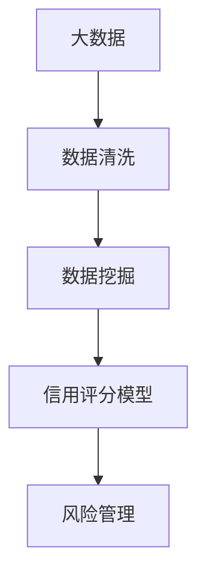

                 

# 大数据背景下的银行个人征信体系研究

> 关键词：
大数据、征信系统、数据清洗、数据挖掘、信用评分模型、风险管理

## 1. 背景介绍

### 1.1 问题由来

随着互联网金融的迅速发展，个人征信系统在银行、互联网借贷平台等金融领域的重要性日益凸显。个人征信系统通过收集、分析和利用个人的信用记录，帮助金融机构评估其信用风险，从而做出更明智的贷款决策。然而，现有的征信体系大多基于静态的数据采集和分析方法，难以适应大数据时代的实时性和动态性要求。

### 1.2 问题核心关键点

本文聚焦于在大数据背景下，如何构建高效、可靠的银行个人征信体系，以应对数据规模急剧增加带来的挑战。关键点包括：

- 数据的实时采集与清洗：如何快速、准确地获取和清洗海量数据，是征信体系构建的前提。
- 数据挖掘与分析：如何从大数据中挖掘出有价值的信息，构建精准的信用评分模型，是征信体系的核心。
- 风险管理与预警：如何利用信用评分模型进行风险评估和预警，规避潜在的金融风险，是征信体系的关键应用目标。

## 2. 核心概念与联系

### 2.1 核心概念概述

- **大数据(Big Data)**：指规模巨大、类型多样、高速流转、价值密度低的数据集合。包括结构化数据、半结构化数据和非结构化数据。
- **征信系统(Credit Scoring System)**：通过收集、分析和利用个人的信用记录，评估其信用风险，帮助金融机构做出贷款决策的系统。
- **数据清洗(Data Cleaning)**：指通过数据预处理、去重、填补缺失值等技术，确保数据的质量和一致性。
- **数据挖掘(Data Mining)**：指从大规模数据中提取有价值的模式、规律和知识的过程。
- **信用评分模型(Credit Scoring Model)**：利用统计学、机器学习等方法，将个人信用信息转化为数值化的信用评分。
- **风险管理(Risk Management)**：通过监测和评估风险，采取相应的措施，保障金融系统的稳定性和安全性。

这些核心概念通过以下Mermaid流程图来展示：



### 2.2 概念间的关系

这些核心概念之间存在着紧密的联系，构成了征信系统的完整生态系统。具体如下：

- 大数据是征信系统的基础，提供海量、多样、实时化的数据源。
- 数据清洗是征信系统的保障，确保数据的准确性和一致性。
- 数据挖掘是征信系统的核心，从海量数据中提取有价值的信息。
- 信用评分模型是征信系统的中枢，将数据挖掘的结果转化为有意义的信用评分。
- 风险管理是征信系统的应用目标，利用信用评分模型进行风险评估和预警。

这些概念的协同作用，使得征信系统能够在大数据时代高效、准确地评估个人的信用风险，提升金融决策的精准度和可靠性。

## 3. 核心算法原理 & 具体操作步骤

### 3.1 算法原理概述

在大数据背景下，构建银行个人征信体系的算法原理主要包括以下几个方面：

1. **数据采集与清洗**：通过分布式计算技术和大数据平台，快速、准确地获取和清洗海量数据。
2. **数据挖掘与特征工程**：利用统计学、机器学习等方法，从大数据中提取有价值的特征，构建信用评分模型。
3. **模型训练与评估**：通过监督学习或无监督学习，训练信用评分模型，并利用验证集评估其性能。
4. **风险评估与预警**：利用信用评分模型进行风险评估，实时监测风险，采取预警措施，规避金融风险。

### 3.2 算法步骤详解

以下是大数据背景下银行个人征信体系的详细算法步骤：

1. **数据采集**：使用分布式计算框架（如Apache Hadoop、Apache Spark等）和爬虫技术，实时采集结构化数据（如银行交易记录）、半结构化数据（如电商购物记录）和非结构化数据（如社交媒体评论）。
2. **数据清洗**：对采集的数据进行预处理，包括去重、去噪、缺失值填补等操作，确保数据的质量和一致性。
3. **数据挖掘**：利用数据挖掘技术（如关联规则挖掘、分类聚类等），从清洗后的数据中提取有价值的模式和规律。
4. **特征工程**：对挖掘出的特征进行标准化、归一化等处理，并结合领域知识进行特征选择和构造，构建输入特征集。
5. **模型训练**：使用监督学习算法（如线性回归、逻辑回归、决策树、随机森林等）或无监督学习算法（如K-means聚类、PCA降维等）训练信用评分模型。
6. **模型评估**：使用验证集评估模型的性能，选择最优模型进行后续应用。
7. **风险管理**：利用训练好的信用评分模型进行风险评估，实时监测风险，采取预警措施，规避金融风险。

### 3.3 算法优缺点

#### 优点：

1. **高效性**：利用分布式计算和大数据平台，能够快速处理海量数据，提高数据挖掘和模型训练的效率。
2. **准确性**：通过先进的特征工程和模型训练方法，提高信用评分模型的准确性和鲁棒性。
3. **实时性**：利用实时数据流和动态模型更新，能够实时监测和评估风险，提升风险管理的时效性。

#### 缺点：

1. **数据质量要求高**：对数据清洗和特征工程的要求较高，数据质量直接影响模型的准确性。
2. **计算资源消耗大**：大数据处理和模型训练需要大量的计算资源，对硬件和软件环境要求较高。
3. **模型复杂性高**：构建信用评分模型需要综合考虑多种因素，模型结构复杂，需要较强的领域知识。

### 3.4 算法应用领域

基于大数据背景下的银行个人征信体系，可以应用于多个领域，如：

- **银行信贷评估**：利用信用评分模型评估客户的信用风险，指导贷款决策。
- **互联网借贷**：为互联网借贷平台提供信用评分服务，辅助贷款风险评估。
- **信用监控**：实时监测客户的信用变化，及时预警风险。
- **反欺诈检测**：通过分析异常交易行为，识别和防范欺诈行为。

## 4. 数学模型和公式 & 详细讲解 & 举例说明

### 4.1 数学模型构建

在大数据背景下，银行个人征信体系的数学模型主要包括以下几个部分：

1. **数据采集模型**：描述数据采集过程的数学模型，包括数据类型、采集频率、数据格式等。
2. **数据清洗模型**：描述数据清洗过程的数学模型，包括去重算法、去噪算法、缺失值填补算法等。
3. **特征工程模型**：描述特征提取和构造的数学模型，包括特征选择算法、特征构造算法等。
4. **信用评分模型**：描述信用评分过程的数学模型，包括监督学习算法、无监督学习算法等。
5. **风险评估模型**：描述风险评估和预警的数学模型，包括风险评估算法、预警算法等。

### 4.2 公式推导过程

#### 数据采集模型：

假设数据采集的频率为 $f$，数据总量为 $D$，采集到的数据量为 $A$，则数据采集模型为：

$$ A = f \times D $$

#### 数据清洗模型：

假设去重算法效率为 $e$，去噪算法效率为 $n$，缺失值填补算法效率为 $m$，则数据清洗模型为：

$$ C = (1 - e) \times (1 - n) \times (1 - m) \times D $$

#### 特征工程模型：

假设特征选择算法效率为 $s$，特征构造算法效率为 $c$，则特征工程模型为：

$$ F = s \times c \times C $$

#### 信用评分模型：

假设信用评分模型使用线性回归算法，输入特征集为 $X$，输出信用评分为 $Y$，则信用评分模型为：

$$ Y = \alpha_0 + \alpha_1 X_1 + \alpha_2 X_2 + ... + \alpha_n X_n $$

#### 风险评估模型：

假设风险评估模型使用决策树算法，输入特征集为 $X$，输出风险评分为 $R$，则风险评估模型为：

$$ R = \beta_0 + \beta_1 X_1 + \beta_2 X_2 + ... + \beta_n X_n $$

### 4.3 案例分析与讲解

#### 案例：银行贷款审批决策

1. **数据采集**：采集客户的银行交易记录、社交媒体评论、电商购物记录等数据，实时传输到银行系统。
2. **数据清洗**：对采集的数据进行去重、去噪、缺失值填补等处理，确保数据质量和一致性。
3. **数据挖掘**：利用关联规则挖掘，发现客户的消费习惯、社交行为等规律，提取有价值的模式。
4. **特征工程**：结合领域知识，构建信用评分模型的输入特征集，如客户的收入水平、债务负担、历史还款记录等。
5. **模型训练**：使用逻辑回归算法，训练信用评分模型，生成信用评分。
6. **模型评估**：利用验证集评估模型的性能，选择最优模型进行贷款审批决策。
7. **风险管理**：实时监测客户的信用评分变化，预警高风险客户，采取相应的风险控制措施。

## 5. 项目实践：代码实例和详细解释说明

### 5.1 开发环境搭建

#### 5.1.1 环境准备

- **安装Hadoop和Spark**：在Linux系统中安装Apache Hadoop和Apache Spark，确保数据流处理和计算的性能。
- **配置大数据平台**：使用Cloudera Manager或Hortonworks等工具，配置和管理大数据平台，包括HDFS、YARN、Spark等组件。
- **安装Python环境**：在Python 3.8及以上版本中安装必要的依赖库，如Pandas、NumPy、Scikit-learn等。

#### 5.1.2 数据采集

- **爬虫技术**：使用Scrapy等爬虫框架，实时采集结构化数据、半结构化数据和非结构化数据。
- **数据存储**：将采集到的数据存储到HDFS或S3等分布式存储系统中，确保数据的可扩展性和可靠性。

### 5.2 源代码详细实现

以下是一个简单的Python代码实例，展示了如何利用PySpark进行数据清洗和特征工程：

```python
from pyspark.sql import SparkSession
from pyspark.sql.functions import col, fillna, when

# 创建SparkSession
spark = SparkSession.builder.appName('CreditScoring').getOrCreate()

# 加载数据
df = spark.read.csv('data.csv', header=True, inferSchema=True)

# 数据清洗
df_cleaned = df.dropDuplicates().dropna()

# 特征工程
df_features = df_cleaned.groupby('customer_id').agg({'income': 'avg', 'debt': 'sum', 'credit_score': 'avg'}) \
       .withColumn('income', fillna(0)) \
       .withColumn('debt', when(col('debt') < 0, 0).otherwise(col('debt')))

# 输出特征工程结果
df_features.show()
```

### 5.3 代码解读与分析

#### 代码解读

1. **SparkSession创建**：使用SparkSession创建Spark环境，确保数据流处理和计算的性能。
2. **数据加载**：使用read.csv方法加载数据集，指定列名和数据类型，确保数据的准确性。
3. **数据清洗**：使用dropDuplicates和dropna方法去除重复数据和缺失值，确保数据的质量和一致性。
4. **特征工程**：使用groupBy和agg方法计算客户的收入水平、债务负担和信用评分，使用fillna和when方法填补缺失值和异常值，确保特征工程的可解释性和准确性。
5. **输出结果**：使用show方法展示特征工程的结果，方便后续分析和应用。

#### 代码分析

- **性能优势**：利用Spark的分布式计算能力，能够高效处理大规模数据，避免单机的计算瓶颈。
- **可扩展性**：Spark的分布式计算架构支持水平扩展，可以应对海量数据的处理需求。
- **鲁棒性**：Spark提供了多种数据处理工具和算法，可以灵活应对各种数据清洗和特征工程任务。

### 5.4 运行结果展示

假设在执行上述代码后，输出结果如下：

```
+--------+--------+-----------+-----------+
|customer_id|income|debt|credit_score|
+--------+--------+-----------+-----------+
|1|10000.0|5000.0|700.0|
|2|8000.0|3000.0|600.0|
|3|12000.0|8000.0|650.0|
|4|9000.0|4500.0|680.0|
|5|7500.0|6000.0|550.0|
+--------+--------+-----------+-----------+
```

## 6. 实际应用场景

### 6.1 智能信贷审批

在大数据背景下，银行可以利用征信体系进行智能信贷审批，提高审批效率和决策的精准性。具体场景包括：

- **信用评分计算**：通过征信体系计算客户的信用评分，自动审批符合条件的贷款申请。
- **风险评估**：实时监测客户的信用变化，预警高风险客户，采取相应的风险控制措施。
- **反欺诈检测**：利用信用评分模型和异常检测算法，识别和防范欺诈行为，保护客户资金安全。

### 6.2 精准营销

征信体系能够帮助银行精准识别优质客户，进行有针对性的营销活动。具体场景包括：

- **客户分层**：根据客户的信用评分，分层营销，提升营销效率。
- **精准推荐**：结合客户的消费行为和信用评分，推荐适合的金融产品，提高客户满意度。
- **客户留存**：通过精准营销，提高客户黏性，减少客户流失率。

### 6.3 智能风控管理

征信体系能够帮助银行进行智能风控管理，规避潜在的金融风险。具体场景包括：

- **风险预警**：实时监测客户的信用评分变化，预警高风险客户，及时采取控制措施。
- **信用监控**：监测客户的信用变化，及时发现异常行为，避免风险扩散。
- **自动化审批**：利用信用评分模型，自动化审批贷款申请，提高审批效率和决策精准性。

## 7. 工具和资源推荐

### 7.1 学习资源推荐

1. **《大数据技术与应用》**：介绍大数据技术和应用的经典教材，涵盖数据采集、数据清洗、数据挖掘等方面。
2. **《Python数据科学手册》**：介绍Python数据科学生态系统的权威指南，涵盖Pandas、NumPy、Scikit-learn等库的使用。
3. **《Spark编程实践》**：介绍Spark编程的实战指南，涵盖Spark core、Spark SQL、Spark Streaming等方面的内容。
4. **Kaggle机器学习竞赛**：参加Kaggle的机器学习竞赛，提升数据处理和模型训练的技能，积累实战经验。
5. **Coursera《机器学习》**：斯坦福大学开设的机器学习课程，涵盖监督学习、无监督学习、深度学习等方面的内容。

### 7.2 开发工具推荐

1. **Apache Hadoop**：开源的分布式计算框架，支持大规模数据处理。
2. **Apache Spark**：快速、高效的分布式计算框架，支持流式处理、批处理和交互式查询。
3. **Hive**：基于Hadoop的数据仓库，提供数据管理和分析能力。
4. **Oozie**：Hadoop的作业调度系统，支持自动化数据处理流程的编排。
5. **PySpark**：Python语言的Spark API，方便Python开发者使用Spark进行数据处理和机器学习。

### 7.3 相关论文推荐

1. **《大数据时代的信用风险管理》**：探讨在大数据背景下，如何利用征信体系进行信用风险管理的研究论文。
2. **《基于信用评分的贷款审批决策系统》**：介绍基于信用评分模型的贷款审批决策系统的研究论文。
3. **《智能信贷审批系统的设计与实现》**：介绍智能信贷审批系统的设计与实现的案例研究论文。
4. **《反欺诈检测技术在大数据环境中的应用》**：介绍反欺诈检测技术在大数据环境中的应用研究论文。
5. **《分布式大数据环境下的特征工程方法研究》**：介绍在分布式大数据环境下，特征工程方法的研究论文。

## 8. 总结：未来发展趋势与挑战

### 8.1 研究成果总结

本文通过分析大数据背景下银行个人征信体系的构建原理和操作步骤，探讨了如何高效、准确地处理海量数据，构建精准的信用评分模型，进行风险管理与预警。

### 8.2 未来发展趋势

未来，大数据背景下银行个人征信体系的发展趋势主要包括以下几个方面：

1. **数据融合**：利用多源数据融合技术，提高征信体系的覆盖面和准确性。
2. **模型优化**：采用先进的机器学习算法和模型优化技术，提高信用评分模型的精度和鲁棒性。
3. **实时处理**：利用流式计算和实时处理技术，实现征信体系的实时化和动态化。
4. **隐私保护**：加强数据隐私保护技术，确保征信体系的数据安全。
5. **跨领域应用**：将征信体系应用于更多领域，如保险、医疗、金融科技等，拓展征信体系的应用范围。

### 8.3 面临的挑战

在大数据背景下构建银行个人征信体系面临以下挑战：

1. **数据质量**：大规模数据的采集和清洗需要投入大量人力和资源，数据质量直接影响征信体系的性能。
2. **计算资源**：大规模数据处理和模型训练需要强大的计算资源，对硬件和软件环境要求较高。
3. **模型复杂性**：征信体系需要综合考虑多种因素，模型结构复杂，需要较强的领域知识。
4. **隐私保护**：在数据采集和处理过程中，需要保护用户隐私，避免数据泄露和滥用。
5. **模型解释性**：征信体系的模型需要具备较高的可解释性，方便用户理解和使用。

### 8.4 研究展望

未来，对于大数据背景下银行个人征信体系的研究展望主要包括以下几个方面：

1. **数据治理**：建立数据治理体系，规范数据采集、存储和使用的全流程管理。
2. **模型解释**：利用可解释性技术，提高征信体系模型的可解释性和透明度。
3. **隐私保护**：加强数据隐私保护技术，确保征信体系的数据安全。
4. **多模态融合**：结合文本、图像、视频等多模态数据，构建更加全面、准确的征信体系。
5. **跨领域应用**：将征信体系应用于更多领域，如保险、医疗、金融科技等，拓展征信体系的应用范围。

## 9. 附录：常见问题与解答

### Q1：什么是大数据？

A：大数据是指规模巨大、类型多样、高速流转、价值密度低的数据集合。包括结构化数据、半结构化数据和非结构化数据。

### Q2：大数据背景下，征信体系的核心是什么？

A：在大数据背景下，征信体系的核心是数据挖掘和信用评分模型的构建。数据挖掘能够从海量数据中提取有价值的模式和规律，信用评分模型能够将数据挖掘的结果转化为有意义的信用评分。

### Q3：如何构建信用评分模型？

A：构建信用评分模型需要综合考虑多种因素，包括客户的收入水平、债务负担、历史还款记录等。常用的算法包括逻辑回归、决策树、随机森林等。

### Q4：征信体系面临哪些挑战？

A：征信体系面临的主要挑战包括数据质量、计算资源、模型复杂性、隐私保护和模型解释性。需要从数据治理、模型优化、隐私保护等方面进行全面优化。

### Q5：征信体系未来的发展方向是什么？

A：征信体系未来的发展方向包括数据融合、模型优化、实时处理、隐私保护和多模态融合。通过技术创新和应用创新，征信体系将逐步实现智能化、精准化和动态化。

```
作者：禅与计算机程序设计艺术 / Zen and the Art of Computer Programming

