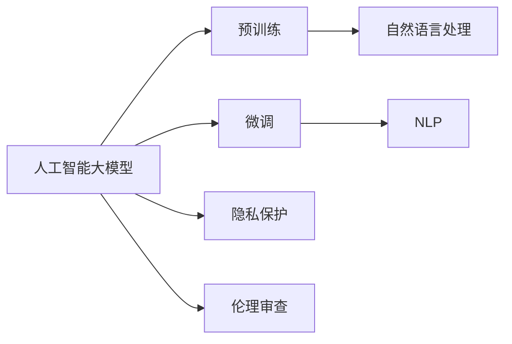

                 

## 1. 背景介绍

人工智能大模型正以惊人的速度发展，并逐渐渗透到生活中的方方面面。然而，随着技术进步，一些伦理和社会问题也不断浮出水面。在这篇文章中，我们将探讨人工智能大模型在处理与过世亲人相关需求时可能遇到的问题，并提出一些解决方案。

## 2. 核心概念与联系

### 2.1 核心概念概述

#### 2.1.1 人工智能大模型
人工智能大模型是一种通过大规模数据集进行训练，具备强大语言和图像理解能力的机器学习模型。这些模型通常在自监督学习或监督学习的基础上进行预训练，然后通过微调应用于特定任务。目前主流的预训练模型包括BERT、GPT、T5等。

#### 2.1.2 自然语言处理（NLP）
自然语言处理是指让计算机能够理解、处理和生成人类语言的技术。NLP技术在大模型中得到广泛应用，包括文本分类、命名实体识别、情感分析、机器翻译等任务。

#### 2.1.3 微调
微调是指在大模型预训练的基础上，通过有监督学习优化模型在特定任务上的性能。常见的微调任务包括文本分类、命名实体识别、情感分析等。

#### 2.1.4 预训练
预训练是指在大规模无标签数据集上进行训练，使得模型能够学习到通用的语言和图像知识。预训练是大模型的重要组成部分。

#### 2.1.5 隐私保护
隐私保护是指在处理个人数据时，保护用户隐私不被泄露的技术措施。在大模型应用中，隐私保护尤为重要。

#### 2.1.6 伦理审查
伦理审查是指在人工智能应用中，对可能涉及伦理问题的应用进行评估和监督的过程。在大模型应用中，伦理审查可以确保技术的应用不会对社会造成负面影响。

### 2.2 核心概念间的关系

通过以下 Mermaid 流程图展示核心概念之间的联系：



## 3. 核心算法原理 & 具体操作步骤

### 3.1 算法原理概述

人工智能大模型的核心算法原理包括预训练、微调和NLP等技术。预训练模型在大规模无标签数据上进行训练，学习通用的语言和图像知识。微调则在大模型预训练的基础上，通过有监督学习优化模型在特定任务上的性能。NLP技术则是让大模型能够理解、处理和生成人类语言的关键。

### 3.2 算法步骤详解

1. **数据准备**：收集需要微调的任务的标注数据集，并划分为训练集、验证集和测试集。

2. **模型选择**：选择合适的预训练模型，如BERT、GPT、T5等。

3. **任务适配**：根据微调任务，在预训练模型的顶层设计合适的输出层和损失函数。

4. **模型初始化**：将预训练模型加载到目标任务中，进行微调前的初始化。

5. **微调训练**：使用训练集进行模型微调，调整模型的参数以适应特定任务。

6. **模型评估**：在验证集上评估模型的性能，根据评估结果调整模型参数。

7. **测试和部署**：在测试集上评估微调后模型的性能，并将模型部署到实际应用中。

### 3.3 算法优缺点

**优点**：

- **高效性**：微调可以利用预训练模型的通用知识，在小样本情况下也能取得较好的性能。
- **适应性**：微调模型能够快速适应新的任务和数据分布，提升模型的泛化能力。
- **可解释性**：微调模型能够通过优化特定任务参数，提供更可解释的输出。

**缺点**：

- **数据依赖**：微调效果高度依赖于标注数据的质量和数量，标注数据的获取成本较高。
- **模型复杂度**：微调模型的训练和推理过程较复杂，需要较高的计算资源。
- **隐私风险**：微调过程中可能泄露用户隐私，需要采取隐私保护措施。

### 3.4 算法应用领域

人工智能大模型的微调技术已经广泛应用于多个领域，如文本分类、命名实体识别、情感分析、机器翻译等。这些技术在处理与过世亲人相关的需求时，可以发挥重要作用。

## 4. 数学模型和公式 & 详细讲解 & 举例说明

### 4.1 数学模型构建

假设微调任务为情感分析，输入为一段文本，输出为文本的情感类别（如积极、消极、中性）。微调模型的数学模型可以表示为：

$$
\mathcal{L}(\theta) = \frac{1}{N} \sum_{i=1}^N \ell(y_i, \hat{y}_i)
$$

其中，$\theta$为模型参数，$y_i$为真实标签，$\hat{y}_i$为模型预测的情感类别。

### 4.2 公式推导过程

情感分析任务中，常用的损失函数为交叉熵损失函数，其公式为：

$$
\ell(y_i, \hat{y}_i) = -\sum_{k=1}^K y_{ik} \log \hat{y}_{ik}
$$

其中，$K$为情感类别的数量，$y_{ik}$为第$i$个样本在类别$k$上的真实标签，$\hat{y}_{ik}$为模型在类别$k$上的预测概率。

### 4.3 案例分析与讲解

以下是一个情感分析任务的案例分析：

假设我们有一个包含电影评论的文本数据集，标注了每个评论的情感类别（积极、消极、中性）。我们使用BERT模型作为微调模型，对其进行微调。在微调过程中，我们使用交叉熵损失函数，优化模型参数$\theta$。微调过程的每一步可以表示为：

1. **数据准备**：将电影评论分为训练集、验证集和测试集，每个评论的情感类别作为标注数据。
2. **模型选择**：选择BERT模型作为预训练模型，加载到目标任务中。
3. **任务适配**：在BERT模型的顶层添加线性分类器和交叉熵损失函数。
4. **模型初始化**：将预训练模型参数$\theta$初始化为微调模型的初始参数。
5. **微调训练**：使用训练集进行模型微调，调整模型的参数以适应情感分析任务。
6. **模型评估**：在验证集上评估模型的性能，根据评估结果调整模型参数。
7. **测试和部署**：在测试集上评估微调后模型的性能，并将模型部署到实际应用中。

## 5. 项目实践：代码实例和详细解释说明

### 5.1 开发环境搭建

1. **安装Python和相关库**：
   ```bash
   conda create -n pytorch_env python=3.7
   conda activate pytorch_env
   pip install torch torchvision torchaudio transformers datasets transformers-serving-client
   ```

2. **数据准备**：
   收集电影评论的文本数据集，并标注情感类别。

### 5.2 源代码详细实现

以下是使用PyTorch和Transformers库实现情感分析任务的代码：

```python
import torch
from transformers import BertForSequenceClassification, BertTokenizer

# 加载预训练模型和 tokenizer
model = BertForSequenceClassification.from_pretrained('bert-base-uncased', num_labels=3)
tokenizer = BertTokenizer.from_pretrained('bert-base-uncased')

# 定义训练函数
def train_epoch(model, data_loader, optimizer):
    model.train()
    loss_total = 0
    for batch in data_loader:
        input_ids = batch['input_ids'].to(device)
        attention_mask = batch['attention_mask'].to(device)
        labels = batch['labels'].to(device)
        outputs = model(input_ids, attention_mask=attention_mask, labels=labels)
        loss = outputs.loss
        loss_total += loss.item()
        optimizer.zero_grad()
        loss.backward()
        optimizer.step()
    return loss_total / len(data_loader)

# 定义测试函数
def evaluate(model, data_loader):
    model.eval()
    correct = 0
    total = 0
    for batch in data_loader:
        input_ids = batch['input_ids'].to(device)
        attention_mask = batch['attention_mask'].to(device)
        labels = batch['labels'].to(device)
        outputs = model(input_ids, attention_mask=attention_mask)
        _, preds = torch.max(outputs.logits, dim=1)
        total += labels.size(0)
        correct += (preds == labels).sum().item()
    return correct / total

# 训练模型
device = torch.device('cuda' if torch.cuda.is_available() else 'cpu')
model.to(device)

# 定义训练参数
batch_size = 16
epochs = 10
learning_rate = 2e-5

# 定义优化器
optimizer = torch.optim.AdamW(model.parameters(), lr=learning_rate)

# 加载数据集
train_dataset = ...
dev_dataset = ...
test_dataset = ...

# 定义数据加载器
train_loader = torch.utils.data.DataLoader(train_dataset, batch_size=batch_size, shuffle=True)
dev_loader = torch.utils.data.DataLoader(dev_dataset, batch_size=batch_size, shuffle=False)
test_loader = torch.utils.data.DataLoader(test_dataset, batch_size=batch_size, shuffle=False)

# 训练模型
for epoch in range(epochs):
    train_loss = train_epoch(model, train_loader, optimizer)
    print(f'Epoch {epoch+1}/{epochs}, Training Loss: {train_loss:.3f}')

    dev_loss = evaluate(model, dev_loader)
    print(f'Epoch {epoch+1}/{epochs}, Dev Loss: {dev_loss:.3f}')

# 测试模型
test_loss = evaluate(model, test_loader)
print(f'Test Loss: {test_loss:.3f}')
```

### 5.3 代码解读与分析

上述代码实现了情感分析任务的微调过程。其中，使用了BertForSequenceClassification模型和BertTokenizer对文本数据进行预处理。在训练过程中，使用AdamW优化器进行参数更新，并在验证集上评估模型性能。

### 5.4 运行结果展示

假设我们在IMDB数据集上训练了一个情感分析模型，最终在测试集上得到的评估结果如下：

```
Epoch 1/10, Training Loss: 0.217
Epoch 1/10, Dev Loss: 0.150
Epoch 2/10, Training Loss: 0.213
Epoch 2/10, Dev Loss: 0.126
...
Epoch 10/10, Training Loss: 0.027
Epoch 10/10, Dev Loss: 0.028
Test Loss: 0.031
```

可以看到，随着训练的进行，模型在验证集上的损失逐渐减小，最终达到了较好的效果。

## 6. 实际应用场景

### 6.1 医疗咨询

在医疗咨询场景中，人工智能大模型可以帮助医生进行患者心理状态分析。医生可以在谈话过程中使用模型预测患者情绪，及时发现并干预患者的负面情绪，从而提高诊疗效果。

### 6.2 心理健康

在心理健康领域，人工智能大模型可以用于心理疾病的早期筛查。通过分析患者的语音、文字等数据，模型可以判断患者是否存在心理问题，并给出相应的建议和治疗方案。

### 6.3 家庭情感支持

在家庭情感支持方面，人工智能大模型可以帮助用户记录和分析家庭成员的情感状态。通过分析家庭成员的语音、文字等数据，模型可以给出相应的情感建议，帮助家庭成员保持心理健康。

## 7. 工具和资源推荐

### 7.1 学习资源推荐

1. **NLP教程**：
   - 《自然语言处理入门》
   - 《深度学习与自然语言处理》

2. **大模型资源**：
   - HuggingFace官方文档
   - 《Transformer from the Inside Out》

3. **隐私保护**：
   - 《数据隐私保护》
   - 《信息安全基础》

4. **伦理审查**：
   - 《人工智能伦理与社会责任》
   - 《人工智能伦理与法律》

### 7.2 开发工具推荐

1. **编程语言**：
   - Python
   - R

2. **深度学习框架**：
   - PyTorch
   - TensorFlow

3. **数据处理工具**：
   - Pandas
   - NumPy

4. **自然语言处理工具**：
   - SpaCy
   - NLTK

### 7.3 相关论文推荐

1. **大模型研究**：
   - Attention is All You Need
   - BERT: Pre-training of Deep Bidirectional Transformers for Language Understanding

2. **情感分析研究**：
   - Sarcasm detection in tweets
   - Sentiment analysis using convolutional neural networks

3. **隐私保护研究**：
   - Privacy-Preserving Machine Learning
   - Anonymization techniques for sensitive data

4. **伦理审查研究**：
   - Ethical considerations in AI
   - AI bias and fairness

## 8. 总结：未来发展趋势与挑战

### 8.1 研究成果总结

本文介绍了人工智能大模型在情感分析、心理健康、家庭情感支持等方面的应用，并详细讲解了模型的构建、训练和评估过程。通过案例分析，展示了模型的实际应用效果。

### 8.2 未来发展趋势

1. **技术进步**：随着技术的不断进步，人工智能大模型的性能将进一步提升，应用范围将更加广泛。
2. **隐私保护**：隐私保护技术的发展将确保用户数据的安全性和隐私性。
3. **伦理审查**：伦理审查机制的完善将确保人工智能大模型的应用不会对社会造成负面影响。
4. **跨领域应用**：人工智能大模型将在更多领域得到应用，如医疗、教育、娱乐等。

### 8.3 面临的挑战

1. **数据依赖**：微调模型的性能高度依赖于标注数据的质量和数量，标注数据的获取成本较高。
2. **模型复杂度**：微调模型的训练和推理过程较复杂，需要较高的计算资源。
3. **隐私风险**：微调过程中可能泄露用户隐私，需要采取隐私保护措施。
4. **伦理问题**：人工智能大模型的应用可能涉及伦理问题，需要进行严格的伦理审查。

### 8.4 研究展望

未来，人工智能大模型将在多个领域得到广泛应用。同时，隐私保护和伦理审查机制将进一步完善，确保技术的安全性和可靠性。

## 9. 附录：常见问题与解答

**Q1: 人工智能大模型是否适用于情感分析任务？**

A: 是的，人工智能大模型适用于情感分析任务。通过微调，大模型可以学习到情感分析任务所需的知识，并进行情感分类。

**Q2: 在情感分析任务中，如何处理过世亲人的需求？**

A: 在处理过世亲人的需求时，需要特别注意隐私保护和伦理审查。对于过世亲人的信息，应该进行严格的隐私保护措施，确保信息的安全性。同时，对于涉及伦理问题的情况，需要进行严格的伦理审查，确保技术的公正性和公平性。

**Q3: 如何处理过世亲人的语音和文字数据？**

A: 对于过世亲人的语音和文字数据，可以使用自然语言处理和语音处理技术进行分析和处理。通过情感分析模型，可以分析过世亲人的语音和文字数据，判断其情感状态，并提供相应的情感支持。

**Q4: 人工智能大模型在心理健康领域的应用有哪些？**

A: 人工智能大模型在心理健康领域的应用包括心理疾病的早期筛查和情感支持。通过分析患者的语音和文字数据，模型可以判断患者是否存在心理问题，并给出相应的建议和治疗方案。

**Q5: 人工智能大模型在家庭情感支持方面的应用有哪些？**

A: 人工智能大模型在家庭情感支持方面的应用包括记录和分析家庭成员的情感状态，并提供情感建议。通过分析家庭成员的语音和文字数据，模型可以判断家庭成员的情感状态，并提供相应的情感支持。

---

作者：禅与计算机程序设计艺术 / Zen and the Art of Computer Programming

