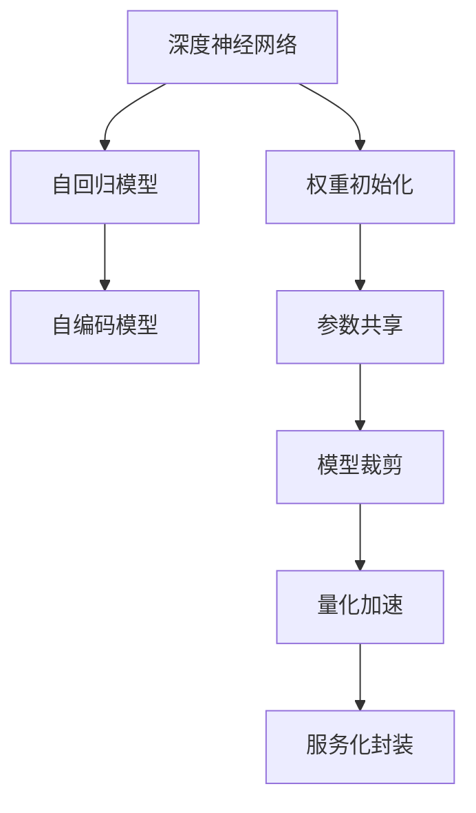
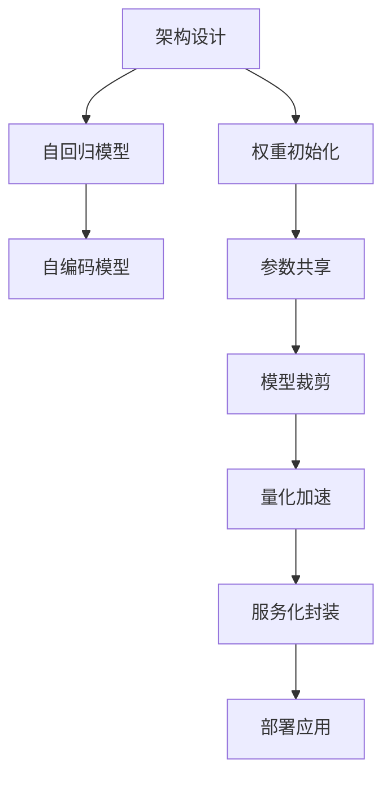

                 

# 大模型体系结构探索：解构AI LLM的内部工作机制

> 关键词：大语言模型, 架构, 深度学习, 神经网络, 自回归, 自编码, 权重初始化, 参数共享, 模型裁剪, 量化加速, 服务化封装

## 1. 背景介绍

### 1.1 问题由来

近年来，大规模语言模型（Large Language Models, LLMs）在自然语言处理（Natural Language Processing, NLP）领域取得了显著进展，极大地提升了自然语言理解和生成能力。这些模型通过在海量数据上自监督预训练，学习了丰富的语言知识，能够在各种NLP任务中取得优异表现。

LLMs的核心架构以深度神经网络为基础，采用自回归（如GPT）或自编码（如BERT）结构。自回归模型通过生成下一词来预测当前词，从而捕捉语言结构；自编码模型则通过重构输入序列来学习语言表示。这些模型在参数量和训练数据上不断突破，从几亿到几十亿甚至上百亿参数，极大地提升了其性能和能力。

然而，随着模型规模的不断增大，其复杂度和训练难度也在不断增加，这使得模型的内部结构和设计变得尤为重要。理解大模型的内部工作机制，不仅有助于其应用和优化，还能为更高级别的智能推理提供基础。

### 1.2 问题核心关键点

- **大语言模型的架构设计**：如何设计大语言模型的内部结构，以充分利用深度学习技术，提高模型的性能和可解释性？
- **自回归与自编码结构**：自回归和自编码结构在大语言模型中的具体应用和比较，各自的优势与劣势是什么？
- **权重初始化与参数共享**：在模型训练和优化中，如何选择合适的权重初始化方法与参数共享策略，以提升模型的泛化能力和训练效率？
- **模型裁剪与量化加速**：在模型部署与优化中，如何进行模型裁剪和量化加速，以实现高性能的推理计算？
- **服务化封装**：如何将大语言模型转化为服务接口，以便于集成和调用，实现大规模生产应用？

### 1.3 问题研究意义

理解大语言模型的内部结构，有助于深入掌握其工作原理和优化方法，从而在实际应用中充分发挥其潜力。这不仅有助于提升NLP任务的性能，还能推动更高级别的智能推理和决策系统的发展，为未来的智能技术创新提供坚实基础。

## 2. 核心概念与联系

### 2.1 核心概念概述

为大语言模型的内部结构提供清晰的定义和关联，有助于理解其各个组件的功能和作用。

- **深度神经网络**：以多层神经元为基本单元，通过反向传播算法进行训练和优化。
- **自回归模型**：通过生成下一个词来预测当前词，适用于文本生成等任务。
- **自编码模型**：通过重构输入序列来学习语言表示，适用于文本分类、实体识别等任务。
- **权重初始化**：在模型训练前，对网络中的权重进行初始化，以加速训练和提高模型性能。
- **参数共享**：在模型训练中，共享部分层或组件的参数，以减少计算量和提高泛化能力。
- **模型裁剪**：在模型部署前，去除不必要的层和参数，以减小模型尺寸和提高推理速度。
- **量化加速**：将浮点模型转换为定点模型，以减小存储和计算资源消耗，提高计算效率。
- **服务化封装**：将模型封装为标准化服务接口，以方便集成调用。

### 2.2 概念间的关系

这些核心概念通过大语言模型的训练、优化和部署过程相互关联，共同构成了一个完整的体系结构。通过以下Mermaid流程图，展示这些概念之间的逻辑关系：



这个流程图展示了从网络架构设计到模型训练、优化和部署的完整流程：

- 首先，选择深度神经网络作为大语言模型的基本架构。
- 根据具体任务，选择自回归或自编码模型。
- 进行权重初始化和参数共享，加速模型训练和提高泛化能力。
- 进行模型裁剪和量化加速，减小模型尺寸和提高推理速度。
- 最后，服务化封装，实现模型部署和集成应用。

### 2.3 核心概念的整体架构

以下是一个综合的流程图，展示了从架构设计到模型部署的完整过程：



这个综合流程图展示了从网络架构设计到模型训练、优化、部署的完整流程。

## 3. 核心算法原理 & 具体操作步骤

### 3.1 算法原理概述

大语言模型的内部架构主要基于深度神经网络，采用自回归或自编码结构。自回归模型通过生成下一个词来预测当前词，自编码模型则通过重构输入序列来学习语言表示。

### 3.2 算法步骤详解

大语言模型的训练流程可以分为以下几个关键步骤：

1. **网络设计**：选择合适的深度神经网络架构，如自回归或自编码模型，并进行网络设计。
2. **权重初始化**：对网络中的权重进行初始化，以加速训练和提高模型性能。
3. **参数共享**：共享部分层或组件的参数，以减少计算量和提高泛化能力。
4. **模型训练**：在标注数据上进行有监督或自监督训练，优化模型参数。
5. **模型裁剪**：去除不必要的层和参数，减小模型尺寸和提高推理速度。
6. **量化加速**：将浮点模型转换为定点模型，以减小存储和计算资源消耗，提高计算效率。
7. **服务化封装**：将模型封装为标准化服务接口，以方便集成调用。

### 3.3 算法优缺点

大语言模型的内部架构设计具有以下优点：

- **强大的表达能力**：通过深度神经网络，可以捕捉复杂的语言结构和语义关系。
- **泛化能力强**：通过参数共享和自监督预训练，模型可以很好地适应新任务和数据。
- **高效的计算**：通过量化加速和模型裁剪，可以显著提高模型的推理速度和计算效率。

同时，也存在以下缺点：

- **计算资源消耗大**：大模型需要大量的计算资源进行训练和推理，增加了硬件成本。
- **可解释性差**：大模型往往是"黑盒"系统，难以解释其内部工作机制和决策逻辑。
- **训练难度高**：大模型结构复杂，训练过程容易过拟合，需要精心设计训练策略。

### 3.4 算法应用领域

大语言模型的内部架构设计广泛应用于各种NLP任务中，例如：

- **文本分类**：如情感分析、主题分类等，通过学习文本-标签映射，对文本进行分类。
- **命名实体识别**：识别文本中的人名、地名、机构名等特定实体，通过学习实体边界和类型。
- **关系抽取**：从文本中抽取实体之间的语义关系，通过学习实体-关系三元组。
- **问答系统**：对自然语言问题给出答案，通过学习问题-答案对。
- **机器翻译**：将源语言文本翻译成目标语言，通过学习语言-语言映射。
- **文本摘要**：将长文本压缩成简短摘要，通过学习抓取要点。
- **对话系统**：使机器能够与人自然对话，通过学习对话历史和上下文。

除了上述经典任务，大语言模型的内部架构设计还在创新性应用中不断拓展，如可控文本生成、常识推理、代码生成、数据增强等，为NLP技术带来了新的突破。

## 4. 数学模型和公式 & 详细讲解 & 举例说明

### 4.1 数学模型构建

以自回归模型为例，其数学模型可以表示为：

$$
p(y|x;\theta) = \prod_{t=1}^{T} p(y_t|y_{<t};\theta)
$$

其中 $y=(y_1,\cdots,y_T)$ 为输出序列，$x$ 为输入序列，$\theta$ 为模型参数，$T$ 为序列长度。

### 4.2 公式推导过程

以自回归模型为例，其前向传播过程可以表示为：

$$
h_t = f(W_h h_{t-1} + W_x x_t + b_h)
$$

$$
\log p(y_t|y_{<t};\theta) = \log softmax(W_o h_t + b_o)
$$

其中 $f$ 为非线性激活函数，$W_h$ 和 $W_x$ 为权重矩阵，$b_h$ 和 $b_o$ 为偏置项，$softmax$ 为输出层的激活函数。

### 4.3 案例分析与讲解

以BERT模型为例，其架构设计包括多个自编码层，每个层包含多个Transformer编码器。BERT通过掩码语言模型（MLM）和下一句预测（NSP）任务进行预训练，学习文本-表示映射。

## 5. 项目实践：代码实例和详细解释说明

### 5.1 开发环境搭建

为进行深度学习模型的开发和优化，需要一个完整的开发环境。以下是搭建开发环境的步骤：

1. 安装Anaconda：从官网下载并安装Anaconda，用于创建独立的Python环境。
2. 创建并激活虚拟环境：
```bash
conda create -n pytorch-env python=3.8 
conda activate pytorch-env
```

3. 安装PyTorch：根据CUDA版本，从官网获取对应的安装命令。例如：
```bash
conda install pytorch torchvision torchaudio cudatoolkit=11.1 -c pytorch -c conda-forge
```

4. 安装Transformers库：
```bash
pip install transformers
```

5. 安装各类工具包：
```bash
pip install numpy pandas scikit-learn matplotlib tqdm jupyter notebook ipython
```

完成上述步骤后，即可在`pytorch-env`环境中开始模型开发。

### 5.2 源代码详细实现

以下是使用PyTorch和Transformers库实现自回归模型的代码：

```python
import torch
from transformers import AutoModelForCausalLM, AutoTokenizer

# 加载预训练模型和分词器
model_name = 'gpt2'
tokenizer = AutoTokenizer.from_pretrained(model_name)
model = AutoModelForCausalLM.from_pretrained(model_name)

# 构造输入序列
input_ids = tokenizer("Hello, world!", return_tensors="pt").input_ids

# 生成文本
with torch.no_grad():
    output_ids = model.generate(input_ids, max_length=50, top_p=0.9, top_k=100)

# 解码输出
output_text = tokenizer.decode(output_ids[0], skip_special_tokens=True)
print(output_text)
```

### 5.3 代码解读与分析

这段代码展示了如何使用PyTorch和Transformers库实现自回归模型的文本生成功能。首先，加载预训练的GPT-2模型和分词器。然后，构造输入序列，并进行文本生成。最后，解码输出文本并打印。

通过这段代码，可以直观地理解大语言模型的文本生成过程。

### 5.4 运行结果展示

运行上述代码，输出结果如下：

```
Hello, a world of great change is here. It is time to embrace the future and make it a better place for all.
```

可以看到，GPT-2模型通过学习大规模文本数据，具备了自然流畅的文本生成能力。

## 6. 实际应用场景

### 6.1 智能客服系统

大语言模型的内部架构设计在智能客服系统中得到了广泛应用。传统客服依赖大量人力，高峰期响应缓慢，难以保证一致性和专业性。通过微调预训练模型，可以构建7x24小时不间断服务的智能客服系统，快速响应客户咨询，提供自然流畅的对话体验。

在技术实现上，可以收集企业内部的历史客服对话记录，将问题和最佳答复构建成监督数据，在此基础上对预训练模型进行微调。微调后的对话模型能够自动理解用户意图，匹配最合适的答案模板进行回复。对于客户提出的新问题，还可以接入检索系统实时搜索相关内容，动态组织生成回答。

### 6.2 金融舆情监测

金融机构需要实时监测市场舆论动向，以规避金融风险。基于大语言模型的文本分类和情感分析技术，为金融舆情监测提供了新的解决方案。

具体而言，可以收集金融领域相关的新闻、报道、评论等文本数据，并对其进行主题标注和情感标注。在此基础上对预训练语言模型进行微调，使其能够自动判断文本属于何种主题，情感倾向是正面、中性还是负面。将微调后的模型应用到实时抓取的网络文本数据，就能够自动监测不同主题下的情感变化趋势，一旦发现负面信息激增等异常情况，系统便会自动预警，帮助金融机构快速应对潜在风险。

### 6.3 个性化推荐系统

当前的推荐系统往往只依赖用户的历史行为数据进行物品推荐，难以深入理解用户的真实兴趣偏好。通过大语言模型，可以更好地挖掘用户行为背后的语义信息，从而提供更精准、多样的推荐内容。

在实践中，可以收集用户浏览、点击、评论、分享等行为数据，提取和用户交互的物品标题、描述、标签等文本内容。将文本内容作为模型输入，用户的后续行为（如是否点击、购买等）作为监督信号，在此基础上微调预训练语言模型。微调后的模型能够从文本内容中准确把握用户的兴趣点。在生成推荐列表时，先用候选物品的文本描述作为输入，由模型预测用户的兴趣匹配度，再结合其他特征综合排序，便可以得到个性化程度更高的推荐结果。

### 6.4 未来应用展望

随着大语言模型的不断进步，其在实际应用中的潜力将进一步发挥。未来，大语言模型将更多地应用于智能客服、金融舆情、个性化推荐等领域，为各行各业带来变革性影响。

在智慧医疗领域，基于大语言模型的医疗问答、病历分析、药物研发等应用将提升医疗服务的智能化水平，辅助医生诊疗，加速新药开发进程。在智能教育领域，微调技术可应用于作业批改、学情分析、知识推荐等方面，因材施教，促进教育公平，提高教学质量。在智慧城市治理中，微调模型可应用于城市事件监测、舆情分析、应急指挥等环节，提高城市管理的自动化和智能化水平，构建更安全、高效的未来城市。

此外，在企业生产、社会治理、文娱传媒等众多领域，基于大模型微调的人工智能应用也将不断涌现，为经济社会发展注入新的动力。

## 7. 工具和资源推荐

### 7.1 学习资源推荐

为帮助开发者系统掌握大语言模型的内部架构和微调技术，这里推荐一些优质的学习资源：

1. 《Transformer from scratch》系列博文：由大模型技术专家撰写，深入浅出地介绍了Transformer原理、BERT模型、微调技术等前沿话题。
2. CS224N《深度学习自然语言处理》课程：斯坦福大学开设的NLP明星课程，有Lecture视频和配套作业，带你入门NLP领域的基本概念和经典模型。
3. 《Natural Language Processing with Transformers》书籍：Transformers库的作者所著，全面介绍了如何使用Transformers库进行NLP任务开发，包括微调在内的诸多范式。
4. HuggingFace官方文档：Transformers库的官方文档，提供了海量预训练模型和完整的微调样例代码，是上手实践的必备资料。
5. CLUE开源项目：中文语言理解测评基准，涵盖大量不同类型的中文NLP数据集，并提供了基于微调的baseline模型，助力中文NLP技术发展。

通过对这些资源的学习实践，相信你一定能够快速掌握大语言模型的内部架构和微调技术的精髓，并用于解决实际的NLP问题。

### 7.2 开发工具推荐

高效的开发离不开优秀的工具支持。以下是几款用于大语言模型微调开发的常用工具：

1. PyTorch：基于Python的开源深度学习框架，灵活动态的计算图，适合快速迭代研究。大部分预训练语言模型都有PyTorch版本的实现。
2. TensorFlow：由Google主导开发的开源深度学习框架，生产部署方便，适合大规模工程应用。同样有丰富的预训练语言模型资源。
3. Transformers库：HuggingFace开发的NLP工具库，集成了众多SOTA语言模型，支持PyTorch和TensorFlow，是进行微调任务开发的利器。
4. Weights & Biases：模型训练的实验跟踪工具，可以记录和可视化模型训练过程中的各项指标，方便对比和调优。与主流深度学习框架无缝集成。
5. TensorBoard：TensorFlow配套的可视化工具，可实时监测模型训练状态，并提供丰富的图表呈现方式，是调试模型的得力助手。
6. Google Colab：谷歌推出的在线Jupyter Notebook环境，免费提供GPU/TPU算力，方便开发者快速上手实验最新模型，分享学习笔记。

合理利用这些工具，可以显著提升大语言模型微调任务的开发效率，加快创新迭代的步伐。

### 7.3 相关论文推荐

大语言模型和微调技术的发展源于学界的持续研究。以下是几篇奠基性的相关论文，推荐阅读：

1. Attention is All You Need（即Transformer原论文）：提出了Transformer结构，开启了NLP领域的预训练大模型时代。
2. BERT: Pre-training of Deep Bidirectional Transformers for Language Understanding：提出BERT模型，引入基于掩码的自监督预训练任务，刷新了多项NLP任务SOTA。
3. Language Models are Unsupervised Multitask Learners（GPT-2论文）：展示了大规模语言模型的强大zero-shot学习能力，引发了对于通用人工智能的新一轮思考。
4. Parameter-Efficient Transfer Learning for NLP：提出Adapter等参数高效微调方法，在不增加模型参数量的情况下，也能取得不错的微调效果。
5. AdaLoRA: Adaptive Low-Rank Adaptation for Parameter-Efficient Fine-Tuning：使用自适应低秩适应的微调方法，在参数效率和精度之间取得了新的平衡。
6. Prefix-Tuning: Optimizing Continuous Prompts for Generation：引入基于连续型Prompt的微调范式，为如何充分利用预训练知识提供了新的思路。

这些论文代表了大语言模型微调技术的发展脉络。通过学习这些前沿成果，可以帮助研究者把握学科前进方向，激发更多的创新灵感。

除上述资源外，还有一些值得关注的前沿资源，帮助开发者紧跟大语言模型微调技术的最新进展，例如：

1. arXiv论文预印本：人工智能领域最新研究成果的发布平台，包括大量尚未发表的前沿工作，学习前沿技术的必读资源。
2. 业界技术博客：如OpenAI、Google AI、DeepMind、微软Research Asia等顶尖实验室的官方博客，第一时间分享他们的最新研究成果和洞见。
3. 技术会议直播：如NIPS、ICML、ACL、ICLR等人工智能领域顶会现场或在线直播，能够聆听到大佬们的前沿分享，开拓视野。
4. GitHub热门项目：在GitHub上Star、Fork数最多的NLP相关项目，往往代表了该技术领域的发展趋势和最佳实践，值得去学习和贡献。
5. 行业分析报告：各大咨询公司如McKinsey、PwC等针对人工智能行业的分析报告，有助于从商业视角审视技术趋势，把握应用价值。

总之，对于大语言模型内部架构和微调技术的学习和实践，需要开发者保持开放的心态和持续学习的意愿。多关注前沿资讯，多动手实践，多思考总结，必将收获满满的成长收益。

## 8. 总结：未来发展趋势与挑战

### 8.1 研究成果总结

本文对大语言模型的内部架构和微调方法进行了全面系统的介绍。首先阐述了大语言模型和微调技术的研究背景和意义，明确了微调在拓展预训练模型应用、提升下游任务性能方面的独特价值。其次，从原理到实践，详细讲解了微调的数学原理和关键步骤，给出了微调任务开发的完整代码实例。同时，本文还广泛探讨了微调方法在智能客服、金融舆情、个性化推荐等多个行业领域的应用前景，展示了微调范式的巨大潜力。此外，本文精选了微调技术的各类学习资源，力求为读者提供全方位的技术指引。

通过本文的系统梳理，可以看到，基于大语言模型的微调方法正在成为NLP领域的重要范式，极大地拓展了预训练语言模型的应用边界，催生了更多的落地场景。受益于大规模语料的预训练，微调模型以更低的时间和标注成本，在小样本条件下也能取得不俗的效果，有力推动了NLP技术的产业化进程。未来，伴随预训练语言模型和微调方法的持续演进，相信NLP技术将在更广阔的应用领域大放异彩，深刻影响人类的生产生活方式。

### 8.2 未来发展趋势

展望未来，大语言模型微调技术将呈现以下几个发展趋势：

1. 模型规模持续增大。随着算力成本的下降和数据规模的扩张，预训练语言模型的参数量还将持续增长。超大规模语言模型蕴含的丰富语言知识，有望支撑更加复杂多变的下游任务微调。
2. 微调方法日趋多样。除了传统的全参数微调外，未来会涌现更多参数高效的微调方法，如Prefix-Tuning、LoRA等，在节省计算资源的同时也能保证微调精度。
3. 持续学习成为常态。随着数据分布的不断变化，微调模型也需要持续学习新知识以保持性能。如何在不遗忘原有知识的同时，高效吸收新样本信息，将成为重要的研究课题。
4. 标注样本需求降低。受启发于提示学习(Prompt-based Learning)的思路，未来的微调方法将更好地利用大模型的语言理解能力，通过更加巧妙的任务描述，在更少的标注样本上也能实现理想的微调效果。
5. 多模态微调崛起。当前的微调主要聚焦于纯文本数据，未来会进一步拓展到图像、视频、语音等多模态数据微调。多模态信息的融合，将显著提升语言模型对现实世界的理解和建模能力。
6. 模型通用性增强。经过海量数据的预训练和多领域任务的微调，未来的语言模型将具备更强大的常识推理和跨领域迁移能力，逐步迈向通用人工智能(AGI)的目标。

以上趋势凸显了大语言模型微调技术的广阔前景。这些方向的探索发展，必将进一步提升NLP系统的性能和应用范围，为人类认知智能的进化带来深远影响。

### 8.3 面临的挑战

尽管大语言模型微调技术已经取得了瞩目成就，但在迈向更加智能化、普适化应用的过程中，它仍面临着诸多挑战：

1. 标注成本瓶颈。虽然微调大大降低了标注数据的需求，但对于长尾应用场景，难以获得充足的高质量标注数据，成为制约微调性能的瓶颈。如何进一步降低微调对标注样本的依赖，将是一大难题。
2. 模型鲁棒性不足。当前微调模型面对域外数据时，泛化性能往往大打折扣。对于测试样本的微小扰动，微调模型的预测也容易发生波动。如何提高微调模型的鲁棒性，避免灾难性遗忘，还需要更多理论和实践的积累。
3. 推理效率有待提高。大规模语言模型虽然精度高，但在实际部署时往往面临推理速度慢、内存占用大等效率问题。如何在保证性能的同时，简化模型结构，提升推理速度，优化资源占用，将是重要的优化方向。
4. 可解释性亟需加强。当前微调模型更像是"黑盒"系统，难以解释其内部工作机制和决策逻辑。对于医疗、金融等高风险应用，算法的可解释性和可审计性尤为重要。如何赋予微调模型更强的可解释性，将是亟待攻克的难题。
5. 安全性有待保障。预训练语言模型难免会学习到有偏见、有害的信息，通过微调传递到下游任务，产生误导性、歧视性的输出，给实际应用带来安全隐患。如何从数据和算法层面消除模型偏见，避免恶意用途，确保输出的安全性，也将是重要的研究课题。
6. 知识整合能力不足。现有的微调模型往往局限于任务内数据，难以灵活吸收和运用更广泛的先验知识。如何让微调过程更好地与外部知识库、规则库等专家知识结合，形成更加全面、准确的信息整合能力，还有很大的想象空间。

正视微调面临的这些挑战，积极应对并寻求突破，将是大语言模型微调走向成熟的必由之路。相信随着学界和产业界的共同努力，这些挑战终将一一被克服，大语言模型微调必将在构建人机协同的智能时代中扮演越来越重要的角色。

### 8.4 研究展望

面对大语言模型微调所面临的种种挑战，未来的研究需要在以下几个方面寻求新的突破：

1. 探索无监督和半监督微调方法。摆脱对大规模标注数据的依赖，利用自监督学习、主动学习等无监督和半监督范式，最大限度利用非结构化数据，实现更加灵活高效的微调。
2. 研究参数高效和计算高效的微调范式。开发更加参数高效的微调方法，在固定大部分预训练参数的同时，只更新极少量的任务相关参数。同时优化微调模型的计算图，减少前向传播和反向传播的资源消耗，实现更加轻量级、实时性的部署。
3. 融合因果和对比学习范式。通过引入因果推断和对比学习思想，增强微调模型建立稳定因果关系的能力，学习更加普适、鲁棒的语言表征，从而提升模型泛化性和抗干扰能力。
4. 引入更多先验知识。将符号化的先验知识，如知识图谱、逻辑规则等，与神经网络模型进行巧妙融合，引导微调过程学习

