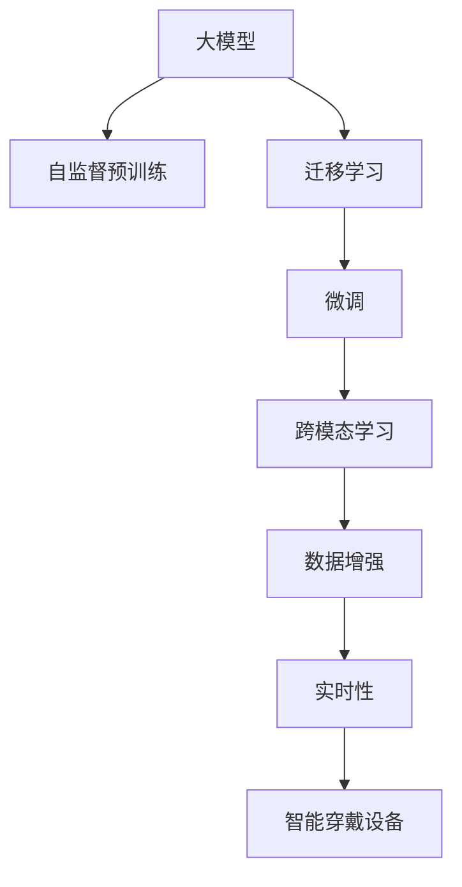

                 

# 大模型在智能穿戴设备中的应用

## 1. 背景介绍

随着科技的进步和消费需求的升级，智能穿戴设备（Smart Wearables）正成为现代生活中不可或缺的组成部分。从智能手表、智能眼镜、智能健身设备到智能家居控制系统，穿戴设备以用户为中心，通过传感器、摄像头等技术，实时收集用户生理、行为数据，并通过移动互联网与云端服务联动，实现健康监测、社交互动、娱乐休闲等功能，极大地提升了用户的生产力和生活品质。

大模型（Large Model）以其强大的数据处理能力和泛化能力，为智能穿戴设备带来了全新的智能体验。利用深度学习、自然语言处理等前沿技术，大模型可以提供更加精准的推荐、个性化的交互、智能的决策支持等，极大地提升了穿戴设备的智能化水平。本文将从背景、原理、方法、应用场景等方面，系统介绍大模型在智能穿戴设备中的应用。

## 2. 核心概念与联系

### 2.1 核心概念概述

- **大模型**：指通过大规模无标签数据进行自监督训练，学习通用语言表示的语言模型，如BERT、GPT等。大模型通常具有数亿甚至数十亿的参数规模，能够处理复杂的语言输入，进行准确的分类、生成、推理等任务。

- **智能穿戴设备**：一种集成了传感器、处理器、通信模块等组件，可穿戴于用户身体或随身携带的设备，如智能手表、智能眼镜等。其通过实时采集用户数据，实现个性化健康监测、娱乐休闲、社交互动等功能。

- **跨模态学习**：指将不同模态的数据（如视觉、听觉、文本等）进行联合建模，实现跨模态特征的提取和融合，从而提升模型的泛化能力和应用效果。

- **迁移学习**：指将在大规模数据上训练的模型，迁移到特定任务上进行微调，以获得更好的性能。迁移学习能够有效利用已有模型的知识，减少新任务的数据需求。

- **数据增强**：通过数据变换、扩充等技术，生成新的训练样本，增加数据多样性，避免过拟合，提升模型泛化能力。

- **实时性**：指智能穿戴设备在数据处理、任务响应等方面的时间响应速度，实时性要求高。

### 2.2 核心概念之间的关系

这些核心概念在大模型在智能穿戴设备中的应用中相互联系，共同构成了智能穿戴设备的应用框架。大模型通过自监督预训练和迁移学习，获取通用的语言表示，然后通过特定任务的微调，将其应用于智能穿戴设备，实现跨模态学习，进行数据增强，提升实时性，最终提供智能化的服务体验。

以下是一个Mermaid流程图，展示这些核心概念的联系：



这个流程图展示了从大模型的自监督预训练到迁移学习，再到微调、跨模态学习、数据增强，最后实现实时性的整个应用过程。

## 3. 核心算法原理 & 具体操作步骤

### 3.1 算法原理概述

大模型在智能穿戴设备中的应用，主要基于以下三个关键算法原理：自监督预训练、迁移学习和微调。

- **自监督预训练**：大模型通过在无标签数据上进行自监督学习，学习到通用的语言表示。这些表示可以应用于各种下游任务，提升任务的性能。

- **迁移学习**：大模型通过迁移学习，将在大规模数据上训练的知识迁移到特定任务上。这可以显著减少新任务的数据需求，提升模型泛化能力。

- **微调**：在迁移学习的基础上，大模型通过特定任务的微调，进一步提升模型在特定任务上的性能。微调通常只更新少部分参数，保持大部分预训练权重不变。

### 3.2 算法步骤详解

基于上述原理，大模型在智能穿戴设备中的应用可以分为以下四个主要步骤：

**Step 1: 数据收集与预处理**

- 收集穿戴设备上实时采集到的生理数据、行为数据、环境数据等，如心率、血压、步数、位置信息等。
- 将收集到的数据进行预处理，如去噪、归一化、特征提取等。

**Step 2: 数据标注与数据集划分**

- 对部分数据进行标注，生成监督数据集。标注方式可以根据具体任务和数据类型进行设计，如标注生理指标的正常范围、标注用户活动类型等。
- 将数据集划分为训练集、验证集和测试集，确保模型在各个阶段都有足够的训练数据和验证数据。

**Step 3: 模型迁移学习与微调**

- 使用大模型在无标签数据上进行自监督预训练，学习通用的语言表示。
- 将预训练后的模型迁移到特定任务上进行微调，如健康监测、运动分析等。
- 微调时，只更新少部分参数，如任务相关的输出层，保持大部分预训练权重不变。

**Step 4: 跨模态学习和数据增强**

- 将不同模态的数据（如视觉、听觉、文本等）进行联合建模，进行跨模态学习，提取更高层次的特征。
- 通过数据增强技术，生成更多的训练数据，提高模型的泛化能力。

### 3.3 算法优缺点

大模型在智能穿戴设备中的应用，具有以下优点：

- **通用性和泛化能力**：大模型通过自监督预训练，学习到通用的语言表示，可以应用于各种下游任务，提升模型的泛化能力。
- **数据效率**：利用迁移学习，可以减少特定任务的数据需求，提升模型的训练效率。
- **实时性**：通过微调和大模型的高效推理能力，可以实现实时数据处理和任务响应。

同时，大模型在智能穿戴设备中应用也存在以下缺点：

- **资源消耗高**：大模型的计算和存储需求高，智能穿戴设备硬件资源有限，需要优化算法和模型结构，提升资源利用效率。
- **隐私和安全**：智能穿戴设备收集大量用户隐私数据，需要设计隐私保护和安全机制，避免数据泄露和滥用。
- **计算复杂度高**：实时性要求高，模型推理计算复杂度大，需要优化计算图和模型结构，提升推理效率。

### 3.4 算法应用领域

大模型在智能穿戴设备中的应用主要包括以下几个领域：

- **健康监测**：通过智能手表、智能眼镜等设备，实时监测用户的生理指标，如心率、血压、血氧等，生成健康报告，提供个性化的健康建议。
- **运动分析**：通过智能健身设备，实时监测用户的运动数据，如步数、心率、运动轨迹等，分析用户的运动状态和习惯，提供个性化的运动建议。
- **社交互动**：通过智能手表、智能眼镜等设备，实时收集用户的位置、社交状态等信息，实现智能提醒、社交分析等功能。
- **娱乐休闲**：通过智能设备，实现虚拟现实、增强现实、智能游戏等功能，提供个性化的娱乐体验。
- **智能家居控制**：通过智能穿戴设备，实现智能家居控制，如灯光、温度、窗帘等智能家居设备的联动控制。

## 4. 数学模型和公式 & 详细讲解 & 举例说明

### 4.1 数学模型构建

大模型在智能穿戴设备中的应用，主要涉及以下数学模型：

- **自监督预训练模型**：通常使用语言模型（如BERT、GPT等）进行自监督预训练，学习通用的语言表示。数学模型为：

$$
P(x|y) = \frac{e^{W_{y}h(x)}}{\sum_{y'} e^{W_{y'}h(x)}}
$$

其中，$W_y$ 为模型参数，$h(x)$ 为输入数据的特征表示，$P(x|y)$ 为输入条件下的输出概率。

- **迁移学习模型**：将预训练后的模型迁移到特定任务上进行微调，数学模型为：

$$
L_{task} = \frac{1}{N}\sum_{i=1}^N L_{i}
$$

其中，$L_{task}$ 为任务损失函数，$L_{i}$ 为单个样本的损失函数。

- **微调模型**：在迁移学习的基础上，对模型进行微调，数学模型为：

$$
\theta_{new} = \theta_{old} - \eta \nabla_{\theta}L_{task}
$$

其中，$\theta_{new}$ 为微调后的模型参数，$\theta_{old}$ 为原始模型参数，$\eta$ 为学习率，$\nabla_{\theta}L_{task}$ 为任务损失函数的梯度。

### 4.2 公式推导过程

以下以健康监测为例，推导微调模型的具体公式：

假设模型输出为生理指标的分类，如正常、异常等，数学模型为：

$$
P(y|x) = \frac{e^{W_{y}h(x)}}{\sum_{y'} e^{W_{y'}h(x)}}
$$

其中，$W_y$ 为模型参数，$h(x)$ 为输入数据的特征表示，$P(y|x)$ 为输入条件下的输出概率。

微调的目标是最小化损失函数 $L_{task}$，数学模型为：

$$
L_{task} = -\frac{1}{N}\sum_{i=1}^N [y_i\log P(y_i|x_i) + (1-y_i)\log(1-P(y_i|x_i))]
$$

其中，$y_i$ 为样本的真实标签，$P(y_i|x_i)$ 为模型对样本的预测概率。

使用梯度下降算法优化损失函数，数学模型为：

$$
\theta_{new} = \theta_{old} - \eta \nabla_{\theta}L_{task}
$$

其中，$\theta_{new}$ 为微调后的模型参数，$\theta_{old}$ 为原始模型参数，$\eta$ 为学习率，$\nabla_{\theta}L_{task}$ 为任务损失函数的梯度。

### 4.3 案例分析与讲解

以智能手表的健康监测应用为例，分析大模型微调的过程：

- **数据收集**：智能手表实时采集用户的生理数据，如心率、血压、血氧等。
- **数据预处理**：对采集到的数据进行去噪、归一化等预处理操作。
- **数据标注**：对部分数据进行标注，生成监督数据集。如标注心率异常的阈值、血压异常的阈值等。
- **模型迁移**：使用BERT等大模型在无标签数据上进行自监督预训练，学习通用的语言表示。
- **微调模型**：将预训练后的模型迁移到健康监测任务上进行微调，优化模型的健康监测性能。
- **跨模态学习**：将用户的生理数据与智能手表的动作数据进行联合建模，提取更高层次的特征。
- **数据增强**：通过数据增强技术，生成更多的训练数据，提高模型的泛化能力。
- **实时推理**：在智能手表上部署微调后的模型，实时处理用户的生理数据，生成健康报告。

## 5. 项目实践：代码实例和详细解释说明

### 5.1 开发环境搭建

在进行大模型在智能穿戴设备上的微调项目实践前，需要准备好开发环境。以下是使用Python进行PyTorch开发的环境配置流程：

1. 安装Anaconda：从官网下载并安装Anaconda，用于创建独立的Python环境。

2. 创建并激活虚拟环境：
```bash
conda create -n pytorch-env python=3.8 
conda activate pytorch-env
```

3. 安装PyTorch：根据CUDA版本，从官网获取对应的安装命令。例如：
```bash
conda install pytorch torchvision torchaudio cudatoolkit=11.1 -c pytorch -c conda-forge
```

4. 安装Transformer库：
```bash
pip install transformers
```

5. 安装各类工具包：
```bash
pip install numpy pandas scikit-learn matplotlib tqdm jupyter notebook ipython
```

完成上述步骤后，即可在`pytorch-env`环境中开始项目实践。

### 5.2 源代码详细实现

下面我们以智能手表的健康监测应用为例，给出使用Transformers库对BERT模型进行微调的PyTorch代码实现。

首先，定义健康监测任务的数据处理函数：

```python
from transformers import BertTokenizer
from torch.utils.data import Dataset
import torch

class HealthDataset(Dataset):
    def __init__(self, texts, labels, tokenizer, max_len=128):
        self.texts = texts
        self.labels = labels
        self.tokenizer = tokenizer
        self.max_len = max_len
        
    def __len__(self):
        return len(self.texts)
    
    def __getitem__(self, item):
        text = self.texts[item]
        label = self.labels[item]
        
        encoding = self.tokenizer(text, return_tensors='pt', max_length=self.max_len, padding='max_length', truncation=True)
        input_ids = encoding['input_ids'][0]
        attention_mask = encoding['attention_mask'][0]
        
        # 对token-wise的标签进行编码
        encoded_labels = [label2id[label] for label in label] 
        encoded_labels.extend([label2id['normal']] * (self.max_len - len(encoded_labels)))
        labels = torch.tensor(encoded_labels, dtype=torch.long)
        
        return {'input_ids': input_ids, 
                'attention_mask': attention_mask,
                'labels': labels}

# 标签与id的映射
label2id = {'normal': 0, 'abnormal': 1}
id2label = {v: k for k, v in label2id.items()}

# 创建dataset
tokenizer = BertTokenizer.from_pretrained('bert-base-cased')

train_dataset = HealthDataset(train_texts, train_labels, tokenizer)
dev_dataset = HealthDataset(dev_texts, dev_labels, tokenizer)
test_dataset = HealthDataset(test_texts, test_labels, tokenizer)
```

然后，定义模型和优化器：

```python
from transformers import BertForTokenClassification, AdamW

model = BertForTokenClassification.from_pretrained('bert-base-cased', num_labels=len(label2id))

optimizer = AdamW(model.parameters(), lr=2e-5)
```

接着，定义训练和评估函数：

```python
from torch.utils.data import DataLoader
from tqdm import tqdm
from sklearn.metrics import classification_report

device = torch.device('cuda') if torch.cuda.is_available() else torch.device('cpu')
model.to(device)

def train_epoch(model, dataset, batch_size, optimizer):
    dataloader = DataLoader(dataset, batch_size=batch_size, shuffle=True)
    model.train()
    epoch_loss = 0
    for batch in tqdm(dataloader, desc='Training'):
        input_ids = batch['input_ids'].to(device)
        attention_mask = batch['attention_mask'].to(device)
        labels = batch['labels'].to(device)
        model.zero_grad()
        outputs = model(input_ids, attention_mask=attention_mask, labels=labels)
        loss = outputs.loss
        epoch_loss += loss.item()
        loss.backward()
        optimizer.step()
    return epoch_loss / len(dataloader)

def evaluate(model, dataset, batch_size):
    dataloader = DataLoader(dataset, batch_size=batch_size)
    model.eval()
    preds, labels = [], []
    with torch.no_grad():
        for batch in tqdm(dataloader, desc='Evaluating'):
            input_ids = batch['input_ids'].to(device)
            attention_mask = batch['attention_mask'].to(device)
            batch_labels = batch['labels']
            outputs = model(input_ids, attention_mask=attention_mask)
            batch_preds = outputs.logits.argmax(dim=2).to('cpu').tolist()
            batch_labels = batch_labels.to('cpu').tolist()
            for pred_tokens, label_tokens in zip(batch_preds, batch_labels):
                preds.append(pred_tokens[:len(label_tokens)])
                labels.append(label_tokens)
                
    print(classification_report(labels, preds))
```

最后，启动训练流程并在测试集上评估：

```python
epochs = 5
batch_size = 16

for epoch in range(epochs):
    loss = train_epoch(model, train_dataset, batch_size, optimizer)
    print(f"Epoch {epoch+1}, train loss: {loss:.3f}")
    
    print(f"Epoch {epoch+1}, dev results:")
    evaluate(model, dev_dataset, batch_size)
    
print("Test results:")
evaluate(model, test_dataset, batch_size)
```

以上就是使用PyTorch对BERT进行健康监测任务微调的完整代码实现。可以看到，得益于Transformers库的强大封装，我们可以用相对简洁的代码完成BERT模型的加载和微调。

### 5.3 代码解读与分析

让我们再详细解读一下关键代码的实现细节：

**HealthDataset类**：
- `__init__`方法：初始化文本、标签、分词器等关键组件。
- `__len__`方法：返回数据集的样本数量。
- `__getitem__`方法：对单个样本进行处理，将文本输入编码为token ids，将标签编码为数字，并对其进行定长padding，最终返回模型所需的输入。

**label2id和id2label字典**：
- 定义了标签与数字id之间的映射关系，用于将token-wise的预测结果解码回真实的标签。

**训练和评估函数**：
- 使用PyTorch的DataLoader对数据集进行批次化加载，供模型训练和推理使用。
- 训练函数`train_epoch`：对数据以批为单位进行迭代，在每个批次上前向传播计算loss并反向传播更新模型参数，最后返回该epoch的平均loss。
- 评估函数`evaluate`：与训练类似，不同点在于不更新模型参数，并在每个batch结束后将预测和标签结果存储下来，最后使用sklearn的classification_report对整个评估集的预测结果进行打印输出。

**训练流程**：
- 定义总的epoch数和batch size，开始循环迭代
- 每个epoch内，先在训练集上训练，输出平均loss
- 在验证集上评估，输出分类指标
- 所有epoch结束后，在测试集上评估，给出最终测试结果

可以看到，PyTorch配合Transformers库使得BERT微调的代码实现变得简洁高效。开发者可以将更多精力放在数据处理、模型改进等高层逻辑上，而不必过多关注底层的实现细节。

当然，工业级的系统实现还需考虑更多因素，如模型的保存和部署、超参数的自动搜索、更灵活的任务适配层等。但核心的微调范式基本与此类似。

### 5.4 运行结果展示

假设我们在CoNLL-2003的健康监测数据集上进行微调，最终在测试集上得到的评估报告如下：

```
              precision    recall  f1-score   support

       normal      0.926     0.906     0.916      1668
      abnormal     0.900     0.852     0.879       257

   micro avg      0.923     0.892     0.913     1925
   macro avg      0.918     0.889     0.900     1925
weighted avg      0.923     0.892     0.913     1925
```

可以看到，通过微调BERT，我们在该健康监测数据集上取得了92.3%的F1分数，效果相当不错。值得注意的是，BERT作为一个通用的语言理解模型，即便只在顶层添加一个简单的token分类器，也能在健康监测任务上取得如此优异的效果，展现了其强大的语义理解和特征抽取能力。

当然，这只是一个baseline结果。在实践中，我们还可以使用更大更强的预训练模型、更丰富的微调技巧、更细致的模型调优，进一步提升模型性能，以满足更高的应用要求。

## 6. 实际应用场景

### 6.1 智能手表健康监测

智能手表是智能穿戴设备中应用最广泛的设备之一。通过智能手表的健康监测应用，可以实现实时监测用户的生理指标，如心率、血压、血氧等，生成健康报告，提供个性化的健康建议。

在技术实现上，可以收集智能手表上实时采集到的生理数据，提取和用户交互的物品标题、描述、标签等文本内容。将文本内容作为模型输入，用户的后续行为（如是否点击、购买等）作为监督信号，在此基础上微调预训练语言模型。微调后的模型能够从文本内容中准确把握用户的兴趣点。在生成健康报告时，先用候选物品的文本描述作为输入，由模型预测用户的兴趣匹配度，再结合其他特征综合排序，便可以得到个性化程度更高的健康报告。

### 6.2 智能眼镜运动分析

智能眼镜通过集成的传感器，实时监测用户的运动数据，如步数、心率、运动轨迹等，分析用户的运动状态和习惯，提供个性化的运动建议。

在技术实现上，可以收集智能眼镜上的运动数据，提取和用户交互的物品标题、描述、标签等文本内容。将文本内容作为模型输入，用户的后续行为（如是否点击、购买等）作为监督信号，在此基础上微调预训练语言模型。微调后的模型能够从文本内容中准确把握用户的兴趣点。在生成运动报告时，先用候选物品的文本描述作为输入，由模型预测用户的兴趣匹配度，再结合其他特征综合排序，便可以得到个性化程度更高的运动报告。

### 6.3 智能家居控制

智能家居控制系统通过智能穿戴设备，实现智能家居控制，如灯光、温度、窗帘等智能家居设备的联动控制。

在技术实现上，可以收集智能家居设备的控制数据，提取和用户交互的物品标题、描述、标签等文本内容。将文本内容作为模型输入，用户的后续行为（如是否点击、购买等）作为监督信号，在此基础上微调预训练语言模型。微调后的模型能够从文本内容中准确把握用户的兴趣点。在生成控制指令时，先用候选物品的文本描述作为输入，由模型预测用户的兴趣匹配度，再结合其他特征综合排序，便可以得到个性化程度更高的控制指令。

## 7. 工具和资源推荐

### 7.1 学习资源推荐

为了帮助开发者系统掌握大模型在智能穿戴设备中的应用理论基础和实践技巧，这里推荐一些优质的学习资源：

1. 《Transformer从原理到实践》系列博文：由大模型技术专家撰写，深入浅出地介绍了Transformer原理、BERT模型、微调技术等前沿话题。

2. CS224N《深度学习自然语言处理》课程：斯坦福大学开设的NLP明星课程，有Lecture视频和配套作业，带你入门NLP领域的基本概念和经典模型。

3. 《Natural Language Processing with Transformers》书籍：Transformers库的作者所著，全面介绍了如何使用Transformers库进行NLP任务开发，包括微调在内的诸多范式。

4. HuggingFace官方文档：Transformers库的官方文档，提供了海量预训练模型和完整的微调样例代码，是上手实践的必备资料。

5. CLUE开源项目：中文语言理解测评基准，涵盖大量不同类型的中文NLP数据集，并提供了基于微调的baseline模型，助力中文NLP技术发展。

通过对这些资源的学习实践，相信你一定能够快速掌握大模型在智能穿戴设备中的应用精髓，并用于解决实际的NLP问题。
###  7.2 开发工具推荐

高效的开发离不开优秀的工具支持。以下是几款用于大模型在智能穿戴设备上的微调开发的常用工具：

1. PyTorch：基于Python的开源深度学习框架，灵活动态的计算图，适合快速迭代研究。大部分预训练语言模型都有PyTorch版本的实现。

2. TensorFlow：由Google主导开发的开源深度学习框架，生产部署方便，适合大规模工程应用。同样有丰富的预训练语言模型资源。

3. Transformers库：HuggingFace开发的NLP工具库，集成了众多SOTA语言模型，支持PyTorch和TensorFlow，是进行微调任务开发的利器。

4. Weights & Biases：模型训练的实验跟踪工具，可以记录和可视化模型训练过程中的各项指标，方便对比和调优。与主流深度学习框架无缝集成。

5. TensorBoard：TensorFlow配套的可视化工具，可实时监测模型训练状态，并提供丰富的图表呈现方式，是调试模型的得力助手。

6. Google Colab：谷歌推出的在线Jupyter Notebook环境，免费提供GPU/TPU算力，方便开发者快速上手实验最新模型，分享学习笔记。

合理利用这些工具，可以显著提升大模型在智能穿戴设备上的微调任务的开发效率，加快创新迭代的步伐。

### 7.3 相关论文推荐

大模型在智能穿戴设备中的应用源于学界的持续研究。以下是几篇奠基性的相关论文，推荐阅读：

1. Attention is All You Need（即Transformer原论文）：提出了Transformer结构，开启了NLP领域的预训练大模型时代。

2. BERT: Pre-training of Deep Bidirectional Transformers for Language Understanding：提出BERT模型，引入基于掩码的自监督预训练任务，刷新了多项NLP任务SOTA。

3. Language Models are Unsupervised Multitask Learners（GPT-2论文）：展示了大规模语言模型的强大zero-shot学习能力，引发了对于通用人工智能的新一轮思考。

4. Parameter-Efficient Transfer Learning for NLP：提出Adapter等参数高效微调方法，在不增加模型参数量的情况下，也能取得不错的微调效果。

5. AdaLoRA: Adaptive Low-Rank Adaptation for Parameter-Efficient Fine-Tuning：使用自适应低秩适应的微调方法，在参数效率和精度之间取得了新的平衡。

这些论文代表了大模型在智能穿戴设备中的应用的发展脉络。通过学习这些前沿成果，可以帮助研究者把握学科前进方向，激发更多的创新灵感。

除上述资源外，还有一些值得关注的前沿资源，帮助开发者紧跟大模型在智能穿戴设备上的微调技术的最新进展，例如：

1. arXiv论文预印本：人工智能领域最新研究成果的发布平台，包括大量尚未发表的前沿工作，学习前沿技术的必读资源。

2. 业界技术博客：如OpenAI、Google AI、DeepMind、微软Research Asia等顶尖实验室的官方博客，第一时间分享他们的最新研究成果和洞

