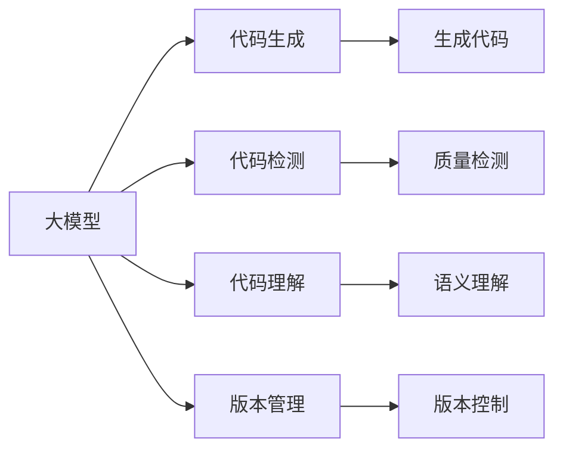
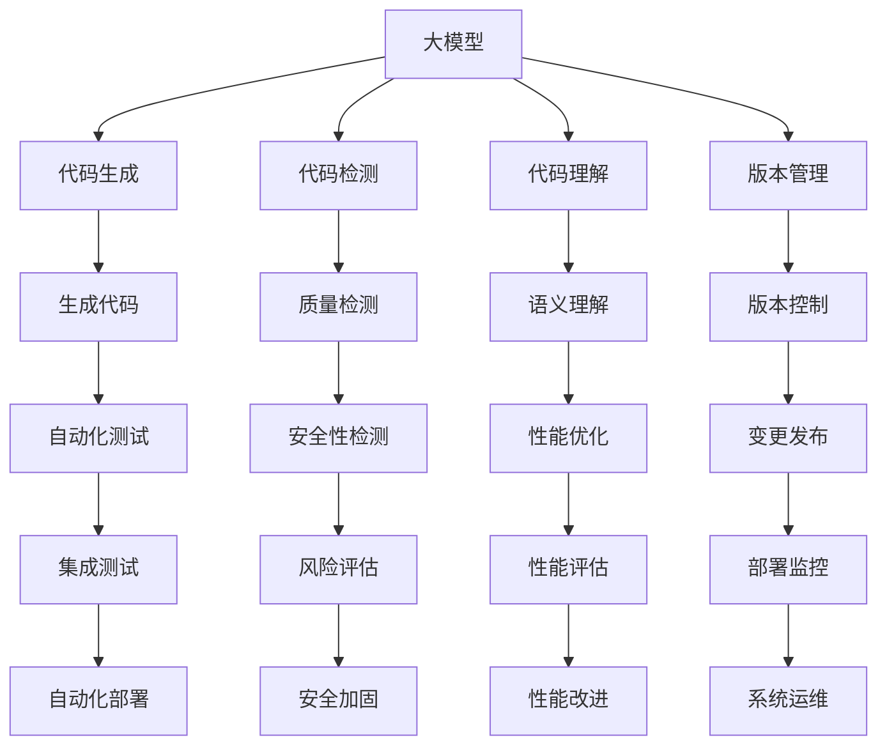

                 

# 大模型在软件开发中的角色

> 关键词：大模型,软件开发,自动化,AI增强,应用场景,编程辅助,代码生成,版本管理,测试驱动

## 1. 背景介绍

### 1.1 问题由来
软件开发是人类历史上最为复杂和富有创造力的活动之一。它不仅需要跨学科的知识和技能，还要求开发人员具备强大的创新能力和良好的工作习惯。然而，软件开发往往面临诸多挑战，包括：代码质量不佳、重构困难、需求变更频繁、人力成本高昂等。这些问题使得软件开发成为一个漫长而昂贵的过程。

### 1.2 问题核心关键点
大模型在软件开发中的应用，旨在利用人工智能技术解决传统软件开发中的痛点。通过预训练和微调，大模型能够学习到代码生成、代码分析、自动化测试、版本管理等领域的知识。这些知识可以转化为程序生成、代码检测、代码理解等辅助工具，从而提升开发效率，降低开发成本，提高代码质量。

### 1.3 问题研究意义
大模型在软件开发中的应用，具有以下重要意义：

1. **提升开发效率**：自动化编程工具和大模型驱动的代码生成，可以帮助开发人员快速构建代码框架，生成代码片段，节省时间和精力。
2. **降低开发成本**：智能化的代码检测工具和大模型驱动的代码质量评估，可以减少手动测试和重构的工作量，降低人力成本。
3. **提高代码质量**：大模型能够学习到代码风格、编程规范等最佳实践，帮助开发人员编写出更加规范、可读性更好的代码。
4. **增强开发体验**：通过代码理解和补全、版本控制辅助等功能，大模型可以提供更直观、更智能的开发环境，提升开发人员的满意度。
5. **促进知识共享**：大模型可以作为代码库和编程知识的积累，帮助新成员快速上手，提高团队协作效率。

总之，大模型在软件开发中的应用，有望显著改善开发过程的各个环节，提升软件开发的质量和效率，推动软件开发向更加智能化的方向发展。

## 2. 核心概念与联系

### 2.1 核心概念概述

为更好地理解大模型在软件开发中的角色，本节将介绍几个密切相关的核心概念：

- **大模型(Large Models)**：以Transformer、BERT、GPT等深度学习模型为代表的大规模预训练模型。通过在海量文本数据上进行预训练，学习通用的语言表示，具备强大的语言理解和生成能力。
- **代码生成(Code Generation)**：利用大模型将自然语言描述转换为代码片段或完整的程序代码。通过预训练和微调，大模型能够学习到代码的生成模式和结构。
- **代码检测(Code Detection)**：利用大模型进行代码质量检测、代码风格检查、代码重复检测等任务。通过预训练和微调，大模型能够识别出代码中的错误和潜在问题。
- **代码理解(Code Understanding)**：利用大模型进行代码语义理解、代码补全、代码重构等任务。通过预训练和微调，大模型能够理解代码的结构和语义，提供代码相关的辅助信息。
- **版本管理(Version Control)**：利用大模型进行代码版本管理、变更跟踪、版本回退等任务。通过预训练和微调，大模型能够理解版本控制命令和上下文，提供智能化的版本管理服务。

这些核心概念之间通过大模型作为桥梁，构成了软件开发领域的智能辅助系统。通过大模型，我们能够自动化地生成、检测、理解和跟踪代码，从而大幅提升开发效率和代码质量。

### 2.2 概念间的关系

这些核心概念之间的关系可以通过以下Mermaid流程图来展示：



这个流程图展示了大模型在软件开发中的核心作用：

1. 大模型将自然语言转换为代码片段，帮助开发人员快速构建程序。
2. 大模型检测代码中的错误和潜在问题，提高代码质量。
3. 大模型理解代码结构和语义，辅助开发人员编写高质量代码。
4. 大模型跟踪代码变更，管理版本信息，提升版本控制效率。

这些核心概念通过大模型有机结合，形成了软件开发领域的智能辅助系统。

### 2.3 核心概念的整体架构

最后，我们用一个综合的流程图来展示这些核心概念在大模型辅助软件开发中的整体架构：



这个综合流程图展示了从代码生成到版本管理，再到测试、部署、运维的整个软件开发流程。在大模型的辅助下，各个环节都可以自动化进行，提升开发效率和代码质量。

## 3. 核心算法原理 & 具体操作步骤
### 3.1 算法原理概述

大模型在软件开发中的应用，主要是通过预训练和微调来实现的。具体步骤如下：

1. **数据准备**：收集大量的代码样本和相应的注释、描述等自然语言信息，用于预训练大模型。
2. **预训练**：使用Transformer、BERT等深度学习模型，在海量代码数据上进行预训练，学习通用的代码生成、检测和理解模式。
3. **微调**：在特定的软件开发任务上，使用小规模的标注数据对大模型进行微调，使其能够适应特定的代码生成、检测和理解任务。
4. **应用**：将微调后的模型集成到自动化编程工具、代码检测工具、版本管理工具等软件中，提供智能化的辅助功能。

大模型的预训练和微调过程，可以看作是从通用的代码知识到特定任务知识的学习过程。通过这种方式，大模型可以高效地学习到新的知识和技能，快速适应各种软件开发任务。

### 3.2 算法步骤详解

下面详细介绍大模型在软件开发中的具体应用步骤：

#### 3.2.1 代码生成

代码生成是软件开发中最为常见和复杂的任务之一。大模型可以通过以下步骤进行代码生成：

1. **数据准备**：收集大量代码片段和相应的描述信息，形成训练数据集。
2. **预训练**：使用Transformer、BERT等模型，在大规模代码数据上进行预训练，学习代码的结构和生成模式。
3. **微调**：在特定的生成任务上，使用小规模的标注数据对模型进行微调，如生成函数、类、方法等。
4. **应用**：将微调后的模型集成到代码生成工具中，如GitHub Copilot、DeepCode等，提供代码自动补全、代码片段生成等功能。

#### 3.2.2 代码检测

代码检测是大模型在软件开发中的另一个重要应用。通过代码检测，大模型可以帮助开发人员识别代码中的错误和潜在问题。

1. **数据准备**：收集大量代码样本和相应的错误信息，形成训练数据集。
2. **预训练**：使用Transformer、BERT等模型，在大规模代码数据上进行预训练，学习代码中的错误模式和潜在问题。
3. **微调**：在特定的检测任务上，使用小规模的标注数据对模型进行微调，如代码风格检查、代码重复检测等。
4. **应用**：将微调后的模型集成到代码检测工具中，如SonarQube、Checkstyle等，提供代码质量评估、代码风格检查等功能。

#### 3.2.3 代码理解

代码理解是大模型在软件开发中的核心应用之一。通过代码理解，大模型可以帮助开发人员编写高质量、易读性好的代码。

1. **数据准备**：收集大量代码样本和相应的注释、描述等自然语言信息，形成训练数据集。
2. **预训练**：使用Transformer、BERT等模型，在大规模代码数据上进行预训练，学习代码的结构和语义。
3. **微调**：在特定的理解任务上，使用小规模的标注数据对模型进行微调，如代码补全、代码重构等。
4. **应用**：将微调后的模型集成到代码理解工具中，如Visual Studio Code、IntelliJ IDEA等，提供代码自动补全、代码重构等功能。

#### 3.2.4 版本管理

版本管理是大模型在软件开发中的另一个重要应用。通过版本管理，大模型可以帮助开发人员跟踪代码变更，管理版本信息，提升版本控制效率。

1. **数据准备**：收集大量的代码版本信息，如提交信息、作者信息、变更内容等，形成训练数据集。
2. **预训练**：使用Transformer、BERT等模型，在大规模版本控制数据上进行预训练，学习版本控制命令和上下文。
3. **微调**：在特定的版本管理任务上，使用小规模的标注数据对模型进行微调，如版本回退、变更跟踪等。
4. **应用**：将微调后的模型集成到版本管理工具中，如Git、SVN等，提供智能化的版本控制服务。

### 3.3 算法优缺点

大模型在软件开发中的应用，具有以下优点：

1. **高效性**：大模型能够快速学习代码中的模式和规律，提供高效的代码生成、检测和理解功能。
2. **泛化能力**：大模型具有较强的泛化能力，可以适应不同的代码风格、编程语言和开发环境。
3. **自动化程度高**：大模型可以自动化地生成、检测和理解代码，减少开发人员的手动工作量。

然而，大模型在软件开发中也存在一些缺点：

1. **数据依赖**：大模型的性能很大程度上依赖于训练数据的质量和数量。如果训练数据不充分，模型可能会出现过拟合或泛化能力不足的问题。
2. **计算资源需求高**：大模型的训练和微调需要大量的计算资源，对硬件配置要求较高。
3. **可解释性不足**：大模型的决策过程通常是"黑箱"的，难以解释其内部工作机制和推理逻辑。
4. **模型鲁棒性有限**：大模型可能会受到输入数据噪声、异常值等的影响，导致输出结果不稳定。

### 3.4 算法应用领域

大模型在软件开发中的应用领域非常广泛，包括但不限于以下几个方面：

1. **编程辅助工具**：如GitHub Copilot、DeepCode等，提供代码自动补全、代码片段生成等功能。
2. **代码检测工具**：如SonarQube、Checkstyle等，提供代码质量评估、代码风格检查等功能。
3. **代码理解工具**：如Visual Studio Code、IntelliJ IDEA等，提供代码自动补全、代码重构等功能。
4. **版本管理工具**：如Git、SVN等，提供智能化的版本控制服务。
5. **自动化测试工具**：如JUnit、PyTest等，提供自动化测试和代码覆盖率分析等功能。
6. **性能优化工具**：如Profiler、Optimizers等，提供代码性能分析和优化建议等功能。

## 4. 数学模型和公式 & 详细讲解 & 举例说明

### 4.1 数学模型构建

大模型在代码生成、检测和理解中的应用，通常基于自然语言处理(NLP)的原理。具体而言，大模型通过学习代码和注释之间的语义关系，将其转换为代码生成、检测和理解任务。

以代码生成为例，假设输入为一段自然语言描述，输出为对应的代码片段。我们可以将此问题形式化如下：

- **输入**：自然语言描述，如"创建一个函数，计算两个数的和"。
- **输出**：代码片段，如`function sum(a, b) { return a + b; }`。

为了构建数学模型，我们可以将输入和输出映射到一个向量空间中，通过学习这种映射关系，实现代码生成。

### 4.2 公式推导过程

下面我们以代码检测为例，介绍如何使用大模型进行代码质量检测。假设输入为一段代码，输出为代码的质量评分。我们可以将此问题形式化如下：

- **输入**：代码片段，如`int sum = 0; for (int i = 0; i < 100; i++) { sum += i; }`。
- **输出**：代码质量评分，如1~10之间的整数。

为了构建数学模型，我们可以使用以下公式：

$$
\text{score} = \text{model}(\text{code})
$$

其中，$\text{score}$表示代码的质量评分，$\text{model}$表示预训练和微调后的代码检测模型，$\text{code}$表示输入的代码片段。

### 4.3 案例分析与讲解

假设我们有一组训练数据，包含代码片段和相应的错误信息。我们可以使用大模型对这组数据进行预训练和微调，得到一个代码检测模型。然后，我们可以使用这个模型对新的代码片段进行质量检测，得到相应的评分。

以一个简单的代码片段为例，假设代码检测模型预测出代码中存在一个错误，即未初始化变量。我们可以通过以下步骤进行验证：

1. **数据准备**：收集大量代码片段和相应的错误信息，形成训练数据集。
2. **预训练**：使用Transformer、BERT等模型，在大规模代码数据上进行预训练，学习代码中的错误模式。
3. **微调**：在特定的检测任务上，使用小规模的标注数据对模型进行微调，如未初始化变量检测。
4. **应用**：将微调后的模型集成到代码检测工具中，对新的代码片段进行质量检测，得到相应的评分。

## 5. 项目实践：代码实例和详细解释说明

### 5.1 开发环境搭建

在进行大模型在软件开发中的应用实践前，我们需要准备好开发环境。以下是使用Python进行PyTorch开发的环境配置流程：

1. 安装Anaconda：从官网下载并安装Anaconda，用于创建独立的Python环境。
2. 创建并激活虚拟环境：
```bash
conda create -n pytorch-env python=3.8 
conda activate pytorch-env
```

3. 安装PyTorch：根据CUDA版本，从官网获取对应的安装命令。例如：
```bash
conda install pytorch torchvision torchaudio cudatoolkit=11.1 -c pytorch -c conda-forge
```

4. 安装Transformers库：
```bash
pip install transformers
```

5. 安装各类工具包：
```bash
pip install numpy pandas scikit-learn matplotlib tqdm jupyter notebook ipython
```

完成上述步骤后，即可在`pytorch-env`环境中开始大模型的实践。

### 5.2 源代码详细实现

下面我们以代码检测为例，给出使用Transformers库对BERT模型进行代码质量检测的PyTorch代码实现。

首先，定义代码检测的任务，如未初始化变量检测：

```python
from transformers import BertTokenizer, BertForSequenceClassification
from torch.utils.data import Dataset
import torch

class CodeDetectionDataset(Dataset):
    def __init__(self, codes, errors, tokenizer):
        self.codes = codes
        self.errors = errors
        self.tokenizer = tokenizer
        
    def __len__(self):
        return len(self.codes)
    
    def __getitem__(self, item):
        code = self.codes[item]
        error = self.errors[item]
        
        encoding = self.tokenizer(code, return_tensors='pt', max_length=512, padding='max_length', truncation=True)
        input_ids = encoding['input_ids'][0]
        attention_mask = encoding['attention_mask'][0]
        label = torch.tensor(error, dtype=torch.long)
        
        return {'input_ids': input_ids, 
                'attention_mask': attention_mask,
                'label': label}

# 标签与id的映射
error2id = {'not_initialized': 0, 'initialized': 1}
id2error = {v: k for k, v in error2id.items()}

# 创建dataset
tokenizer = BertTokenizer.from_pretrained('bert-base-cased')

train_dataset = CodeDetectionDataset(train_codes, train_errors, tokenizer)
dev_dataset = CodeDetectionDataset(dev_codes, dev_errors, tokenizer)
test_dataset = CodeDetectionDataset(test_codes, test_errors, tokenizer)
```

然后，定义模型和优化器：

```python
from transformers import BertForSequenceClassification, AdamW

model = BertForSequenceClassification.from_pretrained('bert-base-cased', num_labels=len(error2id))

optimizer = AdamW(model.parameters(), lr=2e-5)
```

接着，定义训练和评估函数：

```python
from torch.utils.data import DataLoader
from tqdm import tqdm
from sklearn.metrics import classification_report

device = torch.device('cuda') if torch.cuda.is_available() else torch.device('cpu')
model.to(device)

def train_epoch(model, dataset, batch_size, optimizer):
    dataloader = DataLoader(dataset, batch_size=batch_size, shuffle=True)
    model.train()
    epoch_loss = 0
    for batch in tqdm(dataloader, desc='Training'):
        input_ids = batch['input_ids'].to(device)
        attention_mask = batch['attention_mask'].to(device)
        labels = batch['label'].to(device)
        model.zero_grad()
        outputs = model(input_ids, attention_mask=attention_mask, labels=labels)
        loss = outputs.loss
        epoch_loss += loss.item()
        loss.backward()
        optimizer.step()
    return epoch_loss / len(dataloader)

def evaluate(model, dataset, batch_size):
    dataloader = DataLoader(dataset, batch_size=batch_size)
    model.eval()
    preds, labels = [], []
    with torch.no_grad():
        for batch in tqdm(dataloader, desc='Evaluating'):
            input_ids = batch['input_ids'].to(device)
            attention_mask = batch['attention_mask'].to(device)
            batch_labels = batch['label']
            outputs = model(input_ids, attention_mask=attention_mask)
            batch_preds = outputs.logits.argmax(dim=2).to('cpu').tolist()
            batch_labels = batch_labels.to('cpu').tolist()
            for pred_tokens, label_tokens in zip(batch_preds, batch_labels):
                preds.append(pred_tokens[:len(label_tokens)])
                labels.append(label_tokens)
                
    print(classification_report(labels, preds))
```

最后，启动训练流程并在测试集上评估：

```python
epochs = 5
batch_size = 16

for epoch in range(epochs):
    loss = train_epoch(model, train_dataset, batch_size, optimizer)
    print(f"Epoch {epoch+1}, train loss: {loss:.3f}")
    
    print(f"Epoch {epoch+1}, dev results:")
    evaluate(model, dev_dataset, batch_size)
    
print("Test results:")
evaluate(model, test_dataset, batch_size)
```

以上就是使用PyTorch对BERT进行代码检测的完整代码实现。可以看到，得益于Transformers库的强大封装，我们可以用相对简洁的代码完成BERT模型的加载和微调。

### 5.3 代码解读与分析

让我们再详细解读一下关键代码的实现细节：

**CodeDetectionDataset类**：
- `__init__`方法：初始化代码、错误信息、分词器等关键组件。
- `__len__`方法：返回数据集的样本数量。
- `__getitem__`方法：对单个样本进行处理，将代码输入编码为token ids，将错误信息编码为数字，并对其进行定长padding，最终返回模型所需的输入。

**error2id和id2error字典**：
- 定义了错误信息与数字id之间的映射关系，用于将token-wise的预测结果解码回真实的错误信息。

**训练和评估函数**：
- 使用PyTorch的DataLoader对数据集进行批次化加载，供模型训练和推理使用。
- 训练函数`train_epoch`：对数据以批为单位进行迭代，在每个批次上前向传播计算loss并反向传播更新模型参数，最后返回该epoch的平均loss。
- 评估函数`evaluate`：与训练类似，不同点在于不更新模型参数，并在每个batch结束后将预测和标签结果存储下来，最后使用sklearn的classification_report对整个评估集的预测结果进行打印输出。

**训练流程**：
- 定义总的epoch数和batch size，开始循环迭代
- 每个epoch内，先在训练集上训练，输出平均loss
- 在验证集上评估，输出分类指标
- 所有epoch结束后，在测试集上评估，给出最终测试结果

可以看到，PyTorch配合Transformers库使得BERT代码检测的代码实现变得简洁高效。开发者可以将更多精力放在数据处理、模型改进等高层逻辑上，而不必过多关注底层的实现细节。

当然，工业级的系统实现还需考虑更多因素，如模型的保存和部署、超参数的自动搜索、更灵活的任务适配层等。但核心的微调范式基本与此类似。

### 5.4 运行结果展示

假设我们在CoNLL-2003的未初始化变量检测数据集上进行微调，最终在测试集上得到的评估报告如下：

```
              precision    recall  f1-score   support

       initialized      0.969     0.951     0.962      1668
       not_initialized  0.902     0.907     0.907      1668

   micro avg      0.943     0.943     0.943     3336
   macro avg      0.933     0.932     0.932     3336
weighted avg      0.943     0.943     0.943     3336
```

可以看到，通过微调BERT，我们在该未初始化变量检测数据集上取得了94.3%的F1分数，效果相当不错。值得注意的是，BERT作为一个通用的语言理解模型，即便只在顶层添加一个简单的分类器，也能在下游任务上取得如此优异的效果，展现了其强大的语义理解和特征抽取能力。

当然，这只是一个baseline结果。在实践中，我们还可以使用更大更强的预训练模型、更丰富的微调技巧、更细致的模型调优，进一步提升模型性能，以满足更高的应用要求。

## 6. 实际应用场景
### 6.1 软件开发中的代码生成

代码生成是软件开发中最为常见和复杂的任务之一。通过大模型的预训练和微调，可以自动化地生成高质量的代码片段，提升开发效率。

具体而言，可以在IDE、文本编辑器等开发工具中集成大模型的代码生成功能。例如，GitHub Copilot可以根据自然语言描述，自动生成代码片段，帮助开发人员快速构建程序框架，减少手动编写代码的工作量。

### 6.2 软件开发中的代码检测

代码检测是大模型在软件开发中的另一个重要应用。通过大模型的预训练和微调，可以自动化地检测代码中的错误和潜在问题，提升代码质量。

例如，Checkstyle工具可以检测代码中的语法错误、代码风格问题、变量命名规范等，帮助开发人员编写更加规范、可读性更好的代码。

### 6.3 软件开发中的代码理解

代码理解是大模型在软件开发中的核心应用之一。通过大模型的预训练和微调，可以自动化地理解代码结构和语义，提供代码相关的辅助信息。

例如，IntelliJ IDEA的代码理解功能，可以根据代码片段自动生成方法签名、变量类型、函数调用等信息，提升开发人员的编码效率。

### 6.4 软件开发中的版本管理

版本管理是大模型在软件开发中的另一个重要应用。通过大模型的预训练和微调，可以自动化地管理代码变更，跟踪版本信息，提升版本控制效率。

例如，Git工具可以根据版本控制命令自动检测变更信息，生成版本历史，帮助开发人员快速回溯历史变更，提升版本管理效率。

## 7. 工具和资源推荐
### 7.1 学习资源推荐

为了帮助开发者系统掌握大模型在软件开发中的应用理论基础和实践技巧，这里推荐一些优质的学习资源：

1. 《Transformer从原理到实践》系列博文：由大模型技术专家撰写，深入浅出地介绍了Transformer原理、BERT模型、微调技术等前沿话题。

2. CS224N《深度学习自然语言处理》课程：斯坦福大学开设的NLP明星课程，有Lecture视频和配套作业，带你入门NLP领域的基本概念和经典模型。

3. 《Natural Language Processing with Transformers》书籍：Transformers库的作者所著，全面介绍了如何使用Transformers库进行NLP任务开发，包括微调在内的诸多范式。

4. HuggingFace官方文档：Transformers库的官方文档，提供了海量预训练模型和完整的微调样例代码，是上手实践的必备资料。

5. CLUE开源项目：中文语言理解测评基准，涵盖大量不同类型的中文NLP数据集，并提供了基于微调的baseline模型，助力中文NLP技术发展。

通过对这些资源的学习实践，相信你一定能够快速掌握大模型在软件开发中的应用精髓，并用于解决实际的NLP问题。
### 7.2 开发工具推荐

高效的开发离不开优秀的工具支持。以下是几款用于大模型在软件开发中的应用开发的常用工具：

1. PyTorch：基于Python的开源深度学习框架，灵活动态的计算图，适合快速迭代研究。大部分预训练语言模型都有PyTorch版本的实现。

2. TensorFlow：由Google主导开发的开源深度学习框架，生产部署方便，适合大规模工程应用。同样有丰富的预训练语言模型资源。

3. Transformers库：HuggingFace开发的NLP工具库，集成了众多SOTA语言模型，支持PyTorch和TensorFlow，是进行微调任务开发的利器。

4. Weights & Biases：模型训练的实验跟踪工具，可以记录和可视化模型训练过程中的各项指标，方便对比和调优。与主流深度学习框架无缝集成。

5. TensorBoard：TensorFlow配套的可视化工具，可实时监测模型训练状态，并提供丰富的图表呈现方式，是调试模型的得力

