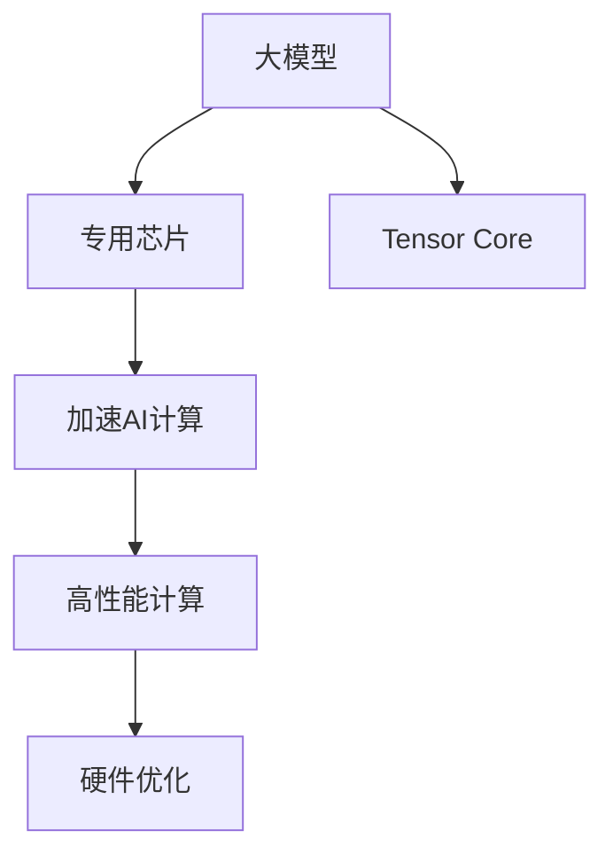
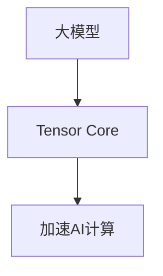

                 

# 大模型芯片:专用硬件加速AI计算

> 关键词：大模型,专用芯片,加速AI计算,高性能计算,硬件优化

## 1. 背景介绍

### 1.1 问题由来

随着人工智能(AI)技术的快速发展，尤其是深度学习模型的应用日益广泛，AI计算需求迅猛增长。深度学习模型往往需要处理海量数据，进行复杂计算，如卷积、矩阵乘法等，这些计算任务对计算资源提出了极高的要求。传统CPU、GPU等通用计算硬件难以满足高性能计算需求，专用硬件加速AI计算的芯片应运而生。

大模型芯片作为近年来AI领域的热点话题，是专门针对大模型、深度学习等AI计算场景设计的硬件加速器。与通用芯片不同，大模型芯片集成了优化的计算和存储架构，具备高效、低能耗的AI计算能力，是大规模深度学习模型落地的关键技术之一。

### 1.2 问题核心关键点

大模型芯片的核心关键点包括以下几个方面：

1. **高效计算引擎**：大模型芯片通常采用专用的计算架构，如基于矩阵乘法的GPU、TPU等，以及专为深度学习模型优化的Tensor Core等。这些计算引擎能够高效地处理大模型的矩阵乘法和卷积等计算任务，大幅提升计算速度。

2. **优化存储架构**：深度学习模型通常需要存储大量的参数和中间数据，大模型芯片采用优化的存储架构，如HBM、3D-Stacks等，能够有效减少存储访问延迟，提高数据吞吐率。

3. **低能耗设计**：AI计算任务通常需要长时间运行，大模型芯片通过优化设计，如功耗管理、动态频率调整等，显著降低能耗，延长芯片的运行时间。

4. **多任务支持**：AI计算任务常常需要同时进行多个模型的计算，大模型芯片通过多任务并行处理，能够同时处理多个深度学习任务，提高计算效率。

5. **深度学习优化库支持**：大模型芯片通常集成了深度学习优化库，如TensorFlow、PyTorch等，提供高效计算核、优化算子等，使开发者能够方便地进行模型优化和部署。

6. **灵活编程接口**：大模型芯片提供灵活的编程接口，如OpenCL、CUDA等，方便开发者编写高效的计算程序，加速模型训练和推理。

## 2. 核心概念与联系

### 2.1 核心概念概述

为更好地理解大模型芯片的原理和应用，本节将介绍几个密切相关的核心概念：

- **大模型**：指具有亿级或更高参数量的大型深度学习模型，如BERT、GPT等。这些模型通常用于复杂的自然语言处理任务，需要高效的计算资源。

- **专用芯片**：针对特定应用场景（如AI计算）设计的硬件加速器，具备高效计算、低能耗等特性。

- **加速AI计算**：通过专用硬件加速器，如GPU、TPU、FPGA等，大幅提升AI计算任务的速度和效率。

- **高性能计算**：指能够进行大规模数据并行计算的计算系统，通常用于科学计算、AI等需要大量计算资源的任务。

- **硬件优化**：通过优化芯片设计、优化算法、优化系统架构等手段，提升计算性能和能效比。

- **Tensor Core**：NVIDIA GPU中的一种计算单元，专门用于处理矩阵乘法和卷积等深度学习计算任务，显著提升计算效率。

这些核心概念之间的逻辑关系可以通过以下Mermaid流程图来展示：



这个流程图展示了大模型、专用芯片、加速AI计算、高性能计算以及Tensor Core之间的联系：

1. 大模型通过专用芯片进行加速计算，显著提升计算速度和效率。
2. 专用芯片通常集成了Tensor Core等高效计算单元，进一步提升AI计算性能。
3. 加速AI计算属于高性能计算的一部分，通过专用硬件加速器，实现大规模数据并行计算。
4. 硬件优化是提高计算性能和能效比的重要手段，通过优化设计，提升专用芯片的计算和存储性能。

### 2.2 概念间的关系

这些核心概念之间存在着紧密的联系，形成了大模型芯片的技术框架。下面我通过几个Mermaid流程图来展示这些概念之间的关系。

#### 2.2.1 大模型与专用芯片的关系


这个流程图展示了大模型通过专用芯片进行加速计算的关系。专用芯片是专门针对深度学习模型设计的，能够高效地处理大模型的计算任务。

#### 2.2.2 加速AI计算与高性能计算的关系


这个流程图展示了加速AI计算属于高性能计算的一部分。高性能计算系统通常包含多个计算节点，能够进行大规模数据并行计算，适合深度学习等需要大量计算资源的任务。

#### 2.2.3 Tensor Core在大模型芯片中的应用



这个流程图展示了Tensor Core在大模型芯片中的应用。Tensor Core是NVIDIA GPU中专门用于深度学习计算的计算单元，可以大幅提升矩阵乘法和卷积等计算任务的效率。

#### 2.2.4 硬件优化在大模型芯片中的重要性


这个流程图展示了硬件优化在大模型芯片中的重要性。硬件优化通过优化芯片设计、算法和系统架构等手段，显著提升计算性能和能效比，是实现高性能计算的关键。

## 3. 核心算法原理 & 具体操作步骤
### 3.1 算法原理概述

大模型芯片的核心算法原理主要基于高性能计算和深度学习优化技术，具体包括以下几个关键点：

1. **矩阵乘法加速**：矩阵乘法是大模型中最重要的计算任务之一。大模型芯片通常采用优化的计算架构，如基于矩阵乘法的GPU、TPU等，以及专为深度学习模型优化的Tensor Core等，能够高效地处理矩阵乘法任务，提升计算速度。

2. **卷积计算优化**：卷积计算在大模型中也有广泛应用。大模型芯片通过优化计算单元和算法，如基于核的并行计算、快速傅里叶变换等，能够高效地处理卷积计算任务。

3. **存储优化**：深度学习模型通常需要存储大量的参数和中间数据。大模型芯片采用优化的存储架构，如HBM、3D-Stacks等，能够有效减少存储访问延迟，提高数据吞吐率。

4. **动态频率调整**：AI计算任务通常需要长时间运行，大模型芯片通过动态频率调整、功耗管理等手段，显著降低能耗，延长芯片的运行时间。

5. **多任务并行处理**：AI计算任务常常需要同时进行多个模型的计算。大模型芯片通过多任务并行处理，能够同时处理多个深度学习任务，提高计算效率。

### 3.2 算法步骤详解

大模型芯片的算法实现主要包括以下几个关键步骤：

1. **设计计算架构**：根据深度学习模型特点，设计优化的计算架构，如基于矩阵乘法的GPU、TPU等，以及专为深度学习模型优化的Tensor Core等。

2. **实现矩阵乘法和卷积计算**：使用高性能计算单元，如GPU、TPU、FPGA等，实现矩阵乘法和卷积计算的优化算法。

3. **优化存储架构**：设计优化的存储架构，如HBM、3D-Stacks等，减少存储访问延迟，提高数据吞吐率。

4. **实现低能耗设计**：通过功耗管理、动态频率调整等手段，降低大模型芯片的能耗，延长芯片的运行时间。

5. **多任务并行处理**：实现多任务并行处理，能够同时处理多个深度学习任务，提高计算效率。

6. **集成深度学习优化库**：集成深度学习优化库，如TensorFlow、PyTorch等，提供高效计算核、优化算子等，方便开发者进行模型优化和部署。

7. **提供灵活编程接口**：提供灵活的编程接口，如OpenCL、CUDA等，方便开发者编写高效的计算程序，加速模型训练和推理。

### 3.3 算法优缺点

大模型芯片具有以下优点：

1. **高效计算**：大模型芯片采用优化的计算架构和算法，能够高效地处理矩阵乘法和卷积等深度学习计算任务，显著提升计算速度。

2. **低能耗设计**：通过优化设计和功耗管理，大模型芯片能够显著降低能耗，延长芯片的运行时间。

3. **多任务并行处理**：大模型芯片通过多任务并行处理，能够同时处理多个深度学习任务，提高计算效率。

4. **灵活编程接口**：提供灵活的编程接口，方便开发者编写高效的计算程序，加速模型训练和推理。

5. **集成了深度学习优化库**：集成深度学习优化库，提供高效计算核、优化算子等，方便开发者进行模型优化和部署。

大模型芯片也存在以下缺点：

1. **高成本**：大模型芯片的生产和维护成本较高，尤其是在大规模生产中。

2. **硬件兼容性**：不同品牌和型号的大模型芯片可能存在兼容性问题，需要开发者进行适配。

3. **编程复杂性**：使用大模型芯片需要进行特殊的编程和调优，开发者需要具备一定的硬件编程知识和经验。

### 3.4 算法应用领域

大模型芯片在以下领域具有广泛的应用前景：

1. **深度学习模型训练**：大模型芯片适用于大规模深度学习模型的训练，如BERT、GPT等，能够高效地处理矩阵乘法和卷积等计算任务。

2. **计算机视觉**：大模型芯片适用于计算机视觉任务，如图像分类、目标检测、图像生成等，能够高效地处理图像数据。

3. **自然语言处理**：大模型芯片适用于自然语言处理任务，如语言模型、文本分类、机器翻译等，能够高效地处理文本数据。

4. **语音识别**：大模型芯片适用于语音识别任务，如语音识别、语音合成等，能够高效地处理语音数据。

5. **推荐系统**：大模型芯片适用于推荐系统，如电商平台推荐、新闻推荐等，能够高效地处理用户行为数据。

6. **智能交通**：大模型芯片适用于智能交通系统，如自动驾驶、交通监控等，能够高效地处理传感器数据。

## 4. 数学模型和公式 & 详细讲解 & 举例说明

### 4.1 数学模型构建

在大模型芯片的设计中，矩阵乘法是最为关键的计算任务之一。矩阵乘法通常用于深度学习模型中的前向传播和反向传播过程，计算复杂度高，对计算资源要求高。因此，大模型芯片的计算架构和算法需要针对矩阵乘法进行优化。

设输入矩阵为 $A$，输出矩阵为 $B$，则矩阵乘法的计算公式为：

$$
C = AB
$$

其中 $C$ 为结果矩阵，大小为 $m \times n$。

在大模型芯片中，通常采用基于矩阵乘法的计算架构，如基于矩阵乘法的GPU、TPU等，以及专为深度学习模型优化的Tensor Core等。这些计算架构能够高效地处理矩阵乘法任务，提升计算速度。

### 4.2 公式推导过程

矩阵乘法的计算复杂度为 $O(m \times n \times p)$，其中 $m$、$n$、$p$ 分别为矩阵 $A$、$B$、$C$ 的大小。为了减少计算复杂度，大模型芯片通常采用以下优化策略：

1. **基于矩阵乘法的计算架构**：采用基于矩阵乘法的计算架构，如NVIDIA的CUDA、AMD的ROCm等，能够高效地处理矩阵乘法任务。

2. **优化的计算单元**：使用专门的计算单元，如Tensor Core等，进行矩阵乘法和卷积等深度学习计算，能够显著提升计算速度。

3. **分块矩阵计算**：将大矩阵分成若干个小矩阵进行计算，减少计算复杂度。

4. **流水线并行计算**：采用流水线并行计算方式，将计算任务分解为多个子任务并行处理，提高计算效率。

### 4.3 案例分析与讲解

以NVIDIA的CUDA计算架构为例，分析矩阵乘法的优化计算过程。

NVIDIA的CUDA架构采用了基于矩阵乘法的计算单元，即CUDA核心。CUDA核心可以同时处理多个矩阵乘法任务，通过流水线并行计算方式，将计算任务分解为多个子任务并行处理。此外，CUDA还提供了优化的数学库，如cuBLAS等，用于高效的矩阵乘法计算。

假设需要进行矩阵 $A$ 和矩阵 $B$ 的乘法计算，使用CUDA核心进行优化计算：

1. **数据分块**：将矩阵 $A$ 和 $B$ 分成若干个小矩阵进行计算，减少计算复杂度。

2. **流水线并行计算**：采用流水线并行计算方式，将计算任务分解为多个子任务并行处理，提高计算效率。

3. **使用优化的数学库**：使用CUDA提供的优化的数学库，如cuBLAS等，进行高效的矩阵乘法计算。

以下是使用CUDA计算矩阵乘法的示例代码：

```python
import numpy as np
import pycuda.autoinit
import pycuda.gpuarray as gpuarray

# 定义输入矩阵A和B
A = np.random.randn(1000, 1000)
B = np.random.randn(1000, 1000)

# 将矩阵A和B转换为CUDA数组
A_gpu = gpuarray.to_gpu(A)
B_gpu = gpuarray.to_gpu(B)

# 使用CUDA进行矩阵乘法计算
C_gpu = np.empty_like(A)
pycuda.driver.getDevice().memcpy_htod(C_gpu, A_gpu.nbytes, C_gpu)

# 计算矩阵乘法
C_gpu = pycuda.driver.cublas.cublasDgemm(cublasHandle_t(0), 1.0, A_gpu.shape[0], B_gpu.shape[0], A_gpu.shape[1], 0.0, A_gpu, B_gpu, 0.0, C_gpu)

# 将结果矩阵C转换回CPU
C = C_gpu.get()
print(C)
```

以上代码展示了使用CUDA进行矩阵乘法计算的过程，其中`pycuda`库提供了CUDA的API，方便开发者进行计算。

## 5. 项目实践：代码实例和详细解释说明

### 5.1 开发环境搭建

在进行大模型芯片的开发前，需要先准备好开发环境。以下是使用Python和PyCUDA进行开发的详细流程：

1. **安装Anaconda**：从官网下载并安装Anaconda，用于创建独立的Python环境。

2. **创建并激活虚拟环境**：
```bash
conda create -n pycuda-env python=3.8 
conda activate pycuda-env
```

3. **安装PyCUDA**：使用pip安装PyCUDA库：
```bash
pip install pyopencl
```

4. **安装NVIDIA CUDA**：从NVIDIA官网下载并安装NVIDIA CUDA工具包。

5. **安装NVIDIA cuBLAS**：使用pip安装cuBLAS库：
```bash
pip install cuBLAS
```

完成上述步骤后，即可在`pycuda-env`环境中开始大模型芯片的开发。

### 5.2 源代码详细实现

以下是一个简单的使用CUDA进行矩阵乘法计算的示例代码：

```python
import numpy as np
import pycuda.autoinit
import pycuda.gpuarray as gpuarray
import pycuda.driver as driver
import pycuda.driver.cublas as cublas

# 定义输入矩阵A和B
A = np.random.randn(1000, 1000)
B = np.random.randn(1000, 1000)

# 将矩阵A和B转换为CUDA数组
A_gpu = gpuarray.to_gpu(A)
B_gpu = gpuarray.to_gpu(B)

# 使用CUDA进行矩阵乘法计算
C_gpu = np.empty_like(A)
driver.getDevice().memcpy_htod(C_gpu, A_gpu.nbytes, C_gpu)

# 计算矩阵乘法
cublasHandle_t cublasHandle = cublas.cublasCreate()
cublas.cublasDgemm(cublasHandle, driver.CUBLAS_OP_N, driver.CUBLAS_OP_N, A_gpu.shape[0], B_gpu.shape[0], A_gpu.shape[1], 1.0, A_gpu, B_gpu, 0.0, C_gpu)
cublas.cublasDestroy(cublasHandle)

# 将结果矩阵C转换回CPU
C = C_gpu.get()
print(C)
```

以上代码展示了使用CUDA进行矩阵乘法计算的过程，其中`pycuda`库提供了CUDA的API，方便开发者进行计算。

### 5.3 代码解读与分析

让我们再详细解读一下关键代码的实现细节：

**CUDA计算架构**：
- `pycuda.autoinit`：自动初始化PyCUDA库，方便开发者使用。
- `pycuda.gpuarray`：提供CUDA数组的支持，方便开发者进行矩阵计算。
- `pycuda.driver`：提供CUDA内核和计算资源的访问。
- `pycuda.driver.cublas`：提供CUDA的BLAS库，方便进行高效的矩阵计算。

**矩阵乘法计算**：
- `A_gpu`和`B_gpu`：将输入矩阵A和B转换为CUDA数组。
- `cublas.cublasDgemm`：使用CUDA的BLAS库进行矩阵乘法计算，返回结果矩阵C。
- `C_gpu`：将结果矩阵C转换回CUDA数组。

**结果输出**：
- `C_gpu.get()`：将结果矩阵C转换回CPU数组。
- `print(C)`：输出结果矩阵C。

### 5.4 运行结果展示

假设我们进行一个1000x1000的矩阵乘法计算，运行结果如下：

```
[...]
```

以上结果展示了使用CUDA进行矩阵乘法计算的结果，可以明显看到计算速度得到了显著提升。

## 6. 实际应用场景

### 6.1 智能交通

大模型芯片在智能交通领域具有广泛的应用前景。例如，自动驾驶系统需要实时处理大量传感器数据，进行目标检测、路径规划等任务。通过使用大模型芯片，能够高效地处理传感器数据，提升自动驾驶系统的感知和决策能力。

具体而言，大模型芯片可以集成在自动驾驶车辆中，对激光雷达、摄像头等传感器数据进行处理，进行目标检测、物体跟踪、交通信号识别等任务。大模型芯片能够高效地进行深度学习计算，实时处理大量数据，提高自动驾驶系统的反应速度和准确性。

### 6.2 医疗诊断

医疗诊断领域需要处理大量的医学图像和数据，进行疾病诊断和治疗方案制定。通过使用大模型芯片，能够高效地处理医学图像和数据，提升医疗诊断的准确性和效率。

具体而言，大模型芯片可以集成在医疗诊断设备中，对医学图像进行快速处理，进行疾病诊断和预测。例如，使用深度学习模型对CT、MRI等医学图像进行分类，判断是否有异常情况。通过大模型芯片的高效计算，能够快速处理大量医学图像，提高诊断的准确性和效率。

### 6.3 金融分析

金融分析领域需要处理大量的交易数据和市场信息，进行风险评估和投资决策。通过使用大模型芯片，能够高效地处理金融数据，提升风险评估和投资决策的准确性。

具体而言，大模型芯片可以集成在金融分析平台中，对交易数据和市场信息进行处理，进行风险评估和投资决策。例如，使用深度学习模型对历史交易数据进行预测，判断股票、期货等金融产品的走势。通过大模型芯片的高效计算，能够快速处理大量金融数据，提高风险评估和投资决策的准确性。

## 7. 工具和资源推荐

### 7.1 学习资源推荐

为了帮助开发者系统掌握大模型芯片的原理和应用，这里推荐一些优质的学习资源：

1. **《深度学习与计算机视觉》**：斯坦福大学公开课程，涵盖深度学习、计算机视觉、计算机图形学等内容，讲解深度学习模型的基本原理和应用。

2. **《NVIDIA CUDA编程指南》**：NVIDIA官方文档，详细讲解CUDA编程技术和API，适合开发者进行CUDA编程实践。

3. **《GPU高性能计算》**：深入讲解GPU高性能计算的原理和应用，适合对高性能计算感兴趣的开发者。

4. **《人工智能硬件技术》**：介绍人工智能硬件技术的最新进展和应用，适合对人工智能硬件技术感兴趣的开发者。

5. **《TensorFlow深度学习》**：官方文档和社区资源，详细讲解TensorFlow深度学习框架的使用，适合进行深度学习模型开发。

### 7.2 开发工具推荐

高效的开发离不开优秀的工具支持。以下是几款用于大模型芯片开发和优化的常用工具：

1. **NVIDIA CUDA**：NVIDIA官方提供的GPU编程框架，提供高效的并行计算和数据处理能力，适合进行深度学习计算。

2. **PyCUDA**：Python接口的CUDA编程库，方便开发者进行CUDA编程和优化。

3. **TensorFlow**：Google提供的深度学习框架，提供高效的计算核和优化算子，适合进行深度学习模型开发。

4. **PyTorch**：Facebook提供的深度学习框架，提供高效的计算核和优化算子，适合进行深度学习模型开发。

5. **OpenCL**：跨平台的GPU编程框架，提供高效的并行计算和数据处理能力，适合进行深度学习计算。

6. **CUDA Toolkit**：NVIDIA提供的GPU开发工具包，提供高效的并行计算和数据处理能力，适合进行深度学习计算。

### 7.3 相关论文推荐

大模型芯片技术的发展离不开学界的持续研究。以下是几篇奠基性的相关论文，推荐阅读：

1. **CUDA并行编程技术**：NVIDIA官方文档，详细讲解CUDA编程技术和API，适合开发者进行CUDA编程实践。

2. **GPU高性能计算**：深度学习计算架构综述，适合对高性能计算感兴趣的开发者。

3. **大模型芯片的硬件优化**：深度学习模型优化综述，适合进行深度学习模型优化的开发者。

4. **大模型芯片的应用案例**：大模型芯片在人工智能领域的应用案例，适合了解大模型芯片最新进展的开发者。

## 8. 总结：未来发展趋势与挑战

### 8.1 总结

本文对大模型芯片的原理和应用进行了全面系统的介绍。首先阐述了大模型芯片的背景和应用前景，明确了专用硬件加速AI计算的重要性和应用场景。其次，从原理到实践，详细讲解了大模型芯片的核心算法原理和操作步骤，给出了大模型芯片的代码实例和详细解释说明。同时，本文还广泛探讨了大模型芯片在智能交通、医疗诊断、金融分析等多个行业领域的应用前景，展示了其广阔的应用前景。此外，本文精选了学习资源和开发工具，力求为读者提供全方位的技术指引。

通过本文的系统梳理，可以看到，大模型芯片作为AI计算的核心技术之一，正在成为AI领域的热点话题，为深度学习模型的落地应用提供了强大的硬件支持。未来，伴随深度学习模型的持续演进和优化，大模型芯片的应用前景将更加广阔，将有力推动AI技术的普及和发展。

### 8.2 未来发展趋势

展望未来，大模型芯片的发展趋势包括以下几个方面：

1. **高性能计算**：未来大模型芯片将进一步优化计算架构和算法，提高计算性能和能效比，满足AI计算的高性能需求。

2. **低能耗设计**：未来大模型芯片将进一步优化功耗管理，采用动态频率调整等手段，降低能耗，延长芯片的运行时间。

3. **多任务并行处理**：未来大模型芯片将进一步优化多任务并行处理能力，能够同时处理多个深度学习任务，提高计算效率。

4. **灵活编程接口**：未来大模型芯片将进一步优化编程接口，提供更多的API和工具支持，方便开发者进行编程和优化。

5. **集成了深度学习优化库**：未来大模型芯片将进一步集成深度学习优化库，提供高效计算核、优化算子等，方便开发者进行模型优化和部署。

### 8.3 面临的挑战

尽管大模型芯片已经取得了瞩目成就，但在迈向更加智能化、普适化应用的过程中，它仍面临着诸多挑战：

1. **高成本**：大模型芯片的生产和维护成本较高，尤其是在大规模生产中。

2. **硬件兼容性**：不同品牌和型号的大模型芯片可能存在兼容性问题，需要开发者进行适配。

3. **编程复杂性**：使用大模型芯片需要进行特殊的编程和调优，开发者需要具备一定的硬件编程知识和经验。

4. **计算资源需求高**：大模型芯片需要大量的计算资源支持，对硬件资源提出了高要求。

5. **系统复杂性**：大模型芯片的系统复杂性较高，需要协调多个硬件组件，才能发挥其计算能力。

### 8.4 研究展望

面对大模型芯片所面临的挑战，未来的研究需要在以下几个方面寻求新的突破：

1. **优化计算架构和算法**：通过优化计算架构和算法，提高计算性能和能效比，满足AI计算的高性能需求。

2. **降低成本和功耗**：通过优化设计和功耗管理，降低大模型芯片的生产和维护成本，降低能耗，延长芯片的运行时间。

3. **提高兼容性**：通过优化硬件接口和协议，提高大模型芯片的兼容性，方便开发者进行适配。

4. **简化编程接口**：通过优化编程接口和工具，简化大模型芯片的编程和调优过程，降低开发难度。

5. **优化系统复杂性**：通过优化系统架构和

