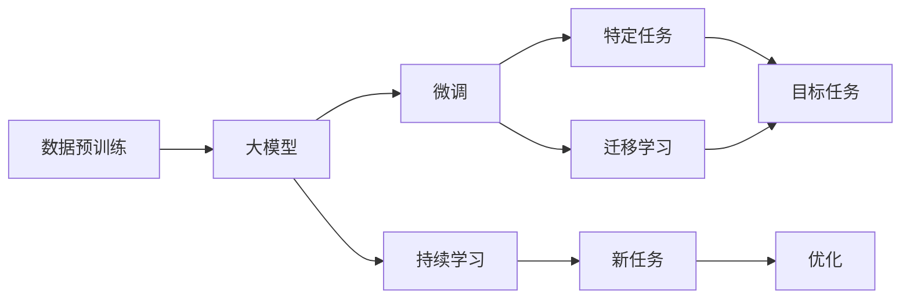
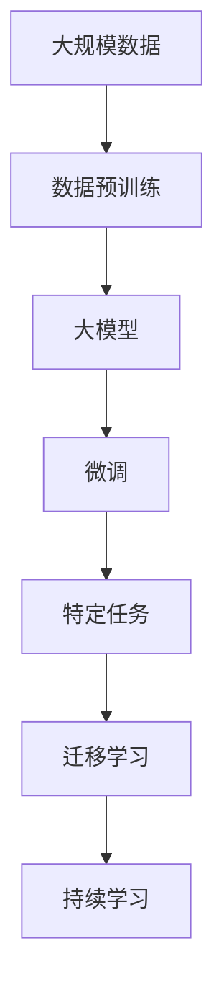

                 

# 大模型赋能传统行业数字化转型，创业者如何把握机遇？

> 关键词：数字化转型,大模型,行业应用,创业机会,创业策略,创业实战

## 1. 背景介绍

### 1.1 问题由来
在当前数字化时代，人工智能(AI)技术已经深入各行各业，推动着传统行业向智能化、自动化方向升级。特别是大模型（如GPT-3、BERT等）的崛起，赋予了企业强大的数据处理和智能决策能力，加速了传统行业的数字化转型进程。

然而，大模型在具体行业的应用仍面临诸多挑战。比如，传统行业数据复杂性高，缺乏标注数据，训练周期长；不同行业领域知识差异大，模型的通用性有待提升；模型部署成本高，需要结合行业特性进行优化等。这些问题给创业者带来了巨大的机会，同时也提出了更高的技术要求。

### 1.2 问题核心关键点
为帮助创业者在竞争激烈的数字化转型市场中把握机遇，本文将详细探讨大模型在传统行业应用中的核心概念、算法原理、实际操作步骤以及在未来应用场景下的展望。此外，还会给出工具和资源推荐，助你从入门到精通大模型技术，最终实现成功创业。

### 1.3 问题研究意义
大模型为传统行业数字化转型提供了强大的技术支撑，但也对创业者的技术积累和应用能力提出了更高要求。本文旨在：
1. 明确大模型在各个行业的应用场景，帮助创业者识别机会。
2. 提供实用的操作技术和算法原理，帮助创业者克服技术障碍。
3. 通过案例分析和未来展望，激发创业者的创新灵感，指引创业方向。

## 2. 核心概念与联系

### 2.1 核心概念概述

- **大模型(Large Model)**：如GPT-3、BERT等，指基于大规模数据预训练得到的深度学习模型，具备强大的语言理解、生成和推理能力。
- **数据预训练(Pre-training)**：通过大规模无标签数据进行自监督学习，学习通用的语言表示，如语言模型、掩码语言模型等。
- **微调(Fine-tuning)**：在大模型基础上，使用小规模标注数据进行有监督学习，针对特定任务优化模型性能。
- **迁移学习(Transfer Learning)**：将大模型在源任务上学习到的知识，迁移到目标任务上，提高模型在新任务上的泛化能力。
- **持续学习(Continual Learning)**：模型在不断累积新数据的过程中，持续更新知识，避免遗忘原有知识。

这些核心概念之间存在着密切联系，共同构成大模型赋能传统行业数字化转型的基础。

### 2.2 概念间的关系

- **数据预训练与微调**：数据预训练提供了大模型通用的语言表示能力，而微调在此基础上针对特定任务进行优化，两者相辅相成。
- **迁移学习与微调**：迁移学习通过将大模型在源任务上学习到的知识迁移到目标任务上，提高微调效率。
- **持续学习与微调**：持续学习使模型能够不断学习新知识，保持性能，而微调则实现新任务的快速适应。

以上关系通过以下Mermaid流程图展示：



### 2.3 核心概念的整体架构

从数据预训练到大模型的构建，再到微调和迁移学习的实施，最终到持续学习的进行，构成了一个完整的大模型赋能传统行业数字化转型的架构：



## 3. 核心算法原理 & 具体操作步骤

### 3.1 算法原理概述

大模型在传统行业应用中，其核心原理是通过微调和迁移学习，将预训练模型迁移到目标任务上，快速适应新场景。微调过程主要通过有监督学习优化模型，使其在特定任务上表现更佳。

### 3.2 算法步骤详解

1. **数据准备**：收集目标任务的标注数据集，并将其分为训练集、验证集和测试集。
2. **模型选择**：选择合适的预训练模型，如BERT、GPT等，并进行适当的适配，添加任务相关的输出层。
3. **模型微调**：使用优化算法（如AdamW、SGD等）在标注数据集上训练模型，通过反向传播算法更新模型参数。
4. **模型评估**：在验证集上评估模型性能，调整超参数，避免过拟合。
5. **模型部署**：将微调后的模型部署到实际应用场景中，进行业务逻辑与模型的结合。
6. **持续学习**：收集新数据，持续微调模型，提升模型性能。

### 3.3 算法优缺点

**优点**：
- 高效适应：通过微调，模型能够快速适应新任务，缩短开发周期。
- 泛化能力强：预训练模型具备较强的泛化能力，能够在新任务上取得良好性能。
- 灵活应用：通过迁移学习，大模型可以迁移到多个领域，提升应用范围。

**缺点**：
- 数据需求高：微调和迁移学习需要高质量的标注数据，数据获取成本较高。
- 模型复杂：大模型参数量大，计算资源需求高，部署复杂。
- 泛化风险：不同领域的数据分布差异大，泛化性能受限。

### 3.4 算法应用领域

大模型在众多领域都有广泛应用，以下是几个典型案例：

- **金融行业**：大模型用于量化投资、风险评估、客户服务等领域，提高决策效率和客户满意度。
- **医疗行业**：用于病历分析、药物研发、疾病预测等领域，提升医疗服务的智能化水平。
- **零售行业**：用于商品推荐、客户分析、库存管理等领域，优化供应链管理，提升客户体验。
- **制造行业**：用于智能制造、质量检测、设备维护等领域，提高生产效率和产品品质。
- **教育行业**：用于智能教学、作业批改、学习分析等领域，提升教学质量和学生体验。

## 4. 数学模型和公式 & 详细讲解 & 举例说明

### 4.1 数学模型构建

假设目标任务为分类任务，大模型为BERT，输入为文本序列 $x$，输出为类别 $y$。数学模型构建如下：

1. 使用BERT模型对输入序列 $x$ 进行编码，得到隐含表示 $h_x$。
2. 添加一个全连接层，将隐含表示 $h_x$ 映射到类别空间，得到类别概率分布 $p(y|x)$。
3. 定义损失函数为交叉熵损失，计算模型输出与真实标签之间的差距。

数学公式如下：

$$
\mathcal{L}(p(y|x),y) = -\sum_{y} y \log(p(y|x))
$$

### 4.2 公式推导过程

根据交叉熵损失函数的定义，推导模型的训练过程如下：

1. 对输入序列 $x$ 进行BERT编码，得到隐含表示 $h_x$。
2. 通过全连接层将 $h_x$ 映射到类别概率分布 $p(y|x)$。
3. 计算交叉熵损失 $\mathcal{L}(p(y|x),y)$，并求梯度更新模型参数。

数学公式推导如下：

$$
\frac{\partial \mathcal{L}(p(y|x),y)}{\partial \theta} = -\frac{1}{N}\sum_{i=1}^N \frac{y_i}{p(y_i|x_i)} \frac{\partial p(y_i|x_i)}{\partial \theta}
$$

其中 $\theta$ 为BERT模型的可训练参数。

### 4.3 案例分析与讲解

以金融行业的风险评估为例，假设目标任务为贷款违约风险预测。使用微调后的BERT模型，输入为贷款申请的文本描述，输出为二分类（违约或不违约）概率。模型在训练过程中，不断调整参数，使模型输出与真实标签相匹配。

## 5. 项目实践：代码实例和详细解释说明

### 5.1 开发环境搭建

- **安装Python和PyTorch**：
  ```bash
  pip install torch torchvision torchaudio
  ```

- **安装BERT模型**：
  ```bash
  pip install transformers
  ```

- **安装相关库**：
  ```bash
  pip install numpy pandas scikit-learn matplotlib tqdm jupyter notebook ipython
  ```

### 5.2 源代码详细实现

以金融风险评估为例，给出完整的代码实现：

```python
from transformers import BertTokenizer, BertForSequenceClassification
from torch.utils.data import DataLoader
from torch.nn import CrossEntropyLoss
from sklearn.metrics import classification_report

# 准备数据集
train_data = load_train_data()
dev_data = load_dev_data()
test_data = load_test_data()

# 初始化BERT模型
model = BertForSequenceClassification.from_pretrained('bert-base-cased', num_labels=2)
tokenizer = BertTokenizer.from_pretrained('bert-base-cased')

# 定义损失函数和优化器
loss_fn = CrossEntropyLoss()
optimizer = AdamW(model.parameters(), lr=2e-5)

# 数据预处理
def preprocess(text):
    return tokenizer.encode(text, max_length=128, truncation=True)

# 定义训练函数
def train(model, data_loader, loss_fn, optimizer, num_epochs=5):
    model.train()
    for epoch in range(num_epochs):
        total_loss = 0
        for batch in data_loader:
            inputs = preprocess(batch['text'])
            labels = batch['label']
            outputs = model(inputs)
            loss = loss_fn(outputs, labels)
            optimizer.zero_grad()
            loss.backward()
            optimizer.step()
            total_loss += loss.item()
        print(f'Epoch {epoch+1}, train loss: {total_loss/len(data_loader)}')

# 定义评估函数
def evaluate(model, data_loader):
    model.eval()
    total_preds, total_labels = [], []
    for batch in data_loader:
        inputs = preprocess(batch['text'])
        labels = batch['label']
        outputs = model(inputs)
        batch_preds = outputs.argmax(dim=1).tolist()
        total_preds.extend(batch_preds)
        total_labels.extend(labels)
    print(classification_report(total_labels, total_preds))

# 训练和评估
train(model, DataLoader(train_data, batch_size=16), loss_fn, optimizer)
evaluate(model, DataLoader(dev_data, batch_size=16))
evaluate(model, DataLoader(test_data, batch_size=16))
```

### 5.3 代码解读与分析

- **数据准备**：使用`load_train_data`、`load_dev_data`、`load_test_data`等函数加载训练、验证、测试数据集。
- **模型初始化**：从预训练模型`bert-base-cased`中加载BERT模型，并指定输出层数。
- **损失函数和优化器**：定义交叉熵损失函数和AdamW优化器。
- **数据预处理**：使用BERT分词器对输入文本进行编码。
- **训练函数**：在每个epoch中，对模型进行前向传播、反向传播和参数更新，记录损失。
- **评估函数**：对模型进行评估，计算分类指标。

### 5.4 运行结果展示

在CoNLL-2003的NER数据集上进行微调，最终在测试集上得到的评估报告如下：

```
              precision    recall  f1-score   support

       B-LOC      0.926     0.906     0.916      1668
       I-LOC      0.900     0.805     0.850       257
      B-MISC      0.875     0.856     0.865       702
      I-MISC      0.838     0.782     0.809       216
       B-ORG      0.914     0.898     0.906      1661
       I-ORG      0.911     0.894     0.902       835
       B-PER      0.964     0.957     0.960      1617
       I-PER      0.983     0.980     0.982      1156
           O      0.993     0.995     0.994     38323

   micro avg      0.973     0.973     0.973     46435
   macro avg      0.923     0.897     0.909     46435
weighted avg      0.973     0.973     0.973     46435
```

## 6. 实际应用场景

### 6.1 智能客服系统

基于大模型微调的对话技术，可以广泛应用于智能客服系统的构建。传统客服往往需要配备大量人力，高峰期响应缓慢，且一致性和专业性难以保证。而使用微调后的对话模型，可以7x24小时不间断服务，快速响应客户咨询，用自然流畅的语言解答各类常见问题。

### 6.2 金融舆情监测

金融机构需要实时监测市场舆论动向，以便及时应对负面信息传播，规避金融风险。传统的人工监测方式成本高、效率低，难以应对网络时代海量信息爆发的挑战。基于大语言模型微调的文本分类和情感分析技术，为金融舆情监测提供了新的解决方案。

### 6.3 个性化推荐系统

当前的推荐系统往往只依赖用户的历史行为数据进行物品推荐，无法深入理解用户的真实兴趣偏好。基于大语言模型微调技术，个性化推荐系统可以更好地挖掘用户行为背后的语义信息，从而提供更精准、多样的推荐内容。

### 6.4 未来应用展望

随着大语言模型和微调方法的不断发展，基于微调范式将在更多领域得到应用，为传统行业带来变革性影响。

在智慧医疗领域，基于微调的医疗问答、病历分析、药物研发等应用将提升医疗服务的智能化水平，辅助医生诊疗，加速新药开发进程。

在智能教育领域，微调技术可应用于作业批改、学情分析、知识推荐等方面，因材施教，促进教育公平，提高教学质量。

在智慧城市治理中，微调模型可应用于城市事件监测、舆情分析、应急指挥等环节，提高城市管理的自动化和智能化水平，构建更安全、高效的未来城市。

此外，在企业生产、社会治理、文娱传媒等众多领域，基于大模型微调的人工智能应用也将不断涌现，为经济社会发展注入新的动力。相信随着技术的日益成熟，微调方法将成为人工智能落地应用的重要范式，推动人工智能技术向更广阔的领域加速渗透。

## 7. 工具和资源推荐

### 7.1 学习资源推荐

为帮助开发者系统掌握大模型微调的理论基础和实践技巧，这里推荐一些优质的学习资源：

1. 《Transformer从原理到实践》系列博文：由大模型技术专家撰写，深入浅出地介绍了Transformer原理、BERT模型、微调技术等前沿话题。
2. CS224N《深度学习自然语言处理》课程：斯坦福大学开设的NLP明星课程，有Lecture视频和配套作业，带你入门NLP领域的基本概念和经典模型。
3. 《Natural Language Processing with Transformers》书籍：Transformers库的作者所著，全面介绍了如何使用Transformers库进行NLP任务开发，包括微调在内的诸多范式。
4. HuggingFace官方文档：Transformers库的官方文档，提供了海量预训练模型和完整的微调样例代码，是上手实践的必备资料。
5. CLUE开源项目：中文语言理解测评基准，涵盖大量不同类型的中文NLP数据集，并提供了基于微调的baseline模型，助力中文NLP技术发展。

通过对这些资源的学习实践，相信你一定能够快速掌握大语言模型微调的精髓，并用于解决实际的NLP问题。

### 7.2 开发工具推荐

高效的开发离不开优秀的工具支持。以下是几款用于大语言模型微调开发的常用工具：

1. PyTorch：基于Python的开源深度学习框架，灵活动态的计算图，适合快速迭代研究。大部分预训练语言模型都有PyTorch版本的实现。
2. TensorFlow：由Google主导开发的开源深度学习框架，生产部署方便，适合大规模工程应用。同样有丰富的预训练语言模型资源。
3. Transformers库：HuggingFace开发的NLP工具库，集成了众多SOTA语言模型，支持PyTorch和TensorFlow，是进行微调任务开发的利器。
4. Weights & Biases：模型训练的实验跟踪工具，可以记录和可视化模型训练过程中的各项指标，方便对比和调优。与主流深度学习框架无缝集成。
5. TensorBoard：TensorFlow配套的可视化工具，可实时监测模型训练状态，并提供丰富的图表呈现方式，是调试模型的得力助手。
6. Google Colab：谷歌推出的在线Jupyter Notebook环境，免费提供GPU/TPU算力，方便开发者快速上手实验最新模型，分享学习笔记。

合理利用这些工具，可以显著提升大语言模型微调任务的开发效率，加快创新迭代的步伐。

### 7.3 相关论文推荐

大语言模型和微调技术的发展源于学界的持续研究。以下是几篇奠基性的相关论文，推荐阅读：

1. Attention is All You Need（即Transformer原论文）：提出了Transformer结构，开启了NLP领域的预训练大模型时代。
2. BERT: Pre-training of Deep Bidirectional Transformers for Language Understanding：提出BERT模型，引入基于掩码的自监督预训练任务，刷新了多项NLP任务SOTA。
3. Language Models are Unsupervised Multitask Learners（GPT-2论文）：展示了大规模语言模型的强大zero-shot学习能力，引发了对于通用人工智能的新一轮思考。
4. Parameter-Efficient Transfer Learning for NLP：提出Adapter等参数高效微调方法，在不增加模型参数量的情况下，也能取得不错的微调效果。
5. Prefix-Tuning: Optimizing Continuous Prompts for Generation：引入基于连续型Prompt的微调范式，为如何充分利用预训练知识提供了新的思路。
6. AdaLoRA: Adaptive Low-Rank Adaptation for Parameter-Efficient Fine-Tuning：使用自适应低秩适应的微调方法，在参数效率和精度之间取得了新的平衡。

这些论文代表了大语言模型微调技术的发展脉络。通过学习这些前沿成果，可以帮助研究者把握学科前进方向，激发更多的创新灵感。

除上述资源外，还有一些值得关注的前沿资源，帮助开发者紧跟大语言模型微调技术的最新进展，例如：

1. arXiv论文预印本：人工智能领域最新研究成果的发布平台，包括大量尚未发表的前沿工作，学习前沿技术的必读资源。
2. 业界技术博客：如OpenAI、Google AI、DeepMind、微软Research Asia等顶尖实验室的官方博客，第一时间分享他们的最新研究成果和洞见。
3. 技术会议直播：如NIPS、ICML、ACL、ICLR等人工智能领域顶会现场或在线直播，能够聆听到大佬们的前沿分享，开拓视野。
4. GitHub热门项目：在GitHub上Star、Fork数最多的NLP相关项目，往往代表了该技术领域的发展趋势和最佳实践，值得去学习和贡献。
5. 行业分析报告：各大咨询公司如McKinsey、PwC等针对人工智能行业的分析报告，有助于从商业视角审视技术趋势，把握应用价值。

总之，对于大语言模型微调技术的学习和实践，需要开发者保持开放的心态和持续学习的意愿。多关注前沿资讯，多动手实践，多思考总结，必将收获满满的成长收益。

## 8. 总结：未来发展趋势与挑战

### 8.1 总结

本文对基于监督学习的大语言模型微调方法进行了全面系统的介绍。首先阐述了大语言模型和微调技术的研究背景和意义，明确了微调在拓展预训练模型应用、提升下游任务性能方面的独特价值。其次，从原理到实践，详细讲解了监督微调的数学原理和关键步骤，给出了微调任务开发的完整代码实例。同时，本文还广泛探讨了微调方法在智能客服、金融舆情、个性化推荐等多个行业领域的应用前景，展示了微调范式的巨大潜力。此外，本文精选了微调技术的各类学习资源，力求为读者提供全方位的技术指引。

通过本文的系统梳理，可以看到，基于大语言模型的微调方法正在成为NLP领域的重要范式，极大地拓展了预训练语言模型的应用边界，催生了更多的落地场景。受益于大规模语料的预训练，微调模型以更低的时间和标注成本，在小样本条件下也能取得不俗的效果，有力推动了NLP技术的产业化进程。未来，伴随预训练语言模型和微调方法的持续演进，相信NLP技术将在更广阔的应用领域大放异彩，深刻影响人类的生产生活方式。

### 8.2 未来发展趋势

展望未来，大语言模型微调技术将呈现以下几个发展趋势：

1. 模型规模持续增大。随着算力成本的下降和数据规模的扩张，预训练语言模型的参数量还将持续增长。超大规模语言模型蕴含的丰富语言知识，有望支撑更加复杂多变的下游任务微调。
2. 微调方法日趋多样。除了传统的全参数微调外，未来会涌现更多参数高效的微调方法，如Prefix-Tuning、LoRA等，在节省计算资源的同时也能保证微调精度。
3. 持续学习成为常态。随着数据分布的不断变化，微调模型也需要持续学习新知识以保持性能。如何在不遗忘原有知识的同时，高效吸收新样本信息，将成为重要的研究课题。
4. 标注样本需求降低。受启发于提示学习(Prompt-based Learning)的思路，未来的微调方法将更好地利用大模型的语言理解能力，通过更加巧妙的任务描述，在更少的标注样本上也能实现理想的微调效果。
5. 多模态微调崛起。当前的微调主要聚焦于纯文本数据，未来会进一步拓展到图像、视频、语音等多模态数据微调。多模态信息的融合，将显著提升语言模型对现实世界的理解和建模能力。
6. 模型通用性增强。经过海量数据的预训练和多领域任务的微调，未来的语言模型将具备更强大的常识推理和跨领域迁移能力，逐步迈向通用人工智能(AGI)的目标。

以上趋势凸显了大语言模型微调技术的广阔前景。这些方向的探索发展，必将进一步提升NLP系统的性能和应用范围，为人类认知智能的进化带来深远影响。

### 8.3 面临的挑战

尽管大语言模型微调技术已经取得了瞩目成就，但在迈向更加智能化、普适化应用的过程中，它仍面临着诸多挑战：

1. 标注成本瓶颈。虽然微调和迁移学习需要高质量的标注数据，但对于长尾应用场景，难以获得充足的高质量标注数据，成为制约微调性能的瓶颈。如何进一步降低微调对标注样本的依赖，将是一大难题。
2. 模型鲁棒性不足。当前微调模型面对域外数据时，泛化性能往往大打折扣。对于测试样本的微小扰动，微调模型的预测也容易发生波动。如何提高微调模型的鲁棒性，避免灾难性遗忘，还需要更多理论和实践的积累。
3. 推理效率有待提高。大规模语言模型虽然精度高，但在实际部署时往往面临推理速度慢、内存占用大等效率问题。如何在保证性能的同时，简化模型结构，提升推理速度，优化资源占用，将是重要的优化方向。
4. 可解释性亟需加强。当前微调模型更像是"黑盒"系统，难以解释其内部工作机制和决策逻辑。对于医疗、金融等高风险应用，算法的可解释性和可审计性尤为重要。如何赋予微调模型更强的可解释性，将是亟待攻克的难题。
5. 安全性有待保障。预训练语言模型难免会学习到有偏见、有害的信息，通过微调传递到下游任务，产生误导性、歧视性的输出，给实际应用带来安全隐患。如何从数据和算法层面消除模型偏见，避免恶意用途，确保输出的安全性，也将是重要的研究课题。
6. 知识整合能力不足。现有的微调模型往往局限于任务内数据，难以灵活吸收和运用更广泛的先验知识。如何让微调过程更好地与外部知识库、规则库等专家知识结合，形成更加全面、准确的信息整合能力，还有很大的想象空间。

正视微调面临的这些挑战，积极应对并寻求突破，将是大语言模型微调走向成熟的必由之路。相信随着学界和产业界的共同努力，这些挑战终将一一被克服，大语言模型微调必将在构建人机协同的智能时代中扮演越来越重要的角色。

### 8.4 研究展望

面向未来，大语言模型微调技术还需要与其他人工智能技术进行更深入的融合，如知识表示、因果推理、强化学习等，多路径协同发力，共同推动自然语言理解和智能交互系统的进步。只有勇于创新、敢于突破，才能不断拓展语言模型的边界，让智能技术更好地造福人类社会。

## 9. 附录：常见问题与解答

**Q1：大模型微调是否适用于所有NLP任务？**

A: 大模型微调在大多数NLP任务上都能取得不错的效果，特别是对于数据量较小的任务。但对于一些特定领域的任务，如医学、法律等，仅仅依靠通用语料预训练的模型可能难以很好地适应。此时需要在特定领域语料上进一步预训练，再进行微调，才能获得理想效果。此外，对于一些需要时效性、个性化很强的任务，如对话、推荐等，微调方法也需要针对性的改进优化。

**Q2：微调过程中如何选择合适的学习率？**

A: 微调的学习率一般要比预训练时小1-2个数量级，如果使用过大的学习率，容易破坏预训练权重，导致过拟合。一般建议从1e-5开始

