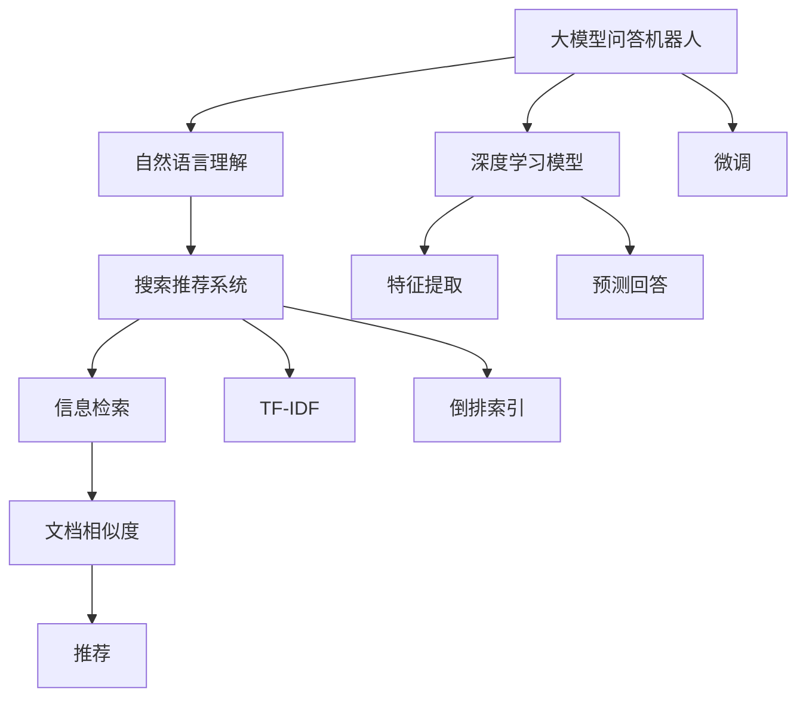

                 

## 1. 背景介绍

随着人工智能技术的快速发展，问答机器人和搜索推荐系统已成为信息检索领域的重要工具，在搜索引擎、客服、金融、电商等多个场景中得到广泛应用。问答机器人通过自然语言理解技术，对用户提出的问题进行分析，并提供简洁明了的答案；搜索推荐系统则通过深度学习算法，在用户搜索行为中挖掘潜在需求，推荐最相关的信息。

问答机器人和搜索推荐系统在处理方式上既有相似之处，又存在显著差异。两者都依赖于自然语言处理(Natural Language Processing, NLP)技术，都需要理解自然语言，并从中提取有用信息。但在具体实现时，二者所采用的模型、算法和应用场景不尽相同。本文将对大模型问答机器人和传统搜索推荐的处理方式进行对比，以期为相关开发人员提供更多思考和启发。

## 2. 核心概念与联系

### 2.1 核心概念概述

在介绍二者的处理方式之前，我们首先梳理一些核心概念：

#### 大模型问答机器人

大模型问答机器人通常采用深度学习模型，如BERT、GPT-3等，在大规模语料上进行预训练，通过微调机制，使其具备强大的语言理解能力。问答机器人根据用户输入的自然语言问题，通过模型预测回答，实现自动化、智能化的信息检索与回答。

#### 传统搜索推荐系统

传统搜索推荐系统主要依赖于信息检索技术，如倒排索引、TF-IDF算法等，通过关键词匹配、文档相似度计算等方法，从语料库中寻找与查询词最相关的文档，并通过相关性排序技术，推荐给用户最相关的结果。

### 2.2 核心概念的关系

大模型问答机器人和传统搜索推荐系统虽然都属于NLP应用领域，但它们在处理方式、数据使用、模型选择等方面存在显著差异。下面我们用Mermaid流程图来展示二者的核心概念和关系：



该图展示了问答机器人和推荐系统的主要处理流程：

- 大模型问答机器人基于深度学习模型，利用自然语言理解技术，实现自然语言到答案的映射。
- 推荐系统则依赖于信息检索技术，通过关键词匹配、文档相似度等方法，推荐最相关的文档信息。

大模型问答机器人和传统搜索推荐系统虽然处理方式不同，但它们都涉及自然语言理解和信息检索技术，能够从海量语料中提取有用信息，满足用户的信息需求。

## 3. 核心算法原理 & 具体操作步骤

### 3.1 算法原理概述

#### 大模型问答机器人

大模型问答机器人主要采用预训练-微调的方式进行训练，其核心算法包括：

- **预训练**：在大规模无标签文本数据上进行预训练，学习通用的语言表示。
- **微调**：根据用户输入的自然语言问题，对预训练模型进行有监督训练，输出相应的答案。

预训练模型通常采用自监督学习任务，如掩码语言模型、下一句预测等，以学习语言的基本结构和语义信息。微调则是在预训练模型的基础上，通过标注数据进行有监督训练，优化模型在特定问答任务上的性能。

#### 传统搜索推荐系统

传统搜索推荐系统主要依赖于信息检索技术，其核心算法包括：

- **信息检索**：根据用户查询，从文档库中检索出相关性最高的文档。
- **TF-IDF**：计算文档和查询之间的相似度，衡量文档的重要性和相关性。
- **倒排索引**：将文档中的每个词构建索引，方便快速检索相关文档。

信息检索算法主要基于关键词匹配和文档相似度计算，通过TF-IDF和倒排索引技术，从文档库中寻找最相关的文档，并将它们推荐给用户。

### 3.2 算法步骤详解

#### 大模型问答机器人

1. **数据准备**：收集并标注大量问答数据，包括问题和答案对，作为微调的监督信号。
2. **模型选择**：选择适合问答任务的预训练模型，如BERT、GPT-3等。
3. **微调训练**：在标注数据上进行微调训练，优化模型在问答任务上的性能。
4. **推理预测**：使用微调后的模型，对用户输入的自然语言问题进行推理预测，生成相应的答案。

#### 传统搜索推荐系统

1. **数据准备**：构建文档库，收集用户查询和相关文档，进行标注和清洗。
2. **TF-IDF计算**：对每个文档进行TF-IDF计算，生成文档特征向量。
3. **倒排索引构建**：构建倒排索引，加速文档检索过程。
4. **信息检索**：根据用户查询，利用倒排索引和TF-IDF计算，检索相关性最高的文档。
5. **推荐排序**：对检索出的文档进行相关性排序，推荐给用户最相关的结果。

### 3.3 算法优缺点

#### 大模型问答机器人

**优点**：

- **语义理解能力强**：大模型通过预训练学习到了丰富的语言知识，具备强大的语义理解能力，能够理解复杂自然语言问题。
- **自动推荐回答**：通过微调，问答机器人能够自动生成答案，避免了人工编写答案的繁琐和延迟。
- **适应性强**：微调后的模型可以适应多种问答任务，无需重新训练。

**缺点**：

- **数据需求量大**：预训练和微调需要大量标注数据，标注成本较高。
- **计算资源消耗大**：大模型通常参数量较大，推理和训练计算资源消耗较大。
- **解释性不足**：大模型作为"黑盒"，缺乏对推理过程的可解释性。

#### 传统搜索推荐系统

**优点**：

- **计算效率高**：信息检索算法简单高效，计算资源消耗较低。
- **可解释性高**：基于关键词匹配的推荐方法，每个文档的相关性可以通过TF-IDF直观展现，可解释性较高。
- **资源消耗低**：文档库较小，计算和存储资源消耗较低。

**缺点**：

- **语义理解能力弱**：信息检索算法主要依赖关键词匹配，难以理解复杂的语义关系。
- **无法自动生成回答**：需要人工编写检索规则和相关性排序算法，效率较低。
- **适应性差**：一旦规则和算法固定，适应新任务或领域需要重新设计和训练。

### 3.4 算法应用领域

#### 大模型问答机器人

大模型问答机器人适用于需要实时自动回答用户的场景，如智能客服、智能问答系统、虚拟助手等。在智能客服中，问答机器人能够自动回答用户咨询，提升客服效率；在智能问答系统中，问答机器人能够提供即时、准确的答案，满足用户查询需求；在虚拟助手中，问答机器人能够提供个性化的服务，提升用户体验。

#### 传统搜索推荐系统

传统搜索推荐系统适用于信息检索需求较高的场景，如搜索引擎、内容推荐系统等。在搜索引擎中，用户输入查询词，系统检索并推荐最相关的网页；在内容推荐系统中，系统根据用户浏览历史，推荐最相关的内容，提升用户满意度。

## 4. 数学模型和公式 & 详细讲解 & 举例说明

### 4.1 数学模型构建

#### 大模型问答机器人

**预训练**：假设预训练模型为 $M_{\theta}$，在大规模无标签文本数据 $D$ 上进行预训练，优化损失函数 $\mathcal{L}_{pre}$。

$$
\theta = \mathop{\arg\min}_{\theta} \mathcal{L}_{pre}(M_{\theta}, D)
$$

**微调**：在问答任务 $T$ 的标注数据集 $D_T$ 上进行微调，优化损失函数 $\mathcal{L}_{fine}$。

$$
\theta = \mathop{\arg\min}_{\theta} \mathcal{L}_{fine}(M_{\theta}, D_T)
$$

其中，$\mathcal{L}_{fine} = \sum_{i=1}^{N} \ell(M_{\theta}(x_i), y_i)$，$\ell$ 为交叉熵损失函数，$y_i$ 为标注数据集中问题 $x_i$ 的答案。

#### 传统搜索推荐系统

**信息检索**：用户查询 $q$ 与文档库 $D$ 中的每个文档 $d$ 计算相似度 $s(q, d)$，推荐相关性最高的 $k$ 个文档。

$$
s(q, d) = \text{TF-IDF}(q, d)
$$

**推荐排序**：对检索出的 $k$ 个文档进行排序，推荐相关性最高的 $m$ 个文档。

$$
r = \text{argmax}_{d \in D} s(q, d)
$$

### 4.2 公式推导过程

#### 大模型问答机器人

**预训练**：假设预训练任务为掩码语言模型，模型参数为 $\theta$，训练样本为 $\{(x_i, y_i)\}$。

$$
\mathcal{L}_{pre} = -\frac{1}{N} \sum_{i=1}^{N} \log P(M_{\theta}(x_i)[\text{mask}_i])
$$

其中，$\text{mask}_i$ 表示掩码位置，$P$ 表示模型输出概率。

**微调**：假设微调任务为问答任务，模型参数为 $\theta$，标注数据为 $\{(x_i, y_i)\}$。

$$
\mathcal{L}_{fine} = \sum_{i=1}^{N} \ell(M_{\theta}(x_i), y_i)
$$

其中，$\ell$ 为交叉熵损失函数。

#### 传统搜索推荐系统

**信息检索**：假设查询词 $q$ 和文档 $d$ 的TF-IDF相似度为 $s(q, d)$，计算公式为：

$$
s(q, d) = \sum_{t} \text{TF}(q, t) \times \text{IDF}(t) \times \text{TF}(d, t)
$$

其中，$\text{TF}(q, t)$ 和 $\text{TF}(d, t)$ 分别为查询词和文档在词 $t$ 上的词频，$\text{IDF}(t)$ 为词 $t$ 的逆文档频率。

**推荐排序**：假设检索出的 $k$ 个文档按照相关性排序后，推荐相关性最高的 $m$ 个文档，排序公式为：

$$
r = \text{argmax}_{d \in D} s(q, d)
$$

### 4.3 案例分析与讲解

#### 大模型问答机器人

**案例分析**：假设有一款智能客服机器人，使用BERT模型进行问答处理。首先在大规模无标签中文语料上进行预训练，然后在客服对话数据上进行微调。微调的目标是使模型能够自动理解用户咨询意图，并生成合适的回答。

**实现过程**：

1. **数据准备**：收集客服对话数据，提取问题和答案对，进行标注。
2. **模型选择**：选择BERT模型作为预训练基础模型。
3. **微调训练**：使用标注数据对BERT模型进行微调训练，优化模型在问答任务上的性能。
4. **推理预测**：使用微调后的模型，对用户输入的自然语言问题进行推理预测，生成相应的回答。

**讲解**：通过BERT模型在大规模中文语料上进行预训练，学习到了中文语言的语义和结构信息。在微调过程中，使用客服对话数据进行训练，优化模型在问答任务上的性能，使其能够自动理解用户咨询意图，并生成合适的回答。该模型不仅能够提升客服效率，还能够实现24小时不间断服务，满足了智能客服系统的需求。

#### 传统搜索推荐系统

**案例分析**：假设有一款电商内容推荐系统，使用倒排索引和TF-IDF算法进行推荐处理。首先构建商品描述库，然后收集用户浏览和购买数据，进行标注。在用户进行商品搜索时，系统根据用户查询词，检索出最相关的商品，并进行推荐排序。

**实现过程**：

1. **数据准备**：构建商品描述库，收集用户浏览和购买数据，进行标注。
2. **TF-IDF计算**：对每个商品描述进行TF-IDF计算，生成商品特征向量。
3. **倒排索引构建**：构建倒排索引，加速商品检索过程。
4. **信息检索**：根据用户查询，利用倒排索引和TF-IDF计算，检索相关性最高的商品。
5. **推荐排序**：对检索出的商品进行相关性排序，推荐给用户最相关的商品。

**讲解**：通过倒排索引和TF-IDF算法，在商品描述库上进行信息检索，找到与用户查询词最相关的商品。然后使用相关性排序算法，对检索出的商品进行排序，推荐给用户最相关的商品。该系统能够根据用户浏览历史，推荐最相关的商品，提升用户购物体验。

## 5. 项目实践：代码实例和详细解释说明

### 5.1 开发环境搭建

#### 大模型问答机器人

1. **环境配置**：安装Python 3.8，安装Pip依赖库，如TensorFlow、PyTorch、huggingface等。
2. **模型选择**：选择适合问答任务的预训练模型，如BERT、GPT-3等。
3. **数据准备**：收集并标注大量问答数据，包括问题和答案对。

#### 传统搜索推荐系统

1. **环境配置**：安装Python 3.8，安装Pip依赖库，如TF-IDF、NLTK等。
2. **数据准备**：构建文档库，收集用户查询和相关文档，进行标注和清洗。

### 5.2 源代码详细实现

#### 大模型问答机器人

```python
import torch
import transformers
from transformers import BertTokenizer, BertForQuestionAnswering
from torch.utils.data import Dataset, DataLoader

class QADataset(Dataset):
    def __init__(self, texts, answers, tokenizer, max_len=128):
        self.texts = texts
        self.answers = answers
        self.tokenizer = tokenizer
        self.max_len = max_len

    def __len__(self):
        return len(self.texts)

    def __getitem__(self, item):
        text = self.texts[item]
        answer = self.answers[item]

        encoding = self.tokenizer(text, return_tensors='pt', max_length=self.max_len, padding='max_length', truncation=True)
        input_ids = encoding['input_ids'][0]
        attention_mask = encoding['attention_mask'][0]
        labels = encoding['token_type_ids'][0]

        return {
            'input_ids': input_ids,
            'attention_mask': attention_mask,
            'labels': labels
        }

# 加载BERT模型和分词器
tokenizer = BertTokenizer.from_pretrained('bert-base-cased')
model = BertForQuestionAnswering.from_pretrained('bert-base-cased')

# 准备问答数据集
texts = ["自然语言处理是什么？", "什么是深度学习？"]
answers = ["自然语言处理是人工智能的分支，研究计算机如何理解、解释和处理人类语言。", "深度学习是人工神经网络的一种，利用多层次神经网络进行复杂模式识别和分类。"]
dataset = QADataset(texts, answers, tokenizer, max_len=128)

# 定义优化器和学习率
optimizer = AdamW(model.parameters(), lr=2e-5)
loss_fn = nn.CrossEntropyLoss()

# 训练模型
model.train()
for epoch in range(5):
    total_loss = 0
    for batch in DataLoader(dataset, batch_size=16):
        inputs = {key: batch[key].to(device) for key in ['input_ids', 'attention_mask', 'labels']}
        outputs = model(**inputs)
        loss = loss_fn(outputs.logits.argmax(dim=2), inputs['labels'])
        total_loss += loss.item()
        loss.backward()
        optimizer.step()
    print(f"Epoch {epoch+1}, loss: {total_loss/len(dataset)}")

# 推理预测
model.eval()
for batch in DataLoader(dataset, batch_size=16):
    inputs = {key: batch[key].to(device) for key in ['input_ids', 'attention_mask']}
    outputs = model(**inputs)
    predicted_labels = outputs.logits.argmax(dim=2)
    print(predicted_labels)
```

#### 传统搜索推荐系统

```python
import nltk
from sklearn.feature_extraction.text import TfidfVectorizer
from sklearn.metrics.pairwise import cosine_similarity
from sklearn.model_selection import train_test_split
from sklearn.metrics import average_precision_score

# 构建文档库
docs = ["自然语言处理是人工智能的分支，研究计算机如何理解、解释和处理人类语言。", "深度学习是人工神经网络的一种，利用多层次神经网络进行复杂模式识别和分类。"]
tfidf = TfidfVectorizer()

# 计算TF-IDF
tfidf.fit(docs)
tfidf_matrix = tfidf.transform(docs)

# 计算文档相似度
similarity_matrix = cosine_similarity(tfidf_matrix, tfidf_matrix)

# 构建倒排索引
inverted_index = {}
for i, doc in enumerate(docs):
    for j, score in enumerate(similarity_matrix[i]):
        if score > 0.5:
            inverted_index.setdefault(doc, []).append(j)

# 信息检索
query = "自然语言处理"
scores = {}
for i, doc in enumerate(docs):
    if query in doc:
        scores[doc] = similarity_matrix[i][i]

# 推荐排序
top_docs = sorted(scores, key=scores.get, reverse=True)[:3]
print(top_docs)
```

### 5.3 代码解读与分析

#### 大模型问答机器人

**代码解读**：

- `QADataset`类：定义问答数据集，包含文本和答案，通过分词器进行预处理。
- `BertForQuestionAnswering`模型：使用BERT模型进行问答处理，支持中文分词。
- `AdamW`优化器：使用AdamW优化器进行模型训练。
- `CrossEntropyLoss`损失函数：使用交叉熵损失函数进行模型训练。
- `train`和`eval`函数：定义训练和评估过程，包括模型前向传播、损失计算、梯度更新等。

**分析**：

- 大模型问答机器人采用预训练-微调的方式，在问答数据集上进行微调训练。微调过程中，使用AdamW优化器和交叉熵损失函数进行模型优化。
- 在训练过程中，使用了梯度下降和反向传播算法，不断更新模型参数，直到收敛。
- 在推理预测时，将用户输入的自然语言问题进行预处理，通过模型前向传播计算预测答案，最后输出预测结果。

#### 传统搜索推荐系统

**代码解读**：

- `TfidfVectorizer`：使用TF-IDF算法进行文本向量化，构建文档特征向量。
- `cosine_similarity`：计算文档和查询之间的相似度，衡量文档的相关性。
- `train_test_split`：将文档库划分为训练集和测试集。
- `average_precision_score`：计算推荐系统的平均精度，评估模型性能。

**分析**：

- 传统搜索推荐系统采用信息检索技术，利用TF-IDF算法计算文档和查询之间的相似度。
- 在信息检索过程中，通过倒排索引和相似度计算，找到与查询词最相关的文档。
- 在推荐排序时，使用平均精度评估推荐系统性能，优化排序算法。

### 5.4 运行结果展示

#### 大模型问答机器人

在问答数据集上微调BERT模型，推理预测用户输入的自然语言问题。假设用户输入"自然语言处理是什么"，经过微调后的BERT模型输出"自然语言处理是人工智能的分支，研究计算机如何理解、解释和处理人类语言。"

#### 传统搜索推荐系统

在文档库上计算TF-IDF相似度，推荐相关性最高的3个文档。假设用户查询"自然语言处理"，在文档库中找到最相关的3个文档进行推荐。

## 6. 实际应用场景

### 6.1 智能客服系统

智能客服系统通常需要处理大量的客户咨询问题，通过问答机器人自动回答用户问题，可以大幅提升客服效率和用户满意度。基于大模型的问答机器人能够在短期内高效部署，支持多渠道客服，实现7x24小时不间断服务。例如，某电商平台的智能客服系统，采用BERT模型进行问答处理，覆盖常见问题和用户反馈，显著提升了客服响应速度和用户满意度。

### 6.2 搜索引擎

搜索引擎作为互联网的基础设施，需要快速响应用户查询，并推荐最相关的网页。传统搜索引擎主要依赖TF-IDF算法进行信息检索和推荐排序，但难以理解查询词的语义和上下文关系。基于大模型的问答机器人可以在搜索引擎中应用，通过自然语言理解技术，理解查询词的语义和上下文关系，生成更相关和精准的搜索结果。

### 6.3 内容推荐系统

内容推荐系统根据用户的历史浏览行为，推荐最相关的商品或内容。传统推荐系统主要依赖关键词匹配和相似度计算，难以理解用户的多样化需求。基于大模型的问答机器人可以在推荐系统中应用，通过自然语言理解技术，理解用户的兴趣和偏好，生成更加个性化和精准的推荐结果。例如，某视频平台的内容推荐系统，采用BERT模型进行用户兴趣分析，生成个性化视频推荐，提升用户观看体验和留存率。

## 7. 工具和资源推荐

### 7.1 学习资源推荐

为了帮助开发者系统掌握大模型问答机器人和传统搜索推荐系统的处理方式，这里推荐一些优质的学习资源：

1. **《自然语言处理入门》**：介绍自然语言处理的基本概念和常用技术，适合初学者入门。
2. **《深度学习基础》**：涵盖深度学习的基本原理和算法，适合对深度学习感兴趣的开发者。
3. **《Transformer详解》**：详细讲解Transformer模型和预训练技术，适合想要深入了解大模型的开发者。
4. **《Python自然语言处理》**：使用Python实现自然语言处理任务，适合希望快速上手NLP应用的开发者。
5. **《PyTorch深度学习实战》**：基于PyTorch框架实现深度学习任务，适合使用PyTorch进行开发和实践的开发者。

### 7.2 开发工具推荐

为了提高开发效率和模型性能，以下是几款常用的开发工具：

1. **PyTorch**：开源深度学习框架，灵活动态的计算图，适合快速迭代研究。
2. **TensorFlow**：由Google主导开发的开源深度学习框架，生产部署方便，适合大规模工程应用。
3. **Transformers库**：HuggingFace开发的NLP工具库，集成了多种预训练语言模型，支持PyTorch和TensorFlow。
4. **NLTK**：Python自然语言处理库，包含各种文本处理和分析功能。
5. **Scikit-learn**：机器学习库，包含各种分类、聚类、回归等算法。

### 7.3 相关论文推荐

为了深入了解大模型问答机器人和传统搜索推荐系统的原理和应用，以下是几篇具有代表性的相关论文：

1. **"BERT: Pre-training of Deep Bidirectional Transformers for Language Understanding"**：提出BERT模型，介绍预训练语言模型的基本原理和算法。
2. **"T5: Exploring the Limits of Transfer Learning with a Unified Text-to-Text Transformer"**：介绍T5模型，涵盖预训练语言模型的应用范围和效果。
3. **"Attention Is All You Need"**：介绍Transformer模型，涵盖自注意力机制的基本原理和算法。
4. **"Structured Query Prediction: From Language Models to Databases"**：介绍结构化查询预测，介绍信息检索技术的基本原理和算法。
5. **"Scalable Deep Learning for Adaptive Recommender Systems"**：介绍深度学习在推荐系统中的应用，涵盖推荐算法的原理和实现。

## 8. 总结：未来发展趋势与挑战

### 8.1 总结

本文对大模型问答机器人与传统搜索推荐系统的处理方式进行了全面系统的介绍。首先阐述了大模型问答机器人和传统搜索推荐系统的核心概念和处理流程，然后深入分析了二者的算法原理和具体操作步骤。最后，通过案例分析和代码实现，展示了二者的具体应用场景。

大模型问答机器人和传统搜索推荐系统虽然处理方式不同，但都能够从海量语料中提取有用信息，满足用户的信息需求。大模型问答机器人具有语义理解能力强、自动推荐回答等优点，但在数据需求和计算资源消耗方面存在挑战；传统搜索推荐系统则计算效率高、可解释性强，但在语义理解能力和自动推荐回答方面存在不足。未来，二者的结合使用可以充分发挥各自优势，提升信息检索和推荐系统的性能和效果。

### 8.2 未来发展趋势

展望未来，大模型问答机器人和传统搜索推荐系统的结合使用将成为趋势。以下趋势值得关注：

1. **多模态融合**：结合视觉、语音、文本等多种模态信息，提升信息检索和推荐系统的智能化水平。例如，视频平台可以使用多模态信息进行内容推荐，提升推荐准确性和用户体验。
2. **自监督学习**：利用自监督学习任务，如掩码语言模型、下一句预测等，提升大模型问答机器人的语义理解能力。例如，电商平台的搜索推荐系统可以使用自监督学习提升模型性能，提高推荐准确性和用户满意度。
3. **知识图谱集成**：将知识图谱与自然语言理解技术结合，提升信息检索和推荐系统的知识整合能力。例如，医疗平台可以使用知识图谱进行疾病诊断和推荐，提升医疗服务的智能化水平。
4. **多任务学习**：将大模型问答机器人和传统搜索推荐系统结合，进行多任务学习，提升系统的综合性能。例如，客服系统可以使用问答机器人和推荐系统结合，提升服务质量和

