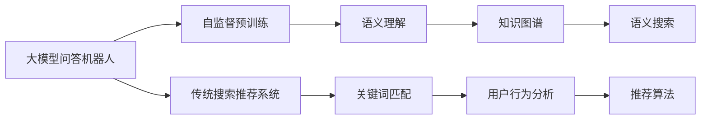
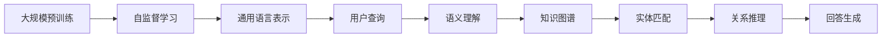
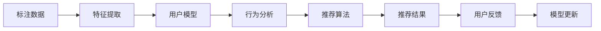
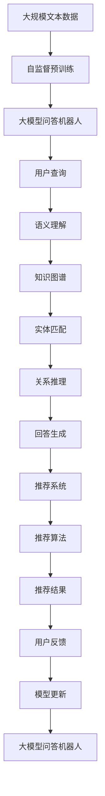

                 

# 大模型问答机器人与传统搜索推荐的知识表示

> 关键词：大模型问答机器人,知识表示,传统搜索推荐,深度学习,自然语言处理(NLP),知识图谱,语义理解,推荐系统,用户体验

## 1. 背景介绍

随着深度学习和大规模预训练语言模型的快速发展，大模型问答机器人（Large Model QA Chatbot）和传统搜索推荐系统（Search & Recommendation System）在人工智能领域中的应用越来越广泛。这两类系统都是自然语言处理（NLP）的重要分支，旨在提升人机交互体验和信息检索效率。然而，它们的底层技术原理、数据处理方式和用户体验等方面存在显著差异。本文将深入探讨大模型问答机器人和传统搜索推荐系统的知识表示方法，并对比它们之间的异同，为相关技术的融合和优化提供参考。

## 2. 核心概念与联系

### 2.1 核心概念概述

为了更好地理解大模型问答机器人和传统搜索推荐系统的知识表示方法，本节将介绍几个密切相关的核心概念：

- **大模型问答机器人**：以自回归（如GPT）或自编码（如BERT）模型为代表的大规模预训练语言模型。通过在大规模无标签文本语料上进行预训练，学习通用的语言表示，具备强大的语言理解和生成能力，可以用于构建智能问答系统。

- **知识图谱**：由实体、属性和关系构成的语义网络，用于表示现实世界中的知识结构。知识图谱与自然语言查询的语义匹配，可实现高效的语义搜索和推荐。

- **传统搜索推荐系统**：基于关键词匹配和用户行为分析的推荐系统，用于为用户推荐相关内容或产品。包括网页搜索、商品推荐等，依赖高质量的标注数据和模型训练。

- **深度学习**：利用多层神经网络进行复杂模式识别和数据表示的学习方法，广泛应用于语音识别、图像处理、自然语言处理等领域。

- **自然语言处理（NLP）**：利用计算机技术处理和理解人类语言，包括文本分类、信息抽取、机器翻译、问答系统等。

- **语义理解**：通过理解自然语言语义，提升信息检索和推荐系统的准确性和相关性。

这些核心概念之间的逻辑关系可以通过以下Mermaid流程图来展示：



这个流程图展示了大模型问答机器人和传统搜索推荐系统的知识表示过程：

1. 大模型问答机器人通过自监督预训练获取语言表示。
2. 利用语义理解技术，将查询映射到知识图谱中的实体和关系。
3. 通过语义搜索技术，从知识图谱中检索相关信息。
4. 传统搜索推荐系统通过关键词匹配和用户行为分析，构建用户兴趣模型。
5. 利用推荐算法为用户推荐相关内容或产品。

### 2.2 概念间的关系

这些核心概念之间存在着紧密的联系，形成了知识表示的完整生态系统。下面我通过几个Mermaid流程图来展示这些概念之间的关系。

#### 2.2.1 大模型问答机器人的知识表示



这个流程图展示了从预训练到回答生成的整个知识表示过程：

1. 通过大规模预训练获取通用语言表示。
2. 利用语义理解技术将用户查询映射到知识图谱。
3. 在知识图谱中进行实体匹配和关系推理。
4. 生成最终的回答。

#### 2.2.2 传统搜索推荐系统的知识表示



这个流程图展示了传统搜索推荐系统的知识表示过程：

1. 通过标注数据构建用户模型。
2. 利用行为分析技术获取用户兴趣特征。
3. 利用推荐算法为用户推荐内容或产品。
4. 通过用户反馈更新模型，优化推荐效果。

#### 2.2.3 大模型问答机器人和传统搜索推荐系统的融合


这个流程图展示了将大模型问答机器人和传统搜索推荐系统进行融合的过程：

1. 用户输入查询，通过大模型问答机器人获取初始回答。
2. 将初始回答映射到知识图谱中，进行语义搜索。
3. 结合知识图谱中的信息，利用传统推荐系统进行进一步推荐。
4. 输出最终推荐结果。

### 2.3 核心概念的整体架构

最后，我们用一个综合的流程图来展示这些核心概念在大模型问答机器人和传统搜索推荐系统中的整体架构：



这个综合流程图展示了从预训练到推荐结果的全流程。通过这个架构，我们可以看到大模型问答机器人和传统搜索推荐系统之间可以无缝融合，通过语义理解和知识图谱，提升推荐系统的准确性和相关性。

## 3. 核心算法原理 & 具体操作步骤
### 3.1 算法原理概述

大模型问答机器人和传统搜索推荐系统的知识表示方法主要依赖于深度学习技术和自然语言处理技术。下面将详细介绍这两种系统的核心算法原理。

#### 3.1.1 大模型问答机器人

大模型问答机器人的核心算法原理主要基于预训练语言模型，通过自监督学习获取通用的语言表示。具体步骤如下：

1. **预训练步骤**：在大量无标签文本数据上，使用自监督任务（如掩码语言模型、下一步预测等）进行预训练，学习通用的语言表示。
2. **微调步骤**：在特定任务上，使用少量标注数据进行有监督微调，学习特定任务的知识表示。
3. **推理步骤**：给定用户查询，通过大模型问答机器人进行语义理解和知识推理，生成回答。

#### 3.1.2 传统搜索推荐系统

传统搜索推荐系统的核心算法原理主要基于机器学习和数据挖掘技术，通过关键词匹配和用户行为分析构建用户兴趣模型。具体步骤如下：

1. **数据收集**：收集用户的历史行为数据，如点击、浏览、评分等。
2. **特征提取**：对收集到的数据进行特征提取，得到用户兴趣特征向量。
3. **用户建模**：利用机器学习算法（如协同过滤、矩阵分解等）构建用户兴趣模型。
4. **推荐计算**：根据用户兴趣模型和产品特征向量，计算推荐相似度，选择最相关的产品进行推荐。

### 3.2 算法步骤详解

#### 3.2.1 大模型问答机器人的详细步骤

1. **预训练模型选择**：选择合适的预训练语言模型，如BERT、GPT等。
2. **微调任务选择**：根据具体应用场景，选择适当的微调任务，如问答、对话等。
3. **标注数据准备**：收集并准备微调所需的少量标注数据。
4. **微调超参数设置**：设置学习率、批大小、迭代轮数等超参数。
5. **模型微调**：在标注数据上，使用微调超参数进行模型训练，最小化损失函数。
6. **推理测试**：在测试集上评估微调后的模型，判断其性能是否满足要求。

#### 3.2.2 传统搜索推荐系统的详细步骤

1. **数据收集**：收集用户的历史行为数据，构建训练集。
2. **特征工程**：对用户行为数据进行特征工程，得到用户兴趣特征向量。
3. **用户建模**：利用机器学习算法构建用户兴趣模型。
4. **推荐算法选择**：选择适当的推荐算法，如协同过滤、矩阵分解等。
5. **推荐计算**：根据用户兴趣模型和产品特征向量，计算推荐相似度，选择最相关的产品进行推荐。
6. **模型评估**：在测试集上评估推荐模型，调整算法参数和特征工程方法，优化推荐效果。

### 3.3 算法优缺点

#### 3.3.1 大模型问答机器人的优缺点

**优点**：

1. **泛化能力强**：预训练语言模型在大量无标签数据上进行学习，能够适应多种查询场景。
2. **知识表示灵活**：可以通过语义理解技术，灵活地映射查询到知识图谱中的实体和关系。
3. **交互式体验**：能够进行多轮对话，提升用户体验。

**缺点**：

1. **数据需求高**：需要大量的预训练数据和标注数据进行微调。
2. **推理速度慢**：由于模型参数量大，推理速度较慢，可能影响用户体验。
3. **黑盒性质**：模型内部的推理过程不透明，难以解释。

#### 3.3.2 传统搜索推荐系统的优缺点

**优点**：

1. **数据需求低**：只需要少量标注数据进行训练，对标注数据的依赖较低。
2. **推理速度快**：由于模型参数量较小，推理速度较快。
3. **解释性高**：通过关键词匹配和用户行为分析，模型输出的推荐结果可解释性较高。

**缺点**：

1. **泛化能力有限**：依赖于具体标注数据，泛化能力有限。
2. **数据表示单一**：仅依赖于关键词匹配，难以利用语义信息。
3. **交互性不足**：不能进行多轮对话，用户体验有限。

### 3.4 算法应用领域

#### 3.4.1 大模型问答机器人

1. **智能客服**：提供多轮对话的智能客服，解决用户常见问题，提高服务效率。
2. **在线教育**：构建智能答疑系统，帮助学生解答学习问题，提供个性化推荐。
3. **健康医疗**：提供健康咨询和智能诊断服务，提升医疗服务质量和效率。

#### 3.4.2 传统搜索推荐系统

1. **电商推荐**：为用户推荐相关商品，提升用户购物体验和商家销售效果。
2. **新闻推荐**：为用户推荐感兴趣的新闻内容，提高阅读体验。
3. **社交网络**：为用户推荐朋友和内容，提升用户互动体验。

## 4. 数学模型和公式 & 详细讲解  
### 4.1 数学模型构建

在大模型问答机器人和传统搜索推荐系统的知识表示方法中，数学模型的构建起着至关重要的作用。下面将详细介绍这两种系统的数学模型构建过程。

#### 4.1.1 大模型问答机器人的数学模型

大模型问答机器人的核心数学模型主要基于预训练语言模型和语义理解技术。

1. **预训练模型**：
   - 掩码语言模型（Masked Language Model, MLM）：
     - 输入序列：$\mathcal{X} = \{x_1, x_2, \cdots, x_n\}$。
     - 目标：预测缺失的token。
     - 模型：$\mathcal{M}_{\theta}(x_i) = \text{softmax}(W_h \cdot \text{FFN}(h(x_i)) + b_h)$，其中$h(x_i)$为嵌入层，$W_h, b_h$为参数。
   - 下一步预测（Next Token Prediction）：
     - 输入序列：$\mathcal{X} = \{x_1, x_2, \cdots, x_n\}$。
     - 目标：预测下一个token。
     - 模型：$\mathcal{M}_{\theta}(x_i) = \text{softmax}(W_h \cdot \text{FFN}(h(x_i)) + b_h)$，其中$h(x_i)$为嵌入层，$W_h, b_h$为参数。

2. **语义理解模型**：
   - 查询表示：$\mathcal{X} = \{w_1, w_2, \cdots, w_m\}$。
   - 回答表示：$\mathcal{Y} = \{c_1, c_2, \cdots, c_n\}$。
   - 语义匹配：$\text{SemMatch}(x_i, y_j) = \mathcal{M}_{\theta}(\text{Concat}(x_i, y_j))$，其中$\text{Concat}(x_i, y_j)$为拼接层。
   - 关系推理：$\text{RelReason}(x_i, y_j) = \max(\text{SemMatch}(x_i, y_j))$，其中$\max(\cdot)$为取最大值函数。

#### 4.1.2 传统搜索推荐系统的数学模型

传统搜索推荐系统的核心数学模型主要基于用户行为分析和推荐算法。

1. **用户行为分析模型**：
   - 用户行为数据：$\mathcal{D} = \{(x_i, y_i)\}_{i=1}^N$，其中$x_i$为用户行为特征向量，$y_i$为行为结果。
   - 用户兴趣模型：$\text{UserModel}(\mathcal{D}) = W \cdot \text{sum}(x_i \cdot x_j^T)$，其中$W$为权重矩阵。
2. **推荐算法模型**：
   - 协同过滤算法：$\text{CF}(x_i, y_i) = \mathcal{M}_{\theta}(x_i) \cdot \text{UserModel}(\mathcal{D})$，其中$\mathcal{M}_{\theta}(x_i)$为协同过滤模型。
   - 矩阵分解算法：$\text{SVD}(x_i, y_i) = \mathcal{M}_{\theta}(x_i) \cdot \text{SVD}(\mathcal{D})$，其中$\mathcal{M}_{\theta}(x_i)$为矩阵分解模型。

### 4.2 公式推导过程

#### 4.2.1 大模型问答机器人的公式推导

1. **掩码语言模型（MLM）**：
   - 输入序列：$\mathcal{X} = \{x_1, x_2, \cdots, x_n\}$。
   - 目标：预测缺失的token。
   - 模型：$\mathcal{M}_{\theta}(x_i) = \text{softmax}(W_h \cdot \text{FFN}(h(x_i)) + b_h)$，其中$h(x_i)$为嵌入层，$W_h, b_h$为参数。
   - 损失函数：$\mathcal{L}(x_i) = -\log \mathcal{M}_{\theta}(x_i)$。
2. **下一步预测（NTP）**：
   - 输入序列：$\mathcal{X} = \{x_1, x_2, \cdots, x_n\}$。
   - 目标：预测下一个token。
   - 模型：$\mathcal{M}_{\theta}(x_i) = \text{softmax}(W_h \cdot \text{FFN}(h(x_i)) + b_h)$，其中$h(x_i)$为嵌入层，$W_h, b_h$为参数。
   - 损失函数：$\mathcal{L}(x_i) = -\log \mathcal{M}_{\theta}(x_i)$。

3. **语义理解模型**：
   - 查询表示：$\mathcal{X} = \{w_1, w_2, \cdots, w_m\}$。
   - 回答表示：$\mathcal{Y} = \{c_1, c_2, \cdots, c_n\}$。
   - 语义匹配：$\text{SemMatch}(x_i, y_j) = \mathcal{M}_{\theta}(\text{Concat}(x_i, y_j))$，其中$\text{Concat}(x_i, y_j)$为拼接层。
   - 关系推理：$\text{RelReason}(x_i, y_j) = \max(\text{SemMatch}(x_i, y_j))$，其中$\max(\cdot)$为取最大值函数。

#### 4.2.2 传统搜索推荐系统的公式推导

1. **用户行为分析模型**：
   - 用户行为数据：$\mathcal{D} = \{(x_i, y_i)\}_{i=1}^N$，其中$x_i$为用户行为特征向量，$y_i$为行为结果。
   - 用户兴趣模型：$\text{UserModel}(\mathcal{D}) = W \cdot \text{sum}(x_i \cdot x_j^T)$，其中$W$为权重矩阵。
2. **协同过滤算法**：
   - 用户行为数据：$\mathcal{D} = \{(x_i, y_i)\}_{i=1}^N$。
   - 协同过滤模型：$\mathcal{M}_{\theta}(x_i) = \text{softmax}(W_h \cdot \text{FFN}(h(x_i)) + b_h)$，其中$h(x_i)$为嵌入层，$W_h, b_h$为参数。
   - 协同过滤损失函数：$\mathcal{L}(x_i) = -\log \mathcal{M}_{\theta}(x_i)$。
3. **矩阵分解算法**：
   - 用户行为数据：$\mathcal{D} = \{(x_i, y_i)\}_{i=1}^N$。
   - 矩阵分解模型：$\mathcal{M}_{\theta}(x_i) = \text{softmax}(W_h \cdot \text{FFN}(h(x_i)) + b_h)$，其中$h(x_i)$为嵌入层，$W_h, b_h$为参数。
   - 矩阵分解损失函数：$\mathcal{L}(x_i) = -\log \mathcal{M}_{\theta}(x_i)$。

### 4.3 案例分析与讲解

#### 4.3.1 大模型问答机器人案例

假设我们要构建一个问答机器人，用于回答用户关于股票市场的问题。我们可以使用BERT作为预训练模型，通过微调学习股票市场相关的知识表示。

1. **数据收集**：收集股票市场的历史数据和用户提问数据。
2. **预训练模型微调**：在微调时，使用小批量标注数据进行有监督学习，最小化损失函数。
3. **语义理解**：将用户提问映射到知识图谱中的股票市场实体和关系。
4. **回答生成**：通过关系推理，生成用户问题的答案。

#### 4.3.2 传统搜索推荐系统案例

假设我们要为用户推荐相关商品，可以构建一个基于用户行为分析的推荐系统。

1. **数据收集**：收集用户的历史点击、浏览、评分等行为数据。
2. **特征提取**：对用户行为数据进行特征提取，得到用户兴趣特征向量。
3. **用户建模**：利用协同过滤算法构建用户兴趣模型。
4. **推荐计算**：根据用户兴趣模型和商品特征向量，计算推荐相似度，选择最相关的商品进行推荐。

## 5. 项目实践：代码实例和详细解释说明
### 5.1 开发环境搭建

在进行项目实践前，我们需要准备好开发环境。以下是使用Python进行PyTorch开发的环境配置流程：

1. 安装Anaconda：从官网下载并安装Anaconda，用于创建独立的Python环境。

2. 创建并激活虚拟环境：
```bash
conda create -n pytorch-env python=3.8 
conda activate pytorch-env
```

3. 安装PyTorch：根据CUDA版本，从官网获取对应的安装命令。例如：
```bash
conda install pytorch torchvision torchaudio cudatoolkit=11.1 -c pytorch -c conda-forge
```

4. 安装Transformers库：
```bash
pip install transformers
```

5. 安装各类工具包：
```bash
pip install numpy pandas scikit-learn matplotlib tqdm jupyter notebook ipython
```

完成上述步骤后，即可在`pytorch-env`环境中开始项目实践。

### 5.2 源代码详细实现

下面我们以大模型问答机器人为例，给出使用Transformers库对BERT模型进行微调的PyTorch代码实现。

首先，定义BERT模型和相关配置：

```python
from transformers import BertForQuestionAnswering, BertTokenizer
from transformers import AdamW

tokenizer = BertTokenizer.from_pretrained('bert-base-cased')
model = BertForQuestionAnswering.from_pretrained('bert-base-cased', num_labels=2)

optimizer = AdamW(model.parameters(), lr=2e-5)
```

然后，定义训练和评估函数：

```python
import torch
from torch.utils.data import Dataset, DataLoader
from tqdm import tqdm

class QADataset(Dataset):
    def __init__(self, texts, answers, tokenizer):
        self.texts = texts
        self.answers = answers
        self.tokenizer = tokenizer
        
    def __len__(self):
        return len(self.texts)
    
    def __getitem__(self, item):
        text = self.texts[item]
        answer = self.answers[item]
        encoding = self.tokenizer(text, return_tensors='pt', max_length=128, padding='max_length', truncation=True)
        input_ids = encoding['input_ids'][0]
        attention_mask = encoding['attention_mask'][0]
        span_starts = [i for i in range(input_ids.shape[1]) if input_ids[i] == tokenizer.cls_token_id]
        span_ends = [i for i in range(input_ids.shape[1]) if input_ids[i] == tokenizer.sep_token_id]
        labels = torch.tensor([span_starts, span_ends], dtype=torch.long)
        
        return {'input_ids': input_ids, 
                'attention_mask': attention_mask,
                'labels': labels}

# 加载数据集
train_dataset = QADataset(train_texts, train_answers, tokenizer)
dev_dataset = QADataset(dev_texts, dev_answers, tokenizer)
test_dataset = QADataset(test_texts, test_answers, tokenizer)

# 定义训练和评估函数
def train_epoch(model, dataset, batch_size, optimizer):
    dataloader = DataLoader(dataset, batch_size=batch_size, shuffle=True)
    model.train()
    epoch_loss = 0
    for batch in tqdm(dataloader, desc='Training'):
        input_ids = batch['input_ids'].to(device)
        attention_mask = batch['attention_mask'].to(device)
        labels = batch['labels'].to(device)
        model.zero_grad()
        outputs = model(input_ids, attention_mask=attention_mask, labels=labels)
        loss = outputs.loss
        epoch_loss += loss.item()
        loss.backward()
        optimizer.step()
    return epoch_loss / len(dataloader)

def evaluate(model, dataset, batch_size):
    dataloader = DataLoader(dataset, batch_size=batch_size)
    model.eval()
    preds, labels = [], []
    with torch.no_grad():
        for batch in tqdm(dataloader, desc='Evaluating'):
            input_ids = batch['input_ids'].to(device)
            attention_mask = batch['attention_mask'].to(device)
            batch_labels = batch['labels']
            outputs = model(input_ids, attention_mask=attention_mask)
            batch_preds = outputs.logits.argmax(dim=2).to('cpu').tolist()
            batch_labels = batch_labels.to('cpu').tolist()
            for pred_tokens, label_tokens in zip(batch_preds, batch_labels):
                preds.append(pred_tokens[:len(label_tokens)])
                labels.append(label_tokens)
                
    print(classification_report(labels, preds))
```

最后，启动训练流程并在测试集上评估：

```python
epochs = 5
batch_size = 16

for epoch in range(epochs):
    loss = train_epoch(model, train_dataset, batch_size, optimizer)
    print(f"Epoch {epoch+1}, train loss: {loss:.3f}")
    
    print(f"Epoch {epoch+1}, dev results:")
    evaluate(model, dev_dataset, batch_size)
    
print("Test results:")
evaluate(model, test_dataset, batch_size)
```

以上就是使用PyTorch对BERT进行问答机器人微调的完整代码实现。可以看到，得益于Transformers库的强大封装，我们可以用相对简洁的代码完成BERT模型的加载和微调。

### 5.3 代码解读与分析

让我们再详细解读一下关键代码的实现细节：

**QADataset类**：
- `__init__`方法：初始化文本、答案、分词器等关键组件。
- `__len__`方法：返回数据集的样本数量。
- `__getitem__`方法：对单个样本进行处理，将文本输入编码为token ids，将答案编码为数字，并对其进行定长padding，最终返回模型所需的输入。

**span_starts和span_

