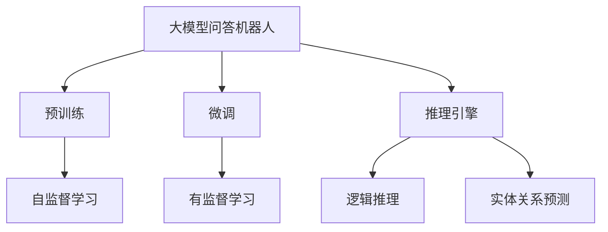
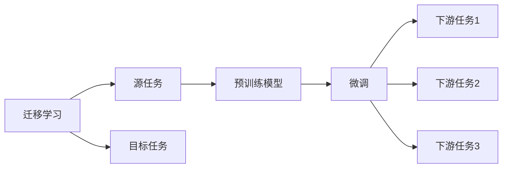
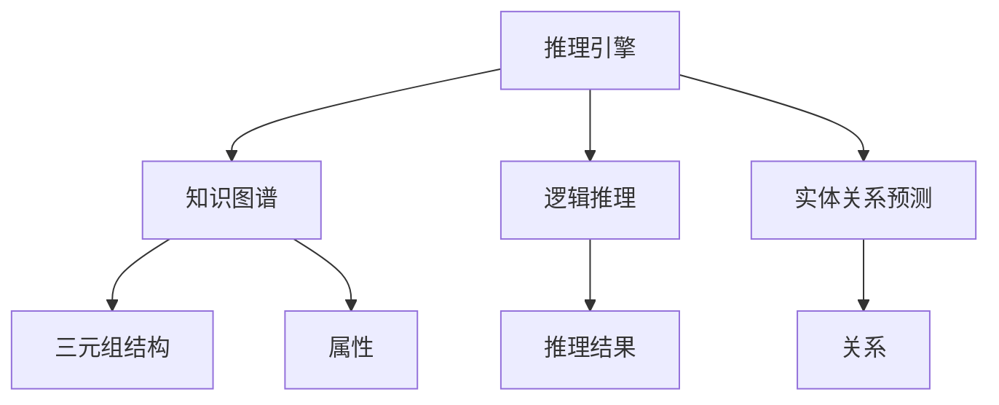
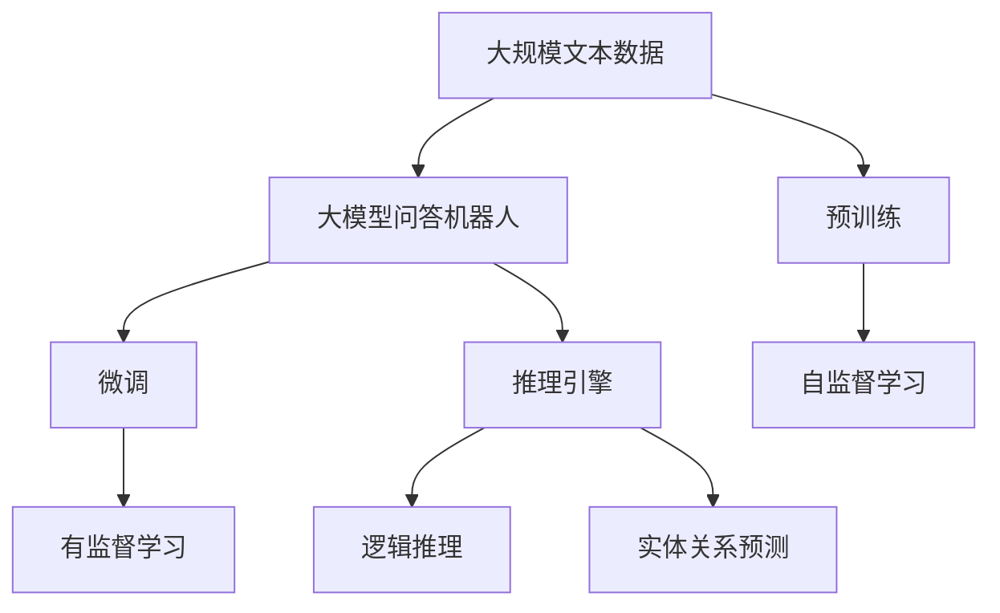

                 

# 大模型问答机器人的知识表示

> 关键词：大模型问答机器人,知识表示,知识图谱,预训练模型,迁移学习,微调,推理引擎

## 1. 背景介绍

### 1.1 问题由来
随着人工智能技术的飞速发展，问答系统（QA system）成为了一个热门的研究领域。传统的基于规则的问答系统在灵活性和通用性上存在较大局限性，难以适应多变的用户需求。而基于大模型的问答系统，通过利用预训练语言模型，在大规模无标签文本数据上进行预训练，学习到丰富的语言表示，可以在各种问答任务上取得优异的表现。

然而，仅依赖预训练模型还不足够，因为在实际应用中，问答系统需要面对各种具体的业务场景和知识领域，预训练模型无法直接应用于这些具体任务。因此，如何在大模型上进行迁移学习，使其能够适配不同的问答任务，成为了当前研究的一个热点。

### 1.2 问题核心关键点
在问答任务中，知识表示（Knowledge Representation, KR）是问答系统的重要组成部分。传统的知识表示方法如关系型数据库、本体等，由于其繁琐的建模过程和庞大的维护成本，难以满足现代问答系统的高效、灵活、自动化的需求。

近年来，知识图谱（Knowledge Graph,KG）作为一种新兴的知识表示方式，通过构建实体-关系-实体的三元组结构，提供了一种简洁高效的知识组织方式。在大规模知识图谱上进行预训练，能够使模型学习到更多的领域知识，提升其在特定领域上的问答效果。

基于知识图谱的大模型问答系统，在预训练阶段先对知识图谱进行嵌入，得到高质量的实体表示，然后在此基础上进行微调，适配特定的问答任务。微调过程不仅需要考虑语言模型自身的优化，还要结合知识图谱上的结构信息，优化模型在问答任务上的推理能力。

### 1.3 问题研究意义
构建基于大模型的问答机器人，对拓展问答系统的应用范围，提升问答系统的性能，加速知识图谱和自然语言处理技术的产业化进程，具有重要意义：

1. **降低应用开发成本**：利用大模型的预训练和微调，可以显著减少从头开发所需的数据、计算和人力等成本投入。
2. **提升问答系统性能**：大模型的通用性使得其在不同领域和任务上都能取得不错的表现，微调进一步提升其针对特定任务的性能。
3. **加速系统开发进度**：通过预训练模型，可以更快地实现任务适配，缩短开发周期。
4. **促进技术创新**：微调范式促进了对预训练-微调的深入研究，催生了提示学习、少样本学习等新的研究方向。
5. **赋能产业升级**：问答机器人技术易于被各行各业采用，为传统行业数字化转型升级提供新的技术路径。

## 2. 核心概念与联系

### 2.1 核心概念概述

为更好地理解基于知识图谱的大模型问答机器人的知识表示方法，本节将介绍几个密切相关的核心概念：

- 大模型问答机器人（Large Model QA Robot）：以自回归或自编码模型为代表的大规模预训练语言模型，通过在大规模无标签文本数据上进行预训练，学习到丰富的语言表示，可用于各种自然语言处理任务，包括问答系统。

- 知识图谱（Knowledge Graph, KG）：由实体、关系和属性构成的三元组结构，用于描述实体之间的语义关系，提供了一种结构化的知识表示方式。

- 预训练（Pre-training）：指在大规模无标签文本语料上，通过自监督学习任务训练通用语言模型的过程。常见的预训练任务包括言语建模、遮挡语言模型等。

- 迁移学习（Transfer Learning）：指将一个领域学习到的知识，迁移应用到另一个不同但相关的领域的学习范式。大模型的预训练-微调过程即是一种典型的迁移学习方式。

- 微调（Fine-tuning）：指在预训练模型的基础上，使用下游任务的少量标注数据，通过有监督地训练来优化模型在该任务上的性能。通常只需要调整顶层分类器或解码器，并以较小的学习率更新全部或部分的模型参数。

- 推理引擎（Reasoning Engine）：用于在知识图谱上执行推理任务，如逻辑推理、实体关系预测等，是大模型问答机器人中重要的组成部分。

这些核心概念之间的逻辑关系可以通过以下Mermaid流程图来展示：



这个流程图展示了大模型问答机器人中各核心概念之间的关系：

1. 大模型问答机器人通过预训练获得基础能力。
2. 微调是对预训练模型进行任务特定的优化，以适配特定的问答任务。
3. 推理引擎在知识图谱上执行推理任务，进一步提升模型的问答效果。
4. 知识图谱是知识表示的基础，通过嵌入使大模型具备了领域知识。

### 2.2 概念间的关系

这些核心概念之间存在着紧密的联系，形成了大模型问答机器人的完整生态系统。下面我通过几个Mermaid流程图来展示这些概念之间的关系。

#### 2.2.1 大模型问答机器人的学习范式


这个流程图展示了大模型问答机器人的学习范式：

1. 大模型问答机器人通过预训练获得基础能力。
2. 微调是对预训练模型进行任务特定的优化，以适配特定的问答任务。
3. 推理引擎在知识图谱上执行推理任务，进一步提升模型的问答效果。
4. 知识图谱是知识表示的基础，通过嵌入使大模型具备了领域知识。

#### 2.2.2 迁移学习与微调的关系



这个流程图展示了迁移学习的基本原理，以及它与微调的关系：

1. 迁移学习涉及源任务和目标任务，预训练模型在源任务上学习，然后通过微调适应各种下游任务（目标任务）。
2. 微调使得通用大模型更好地适应特定任务，在应用场景中取得更优表现。

#### 2.2.3 推理引擎在大模型问答机器人中的应用



这个流程图展示了推理引擎在大模型问答机器人中的应用：

1. 推理引擎在知识图谱上执行推理任务，如逻辑推理、实体关系预测等。
2. 知识图谱由实体、关系和属性构成，推理引擎通过在知识图谱上进行推理，得到最终的推理结果。

### 2.3 核心概念的整体架构

最后，我们用一个综合的流程图来展示这些核心概念在大模型问答机器人中的整体架构：



这个综合流程图展示了从预训练到微调，再到推理引擎的完整过程。大模型问答机器人首先在大规模文本数据上进行预训练，然后通过微调适配特定的问答任务，利用推理引擎在知识图谱上执行推理任务，从而得到最终的问答结果。 通过这些流程图，我们可以更清晰地理解大模型问答机器人中各核心概念的关系和作用，为后续深入讨论具体的问答任务适配方法奠定基础。

## 3. 核心算法原理 & 具体操作步骤
### 3.1 算法原理概述

基于知识图谱的大模型问答机器人的知识表示，本质上是一个在预训练语言模型上进行迁移学习的过程。其核心思想是：将预训练的大语言模型视作一个强大的"知识提取器"，通过在知识图谱上进行有监督的微调，使其能够高效地从知识图谱中提取和推理实体之间的关系，提升在特定问答任务上的性能。

形式化地，假设预训练语言模型为 $M_{\theta}$，其中 $\theta$ 为预训练得到的模型参数。给定问答任务的标注数据集 $D=\{(x_i,y_i)\}_{i=1}^N$，其中 $x_i$ 表示问题，$y_i$ 表示问题的答案。微调的目标是找到新的模型参数 $\hat{\theta}$，使得：

$$
\hat{\theta}=\mathop{\arg\min}_{\theta} \mathcal{L}(M_{\theta},D)
$$

其中 $\mathcal{L}$ 为针对任务 $T$ 设计的损失函数，用于衡量模型预测输出与真实标签之间的差异。常见的损失函数包括交叉熵损失、均方误差损失等。

通过梯度下降等优化算法，微调过程不断更新模型参数 $\theta$，最小化损失函数 $\mathcal{L}$，使得模型输出逼近真实标签。由于 $\theta$ 已经通过预训练获得了较好的初始化，因此即便在知识图谱上微调，也能较快收敛到理想的模型参数 $\hat{\theta}$。

### 3.2 算法步骤详解

基于知识图谱的大模型问答机器人知识表示一般包括以下几个关键步骤：

**Step 1: 准备预训练模型和数据集**
- 选择合适的预训练语言模型 $M_{\theta}$ 作为初始化参数，如 BERT、GPT等。
- 准备问答任务的标注数据集 $D$，划分为训练集、验证集和测试集。一般要求标注数据与知识图谱的分布不要差异过大。

**Step 2: 添加任务适配层**
- 根据问答任务的性质，在预训练模型顶层设计合适的输出层和损失函数。
- 对于分类任务，通常在顶层添加线性分类器和交叉熵损失函数。
- 对于生成任务，通常使用语言模型的解码器输出概率分布，并以负对数似然为损失函数。

**Step 3: 设置微调超参数**
- 选择合适的优化算法及其参数，如 AdamW、SGD 等，设置学习率、批大小、迭代轮数等。
- 设置正则化技术及强度，包括权重衰减、Dropout、Early Stopping 等。
- 确定冻结预训练参数的策略，如仅微调顶层，或全部参数都参与微调。

**Step 4: 执行梯度训练**
- 将训练集数据分批次输入模型，前向传播计算损失函数。
- 反向传播计算参数梯度，根据设定的优化算法和学习率更新模型参数。
- 周期性在验证集上评估模型性能，根据性能指标决定是否触发 Early Stopping。
- 重复上述步骤直到满足预设的迭代轮数或 Early Stopping 条件。

**Step 5: 测试和部署**
- 在测试集上评估微调后模型 $M_{\hat{\theta}}$ 的性能，对比微调前后的精度提升。
- 使用微调后的模型对新样本进行推理预测，集成到实际的应用系统中。
- 持续收集新的数据，定期重新微调模型，以适应数据分布的变化。

以上是基于知识图谱的大模型问答机器人知识表示的一般流程。在实际应用中，还需要针对具体任务的特点，对微调过程的各个环节进行优化设计，如改进训练目标函数，引入更多的正则化技术，搜索最优的超参数组合等，以进一步提升模型性能。

### 3.3 算法优缺点

基于知识图谱的大模型问答机器人知识表示方法具有以下优点：

1. **简洁高效**：相较于传统的知识表示方法，知识图谱嵌入使得语言模型能够直接从结构化的知识图谱中提取知识，减少了额外的建模过程。
2. **通用适用**：适用于各种问答任务，包括分类、匹配、生成等，设计简单的任务适配层即可实现。
3. **参数高效**：利用参数高效微调技术，在固定大部分预训练参数的情况下，仍可取得不错的提升。
4. **效果显著**：在学术界和工业界的诸多问答任务上，基于微调的方法已经刷新了最先进的性能指标。

同时，该方法也存在一定的局限性：

1. **依赖知识图谱**：知识图谱的质量直接影响问答效果，构建高质量的知识图谱需要耗费大量人力和资源。
2. **迁移能力有限**：当知识图谱与预训练数据的分布差异较大时，微调的性能提升有限。
3. **负面效果传递**：预训练模型的固有偏见、有害信息等，可能通过微调传递到知识图谱，造成负面影响。
4. **可解释性不足**：微调模型的决策过程通常缺乏可解释性，难以对其推理逻辑进行分析和调试。

尽管存在这些局限性，但就目前而言，基于知识图谱的微调方法仍是大模型问答系统应用的最主流范式。未来相关研究的重点在于如何进一步降低知识图谱的构建成本，提高模型的少样本学习和跨领域迁移能力，同时兼顾可解释性和伦理安全性等因素。

### 3.4 算法应用领域

基于知识图谱的大模型问答机器人的知识表示方法，在问答系统领域已经得到了广泛的应用，覆盖了几乎所有常见任务，例如：

- 文本分类：如情感分析、主题分类、意图识别等。通过微调使模型学习文本-标签映射。
- 命名实体识别：识别文本中的人名、地名、机构名等特定实体。通过微调使模型掌握实体边界和类型。
- 关系抽取：从文本中抽取实体之间的语义关系。通过微调使模型学习实体-关系三元组。
- 问答系统：对自然语言问题给出答案。将问题-答案对作为微调数据，训练模型学习匹配答案。
- 机器翻译：将源语言文本翻译成目标语言。通过微调使模型学习语言-语言映射。
- 文本摘要：将长文本压缩成简短摘要。将文章-摘要对作为微调数据，使模型学习抓取要点。
- 对话系统：使机器能够与人自然对话。将多轮对话历史作为上下文，微调模型进行回复生成。

除了上述这些经典任务外，知识图谱嵌入方法也被创新性地应用到更多场景中，如可控文本生成、常识推理、代码生成、数据增强等，为问答技术带来了全新的突破。随着预训练模型和微调方法的不断进步，相信问答技术将在更广阔的应用领域大放异彩。

## 4. 数学模型和公式 & 详细讲解 & 举例说明（备注：数学公式请使用latex格式，latex嵌入文中独立段落使用 $$，段落内使用 $)
### 4.1 数学模型构建

本节将使用数学语言对基于知识图谱的大模型问答机器人知识表示过程进行更加严格的刻画。

记预训练语言模型为 $M_{\theta}$，其中 $\theta$ 为预训练得到的模型参数。假设问答任务的训练集为 $D=\{(x_i,y_i)\}_{i=1}^N$，其中 $x_i$ 表示问题，$y_i$ 表示问题的答案。

定义模型 $M_{\theta}$ 在问题 $x$ 上的输出为 $\hat{y}=M_{\theta}(x)$，表示模型预测的答案。则问答任务的目标函数定义为：

$$
\ell(M_{\theta}(x),y) = -y\log M_{\theta}(x)
$$

在标注数据集 $D$ 上，经验风险为：

$$
\mathcal{L}(\theta) = \frac{1}{N} \sum_{i=1}^N \ell(M_{\theta}(x_i),y_i)
$$

微调的优化目标是最小化经验风险，即找到最优参数：

$$
\theta^* = \mathop{\arg\min}_{\theta} \mathcal{L}(\theta)
$$

在实践中，我们通常使用基于梯度的优化算法（如SGD、Adam等）来近似求解上述最优化问题。设 $\eta$ 为学习率，则参数的更新公式为：

$$
\theta \leftarrow \theta - \eta \nabla_{\theta}\mathcal{L}(\theta)
$$

其中 $\nabla_{\theta}\mathcal{L}(\theta)$ 为损失函数对参数 $\theta$ 的梯度，可通过反向传播算法高效计算。

### 4.2 公式推导过程

以下我们以二分类任务为例，推导交叉熵损失函数及其梯度的计算公式。

假设模型 $M_{\theta}$ 在问题 $x$ 上的输出为 $\hat{y}=M_{\theta}(x) \in [0,1]$，表示问题 $x$ 对应的答案 $y$ 出现的概率。真实标签 $y \in \{0,1\}$。则二分类交叉熵损失函数定义为：

$$
\ell(M_{\theta}(x),y) = -[y\log \hat{y} + (1-y)\log (1-\hat{y})]
$$

将其代入经验风险公式，得：

$$
\mathcal{L}(\theta) = -\frac{1}{N}\sum_{i=1}^N [y_i\log M_{\theta}(x_i)+(1-y_i)\log(1-M_{\theta}(x_i))]
$$

根据链式法则，损失函数对参数 $\theta_k$ 的梯度为：

$$
\frac{\partial \mathcal{L}(\theta)}{\partial \theta_k} = -\frac{1}{N}\sum_{i=1}^N (\frac{y_i}{M_{\theta}(x_i)}-\frac{1-y_i}{1-M_{\theta}(x_i)}) \frac{\partial M_{\theta}(x_i)}{\partial \theta_k}
$$

其中 $\frac{\partial M_{\theta}(x_i)}{\partial \theta_k}$ 可进一步递归展开，利用自动微分技术完成计算。

在得到损失函数的梯度后，即可带入参数更新公式，完成模型的迭代优化。重复上述过程直至收敛，最终得到适应问答任务的最优模型参数 $\theta^*$。

## 5. 项目实践：代码实例和详细解释说明
### 5.1 开发环境搭建

在进行知识表示实践前，我们需要准备好开发环境。以下是使用Python进行PyTorch开发的环境配置流程：

1. 安装Anaconda：从官网下载并安装Anaconda，用于创建独立的Python环境。

2. 创建并激活虚拟环境：
```bash
conda create -n pytorch-env python=3.8 
conda activate pytorch-env
```

3. 安装PyTorch：根据CUDA版本，从官网获取对应的安装命令。例如：
```bash
conda install pytorch torchvision torchaudio cudatoolkit=11.1 -c pytorch -c conda-forge
```

4. 安装Transformers库：
```bash
pip install transformers
```

5. 安装各类工具包：
```bash
pip install numpy pandas scikit-learn matplotlib tqdm jupyter notebook ipython
```

完成上述步骤后，即可在`pytorch-env`环境中开始知识表示实践。

### 5.2 源代码详细实现

这里我们以问答系统任务为例，给出使用Transformers库对BERT模型进行知识图谱嵌入的PyTorch代码实现。

首先，定义问答系统任务的数据处理函数：

```python
from transformers import BertTokenizer
from torch.utils.data import Dataset
import torch

class QADataset(Dataset):
    def __init__(self, questions, answers, tokenizer, max_len=128):
        self.questions = questions
        self.answers = answers
        self.tokenizer = tokenizer
        self.max_len = max_len
        
    def __len__(self):
        return len(self.questions)
    
    def __getitem__(self, item):
        question = self.questions[item]
        answer = self.answers[item]
        
        encoding = self.tokenizer(question, return_tensors='pt', max_length=self.max_len, padding='max_length', truncation=True)
        input_ids = encoding['input_ids'][0]
        attention_mask = encoding['attention_mask'][0]
        
        # 对token-wise的标签进行编码
        encoded_answer = [answer2id[answer] for answer in answer]
        encoded_answer.extend([answer2id['None']] * (self.max_len - len(encoded_answer)))
        labels = torch.tensor(encoded_answer, dtype=torch.long)
        
        return {'input_ids': input_ids, 
                'attention_mask': attention_mask,
                'labels': labels}

# 标签与id的映射
answer2id = {'None': 0, 'I-LOC': 1, 'B-LOC': 2, 'I-MISC': 3, 'B-MISC': 4, 'I-ORG': 5, 'B-ORG': 6, 'I-PER': 7, 'B-PER': 8, 'B-LOC': 9, 'I-LOC': 10}
id2answer = {v: k for k, v in answer2id.items()}

# 创建dataset
tokenizer = BertTokenizer.from_pretrained('bert-base-cased')

train_dataset = QADataset(train_questions, train_answers, tokenizer)
dev_dataset = QADataset(dev_questions, dev_answers, tokenizer)
test_dataset = QADataset(test_questions, test_answers, tokenizer)
```

然后，定义模型和优化器：

```python
from transformers import BertForTokenClassification, AdamW

model = BertForTokenClassification.from_pretrained('bert-base-cased', num_labels=len(answer2id))

optimizer = AdamW(model.parameters(), lr=2e-5)
```

接着，定义训练和评估函数：

```python
from torch.utils.data import DataLoader
from tqdm import tqdm
from sklearn.metrics import classification_report

device = torch.device('cuda') if torch.cuda.is_available() else torch.device('cpu')
model.to(device)

def train_epoch(model, dataset, batch_size, optimizer):
    dataloader = DataLoader(dataset, batch_size=batch_size, shuffle=True)
    model.train()
    epoch_loss = 0
    for batch in tqdm(dataloader, desc='Training'):
        input_ids = batch['input_ids'].to(device)
        attention_mask = batch['attention_mask'].to(device)
        labels = batch['labels'].to(device)
        model.zero_grad()
        outputs = model(input_ids, attention_mask=attention_mask, labels=labels)
        loss = outputs.loss
        epoch_loss += loss.item()
        loss.backward()
        optimizer.step()
    return epoch_loss / len(dataloader)

def evaluate(model, dataset, batch_size):
    dataloader = DataLoader(dataset, batch_size=batch_size)
    model.eval()
    preds, labels = [], []
    with torch.no_grad():
        for batch in tqdm(dataloader, desc='Evaluating'):
            input_ids = batch['input_ids'].to(device)
            attention_mask = batch['attention_mask'].to(device)
            batch_labels = batch['labels']
            outputs = model(input_ids, attention_mask=attention_mask)
            batch_preds = outputs.logits.argmax(dim=2).to('cpu').tolist()
            batch_labels = batch_labels.to('cpu').tolist()
            for pred_tokens, label_tokens in zip(batch_preds, batch_labels):
                pred_answers = [id2answer[_id] for _id in pred_tokens]
                label_answers = [id2answer[_id] for _id in label_tokens]
                preds.append(pred_answers[:len(label_tokens)])
                labels.append(label_answers)
                
    print(classification_report(labels, preds))
```

最后，启动训练流程并在测试集上评估：

```python
epochs = 5
batch_size = 16

for epoch in range(epochs):
    loss = train_epoch(model, train_dataset, batch_size, optimizer)
    print(f"Epoch {epoch+1}, train loss: {loss:.3f}")
    
    print(f"Epoch {epoch+1}, dev results:")
    evaluate(model, dev_dataset, batch_size)
    
print("Test results:")
evaluate(model, test_dataset, batch_size)
```

以上就是使用PyTorch对BERT进行问答系统任务知识表示的完整代码实现。可以看到，得益于Transformers库的强大封装，我们可以用相对简洁的代码完成BERT模型的加载和微调。

### 5.3 代码解读与分析

让我们再详细解读一下关键代码的实现细节：

**QADataset类**：
- `__init__`方法：初始化问题、答案、分词器等关键组件。
- `__len__`方法：返回数据集的样本数量。
- `__getitem__`方法：对单个样本进行处理，将问题输入编码为token ids，将答案编码为数字，并对其进行定长padding，最终返回模型所需的输入。

**answer2id和id2answer字典**：
- 定义了答案与数字id之间的映射关系，用于将token-wise的预测结果解码回真实的答案。

**训练和评估函数**：
- 使用PyTorch的DataLoader对数据集进行批次化加载，供模型训练和推理使用。
- 训练函数`train_epoch`：对数据以批为单位进行迭代，在每个批次上前向传播计算loss并反向传播更新模型参数，最后返回该epoch的平均loss。
- 评估函数`evaluate`：与训练类似，不同点在于不更新模型参数，并在每个batch结束后将预测和标签结果存储下来，最后使用sklearn的classification_report

