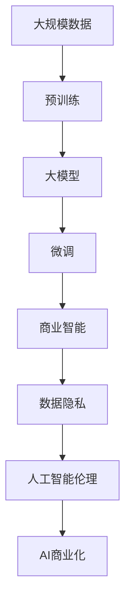

                 

# 大模型：智能时代的商业新模式

> 关键词：大模型, 商业智能, AI商业化, 数据驱动, 数据隐私, AI伦理, 商业决策

## 1. 背景介绍

### 1.1 问题由来
随着人工智能技术的飞速发展，大模型成为了企业数字化转型和智能化升级的关键资产。大模型以大规模预训练和微调为核心，能够高效地处理和分析海量数据，生成高质量的洞察和建议，为决策提供有力支持。然而，如何科学合理地利用大模型，确保其效果，也成为了企业界亟待解决的问题。

### 1.2 问题核心关键点
利用大模型进行商业决策需要考虑以下关键点：
- 大模型应具备高效的特征提取能力。通过大规模预训练，大模型能够学习到丰富的语义和结构信息，这对商业决策至关重要。
- 商业决策应充分利用多源数据。商业环境是多变的，单一数据源可能无法完全反映问题，大模型需要整合不同类型的数据，以提升决策的全面性和准确性。
- 大模型的输出应具有可解释性。商业决策应能够理解和信任模型推理过程，才能确保其应用价值。
- 数据隐私和安全问题需得到重视。商业决策中涉及的敏感数据，需要大模型具备良好的隐私保护能力。

### 1.3 问题研究意义
研究大模型在商业决策中的应用，对于提升企业智能化水平、优化决策流程、增强竞争优势具有重要意义：
- 提升决策质量和效率。大模型能够快速分析大量数据，发现复杂模式，提供精确决策支持。
- 支持多部门协同。不同部门的数据和任务通过大模型进行统一处理，可以更好实现跨部门协同和资源共享。
- 提高决策过程的透明度。大模型的推理过程可解释，有助于管理者理解和信任决策结果。
- 增强数据驱动决策能力。数据是大模型的基础，企业通过大模型提升数据处理和分析能力，推动数据驱动决策。
- 确保数据隐私和合规。大模型需具备隐私保护机制，保障数据安全和合规性。

## 2. 核心概念与联系

### 2.1 核心概念概述

为更好地理解大模型在商业决策中的应用，本节将介绍几个密切相关的核心概念：

- 大模型(Large Model)：指大规模预训练的深度学习模型，如BERT、GPT等。通过在大型语料库上进行自监督预训练，大模型具备强大的特征提取和泛化能力。

- 预训练(Pre-training)：指在大规模无标签数据上进行自监督训练，学习通用语言表示的过程。预训练模型在大量语料上提取语言知识和结构信息，从而提升微调效果。

- 微调(Fine-tuning)：指在预训练模型的基础上，使用特定任务的数据进行有监督训练，优化模型在该任务上的性能。微调过程对模型进行调整，以适应新的业务需求。

- 商业智能(Business Intelligence, BI)：利用先进的数据分析技术和工具，将企业数据转化为有用知识，辅助商业决策。大模型在商业智能中扮演重要角色，提高决策智能化水平。

- 数据隐私(Data Privacy)：指保护个人和企业数据免受不当收集、存储、使用和披露的风险。在大模型应用中，需要重视数据隐私和安全问题。

- 人工智能伦理(AI Ethics)：涉及人工智能技术的道德规范和价值观，旨在确保AI应用对人类社会产生积极影响。大模型的开发和应用需要遵循伦理规范，确保公平和透明。

- AI商业化(AI Commercialization)：指将人工智能技术转化为商业应用，实现商业价值。大模型在大规模业务场景中的应用，是AI商业化的重要途径。

这些核心概念之间存在紧密的联系，形成了大模型在商业决策中的完整应用框架。下面通过Mermaid流程图来展示这些概念之间的联系：


### 2.2 概念间的关系

这些核心概念之间存在紧密的联系，共同构成了大模型在商业决策中的应用框架。下面是这些概念之间的详细联系：

- 预训练和大模型：大模型通过预训练学习到丰富的语言知识和结构信息，为后续微调提供基础。
- 微调和商业智能：微调使大模型适应具体的商业任务，提升决策的智能水平。
- 数据隐私和人工智能伦理：在商业应用中，大模型需具备良好的隐私保护和伦理规范，确保数据安全和决策公正。
- AI商业化和大模型：大模型通过商业化落地，实现其在企业决策中的实际应用价值。

### 2.3 核心概念的整体架构

最终，我们可以用以下综合性的流程图来展示这些核心概念在大模型商业应用中的整体架构：



这个综合流程图展示了从预训练到大模型商业化应用的完整过程，为大模型在商业决策中的应用提供了清晰的路径。

## 3. 核心算法原理 & 具体操作步骤
### 3.1 算法原理概述

利用大模型进行商业决策的核心在于：通过大规模预训练和微调，使模型具备强大的特征提取和泛化能力。其原理如下：

- 预训练：在大规模无标签数据上进行自监督学习，学习通用语言表示。预训练模型通过 masked language modeling、next sentence prediction 等任务，学习到语言的语法、语义和结构信息。

- 微调：在预训练模型的基础上，使用特定任务的数据进行有监督学习，优化模型在该任务上的性能。微调过程通过调整模型参数，使其适应具体的商业决策任务。

### 3.2 算法步骤详解

基于大模型的商业决策算法主要包括以下步骤：

**Step 1: 数据准备与预处理**
- 收集商业决策所需的多源数据，如销售数据、客户反馈、市场调研等。
- 清洗数据，去除异常和噪声，确保数据质量。
- 将不同类型的数据进行格式统一，便于后续处理。

**Step 2: 数据特征提取**
- 使用大模型对数据进行特征提取。将数据转换为向量形式，用于后续的分析和决策。
- 利用大模型的可解释性，分析特征的重要性，筛选出关键特征。

**Step 3: 模型训练与微调**
- 选择合适的大模型，并根据业务需求设计微调任务。
- 在大模型上进行微调，优化模型在特定任务上的性能。
- 评估微调效果，调整模型参数和训练策略。

**Step 4: 商业智能分析**
- 将微调后的模型应用于商业智能系统，如BI工具、数据仓库等。
- 利用大模型生成商业洞察和建议，辅助决策。
- 集成可视化工具，展示数据和决策结果。

**Step 5: 模型部署与监控**
- 将大模型部署到生产环境，提供实时决策支持。
- 监控模型性能，定期更新模型参数和数据。
- 记录模型决策过程，确保可解释性和透明度。

### 3.3 算法优缺点

基于大模型的商业决策算法具有以下优点：
1. 高效处理多源数据。大模型能够整合不同类型的数据，提供全面且准确的决策支持。
2. 快速生成商业洞察。通过微调后的模型，能够快速分析大量数据，生成高价值商业洞察。
3. 提高决策透明性。大模型的决策过程可解释，有助于理解和管理决策。
4. 减少人为干预。数据驱动的决策过程，减少了人为因素的影响，提升决策质量。

同时，该算法也存在一些缺点：
1. 依赖高质量数据。预训练和微调过程需要大量高质量的数据，数据缺失或噪声可能影响模型性能。
2. 计算资源消耗大。大模型需要大量的计算资源进行训练和推理，成本较高。
3. 模型泛化能力有限。大模型对特定业务领域的泛化能力有限，需定期更新和微调。
4. 隐私和安全问题。大模型涉及大量敏感数据，需确保数据隐私和安全。

### 3.4 算法应用领域

基于大模型的商业决策算法在多个领域得到了广泛应用，例如：

- 零售业务：通过分析销售数据和客户反馈，生成个性化推荐和营销策略。
- 金融分析：利用金融市场数据，预测股票走势，制定投资策略。
- 供应链管理：整合供应链各环节数据，优化库存管理，提升供应链效率。
- 市场调研：通过分析市场数据，预测市场趋势，制定营销计划。
- 客户服务：通过客户反馈数据，生成服务改进建议，提升客户满意度。

此外，大模型还在医疗诊断、智能制造、智慧城市等多个领域展现出了其强大的商业价值。

## 4. 数学模型和公式 & 详细讲解 & 举例说明

### 4.1 数学模型构建

在大模型商业决策算法中，主要使用Transformer模型进行特征提取和处理。假设模型参数为 $\theta$，输入数据为 $x$，输出为 $y$，目标为预测 $y$ 的概率分布。

模型训练过程的目标是最大化预测概率 $p(y|x)$，即：

$$
\max_{\theta} \log p(y|x) = \log \frac{e^{\theta^T\phi(x)}}{\sum_{i=1}^K e^{\theta^T\phi_i(x)}}
$$

其中 $\phi(x)$ 表示输入数据 $x$ 通过Transformer模型提取的特征向量，$\phi_i(x)$ 表示模型中第 $i$ 层的输出。

### 4.2 公式推导过程

以Transformer模型的自注意力机制为例，推导模型输出概率的计算过程。假设输入数据 $x$ 经过Transformer模型，输出特征向量为 $z$，则模型输出的概率为：

$$
p(y|x) = \frac{e^{\theta^Tz}}{\sum_{i=1}^K e^{\theta^Tz_i}}
$$

其中 $z_i$ 表示模型中第 $i$ 层的输出特征向量。具体推导过程如下：

1. 输入数据 $x$ 经过Transformer模型，得到特征向量 $z$。
2. 模型通过多层的自注意力机制，得到多个特征向量 $z_1, z_2, ..., z_K$。
3. 将每个特征向量与模型参数 $\theta$ 进行线性变换，得到 $s_1, s_2, ..., s_K$。
4. 对 $s_1, s_2, ..., s_K$ 进行softmax操作，得到概率分布 $p_1, p_2, ..., p_K$。
5. 将 $p_1, p_2, ..., p_K$ 与 $s_1, s_2, ..., s_K$ 进行点乘操作，得到输出概率 $p(y|x)$。

### 4.3 案例分析与讲解

以零售业务为例，展示大模型在商业决策中的应用。假设零售企业收集了用户购买数据、客户反馈、市场趋势等数据，并希望预测用户购买行为和优化营销策略。具体步骤如下：

1. 数据收集：收集用户的购买数据、评论数据、市场趋势数据等。
2. 数据清洗与预处理：清洗数据，去除噪声和异常值，进行数据格式统一。
3. 特征提取：使用大模型对数据进行特征提取，生成特征向量 $z$。
4. 模型训练与微调：在特征向量 $z$ 上训练大模型，优化模型在预测用户购买行为上的性能。
5. 商业智能分析：利用微调后的模型生成商业洞察和建议，如个性化推荐、营销策略优化等。

例如，通过分析用户购买行为和偏好，大模型可以预测用户未来的购买需求，生成个性化推荐商品列表。通过分析市场趋势和用户反馈，大模型可以优化营销策略，提高用户满意度和忠诚度。

## 5. 项目实践：代码实例和详细解释说明

### 5.1 开发环境搭建

在进行大模型商业决策项目开发前，需要准备好开发环境。以下是使用Python进行PyTorch开发的环境配置流程：

1. 安装Anaconda：从官网下载并安装Anaconda，用于创建独立的Python环境。

2. 创建并激活虚拟环境：
```bash
conda create -n pytorch-env python=3.8 
conda activate pytorch-env
```

3. 安装PyTorch：根据CUDA版本，从官网获取对应的安装命令。例如：
```bash
conda install pytorch torchvision torchaudio cudatoolkit=11.1 -c pytorch -c conda-forge
```

4. 安装Transformers库：
```bash
pip install transformers
```

5. 安装各类工具包：
```bash
pip install numpy pandas scikit-learn matplotlib tqdm jupyter notebook ipython
```

完成上述步骤后，即可在`pytorch-env`环境中开始项目开发。

### 5.2 源代码详细实现

这里以零售业务为例，展示如何使用大模型进行商业决策。

```python
from transformers import BertForSequenceClassification
from transformers import BertTokenizer
from transformers import AdamW
from transformers import Trainer
from transformers import TrainingArguments

# 定义任务标签
labels = ['buy', 'not_buy']

# 加载数据集
train_data = load_train_data()
test_data = load_test_data()

# 定义模型和优化器
model = BertForSequenceClassification.from_pretrained('bert-base-cased', num_labels=len(labels))
tokenizer = BertTokenizer.from_pretrained('bert-base-cased')
optimizer = AdamW(model.parameters(), lr=2e-5)

# 定义训练器和训练参数
training_args = TrainingArguments(
    output_dir="./results",
    per_device_train_batch_size=16,
    per_device_eval_batch_size=16,
    num_train_epochs=5,
    learning_rate=2e-5,
    weight_decay=0.01,
    evaluate_during_training=True,
    save_steps=1000,
    load_best_model_at_end=True,
    metric_for_best_model='accuracy'
)

# 定义训练器和模型
trainer = Trainer(
    model=model,
    args=training_args,
    train_dataset=train_data,
    eval_dataset=test_data,
    compute_metrics=lambda p: {'accuracy': p.logits.argmax(dim=1) == p.label_ids}
)

# 训练模型
trainer.train()

# 评估模型
trainer.evaluate()
```

### 5.3 代码解读与分析

这里对代码的关键部分进行解读：

**数据集加载**：
- 使用 `load_train_data()` 和 `load_test_data()` 函数加载训练集和测试集数据，返回包括文本、标签等信息的字典对象。
- 对于文本数据，使用 `tokenizer.encode()` 进行分词和编码，生成特征向量。

**模型定义**：
- 使用 `BertForSequenceClassification` 定义序列分类模型，用于预测用户购买行为。
- 加载预训练模型和分词器，设置训练参数。

**训练器定义**：
- 使用 `TrainingArguments` 定义训练器的参数，如模型保存路径、批量大小、训练轮数等。
- 使用 `Trainer` 定义训练器，指定模型、数据集和训练参数，以及评估指标。

**模型训练与评估**：
- 使用 `trainer.train()` 进行模型训练，并在每个epoch结束时保存模型权重。
- 使用 `trainer.evaluate()` 进行模型评估，返回评估指标。

## 6. 实际应用场景

### 6.1 智能客服系统

大模型在智能客服系统中的应用非常广泛，能够提供7x24小时不间断服务，快速响应客户咨询，提高客户满意度。具体流程如下：

1. 收集历史客服数据，包括客户提问和客服回复。
2. 清洗和预处理数据，生成训练集和测试集。
3. 使用大模型进行微调，优化模型在回答问题上的性能。
4. 部署微调后的模型，集成到智能客服系统中。
5. 实时收集用户咨询数据，训练模型并更新。

例如，智能客服系统可以自动回答常见问题，如账户余额查询、订单状态跟踪等。对于复杂问题，系统可以自动转接至人工客服。

### 6.2 金融风险管理

金融领域的数据复杂且多源，大模型在金融风险管理中发挥了重要作用。具体流程如下：

1. 收集金融市场数据、客户交易数据等。
2. 清洗和预处理数据，生成训练集和测试集。
3. 使用大模型进行微调，预测股票走势、评估信用风险等。
4. 部署微调后的模型，集成到金融分析系统中。
5. 实时监控市场动态，更新模型并生成分析报告。

例如，通过分析历史交易数据和市场趋势，大模型可以预测股票走势，制定投资策略。通过分析客户信用记录，大模型可以评估信用风险，优化信贷决策。

### 6.3 智能制造

智能制造需要整合多个数据源，进行优化生产流程和提高效率。具体流程如下：

1. 收集生产数据、设备运行数据、质量检测数据等。
2. 清洗和预处理数据，生成训练集和测试集。
3. 使用大模型进行微调，优化生产流程和设备维护策略。
4. 部署微调后的模型，集成到生产管理系统中。
5. 实时监控生产过程，更新模型并生成优化建议。

例如，通过分析生产数据和设备运行数据，大模型可以预测设备故障，优化维护计划。通过分析质量检测数据，大模型可以优化生产流程，提高产品质量。

## 7. 工具和资源推荐

### 7.1 学习资源推荐

为了帮助开发者系统掌握大模型在商业决策中的应用，这里推荐一些优质的学习资源：

1. 《Transformer from Foundations to Scaling》系列博文：由大模型技术专家撰写，深入浅出地介绍了Transformer原理、BERT模型、微调技术等前沿话题。

2. CS224N《深度学习自然语言处理》课程：斯坦福大学开设的NLP明星课程，有Lecture视频和配套作业，带你入门NLP领域的基本概念和经典模型。

3. 《Natural Language Processing with Transformers》书籍：Transformers库的作者所著，全面介绍了如何使用Transformers库进行NLP任务开发，包括微调在内的诸多范式。

4. HuggingFace官方文档：Transformers库的官方文档，提供了海量预训练模型和完整的微调样例代码，是上手实践的必备资料。

5. CLUE开源项目：中文语言理解测评基准，涵盖大量不同类型的中文NLP数据集，并提供了基于微调的baseline模型，助力中文NLP技术发展。

通过对这些资源的学习实践，相信你一定能够快速掌握大模型在商业决策中的应用，并用于解决实际的商业问题。

### 7.2 开发工具推荐

高效的开发离不开优秀的工具支持。以下是几款用于大模型商业决策开发的常用工具：

1. PyTorch：基于Python的开源深度学习框架，灵活动态的计算图，适合快速迭代研究。大部分预训练语言模型都有PyTorch版本的实现。

2. TensorFlow：由Google主导开发的开源深度学习框架，生产部署方便，适合大规模工程应用。同样有丰富的预训练语言模型资源。

3. Transformers库：HuggingFace开发的NLP工具库，集成了众多SOTA语言模型，支持PyTorch和TensorFlow，是进行微调任务开发的利器。

4. Weights & Biases：模型训练的实验跟踪工具，可以记录和可视化模型训练过程中的各项指标，方便对比和调优。与主流深度学习框架无缝集成。

5. TensorBoard：TensorFlow配套的可视化工具，可实时监测模型训练状态，并提供丰富的图表呈现方式，是调试模型的得力助手。

6. Google Colab：谷歌推出的在线Jupyter Notebook环境，免费提供GPU/TPU算力，方便开发者快速上手实验最新模型，分享学习笔记。

合理利用这些工具，可以显著提升大模型商业决策任务的开发效率，加快创新迭代的步伐。

### 7.3 相关论文推荐

大模型和商业决策技术的发展源于学界的持续研究。以下是几篇奠基性的相关论文，推荐阅读：

1. Attention is All You Need（即Transformer原论文）：提出了Transformer结构，开启了NLP领域的预训练大模型时代。

2. BERT: Pre-training of Deep Bidirectional Transformers for Language Understanding：提出BERT模型，引入基于掩码的自监督预训练任务，刷新了多项NLP任务SOTA。

3. Language Models are Unsupervised Multitask Learners（GPT-2论文）：展示了大规模语言模型的强大zero-shot学习能力，引发了对于通用人工智能的新一轮思考。

4. Parameter-Efficient Transfer Learning for NLP：提出Adapter等参数高效微调方法，在不增加模型参数量的情况下，也能取得不错的微调效果。

5. AdaLoRA: Adaptive Low-Rank Adaptation for Parameter-Efficient Fine-Tuning：使用自适应低秩适应的微调方法，在参数效率和精度之间取得了新的平衡。

这些论文代表了大模型商业决策技术的发展脉络。通过学习这些前沿成果，可以帮助研究者把握学科前进方向，激发更多的创新灵感。

除上述资源外，还有一些值得关注的前沿资源，帮助开发者紧跟大模型商业决策技术的最新进展，例如：

1. arXiv论文预印本：人工智能领域最新研究成果的发布平台，包括大量尚未发表的前沿工作，学习前沿技术的必读资源。

2. 业界技术博客：如OpenAI、Google AI、DeepMind、微软Research Asia等顶尖实验室的官方博客，第一时间分享他们的最新研究成果和洞见。

3. 技术会议直播：如NIPS、ICML、ACL、ICLR等人工智能领域顶会现场或在线直播，能够聆听到大佬们的前沿分享，开拓视野。

4. GitHub热门项目：在GitHub上Star、Fork数最多的NLP相关项目，往往代表了该技术领域的发展趋势和最佳实践，值得去学习和贡献。

5. 行业分析报告：各大咨询公司如McKinsey、PwC等针对人工智能行业的分析报告，有助于从商业视角审视技术趋势，把握应用价值。

总之，对于大模型在商业决策中的应用学习，需要开发者保持开放的心态和持续学习的意愿。多关注前沿资讯，多动手实践，多思考总结，必将收获满满的成长收益。

## 8. 总结：未来发展趋势与挑战

### 8.1 总结

本文对基于大模型的商业决策方法进行了全面系统的介绍。首先阐述了大模型和商业决策的研究背景和意义，明确了商业决策中大模型的应用价值。其次，从原理到实践，详细讲解了大模型商业决策的数学模型和关键步骤，给出了商业决策任务的代码实现。同时，本文还广泛探讨了该方法在多个行业领域的应用前景，展示了其广阔的应用空间。此外，本文精选了商业决策技术的各类学习资源，力求为读者提供全方位的技术指引。

通过本文的系统梳理，可以看到，基于大模型的商业决策方法正在成为NLP领域的重要范式，极大地提升企业的智能化水平和决策效率。未来，伴随预训练语言模型和微调方法的持续演进，基于大模型的商业决策技术必将在更多领域得到应用，为各行各业带来变革性影响。

### 8.2 未来发展趋势

展望未来，大模型商业决策技术将呈现以下几个发展趋势：

1. 模型规模持续增大。随着算力成本的下降和数据规模的扩张，预训练语言模型的参数量还将持续增长。超大规模语言模型蕴含的丰富语言知识，有望支撑更加复杂多变的商业决策任务。

2. 微调方法日趋多样。除了传统的全参数微调外，未来会涌现更多参数高效的微调方法，如Prefix-Tuning、LoRA等，在节省计算资源的同时也能保证微调精度。

3. 持续学习成为常态。随着数据分布的不断变化，微调模型也需要持续学习新知识以保持性能。如何在不遗忘原有知识的同时，高效吸收新样本信息，将成为重要的研究课题。

4. 标注样本需求降低。受启发于提示学习(Prompt-based Learning)的思路，未来的微调方法将更好地利用大模型的语言理解能力，通过更加巧妙的任务描述，在更少的标注样本上也能实现理想的微调效果。

5. 多模态微调崛起。当前的微调主要聚焦于纯文本数据，未来会进一步拓展到图像、视频、语音等多模态数据微调。多模态信息的融合，将显著提升语言模型对现实世界的理解和建模能力。

6. 知识整合能力增强。现有的微调模型往往局限于任务内数据，难以灵活吸收和运用更广泛的先验知识。如何让微调过程更好地与外部知识库、规则库等专家知识结合，形成更加全面、准确的信息整合能力，还有很大的想象空间。

以上趋势凸显了大模型商业决策技术的广阔前景。这些方向的探索发展，必将进一步提升商业决策系统的性能和应用范围，为企业的智能化转型提供强大支撑。

### 8.3 面临的挑战

尽管大模型商业决策技术已经取得了瞩目成就，但在迈向更加智能化、普适化应用的过程中，它仍面临诸多挑战：

1. 标注成本瓶颈。尽管微调减少了标注需求，但对于长尾应用场景，获取充足的高质量标注数据，仍是制约微调性能的瓶颈。如何进一步降低微调对标注样本的依赖，将是一大难题。

2. 模型鲁棒性不足。当前微调模型面对域外数据时，泛化性能往往大打折扣。对于测试样本的微小扰动，微调模型的预测也容易发生波动。如何提高微调模型的鲁棒性，避免灾难性遗忘，还需要更多理论和实践的积累。

3. 推理效率有待提高。大规模语言模型虽然精度高，但在实际部署时往往面临推理速度慢、内存占用大等效率问题。如何在保证性能的同时，简化模型结构，提升推理速度，

