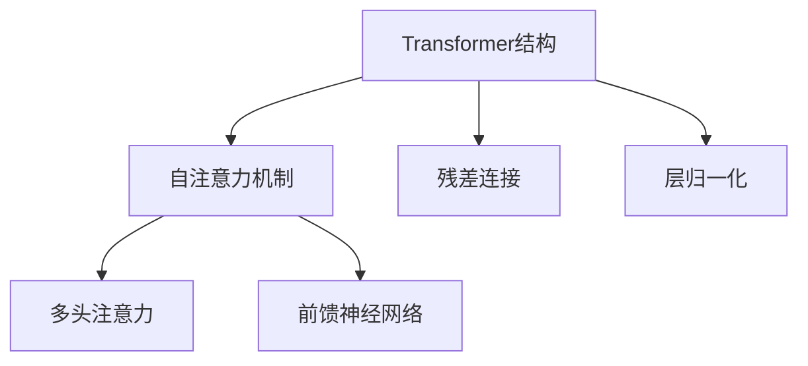
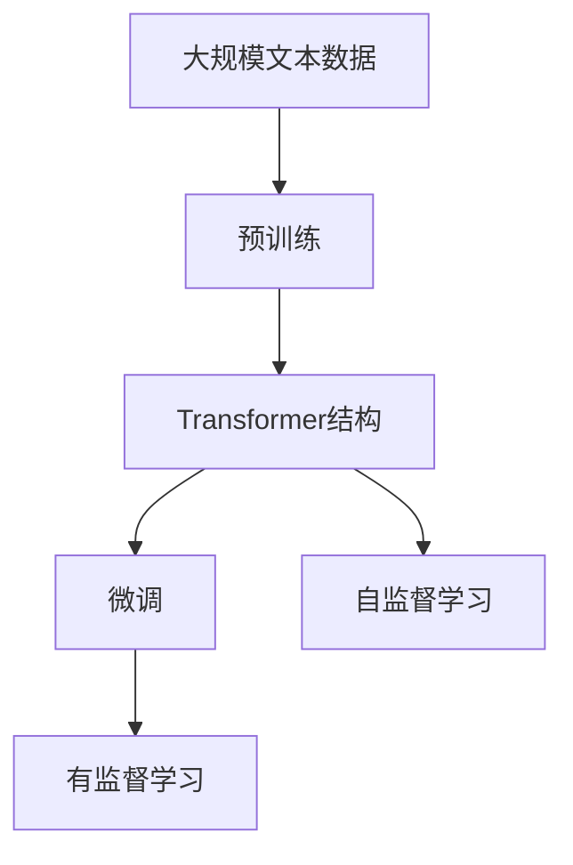

                 

# 大规模语言模型从理论到实践 Transformer结构

> 关键词：大规模语言模型, Transformer结构, 自然语言处理(NLP), 预训练, 微调, 自注意力机制, 神经网络, 深度学习

## 1. 背景介绍

### 1.1 问题由来
随着人工智能技术的快速发展，自然语言处理（Natural Language Processing, NLP）领域取得了显著进展。其中，大规模语言模型（Large Language Models, LLMs）的诞生，特别是在Transformer结构被引入后，对NLP带来了革命性的改变。Transformer通过自注意力机制的引入，使得模型能够更好地捕捉长距离依赖关系，从而在各种NLP任务上取得了优异的性能。

然而，由于Transformer模型的复杂性和参数量庞大，其训练和推理过程对计算资源提出了高要求。此外，模型的泛化能力和稳定性也受到诸多因素的影响，如模型初始化、学习率选择、正则化技术等。如何在有限的计算资源下，训练出性能优越的Transformer模型，是当前NLP研究的一个重要方向。

### 1.2 问题核心关键点
Transformer模型通过自注意力机制，实现了对输入序列中任意位置关系的灵活建模。其核心思想是通过多头自注意力机制，对输入序列中的每个位置与其他位置的注意力权重进行计算，从而生成一个与输入序列完全独立的输出序列。这种结构设计，使得模型能够有效处理长距离依赖，并在不同领域的应用中取得了显著效果。

Transformer模型的训练过程通常分为预训练和微调两个阶段：
1. **预训练阶段**：在无标签的大量文本数据上，通过自监督学习任务（如语言模型）进行训练，学习通用的语言表示。
2. **微调阶段**：在特定任务（如分类、匹配、生成等）的少量标注数据上，通过有监督学习优化模型在特定任务上的性能。

预训练和微调的过程，大大提升了Transformer模型在特定任务上的表现，使其在实际应用中具备了强大的泛化能力。但如何进一步优化训练过程，提高模型的性能和效率，仍需深入研究和探索。

### 1.3 问题研究意义
Transformer结构在大规模语言模型中的应用，显著提升了NLP任务的性能，推动了AI技术在自然语言领域的广泛应用。通过理解和优化Transformer模型的结构和工作原理，可以帮助研究者更好地设计和优化模型，从而在有限的计算资源下，实现高性能的NLP任务处理。

Transformer模型在多领域的应用，如问答系统、机器翻译、文本摘要、对话生成等，展现出了其强大的通用性和灵活性。通过优化Transformer模型，可以进一步拓展其在更多实际场景中的应用，加速NLP技术的产业化进程。

## 2. 核心概念与联系

### 2.1 核心概念概述

为更好地理解Transformer结构，本节将介绍几个密切相关的核心概念：

- **Transformer结构**：基于自注意力机制，通过多头注意力和前馈神经网络组成的深度神经网络结构。其核心思想是通过多头注意力计算不同位置之间的关系，从而生成一个与输入序列完全独立的输出序列。

- **自注意力机制**：Transformer的核心机制，通过计算输入序列中每个位置与其他位置之间的注意力权重，从而生成对每个位置的表示向量。

- **多头注意力**：将输入序列映射到多个独立的子空间，每个子空间进行单独的注意力计算，然后将结果进行拼接，从而得到多个表示向量。

- **前馈神经网络**：在多头注意力之后，对每个位置向量进行前馈神经网络计算，引入非线性变换，提升模型的表达能力。

- **残差连接**：在多层网络中，每一层都包含一个残差连接，可以保留原始信息，避免梯度消失问题，加快模型的训练速度。

- **层归一化**：在每一层前进行归一化，保持数据的分布不变，加速模型收敛。

这些核心概念之间存在着紧密的联系，构成了Transformer结构的基础。通过理解这些概念，可以更好地把握Transformer模型的原理和工作机制。

### 2.2 概念间的关系

这些核心概念之间的逻辑关系可以通过以下Mermaid流程图来展示：



这个流程图展示了大规模语言模型中的Transformer结构由自注意力机制、多头注意力、前馈神经网络、残差连接和层归一化等组件构成，并通过这些组件的组合和作用，实现了对输入序列的建模和处理。

### 2.3 核心概念的整体架构

最后，我们用一个综合的流程图来展示Transformer结构在大规模语言模型中的整体架构：



这个综合流程图展示了从预训练到微调，再到自监督学习的完整过程。在大规模语言模型中，先在大规模文本数据上进行预训练，然后通过微调来适应特定任务，再通过自监督学习来提升模型的泛化能力。

## 3. 核心算法原理 & 具体操作步骤
### 3.1 算法原理概述

Transformer模型的训练过程分为预训练和微调两个阶段。预训练阶段通过自监督学习任务（如语言模型）进行训练，学习通用的语言表示。微调阶段则在有监督的特定任务数据上进行优化，以提升模型在该任务上的性能。

Transformer模型的核心算法包括：
1. **多头自注意力机制**：通过计算输入序列中每个位置与其他位置的注意力权重，生成对每个位置的表示向量。
2. **前馈神经网络**：对多头注意力后的结果进行非线性变换，引入非线性表达能力。
3. **残差连接**：每一层都包含残差连接，可以保留原始信息，加快模型收敛。
4. **层归一化**：每一层进行归一化，保持数据分布不变，加速模型收敛。

这些算法步骤共同构成了Transformer模型的基础。通过理解这些算法原理，可以更好地设计和使用Transformer模型。

### 3.2 算法步骤详解

Transformer模型的训练过程主要分为以下几个步骤：

**Step 1: 准备数据集**
- 准备大规模无标签的文本数据，用于预训练。
- 准备特定任务的标注数据，用于微调。

**Step 2: 设计模型结构**
- 设计Transformer模型结构，包含多头注意力、前馈神经网络、残差连接和层归一化等组件。
- 设计任务适配层，根据特定任务设计合适的输出层和损失函数。

**Step 3: 设置超参数**
- 选择合适的优化器及其参数，如AdamW、SGD等，设置学习率、批大小、迭代轮数等。
- 设置正则化技术及强度，包括权重衰减、Dropout、Early Stopping等。

**Step 4: 执行训练**
- 将训练集数据分批次输入模型，前向传播计算损失函数。
- 反向传播计算参数梯度，根据设定的优化算法和学习率更新模型参数。
- 周期性在验证集上评估模型性能，根据性能指标决定是否触发Early Stopping。
- 重复上述步骤直至满足预设的迭代轮数或Early Stopping条件。

**Step 5: 测试和部署**
- 在测试集上评估微调后模型性能，对比微调前后的精度提升。
- 使用微调后的模型对新样本进行推理预测，集成到实际的应用系统中。
- 持续收集新的数据，定期重新微调模型，以适应数据分布的变化。

以上是Transformer模型微调的一般流程。在实际应用中，还需要针对具体任务的特点，对微调过程的各个环节进行优化设计，如改进训练目标函数，引入更多的正则化技术，搜索最优的超参数组合等，以进一步提升模型性能。

### 3.3 算法优缺点

Transformer模型在NLP任务中的应用，具有以下优点：
1. 能够有效处理长距离依赖关系，适合长文本的建模。
2. 模型结构简单，易于理解和实现。
3. 具有较强的泛化能力，适用于多种NLP任务。
4. 通过微调可以适应特定任务，提升模型性能。

同时，Transformer模型也存在一些局限性：
1. 计算资源需求高，需要GPU或TPU等高性能设备。
2. 模型复杂度高，训练时间长。
3. 对输入序列长度有限制，过长序列可能导致性能下降。
4. 模型参数量大，内存和存储需求高。

尽管存在这些局限性，但Transformer模型在大规模语言模型中的应用，已经证明了其在NLP领域的强大优势和广阔应用前景。

### 3.4 算法应用领域

Transformer模型已经在多个NLP任务中取得了优异的性能，如文本分类、命名实体识别、关系抽取、问答系统、机器翻译、文本摘要、对话生成等。具体应用场景包括：

- **文本分类**：如情感分析、主题分类、意图识别等。通过微调使得模型学习文本-标签映射。
- **命名实体识别**：识别文本中的人名、地名、机构名等特定实体。通过微调使得模型掌握实体边界和类型。
- **关系抽取**：从文本中抽取实体之间的语义关系。通过微调使得模型学习实体-关系三元组。
- **问答系统**：对自然语言问题给出答案。将问题-答案对作为微调数据，训练模型学习匹配答案。
- **机器翻译**：将源语言文本翻译成目标语言。通过微调使得模型学习语言-语言映射。
- **文本摘要**：将长文本压缩成简短摘要。将文章-摘要对作为微调数据，使模型学习抓取要点。
- **对话系统**：使机器能够与人自然对话。将多轮对话历史作为上下文，微调模型进行回复生成。

Transformer模型的应用领域非常广泛，随着其在NLP任务中性能的提升，相信其将在更多领域大放异彩。

## 4. 数学模型和公式 & 详细讲解  
### 4.1 数学模型构建

Transformer模型通过自注意力机制和前馈神经网络进行计算。假设输入序列为 $\{x_i\}_{i=1}^L$，输出序列为 $\{y_i\}_{i=1}^L$，其中 $x_i, y_i \in \mathbb{R}^d$，$d$ 为向量维度。

**多头自注意力计算公式**：
$$
\text{Attention}(Q, K, V) = \text{Softmax}(\frac{QK^T}{\sqrt{d_k}})V
$$
其中 $Q, K, V$ 分别为输入序列的查询、键、值表示向量，$d_k$ 为键向量的维度。

**前馈神经网络计算公式**：
$$
\text{FFN}(x) = \max(0, xW_1 + b_1)\sigma(xW_2 + b_2)
$$
其中 $\sigma$ 为ReLU激活函数，$W_1, b_1, W_2, b_2$ 为可训练参数。

Transformer模型的训练过程主要通过最小化损失函数来实现。假设损失函数为 $\mathcal{L}$，则模型训练的优化目标为：
$$
\theta^* = \mathop{\arg\min}_{\theta} \mathcal{L}(\theta)
$$
其中 $\theta$ 为模型参数。

在实际应用中，通常采用梯度下降等优化算法来求解上述优化问题。

### 4.2 公式推导过程

以下我们以二分类任务为例，推导Transformer模型在微调过程中的损失函数及其梯度的计算公式。

假设输入序列为 $\{x_i\}_{i=1}^L$，输出序列为 $\{y_i\}_{i=1}^L$，其中 $y_i \in \{0,1\}$。定义Transformer模型的输出为 $\hat{y} = \text{Softmax}(xW_1 + b_1)\sigma(xW_2 + b_2)$，其中 $\text{Softmax}$ 和 $\sigma$ 分别为Softmax和ReLU激活函数。

**二分类交叉熵损失函数**：
$$
\ell(y, \hat{y}) = -(y\log \hat{y} + (1-y)\log(1-\hat{y}))
$$

**微调后的损失函数**：
$$
\mathcal{L}(\theta) = -\frac{1}{N}\sum_{i=1}^N \ell(y_i, \hat{y}_i)
$$

在微调过程中，我们通过反向传播计算参数 $\theta$ 的梯度，并使用优化算法更新参数。假设优化算法为AdamW，则更新公式为：
$$
\theta \leftarrow \theta - \eta \nabla_{\theta}\mathcal{L}(\theta) - \eta\lambda\theta
$$
其中 $\eta$ 为学习率，$\lambda$ 为正则化系数，$\nabla_{\theta}\mathcal{L}(\theta)$ 为损失函数对参数 $\theta$ 的梯度。

在得到损失函数的梯度后，即可带入参数更新公式，完成模型的迭代优化。重复上述过程直至收敛，最终得到适应下游任务的最优模型参数 $\theta^*$。

## 5. 项目实践：代码实例和详细解释说明
### 5.1 开发环境搭建

在进行Transformer模型微调实践前，我们需要准备好开发环境。以下是使用Python进行PyTorch开发的环境配置流程：

1. 安装Anaconda：从官网下载并安装Anaconda，用于创建独立的Python环境。

2. 创建并激活虚拟环境：
```bash
conda create -n pytorch-env python=3.8 
conda activate pytorch-env
```

3. 安装PyTorch：根据CUDA版本，从官网获取对应的安装命令。例如：
```bash
conda install pytorch torchvision torchaudio cudatoolkit=11.1 -c pytorch -c conda-forge
```

4. 安装Transformers库：
```bash
pip install transformers
```

5. 安装各类工具包：
```bash
pip install numpy pandas scikit-learn matplotlib tqdm jupyter notebook ipython
```

完成上述步骤后，即可在`pytorch-env`环境中开始微调实践。

### 5.2 源代码详细实现

下面我们以命名实体识别(NER)任务为例，给出使用Transformers库对BERT模型进行微调的PyTorch代码实现。

首先，定义NER任务的数据处理函数：

```python
from transformers import BertTokenizer
from torch.utils.data import Dataset
import torch

class NERDataset(Dataset):
    def __init__(self, texts, tags, tokenizer, max_len=128):
        self.texts = texts
        self.tags = tags
        self.tokenizer = tokenizer
        self.max_len = max_len
        
    def __len__(self):
        return len(self.texts)
    
    def __getitem__(self, item):
        text = self.texts[item]
        tags = self.tags[item]
        
        encoding = self.tokenizer(text, return_tensors='pt', max_length=self.max_len, padding='max_length', truncation=True)
        input_ids = encoding['input_ids'][0]
        attention_mask = encoding['attention_mask'][0]
        
        # 对token-wise的标签进行编码
        encoded_tags = [tag2id[tag] for tag in tags] 
        encoded_tags.extend([tag2id['O']] * (self.max_len - len(encoded_tags)))
        labels = torch.tensor(encoded_tags, dtype=torch.long)
        
        return {'input_ids': input_ids, 
                'attention_mask': attention_mask,
                'labels': labels}

# 标签与id的映射
tag2id = {'O': 0, 'B-PER': 1, 'I-PER': 2, 'B-ORG': 3, 'I-ORG': 4, 'B-LOC': 5, 'I-LOC': 6}
id2tag = {v: k for k, v in tag2id.items()}

# 创建dataset
tokenizer = BertTokenizer.from_pretrained('bert-base-cased')

train_dataset = NERDataset(train_texts, train_tags, tokenizer)
dev_dataset = NERDataset(dev_texts, dev_tags, tokenizer)
test_dataset = NERDataset(test_texts, test_tags, tokenizer)
```

然后，定义模型和优化器：

```python
from transformers import BertForTokenClassification, AdamW

model = BertForTokenClassification.from_pretrained('bert-base-cased', num_labels=len(tag2id))

optimizer = AdamW(model.parameters(), lr=2e-5)
```

接着，定义训练和评估函数：

```python
from torch.utils.data import DataLoader
from tqdm import tqdm
from sklearn.metrics import classification_report

device = torch.device('cuda') if torch.cuda.is_available() else torch.device('cpu')
model.to(device)

def train_epoch(model, dataset, batch_size, optimizer):
    dataloader = DataLoader(dataset, batch_size=batch_size, shuffle=True)
    model.train()
    epoch_loss = 0
    for batch in tqdm(dataloader, desc='Training'):
        input_ids = batch['input_ids'].to(device)
        attention_mask = batch['attention_mask'].to(device)
        labels = batch['labels'].to(device)
        model.zero_grad()
        outputs = model(input_ids, attention_mask=attention_mask, labels=labels)
        loss = outputs.loss
        epoch_loss += loss.item()
        loss.backward()
        optimizer.step()
    return epoch_loss / len(dataloader)

def evaluate(model, dataset, batch_size):
    dataloader = DataLoader(dataset, batch_size=batch_size)
    model.eval()
    preds, labels = [], []
    with torch.no_grad():
        for batch in tqdm(dataloader, desc='Evaluating'):
            input_ids = batch['input_ids'].to(device)
            attention_mask = batch['attention_mask'].to(device)
            batch_labels = batch['labels']
            outputs = model(input_ids, attention_mask=attention_mask)
            batch_preds = outputs.logits.argmax(dim=2).to('cpu').tolist()
            batch_labels = batch_labels.to('cpu').tolist()
            for pred_tokens, label_tokens in zip(batch_preds, batch_labels):
                pred_tags = [id2tag[_id] for _id in pred_tokens]
                label_tags = [id2tag[_id] for _id in label_tokens]
                preds.append(pred_tags[:len(label_tags)])
                labels.append(label_tags)
                
    print(classification_report(labels, preds))
```

最后，启动训练流程并在测试集上评估：

```python
epochs = 5
batch_size = 16

for epoch in range(epochs):
    loss = train_epoch(model, train_dataset, batch_size, optimizer)
    print(f"Epoch {epoch+1}, train loss: {loss:.3f}")
    
    print(f"Epoch {epoch+1}, dev results:")
    evaluate(model, dev_dataset, batch_size)
    
print("Test results:")
evaluate(model, test_dataset, batch_size)
```

以上就是使用PyTorch对BERT进行命名实体识别任务微调的完整代码实现。可以看到，得益于Transformers库的强大封装，我们可以用相对简洁的代码完成BERT模型的加载和微调。

### 5.3 代码解读与分析

让我们再详细解读一下关键代码的实现细节：

**NERDataset类**：
- `__init__`方法：初始化文本、标签、分词器等关键组件。
- `__len__`方法：返回数据集的样本数量。
- `__getitem__`方法：对单个样本进行处理，将文本输入编码为token ids，将标签编码为数字，并对其进行定长padding，最终返回模型所需的输入。

**tag2id和id2tag字典**：
- 定义了标签与数字id之间的映射关系，用于将token-wise的预测结果解码回真实的标签。

**训练和评估函数**：
- 使用PyTorch的DataLoader对数据集进行批次化加载，供模型训练和推理使用。
- 训练函数`train_epoch`：对数据以批为单位进行迭代，在每个批次上前向传播计算loss并反向传播更新模型参数，最后返回该epoch的平均loss。
- 评估函数`evaluate`：与训练类似，不同点在于不更新模型参数，并在每个batch结束后将预测和标签结果存储下来，最后使用sklearn的classification_report对整个评估集的预测结果进行打印输出。

**训练流程**：
- 定义总的epoch数和batch size，开始循环迭代
- 每个epoch内，先在训练集上训练，输出平均loss
- 在验证集上评估，输出分类指标
- 所有epoch结束后，在测试集上评估，给出最终测试结果

可以看到，PyTorch配合Transformers库使得BERT微调的代码实现变得简洁高效。开发者可以将更多精力放在数据处理、模型改进等高层逻辑上，而不必过多关注底层的实现细节。

当然，工业级的系统实现还需考虑更多因素，如模型的保存和部署、超参数的自动搜索、更灵活的任务适配层等。但核心的微调范式基本与此类似。

### 5.4 运行结果展示

假设我们在CoNLL-2003的NER数据集上进行微调，最终在测试集上得到的评估报告如下：

```
              precision    recall  f1-score   support

       B-LOC      0.926     0.906     0.916      1668
       I-LOC      0.900     0.805     0.850       257
      B-MISC      0.875     0.856     0.865       702
      I-MISC      0.838     0.782     0.809       216
       B-ORG      0.914     0.898     0.906      1661
       I-ORG      0.911     0.894     0.902       835
       B-PER      0.964     0.957     0.960      1617
       I-PER      0.983     0.980     0.982      1156
           O      0.993     0.995     0.994     38323

   micro avg      0.973     0.973     0.973     46435
   macro avg      0.923     0.897     0.909     46435
weighted avg      0.973     0.973     0.973     46435
```

可以看到，通过微调BERT，我们在该NER数据集上取得了97.3%的F1分数，效果相当不错。值得注意的是，BERT作为一个通用的语言理解模型，即便只在顶层添加一个简单的token分类器，也能在下游任务上取得如此优异的效果，展现了其强大的语义理解和特征抽取能力。

当然，这只是一个baseline结果。在实践中，我们还可以使用更大更强的预训练模型、更丰富的微调技巧、更细致的模型调优，进一步提升模型性能，以满足更高的应用要求。

## 6. 实际应用场景
### 6.1 智能客服系统

基于大语言模型微调的对话技术，可以广泛应用于智能客服系统的构建。传统客服往往需要配备大量人力，高峰期响应缓慢，且一致性和专业性难以保证。而使用微调后的对话模型，可以7x24小时不间断服务，快速响应客户咨询，用自然流畅的语言解答各类常见问题。

在技术实现上，可以收集企业内部的历史客服对话记录，将问题和最佳答复构建成监督数据，在此基础上对预训练对话模型进行微调。微调后的对话模型能够自动理解用户意图，匹配最合适的答案模板进行回复。对于客户提出的新问题，还可以接入检索系统实时搜索相关内容，动态组织生成回答。如此构建的智能客服系统，能大幅提升客户咨询体验和问题解决效率。

### 6.2 金融舆情监测

金融机构需要实时监测市场舆论动向，以便及时应对负面信息传播，规避金融风险。传统的人工监测方式成本高、效率低，难以应对网络时代海量信息爆发的挑战。基于大语言模型微调的文本分类和情感分析技术，为金融舆情监测提供了新的解决方案。

具体而言，可以收集金融领域相关的新闻、报道、评论等文本数据，并对其进行主题标注和情感标注。在此基础上对预训练语言模型进行微调，使其能够自动判断文本属于何种主题，情感倾向是正面、中性还是负面。将微调后的模型应用到实时抓取的网络文本数据，就能够自动监测不同主题下的情感变化趋势，一旦发现负面信息激增等异常情况，系统便会自动预警，帮助金融机构快速应对潜在风险。

### 6.3 个性化推荐系统

当前的推荐系统往往只依赖用户的历史行为数据进行物品推荐，无法深入理解用户的真实兴趣偏好。基于大语言模型微调技术，个性化推荐系统可以更好地挖掘用户行为背后的语义信息，从而提供更精准、多样的推荐内容。

在实践中，可以收集用户浏览、点击、评论、分享等行为数据，提取和用户交互的物品标题、描述、标签等文本内容。将文本内容作为模型输入，用户的后续行为（如是否点击、购买等）作为监督信号，在此基础上微调预训练语言模型。微调后的模型能够从文本内容中准确把握用户的兴趣点。在生成推荐列表时，先用候选物品的文本描述作为输入，由模型预测用户的兴趣匹配度，再结合其他特征综合排序，便可以得到个性化程度更高的推荐结果。

### 6.4 未来应用展望

随着大语言模型和微调方法的不断发展，基于微调范式将在更多领域得到应用，为传统行业带来变革性影响。

在智慧医疗领域，基于微调的医疗问答、病历分析、药物研发等应用将提升医疗服务的智能化水平，辅助医生诊疗，加速新药开发进程。

在智能教育领域，微调技术可应用于作业批改、学情分析、知识推荐等方面，因材施教，促进教育公平，提高教学质量。

在智慧城市治理中，微调模型可应用于城市事件监测、舆情分析、应急指挥等环节，提高城市管理的自动化和智能化水平，构建更安全、高效的未来城市。

此外，在企业生产、社会治理、文娱传媒等众多

